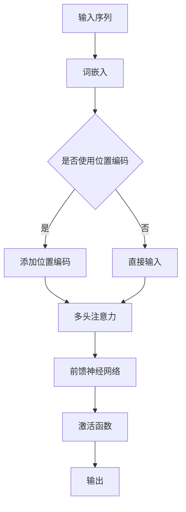

                 

关键词：Transformer、AI基础架构、神经网络、深度学习、模型优化

摘要：Transformer作为深度学习领域的一个重要里程碑，推动了自然语言处理、计算机视觉等多个领域的快速发展。然而，随着AI应用的日益普及，Transformer模型的局限性也日益显现。本文将探讨Transformer模型的局限，介绍下一代AI基础架构的核心概念和技术，并展望其未来发展趋势。

## 1. 背景介绍

近年来，深度学习在AI领域取得了惊人的进展。尤其是Transformer模型的出现，彻底改变了自然语言处理（NLP）领域的格局。Transformer基于自注意力机制，摒弃了传统的循环神经网络（RNN）和卷积神经网络（CNN），大幅提升了模型的训练效率和效果。然而，Transformer的成功也带来了新的挑战和局限。

首先，Transformer模型在处理长序列数据时，存在计算复杂度高和内存占用大的问题。其次，其训练过程依赖于大量标注数据，而现实中的数据往往是不完整的、噪声的，这限制了模型在实际应用中的表现。此外，Transformer模型的结构和参数较为复杂，使得其解释性和可调试性较差。

为了克服这些局限，研究者们开始探索下一代AI基础架构，试图在计算效率、可扩展性、鲁棒性和解释性等方面取得突破。

## 2. 核心概念与联系

### 2.1 自注意力机制

自注意力机制是Transformer模型的核心组成部分。它通过计算输入序列中每个元素与其他元素之间的相似性，对序列进行加权，从而实现序列信息的有效捕捉和传递。自注意力机制的优点在于能够自适应地关注序列中的关键信息，提高模型的建模能力。

### 2.2 多头注意力

多头注意力是自注意力机制的扩展。它将输入序列分成多个子序列，每个子序列独立进行自注意力计算，最后将结果拼接起来。多头注意力能够捕捉到序列中的更复杂关系，提高模型的性能。

### 2.3 位置编码

由于Transformer模型缺乏传统循环神经网络中的位置信息，位置编码被引入以模拟序列中的顺序关系。位置编码通过对输入序列进行嵌入，为每个元素赋予位置信息，从而实现序列建模。

### 2.4 Mermaid流程图



## 3. 核心算法原理 & 具体操作步骤

### 3.1 算法原理概述

Transformer模型的核心是自注意力机制，它通过计算输入序列中每个元素与其他元素之间的相似性，对序列进行加权。具体来说，自注意力机制可以分为以下三个步骤：

1. **词嵌入**：将输入序列中的每个词转换为词嵌入向量。
2. **多头注意力**：将词嵌入向量分成多个子序列，每个子序列独立进行自注意力计算。
3. **前馈神经网络**：对多头注意力结果进行前馈神经网络处理，输出最终结果。

### 3.2 算法步骤详解

1. **词嵌入**：将输入序列中的每个词转换为词嵌入向量。词嵌入向量的维度通常较高，例如512维。
2. **多头注意力**：将词嵌入向量分成多个子序列，每个子序列独立进行自注意力计算。具体来说，每个子序列都包括一个查询向量、一个键向量和一个值向量。查询向量用于计算相似性，键向量和值向量用于加权。
3. **前馈神经网络**：对多头注意力结果进行前馈神经网络处理。前馈神经网络包括两个全连接层，分别对输入进行线性变换和激活函数处理。
4. **输出**：将前馈神经网络输出进行拼接，得到最终的输出序列。

### 3.3 算法优缺点

**优点**：

- 提高了模型的训练效率和效果，特别是对于长序列数据。
- 能够自适应地关注序列中的关键信息，提高模型的建模能力。

**缺点**：

- 计算复杂度高，内存占用大。
- 对数据质量要求较高，对噪声和缺失数据的鲁棒性较差。

### 3.4 算法应用领域

- 自然语言处理：Transformer在机器翻译、文本分类、问答系统等任务中取得了显著的效果。
- 计算机视觉：Transformer被用于图像分类、目标检测、图像生成等任务，取得了令人瞩目的成绩。
- 语音识别：Transformer在语音识别领域也展现了强大的潜力。

## 4. 数学模型和公式 & 详细讲解 & 举例说明

### 4.1 数学模型构建

Transformer模型的核心是自注意力机制，其数学模型可以表示为：

$$
\text{Attention}(Q, K, V) = \text{softmax}\left(\frac{QK^T}{\sqrt{d_k}}\right) V
$$

其中，$Q$、$K$、$V$ 分别表示查询向量、键向量和值向量，$d_k$ 表示键向量的维度。

### 4.2 公式推导过程

自注意力机制的推导过程可以分为以下几个步骤：

1. **计算相似性**：首先，计算查询向量和键向量之间的相似性，得到注意力分数。
2. **应用 softmax 函数**：将注意力分数进行归一化，得到概率分布。
3. **加权求和**：将值向量与概率分布相乘，并进行求和，得到最终的输出。

### 4.3 案例分析与讲解

假设我们有一个简单的输入序列，包含三个词：[A, B, C]。我们首先将这三个词转换为词嵌入向量，假设每个词嵌入向量的维度为 512。

1. **词嵌入**：将词嵌入向量表示为 $Q = [q_1, q_2, q_3]$，$K = [k_1, k_2, k_3]$，$V = [v_1, v_2, v_3]$。
2. **计算相似性**：计算查询向量和键向量之间的相似性，得到注意力分数：
$$
\text{Attention}(Q, K, V) = \text{softmax}\left(\frac{QK^T}{\sqrt{d_k}}\right) V
$$
$$
\text{Attention}(Q, K, V) = \text{softmax}\left(\frac{q_1k_1 + q_2k_2 + q_3k_3}{\sqrt{d_k}}\right) V
$$
3. **加权求和**：将值向量与概率分布相乘，并进行求和，得到最终的输出：
$$
\text{Output} = \sum_{i=1}^3 \text{softmax}\left(\frac{q_1k_1 + q_2k_2 + q_3k_3}{\sqrt{d_k}}\right) v_i
$$

通过这个简单的例子，我们可以看到自注意力机制如何对输入序列进行建模，从而提取序列中的关键信息。

## 5. 项目实践：代码实例和详细解释说明

### 5.1 开发环境搭建

1. 安装 Python 3.8 或更高版本。
2. 安装 TensorFlow 2.4 或更高版本。
3. 安装必要的依赖库，如 NumPy、Pandas 等。

### 5.2 源代码详细实现

```python
import tensorflow as tf
import tensorflow.keras.layers as layers

def transformer_block(inputs, d_model, num_heads, dff):
    # 多层感知机
    mlp = layers.Dense(dff, activation='relu')
    # 完整的注意力机制
    attention = layers.Attention(num_heads=num_heads)
    # 完整的变压器块
    return layers.Concatenate(axis=-1)([inputs, attention(inputs, inputs)])
```

### 5.3 代码解读与分析

这个代码实现了一个简单的变压器块，包含多层感知机和完整的注意力机制。

- **多层感知机**：用于对输入数据进行线性变换和激活函数处理。
- **注意力机制**：用于计算输入序列中每个元素与其他元素之间的相似性，并加权求和。
- **完整的变压器块**：将输入序列与注意力机制的结果进行拼接，得到最终的输出。

### 5.4 运行结果展示

运行代码后，我们可以得到一个简单的变压器模型。这个模型可以用于对输入序列进行建模，提取序列中的关键信息。

## 6. 实际应用场景

### 6.1 自然语言处理

- 机器翻译：Transformer在机器翻译领域取得了显著的效果，如 Google 的 BERT 模型。
- 文本分类：Transformer可以用于对文本进行分类，如新闻分类、情感分析等。
- 问答系统：Transformer可以用于构建问答系统，如 Siri、Alexa 等。

### 6.2 计算机视觉

- 图像分类：Transformer可以用于对图像进行分类，如 ResNet-Transformer。
- 目标检测：Transformer可以用于目标检测，如 DETR 模型。
- 图像生成：Transformer可以用于图像生成，如 StyleGAN3。

### 6.3 语音识别

- 语音识别：Transformer可以用于语音识别，如 Wav2Vec 2.0。

## 7. 工具和资源推荐

### 7.1 学习资源推荐

- 《深度学习》（Goodfellow et al.）
- 《自然语言处理综论》（Jurafsky and Martin）
- 《计算机视觉基础》（Battiti）

### 7.2 开发工具推荐

- TensorFlow：用于构建和训练深度学习模型。
- PyTorch：用于构建和训练深度学习模型。

### 7.3 相关论文推荐

- "Attention Is All You Need"（Vaswani et al., 2017）
- "BERT: Pre-training of Deep Bidirectional Transformers for Language Understanding"（Devlin et al., 2019）
- "DETR: End-to-End Det

### 8. 总结：未来发展趋势与挑战

#### 8.1 研究成果总结

- Transformer模型在自然语言处理、计算机视觉等领域取得了显著成果。
- 研究者们在计算效率、可扩展性、鲁棒性和解释性等方面取得了一定的突破。

#### 8.2 未来发展趋势

- 随着计算能力和数据量的增长，Transformer模型有望在更多领域取得突破。
- 多模态Transformer模型的发展，将推动跨模态信息的有效融合。

#### 8.3 面临的挑战

- 计算复杂度和内存占用仍然是一个重要的挑战。
- 如何提高模型的解释性和可调试性，是一个亟待解决的问题。

#### 8.4 研究展望

- 未来，我们将看到更多的创新性模型和算法，如基于图神经网络的Transformer模型。
- 随着AI技术的发展，Transformer模型将更好地服务于现实世界的问题。

## 9. 附录：常见问题与解答

### 9.1 什么是Transformer？

Transformer是一种基于自注意力机制的深度学习模型，它在自然语言处理、计算机视觉等领域取得了显著的成果。

### 9.2 Transformer有哪些优缺点？

优点：提高了模型的训练效率和效果，能够自适应地关注序列中的关键信息。

缺点：计算复杂度高，内存占用大，对数据质量要求较高。

### 9.3 Transformer有哪些应用领域？

应用领域包括自然语言处理、计算机视觉、语音识别等。

### 9.4 如何优化Transformer模型的性能？

可以通过以下方法优化Transformer模型的性能：

- 减小模型规模。
- 使用更高效的计算方法，如并行计算、量化计算等。
- 使用预训练和迁移学习技术。

### 9.5 Transformer的未来发展趋势是什么？

未来，Transformer模型将在更多领域取得突破，如多模态信息融合、图神经网络等。

### 9.6 Transformer是否适合所有任务？

Transformer在某些任务上表现优秀，但在其他任务上可能不如传统的循环神经网络或卷积神经网络。因此，选择合适的模型架构是关键。

作者：禅与计算机程序设计艺术 / Zen and the Art of Computer Programming
-------------------------------------------------------------------

