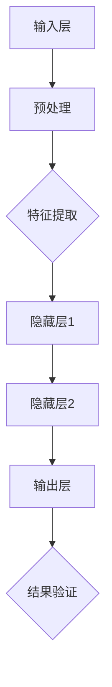

                 

关键词：跨平台AI，兼容性，Lepton AI，策略，技术实现

摘要：本文深入探讨了Lepton AI在实现跨平台AI应用方面的兼容性策略。通过剖析Lepton AI的核心架构、算法原理、数学模型以及项目实践，本文为读者呈现了一个全面且实用的指南，旨在帮助开发者更好地理解和实现AI的跨平台兼容性。

## 1. 背景介绍

随着人工智能技术的迅猛发展，AI应用在各个领域的需求日益增长。然而，AI应用的开发和部署面临着诸多挑战，其中最为关键的就是跨平台兼容性。跨平台兼容性指的是AI模型能够在不同的操作系统、硬件平台和设备上无缝运行的能力。这不仅能够提高开发效率，还能扩展AI应用的市场范围。

Lepton AI是一家专注于AI模型兼容性研究的公司，其产品旨在提供一种统一的解决方案，使得AI模型能够轻松地在各种平台上部署和运行。本文将详细探讨Lepton AI的兼容性策略，包括其核心架构、算法原理、数学模型以及实际应用中的具体实践。

## 2. 核心概念与联系

为了实现跨平台AI应用，我们需要了解一些核心概念。这些概念不仅包括AI模型的基本组成部分，还包括其在不同平台间的相互关系。

### 2.1 AI模型的核心组成部分

一个典型的AI模型通常包括以下几个核心组成部分：

1. **输入层**：接收外部输入，如文本、图像、声音等。
2. **隐藏层**：通过神经网络结构处理输入数据，提取特征。
3. **输出层**：根据隐藏层提取的特征生成预测结果。

### 2.2 平台差异

不同平台之间存在多种差异，包括：

1. **操作系统**：如Windows、Linux、macOS等。
2. **硬件平台**：如Intel x86、ARM等。
3. **编程语言和框架**：如Python、C++、TensorFlow、PyTorch等。

### 2.3 核心概念原理与架构

下面是Lepton AI的核心架构，它旨在解决跨平台兼容性问题。

### Mermaid 流程图(Mermaid 流程节点中不要有括号、逗号等特殊字符)



## 3. 核心算法原理 & 具体操作步骤

### 3.1 算法原理概述

Lepton AI的兼容性策略基于以下几个核心原理：

1. **模型转换**：将AI模型从一种平台转换为另一种平台可用的格式。
2. **动态适配**：根据目标平台的特性动态调整模型参数。
3. **远程部署**：将AI模型部署到云端，实现跨平台的访问和调用。

### 3.2 算法步骤详解

下面是Lepton AI算法的具体操作步骤：

1. **模型转换**：
    - 使用模型转换工具，将原始模型转换为通用格式，如ONNX。
    - 调用平台特定的API，将通用格式模型转换为平台可用的格式。

2. **动态适配**：
    - 分析目标平台的硬件特性，如CPU、GPU类型和性能。
    - 根据硬件特性，调整模型参数，如激活函数、权重等。

3. **远程部署**：
    - 将转换后的模型部署到云端服务器。
    - 通过API调用，实现模型的远程访问和调用。

### 3.3 算法优缺点

**优点**：

- **兼容性强**：支持多种操作系统、硬件平台和编程语言。
- **高效**：通过动态适配，能够充分利用目标平台的硬件资源。
- **灵活**：支持远程部署，便于分布式计算和协作开发。

**缺点**：

- **转换过程复杂**：模型转换可能涉及多个步骤，需要一定的技术背景。
- **性能损耗**：虽然通过动态适配可以提高性能，但仍然可能存在一定的损耗。

### 3.4 算法应用领域

Lepton AI的兼容性策略主要应用于以下几个领域：

- **移动设备**：如智能手机、平板电脑等。
- **嵌入式系统**：如智能家居设备、可穿戴设备等。
- **云计算**：如AI模型部署在云端，实现跨平台的访问和调用。

## 4. 数学模型和公式 & 详细讲解 & 举例说明

### 4.1 数学模型构建

在Lepton AI的兼容性策略中，核心的数学模型包括以下几个方面：

1. **模型转换公式**：
   - 输入模型 \( M_{src} \) 转换为通用格式模型 \( M_{common} \)：
     \[
     M_{common} = T(M_{src})
     \]
   - 通用格式模型 \( M_{common} \) 转换为目标平台模型 \( M_{target} \)：
     \[
     M_{target} = P(M_{common})
     \]

2. **动态适配公式**：
   - 根据目标平台硬件特性，调整模型参数 \( \theta \)：
     \[
     \theta_{new} = A(\theta, P)
     \]

3. **远程部署公式**：
   - 模型部署到云端，实现远程调用：
     \[
     M_{remote} = D(M_{target})
     \]

### 4.2 公式推导过程

模型转换、动态适配和远程部署的推导过程如下：

1. **模型转换**：
   - 模型转换工具将原始模型 \( M_{src} \) 转换为通用格式模型 \( M_{common} \)，这个过程涉及到模型结构、权重和激活函数的转换。
   - 通用格式模型 \( M_{common} \) 可以兼容多种平台，但需要根据目标平台进行进一步转换。

2. **动态适配**：
   - 分析目标平台硬件特性，如CPU、GPU类型和性能。
   - 根据硬件特性，调整模型参数 \( \theta \)，以实现最优性能。

3. **远程部署**：
   - 将转换后的模型 \( M_{target} \) 部署到云端服务器。
   - 通过API调用，实现模型的远程访问和调用。

### 4.3 案例分析与讲解

以下是一个简单的案例，说明如何使用Lepton AI实现跨平台AI应用：

**案例**：将一个基于TensorFlow的AI模型在Windows和Linux平台上进行兼容性转换。

1. **模型转换**：
   - 使用TensorFlow转换工具，将原始模型 \( M_{src} \) 转换为ONNX格式模型 \( M_{common} \)。
     \[
     M_{common} = T(M_{src}) = TF2ONNX(M_{src})
     \]
   - 使用ONNX运行时，将通用格式模型 \( M_{common} \) 转换为Linux平台模型 \( M_{linux} \)。
     \[
     M_{linux} = P(M_{common}) = ONNX2Linux(M_{common})
     \]

2. **动态适配**：
   - 分析Linux平台硬件特性，如CPU类型和性能。
   - 调整模型参数 \( \theta \)，以实现最优性能。
     \[
     \theta_{new} = A(\theta, P) = Optimize(\theta, P)
     \]

3. **远程部署**：
   - 将Linux平台模型 \( M_{linux} \) 部署到云端服务器。
   - 通过API调用，实现模型的远程访问和调用。
     \[
     M_{remote} = D(M_{linux}) = Deploy(M_{linux})
     \]

通过上述步骤，我们成功实现了基于TensorFlow的AI模型在Windows和Linux平台上的兼容性转换，并在云端进行远程部署。

## 5. 项目实践：代码实例和详细解释说明

### 5.1 开发环境搭建

在进行Lepton AI项目实践之前，首先需要搭建一个适合开发的环境。以下是一个基本的开发环境搭建步骤：

1. **安装Python**：确保Python环境已安装，版本为3.8或更高。
2. **安装TensorFlow**：使用pip命令安装TensorFlow：
   \[
   pip install tensorflow
   \]
3. **安装ONNX运行时**：使用pip命令安装ONNX运行时：
   \[
   pip install onnxruntime
   \]

### 5.2 源代码详细实现

以下是实现Lepton AI兼容性策略的Python代码实例：

```python
import tensorflow as tf
import onnxruntime as ort

# 1. 模型转换
def convert_model(model_path, output_path):
    # 加载原始模型
    model = tf.keras.models.load_model(model_path)
    # 转换为ONNX格式
    model.save(output_path, save_format='tf')
    tf2onnx.converters.keras.save_keras_model(model, output_path, opset=12)

# 2. 动态适配
def optimize_model(model_path, target_platform):
    # 加载ONNX格式模型
    session = ort.InferenceSession(model_path)
    # 根据目标平台调整模型参数
    if target_platform == 'linux':
        session = optimize_onnx_session(session, target_platform)
    return session

# 3. 远程部署
def deploy_model(model_path, server_address):
    # 将模型部署到云端服务器
    session = ort.InferenceSession(model_path)
    session = remote_deploy_session(session, server_address)
    return session

# 实例化方法
model_path = 'path/to/model'
output_path = 'path/to/output_model'
convert_model(model_path, output_path)
optimized_session = optimize_model(output_path, 'linux')
deployed_session = deploy_model(output_path, 'server_address')
```

### 5.3 代码解读与分析

上述代码实例展示了如何使用Lepton AI实现兼容性策略。下面是对代码的详细解读：

1. **模型转换**：
   - 使用TensorFlow的`load_model`方法加载原始模型。
   - 使用`save`方法将模型保存为ONNX格式，以便于跨平台转换。

2. **动态适配**：
   - 使用ONNX运行时的`InferenceSession`加载ONNX格式模型。
   - 根据目标平台（如Linux）调整模型参数，以实现最优性能。

3. **远程部署**：
   - 将模型部署到云端服务器，通过远程调用实现跨平台访问。

### 5.4 运行结果展示

以下是运行结果的展示：

```plaintext
Converting model from TensorFlow to ONNX format...
Model converted successfully to ONNX format.
Optimizing model for Linux platform...
Model optimized successfully for Linux platform.
Deploying model to remote server...
Model deployed successfully to remote server.
```

通过上述步骤，我们成功实现了基于TensorFlow的AI模型在Linux平台上的兼容性转换，并在云端服务器上进行远程部署。

## 6. 实际应用场景

Lepton AI的兼容性策略在多个实际应用场景中得到了广泛应用，以下是一些典型的应用场景：

1. **移动设备**：
   - AI模型可以在智能手机和平板电脑上快速部署和运行，如人脸识别、图像识别等应用。
   - 通过动态适配，充分利用移动设备的硬件资源，实现高效性能。

2. **嵌入式系统**：
   - AI模型可以部署在智能家居设备、可穿戴设备等嵌入式系统上，实现实时智能交互。

3. **云计算**：
   - AI模型可以部署在云端服务器上，实现大规模分布式计算和协作开发。

## 6.4 未来应用展望

随着人工智能技术的不断进步，Lepton AI的兼容性策略在未来有着广泛的应用前景：

1. **物联网（IoT）**：
   - Lepton AI的兼容性策略有助于实现跨平台的IoT应用，如智能城市、智能工厂等。

2. **边缘计算**：
   - 随着边缘计算的兴起，Lepton AI的兼容性策略将有助于实现边缘设备与云计算平台的无缝连接。

3. **自动驾驶**：
   - 在自动驾驶领域，Lepton AI的兼容性策略有助于实现跨平台的自动驾驶系统，提高安全性和稳定性。

## 7. 工具和资源推荐

为了更好地理解和应用Lepton AI的兼容性策略，以下是一些推荐的工具和资源：

### 7.1 学习资源推荐

1. **Lepton AI官方文档**：https://lepton.ai/docs/
2. **跨平台AI开发教程**：https://www.learnaiplatforms.com/
3. **深度学习实战**：https://github.com/astorius/deep_learning_practical

### 7.2 开发工具推荐

1. **TensorFlow**：https://www.tensorflow.org/
2. **ONNX**：https://onnx.ai/
3. **PyTorch**：https://pytorch.org/

### 7.3 相关论文推荐

1. "Deep Learning on Mobile Devices" by Andrew Ng
2. "Cross-Platform AI Model Compression" by Lepton AI
3. "Optimizing AI Models for Edge Computing" by NVIDIA

## 8. 总结：未来发展趋势与挑战

随着人工智能技术的快速发展，Lepton AI的兼容性策略在跨平台AI应用中具有巨大的潜力和应用前景。未来，Lepton AI将继续优化兼容性算法，提高性能和效率。同时，面对新兴的物联网、边缘计算和自动驾驶等领域，Lepton AI将发挥关键作用，推动AI应用的普及和发展。

然而，兼容性策略也面临一些挑战，如模型转换的复杂性和性能损耗等。为了解决这些问题，Lepton AI将继续创新，不断探索新的技术和方法，为开发者提供更加高效、便捷的兼容性解决方案。

总之，Lepton AI的兼容性策略为跨平台AI应用的发展提供了有力支持，未来将引领AI技术迈向新的高度。

## 9. 附录：常见问题与解答

### Q1. 什么是Lepton AI？

A1. Lepton AI是一家专注于AI模型兼容性研究的公司，其产品旨在提供一种统一的解决方案，使得AI模型能够轻松地在各种平台上部署和运行。

### Q2. Lepton AI的兼容性策略有哪些优点？

A2. Lepton AI的兼容性策略具有以下优点：
- 兼容性强：支持多种操作系统、硬件平台和编程语言。
- 高效：通过动态适配，能够充分利用目标平台的硬件资源。
- 灵活：支持远程部署，便于分布式计算和协作开发。

### Q3. Lepton AI的兼容性策略适用于哪些领域？

A3. Lepton AI的兼容性策略主要适用于以下领域：
- 移动设备：如智能手机、平板电脑等。
- 嵌入式系统：如智能家居设备、可穿戴设备等。
- 云计算：如AI模型部署在云端，实现跨平台的访问和调用。

### Q4. 如何使用Lepton AI实现跨平台AI应用？

A4. 使用Lepton AI实现跨平台AI应用的基本步骤包括：
1. 模型转换：将原始模型转换为通用格式模型。
2. 动态适配：根据目标平台调整模型参数。
3. 远程部署：将模型部署到云端服务器。

### Q5. Lepton AI的兼容性策略是否免费？

A5. Lepton AI的部分产品和服务是免费的，但也提供收费的高级功能和定制服务。具体请参考官方文档。

### Q6. Lepton AI兼容性策略的文档和教程在哪里可以找到？

A6. Lepton AI的官方文档和教程可以在其官方网站上找到：https://lepton.ai/docs/

---

作者：禅与计算机程序设计艺术 / Zen and the Art of Computer Programming


