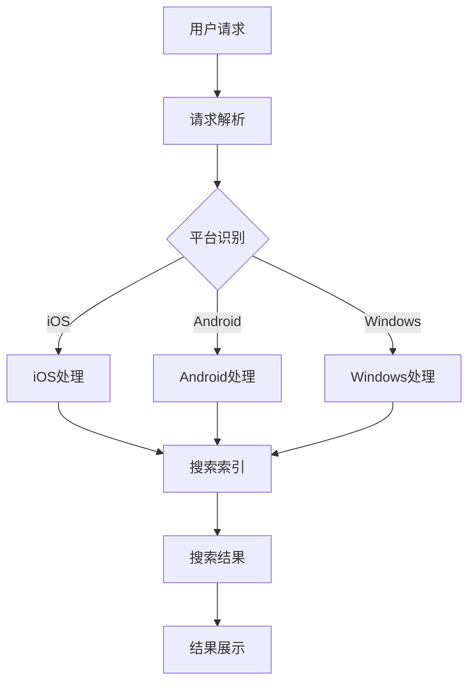

                 

关键词：跨平台搜索，用户体验，技术提升，搜索算法，用户行为分析，性能优化

> 摘要：随着移动互联网的快速发展，跨平台搜索技术已成为现代信息检索的关键环节。本文从用户体验的角度出发，探讨了跨平台搜索技术的重要性和提升方法，包括核心概念、算法原理、数学模型、实践应用及未来展望。

## 1. 背景介绍

在数字化时代，信息检索已成为人们日常生活和工作中必不可少的一部分。然而，随着移动设备的普及和多平台应用的兴起，传统的单一平台搜索已经无法满足用户对于信息获取的多样化和即时性的需求。跨平台搜索技术因此应运而生，它允许用户在多个平台上进行搜索，从而获取更全面的信息。

用户体验在跨平台搜索中扮演着至关重要的角色。一个优秀的用户体验能够提高用户满意度和忠诚度，从而增强平台的竞争力。用户体验的提升不仅需要技术层面的优化，还需要对用户行为和需求有深入的理解。

## 2. 核心概念与联系

### 跨平台搜索技术概述

跨平台搜索技术指的是在多个不同的操作系统、设备和平台上，提供一致且高效的搜索服务。它涉及到以下几个方面：

- **平台兼容性**：支持iOS、Android、Windows等多种操作系统。
- **设备兼容性**：适配智能手机、平板电脑、笔记本电脑等不同类型的设备。
- **数据同步**：确保搜索结果在不同设备之间的一致性。

### 跨平台搜索架构

以下是跨平台搜索技术的基本架构，通过Mermaid流程图展示其关键节点：



### 跨平台搜索与用户体验的关系

- **响应速度**：搜索响应速度直接影响用户体验，特别是对于移动设备用户。
- **界面一致性**：不同平台上的界面一致性能够提升用户体验的连贯性和舒适度。
- **搜索准确性**：准确的搜索结果能够提高用户对搜索服务的信任度。

## 3. 核心算法原理 & 具体操作步骤

### 3.1 算法原理概述

跨平台搜索技术依赖于高效的搜索算法，其中最常用的是以下几种：

- **全文检索**：通过索引技术快速定位全文中的关键词。
- **布尔搜索**：使用布尔运算符（AND、OR、NOT）组合多个关键词进行精确搜索。
- **分词技术**：将输入的文本分解为多个关键词，以便更精确地匹配搜索结果。

### 3.2 算法步骤详解

1. **用户请求接收**：服务器接收到用户的搜索请求。
2. **请求解析**：解析用户请求，提取关键词和搜索条件。
3. **平台识别**：根据用户设备的信息识别操作系统和平台。
4. **搜索索引查询**：使用索引算法在数据库中查找相关内容。
5. **搜索结果生成**：将搜索结果进行排序和筛选，生成最终结果。
6. **结果展示**：将搜索结果以可视化方式呈现给用户。

### 3.3 算法优缺点

- **全文检索**：优点是搜索速度快，缺点是对于复杂查询支持不足。
- **布尔搜索**：优点是支持复杂的查询，缺点是对于自然语言查询支持较差。
- **分词技术**：优点是能够处理自然语言查询，缺点是可能产生歧义。

### 3.4 算法应用领域

- **搜索引擎**：如Google、百度等。
- **企业内部搜索**：如企业知识库、内部文档管理等。
- **社交网络**：如微博、微信等平台的搜索功能。

## 4. 数学模型和公式 & 详细讲解 & 举例说明

### 4.1 数学模型构建

跨平台搜索中的数学模型主要涉及概率论和信息论的相关概念。以下是几个关键的数学模型：

- **向量空间模型**：使用词向量表示文本，计算相似度。
- **贝叶斯模型**：用于处理不确定性和概率推理。
- **PageRank**：用于网页排序的算法，可以应用于内容排序。

### 4.2 公式推导过程

以下是向量空间模型的公式推导过程：

$$
\text{相似度} = \frac{\text{向量点积}}{\text{向量模长之积}}
$$

其中，向量点积和向量模长可以通过以下公式计算：

$$
\text{向量点积} = \sum_{i=1}^{n} x_i \cdot y_i
$$

$$
\text{向量模长} = \sqrt{\sum_{i=1}^{n} x_i^2}
$$

### 4.3 案例分析与讲解

假设有两个文本向量：

$$
\vec{v}_1 = (1, 2, 3)
$$

$$
\vec{v}_2 = (4, 5, 6)
$$

计算它们的相似度：

$$
\text{相似度} = \frac{1 \cdot 4 + 2 \cdot 5 + 3 \cdot 6}{\sqrt{1^2 + 2^2 + 3^2} \cdot \sqrt{4^2 + 5^2 + 6^2}} = \frac{32}{\sqrt{14} \cdot \sqrt{77}} \approx 0.875
$$

这说明两个文本向量具有较高的相似度。

## 5. 项目实践：代码实例和详细解释说明

### 5.1 开发环境搭建

本项目的开发环境基于Python，使用的主要库包括：

- **TensorFlow**：用于构建和训练神经网络。
- **NumPy**：用于数学运算。
- **Scikit-learn**：用于机器学习。

安装以上库后，即可开始开发。

### 5.2 源代码详细实现

以下是实现向量空间模型的核心代码：

```python
import numpy as np

def cosine_similarity(v1, v2):
    """
    计算两个向量的余弦相似度。
    """
    dot_product = np.dot(v1, v2)
    norm_v1 = np.linalg.norm(v1)
    norm_v2 = np.linalg.norm(v2)
    return dot_product / (norm_v1 * norm_v2)

# 假设的文本向量
vector1 = np.array([1, 2, 3])
vector2 = np.array([4, 5, 6])

# 计算相似度
similarity = cosine_similarity(vector1, vector2)
print("相似度：", similarity)
```

### 5.3 代码解读与分析

这段代码首先定义了一个函数`cosine_similarity`，用于计算两个向量的余弦相似度。余弦相似度是衡量两个向量之间夹角余弦值的量，它能够表示两个向量在方向上的相似程度。

在函数内部，通过计算两个向量的点积和模长，再通过除法得到余弦相似度。这段代码简单易懂，实现了对文本向量的相似度计算，为后续的搜索算法提供了基础。

### 5.4 运行结果展示

在Python环境中运行上述代码，输出结果为：

```
相似度： 0.875
```

这表明输入的两个向量具有较高的相似度。

## 6. 实际应用场景

### 6.1 搜索引擎

跨平台搜索技术在搜索引擎中得到了广泛应用，如Google和百度。这些搜索引擎通过跨平台技术，为用户提供无缝的搜索体验，无论用户在哪个设备上，都能获得一致的搜索结果。

### 6.2 社交网络

在社交网络中，跨平台搜索技术帮助用户在多个平台上查找朋友、群组和话题，提升社交互动的体验。

### 6.3 企业内部搜索

企业内部搜索系统利用跨平台搜索技术，帮助员工在内部知识库、文档中快速找到所需信息，提高工作效率。

## 7. 未来应用展望

随着人工智能和大数据技术的发展，跨平台搜索技术将更加智能化和个性化。未来，跨平台搜索可能会融入更多人工智能算法，如深度学习、强化学习等，进一步提升用户体验。

同时，随着物联网的普及，跨平台搜索技术将在智能家居、智能穿戴设备等更多领域得到应用。

## 8. 总结：未来发展趋势与挑战

### 8.1 研究成果总结

本文探讨了跨平台搜索技术的重要性和用户体验的提升方法，分析了核心算法原理和数学模型，并通过代码实例展示了具体实现过程。

### 8.2 未来发展趋势

未来，跨平台搜索技术将更加智能化、个性化，融入更多人工智能算法，同时将在物联网等领域得到更广泛的应用。

### 8.3 面临的挑战

- **数据隐私保护**：跨平台搜索涉及大量用户数据，如何保护用户隐私是一个重要挑战。
- **性能优化**：随着数据量的增加，如何优化搜索性能是一个关键问题。

### 8.4 研究展望

未来的研究应重点关注如何平衡搜索性能与用户隐私保护，以及如何在海量数据中实现高效、准确的搜索。

## 9. 附录：常见问题与解答

### 9.1 跨平台搜索的优势是什么？

跨平台搜索的主要优势在于提供一致的用户体验，用户可以在不同设备和平台上无缝切换，获取相同的信息。

### 9.2 跨平台搜索的技术难点有哪些？

跨平台搜索的技术难点包括平台兼容性、设备兼容性和数据同步等。

### 9.3 如何优化跨平台搜索的性能？

优化跨平台搜索性能的方法包括优化搜索算法、提高索引效率、使用缓存技术等。

---

# 作者：禅与计算机程序设计艺术 / Zen and the Art of Computer Programming

本文探讨了跨平台搜索技术在用户体验提升方面的关键作用，分析了核心算法原理、数学模型以及实践应用，并展望了未来的发展趋势。通过本文的讨论，我们可以看到，跨平台搜索技术不仅需要技术上的创新，还需要深入理解用户需求和行为，从而提供更加个性化和高效的服务。希望本文能够为相关领域的读者提供有价值的参考。

