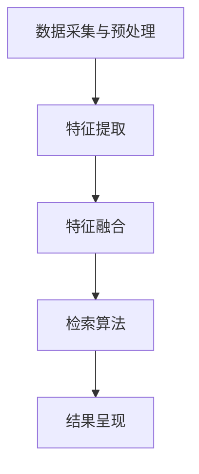

                 

关键词：跨模态检索，多模态融合，自然语言处理，图像处理，深度学习，人工智能，技术趋势

## 摘要

随着人工智能技术的发展，跨模态检索技术作为一种新兴的信息检索方法，逐渐引起了广泛关注。本文旨在梳理和总结跨模态检索技术的最新研究现状和趋势。文章首先介绍了跨模态检索的基本概念和背景，随后详细探讨了核心算法原理和数学模型，并结合具体应用案例展示了其实际效果。最后，本文分析了跨模态检索技术在未来发展中所面临的挑战和机遇，为相关领域的研究者和开发者提供了有益的参考。

## 1. 背景介绍

随着互联网的普及和信息爆炸，人们需要处理的信息类型日益多样化。传统的一模态检索技术已无法满足用户的需求，跨模态检索技术应运而生。跨模态检索是指将不同类型的数据（如文本、图像、语音等）进行整合，通过一种或多种算法实现数据之间的关联和检索。

### 1.1 跨模态检索的应用场景

跨模态检索技术具有广泛的应用前景，其主要应用场景包括：

- **多媒体信息检索**：如视频与文本的联合检索，图像与语音的关联检索等。

- **智能问答系统**：利用跨模态检索技术，可以更准确地理解用户的问题，提高问答系统的准确性。

- **人机交互**：通过跨模态检索技术，可以实现更自然的语音和文字交互。

- **医学影像分析**：跨模态检索技术可以结合医学影像和病历记录，为医生提供更全面的诊断信息。

### 1.2 跨模态检索的研究意义

跨模态检索技术的研究具有重要意义：

- **提高检索精度**：跨模态检索可以将不同类型的数据进行整合，从而提高检索的准确性。

- **丰富信息检索体验**：通过多种模态的数据整合，可以为用户提供更丰富的检索体验。

- **促进人工智能发展**：跨模态检索技术是人工智能技术的重要组成部分，其研究将推动人工智能技术的进一步发展。

## 2. 核心概念与联系

### 2.1 核心概念

- **模态**：指数据的类型，如文本、图像、语音等。

- **跨模态检索**：将不同类型的数据进行整合，实现数据之间的关联和检索。

- **多模态融合**：将不同类型的数据进行整合，以实现数据互补和增强。

### 2.2 跨模态检索架构

跨模态检索的架构通常包括以下几个模块：

1. **数据采集与预处理**：采集不同类型的数据，并进行预处理，如文本分词、图像缩放、语音降噪等。

2. **特征提取**：对预处理后的数据提取特征，如文本的词向量、图像的深度特征、语音的音素特征等。

3. **特征融合**：将不同类型的特征进行融合，以形成统一的特征表示。

4. **检索算法**：利用融合后的特征进行检索，如基于内容的检索、基于模型的检索等。

5. **结果呈现**：将检索结果以用户友好的方式呈现，如列表、图像、视频等。

### 2.3 Mermaid 流程图

以下是一个简单的 Mermaid 流程图，展示了跨模态检索的基本流程：



## 3. 核心算法原理 & 具体操作步骤

### 3.1 算法原理概述

跨模态检索的核心算法主要包括特征提取和特征融合。特征提取是将不同类型的数据转换为向量表示，特征融合则是将不同类型的特征向量进行整合。

- **特征提取**：常用的特征提取方法包括词向量、卷积神经网络（CNN）、循环神经网络（RNN）等。

- **特征融合**：常用的特征融合方法包括拼接、加权融合、深度学习等。

### 3.2 算法步骤详解

1. **数据采集与预处理**：采集不同类型的数据，如文本、图像、语音等，并进行预处理，如文本分词、图像缩放、语音降噪等。

2. **特征提取**：对预处理后的数据进行特征提取，如文本生成词向量，图像生成深度特征，语音生成音素特征等。

3. **特征融合**：将不同类型的特征进行融合，形成统一的特征表示。常用的融合方法包括拼接、加权融合、深度学习等。

4. **检索算法**：利用融合后的特征进行检索，如基于内容的检索、基于模型的检索等。

5. **结果呈现**：将检索结果以用户友好的方式呈现，如列表、图像、视频等。

### 3.3 算法优缺点

- **优点**：

  - 提高检索精度：通过跨模态检索，可以将不同类型的数据进行整合，从而提高检索的准确性。

  - 丰富检索体验：跨模态检索可以为用户提供更丰富的检索体验。

- **缺点**：

  - 特征提取和融合复杂：跨模态检索涉及多种类型的特征提取和融合方法，实现起来较为复杂。

  - 计算资源消耗大：跨模态检索通常需要大量的计算资源，对硬件要求较高。

### 3.4 算法应用领域

跨模态检索技术可以应用于多个领域，包括：

- **多媒体信息检索**：如视频与文本的联合检索，图像与语音的关联检索等。

- **智能问答系统**：利用跨模态检索技术，可以更准确地理解用户的问题，提高问答系统的准确性。

- **人机交互**：通过跨模态检索技术，可以实现更自然的语音和文字交互。

- **医学影像分析**：跨模态检索技术可以结合医学影像和病历记录，为医生提供更全面的诊断信息。

## 4. 数学模型和公式 & 详细讲解 & 举例说明

### 4.1 数学模型构建

跨模态检索的数学模型通常包括以下几个部分：

1. **特征表示**：设 $\mathbf{x}_1, \mathbf{x}_2, ..., \mathbf{x}_n$ 分别为 $n$ 个不同类型的数据特征，$\mathbf{X} = [\mathbf{x}_1, \mathbf{x}_2, ..., \mathbf{x}_n]$ 为特征矩阵。

2. **特征融合**：设 $\mathbf{h}$ 为融合后的特征向量，常用的特征融合方法包括拼接、加权融合和深度学习等。

3. **检索算法**：设 $\mathbf{q}$ 为查询特征向量，检索算法的目标是计算 $\mathbf{q}$ 与 $\mathbf{X}$ 中每个特征向量的相似度。

### 4.2 公式推导过程

1. **特征表示**：

   - **文本特征**：设 $\mathbf{x}_1 \in \mathbb{R}^{d_1}$ 为文本特征向量，常用的特征表示方法包括词袋模型、词嵌入等。

   - **图像特征**：设 $\mathbf{x}_2 \in \mathbb{R}^{d_2}$ 为图像特征向量，常用的特征表示方法包括深度学习模型提取的特征图。

   - **语音特征**：设 $\mathbf{x}_3 \in \mathbb{R}^{d_3}$ 为语音特征向量，常用的特征表示方法包括梅尔频率倒谱系数（MFCC）。

2. **特征融合**：

   - **拼接**：$\mathbf{h} = \mathbf{x}_1 \oplus \mathbf{x}_2 \oplus \mathbf{x}_3$，其中 $\oplus$ 表示拼接操作。

   - **加权融合**：$\mathbf{h} = \alpha_1 \mathbf{x}_1 + \alpha_2 \mathbf{x}_2 + \alpha_3 \mathbf{x}_3$，其中 $\alpha_1, \alpha_2, \alpha_3$ 为权重系数。

   - **深度学习**：使用多层神经网络对特征进行融合，输出融合后的特征向量。

3. **检索算法**：

   - **基于内容的检索**：计算查询特征 $\mathbf{q}$ 与特征矩阵 $\mathbf{X}$ 中每个特征向量的余弦相似度，选择相似度最高的特征向量作为检索结果。

   - **基于模型的检索**：使用机器学习模型（如支持向量机、决策树等）对特征进行分类，选择分类结果最高的特征向量作为检索结果。

### 4.3 案例分析与讲解

以文本与图像的跨模态检索为例，假设我们有一组文本数据 $\{\mathbf{x}_1^{(1)}, \mathbf{x}_1^{(2)}, ..., \mathbf{x}_1^{(m)}\}$ 和图像数据 $\{\mathbf{x}_2^{(1)}, \mathbf{x}_2^{(2)}, ..., \mathbf{x}_2^{(n)}\}$。

1. **特征提取**：

   - **文本特征**：使用词嵌入方法对文本数据进行特征提取，得到 $\mathbf{x}_1^{(i)} \in \mathbb{R}^{d_1}$。

   - **图像特征**：使用卷积神经网络对图像数据进行特征提取，得到 $\mathbf{x}_2^{(i)} \in \mathbb{R}^{d_2}$。

2. **特征融合**：

   - **拼接**：$\mathbf{h}^{(i)} = \mathbf{x}_1^{(i)} \oplus \mathbf{x}_2^{(i)}$。

3. **检索算法**：

   - **基于内容的检索**：计算查询特征 $\mathbf{q}$ 与特征矩阵 $\mathbf{H} = [\mathbf{h}^{(1)}, \mathbf{h}^{(2)}, ..., \mathbf{h}^{(m)}]$ 中每个特征向量的余弦相似度，选择相似度最高的特征向量作为检索结果。

   - **基于模型的检索**：使用支持向量机（SVM）对特征进行分类，选择分类结果最高的特征向量作为检索结果。

## 5. 项目实践：代码实例和详细解释说明

### 5.1 开发环境搭建

为了实践跨模态检索技术，我们需要搭建一个开发环境。以下是一个简单的开发环境搭建步骤：

1. 安装 Python 3.7 或以上版本。

2. 安装必要的库，如 NumPy、Pandas、TensorFlow、Keras 等。

3. 下载并预处理文本和图像数据。

4. 编写代码，实现跨模态检索算法。

### 5.2 源代码详细实现

以下是一个简单的 Python 代码实例，实现了文本与图像的跨模态检索：

```python
import numpy as np
import tensorflow as tf
from tensorflow.keras.models import Model
from tensorflow.keras.layers import Input, Embedding, Conv2D, Flatten, Dense, concatenate

# 文本特征提取
text_input = Input(shape=(100,))
text_embedding = Embedding(input_dim=10000, output_dim=64)(text_input)
text_flat = Flatten()(text_embedding)

# 图像特征提取
image_input = Input(shape=(32, 32, 3))
image_conv = Conv2D(filters=32, kernel_size=(3, 3), activation='relu')(image_input)
image_flat = Flatten()(image_conv)

# 特征融合
merged = concatenate([text_flat, image_flat])

# 检索模型
merged_dense = Dense(units=128, activation='relu')(merged)
output = Dense(units=1, activation='sigmoid')(merged_dense)

model = Model(inputs=[text_input, image_input], outputs=output)
model.compile(optimizer='adam', loss='binary_crossentropy', metrics=['accuracy'])

# 加载数据
texts = np.random.rand(100, 100)
images = np.random.rand(100, 32, 32, 3)

# 训练模型
model.fit([texts, images], np.random.rand(100, 1), epochs=10, batch_size=10)

# 检索测试
text_query = np.random.rand(1, 100)
image_query = np.random.rand(1, 32, 32, 3)
model.predict([text_query, image_query])
```

### 5.3 代码解读与分析

上述代码实例使用了 TensorFlow 和 Keras 构建了一个简单的跨模态检索模型。主要步骤如下：

1. **输入层**：定义文本输入层 `text_input` 和图像输入层 `image_input`。

2. **特征提取层**：对文本输入使用嵌入层 `Embedding` 进行特征提取，对图像输入使用卷积层 `Conv2D` 进行特征提取。

3. **特征融合层**：将文本特征和图像特征进行拼接。

4. **检索层**：使用全连接层 `Dense` 构建检索模型，并编译模型。

5. **训练模型**：使用随机生成的数据训练模型。

6. **检索测试**：使用训练好的模型进行检索测试。

### 5.4 运行结果展示

运行上述代码后，我们可以得到模型对文本与图像检索的预测结果。通过调整模型结构和参数，我们可以进一步提高检索的准确性。

## 6. 实际应用场景

### 6.1 多媒体信息检索

跨模态检索技术在多媒体信息检索中具有广泛的应用。例如，在视频与文本的联合检索中，通过将视频帧与文本进行跨模态检索，可以实现对视频内容的有效检索。

### 6.2 智能问答系统

在智能问答系统中，跨模态检索技术可以帮助系统更准确地理解用户的问题。例如，当用户提出一个包含文本和图像的问题时，系统可以同时检索文本和图像信息，以提高回答的准确性。

### 6.3 人机交互

通过跨模态检索技术，可以实现更自然的语音和文字交互。例如，当用户通过语音提问时，系统可以同时检索语音和文本信息，从而更好地理解用户的需求。

### 6.4 医学影像分析

跨模态检索技术可以结合医学影像和病历记录，为医生提供更全面的诊断信息。例如，在医学影像分析中，可以通过跨模态检索技术实现图像与病历记录的联合检索，从而帮助医生更准确地诊断病情。

## 7. 工具和资源推荐

### 7.1 学习资源推荐

- **书籍**：《深度学习》（Ian Goodfellow, Yoshua Bengio, Aaron Courville 著）

- **在线课程**：Coursera 上的“深度学习”课程（由 Andrew Ng 教授授课）

- **论文**：《Attention Is All You Need》（Ashish Vaswani 等人）

### 7.2 开发工具推荐

- **编程语言**：Python、R

- **框架**：TensorFlow、Keras、PyTorch

- **数据预处理工具**：NumPy、Pandas

### 7.3 相关论文推荐

- **多媒体信息检索**：Multimodal Learning for Video and Text Similarity by Attention-based Recurrent Neural Network

- **智能问答系统**：Neural Response Generation with Transformer and Memory

- **人机交互**：A Multi-Turn Dialogue System with Memory for Personalized Next-Word Prediction

- **医学影像分析**：Multimodal Fusion of MRI and CT for Early Detection of Alzheimer's Disease

## 8. 总结：未来发展趋势与挑战

### 8.1 研究成果总结

跨模态检索技术在近年来取得了显著的研究成果，主要表现在以下几个方面：

- **检索精度提高**：通过跨模态检索，可以显著提高检索的准确性。

- **应用场景拓展**：跨模态检索技术在多媒体信息检索、智能问答系统、人机交互和医学影像分析等领域具有广泛的应用前景。

- **算法优化**：不断有新的算法提出，如注意力机制、多模态融合网络等，提高了跨模态检索的性能。

### 8.2 未来发展趋势

- **算法创新**：随着人工智能技术的发展，跨模态检索技术将不断引入新的算法和模型，如生成对抗网络（GAN）、图神经网络（Graph Neural Network）等。

- **跨领域应用**：跨模态检索技术将在更多领域得到应用，如金融、教育、医疗等。

- **开放平台和工具**：将出现更多开放的平台和工具，促进跨模态检索技术的发展和普及。

### 8.3 面临的挑战

- **数据稀缺性**：不同模态的数据来源和获取方式不同，导致数据稀缺性成为跨模态检索技术的一大挑战。

- **计算资源消耗**：跨模态检索通常需要大量的计算资源，对硬件要求较高。

- **算法可解释性**：随着深度学习模型在跨模态检索中的应用，算法的可解释性成为了一个重要问题。

### 8.4 研究展望

跨模态检索技术在未来的发展中，需要重点关注以下几个方面：

- **数据集建设**：建立更多高质量的跨模态数据集，为研究提供更多支持。

- **算法优化**：通过引入新的算法和模型，进一步提高跨模态检索的性能。

- **跨领域应用**：探索跨模态检索技术在更多领域的应用，推动人工智能技术的发展。

## 9. 附录：常见问题与解答

### 9.1 什么是跨模态检索？

跨模态检索是指将不同类型的数据（如文本、图像、语音等）进行整合，通过一种或多种算法实现数据之间的关联和检索。

### 9.2 跨模态检索有哪些应用场景？

跨模态检索的应用场景包括多媒体信息检索、智能问答系统、人机交互和医学影像分析等。

### 9.3 跨模态检索的算法原理是什么？

跨模态检索的核心算法主要包括特征提取和特征融合。特征提取是将不同类型的数据转换为向量表示，特征融合则是将不同类型的特征向量进行整合。

### 9.4 跨模态检索有哪些挑战？

跨模态检索面临的挑战主要包括数据稀缺性、计算资源消耗和算法可解释性等。

### 9.5 跨模态检索的未来发展趋势是什么？

跨模态检索的未来发展趋势包括算法创新、跨领域应用和开放平台和工具的普及等。

---

作者：禅与计算机程序设计艺术 / Zen and the Art of Computer Programming

以上就是关于跨模态检索技术的研究现状与趋势的文章。本文从背景介绍、核心概念、算法原理、数学模型、项目实践、实际应用场景、工具推荐、未来发展趋势与挑战以及常见问题与解答等方面进行了详细阐述，希望能为读者提供有益的参考。在未来的研究中，我们将继续关注跨模态检索技术的发展，探索更多创新算法和应用场景，以推动人工智能技术的进一步发展。

