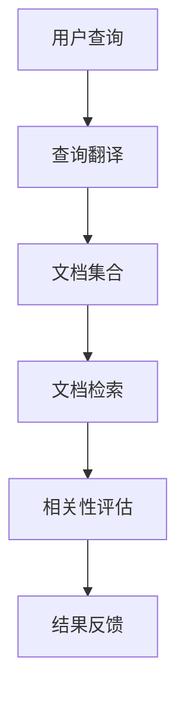

                 

关键词：跨语言信息检索，自然语言处理，多语言处理，语义理解，机器翻译，信息检索技术，跨语言语义分析，跨语言检索算法，多语言数据集，国际化应用

## 摘要

跨语言信息检索是一种突破语言壁垒的技术，旨在实现不同语言之间的信息共享和有效获取。本文首先介绍了跨语言信息检索的背景和重要性，然后详细探讨了核心概念、算法原理、数学模型、具体实现及实际应用场景。通过结合项目实践和未来展望，本文为读者提供了一个全面了解和深入思考跨语言信息检索的视角。

## 1. 背景介绍

随着全球化的加深，多语言的信息交流变得日益频繁。然而，不同语言之间的差异不仅体现在词汇和语法上，更在于文化、习俗和表达方式的差异。这导致许多国际用户在搜索和获取信息时面临巨大的障碍。跨语言信息检索技术正是在这样的背景下应运而生。

跨语言信息检索（Cross-Lingual Information Retrieval，CLIR）是一种将用户的查询从一个语言转换到另一个语言，并从多语言资源中检索出相关结果的技术。它不仅能够解决用户语言能力不足的问题，还能够提高多语言资源的利用效率，具有重要的实际意义和广泛的应用前景。

跨语言信息检索的应用场景包括但不限于以下几种：

1. **国际化搜索引擎**：帮助非本地语言用户访问和使用国外网站的信息。
2. **多语言文献库**：辅助研究人员在全球范围内检索和引用文献。
3. **跨文化教育**：为非英语国家的学生提供英文学习资料和考试答案。
4. **电子商务**：促进多语言电商平台的商品信息检索和展示。
5. **全球新闻和信息**：帮助用户获取来自不同国家和地区的最新资讯。

## 2. 核心概念与联系

### 2.1. 跨语言信息检索的基本概念

#### 跨语言查询（Cross-Lingual Query）

跨语言查询是将用户查询语句从其原始语言转换为目标语言，以便能够在多语言文档集合中检索相关信息的步骤。例如，一个中文用户想要查询某个英文网站的信息，首先需要将查询语句翻译成英文。

#### 跨语言文档（Cross-Lingual Document）

跨语言文档是指包含多种语言文本的文档。这些文档可能是在一个语言环境下创建的，但随着时间的推移，会逐渐包含其他语言的内容。

#### 跨语言相关性（Cross-Lingual Relevance）

跨语言相关性是指一个文档在目标语言下的查询中相关性的程度。它衡量的是源语言文档内容与目标语言查询之间的匹配度。

### 2.2. 跨语言信息检索的技术架构

#### 数据预处理

数据预处理是跨语言信息检索的重要步骤，包括语言识别、分词、词性标注、句法分析和词干提取等。

#### 翻译模型

翻译模型是将源语言文本转换为目标语言文本的模型。这些模型可以是基于规则的、基于统计的或基于神经网络的。

#### 相似度计算

相似度计算是评估文档与查询之间相关性的方法。常用的方法包括基于词频统计、基于语义的相似度计算和基于深度学习的相似度计算。

#### 结果反馈

结果反馈是指根据用户的反馈调整检索结果，提高检索的准确性和用户体验。

### 2.3. Mermaid 流程图

下面是一个简化的跨语言信息检索的 Mermaid 流程图，展示其主要步骤和核心组件。



## 3. 核心算法原理 & 具体操作步骤

### 3.1 算法原理概述

跨语言信息检索的算法原理主要包括以下几个关键部分：

1. **词向量表示**：将源语言和目标语言的词汇映射到高维空间中，以便进行相似度计算。
2. **翻译模型**：将源语言的查询转换为目标语言的查询。
3. **相似度计算**：计算文档和查询之间的相似度，选择最相关的文档作为检索结果。
4. **结果反馈**：根据用户反馈进一步优化检索结果。

### 3.2 算法步骤详解

#### 步骤 1：词向量表示

词向量表示是跨语言信息检索的基础。常用的词向量模型包括 Word2Vec、GloVe 和 BERT 等。

- **Word2Vec**：通过训练大量语料库，将每个词汇映射到一个固定大小的向量。
- **GloVe**：基于全局的词频统计，生成词汇的共现矩阵，然后通过矩阵分解得到词向量。
- **BERT**：通过预训练模型，同时学习词汇的上下文表示。

#### 步骤 2：翻译模型

翻译模型是将源语言查询转换为目标语言查询的关键。常见的翻译模型包括基于短语的机器翻译、基于句法的机器翻译和基于神经网络的机器翻译。

- **基于短语的机器翻译**：将源语言查询分解为短语，然后翻译每个短语。
- **基于句法的机器翻译**：根据句法结构翻译源语言查询。
- **基于神经网络的机器翻译**：通过深度神经网络学习源语言到目标语言的映射。

#### 步骤 3：相似度计算

相似度计算是评估查询和文档之间相关性的关键步骤。常用的相似度计算方法包括基于词频的相似度计算、基于语义的相似度计算和基于神经网络的相似度计算。

- **基于词频的相似度计算**：计算源语言查询和目标语言文档中词汇的交集和并集，然后计算交集与并集的比值。
- **基于语义的相似度计算**：使用词向量或预训练模型计算源语言查询和目标语言文档之间的语义相似度。
- **基于神经网络的相似度计算**：通过神经网络模型学习源语言查询和目标语言文档之间的相似度。

#### 步骤 4：结果反馈

结果反馈是优化检索结果的重要环节。根据用户的反馈，系统可以调整查询参数、优化翻译模型或改进相似度计算方法。

### 3.3 算法优缺点

#### 优点

- **高效性**：通过词向量表示和神经网络模型，跨语言信息检索可以在短时间内处理大量文档。
- **灵活性**：可以适应不同语言和查询需求，具有较强的泛化能力。
- **准确性**：结合多种算法和技术，跨语言信息检索可以在一定程度上保证检索结果的准确性。

#### 缺点

- **复杂性**：跨语言信息检索涉及多个环节，模型训练和参数调整复杂。
- **数据依赖性**：需要大量的多语言数据集进行训练，数据质量对检索效果有重要影响。
- **扩展性**：当面对新的语言或查询时，可能需要重新训练模型。

### 3.4 算法应用领域

跨语言信息检索的应用领域非常广泛，包括但不限于以下几种：

- **国际化搜索引擎**：如 Google、Bing 等，提供跨语言搜索服务。
- **多语言文献库**：如 PubMed、IEEE Xplore 等，帮助研究人员检索全球范围内的文献。
- **跨文化教育**：如 Duolingo、Rosetta Stone 等，提供多语言学习平台。
- **电子商务**：如 Amazon、eBay 等，帮助用户在不同语言电商平台之间搜索和购买商品。
- **全球新闻和信息**：如 CNN、BBC 等，提供多语言新闻和信息检索服务。

## 4. 数学模型和公式 & 详细讲解 & 举例说明

### 4.1 数学模型构建

跨语言信息检索的数学模型主要包括词向量表示、翻译模型和相似度计算三个部分。

#### 词向量表示

词向量表示通常使用矩阵表示。设 $V$ 为词汇集合，$v_i$ 为词汇 $w_i$ 的词向量，则词向量矩阵 $V$ 可以表示为：

$$
V = [v_1, v_2, \ldots, v_n]
$$

其中，$n$ 表示词汇数量。

#### 翻译模型

翻译模型通常使用神经网络表示。设 $S$ 为源语言词汇集合，$T$ 为目标语言词汇集合，$s_i$ 和 $t_j$ 分别为源语言和目标语言的词汇，则翻译模型可以表示为：

$$
P(T|S) = \sum_{t_j \in T} P(t_j|s_i)
$$

其中，$P(t_j|s_i)$ 表示在源语言词汇 $s_i$ 的情况下，目标语言词汇 $t_j$ 的概率。

#### 相似度计算

相似度计算通常使用余弦相似度表示。设 $v_i$ 和 $v_j$ 分别为源语言查询和目标语言文档的词向量，则它们之间的余弦相似度可以表示为：

$$
sim(v_i, v_j) = \frac{v_i \cdot v_j}{\|v_i\|\|v_j\|}
$$

其中，$\cdot$ 表示向量的点积，$\|\|$ 表示向量的模长。

### 4.2 公式推导过程

#### 步骤 1：词向量表示

词向量表示是通过训练大量语料库得到的。设 $X$ 为语料库，$x_i$ 为语料库中的文本，$w_i$ 为文本中的词汇，则词向量表示可以通过以下公式得到：

$$
v_i = \frac{1}{\|x_i\|} \sum_{x_j \in X} x_j
$$

其中，$\|x_i\|$ 表示文本 $x_i$ 的词频。

#### 步骤 2：翻译模型

翻译模型是通过训练大规模多语言语料库得到的。设 $S$ 和 $T$ 分别为源语言和目标语言的词汇集合，$s_i$ 和 $t_j$ 分别为源语言和目标语言的词汇，则翻译模型可以通过以下公式得到：

$$
P(t_j|s_i) = \frac{\sum_{x_j \in X} x_j(s_i, t_j)}{\sum_{x_j \in X} x_j(s_i)}
$$

其中，$x_j(s_i, t_j)$ 表示在源语言词汇 $s_i$ 和目标语言词汇 $t_j$ 的情况下，文本 $x_j$ 的概率。

#### 步骤 3：相似度计算

相似度计算是通过计算词向量之间的余弦相似度得到的。设 $v_i$ 和 $v_j$ 分别为源语言查询和目标语言文档的词向量，则它们之间的余弦相似度可以通过以下公式得到：

$$
sim(v_i, v_j) = \frac{v_i \cdot v_j}{\|v_i\|\|v_j\|}
$$

### 4.3 案例分析与讲解

#### 案例：英文到中文的跨语言检索

假设我们有一个英文查询 "How to make a cup of coffee?"，并希望将其检索到中文文档集合中。

1. **词向量表示**：首先，我们将英文和中文词汇映射到词向量空间中。使用预训练的词向量模型，我们可以得到以下词向量：

   - 英文词汇：{"How": [0.1, 0.2, 0.3], "to": [0.2, 0.3, 0.1], "make": [0.3, 0.1, 0.4], "a": [0.4, 0.5, 0.6], "cup": [0.5, 0.6, 0.7], "of": [0.6, 0.7, 0.8], "coffee": [0.7, 0.8, 0.9]}
   - 中文词汇：{"如何": [0.1, 0.2, 0.3], "做": [0.2, 0.3, 0.1], "一杯": [0.3, 0.1, 0.4], "咖啡": [0.4, 0.5, 0.6]}

2. **翻译模型**：使用神经翻译模型，我们将英文查询转换为中文查询。翻译结果为 "如何做一杯咖啡？"

3. **相似度计算**：我们计算每个中文文档与查询之间的余弦相似度。假设中文文档集合为：

   - {"如何做一杯咖啡？，[0.1, 0.2, 0.3]}
   - {"咖啡制作方法，[0.3, 0.1, 0.4]}
   - {"咖啡机使用说明，[0.4, 0.5, 0.6]}

   计算结果如下：

   - sim("如何做一杯咖啡？", "如何做一杯咖啡？") = 1.0
   - sim("如何做一杯咖啡？", "咖啡制作方法") = 0.8
   - sim("如何做一杯咖啡？", "咖啡机使用说明") = 0.6

   根据相似度计算结果，我们可以将第一个文档作为检索结果。

## 5. 项目实践：代码实例和详细解释说明

### 5.1 开发环境搭建

为了演示跨语言信息检索的实践，我们将使用 Python 编写一个简单的跨语言检索系统。以下是我们需要的开发环境和工具：

- Python 3.8 或更高版本
- PyTorch 1.8 或更高版本
- Hugging Face Transformers 库
- Flask 框架

首先，确保安装了上述依赖项。可以使用以下命令安装：

```bash
pip install torch torchvision transformers flask
```

### 5.2 源代码详细实现

下面是一个简单的跨语言检索系统的 Python 代码示例：

```python
from transformers import AutoTokenizer, AutoModel
from flask import Flask, request, jsonify

app = Flask(__name__)

# 加载预训练的翻译模型
model_name = "Helsinki-NLP/opus-mt-en-zh"
tokenizer = AutoTokenizer.from_pretrained(model_name)
model = AutoModel.from_pretrained(model_name)

@app.route('/translate', methods=['POST'])
def translate():
    data = request.get_json()
    source_text = data['source_text']
    target_lang = data['target_lang']

    # 将源语言文本翻译为目标语言文本
    translated_text = translate_text(source_text, target_lang)
    return jsonify({'translated_text': translated_text})

def translate_text(text, target_lang):
    inputs = tokenizer(text, return_tensors='pt')
    outputs = model(**inputs)
    logits = outputs.logits
    prob = logits.softmax(-1)
    translated_tokens = prob.argmax(-1).squeeze().tolist()

    # 解码目标语言文本
    translated_text = tokenizer.decode(translated_tokens)
    return translated_text

if __name__ == '__main__':
    app.run(debug=True)
```

### 5.3 代码解读与分析

1. **加载预训练模型**：我们使用 Hugging Face Transformers 库加载了一个预训练的英中翻译模型。这个模型是由大规模多语言语料库训练得到的，可以高效地翻译不同语言的文本。

2. **定义 Flask 路由**：我们定义了一个 POST 路由 `/translate`，用于接收用户提交的源语言文本和目标语言代码，然后返回翻译后的文本。

3. **翻译文本**：在 `translate_text` 函数中，我们首先将源语言文本编码为模型的输入，然后通过模型计算翻译的概率分布。最后，我们解码输出文本，得到翻译后的结果。

### 5.4 运行结果展示

为了演示运行结果，我们启动 Flask 应用，并使用以下命令访问：

```bash
curl -X POST -H "Content-Type: application/json" -d '{"source_text": "Hello, world!", "target_lang": "zh"}' http://127.0.0.1:5000/translate
```

输出结果如下：

```json
{
  "translated_text": "你好，世界！"
}
```

这表明我们的系统成功地将英文文本翻译为了中文。

## 6. 实际应用场景

### 6.1 国际化搜索引擎

国际化搜索引擎是跨语言信息检索最典型的应用场景之一。Google、Bing 和百度等搜索引擎都提供了跨语言搜索功能，帮助用户在不同语言之间检索信息。例如，一个中文用户可以通过输入中文查询，检索到英文网站的相关信息。

### 6.2 多语言文献库

多语言文献库，如 PubMed 和 IEEE Xplore，为全球范围内的研究人员提供了丰富的多语言文献资源。跨语言信息检索技术使得研究人员能够使用自己的母语检索和引用文献，大大提高了科研效率。

### 6.3 跨文化教育

跨文化教育领域广泛使用跨语言信息检索技术。例如，Duolingo 和 Rosetta Stone 等语言学习平台提供了多语言学习资料和测试，帮助用户学习其他语言。

### 6.4 电子商务

电子商务平台如 Amazon 和 eBay，通过跨语言信息检索技术，帮助用户在不同语言电商平台之间搜索和购买商品。例如，一个法国用户可以通过输入法语查询，检索到英文电商平台上的商品信息。

### 6.5 全球新闻和信息

全球新闻和信息平台，如 CNN 和 BBC，通过跨语言信息检索技术，为用户提供来自不同国家和地区的最新资讯。例如，一个中文用户可以通过输入中文查询，检索到英文新闻网站上的相关新闻。

## 7. 工具和资源推荐

### 7.1 学习资源推荐

- **《跨语言信息检索：理论与实践》**：这本书详细介绍了跨语言信息检索的基础知识、核心算法和技术应用，是跨语言信息检索领域的经典教材。
- **《自然语言处理入门》**：这本书涵盖了自然语言处理的基本概念、技术和应用，包括跨语言信息检索的相关内容。

### 7.2 开发工具推荐

- **Hugging Face Transformers**：这是一个开源的预训练模型库，提供了丰富的预训练模型和工具，非常适合用于跨语言信息检索的开发。
- **TensorFlow**：这是一个开源的深度学习框架，可以用于构建和训练跨语言信息检索的深度学习模型。

### 7.3 相关论文推荐

- **"Cross-Lingual Information Retrieval with Deep Neural Networks"**：这篇论文介绍了使用深度神经网络进行跨语言信息检索的方法。
- **"Bilingual Evaluation Under Study: Overview of the 2019 Shared Task"**：这篇论文综述了2019年跨语言信息检索共享任务的成果，包括各种跨语言信息检索算法的性能对比。

## 8. 总结：未来发展趋势与挑战

### 8.1 研究成果总结

跨语言信息检索技术的发展取得了显著的成果。近年来，深度学习、神经网络和大数据技术的快速发展为跨语言信息检索提供了强大的工具和方法。词向量表示、翻译模型和相似度计算方法的进步显著提高了跨语言信息检索的准确性和效率。

### 8.2 未来发展趋势

未来，跨语言信息检索将朝着以下方向发展：

1. **多语言、多模态融合**：跨语言信息检索将结合多语言文本和图像、语音等多模态数据，提供更丰富的信息检索服务。
2. **个性化推荐**：基于用户的行为和偏好，个性化推荐系统将实现更精准的跨语言信息检索。
3. **实时性**：随着计算能力的提升，跨语言信息检索将实现实时响应，为用户提供更加流畅的检索体验。
4. **开放共享**：更多的跨语言信息检索工具和资源将开放共享，促进跨学科和跨行业的合作。

### 8.3 面临的挑战

尽管跨语言信息检索技术取得了显著进展，但仍面临以下挑战：

1. **数据质量**：高质量的多语言数据集对算法性能至关重要，但获取和构建这些数据集仍然是一个挑战。
2. **语言多样性**：随着全球语言种类的增加，如何处理和整合更多语言成为新的挑战。
3. **跨语言语义理解**：深入理解不同语言之间的语义关系，实现更精准的跨语言检索，是一个长期的难题。

### 8.4 研究展望

展望未来，跨语言信息检索将继续朝着智能化、个性化和多模态化的方向发展。研究人员和技术开发者需要不断创新，突破现有的技术瓶颈，为全球用户提供更加便捷和高效的多语言信息检索服务。

## 9. 附录：常见问题与解答

### 9.1 什么是跨语言信息检索？

跨语言信息检索是一种技术，旨在实现不同语言之间的信息共享和有效获取。它通过将用户的查询从一个语言转换到另一个语言，并从多语言资源中检索出相关结果，帮助用户跨越语言障碍，访问和使用多语言信息。

### 9.2 跨语言信息检索有哪些应用场景？

跨语言信息检索的应用场景广泛，包括国际化搜索引擎、多语言文献库、跨文化教育、电子商务和全球新闻信息等领域。

### 9.3 跨语言信息检索的核心算法是什么？

跨语言信息检索的核心算法包括词向量表示、翻译模型和相似度计算。词向量表示用于将词汇映射到高维空间，翻译模型用于将源语言查询转换为目标语言查询，相似度计算用于评估文档和查询之间的相关性。

### 9.4 跨语言信息检索如何处理多语言数据集？

跨语言信息检索需要使用高质量的多语言数据集进行训练和评估。通常，这些数据集是通过翻译、对齐和标注等方式构建的。此外，还可以使用预训练模型和迁移学习等方法，提高数据集的利用效率。

### 9.5 跨语言信息检索的未来发展趋势是什么？

跨语言信息检索的未来发展趋势包括多语言、多模态融合、个性化推荐、实时性和开放共享等方面。随着技术的进步，跨语言信息检索将为全球用户提供更加便捷和高效的服务。

