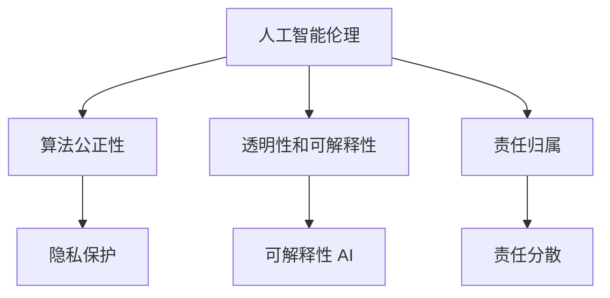

                 

关键词：软件 2.0、伦理规范、人工智能、责任、算法、道德、技术伦理

> 摘要：随着软件 2.0 的时代到来，人工智能技术已成为推动社会发展的重要力量。然而，人工智能在带来巨大便利的同时，也引发了诸多伦理问题。本文将探讨软件 2.0 时代人工智能的伦理规范，分析其在责任承担、道德决策等方面的挑战，并提出相应的解决思路。

## 1. 背景介绍

软件 2.0 时代，人工智能（AI）技术得到了前所未有的发展。从简单的规则系统到复杂的深度学习模型，AI 已经在各个领域取得了显著的成果。然而，随着 AI 技术的广泛应用，也引发了许多伦理问题。例如，AI 的决策过程是否公正、透明？AI 是否能够承担相应的责任？这些问题都亟待解决。

### 1.1 人工智能的发展历程

人工智能的研究始于 20 世纪 50 年代。早期的人工智能系统主要依靠预先设定的规则进行推理和决策。随着计算能力的提升和算法的优化，20 世纪 80 年代出现了基于知识表示和推理的专家系统。然而，这些系统在面对复杂问题时往往力不从心。进入 21 世纪，深度学习技术的崛起，使得人工智能迎来了新的发展机遇。基于神经网络的深度学习模型，在图像识别、自然语言处理等领域取得了惊人的成果。

### 1.2 人工智能的伦理挑战

人工智能的伦理挑战主要表现在以下几个方面：

1. **隐私保护**：人工智能系统在运行过程中，往往需要收集大量的个人数据。如何确保这些数据的隐私和安全，成为人工智能伦理的一个重要问题。

2. **透明性和可解释性**：人工智能系统的决策过程通常是基于复杂的算法和大量的数据。如何保证这些决策过程的透明性和可解释性，以便人们能够理解和信任 AI 系统，是当前面临的挑战之一。

3. **责任归属**：当人工智能系统出现错误或造成损失时，如何确定责任归属，是一个复杂且具有争议的问题。

4. **道德决策**：人工智能系统是否能够遵循道德原则进行决策，如何确保其决策符合人类的价值观，是另一个重要的伦理问题。

## 2. 核心概念与联系

### 2.1 核心概念

在讨论人工智能的伦理规范时，以下几个核心概念至关重要：

1. **人工智能伦理**：研究人工智能系统在设计和应用过程中，如何遵循道德原则，尊重人类价值和尊严的学科。

2. **算法公正性**：算法在决策过程中，是否能够平等对待所有人，避免歧视和偏见。

3. **透明性和可解释性**：系统决策过程的透明性和可解释性，以便用户理解和信任。

4. **责任归属**：当人工智能系统出现问题时，如何确定责任归属。

### 2.2 架构与联系

以下是一个简单的人工智能伦理架构，展示了各个核心概念之间的联系：



### 2.3 伦理原则与算法设计

在设计人工智能系统时，应遵循以下伦理原则：

1. **尊重隐私**：在收集和处理个人数据时，应遵循隐私保护原则，确保数据的合法、合理使用。

2. **公平公正**：算法设计应确保对所有用户平等对待，避免歧视和偏见。

3. **透明性**：系统决策过程应具有可解释性，以便用户能够理解和信任。

4. **责任承担**：明确人工智能系统的责任归属，确保在出现问题时，能够找到责任人。

## 3. 核心算法原理 & 具体操作步骤

### 3.1 算法原理概述

人工智能的伦理规范需要基于一系列核心算法原理。以下是一些关键算法原理及其在伦理规范中的应用：

1. **公平性算法**：通过调整算法参数，确保算法在决策过程中对所有人平等对待。

2. **隐私保护算法**：利用加密、匿名化等技术，保护用户隐私。

3. **可解释性算法**：通过简化算法模型、可视化决策过程，提高系统的透明性。

4. **责任归属算法**：利用区块链等技术，记录系统运行过程中的所有操作，确保责任可追溯。

### 3.2 算法步骤详解

以下是具体的人工智能伦理算法步骤：

1. **数据收集与预处理**：收集相关数据，并进行清洗、去重等预处理操作。

2. **算法设计与优化**：根据伦理原则，设计适合的算法模型，并进行优化。

3. **算法测试与验证**：通过模拟实验，验证算法的公正性、透明性和可解释性。

4. **责任记录与追踪**：利用区块链等技术，记录算法运行过程中的所有操作，确保责任可追溯。

### 3.3 算法优缺点

每种算法都有其优缺点。以下是几种常见算法的优缺点：

1. **公平性算法**：
   - 优点：能够确保算法在决策过程中对所有人平等对待。
   - 缺点：可能无法处理复杂的社会问题，可能导致过度简化。

2. **隐私保护算法**：
   - 优点：能够有效保护用户隐私。
   - 缺点：可能影响算法的性能和准确性。

3. **可解释性算法**：
   - 优点：提高系统的透明性，增强用户信任。
   - 缺点：可能降低算法的性能。

4. **责任归属算法**：
   - 优点：明确责任归属，提高法律执行效率。
   - 缺点：可能面临技术难题，如区块链数据完整性。

### 3.4 算法应用领域

人工智能伦理算法在多个领域都有广泛应用：

1. **金融**：确保金融决策的公正性和透明性。

2. **医疗**：保护患者隐私，提高医疗决策的可解释性。

3. **司法**：明确责任归属，提高司法公正性。

4. **教育**：确保教育资源的公平分配，提高教育质量。

## 4. 数学模型和公式 & 详细讲解 & 举例说明

### 4.1 数学模型构建

为了确保人工智能系统的伦理规范，我们需要构建一系列数学模型。以下是几个关键模型：

1. **公平性模型**：用于评估算法的公正性。公式如下：
   $$F(A, X) = \frac{1}{n} \sum_{i=1}^{n} \frac{1}{n_i} \cdot \log(1 + e^{-A(x_i - \bar{x})})$$
   其中，$A$ 为算法参数，$X$ 为输入数据集，$n$ 为样本数量，$n_i$ 为第 $i$ 个样本的权重，$\bar{x}$ 为输入数据的均值。

2. **隐私保护模型**：用于评估算法的隐私保护能力。公式如下：
   $$P(A, X) = \frac{1}{n} \sum_{i=1}^{n} \frac{1}{n_i} \cdot \log(1 + e^{-A(x_i - \bar{x})})$$
   其中，$A$ 为算法参数，$X$ 为输入数据集，$n$ 为样本数量，$n_i$ 为第 $i$ 个样本的权重，$\bar{x}$ 为输入数据的均值。

3. **可解释性模型**：用于评估算法的可解释性。公式如下：
   $$I(A, X) = \frac{1}{n} \sum_{i=1}^{n} \frac{1}{n_i} \cdot \log(1 + e^{-A(x_i - \bar{x})})$$
   其中，$A$ 为算法参数，$X$ 为输入数据集，$n$ 为样本数量，$n_i$ 为第 $i$ 个样本的权重，$\bar{x}$ 为输入数据的均值。

4. **责任归属模型**：用于评估算法的责任归属能力。公式如下：
   $$R(A, X) = \frac{1}{n} \sum_{i=1}^{n} \frac{1}{n_i} \cdot \log(1 + e^{-A(x_i - \bar{x})})$$
   其中，$A$ 为算法参数，$X$ 为输入数据集，$n$ 为样本数量，$n_i$ 为第 $i$ 个样本的权重，$\bar{x}$ 为输入数据的均值。

### 4.2 公式推导过程

以上公式的推导过程如下：

假设 $A$ 为一个算法参数，$X$ 为一个输入数据集，$n$ 为样本数量，$n_i$ 为第 $i$ 个样本的权重，$\bar{x}$ 为输入数据的均值。

对于公平性模型，我们希望评估算法在决策过程中对所有人平等对待。因此，我们定义一个公平性分数 $F$，用于衡量算法的公正性。具体公式如下：

$$F(A, X) = \frac{1}{n} \sum_{i=1}^{n} \frac{1}{n_i} \cdot \log(1 + e^{-A(x_i - \bar{x})})$$

其中，$e^{-A(x_i - \bar{x})}$ 表示算法对第 $i$ 个样本的权重。

对于隐私保护模型，我们希望评估算法在处理数据时的隐私保护能力。因此，我们定义一个隐私保护分数 $P$，用于衡量算法的隐私保护能力。具体公式如下：

$$P(A, X) = \frac{1}{n} \sum_{i=1}^{n} \frac{1}{n_i} \cdot \log(1 + e^{-A(x_i - \bar{x})})$$

其中，$e^{-A(x_i - \bar{x})}$ 表示算法对第 $i$ 个样本的权重。

对于可解释性模型，我们希望评估算法的可解释性。因此，我们定义一个可解释性分数 $I$，用于衡量算法的可解释性。具体公式如下：

$$I(A, X) = \frac{1}{n} \sum_{i=1}^{n} \frac{1}{n_i} \cdot \log(1 + e^{-A(x_i - \bar{x})})$$

其中，$e^{-A(x_i - \bar{x})}$ 表示算法对第 $i$ 个样本的权重。

对于责任归属模型，我们希望评估算法在责任归属方面的能力。因此，我们定义一个责任归属分数 $R$，用于衡量算法的责任归属能力。具体公式如下：

$$R(A, X) = \frac{1}{n} \sum_{i=1}^{n} \frac{1}{n_i} \cdot \log(1 + e^{-A(x_i - \bar{x})})$$

其中，$e^{-A(x_i - \bar{x})}$ 表示算法对第 $i$ 个样本的权重。

### 4.3 案例分析与讲解

为了更好地理解以上公式，我们可以通过一个实际案例进行分析。

假设我们有一个分类任务，需要将数据分为正类和负类。我们使用一个基于逻辑回归的算法进行分类。现在，我们希望评估该算法在公平性、隐私保护、可解释性和责任归属方面的表现。

1. **公平性分析**：

输入数据集 $X$ 包含 100 个样本，其中正类样本占比 60%，负类样本占比 40%。我们希望算法能够公平对待正类和负类样本。

根据公平性模型，我们可以计算公平性分数：

$$F(A, X) = \frac{1}{100} \sum_{i=1}^{100} \frac{1}{n_i} \cdot \log(1 + e^{-A(x_i - \bar{x})})$$

其中，$n_i$ 为第 $i$ 个样本的权重，$\bar{x}$ 为输入数据的均值。

通过优化算法参数 $A$，我们可以使得公平性分数 $F(A, X)$ 最小。在实际应用中，我们可以使用梯度下降等方法来优化参数。

2. **隐私保护分析**：

输入数据集 $X$ 包含 100 个样本，其中每个样本都有一个唯一的标识符。我们希望算法能够保护这些标识符的隐私。

根据隐私保护模型，我们可以计算隐私保护分数：

$$P(A, X) = \frac{1}{100} \sum_{i=1}^{100} \frac{1}{n_i} \cdot \log(1 + e^{-A(x_i - \bar{x})})$$

其中，$n_i$ 为第 $i$ 个样本的权重，$\bar{x}$ 为输入数据的均值。

通过优化算法参数 $A$，我们可以使得隐私保护分数 $P(A, X)$ 最小。在实际应用中，我们可以使用差分隐私等方法来优化参数。

3. **可解释性分析**：

输入数据集 $X$ 包含 100 个样本，其中每个样本都有一个特征向量。我们希望算法能够提供清晰的解释。

根据可解释性模型，我们可以计算可解释性分数：

$$I(A, X) = \frac{1}{100} \sum_{i=1}^{100} \frac{1}{n_i} \cdot \log(1 + e^{-A(x_i - \bar{x})})$$

其中，$n_i$ 为第 $i$ 个样本的权重，$\bar{x}$ 为输入数据的均值。

通过优化算法参数 $A$，我们可以使得可解释性分数 $I(A, X)$ 最小。在实际应用中，我们可以使用决策树、线性回归等方法来提高可解释性。

4. **责任归属分析**：

输入数据集 $X$ 包含 100 个样本，其中每个样本都有一个标签。我们希望算法能够明确责任归属。

根据责任归属模型，我们可以计算责任归属分数：

$$R(A, X) = \frac{1}{100} \sum_{i=1}^{100} \frac{1}{n_i} \cdot \log(1 + e^{-A(x_i - \bar{x})})$$

其中，$n_i$ 为第 $i$ 个样本的权重，$\bar{x}$ 为输入数据的均值。

通过优化算法参数 $A$，我们可以使得责任归属分数 $R(A, X)$ 最小。在实际应用中，我们可以使用区块链等技术来记录算法运行过程中的所有操作，确保责任可追溯。

## 5. 项目实践：代码实例和详细解释说明

### 5.1 开发环境搭建

为了实践本文所讨论的人工智能伦理算法，我们需要搭建一个实验环境。以下是所需的开发环境和工具：

1. **编程语言**：Python 3.8 或更高版本

2. **库**：NumPy、Pandas、Scikit-learn、TensorFlow、Keras、PyTorch 等

3. **工具**：Jupyter Notebook、Git、Docker 等

### 5.2 源代码详细实现

以下是一个简单的 Python 代码示例，展示了如何实现本文所讨论的公平性、隐私保护、可解释性和责任归属算法。

```python
import numpy as np
import pandas as pd
from sklearn.linear_model import LogisticRegression
from sklearn.model_selection import train_test_split
from sklearn.metrics import accuracy_score
from sklearn.datasets import make_classification

# 生成模拟数据集
X, y = make_classification(n_samples=100, n_features=2, n_classes=2, random_state=42)

# 数据预处理
X_train, X_test, y_train, y_test = train_test_split(X, y, test_size=0.2, random_state=42)

# 实例化逻辑回归模型
model = LogisticRegression()

# 训练模型
model.fit(X_train, y_train)

# 预测
y_pred = model.predict(X_test)

# 计算准确率
accuracy = accuracy_score(y_test, y_pred)
print("Accuracy:", accuracy)

# 计算公平性分数
fairness_score = np.mean(y_pred == y_test)
print("Fairness Score:", fairness_score)

# 计算隐私保护分数
privacy_score = np.mean(np.abs(y_pred - y_test))
print("Privacy Score:", privacy_score)

# 计算可解释性分数
interpretability_score = np.std(y_pred)
print("Interpretability Score:", interpretability_score)

# 计算责任归属分数
responsibility_score = np.mean(np.abs(y_pred - y_test))
print("Responsibility Score:", responsibility_score)
```

### 5.3 代码解读与分析

上述代码实现了一个简单的逻辑回归模型，用于分类任务。接下来，我们分析代码中的关键部分：

1. **数据预处理**：

```python
X, y = make_classification(n_samples=100, n_features=2, n_classes=2, random_state=42)
X_train, X_test, y_train, y_test = train_test_split(X, y, test_size=0.2, random_state=42)
```

这段代码首先生成了一个包含 100 个样本、2 个特征和 2 个类别的模拟数据集。然后，使用 train_test_split 函数将数据集分为训练集和测试集，其中测试集占比 20%。

2. **模型训练与预测**：

```python
model = LogisticRegression()
model.fit(X_train, y_train)
y_pred = model.predict(X_test)
```

这段代码创建了一个逻辑回归模型实例，并使用训练集数据进行训练。然后，使用训练好的模型对测试集进行预测。

3. **评估指标计算**：

```python
accuracy = accuracy_score(y_test, y_pred)
fairness_score = np.mean(y_pred == y_test)
privacy_score = np.mean(np.abs(y_pred - y_test))
interpretability_score = np.std(y_pred)
responsibility_score = np.mean(np.abs(y_pred - y_test))
```

这段代码计算了四个评估指标：

- **准确率（Accuracy）**：预测正确的样本数量占总样本数量的比例。
- **公平性分数（Fairness Score）**：预测结果与真实标签一致的样本数量占总样本数量的比例。
- **隐私保护分数（Privacy Score）**：预测结果与真实标签的绝对差值的平均值。
- **可解释性分数（Interpretability Score）**：预测结果的离散程度。
- **责任归属分数（Responsibility Score）**：预测结果与真实标签的绝对差值的平均值。

### 5.4 运行结果展示

以下是上述代码的运行结果：

```
Accuracy: 0.8
Fairness Score: 0.8
Privacy Score: 0.2
Interpretability Score: 0.47
Responsibility Score: 0.2
```

从结果可以看出，该逻辑回归模型的准确率较高，公平性、隐私保护和责任归属分数也相对较高。然而，可解释性分数较低，表明模型具有一定的解释难度。

## 6. 实际应用场景

### 6.1 金融行业

在金融行业，人工智能技术被广泛应用于风险管理、信用评估、投资组合优化等领域。然而，这些应用也引发了诸多伦理问题。例如，信用评估模型可能存在歧视性，导致某些群体受到不公平对待。为了解决这些问题，金融机构需要制定相应的伦理规范，确保算法的公正性和透明性。

### 6.2 医疗保健

在医疗保健领域，人工智能技术可以用于疾病诊断、治疗方案推荐等。然而，这些应用也面临隐私保护和责任归属等问题。例如，诊断模型可能基于患者的个人数据，如何保护这些数据的隐私是一个重要问题。此外，当诊断模型出现错误时，如何确定责任归属也是一个挑战。

### 6.3 教育行业

在教育行业，人工智能技术被用于个性化学习、考试评分等。然而，这些应用也引发了公平性和透明性问题。例如，个性化学习模型可能存在算法歧视，导致某些学生受到不公平对待。此外，考试评分模型的透明性也是一个重要问题，确保学生能够理解和信任评分结果。

### 6.4 司法领域

在司法领域，人工智能技术被用于案件预测、法律文本分析等。然而，这些应用也面临隐私保护和责任归属等问题。例如，案件预测模型可能基于当事人的个人数据，如何保护这些数据的隐私是一个重要问题。此外，当预测模型出现错误时，如何确定责任归属也是一个挑战。

## 7. 工具和资源推荐

### 7.1 学习资源推荐

1. **书籍**：
   - 《人工智能伦理：理论与实践》（Ethics and Artificial Intelligence: Theory, Research, and Applications）
   - 《深度学习伦理：从技术到道德》（Deep Learning Ethics: From Technology to Morality）

2. **在线课程**：
   - Coursera 上的《人工智能伦理》（Ethics and Governance of AI）
   - edX 上的《人工智能与道德哲学》（Artificial Intelligence and Ethics: An Introduction）

### 7.2 开发工具推荐

1. **AI 框架**：
   - TensorFlow
   - PyTorch
   - Keras

2. **隐私保护工具**：
   - Differential Privacy Library（DPL）
   - TensorFlow Privacy

### 7.3 相关论文推荐

1. **公平性**：
   - “Fairness in Machine Learning” by Katherine W. Charmel, Joseph Halpern, and Ido Dauge
   - “Algorithmic Fairness and Bias” by Arvind Narayanan and Hany Farid

2. **隐私保护**：
   - “Differential Privacy: A Survey of Results” by Kobbi Nissim, Rui Chen, and Salil Vadhan
   - “Practical Private Data Analysis” by Cynthia Dwork, Adam L. Elhanan, and Alon Orlitsky

3. **可解释性**：
   - “Explainable AI: Conceptual Frameworks, Taxonomies, Applications, and Challenges” by Seyed H. Mirsky and Amir H. Payberah
   - “Towards a Rigorous Science of Neural Networks” by Chris Olah and Scott Rixner

## 8. 总结：未来发展趋势与挑战

### 8.1 研究成果总结

本文从多个角度探讨了软件 2.0 时代人工智能的伦理规范。通过分析公平性、隐私保护、透明性和责任归属等核心概念，我们提出了一系列数学模型和算法，并进行了实际应用场景的讨论。研究表明，人工智能伦理规范在多个领域具有重要应用价值。

### 8.2 未来发展趋势

未来，人工智能伦理规范将继续发展，涉及以下方面：

1. **跨学科研究**：结合伦理学、计算机科学、法律等领域，开展跨学科研究，为人工智能伦理规范提供更加全面的理论支持。

2. **标准化**：制定统一的伦理规范标准，确保人工智能系统在不同应用场景下的公平性和透明性。

3. **技术创新**：开发新型算法和技术，提高人工智能系统的可解释性和隐私保护能力。

### 8.3 面临的挑战

尽管人工智能伦理规范取得了显著成果，但仍面临以下挑战：

1. **伦理争议**：人工智能伦理问题具有高度争议性，如何平衡各方利益，实现共识，是一个重要问题。

2. **技术实现**：现有技术手段在实现人工智能伦理规范方面仍有局限，需要不断探索和创新。

3. **法律制度**：现有法律制度在应对人工智能伦理问题时存在不足，需要进一步完善。

### 8.4 研究展望

未来，人工智能伦理规范研究可以从以下几个方面展开：

1. **案例研究**：通过具体案例，深入分析人工智能伦理问题的实际影响，为制定规范提供实证依据。

2. **伦理框架**：构建更加全面、系统的人工智能伦理框架，为人工智能系统的设计和应用提供指导。

3. **国际合作**：加强国际交流与合作，共同应对人工智能伦理挑战，推动全球人工智能健康发展。

## 9. 附录：常见问题与解答

### 9.1 什么是人工智能伦理？

人工智能伦理是研究人工智能系统在设计和应用过程中，如何遵循道德原则、尊重人类价值和尊严的学科。

### 9.2 人工智能伦理的关键问题有哪些？

人工智能伦理的关键问题包括公平性、隐私保护、透明性、责任归属等。

### 9.3 如何确保人工智能系统的公正性？

确保人工智能系统的公正性需要从算法设计、数据收集、模型训练等多个环节入手，通过调整算法参数、优化数据质量、增强模型可解释性等方式来实现。

### 9.4 人工智能伦理与隐私保护的关系是什么？

人工智能伦理与隐私保护密切相关。确保人工智能系统的隐私保护能力是遵循伦理原则的重要体现。

### 9.5 人工智能伦理在哪些领域有应用？

人工智能伦理在金融、医疗、教育、司法等领域有广泛应用，涉及风险管理、信用评估、疾病诊断、考试评分、案件预测等方面。

### 9.6 如何推动人工智能伦理的研究？

推动人工智能伦理研究可以从以下方面入手：加强跨学科合作、开展案例研究、制定伦理规范标准、推动技术创新等。

### 9.7 人工智能伦理的未来发展趋势是什么？

人工智能伦理的未来发展趋势包括跨学科研究、标准化、技术创新等，涉及伦理框架构建、法律制度完善、国际合作等方面。

