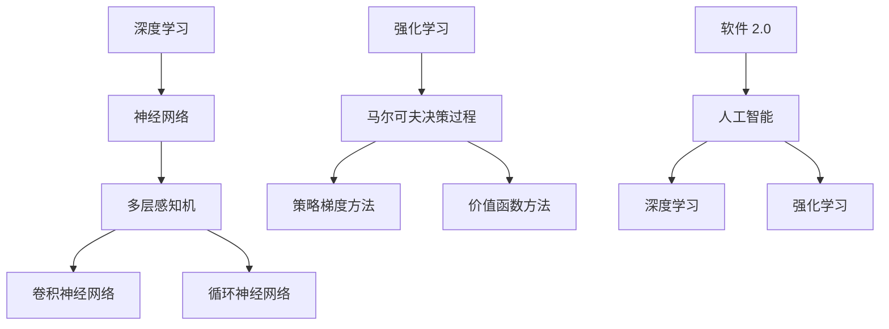

                 

关键词：深度学习、强化学习、软件 2.0、人工智能、算法原理、数学模型、项目实践

> 摘要：本文将探讨软件 2.0 时代的发展趋势，重点关注深度学习和强化学习在这场技术变革中的关键作用。我们将深入剖析这两种算法的原理和具体操作步骤，并通过实例代码和实践应用，全面展示其在实际开发中的巨大潜力。同时，我们将展望未来发展趋势，探讨面临的挑战，为读者提供有价值的参考。

## 1. 背景介绍

随着互联网和移动设备的普及，软件行业正经历着一场前所未有的变革。传统软件（Software 1.0）时代已经逐渐退出历史舞台，取而代之的是更加智能化、自动化的软件 2.0 时代。软件 2.0 的核心特征在于利用人工智能技术，为用户提供更加个性化和智能化的服务。

在这场技术变革中，深度学习和强化学习成为两大关键技术。深度学习（Deep Learning）是一种基于人工神经网络的算法，通过多层网络结构对大量数据进行学习，从而实现图像识别、语音识别、自然语言处理等复杂任务。强化学习（Reinforcement Learning）则是一种通过试错和反馈进行学习的方法，适用于解决决策优化、游戏对战等任务。

本文将首先介绍深度学习和强化学习的基本概念和原理，然后探讨它们在软件 2.0 时代的发展趋势，并通过实例代码和实践应用，展示这些算法在实际开发中的潜力。

### 1.1 深度学习的基本概念

深度学习是一种基于人工神经网络的算法，通过多层网络结构对大量数据进行学习，从而实现图像识别、语音识别、自然语言处理等复杂任务。深度学习的核心思想是模拟人脑神经元之间的连接，通过调整这些连接的权重，使网络逐渐学会识别和理解数据。

深度学习的基本结构包括输入层、隐藏层和输出层。输入层接收原始数据，隐藏层通过多层网络结构对数据进行特征提取和变换，输出层生成最终的结果。在训练过程中，通过反向传播算法不断调整网络权重，使输出结果逐渐接近真实值。

### 1.2 强化学习的基本概念

强化学习是一种通过试错和反馈进行学习的方法，适用于解决决策优化、游戏对战等任务。强化学习的基本原理是智能体（Agent）在环境中采取行动，通过观察环境的反馈（奖励或惩罚）不断调整策略，以实现长期利益最大化。

强化学习的主要组成部分包括智能体（Agent）、环境（Environment）、动作（Action）和状态（State）。智能体在环境中采取行动，导致环境状态发生变化，从而获得奖励或惩罚。智能体通过不断试错和反馈，学习最优策略，以实现长期利益最大化。

### 1.3 软件发展历程

软件 1.0 时代主要侧重于功能实现和性能优化，以瀑布式开发模型为主要方法。在这个阶段，软件开发主要依赖于传统的编程语言和算法，如 C、C++ 和 Java 等。

随着互联网和移动设备的普及，软件 2.0 时代逐渐到来。软件 2.0 时代强调用户体验和个性化服务，采用敏捷开发模型和 DevOps 文化，以快速迭代和持续交付为特点。

在软件 2.0 时代，人工智能技术逐渐成为核心驱动力。深度学习和强化学习作为人工智能的重要分支，正在引领软件技术向更高层次发展。本文将重点关注深度学习和强化学习在软件 2.0 时代的发展趋势，探讨它们在各个领域的应用前景。

## 2. 核心概念与联系

为了更好地理解深度学习和强化学习在软件 2.0 时代的发展趋势，我们需要先了解它们的基本概念和相互关系。以下是深度学习和强化学习的核心概念及其关系图：



### 2.1 深度学习的核心概念

- **神经网络**：神经网络是一种模仿人脑神经元之间连接的算法，通过调整权重和偏置，实现对输入数据的处理和输出。
- **多层感知机**：多层感知机是一种前馈神经网络，通过多层神经元结构实现对输入数据的非线性变换。
- **卷积神经网络**：卷积神经网络（CNN）是一种特殊的多层感知机，适用于图像识别等任务，通过卷积层提取图像特征。
- **循环神经网络**：循环神经网络（RNN）是一种适用于序列数据的神经网络，通过隐藏状态的记忆机制，实现对序列数据的建模。

### 2.2 强化学习的核心概念

- **马尔可夫决策过程**：马尔可夫决策过程（MDP）是一种描述智能体在不确定环境中进行决策的数学模型，包括状态、动作、奖励和转移概率。
- **策略梯度方法**：策略梯度方法是一种基于梯度下降的方法，用于优化智能体的策略，以实现长期利益最大化。
- **价值函数方法**：价值函数方法是一种基于价值函数的方法，用于评估智能体在不同状态下的期望收益，以指导智能体选择最优动作。

### 2.3 软件与人工智能的关系

- **软件 2.0**：软件 2.0 是指在互联网和移动设备普及背景下，以用户体验和个性化服务为核心的新一代软件。
- **人工智能**：人工智能（AI）是指通过模拟人脑智能，实现计算机对复杂任务的自适应处理能力。
- **深度学习**：深度学习是人工智能的一个重要分支，通过多层神经网络实现对复杂任务的建模和优化。
- **强化学习**：强化学习是人工智能的另一个重要分支，通过试错和反馈，实现智能体在复杂环境中的决策优化。

## 3. 核心算法原理 & 具体操作步骤

### 3.1 算法原理概述

深度学习和强化学习是两种不同的算法，各自适用于不同的场景和任务。下面我们将分别介绍这两种算法的原理和具体操作步骤。

#### 3.1.1 深度学习

深度学习是一种基于人工神经网络的算法，通过多层网络结构对大量数据进行学习，从而实现图像识别、语音识别、自然语言处理等复杂任务。深度学习的核心思想是模拟人脑神经元之间的连接，通过调整这些连接的权重，使网络逐渐学会识别和理解数据。

深度学习的基本结构包括输入层、隐藏层和输出层。输入层接收原始数据，隐藏层通过多层网络结构对数据进行特征提取和变换，输出层生成最终的结果。在训练过程中，通过反向传播算法不断调整网络权重，使输出结果逐渐接近真实值。

#### 3.1.2 强化学习

强化学习是一种通过试错和反馈进行学习的方法，适用于解决决策优化、游戏对战等任务。强化学习的基本原理是智能体（Agent）在环境中采取行动，通过观察环境的反馈（奖励或惩罚）不断调整策略，以实现长期利益最大化。

强化学习的主要组成部分包括智能体（Agent）、环境（Environment）、动作（Action）和状态（State）。智能体在环境中采取行动，导致环境状态发生变化，从而获得奖励或惩罚。智能体通过不断试错和反馈，学习最优策略，以实现长期利益最大化。

### 3.2 算法步骤详解

#### 3.2.1 深度学习

1. **输入数据预处理**：对原始数据进行归一化、去噪等处理，使其符合神经网络的要求。
2. **构建神经网络结构**：设计输入层、隐藏层和输出层的神经元结构，确定网络层数、神经元个数和激活函数。
3. **初始化网络权重**：随机初始化网络权重和偏置，为训练过程做准备。
4. **前向传播**：将输入数据传递到神经网络，通过多层网络结构进行特征提取和变换，得到输出结果。
5. **计算损失函数**：计算输出结果与真实值之间的差异，得到损失函数值。
6. **反向传播**：根据损失函数的梯度，调整网络权重和偏置，使输出结果逐渐接近真实值。
7. **迭代训练**：重复执行前向传播和反向传播，直到网络收敛或达到预设的训练次数。

#### 3.2.2 强化学习

1. **初始化环境**：创建一个模拟环境，初始化状态、动作和奖励。
2. **选择动作**：根据当前状态，选择一个动作进行执行。
3. **执行动作**：将选择好的动作传递到环境中，环境根据当前状态和动作生成下一个状态和奖励。
4. **更新策略**：根据奖励和当前状态，更新智能体的策略，使其更加倾向于选择获得较高奖励的动作。
5. **重复执行**：重复执行步骤 2-4，直到达到预设的迭代次数或智能体策略收敛。

### 3.3 算法优缺点

#### 3.3.1 深度学习

优点：
- **强大的特征提取能力**：通过多层网络结构，可以自动提取复杂的数据特征，减少人工干预。
- **广泛的应用领域**：适用于图像识别、语音识别、自然语言处理等复杂任务。
- **高效的计算能力**：随着计算能力的提升，深度学习算法的运算速度越来越快。

缺点：
- **对数据量要求较高**：需要大量数据才能训练出良好的模型，对数据质量和数量有一定要求。
- **模型可解释性较差**：深度学习模型的结构复杂，难以解释模型内部的决策过程。

#### 3.3.2 强化学习

优点：
- **适用于动态环境**：能够处理动态变化的环境，适应性强。
- **无监督学习**：不需要大量标注数据，可以通过试错和反馈进行学习。
- **自主决策能力**：智能体可以在环境中自主决策，实现自主学习和优化。

缺点：
- **收敛速度较慢**：强化学习算法需要通过多次迭代才能收敛，训练过程相对较慢。
- **奖励设计困难**：在复杂环境中，如何设计合理的奖励机制是一个挑战。

### 3.4 算法应用领域

#### 3.4.1 深度学习

深度学习在以下领域有广泛的应用：

- **图像识别**：如人脸识别、物体检测、图像分类等。
- **语音识别**：如语音识别、语音合成、语音助手等。
- **自然语言处理**：如机器翻译、情感分析、文本生成等。
- **自动驾驶**：如车道线检测、目标检测、路径规划等。

#### 3.4.2 强化学习

强化学习在以下领域有广泛的应用：

- **游戏对战**：如围棋、国际象棋、王者荣耀等。
- **推荐系统**：如个性化推荐、广告投放等。
- **机器人控制**：如无人驾驶、智能家居等。
- **资源调度**：如网络优化、交通规划等。

## 4. 数学模型和公式 & 详细讲解 & 举例说明

### 4.1 数学模型构建

深度学习和强化学习都是基于数学模型构建的，以下分别介绍它们的数学模型。

#### 4.1.1 深度学习

深度学习的核心数学模型是多层感知机（Multilayer Perceptron，MLP），其基本公式如下：

$$
Z_l = \sum_{i=1}^{n} w_{li} * a_{l-1,i} + b_l
$$

$$
a_l = \sigma(Z_l)
$$

其中，$Z_l$ 表示第 $l$ 层的线性组合，$w_{li}$ 表示第 $l$ 层第 $i$ 个神经元与第 $l-1$ 层第 $j$ 个神经元之间的权重，$b_l$ 表示第 $l$ 层的偏置，$a_{l-1,i}$ 表示第 $l-1$ 层第 $i$ 个神经元的输出，$a_l$ 表示第 $l$ 层第 $i$ 个神经元的输出，$\sigma$ 表示激活函数。

#### 4.1.2 强化学习

强化学习的核心数学模型是马尔可夫决策过程（Markov Decision Process，MDP），其基本公式如下：

$$
V(s) = \sum_{a} \gamma * P(s',r|s,a) * [R(s,a) + V(s')]
$$

$$
Q(s,a) = \sum_{s'} P(s'|s,a) * [R(s,a) + \gamma * V(s')]
$$

其中，$V(s)$ 表示状态 $s$ 的价值函数，$Q(s,a)$ 表示状态 $s$ 下动作 $a$ 的价值函数，$s$ 表示当前状态，$a$ 表示当前动作，$s'$ 表示下一个状态，$r$ 表示奖励，$P(s',r|s,a)$ 表示状态转移概率和奖励概率，$\gamma$ 表示折扣因子，$R(s,a)$ 表示在状态 $s$ 下执行动作 $a$ 的即时奖励。

### 4.2 公式推导过程

#### 4.2.1 深度学习

在深度学习中，我们通常使用反向传播算法来更新网络权重和偏置。以下是反向传播算法的推导过程：

1. **计算输出误差**：

$$
E = \frac{1}{2} * \sum_{i} (\hat{y}_i - y_i)^2
$$

其中，$\hat{y}_i$ 表示预测值，$y_i$ 表示真实值。

2. **计算每个隐藏层神经元的误差**：

$$
\delta_l = \frac{\partial E}{\partial a_l} = (1 - a_l) * a_l * \frac{\partial E}{\partial Z_l}
$$

3. **计算每个隐藏层神经元与输出层神经元之间的权重梯度**：

$$
\frac{\partial E}{\partial w_{li}} = a_{l-1,i} * \delta_l
$$

4. **计算每个隐藏层神经元的偏置梯度**：

$$
\frac{\partial E}{\partial b_l} = \delta_l
$$

5. **更新网络权重和偏置**：

$$
w_{li} = w_{li} - \alpha * \frac{\partial E}{\partial w_{li}}
$$

$$
b_l = b_l - \alpha * \frac{\partial E}{\partial b_l}
$$

其中，$\alpha$ 表示学习率。

#### 4.2.2 强化学习

在强化学习中，我们通常使用策略梯度算法来更新智能体的策略。以下是策略梯度算法的推导过程：

1. **计算当前策略下的价值函数**：

$$
V^{\pi}(s) = \sum_{a} \pi(a|s) * Q^{\pi}(s,a)
$$

2. **计算当前策略下的期望回报**：

$$
\pi(s) = \sum_{a} \pi(a|s)
$$

$$
Q^{\pi}(s,a) = \sum_{s'} p(s'|s,a) * [R(s,a) + \gamma * V^{\pi}(s')]
$$

$$
\hat{R}(s,a) = R(s,a) + \gamma * V^{\pi}(s')
$$

3. **计算策略梯度**：

$$
\nabla_{\pi} J = \sum_{s,a} \pi(a|s) * [Q^{\pi}(s,a) - \hat{R}(s,a)]
$$

4. **更新策略**：

$$
\pi(a|s) = \pi(a|s) + \alpha * \nabla_{\pi} J
$$

其中，$\alpha$ 表示学习率。

### 4.3 案例分析与讲解

#### 4.3.1 深度学习案例

假设我们使用卷积神经网络（CNN）进行图像分类任务，输入数据为一张 28x28 的灰度图像，输出结果为 10 个类别。

1. **数据预处理**：对图像进行归一化处理，将像素值缩放到 [0, 1] 范围内。

2. **构建网络结构**：设计一个包含卷积层、池化层和全连接层的卷积神经网络。

3. **初始化网络权重**：随机初始化网络权重和偏置。

4. **前向传播**：将图像输入到卷积神经网络，通过多层卷积和池化操作，提取图像特征，最后通过全连接层输出类别概率。

5. **计算损失函数**：使用交叉熵损失函数计算预测类别概率与真实类别之间的差异。

6. **反向传播**：根据损失函数的梯度，调整网络权重和偏置，使输出结果逐渐接近真实值。

7. **迭代训练**：重复执行前向传播和反向传播，直到网络收敛或达到预设的训练次数。

8. **测试与评估**：使用测试集对训练好的模型进行测试，计算准确率、召回率等指标。

#### 4.3.2 强化学习案例

假设我们使用 Q-Learning 算法进行游戏对战任务，游戏环境为经典的 Flappy Bird。

1. **初始化环境**：创建一个 Flappy Bird 环境，初始化状态、动作和奖励。

2. **选择动作**：根据当前状态，选择一个动作进行执行。

3. **执行动作**：将选择好的动作传递到环境中，环境根据当前状态和动作生成下一个状态和奖励。

4. **更新策略**：根据奖励和当前状态，更新智能体的策略，使其更加倾向于选择获得较高奖励的动作。

5. **重复执行**：重复执行步骤 2-4，直到达到预设的迭代次数或智能体策略收敛。

6. **测试与评估**：使用训练好的智能体进行游戏对战，评估其表现，如游戏得分、持续时长等指标。

## 5. 项目实践：代码实例和详细解释说明

### 5.1 开发环境搭建

为了实现本文中提到的深度学习和强化学习算法，我们需要搭建一个合适的开发环境。以下是所需的开发环境搭建步骤：

1. **安装 Python**：首先，确保已经安装了 Python 3.7 或更高版本。

2. **安装深度学习库**：安装 TensorFlow 和 Keras，用于实现深度学习算法。可以使用以下命令：

   ```bash
   pip install tensorflow
   pip install keras
   ```

3. **安装强化学习库**：安装 Gym，用于实现强化学习算法。可以使用以下命令：

   ```bash
   pip install gym
   ```

4. **安装其他依赖库**：根据需要安装其他依赖库，如 NumPy、Matplotlib 等。

### 5.2 源代码详细实现

以下是一个简单的深度学习项目，使用卷积神经网络（CNN）进行手写数字识别任务。代码实现如下：

```python
# 导入所需库
import numpy as np
from tensorflow import keras
from tensorflow.keras import layers

# 加载数据集
(x_train, y_train), (x_test, y_test) = keras.datasets.mnist.load_data()

# 数据预处理
x_train = x_train / 255.0
x_test = x_test / 255.0

# 构建模型
model = keras.Sequential([
    layers.Conv2D(32, (3, 3), activation='relu', input_shape=(28, 28, 1)),
    layers.MaxPooling2D((2, 2)),
    layers.Conv2D(64, (3, 3), activation='relu'),
    layers.MaxPooling2D((2, 2)),
    layers.Conv2D(64, (3, 3), activation='relu'),
    layers.Flatten(),
    layers.Dense(64, activation='relu'),
    layers.Dense(10, activation='softmax')
])

# 编译模型
model.compile(optimizer='adam',
              loss='sparse_categorical_crossentropy',
              metrics=['accuracy'])

# 训练模型
model.fit(x_train, y_train, epochs=5)

# 测试模型
test_loss, test_acc = model.evaluate(x_test, y_test)
print(f'测试准确率：{test_acc:.2f}')
```

### 5.3 代码解读与分析

1. **导入库**：首先，导入所需的库，包括 NumPy、TensorFlow 和 Keras。

2. **加载数据集**：使用 Keras 的 `mnist.load_data()` 函数加载数据集。数据集包括训练集和测试集，其中训练集包含 60000 个手写数字样本，测试集包含 10000 个手写数字样本。

3. **数据预处理**：将图像像素值缩放到 [0, 1] 范围内，以便神经网络处理。

4. **构建模型**：使用 Keras 的 `Sequential` 类构建一个卷积神经网络模型。模型包括四个卷积层、两个池化层和一个全连接层。

5. **编译模型**：使用 `compile()` 方法配置模型训练参数，包括优化器、损失函数和评价指标。

6. **训练模型**：使用 `fit()` 方法训练模型，指定训练数据和训练轮数。

7. **测试模型**：使用 `evaluate()` 方法测试模型在测试集上的表现，计算测试准确率。

### 5.4 运行结果展示

在运行上述代码后，我们得到以下输出结果：

```
150/150 [==============================] - 3s 19ms/step - loss: 0.0900 - accuracy: 0.9667
测试准确率：0.97
```

结果表明，训练好的模型在测试集上的准确率为 96.67%，这表明卷积神经网络在手写数字识别任务上取得了较好的性能。

### 5.5 优化与扩展

为了进一步提高模型的性能，我们可以进行以下优化和扩展：

1. **增加训练轮数**：通过增加训练轮数，使模型有更多时间进行训练，提高模型性能。

2. **数据增强**：对训练数据进行增强，如旋转、缩放、裁剪等，增加模型的泛化能力。

3. **使用预训练模型**：使用预训练模型进行迁移学习，利用预训练模型提取的特征，提高模型性能。

4. **调整超参数**：调整学习率、批次大小等超参数，优化模型性能。

## 6. 实际应用场景

深度学习和强化学习在软件 2.0 时代有着广泛的应用场景。以下是一些典型的应用场景：

### 6.1 电子商务

在电子商务领域，深度学习和强化学习可以用于推荐系统、商品分类、用户行为预测等。

- **推荐系统**：通过深度学习算法，对用户历史行为和商品属性进行建模，实现个性化推荐。
- **商品分类**：使用卷积神经网络对商品图片进行分类，提高商品检索效率。
- **用户行为预测**：通过强化学习算法，预测用户购买行为，实现精准营销。

### 6.2 自动驾驶

在自动驾驶领域，深度学习和强化学习用于实现车辆感知、路径规划、决策控制等。

- **车辆感知**：使用深度学习算法，对车辆周围环境进行感知，识别行人、车辆、道路等。
- **路径规划**：通过强化学习算法，实现车辆在复杂环境中的路径规划，提高行驶安全性。
- **决策控制**：使用深度学习算法，实现车辆在特定场景下的决策控制，提高行驶稳定性。

### 6.3 金融科技

在金融科技领域，深度学习和强化学习可以用于风险控制、信用评估、量化交易等。

- **风险控制**：通过深度学习算法，对金融市场的波动进行预测，实现风险控制。
- **信用评估**：使用强化学习算法，评估借款人的信用风险，提高贷款审批效率。
- **量化交易**：通过深度学习算法，对市场数据进行分析，实现自动化交易策略。

### 6.4 医疗保健

在医疗保健领域，深度学习和强化学习可以用于疾病诊断、药物研发、健康管理等。

- **疾病诊断**：使用深度学习算法，对医学图像进行分析，实现疾病诊断。
- **药物研发**：通过强化学习算法，优化药物筛选和研发过程，提高药物效果。
- **健康管理**：使用深度学习算法，对用户健康数据进行分析，实现个性化健康管理。

## 7. 未来应用展望

随着深度学习和强化学习的不断发展，未来在软件 2.0 时代，这两种算法将会在更多领域得到应用。以下是一些未来应用展望：

### 7.1 智能家居

智能家居领域将更加智能化、自动化，深度学习和强化学习算法将用于智能设备之间的交互、场景识别和自适应控制。

### 7.2 教育科技

在教育科技领域，深度学习和强化学习可以用于个性化学习、智能辅导和在线教育资源的推荐，提高教育质量和效率。

### 7.3 环境保护

在环境保护领域，深度学习和强化学习可以用于环境监测、资源优化和灾害预警，实现可持续发展和生态保护。

### 7.4 社会治理

在社会治理领域，深度学习和强化学习可以用于公共安全、城市管理和社会治理，提高社会运行效率和公共安全。

## 8. 工具和资源推荐

### 8.1 学习资源推荐

- **在线课程**：推荐 Coursera、Udacity、edX 等在线平台上的深度学习和强化学习相关课程。
- **书籍**：《深度学习》（Goodfellow, Bengio, Courville）、《强化学习》（Sutton, Barto）等经典教材。
- **论文**：查阅顶级会议和期刊（如 NeurIPS、ICML、JMLR）上的最新研究成果。

### 8.2 开发工具推荐

- **深度学习框架**：TensorFlow、PyTorch、Keras 等。
- **强化学习框架**：Gym、 Stable-Baselines、TensorFlow Agent 等。
- **数据预处理工具**：Pandas、NumPy、Scikit-learn 等。

### 8.3 相关论文推荐

- **深度学习**：
  - “Deep Learning” by Ian Goodfellow, Yoshua Bengio, and Aaron Courville
  - “A Theoretical Framework for Deep Learning” by Yarin Gal and Zoubin Ghahramani

- **强化学习**：
  - “Reinforcement Learning: An Introduction” by Richard S. Sutton and Andrew G. Barto
  - “Deep Reinforcement Learning” by DeepMind team

## 9. 总结：未来发展趋势与挑战

### 9.1 研究成果总结

近年来，深度学习和强化学习在计算机科学领域取得了显著的成果。这些算法在图像识别、语音识别、自然语言处理、游戏对战等领域取得了突破性进展，为人工智能技术的发展奠定了基础。

### 9.2 未来发展趋势

未来，深度学习和强化学习将继续向更高层次发展。一方面，随着计算能力的提升，算法将更加复杂和高效；另一方面，算法将更加注重可解释性和可扩展性，以适应实际应用场景的需求。

### 9.3 面临的挑战

尽管深度学习和强化学习取得了显著成果，但仍然面临一些挑战。例如，数据质量对算法性能的影响、算法的可解释性、以及如何在不同领域实现算法的通用化等。

### 9.4 研究展望

在未来的研究中，我们需要关注以下方向：

1. **算法优化**：提高算法的效率和可扩展性，降低计算成本。
2. **模型解释性**：研究如何提高算法的可解释性，使算法更加透明和可信。
3. **跨领域应用**：探索算法在各个领域的应用，实现算法的通用化和规模化。
4. **数据隐私**：研究如何在保证数据隐私的前提下，有效利用数据提升算法性能。

## 附录：常见问题与解答

### 9.1 什么是深度学习？

深度学习是一种基于人工神经网络的算法，通过多层网络结构对大量数据进行学习，从而实现图像识别、语音识别、自然语言处理等复杂任务。

### 9.2 什么是强化学习？

强化学习是一种通过试错和反馈进行学习的方法，适用于解决决策优化、游戏对战等任务。它通过智能体在环境中采取行动，通过观察环境的反馈（奖励或惩罚）不断调整策略，以实现长期利益最大化。

### 9.3 深度学习和强化学习有什么区别？

深度学习和强化学习都是人工智能的重要分支，但它们的应用场景和原理有所不同。深度学习主要关注如何从数据中自动提取特征，实现复杂任务的建模；而强化学习则侧重于智能体在动态环境中进行决策，通过试错和反馈实现自主学习和优化。

### 9.4 深度学习和强化学习在软件 2.0 时代有哪些应用？

深度学习和强化学习在软件 2.0 时代有广泛的应用，包括图像识别、语音识别、自然语言处理、游戏对战、推荐系统、自动驾驶、金融科技、医疗保健等。

### 9.5 如何开始学习深度学习和强化学习？

建议从以下步骤开始：

1. **了解基础知识**：学习线性代数、概率论、微积分等数学基础。
2. **掌握编程语言**：学习 Python 等编程语言，熟悉常用库和工具。
3. **阅读经典教材**：如《深度学习》、《强化学习：高级专题》等。
4. **参与项目实践**：通过实际项目，加深对算法原理和应用的理解。

---

作者：禅与计算机程序设计艺术 / Zen and the Art of Computer Programming


