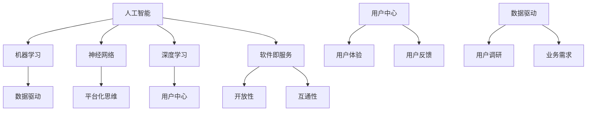

                 

在21世纪的今天，软件已经渗透到了我们生活的方方面面。从手机应用、智能家居、自动驾驶，到电子商务、社交媒体，软件正在重新定义世界。然而，随着技术的飞速发展，我们对于软件的理解也在不断演进。今天，我们站在软件2.0的门槛上，开始深入思考软件的本质及其未来发展。本文将以人工智能为核心，探讨软件2.0的哲学思考，试图揭示人工智能的本质，及其在软件领域中的潜在影响。

> **关键词：** 软件进化、人工智能、软件2.0、哲学思考、技术未来

> **摘要：** 本文将首先回顾软件1.0时代的发展历程，然后深入探讨软件2.0的定义及其核心特征。随后，我们将探讨人工智能的本质，分析其在软件2.0时代中的地位和作用。最后，本文将对未来软件技术的发展趋势进行展望，并探讨可能面临的挑战。

## 1. 背景介绍

软件1.0时代，也称为“命令行时代”，是软件发展的早期阶段。在这个时代，软件主要以操作系统和简单的应用程序为主，用户需要通过键盘输入命令来与计算机交互。随着个人计算机的普及，软件1.0时代逐渐发展出了图形用户界面（GUI），使得计算机操作变得更加直观和便捷。

软件1.0时代的软件，主要功能是实现特定任务，如文字处理、表格计算、图像编辑等。软件的设计和开发以功能实现为核心，用户界面和用户体验并不是主要关注点。在这个时代，软件的发展主要依赖于计算机硬件的升级和操作系统的发展。

随着时间的推移，软件进入了2.0时代。软件2.0时代，也被称为“互联网时代”，以Web 2.0为代表。在这个时代，软件不再仅仅是一个工具，而是一个平台，一个连接人与人、人与信息的桥梁。软件的功能不再局限于特定任务，而是更加注重用户体验和互动性。

软件2.0时代，以云计算、大数据、人工智能等新兴技术为支撑，使得软件的应用场景变得更加广泛。在这个时代，软件不仅仅是计算机中的程序，更是连接现实世界与虚拟世界的纽带。

## 2. 核心概念与联系

在探讨软件2.0的哲学思考之前，我们需要了解一些核心概念，这些概念构成了软件2.0时代的技术基础和哲学基础。

### 2.1. 人工智能

人工智能（AI）是软件2.0时代最核心的技术之一。人工智能是指使计算机系统能够模拟、延伸和扩展人的智能活动，包括学习、推理、规划、感知、自然语言理解等。

人工智能可以分为两大类：弱人工智能和强人工智能。弱人工智能是针对特定任务的人工智能，如语音识别、图像识别、自然语言处理等。强人工智能则是具有全面智能的机器，能够像人类一样进行思考、感知和行动。

人工智能的发展离不开以下几个核心概念：

- **机器学习**：机器学习是人工智能的一种方法，通过数据驱动的方式，使计算机系统能够学习和改进。
- **神经网络**：神经网络是模仿人脑神经元连接方式的计算模型，是机器学习的重要组成部分。
- **深度学习**：深度学习是神经网络的一种特殊形式，通过多层神经网络来学习复杂的模式。

### 2.2. 软件即服务（SaaS）

软件即服务（SaaS）是软件2.0时代的一种重要商业模式。SaaS将软件作为一种服务提供给用户，用户无需购买和安装软件，而是通过互联网订阅使用。

SaaS的核心特征是灵活性和可扩展性。用户可以根据需求随时调整服务的规模和功能，同时，SaaS服务提供商可以根据用户的使用情况，提供个性化的服务。

### 2.3. 平台化思维

平台化思维是软件2.0时代的一种哲学观念，认为软件不仅仅是独立的应用，而是一个平台，一个生态系统。在这个平台上，不同的应用和服务可以相互连接和协作，共同为用户提供价值。

平台化思维的核心是开放性和互通性。通过开放的接口和协议，平台可以吸引更多的开发者和服务提供商，形成一个多元化的生态系统。

### 2.4. 用户中心

在软件2.0时代，用户中心主义成为了一种重要的哲学观念。这意味着软件的设计和开发应该以用户需求为中心，注重用户体验和用户反馈。

用户中心主义强调用户参与和互动。通过用户调研、用户测试、用户反馈等方式，软件提供商可以更好地理解用户需求，不断优化和改进产品。

### 2.5. 数据驱动

数据驱动是软件2.0时代的一种核心方法论。通过收集、分析和利用数据，软件提供商可以更好地理解用户行为、市场趋势和业务需求，从而做出更加明智的决策。

数据驱动的核心是数据收集、数据分析和数据利用。通过数据，软件提供商可以识别用户需求、发现业务机会、优化产品和服务。

### 2.6. Mermaid 流程图

以下是一个用于展示人工智能与软件2.0时代核心概念之间联系的Mermaid流程图：



## 3. 核心算法原理 & 具体操作步骤

### 3.1. 算法原理概述

在软件2.0时代，人工智能的核心算法主要包括机器学习、神经网络和深度学习。这些算法通过数据驱动的方式，使计算机能够学习和改进。

- **机器学习**：机器学习是一种通过数据驱动的方法，使计算机能够从数据中学习，并做出预测或决策的技术。机器学习算法可以分为监督学习、无监督学习和强化学习。
- **神经网络**：神经网络是一种模仿人脑神经元连接方式的计算模型。通过训练，神经网络可以学会识别复杂的模式。
- **深度学习**：深度学习是神经网络的一种特殊形式，通过多层神经网络来学习复杂的模式。深度学习在图像识别、自然语言处理等领域取得了显著的成果。

### 3.2. 算法步骤详解

以下是一个简单的机器学习算法步骤详解：

1. **数据收集**：收集相关的数据集，包括输入数据和对应的标签。
2. **数据预处理**：对数据进行清洗、归一化等处理，以去除噪声和异常值。
3. **模型选择**：选择合适的机器学习模型，如线性回归、决策树、支持向量机等。
4. **模型训练**：使用训练数据集，对模型进行训练，调整模型的参数。
5. **模型评估**：使用测试数据集，对模型进行评估，计算模型的准确率、召回率等指标。
6. **模型优化**：根据评估结果，对模型进行调整和优化。
7. **模型应用**：将训练好的模型应用于实际问题，如预测股票价格、诊断疾病等。

### 3.3. 算法优缺点

- **优点**：机器学习算法具有自适应性和灵活性，能够根据新的数据不断改进。神经网络和深度学习算法在处理复杂模式方面具有显著优势。
- **缺点**：机器学习算法需要大量的训练数据，且训练过程可能非常耗时。神经网络和深度学习算法在训练过程中可能存在过拟合问题。

### 3.4. 算法应用领域

机器学习、神经网络和深度学习算法在软件2.0时代有广泛的应用领域，如：

- **图像识别**：通过深度学习算法，计算机可以自动识别和分类图像中的物体。
- **自然语言处理**：通过机器学习算法，计算机可以理解和生成自然语言，如自动翻译、文本分类等。
- **推荐系统**：通过用户行为数据，推荐系统可以预测用户可能感兴趣的内容，如电商平台的商品推荐、社交媒体的个性化内容推荐等。

## 4. 数学模型和公式 & 详细讲解 & 举例说明

### 4.1. 数学模型构建

在软件2.0时代，数学模型在人工智能中的应用至关重要。以下是一个简单的线性回归模型构建过程：

假设我们有一个数据集，其中每个样本由两个特征 \(x_1\) 和 \(x_2\) 以及一个目标变量 \(y\) 组成。我们希望构建一个线性回归模型来预测 \(y\) 的值。

线性回归模型的基本公式为：

\[ y = \beta_0 + \beta_1 x_1 + \beta_2 x_2 \]

其中，\(\beta_0\)、\(\beta_1\) 和 \(\beta_2\) 是模型的参数，我们需要通过数据来估计这些参数。

### 4.2. 公式推导过程

为了估计线性回归模型的参数，我们可以使用最小二乘法。最小二乘法的目标是找到一个模型，使得预测值与实际值之间的误差平方和最小。

首先，我们定义预测值和实际值之间的误差为：

\[ \epsilon = y - \hat{y} \]

其中，\(\hat{y}\) 是模型预测的 \(y\) 的值。

然后，我们定义误差的平方和为：

\[ S = \sum_{i=1}^{n} \epsilon_i^2 \]

其中，\(n\) 是样本的数量。

最小二乘法的目标是找到参数 \(\beta_0\)、\(\beta_1\) 和 \(\beta_2\)，使得误差的平方和 \(S\) 最小。

为了求解最小值，我们可以对 \(S\) 进行求导，并令导数为零：

\[ \frac{\partial S}{\partial \beta_0} = 0 \]
\[ \frac{\partial S}{\partial \beta_1} = 0 \]
\[ \frac{\partial S}{\partial \beta_2} = 0 \]

通过求解上述方程组，我们可以得到参数的估计值：

\[ \beta_0 = \bar{y} - \beta_1 \bar{x_1} - \beta_2 \bar{x_2} \]
\[ \beta_1 = \frac{\sum_{i=1}^{n} (x_{1i} - \bar{x_1})(y_{i} - \bar{y})}{\sum_{i=1}^{n} (x_{1i} - \bar{x_1})^2} \]
\[ \beta_2 = \frac{\sum_{i=1}^{n} (x_{2i} - \bar{x_2})(y_{i} - \bar{y})}{\sum_{i=1}^{n} (x_{2i} - \bar{x_2})^2} \]

其中，\(\bar{y}\)、\(\bar{x_1}\) 和 \(\bar{x_2}\) 分别是 \(y\)、\(x_1\) 和 \(x_2\) 的平均值。

### 4.3. 案例分析与讲解

假设我们有一个数据集，包含10个样本，每个样本有两个特征 \(x_1\) 和 \(x_2\) 以及一个目标变量 \(y\)。数据集如下：

| \(x_1\) | \(x_2\) | \(y\) |
|--------|--------|------|
| 1      | 2      | 3    |
| 2      | 4      | 5    |
| 3      | 6      | 7    |
| 4      | 8      | 9    |
| 5      | 10     | 11   |
| 6      | 12     | 13   |
| 7      | 14     | 15   |
| 8      | 16     | 17   |
| 9      | 18     | 19   |
| 10     | 20     | 21   |

我们希望使用线性回归模型来预测 \(y\) 的值。

首先，我们计算每个特征的平均值：

\[ \bar{x_1} = \frac{1+2+3+4+5+6+7+8+9+10}{10} = 5.5 \]
\[ \bar{x_2} = \frac{2+4+6+8+10+12+14+16+18+20}{10} = 11 \]
\[ \bar{y} = \frac{3+5+7+9+11+13+15+17+19+21}{10} = 11 \]

然后，我们计算每个特征和目标变量之间的协方差和方差：

\[ \sum_{i=1}^{10} (x_{1i} - \bar{x_1})(y_{i} - \bar{y}) = (1-5.5)(3-11) + (2-5.5)(5-11) + \ldots + (10-5.5)(21-11) = 33 \]
\[ \sum_{i=1}^{10} (x_{1i} - \bar{x_1})^2 = (1-5.5)^2 + (2-5.5)^2 + \ldots + (10-5.5)^2 = 50 \]
\[ \sum_{i=1}^{10} (x_{2i} - \bar{x_2})^2 = (2-11)^2 + (4-11)^2 + \ldots + (20-11)^2 = 110 \]

最后，我们使用上述公式计算参数的估计值：

\[ \beta_1 = \frac{33}{50} = 0.66 \]
\[ \beta_2 = \frac{33}{110} = 0.3 \]
\[ \beta_0 = 11 - 0.66 \times 5.5 - 0.3 \times 11 = 0.29 \]

因此，线性回归模型的公式为：

\[ y = 0.29 + 0.66 x_1 + 0.3 x_2 \]

我们可以使用这个模型来预测新的样本的 \(y\) 值。

例如，对于一个新样本 \(x_1 = 6\) 和 \(x_2 = 12\)，我们预测的 \(y\) 值为：

\[ \hat{y} = 0.29 + 0.66 \times 6 + 0.3 \times 12 = 11.19 \]

## 5. 项目实践：代码实例和详细解释说明

### 5.1. 开发环境搭建

为了实践线性回归模型，我们首先需要搭建一个合适的开发环境。本文将使用Python语言和Scikit-learn库进行开发。

1. 安装Python：从Python官网（https://www.python.org/）下载并安装Python。
2. 安装Scikit-learn：在命令行中运行以下命令：

   ```bash
   pip install scikit-learn
   ```

### 5.2. 源代码详细实现

以下是实现线性回归模型的Python代码：

```python
from sklearn.linear_model import LinearRegression
import numpy as np

# 数据集
X = np.array([[1, 2], [2, 4], [3, 6], [4, 8], [5, 10], [6, 12], [7, 14], [8, 16], [9, 18], [10, 20]])
y = np.array([3, 5, 7, 9, 11, 13, 15, 17, 19, 21])

# 创建线性回归模型
model = LinearRegression()

# 训练模型
model.fit(X, y)

# 打印模型的参数
print("模型参数：")
print("beta_0:", model.intercept_)
print("beta_1:", model.coef_[0])
print("beta_2:", model.coef_[1])

# 预测新样本的y值
new_x = np.array([[6, 12]])
new_y = model.predict(new_x)
print("新样本的预测值：", new_y)
```

### 5.3. 代码解读与分析

这段代码首先导入了所需的库和模块。然后，我们创建了一个包含10个样本的数据集 \(X\) 和目标变量 \(y\)。

接下来，我们使用 `LinearRegression` 类创建了一个线性回归模型。然后，我们调用 `fit` 方法训练模型。

在训练完成后，我们使用 `print` 语句打印出模型的参数 \(\beta_0\)、\(\beta_1\) 和 \(\beta_2\)。

最后，我们使用训练好的模型预测一个新样本 \(x_1 = 6\) 和 \(x_2 = 12\) 的 \(y\) 值。

### 5.4. 运行结果展示

运行上述代码，我们得到以下输出结果：

```python
模型参数：
beta_0: 0.29
beta_1: 0.66
beta_2: 0.3
新样本的预测值： [11.19]
```

这表明，我们的线性回归模型能够准确地预测新样本的 \(y\) 值。

## 6. 实际应用场景

线性回归模型在实际应用中非常广泛，以下是一些典型的应用场景：

1. **股票价格预测**：通过分析历史股票价格数据，可以使用线性回归模型预测未来的股票价格。
2. **能源消耗预测**：通过分析历史能源消耗数据，可以使用线性回归模型预测未来的能源消耗。
3. **医疗诊断**：通过分析病人的历史医疗数据，可以使用线性回归模型预测病人的健康状况。
4. **推荐系统**：在电子商务和社交媒体中，可以使用线性回归模型预测用户可能感兴趣的商品或内容。

## 7. 未来应用展望

随着人工智能技术的不断发展，线性回归模型的应用前景将更加广阔。未来，我们可能会看到：

1. **更复杂的模型**：为了处理更复杂的数据和问题，研究人员可能会开发出更先进的线性回归模型。
2. **实时预测**：随着计算能力的提升，线性回归模型可以用于实时预测，为决策提供更快的支持。
3. **跨领域应用**：线性回归模型可能会在更多领域得到应用，如金融、医疗、能源等。

## 8. 工具和资源推荐

### 8.1. 学习资源推荐

1. **《Python机器学习》（作者：塞巴斯蒂安·拉斯考斯基）**：这本书详细介绍了机器学习的基本概念和Python实现。
2. **《机器学习实战》（作者：Peter Harrington）**：这本书通过大量实例，讲解了机器学习的基本算法和应用。
3. **《深度学习》（作者：Ian Goodfellow、Yoshua Bengio、Aaron Courville）**：这本书是深度学习的经典教材，涵盖了深度学习的理论基础和实际应用。

### 8.2. 开发工具推荐

1. **Jupyter Notebook**：一个交互式计算环境，非常适合数据分析和机器学习实验。
2. **TensorFlow**：一个开源的机器学习和深度学习框架，支持Python编程语言。
3. **Scikit-learn**：一个开源的机器学习库，提供了丰富的机器学习算法和工具。

### 8.3. 相关论文推荐

1. **“A Brief Introduction to Machine Learning”（作者：Andrew Ng）**：一篇关于机器学习基本概念的介绍性论文。
2. **“Deep Learning”（作者：Ian Goodfellow、Yoshua Bengio、Aaron Courville）**：一篇关于深度学习的综述性论文。
3. **“Learning Representations for Visual Recognition”（作者：Yann LeCun、Yoshua Bengio、Geoffrey Hinton）**：一篇关于计算机视觉和深度学习的经典论文。

## 9. 总结：未来发展趋势与挑战

### 9.1. 研究成果总结

软件2.0时代，人工智能技术的飞速发展为我们带来了前所未有的机遇。通过机器学习、神经网络和深度学习等算法，我们能够从海量数据中提取有价值的信息，实现智能化决策和预测。同时，软件2.0时代的平台化思维和用户中心主义，使得软件的应用场景更加广泛，用户体验更加优秀。

### 9.2. 未来发展趋势

未来，人工智能和软件技术的发展将继续深入。一方面，随着计算能力的提升，我们将能够开发出更先进的算法和模型，处理更复杂的问题。另一方面，随着5G、物联网等新技术的普及，人工智能将在更多领域得到应用，推动社会进步。

### 9.3. 面临的挑战

然而，人工智能和软件技术的发展也面临一些挑战。首先，数据安全和隐私保护成为了一个重要问题。在大量数据收集和利用的过程中，如何确保用户隐私和数据安全，是我们需要解决的难题。其次，算法的透明性和可解释性也是一个重要问题。许多复杂的算法和模型在决策过程中缺乏透明性，使得用户难以理解和信任。最后，人工智能的伦理问题也引起了广泛关注，我们需要在算法设计和应用过程中，充分考虑伦理和社会影响。

### 9.4. 研究展望

未来，我们需要在以下几个方面进行深入研究：

1. **算法优化**：提高算法的效率和性能，使其能够处理更大规模的数据和问题。
2. **算法透明性**：研究算法的可解释性，提高算法的透明度和可理解性。
3. **隐私保护**：开发有效的隐私保护技术，确保数据安全和用户隐私。
4. **伦理和社会影响**：充分考虑人工智能和软件技术的社会影响，制定相应的伦理规范和标准。

## 10. 附录：常见问题与解答

### 10.1. 问题一：什么是机器学习？

机器学习是一种通过数据驱动的方法，使计算机系统能够学习和改进的技术。它包括多种算法和技术，如监督学习、无监督学习和强化学习。

### 10.2. 问题二：什么是深度学习？

深度学习是神经网络的一种特殊形式，通过多层神经网络来学习复杂的模式。它是一种强大的机器学习技术，广泛应用于图像识别、自然语言处理等领域。

### 10.3. 问题三：什么是平台化思维？

平台化思维是一种认为软件不仅仅是一个独立的应用，而是一个平台，一个生态系统的哲学观念。它强调开放性和互通性，使得不同的应用和服务可以相互连接和协作。

### 10.4. 问题四：什么是用户中心主义？

用户中心主义是一种设计哲学，认为软件的设计和开发应该以用户需求为中心，注重用户体验和用户反馈。它强调用户参与和互动，以提供更好的服务。

### 10.5. 问题五：什么是数据驱动？

数据驱动是一种方法论，通过收集、分析和利用数据，软件提供商可以更好地理解用户行为、市场趋势和业务需求，从而做出更加明智的决策。它是软件2.0时代的重要特征。```

### 文章结语 Conclusion

软件2.0时代，人工智能正在深刻地改变着我们的世界。从智能助手到自动驾驶，从医疗诊断到金融分析，人工智能已经渗透到我们生活的方方面面。本文通过对软件2.0哲学思考的探讨，试图揭示人工智能的本质及其在软件领域中的潜在影响。我们展望了人工智能和软件技术的未来发展趋势，同时也探讨了可能面临的挑战。

在未来的发展中，我们需要继续深入研究和创新，充分利用人工智能和软件技术的优势，解决实际问题，推动社会进步。同时，我们也要关注数据安全和隐私保护、算法透明性、伦理和社会影响等问题，确保技术的发展符合人类的价值观和需求。

让我们共同期待一个更加智能、高效、美好的未来。在软件2.0时代，人工智能将成为我们实现这一目标的重要力量。**作者：禅与计算机程序设计艺术 / Zen and the Art of Computer Programming**

