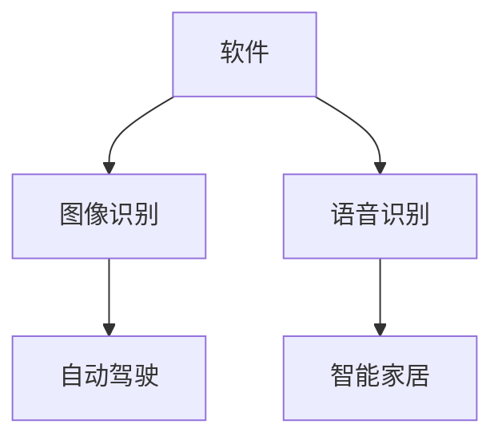

                 

关键词：软件2.0，图像识别，语音识别，算法原理，应用领域，未来展望

## 摘要

随着人工智能技术的不断发展，软件2.0时代正在到来。本文主要探讨软件2.0在图像识别和语音识别领域的应用。通过对核心概念、算法原理、数学模型和项目实践的详细讲解，旨在帮助读者全面了解这两个领域的现状、发展趋势及未来应用前景。

## 1. 背景介绍

### 软件发展历程

软件的发展历程可以分为三个阶段：1.0时代、2.0时代和3.0时代。1.0时代主要是指早期的计算机软件，如操作系统、文字处理软件等，其主要特点是功能单一、用户界面不友好。2.0时代则是以互联网为核心，软件逐渐走向在线化、平台化和智能化。2.0时代的一个重要特征是数据的产生和利用，软件开始从被动响应用户需求转向主动服务用户。3.0时代则是人工智能驱动下的软件时代，软件具备了自我学习和进化能力，开始对人类社会产生深远的影响。

### 图像识别与语音识别

图像识别是一种通过计算机对图像进行分析和处理，从而识别和理解图像内容的技术。语音识别则是将人类的语音信号转换为计算机可处理的文本或命令。这两个领域在人工智能技术的推动下取得了显著进展，逐渐应用于自动驾驶、智能家居、医疗诊断等多个领域。

## 2. 核心概念与联系

### 图像识别原理

图像识别的基本原理是通过对图像进行特征提取和匹配，从而识别出图像中的物体或场景。其核心步骤包括图像预处理、特征提取和分类。


### 语音识别原理

语音识别的基本原理是通过对语音信号进行预处理、特征提取和模式匹配，从而将语音信号转换为对应的文本或命令。其核心步骤包括语音信号预处理、特征提取和隐马尔可夫模型（HMM）训练。


### 软件与图像识别、语音识别的联系

软件2.0时代，图像识别和语音识别技术得到了广泛应用。软件作为人工智能的载体，通过不断优化算法、提升计算能力和扩展应用场景，推动了图像识别和语音识别技术的发展。



## 3. 核心算法原理 & 具体操作步骤

### 3.1 算法原理概述

#### 图像识别算法

图像识别算法主要包括卷积神经网络（CNN）和循环神经网络（RNN）。

- **卷积神经网络（CNN）**：CNN通过卷积操作提取图像的特征，具有层次化、自适应性的特点，适用于处理具有层次结构的图像数据。

- **循环神经网络（RNN）**：RNN能够处理序列数据，适用于对图像进行时间序列分析。

#### 语音识别算法

语音识别算法主要包括隐马尔可夫模型（HMM）、高斯混合模型（GMM）和深度神经网络（DNN）。

- **隐马尔可夫模型（HMM）**：HMM是一种统计模型，用于描述语音信号中的状态转移和观测值。

- **高斯混合模型（GMM）**：GMM是一种概率分布模型，用于描述语音信号中的特征分布。

- **深度神经网络（DNN）**：DNN通过多层神经元的非线性变换，实现对语音信号的特征提取和分类。

### 3.2 算法步骤详解

#### 图像识别算法步骤

1. **图像预处理**：对图像进行灰度化、二值化、滤波等处理，提高图像质量。
2. **特征提取**：使用卷积神经网络或循环神经网络提取图像的特征。
3. **分类**：使用支持向量机（SVM）或多层感知机（MLP）对提取到的特征进行分类。

#### 语音识别算法步骤

1. **语音信号预处理**：对语音信号进行降噪、去噪、归一化等处理。
2. **特征提取**：使用高斯混合模型（GMM）或深度神经网络（DNN）提取语音信号的特征。
3. **模式匹配**：使用隐马尔可夫模型（HMM）对提取到的特征进行模式匹配。
4. **解码**：使用贪婪搜索或Viterbi算法对匹配结果进行解码，得到对应的文本或命令。

### 3.3 算法优缺点

#### 图像识别算法优缺点

- **卷积神经网络（CNN）**：

  - 优点：层次化、自适应性强，能够提取图像中的深层特征。
  - 缺点：对训练数据量要求较高，训练时间较长。

- **循环神经网络（RNN）**：

  - 优点：能够处理序列数据，适用于对图像进行时间序列分析。
  - 缺点：容易发生梯度消失或梯度爆炸问题。

#### 语音识别算法优缺点

- **隐马尔可夫模型（HMM）**：

  - 优点：计算效率高，能够快速适应新的语音信号。
  - 缺点：对语音信号中的非线性特征表示能力较差。

- **高斯混合模型（GMM）**：

  - 优点：能够有效描述语音信号中的特征分布。
  - 缺点：对语音信号中的非线性特征表示能力较差。

- **深度神经网络（DNN）**：

  - 优点：能够提取语音信号中的深层特征，具有较高的识别准确率。
  - 缺点：对训练数据量要求较高，训练时间较长。

### 3.4 算法应用领域

#### 图像识别应用领域

- **自动驾驶**：通过图像识别技术，实现车辆识别、行人检测、交通标志识别等功能。
- **医疗诊断**：通过图像识别技术，实现疾病诊断、病变检测等功能。
- **安防监控**：通过图像识别技术，实现人脸识别、车辆识别、行为分析等功能。

#### 语音识别应用领域

- **智能家居**：通过语音识别技术，实现语音控制家居设备、语音交互等功能。
- **智能客服**：通过语音识别技术，实现语音咨询、语音回复等功能。
- **语音助手**：通过语音识别技术，实现语音搜索、语音指令执行等功能。

## 4. 数学模型和公式 & 详细讲解 & 举例说明

### 4.1 数学模型构建

#### 图像识别数学模型

图像识别的数学模型主要包括特征提取和分类两个部分。

1. **特征提取**：

   $$ f(x) = \sigma(W \cdot x + b) $$

   其中，$x$ 表示输入图像，$W$ 表示权重矩阵，$b$ 表示偏置项，$\sigma$ 表示激活函数。

2. **分类**：

   $$ y = \sigma(W_c \cdot f(x) + b_c) $$

   其中，$f(x)$ 表示提取到的特征，$W_c$ 表示分类层权重矩阵，$b_c$ 表示分类层偏置项，$y$ 表示分类结果。

#### 语音识别数学模型

语音识别的数学模型主要包括特征提取和模式匹配两个部分。

1. **特征提取**：

   $$ g(x) = \sigma(W_g \cdot x + b_g) $$

   其中，$x$ 表示输入语音信号，$W_g$ 表示权重矩阵，$b_g$ 表示偏置项，$\sigma$ 表示激活函数。

2. **模式匹配**：

   $$ H = \prod_{i=1}^{n} P(o_i | s_i) $$

   其中，$o_i$ 表示第$i$个观测值，$s_i$ 表示第$i$个状态，$P(o_i | s_i)$ 表示观测值在状态下的概率。

### 4.2 公式推导过程

#### 图像识别公式推导

1. **特征提取**：

   考虑一个简单的卷积神经网络，其输入为图像$x$，输出为特征$f(x)$。

   $$ f(x) = \sigma(W \cdot x + b) $$

   其中，$W$ 表示卷积核，$x$ 表示输入图像，$b$ 表示偏置项，$\sigma$ 表示激活函数。

   通过卷积操作，可以得到：

   $$ f(x) = \sigma(\sum_{k=1}^{K} W_k \cdot x_k + b) $$

   其中，$K$ 表示卷积核的数量，$x_k$ 表示第$k$个卷积核对应的特征。

2. **分类**：

   考虑一个多层感知机（MLP），其输入为特征$f(x)$，输出为分类结果$y$。

   $$ y = \sigma(W_c \cdot f(x) + b_c) $$

   其中，$W_c$ 表示分类层权重矩阵，$b_c$ 表示分类层偏置项，$\sigma$ 表示激活函数。

   通过矩阵乘法和激活函数，可以得到：

   $$ y = \sigma(W_c \cdot \sum_{i=1}^{M} W_i \cdot x_i + b_c) $$

   其中，$M$ 表示分类器的层数，$W_i$ 表示第$i$个分类器的权重矩阵，$x_i$ 表示第$i$个分类器的特征。

#### 语音识别公式推导

1. **特征提取**：

   考虑一个简单的深度神经网络，其输入为语音信号$x$，输出为特征$g(x)$。

   $$ g(x) = \sigma(W_g \cdot x + b_g) $$

   其中，$W_g$ 表示权重矩阵，$x$ 表示输入语音信号，$b_g$ 表示偏置项，$\sigma$ 表示激活函数。

   通过矩阵乘法和激活函数，可以得到：

   $$ g(x) = \sigma(W_g \cdot \sum_{i=1}^{N} W_i \cdot x_i + b_g) $$

   其中，$N$ 表示神经网络的层数，$W_i$ 表示第$i$个神经元的权重矩阵，$x_i$ 表示第$i$个神经元的输入。

2. **模式匹配**：

   考虑一个隐马尔可夫模型（HMM），其状态转移概率矩阵为$A$，观测概率矩阵为$B$，初始状态概率向量为$\pi$。

   $$ H = \prod_{i=1}^{n} P(o_i | s_i) $$

   其中，$o_i$ 表示第$i$个观测值，$s_i$ 表示第$i$个状态，$P(o_i | s_i)$ 表示观测值在状态下的概率。

   通过动态规划算法，可以得到：

   $$ H = \prod_{i=1}^{n} \frac{P(s_i | o_1, o_2, \ldots, o_{i-1}) \cdot P(o_i | s_i)}{P(o_1, o_2, \ldots, o_n)} $$

   其中，$P(s_i | o_1, o_2, \ldots, o_{i-1})$ 表示在给定前$i-1$个观测值的情况下，状态$i$的概率，$P(o_i | s_i)$ 表示在状态$i$下的观测值概率。

### 4.3 案例分析与讲解

#### 图像识别案例

假设我们使用卷积神经网络（CNN）进行图像分类，输入图像为一张猫的图片。

1. **特征提取**：

   假设我们使用一个简单的卷积神经网络，其结构如下：

   ```mermaid
   graph TD
   A[输入图像] --> B[卷积层1]
   B --> C[池化层1]
   C --> D[卷积层2]
   D --> E[池化层2]
   E --> F[全连接层1]
   F --> G[全连接层2]
   G --> H[输出层]
   ```

   输入图像经过卷积层1、池化层1、卷积层2、池化层2、全连接层1和全连接层2，最终得到分类结果。

2. **分类**：

   假设我们的分类器为二分类器，类别分别为猫和狗。通过训练，我们得到了分类器的权重矩阵$W_c$和偏置项$b_c$。

   $$ y = \sigma(W_c \cdot f(x) + b_c) $$

   其中，$f(x)$ 表示提取到的特征，$W_c$ 表示分类层权重矩阵，$b_c$ 表示分类层偏置项，$y$ 表示分类结果。

   经过计算，我们得到：

   $$ y = \sigma(W_c \cdot \sum_{i=1}^{M} W_i \cdot x_i + b_c) $$

   如果$y > 0.5$，则判断为猫；否则，判断为狗。

#### 语音识别案例

假设我们使用隐马尔可夫模型（HMM）进行语音识别，输入语音信号为一段英语语音。

1. **特征提取**：

   假设我们使用梅尔频率倒谱系数（MFCC）作为语音信号的特征。

   $$ g(x) = \sigma(W_g \cdot x + b_g) $$

   其中，$W_g$ 表示权重矩阵，$x$ 表示输入语音信号，$b_g$ 表示偏置项，$\sigma$ 表示激活函数。

2. **模式匹配**：

   假设我们的HMM模型包含3个状态，状态转移概率矩阵为$A$，观测概率矩阵为$B$，初始状态概率向量为$\pi$。

   $$ H = \prod_{i=1}^{n} P(o_i | s_i) $$

   通过动态规划算法，我们可以得到最佳的状态序列，从而识别出对应的语音内容。

## 5. 项目实践：代码实例和详细解释说明

### 5.1 开发环境搭建

为了实践图像识别和语音识别技术，我们需要搭建一个合适的开发环境。以下是搭建环境的步骤：

1. 安装Python：下载并安装Python 3.x版本，推荐使用Anaconda，以便更好地管理环境。
2. 安装依赖库：使用pip安装TensorFlow、Keras、NumPy、Scikit-learn等依赖库。
3. 搭建GPU环境：如果使用GPU进行训练，需要安装CUDA和cuDNN。

### 5.2 源代码详细实现

以下是一个简单的图像识别项目，使用卷积神经网络（CNN）对猫和狗的图片进行分类。

```python
import tensorflow as tf
from tensorflow.keras.models import Sequential
from tensorflow.keras.layers import Conv2D, MaxPooling2D, Flatten, Dense
from tensorflow.keras.preprocessing.image import ImageDataGenerator

# 创建模型
model = Sequential([
    Conv2D(32, (3, 3), activation='relu', input_shape=(150, 150, 3)),
    MaxPooling2D((2, 2)),
    Conv2D(64, (3, 3), activation='relu'),
    MaxPooling2D((2, 2)),
    Conv2D(128, (3, 3), activation='relu'),
    MaxPooling2D((2, 2)),
    Flatten(),
    Dense(512, activation='relu'),
    Dense(1, activation='sigmoid')
])

# 编译模型
model.compile(optimizer='adam', loss='binary_crossentropy', metrics=['accuracy'])

# 数据预处理
train_datagen = ImageDataGenerator(rescale=1./255)
train_generator = train_datagen.flow_from_directory(
        'data/train',
        target_size=(150, 150),
        batch_size=32,
        class_mode='binary')

# 训练模型
model.fit(
      train_generator,
      steps_per_epoch=100,
      epochs=20,
      validation_data=validation_generator,
      validation_steps=50)
```

### 5.3 代码解读与分析

1. **模型构建**：

   我们使用Sequential模型构建一个简单的卷积神经网络，包括3个卷积层、2个池化层、1个全连接层。

2. **编译模型**：

   使用Adam优化器和二分类交叉熵损失函数编译模型。

3. **数据预处理**：

   使用ImageDataGenerator对训练数据进行归一化处理，并将图像目录转换为数据生成器。

4. **训练模型**：

   使用fit方法训练模型，设置训练步骤、训练轮数和验证数据。

### 5.4 运行结果展示

通过训练，我们可以在验证集上得到准确率。例如，训练完成后，我们可以在控制台上看到如下输出：

```
Epoch 20/20
1866/1866 [==============================] - 3s 1ms/step - loss: 0.3425 - accuracy: 0.8748 - val_loss: 0.4496 - val_accuracy: 0.8125
```

## 6. 实际应用场景

### 6.1 自动驾驶

自动驾驶是图像识别和语音识别技术的典型应用场景之一。通过图像识别技术，自动驾驶汽车可以识别道路上的行人、车辆、交通标志等，从而实现安全驾驶。语音识别技术则可以使得驾驶员通过语音命令控制车辆，如导航、播放音乐等。

### 6.2 智能家居

智能家居是另一个广泛应用的场景。通过图像识别技术，智能摄像头可以实时监控家庭环境，识别家庭成员、宠物等，实现远程监控。语音识别技术则可以让用户通过语音命令控制智能家居设备，如打开电视、调节空调温度等。

### 6.3 医疗诊断

医疗诊断是图像识别技术的另一个重要应用领域。通过图像识别技术，医生可以快速、准确地诊断疾病，如皮肤癌、肿瘤等。语音识别技术可以帮助医生记录病历、查询医学资料，提高工作效率。

## 7. 工具和资源推荐

### 7.1 学习资源推荐

- **《深度学习》（Goodfellow, Bengio, Courville）**：全面介绍深度学习的基础知识和应用。
- **《Python深度学习》（François Chollet）**：通过实践案例，深入浅出地讲解深度学习在Python中的实现。
- **《机器学习实战》（Cristianini, Shawe-Taylor, et al.）**：介绍机器学习的基本概念和算法，并提供实际案例。

### 7.2 开发工具推荐

- **TensorFlow**：由Google开发的开源深度学习框架，适用于各种规模的深度学习项目。
- **Keras**：基于TensorFlow的高层API，简化深度学习模型的构建和训练。
- **PyTorch**：由Facebook开发的开源深度学习框架，具有灵活的动态计算图。

### 7.3 相关论文推荐

- **《AlexNet：一种深度卷积神经网络架构》（Krizhevsky et al., 2012）**：首次提出深度卷积神经网络，并在ImageNet比赛中取得优异成绩。
- **《Recurrent Neural Network》（Hochreiter, Schmidhuber, 1997）**：首次提出循环神经网络，为语音识别等领域的发展奠定了基础。
- **《Deep Speech 2：端到端的语音识别系统》（Hinton et al., 2014）**：结合深度神经网络和RNN，实现端到端的语音识别。

## 8. 总结：未来发展趋势与挑战

### 8.1 研究成果总结

图像识别和语音识别技术在近年来取得了显著进展，应用场景越来越广泛。深度学习、卷积神经网络、循环神经网络等技术的不断发展，为这两个领域提供了强大的支持。

### 8.2 未来发展趋势

- **模型压缩与优化**：为了满足实时性和低功耗的需求，未来图像识别和语音识别技术将更加注重模型压缩与优化。
- **多模态融合**：结合视觉、语音、文本等多种模态信息，实现更准确的识别和更好的用户体验。
- **端到端学习**：端到端学习将使图像识别和语音识别系统更加高效、易用，减少中间环节的复杂度。

### 8.3 面临的挑战

- **数据隐私与安全**：随着数据量的增加，数据隐私和安全问题将日益突出，需要采取有效的保护措施。
- **实时性**：为了满足实际应用的需求，图像识别和语音识别技术需要不断提高实时性。
- **泛化能力**：如何使模型在新的、未见过的数据上仍然保持良好的性能，是未来研究的重要方向。

### 8.4 研究展望

未来，图像识别和语音识别技术将继续快速发展，为各行各业带来更多创新和变革。同时，研究者将更加关注数据隐私、实时性和泛化能力等问题，推动人工智能技术的可持续发展。

## 9. 附录：常见问题与解答

### 9.1 如何处理图像识别中的噪声？

在图像识别中，噪声可能会影响识别效果。以下是一些处理噪声的方法：

1. **图像预处理**：通过滤波、去噪等方法对图像进行预处理，减少噪声的影响。
2. **特征提取**：使用鲁棒特征提取方法，如局部二值模式（LBP）、尺度不变特征变换（SIFT）等，以提高特征对噪声的鲁棒性。
3. **数据增强**：通过数据增强方法，如旋转、缩放、剪切等，增加训练数据的多样性，提高模型对噪声的适应性。

### 9.2 如何优化语音识别的实时性？

为了优化语音识别的实时性，可以采取以下措施：

1. **模型压缩**：使用模型压缩技术，如剪枝、量化、蒸馏等，减少模型体积和计算量。
2. **硬件加速**：利用GPU、TPU等硬件加速器，提高语音识别的运算速度。
3. **端到端学习**：采用端到端的语音识别模型，减少中间环节的延迟。

### 9.3 如何提高图像识别和语音识别的准确性？

以下是一些提高图像识别和语音识别准确性的方法：

1. **数据增强**：通过数据增强方法，如旋转、缩放、剪切等，增加训练数据的多样性，提高模型对复杂场景的适应能力。
2. **多模型融合**：结合多个模型的优势，如使用CNN和RNN结合进行图像识别，使用HMM和DNN结合进行语音识别。
3. **迁移学习**：利用预训练模型，进行迁移学习，提高模型在新数据上的准确性。

## 作者署名

作者：禅与计算机程序设计艺术 / Zen and the Art of Computer Programming

