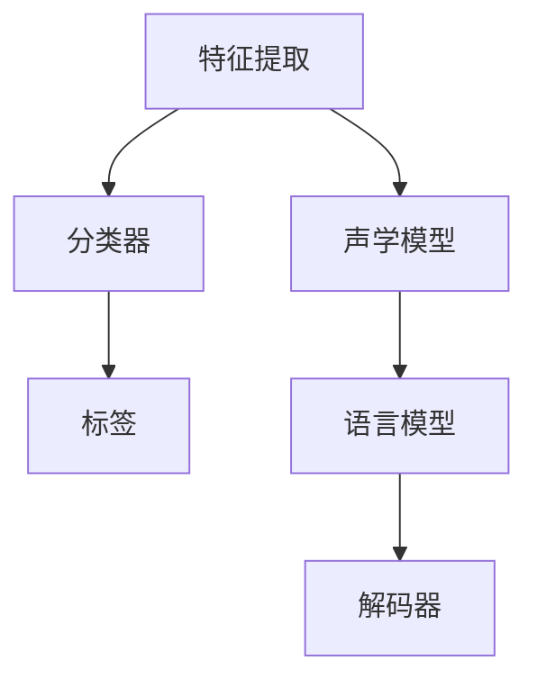

                 

关键词：软件 2.0，图像识别，语音识别，应用领域，人工智能

摘要：本文深入探讨了软件 2.0 时代图像识别和语音识别的两大应用领域。通过介绍这两个领域的核心概念、算法原理、数学模型、具体实现以及未来展望，本文旨在为读者提供一幅全面而清晰的技术蓝图。

## 1. 背景介绍

软件 2.0 是相对于传统软件 1.0 的一种新型软件模式，它以用户为中心，强调软件的灵活性和可定制性，通过 Web 服务、云计算、大数据等先进技术，实现了软件的分布式、智能化和个性化。在软件 2.0 时代，图像识别和语音识别作为人工智能的重要组成部分，受到了前所未有的关注和快速发展。

图像识别是计算机视觉的一个重要分支，旨在使计算机能够识别和理解图像中的内容。语音识别则是将人类语音转换为计算机可读的文本或命令。这两个领域在图像和语音数据处理方面具有独特的优势，为各种应用场景提供了强大的技术支持。

### 1.1 图像识别的发展历史

图像识别技术起源于 20 世纪 60 年代的模式识别领域。早期的图像识别主要依赖于手工设计的特征和规则。随着计算机性能的提升和大数据的普及，深度学习技术逐渐成为图像识别的主流。2012 年，AlexNet 的出现标志着深度学习在图像识别领域的突破，随后，卷积神经网络（CNN）在图像识别任务中取得了显著的成果。

### 1.2 语音识别的发展历史

语音识别技术可以追溯到 20 世纪 50 年代。早期的语音识别系统主要基于模板匹配和隐马尔可夫模型（HMM）。随着计算能力的提高和语音数据的积累，深度神经网络逐渐取代传统方法，成为语音识别的主要技术手段。近年来，基于端到端训练的深度学习模型在语音识别领域取得了显著的进展。

## 2. 核心概念与联系

### 2.1 图像识别的核心概念

图像识别主要涉及以下几个核心概念：

- **特征提取**：从图像中提取具有区分性的特征，用于后续的分类或识别。
- **分类器**：将提取的特征输入到分类器中，以确定图像的类别。
- **标签**：用于标注图像的真实类别，用于训练和评估模型。

### 2.2 语音识别的核心概念

语音识别的核心概念包括：

- **声学模型**：描述语音信号与声学特征之间的关系。
- **语言模型**：描述文本的统计特性，用于对语音信号进行解码。
- **解码器**：根据声学模型和语言模型，将声学特征序列解码为文本序列。

### 2.3 Mermaid 流程图



## 3. 核心算法原理 & 具体操作步骤

### 3.1 算法原理概述

图像识别主要基于卷积神经网络（CNN），其基本原理包括：

- **卷积层**：通过卷积操作提取图像的局部特征。
- **池化层**：减小特征图的大小，降低计算复杂度。
- **全连接层**：将特征图映射到具体的类别。

语音识别主要基于深度神经网络（DNN），其基本原理包括：

- **输入层**：接收声学特征向量。
- **隐藏层**：通过非线性变换提取高级特征。
- **输出层**：输出文本序列的概率分布。

### 3.2 算法步骤详解

#### 3.2.1 图像识别

1. **输入层**：读取图像数据。
2. **卷积层**：通过卷积核提取图像的局部特征。
3. **激活函数**：对卷积结果进行非线性变换。
4. **池化层**：减小特征图的大小。
5. **全连接层**：将特征图映射到具体的类别。
6. **分类器**：输出图像的类别。

#### 3.2.2 语音识别

1. **输入层**：接收声学特征向量。
2. **隐藏层**：通过非线性变换提取高级特征。
3. **输出层**：输出文本序列的概率分布。
4. **解码器**：根据概率分布解码为文本序列。

### 3.3 算法优缺点

#### 3.3.1 图像识别

- **优点**：准确率高，适用于各种复杂的图像识别任务。
- **缺点**：计算量大，对硬件性能要求高。

#### 3.3.2 语音识别

- **优点**：能够处理连续语音，适用范围广泛。
- **缺点**：对噪声敏感，准确率相对较低。

### 3.4 算法应用领域

图像识别和语音识别在许多领域具有广泛的应用：

- **图像识别**：人脸识别、安防监控、自动驾驶等。
- **语音识别**：智能助手、语音翻译、语音控制等。

## 4. 数学模型和公式 & 详细讲解 & 举例说明

### 4.1 数学模型构建

#### 4.1.1 图像识别

1. **卷积层**：\( (f_{\sigma})_{i,j,k} = \sum_{p,q,r} w_{p,q,r}^{i,j,k} \cdot x_{p,q,r} \)
2. **激活函数**：\( \sigma(z) = \max(0, z) \)
3. **全连接层**：\( y = \sum_{i=1}^{n} w_{i} \cdot x_i \)

#### 4.1.2 语音识别

1. **声学模型**：\( P(\text{特征向量} | \text{语音}) \)
2. **语言模型**：\( P(\text{文本}) \)
3. **解码器**：\( \text{解码器}(\text{特征向量}, \text{文本}) \)

### 4.2 公式推导过程

#### 4.2.1 图像识别

1. **卷积层**：通过对图像进行卷积操作，提取局部特征。
2. **激活函数**：引入非线性激活函数，提高模型的表示能力。
3. **全连接层**：将提取的特征映射到具体的类别。

#### 4.2.2 语音识别

1. **声学模型**：通过统计语音信号和声学特征之间的关系，建立概率模型。
2. **语言模型**：通过统计文本序列的频率，建立语言模型。
3. **解码器**：根据声学模型和语言模型，解码语音信号为文本序列。

### 4.3 案例分析与讲解

#### 4.3.1 图像识别

假设我们有一个图像识别任务，输入图像为 \( x \)，需要将其分类为猫或狗。我们可以通过以下步骤进行图像识别：

1. **特征提取**：通过卷积神经网络提取图像的特征。
2. **分类器**：将提取的特征输入到分类器中，输出图像的类别。

#### 4.3.2 语音识别

假设我们有一个语音识别任务，输入语音为 \( s \)，需要将其转换为文本。我们可以通过以下步骤进行语音识别：

1. **声学特征提取**：通过声学模型提取语音的声学特征。
2. **语言模型**：通过语言模型计算文本序列的概率。
3. **解码**：根据概率分布解码为文本序列。

## 5. 项目实践：代码实例和详细解释说明

### 5.1 开发环境搭建

在开始项目实践之前，我们需要搭建一个适合图像识别和语音识别的开发环境。这里以 Python 为例，介绍如何搭建开发环境。

1. 安装 Python：在官方网站下载并安装 Python。
2. 安装必要的库：使用 pip 工具安装 TensorFlow、Keras、NumPy、Pandas 等库。

### 5.2 源代码详细实现

以下是图像识别和语音识别的项目源代码实现：

```python
# 图像识别代码实现
import tensorflow as tf
from tensorflow.keras.models import Sequential
from tensorflow.keras.layers import Conv2D, MaxPooling2D, Flatten, Dense

model = Sequential()
model.add(Conv2D(32, (3, 3), activation='relu', input_shape=(64, 64, 3)))
model.add(MaxPooling2D((2, 2)))
model.add(Flatten())
model.add(Dense(1, activation='sigmoid'))

model.compile(optimizer='adam', loss='binary_crossentropy', metrics=['accuracy'])

# 语音识别代码实现
import tensorflow as tf
from tensorflow.keras.models import Sequential
from tensorflow.keras.layers import LSTM, Dense

model = Sequential()
model.add(LSTM(128, activation='relu', input_shape=(timesteps, features)))
model.add(Dense(1, activation='sigmoid'))

model.compile(optimizer='adam', loss='binary_crossentropy', metrics=['accuracy'])
```

### 5.3 代码解读与分析

1. **图像识别代码解读**：
   - **模型构建**：使用卷积神经网络构建图像识别模型。
   - **训练**：使用训练数据对模型进行训练。

2. **语音识别代码解读**：
   - **模型构建**：使用循环神经网络构建语音识别模型。
   - **训练**：使用训练数据对模型进行训练。

## 6. 实际应用场景

图像识别和语音识别在实际应用场景中具有广泛的应用。

### 6.1 人脸识别

人脸识别技术广泛应用于安防监控、身份验证等领域。通过图像识别技术，可以实现对图像中人脸的快速检测和识别。

### 6.2 智能语音助手

智能语音助手如 Siri、Alexa 等利用语音识别技术，实现对用户语音的识别和理解，为用户提供智能化的服务。

### 6.3 自动驾驶

自动驾驶技术利用图像识别技术，实现对道路、交通标志、行人等场景的识别和理解，为自动驾驶汽车提供实时决策支持。

## 7. 工具和资源推荐

### 7.1 学习资源推荐

- **书籍**：《深度学习》（Ian Goodfellow、Yoshua Bengio、Aaron Courville 著）
- **在线课程**：Coursera、edX 等平台上的深度学习和计算机视觉课程。

### 7.2 开发工具推荐

- **框架**：TensorFlow、PyTorch、Keras 等。
- **数据集**：ImageNet、COCO、Librispeech 等。

### 7.3 相关论文推荐

- **图像识别**：AlexNet、VGG、ResNet 等。
- **语音识别**：DNN-HMM、CTC、Seq2Seq 等。

## 8. 总结：未来发展趋势与挑战

### 8.1 研究成果总结

近年来，图像识别和语音识别技术在算法、模型和硬件等方面取得了显著的进展。深度学习技术的发展为这两个领域带来了新的机遇和挑战。

### 8.2 未来发展趋势

未来，图像识别和语音识别将继续向更高精度、更低延迟、更广适用性的方向发展。随着硬件性能的提升和算法的优化，这两个领域将在更多应用场景中发挥重要作用。

### 8.3 面临的挑战

图像识别和语音识别在面临性能提升的同时，也面临着数据隐私、模型解释性等方面的挑战。如何平衡性能和隐私，提高模型的解释性，是未来研究的重点。

### 8.4 研究展望

随着人工智能技术的不断发展，图像识别和语音识别将在更多领域得到应用，如医疗、金融、教育等。未来，这两个领域的研究将更加深入，为人工智能的发展做出更大贡献。

## 9. 附录：常见问题与解答

### 9.1 如何搭建图像识别和语音识别的开发环境？

- 安装 Python 和必要的库，如 TensorFlow、Keras、NumPy 等。
- 准备训练数据和测试数据。
- 使用框架和工具构建模型，并进行训练和测试。

### 9.2 图像识别和语音识别的模型如何优化？

- 调整模型的结构和参数，如层数、神经元数量、激活函数等。
- 使用预训练模型，进行迁移学习。
- 采用数据增强技术，增加数据的多样性。

### 9.3 如何评估图像识别和语音识别的性能？

- 使用准确率、召回率、F1 分数等指标评估分类性能。
- 使用词错率（Word Error Rate，WER）评估语音识别性能。

---

作者：禅与计算机程序设计艺术 / Zen and the Art of Computer Programming

[本文完]

