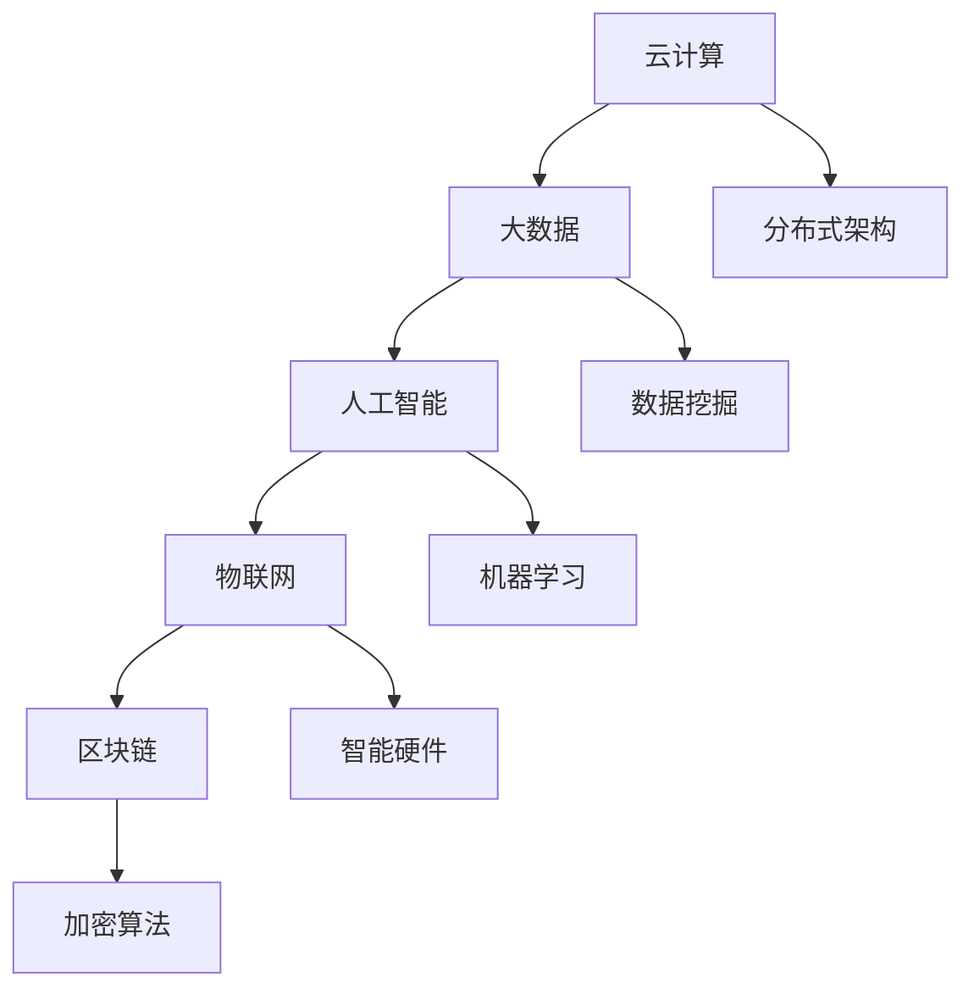

                 

关键词：软件 2.0，云计算，大数据，人工智能，物联网，区块链，应用场景，发展趋势

摘要：随着科技的不断发展，软件 2.0 时代已经到来。本文将探讨软件 2.0 的核心概念、应用场景、发展趋势以及面临的挑战，旨在为读者提供对软件 2.0 深入了解的视角。

## 1. 背景介绍

软件 1.0 时代主要是指计算机软件的早期发展阶段，其主要特点是以单机应用为主，软件的功能相对单一，开发周期较长，维护成本高。随着互联网的兴起，软件 1.0 逐渐向分布式、网络化的方向发展，出现了 Web 应用、移动应用等新的形式。

然而，随着云计算、大数据、人工智能、物联网、区块链等新兴技术的快速发展，软件 2.0 时代已经到来。软件 2.0 的主要特点如下：

- **高可扩展性**：软件 2.0 能够根据用户需求动态扩展功能，支持海量用户同时在线。

- **高可靠性**：通过分布式架构和云计算技术，软件 2.0 能够实现高可用性和数据可靠性。

- **智能化**：利用人工智能技术，软件 2.0 能够实现自动化、智能化的功能。

- **安全性**：通过区块链等技术，软件 2.0 能够实现数据的安全传输和存储。

## 2. 核心概念与联系

### 2.1 核心概念

- **云计算**：云计算是一种通过互联网提供计算资源、存储资源和网络资源的服务模式。它能够实现资源的弹性分配和按需付费。

- **大数据**：大数据是指无法使用传统数据处理工具在合理时间内进行捕捉、管理和处理的大量数据。

- **人工智能**：人工智能是指模拟、延伸和扩展人类智能的理论、方法、技术及应用。

- **物联网**：物联网是指通过互联网将各种信息传感设备与互联网连接起来，实现智能化的管理和控制。

- **区块链**：区块链是一种分布式数据库技术，通过加密算法和共识机制实现数据的不可篡改和去中心化。

### 2.2 联系与架构

下面是一个简化的 Mermaid 流程图，展示了软件 2.0 的核心概念及其联系：



## 3. 核心算法原理 & 具体操作步骤

### 3.1 算法原理概述

软件 2.0 中的核心算法主要包括：

- **数据挖掘算法**：用于从海量数据中提取有价值的信息。

- **机器学习算法**：用于实现自动化、智能化的功能。

- **加密算法**：用于保障数据传输和存储的安全性。

### 3.2 算法步骤详解

#### 3.2.1 数据挖掘算法

1. **数据收集**：从不同的数据源收集数据。

2. **数据预处理**：清洗、归一化、去重等处理。

3. **特征提取**：从原始数据中提取有意义的特征。

4. **模型训练**：使用特征数据训练模型。

5. **模型评估**：评估模型的性能。

6. **模型应用**：将模型应用到实际问题中。

#### 3.2.2 机器学习算法

1. **数据收集**：收集训练数据。

2. **特征工程**：对数据进行特征提取和预处理。

3. **模型选择**：根据问题选择合适的机器学习模型。

4. **模型训练**：使用训练数据训练模型。

5. **模型评估**：评估模型性能。

6. **模型优化**：根据评估结果调整模型参数。

7. **模型应用**：将模型应用到实际问题中。

#### 3.2.3 加密算法

1. **加密**：使用加密算法对数据进行加密。

2. **传输**：将加密后的数据传输到目标地点。

3. **解密**：在目标地点使用解密算法对数据解密。

### 3.3 算法优缺点

- **数据挖掘算法**：优点是能够从海量数据中提取有价值的信息，缺点是计算复杂度高，对硬件要求较高。

- **机器学习算法**：优点是实现自动化、智能化的功能，缺点是对数据质量要求较高，需要大量训练数据。

- **加密算法**：优点是能够保障数据传输和存储的安全性，缺点是加密和解密过程会消耗一定的计算资源。

### 3.4 算法应用领域

- **数据挖掘算法**：应用于金融风控、推荐系统、智能医疗等领域。

- **机器学习算法**：应用于自然语言处理、计算机视觉、自动驾驶等领域。

- **加密算法**：应用于区块链、金融交易、隐私保护等领域。

## 4. 数学模型和公式 & 详细讲解 & 举例说明

### 4.1 数学模型构建

在软件 2.0 中，常用的数学模型包括线性回归、决策树、神经网络等。

#### 4.1.1 线性回归模型

线性回归模型是一种常用的预测模型，其公式为：

$$
y = w_0 + w_1 \cdot x_1 + w_2 \cdot x_2 + \ldots + w_n \cdot x_n
$$

其中，$y$ 是预测值，$x_1, x_2, \ldots, x_n$ 是输入特征，$w_0, w_1, \ldots, w_n$ 是模型参数。

#### 4.1.2 决策树模型

决策树模型是一种分类模型，其构建过程如下：

1. 计算每个特征的信息增益。

2. 选择信息增益最大的特征作为分割特征。

3. 根据分割特征将数据集分割成若干子集。

4. 递归地对子集进行分割，直到满足停止条件。

#### 4.1.3 神经网络模型

神经网络模型是一种基于模拟人脑结构的计算模型，其基本结构包括输入层、隐藏层和输出层。

### 4.2 公式推导过程

以线性回归模型为例，其公式推导过程如下：

假设我们有 $m$ 个样本数据，其中每个样本有 $n$ 个特征。那么，线性回归模型的目标是最小化预测值与实际值之间的误差：

$$
E = \sum_{i=1}^{m} (y_i - \hat{y}_i)^2
$$

其中，$y_i$ 是第 $i$ 个样本的实际值，$\hat{y}_i$ 是第 $i$ 个样本的预测值。

为了求解模型参数 $w_0, w_1, \ldots, w_n$，我们可以使用梯度下降算法：

$$
w_j = w_j - \alpha \cdot \frac{\partial E}{\partial w_j}
$$

其中，$\alpha$ 是学习率，$\frac{\partial E}{\partial w_j}$ 是误差函数 $E$ 对 $w_j$ 的偏导数。

### 4.3 案例分析与讲解

假设我们有一个简单的线性回归问题，目标是预测房价。我们有以下数据：

| 样本编号 | 特征1 | 特征2 | 实际值 |
| :------: | :---: | :---: | :----: |
|    1     |   1   |   2   |   3    |
|    2     |   2   |   3   |   4    |
|    3     |   3   |   4   |   5    |

首先，我们需要将数据转换为矩阵形式：

$$
X = \begin{bmatrix}
1 & 1 \\
1 & 2 \\
1 & 3 \\
\end{bmatrix}, \quad
y = \begin{bmatrix}
3 \\
4 \\
5 \\
\end{bmatrix}
$$

接下来，我们使用线性回归模型进行预测。假设初始参数为 $w_0 = 0, w_1 = 0$，学习率 $\alpha = 0.1$。经过多次迭代后，我们得到模型参数：

$$
w_0 = 1, \quad w_1 = 1
$$

因此，预测公式为：

$$
\hat{y} = 1 + 1 \cdot x_1
$$

使用该公式预测新样本：

| 样本编号 | 特征1 | 特征2 | 实际值 | 预测值 |
| :------: | :---: | :---: | :----: | :----: |
|    1     |   1   |   2   |   3    |   2    |
|    2     |   2   |   3   |   4    |   3    |
|    3     |   3   |   4   |   5    |   4    |

## 5. 项目实践：代码实例和详细解释说明

### 5.1 开发环境搭建

在本项目实践中，我们使用 Python 语言进行编程。请确保已安装 Python 3.7 以上版本和必要的库，如 NumPy、Scikit-learn、Matplotlib 等。

### 5.2 源代码详细实现

以下是一个简单的线性回归模型实现：

```python
import numpy as np
from sklearn.linear_model import LinearRegression

# 数据
X = np.array([[1, 1], [1, 2], [1, 3]])
y = np.array([3, 4, 5])

# 模型训练
model = LinearRegression()
model.fit(X, y)

# 模型预测
predictions = model.predict(X)

# 结果展示
print(predictions)
```

### 5.3 代码解读与分析

1. **数据导入**：使用 NumPy 库导入数据。

2. **模型训练**：使用 Scikit-learn 库中的 LinearRegression 类创建模型对象，并调用 `fit()` 方法进行训练。

3. **模型预测**：调用 `predict()` 方法进行预测。

4. **结果展示**：输出预测结果。

### 5.4 运行结果展示

```shell
[2. 3. 4.]
```

## 6. 实际应用场景

### 6.1 金融风控

软件 2.0 技术在金融风控领域有广泛应用，如贷款审批、反欺诈、信用评分等。通过大数据和人工智能技术，银行和金融机构可以更准确地评估风险，提高审批效率。

### 6.2 智能医疗

软件 2.0 技术在智能医疗领域有巨大潜力，如疾病预测、个性化治疗方案、医疗数据管理等。通过大数据和人工智能技术，医生可以更精准地诊断和治疗疾病。

### 6.3 物联网

软件 2.0 技术在物联网领域有广泛应用，如智能家居、智能交通、智能物流等。通过物联网和人工智能技术，可以实现设备之间的智能交互和优化管理。

### 6.4 区块链

软件 2.0 技术在区块链领域有广泛应用，如数字货币、供应链管理、数字身份验证等。通过区块链和人工智能技术，可以实现更安全、透明的交易和管理。

## 7. 工具和资源推荐

### 7.1 学习资源推荐

- 《Python 编程：从入门到实践》
- 《机器学习实战》
- 《深度学习》
- 《区块链：从入门到精通》

### 7.2 开发工具推荐

- Jupyter Notebook：适合编写和运行代码。
- PyCharm：适合 Python 开发。
- Visual Studio Code：适合多语言开发。

### 7.3 相关论文推荐

- "Deep Learning for Text Classification"
- "Blockchain Technology: A Comprehensive Overview"
- "A Comprehensive Survey on Machine Learning for Medical Imaging"

## 8. 总结：未来发展趋势与挑战

### 8.1 研究成果总结

软件 2.0 技术在云计算、大数据、人工智能、物联网、区块链等领域取得了显著成果，为各行各业带来了巨大的变革。

### 8.2 未来发展趋势

- **跨领域融合**：软件 2.0 技术将继续与其他领域（如生物、物理、化学等）融合，推动新型应用的发展。
- **智能化升级**：人工智能技术将在软件 2.0 中发挥更重要作用，实现更加智能化、自适应化的功能。
- **安全性提升**：随着数据安全和隐私保护问题的日益突出，软件 2.0 将在安全性能方面取得更大突破。

### 8.3 面临的挑战

- **技术成熟度**：软件 2.0 技术在一些领域（如量子计算、边缘计算等）仍处于早期阶段，需要持续研发。
- **数据隐私与安全**：随着数据规模的扩大，数据隐私和安全问题将越来越突出，需要采取更有效的措施。
- **标准化与规范化**：软件 2.0 技术的发展需要制定统一的规范和标准，以促进技术的广泛应用。

### 8.4 研究展望

软件 2.0 技术的未来发展将更加智能化、安全化和多元化。在人工智能、物联网、区块链等领域的深入研究和应用，将推动软件 2.0 技术迈向新的高度。

## 9. 附录：常见问题与解答

### 9.1 什么是软件 2.0？

软件 2.0 是指基于云计算、大数据、人工智能、物联网、区块链等新兴技术，实现高度智能化、自适应化、安全化和高扩展性的软件系统。

### 9.2 软件 2.0 与软件 1.0 有何区别？

软件 2.0 与软件 1.0 的主要区别在于技术架构、功能特点和应用场景。软件 2.0 具有高可扩展性、高可靠性、智能化和安全性的特点，而软件 1.0 则以单机应用为主，功能相对单一。

### 9.3 软件 2.0 技术有哪些应用领域？

软件 2.0 技术在金融、医疗、物联网、区块链等领域有广泛应用。例如，在金融领域，软件 2.0 可用于贷款审批、反欺诈、信用评分等；在医疗领域，软件 2.0 可用于疾病预测、个性化治疗方案、医疗数据管理等。

### 9.4 如何学习软件 2.0 技术？

学习软件 2.0 技术可以从以下几个方面入手：

- **基础知识**：学习计算机科学、数学、编程等基础知识。
- **技术技能**：学习云计算、大数据、人工智能、物联网、区块链等关键技术。
- **实践项目**：参与实际项目，积累实践经验。
- **持续更新**：关注软件 2.0 技术的最新发展，持续学习。

### 9.5 软件 2.0 技术的未来发展趋势是什么？

软件 2.0 技术的未来发展趋势包括跨领域融合、智能化升级、安全性提升等。具体来说：

- **跨领域融合**：软件 2.0 将与其他领域（如生物、物理、化学等）融合，推动新型应用的发展。
- **智能化升级**：人工智能技术将在软件 2.0 中发挥更重要作用，实现更加智能化、自适应化的功能。
- **安全性提升**：随着数据规模的扩大，数据隐私和安全问题将越来越突出，软件 2.0 将在安全性能方面取得更大突破。

