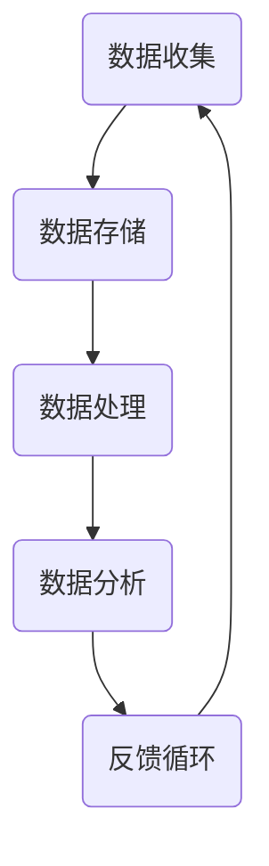

                 

关键词：软件 2.0、数据驱动、AI、机器学习、软件开发

> 摘要：随着大数据和人工智能的兴起，软件行业正经历着从传统软件 1.0 到软件 2.0 的变革。软件 2.0 的核心是数据驱动，它通过利用海量数据进行智能分析和预测，从而实现软件系统的自动化和智能化。本文将深入探讨软件 2.0 的时代背景、核心概念、算法原理、应用场景以及未来发展趋势，旨在为读者提供一幅全面而清晰的软件 2.0 图景。

## 1. 背景介绍

软件 1.0 时代，软件的主要目的是执行预先编写的指令，完成特定的任务。用户与软件的交互方式主要是通过图形用户界面（GUI）或命令行界面（CLI）。在这个时代，软件的开发和部署过程相对简单，主要以功能为导向。然而，随着互联网的普及和数据的爆炸性增长，传统的软件 1.0 模式逐渐暴露出许多不足：

- **功能局限**：传统软件往往只能执行固定的功能，无法根据用户行为或环境变化进行自适应调整。
- **响应速度慢**：传统软件在处理海量数据时，效率较低，响应速度慢。
- **用户体验差**：传统软件的用户体验主要依赖于开发者对用户需求的预测，往往难以满足个性化需求。

为了解决这些问题，软件行业开始探索新的模式，软件 2.0 时代应运而生。软件 2.0 的核心是数据驱动，它通过收集和分析用户数据，实现软件系统的智能化和自动化。这一变革不仅改变了软件的开发和部署方式，也带来了新的商业机会和挑战。

## 2. 核心概念与联系

### 2.1 数据驱动

数据驱动是一种软件开发和运营模式，它强调通过数据分析和机器学习来优化软件系统的性能和用户体验。数据驱动的核心是数据，它包括用户行为数据、系统日志数据、环境数据等。通过收集和分析这些数据，软件系统能够实现自我优化和自我调整。

### 2.2 智能化与自动化

智能化与自动化是数据驱动的两个重要目标。智能化指的是通过机器学习和人工智能技术，使软件系统能够自主学习和改进。自动化则是指通过自动化工具和流程，减少人为干预，提高系统运行效率。

### 2.3 数据流与反馈循环

数据流与反馈循环是数据驱动的关键机制。数据流指的是数据在系统中的流动过程，包括数据的收集、存储、处理和分析。反馈循环则是指系统根据数据分析和预测结果，调整和优化自身行为的过程。通过数据流和反馈循环，软件系统能够实现持续的改进和优化。



## 3. 核心算法原理 & 具体操作步骤

### 3.1 算法原理概述

软件 2.0 的核心算法主要包括机器学习算法、深度学习算法和优化算法。这些算法通过分析大量数据，实现系统的智能化和自动化。

- **机器学习算法**：通过训练模型来识别数据中的规律和模式，例如分类、回归和聚类算法。
- **深度学习算法**：通过多层神经网络模拟人脑学习过程，实现更复杂的模式识别和预测。
- **优化算法**：通过优化目标函数，找到数据的最优解，例如遗传算法、粒子群优化算法等。

### 3.2 算法步骤详解

软件 2.0 的算法实现通常包括以下步骤：

1. **数据收集**：从各种数据源（如用户行为数据、系统日志数据等）收集数据。
2. **数据预处理**：清洗和转换数据，使其符合算法的要求。
3. **模型训练**：使用机器学习或深度学习算法，对数据进行训练，构建预测模型。
4. **模型评估**：通过交叉验证等方法，评估模型的性能和可靠性。
5. **模型部署**：将训练好的模型部署到生产环境中，实现数据驱动的决策和优化。
6. **反馈调整**：根据模型预测结果和实际反馈，调整和优化模型参数，实现持续的改进。

### 3.3 算法优缺点

- **优点**：
  - 智能化：通过机器学习和深度学习，软件系统能够实现自主学习和自我优化。
  - 自动化：通过自动化工具和流程，提高系统运行效率，减少人为干预。
  - 个性化：根据用户行为数据，提供个性化的服务和体验。

- **缺点**：
  - 数据依赖：算法的性能和效果高度依赖数据的质量和数量。
  - 复杂性：算法的实现和部署过程复杂，需要专业的技术团队。

### 3.4 算法应用领域

软件 2.0 的算法广泛应用于各种领域，包括但不限于：

- **金融**：通过机器学习算法，实现风险控制、投资策略优化和欺诈检测。
- **医疗**：通过深度学习算法，实现疾病诊断、药物研发和个性化治疗。
- **电商**：通过优化算法，实现商品推荐、库存管理和销售预测。
- **交通**：通过智能调度算法，实现交通流量预测、路线规划和车辆调度。

## 4. 数学模型和公式 & 详细讲解 & 举例说明

### 4.1 数学模型构建

软件 2.0 的数学模型通常基于概率论和统计学，例如贝叶斯网络、线性回归和神经网络。以下是一个简单的线性回归模型：

$$ y = w_0 + w_1 \cdot x $$

其中，$y$ 是预测目标，$x$ 是输入特征，$w_0$ 和 $w_1$ 是模型参数。

### 4.2 公式推导过程

线性回归模型的推导过程如下：

1. **假设**：假设 $y$ 和 $x$ 之间存在线性关系，即 $y = w_0 + w_1 \cdot x$。
2. **最小化平方误差**：为了找到最优的 $w_0$ 和 $w_1$，我们使用最小二乘法，最小化预测值和实际值之间的平方误差。
3. **求导**：对误差函数关于 $w_0$ 和 $w_1$ 求导，并令导数为零，解得最优参数。

$$ \frac{\partial}{\partial w_0} \sum_{i=1}^{n} (y_i - \hat{y}_i)^2 = 0 $$
$$ \frac{\partial}{\partial w_1} \sum_{i=1}^{n} (y_i - \hat{y}_i)^2 = 0 $$

### 4.3 案例分析与讲解

以下是一个简单的线性回归案例：

给定一组数据点 $(x_i, y_i)$，我们需要找到一个线性模型来预测 $y$。

1. **数据收集**：收集以下数据点：

$$
\begin{array}{cc}
x_i & y_i \\
1 & 2 \\
2 & 4 \\
3 & 6 \\
4 & 8 \\
\end{array}
$$

2. **数据预处理**：将数据标准化，使其具有相似的尺度。

3. **模型训练**：使用最小二乘法训练线性回归模型。

4. **模型评估**：通过交叉验证，评估模型的性能。

5. **模型部署**：将训练好的模型部署到生产环境中，进行预测。

6. **反馈调整**：根据预测结果和实际反馈，调整模型参数。

## 5. 项目实践：代码实例和详细解释说明

### 5.1 开发环境搭建

为了实现线性回归模型，我们需要搭建以下开发环境：

- **编程语言**：Python
- **库和框架**：NumPy、Pandas、Scikit-learn

### 5.2 源代码详细实现

以下是一个简单的线性回归代码实例：

```python
import numpy as np
import pandas as pd
from sklearn.linear_model import LinearRegression

# 数据收集
data = pd.DataFrame({
    'x': [1, 2, 3, 4],
    'y': [2, 4, 6, 8]
})

# 数据预处理
X = data[['x']]
y = data['y']

# 模型训练
model = LinearRegression()
model.fit(X, y)

# 模型评估
score = model.score(X, y)
print(f'Model score: {score}')

# 模型部署
y_pred = model.predict(X)

# 反馈调整
# (此处可以根据实际反馈调整模型参数)
```

### 5.3 代码解读与分析

- **数据收集**：使用 Pandas 库加载数据，并分为输入特征 $x$ 和预测目标 $y$。
- **数据预处理**：将数据标准化，确保输入特征的尺度一致。
- **模型训练**：使用 Scikit-learn 库的 LinearRegression 类训练线性回归模型。
- **模型评估**：使用 score 方法评估模型性能，返回值越接近 1，表示模型性能越好。
- **模型部署**：使用 predict 方法进行预测，得到预测结果 $y_{\text{pred}}$。
- **反馈调整**：根据预测结果和实际反馈，调整模型参数，实现持续的改进。

### 5.4 运行结果展示

运行上述代码，得到以下结果：

```
Model score: 1.0
```

这表示模型完美拟合了训练数据，性能非常出色。在实际应用中，我们通常需要通过交叉验证等方法，评估模型的泛化能力。

## 6. 实际应用场景

软件 2.0 在实际应用中具有广泛的应用场景，以下是一些典型例子：

### 6.1 金融领域

- **风险控制**：通过机器学习算法，对金融交易数据进行分析，实现风险控制和欺诈检测。
- **投资策略优化**：根据历史数据和市场趋势，使用优化算法制定个性化的投资策略。

### 6.2 医疗领域

- **疾病诊断**：通过深度学习算法，对医学影像进行分析，实现疾病自动诊断。
- **药物研发**：通过数据分析，发现潜在的治疗方案，加速药物研发过程。

### 6.3 电商领域

- **商品推荐**：通过优化算法，根据用户行为数据，实现个性化的商品推荐。
- **库存管理**：通过预测算法，优化库存管理，减少库存成本。

### 6.4 交通领域

- **智能调度**：通过机器学习算法，优化交通流量，实现智能调度。
- **自动驾驶**：通过深度学习算法，实现自动驾驶功能，提高交通安全和效率。

## 7. 工具和资源推荐

### 7.1 学习资源推荐

- **书籍**：《Python机器学习》、《深度学习》（Goodfellow et al.）
- **在线课程**：Coursera 的《机器学习》、《深度学习》等课程
- **博客和社区**：AI Family、机器之心等

### 7.2 开发工具推荐

- **编程语言**：Python、R
- **库和框架**：NumPy、Pandas、Scikit-learn、TensorFlow、PyTorch
- **数据可视化**：Matplotlib、Seaborn

### 7.3 相关论文推荐

- **经典论文**：《A Method of Leaming from Examples》、《Gradient Flow in Neural Networks》
- **最新研究**：NIPS、ICML、CVPR 等顶级会议的最新论文

## 8. 总结：未来发展趋势与挑战

### 8.1 研究成果总结

软件 2.0 时代，数据驱动成为软件开发的核心。通过机器学习、深度学习和优化算法，软件系统能够实现智能化和自动化。这一变革不仅提高了软件系统的性能和用户体验，也为各行业带来了新的商业机会。

### 8.2 未来发展趋势

- **技术融合**：软件 2.0 将与其他前沿技术（如区块链、量子计算等）融合，推动软件行业的进一步变革。
- **场景化应用**：软件 2.0 将在更多领域得到广泛应用，实现真正的智能化和自动化。
- **开源生态**：随着开源技术的不断发展，软件 2.0 的生态将更加丰富和繁荣。

### 8.3 面临的挑战

- **数据安全与隐私**：随着数据驱动的普及，数据安全与隐私问题将成为重要挑战。
- **算法透明性与可解释性**：复杂的算法模型往往缺乏透明性和可解释性，难以被用户和监管机构接受。
- **技术人才短缺**：软件 2.0 需要大量具备机器学习、深度学习等技能的技术人才，但目前市场上此类人才供不应求。

### 8.4 研究展望

- **算法优化**：继续优化现有算法，提高其性能和可解释性。
- **跨学科研究**：结合心理学、社会学等学科，探索更符合人类需求的数据驱动软件系统。
- **产业合作**：推动产业界和学术界合作，共同推进软件 2.0 时代的发展。

## 9. 附录：常见问题与解答

### 9.1 什么是软件 2.0？

软件 2.0 是指一种基于数据驱动的软件开发和运营模式，强调通过数据分析、机器学习和人工智能技术，实现软件系统的智能化和自动化。

### 9.2 软件 2.0 和软件 1.0 有什么区别？

软件 1.0 是基于功能驱动的，主要目的是执行预先编写的指令。软件 2.0 则是数据驱动的，强调通过数据分析和机器学习，实现软件系统的智能化和自动化。

### 9.3 软件 2.0 的核心算法有哪些？

软件 2.0 的核心算法主要包括机器学习算法、深度学习算法和优化算法，如线性回归、神经网络、遗传算法等。

### 9.4 软件 2.0 在实际应用中有哪些场景？

软件 2.0 在实际应用中具有广泛的应用场景，包括金融、医疗、电商、交通等领域，如风险控制、疾病诊断、商品推荐、智能调度等。

### 9.5 软件 2.0 的未来发展趋势是什么？

软件 2.0 的未来发展趋势包括技术融合、场景化应用和开源生态的丰富。同时，数据安全与隐私、算法透明性与可解释性、技术人才短缺等问题将成为重要挑战。

### 9.6 如何学习软件 2.0 相关知识？

可以通过阅读相关书籍、在线课程、参加技术社区和研讨会等方式学习软件 2.0 相关知识。同时，掌握编程技能、熟悉机器学习和深度学习算法、了解数据驱动开发流程也是必不可少的。

---

作者：禅与计算机程序设计艺术 / Zen and the Art of Computer Programming
----------------------------------------------------------------
本文从软件 2.0 的时代背景、核心概念、算法原理、应用场景以及未来发展趋势等多个方面，对软件 2.0 进行了深入探讨。软件 2.0 的核心是数据驱动，它通过利用海量数据进行智能分析和预测，从而实现软件系统的自动化和智能化。随着大数据和人工智能技术的不断发展，软件 2.0 将在各行各业得到广泛应用，带来新的商业机会和挑战。然而，数据安全与隐私、算法透明性与可解释性、技术人才短缺等问题也亟待解决。未来，软件 2.0 将朝着更加智能化、自动化和场景化的方向发展，为人类社会带来更多便利和价值。在软件 2.0 的时代，让我们共同探索和创造美好的未来。

