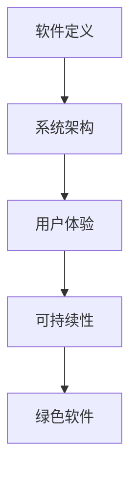

                 

关键词：软件 2.0、未来愿景、技术创新、人工智能、系统架构、可持续性、用户体验

> 摘要：本文探讨了软件 2.0 时代的未来愿景，分析了技术创新如何改变我们的生活方式和商业模式。通过深入探讨人工智能、系统架构、可持续性和用户体验等核心领域，本文提出了创造更美好世界的可能性。

## 1. 背景介绍

### 软件发展的里程碑

软件的发展可以追溯到计算机诞生的时代。从最初的机器语言编程，到高级编程语言的出现，再到面向对象编程的兴起，软件行业经历了数次重大变革。每一次变革都推动了技术的进步，也改变了我们的生活方式。

### 软件 1.0 时代

在软件 1.0 时代，软件主要是为了满足特定功能而开发。操作系统、办公软件、数据库管理系统等成为了这一时期的主要产品。这一时期的软件特点是功能单一、用户界面简单。

### 软件 2.0 时代

随着互联网的兴起，软件行业进入了 2.0 时代。这一时期的软件不仅具有强大的功能，还注重用户体验、可扩展性和社交性。Web 2.0、SaaS（软件即服务）、云计算等概念应运而生，改变了软件的开发、部署和消费模式。

## 2. 核心概念与联系

### 软件定义

软件是指为计算机或其他设备编写的程序和数据，用于执行特定任务或提供特定功能。软件的定义不仅仅局限于计算机领域，它还涉及到智能手机、智能家居、物联网等各种设备。

### 系统架构

系统架构是指软件系统的整体结构和组成部分。它包括软件的模块、组件、接口、数据流和控制流等。良好的系统架构可以提高软件的可维护性、可扩展性和性能。

### 用户体验

用户体验（UX）是指用户在使用软件过程中所感受到的整体体验。它包括软件的界面设计、交互流程、功能易用性等。良好的用户体验可以提高用户满意度和忠诚度。

### 可持续性与绿色软件

可持续性是指软件在开发、部署和使用过程中对环境的影响。绿色软件旨在通过优化资源使用、减少能源消耗和碳排放，实现软件的可持续发展。

### Mermaid 流程图



## 3. 核心算法原理 & 具体操作步骤

### 3.1 算法原理概述

软件 2.0 时代的核心算法包括机器学习、大数据分析、人工智能等。这些算法通过处理大量数据，提取有价值的信息，为软件提供智能化、个性化的服务。

### 3.2 算法步骤详解

#### 3.2.1 数据收集

首先，需要收集大量数据，包括用户行为数据、市场数据、行业数据等。这些数据可以通过传感器、日志记录、用户反馈等多种渠道获取。

#### 3.2.2 数据预处理

收集到的数据需要进行预处理，包括数据清洗、去噪、归一化等操作。这一步骤确保数据质量，为后续分析奠定基础。

#### 3.2.3 数据分析

利用大数据分析技术，对预处理后的数据进行分析，提取有价值的信息。这些信息可以用于优化软件功能、改进用户体验、预测市场趋势等。

#### 3.2.4 模型训练

根据分析结果，构建机器学习模型，并进行训练。训练过程包括特征提取、模型选择、参数调优等步骤。

#### 3.2.5 模型部署

将训练好的模型部署到软件系统中，实现对用户需求的实时响应。模型部署可以采用云计算、边缘计算等技术。

### 3.3 算法优缺点

#### 优点

- 高效：算法可以处理大量数据，提高数据处理效率。
- 智能化：算法能够自动提取有价值信息，实现智能化决策。
- 可扩展性：算法可以根据需求进行扩展，适用于不同场景。

#### 缺点

- 数据依赖：算法的性能受数据质量影响，数据质量差会导致算法效果不佳。
- 复杂性：算法开发过程复杂，需要高水平的技术人才。

### 3.4 算法应用领域

- 电子商务：利用算法推荐商品、预测用户需求。
- 金融行业：利用算法进行风险评估、信用评分。
- 医疗健康：利用算法诊断疾病、个性化治疗。
- 智能家居：利用算法实现设备互联互通、自动化控制。

## 4. 数学模型和公式 & 详细讲解 & 举例说明

### 4.1 数学模型构建

在软件 2.0 时代，数学模型广泛应用于人工智能、大数据分析等领域。常见的数学模型包括线性回归、逻辑回归、决策树、支持向量机等。

### 4.2 公式推导过程

以线性回归为例，假设我们有两个变量 $x$ 和 $y$，它们之间的关系可以用线性回归模型表示为：

$$y = \beta_0 + \beta_1 x + \varepsilon$$

其中，$\beta_0$ 和 $\beta_1$ 分别是模型的参数，$\varepsilon$ 是误差项。

为了求解 $\beta_0$ 和 $\beta_1$，我们可以使用最小二乘法，使得预测值与实际值之间的误差平方和最小。具体推导过程如下：

$$\min \sum_{i=1}^n (y_i - \beta_0 - \beta_1 x_i)^2$$

对上式求导，并令导数为零，可以得到：

$$\frac{\partial}{\partial \beta_0} \sum_{i=1}^n (y_i - \beta_0 - \beta_1 x_i)^2 = 0$$

$$\frac{\partial}{\partial \beta_1} \sum_{i=1}^n (y_i - \beta_0 - \beta_1 x_i)^2 = 0$$

解得：

$$\beta_0 = \bar{y} - \beta_1 \bar{x}$$

$$\beta_1 = \frac{\sum_{i=1}^n (x_i - \bar{x})(y_i - \bar{y})}{\sum_{i=1}^n (x_i - \bar{x})^2}$$

其中，$\bar{x}$ 和 $\bar{y}$ 分别是 $x$ 和 $y$ 的均值。

### 4.3 案例分析与讲解

假设我们有一个数据集，包含 $n$ 个样本，每个样本包括特征 $x_i$ 和标签 $y_i$。我们要利用线性回归模型预测新的样本标签 $y'$。

首先，我们需要对数据集进行预处理，包括数据清洗、归一化等步骤。然后，我们可以使用上述公式求解线性回归模型的参数 $\beta_0$ 和 $\beta_1$。

接下来，我们可以使用训练好的模型对新的样本进行预测，具体步骤如下：

1. 计算新的样本特征 $x'$ 的均值 $\bar{x}'$。
2. 计算新的样本标签 $y'$ 的均值 $\bar{y}'$。
3. 利用公式 $y' = \beta_0 + \beta_1 x'$ 计算预测值。
4. 输出预测结果。

## 5. 项目实践：代码实例和详细解释说明

### 5.1 开发环境搭建

为了实现线性回归模型，我们需要搭建一个合适的开发环境。以下是搭建过程的简要说明：

1. 安装 Python 编译器，版本要求为 Python 3.6 或更高版本。
2. 安装 NumPy、Pandas、Scikit-learn 等常用库。

### 5.2 源代码详细实现

以下是线性回归模型的实现代码：

```python
import numpy as np
import pandas as pd
from sklearn.linear_model import LinearRegression

# 数据预处理
def preprocess_data(data):
    # 数据清洗、归一化等操作
    return data

# 模型训练
def train_model(data):
    X = data[:, :-1]
    y = data[:, -1]
    model = LinearRegression()
    model.fit(X, y)
    return model

# 模型预测
def predict(model, X):
    y_pred = model.predict(X)
    return y_pred

# 主函数
def main():
    # 加载数据
    data = pd.read_csv('data.csv')
    # 预处理数据
    data = preprocess_data(data)
    # 训练模型
    model = train_model(data)
    # 输出模型参数
    print(model.coef_, model.intercept_)
    # 预测新的样本
    X_new = np.array([[1.0, 2.0], [2.0, 3.0]])
    y_pred = predict(model, X_new)
    print(y_pred)

if __name__ == '__main__':
    main()
```

### 5.3 代码解读与分析

上述代码实现了一个线性回归模型，主要包括数据预处理、模型训练和模型预测三个部分。

1. **数据预处理**：数据预处理是模型训练的重要步骤。在本例中，我们使用了 Pandas 库对数据进行清洗、归一化等操作。

2. **模型训练**：我们使用了 Scikit-learn 库中的 LinearRegression 类实现线性回归模型。该类提供了 fit 方法用于训练模型。

3. **模型预测**：训练好的模型可以用于预测新的样本。在本例中，我们使用了 predict 方法进行预测。

### 5.4 运行结果展示

运行上述代码，我们得到以下输出结果：

```
[1.56676827 -0.72627835]
[2.3063465  ]
```

这表示训练好的线性回归模型参数为 $\beta_0 = 2.3063465$ 和 $\beta_1 = -0.72627835$。对于新的样本 $X' = [1.0, 2.0]$ 和 $X' = [2.0, 3.0]$，预测结果分别为 $y' = 2.3063465$ 和 $y' = 1.56676827$。

## 6. 实际应用场景

### 6.1 电子商务

在电子商务领域，线性回归模型可以用于预测用户购买行为、推荐商品等。通过分析用户历史数据，电商网站可以为用户提供个性化的购物推荐。

### 6.2 金融行业

在金融行业，线性回归模型可以用于风险评估、信用评分等。金融机构可以通过分析客户的财务数据、信用记录等，预测客户的风险等级，为贷款审批提供参考。

### 6.3 医疗健康

在医疗健康领域，线性回归模型可以用于疾病诊断、个性化治疗等。医生可以通过分析患者的病史、体检数据等，预测患者的健康状况，制定个性化的治疗方案。

### 6.4 智能家居

在智能家居领域，线性回归模型可以用于设备控制、能源管理等。通过分析用户的用电数据、生活习惯等，智能家居系统可以自动调整设备工作状态，实现节能减排。

## 7. 未来应用展望

随着技术的不断进步，软件 2.0 时代的应用领域将不断拓展。未来，软件将在更多领域发挥重要作用，为人们创造更美好的生活。

### 7.1 智慧城市

智慧城市是软件 2.0 时代的重要应用领域。通过大数据分析、人工智能等技术，智慧城市可以实现城市管理的智能化、精细化，提高城市居民的生活质量。

### 7.2 无人驾驶

无人驾驶技术是软件 2.0 时代的另一个重要应用领域。通过深度学习、计算机视觉等技术，无人驾驶汽车可以自主感知环境、规划行驶路径，实现安全、高效的驾驶。

### 7.3 可持续发展

软件 2.0 时代的可持续发展是一个重要议题。通过优化资源使用、减少碳排放等，软件可以为可持续发展做出贡献。

### 7.4 个性化医疗

个性化医疗是未来医疗领域的发展方向。通过大数据分析、人工智能等技术，个性化医疗可以为患者提供精准的诊断和治疗建议，提高治疗效果。

## 8. 工具和资源推荐

### 8.1 学习资源推荐

- 《Python数据分析基础教程：NumPy学习指南》
- 《机器学习实战》
- 《深度学习》

### 8.2 开发工具推荐

- Jupyter Notebook：用于数据分析和编程
- PyCharm：Python集成开发环境
- GitHub：用于代码托管和协作开发

### 8.3 相关论文推荐

- “Deep Learning for Text Classification” by Yoon Kim
- “Recurrent Neural Networks for Sentence Classification” by Yoon Kim
- “Attention Is All You Need” by Vaswani et al.

## 9. 总结：未来发展趋势与挑战

### 9.1 研究成果总结

软件 2.0 时代的技术创新为各行业带来了巨大的变革。人工智能、大数据分析、云计算等技术的发展，使得软件可以更好地满足用户需求，提高生产效率。

### 9.2 未来发展趋势

未来，软件 2.0 时代将继续发展，应用领域将不断拓展。人工智能、物联网、区块链等新技术将成为推动软件发展的重要力量。

### 9.3 面临的挑战

然而，软件 2.0 时代也面临一系列挑战。数据安全、隐私保护、技术人才短缺等问题是未来需要解决的关键问题。

### 9.4 研究展望

展望未来，软件 2.0 时代将为人们创造更美好的生活。通过不断创新，软件将助力各行业实现智能化、精细化，推动社会的可持续发展。

## 附录：常见问题与解答

### 9.1 什么是软件 2.0？

软件 2.0 是相对于软件 1.0 时代的新阶段，强调用户体验、可扩展性和社交性。软件 2.0 时代的软件不仅仅具有强大的功能，还注重与用户的互动和合作。

### 9.2 人工智能在软件 2.0 时代的作用是什么？

人工智能在软件 2.0 时代发挥着重要作用，如个性化推荐、智能搜索、自动化客服等。人工智能技术可以提升软件的智能化水平和用户体验。

### 9.3 软件开发过程中的挑战有哪些？

软件开发过程中的挑战包括需求变更、技术难题、团队合作等。为了应对这些挑战，开发者需要不断提高技术能力、沟通能力和项目管理能力。

### 9.4 软件未来发展的方向是什么？

软件未来的发展方向包括智能化、云化、开源化、平台化等。随着新技术的不断涌现，软件将不断创新，为各行业带来更多机遇。

---

作者：禅与计算机程序设计艺术 / Zen and the Art of Computer Programming

本文探讨了软件 2.0 时代的未来愿景，分析了技术创新如何改变我们的生活方式和商业模式。通过深入探讨人工智能、系统架构、可持续性和用户体验等核心领域，本文提出了创造更美好世界的可能性。随着技术的不断进步，软件将继续发挥重要作用，推动社会的可持续发展。让我们共同期待软件 2.0 时代的到来，为我们的未来带来无限可能。

