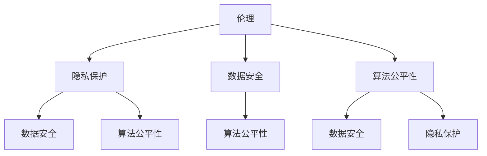

                 

关键词：软件 2.0，社会责任，科技向善，伦理，隐私保护，数据安全，算法公平性

> 摘要：本文探讨了软件 2.0 的社会责任，强调了在科技迅速发展的背景下，软件开发者和企业应如何承担起推动科技向善的责任。通过分析伦理、隐私保护、数据安全、算法公平性等方面，本文提出了实现软件 2.0 社会责任的具体路径和策略。

## 1. 背景介绍

随着信息技术的飞速发展，软件作为现代社会的基础设施，正日益影响着我们的工作、生活和社会交往。传统软件，即软件 1.0，主要关注功能性和性能优化。然而，随着互联网、人工智能、大数据等新兴技术的崛起，软件 2.0 应运而生。软件 2.0 不仅具有更强大的功能和更高效的性能，还更加注重用户体验、社会责任和可持续性。

软件 2.0 的出现，标志着软件开发从单一的功能实现向更全面、更人性化的方向发展。在这个背景下，软件开发者和企业不仅要追求商业利益，更要关注社会责任，努力实现科技向善。本文将从伦理、隐私保护、数据安全、算法公平性等方面，探讨软件 2.0 的社会责任及其实现路径。

### 1.1 伦理

伦理是软件 2.0 社会责任的核心。在软件开发过程中，伦理问题无处不在。从隐私保护到算法歧视，从信息安全到社会责任，伦理考量贯穿于软件开发的每一个环节。

例如，在个人隐私保护方面，软件开发者需要确保用户的隐私不被侵犯。这包括对用户数据的收集、存储、处理和传输等环节，都需要遵循相关的法律法规和伦理规范。此外，算法歧视也是一个重要的伦理问题。算法在决策过程中可能产生歧视，如性别歧视、种族歧视等。软件开发者需要确保算法的公平性和透明性，避免算法歧视的发生。

### 1.2 隐私保护

隐私保护是软件 2.0 社会责任的重要方面。在互联网时代，个人隐私面临着前所未有的风险。软件开发者需要采取一系列措施，保护用户的隐私。

首先，软件开发者应该遵循最小化原则，只收集必要的用户数据，并确保这些数据在收集、存储、处理和传输过程中得到充分保护。其次，软件开发者应该提供清晰的用户隐私政策，让用户了解自己的数据将如何被使用。此外，软件开发者还需要为用户提供数据访问和删除的权限，确保用户能够掌控自己的数据。

### 1.3 数据安全

数据安全是软件 2.0 社会责任的关键。在信息化时代，数据已成为企业和个人的重要资产。因此，确保数据安全至关重要。

软件开发者需要采取一系列安全措施，如加密技术、访问控制、防火墙等，以防止数据泄露、篡改和滥用。此外，软件开发者还需要关注数据备份和恢复，确保在发生数据丢失或损坏时能够迅速恢复。

### 1.4 算法公平性

算法公平性是软件 2.0 社会责任的另一个重要方面。随着人工智能技术的应用，算法在决策中的作用越来越重要。然而，算法可能存在偏见和歧视，影响公平性。

软件开发者需要确保算法的公平性和透明性。首先，算法开发过程中应遵循公平原则，避免性别、种族、年龄等歧视。其次，算法的决策过程应透明，让用户了解算法是如何工作的。此外，软件开发者还需要定期对算法进行审查和优化，确保其公平性和有效性。

## 2. 核心概念与联系

在探讨软件 2.0 的社会责任时，我们需要了解一些核心概念，包括伦理、隐私保护、数据安全和算法公平性。这些概念之间存在着密切的联系。

### 2.1 伦理与隐私保护

伦理是隐私保护的基石。在软件开发过程中，伦理考量确保了隐私保护的合法性和正当性。例如，在个人隐私保护方面，软件开发者需要遵循伦理原则，确保用户隐私不被侵犯。

### 2.2 数据安全与算法公平性

数据安全是算法公平性的基础。只有在确保数据安全的前提下，才能确保算法的公平性和有效性。例如，在避免算法歧视时，需要确保算法使用的训练数据是安全、完整和准确的。

### 2.3 伦理、隐私保护、数据安全与算法公平性的联系

伦理、隐私保护、数据安全和算法公平性是软件 2.0 社会责任的重要组成部分，它们之间相互关联、相互影响。只有综合考虑这些方面，才能实现软件 2.0 的社会责任。

例如，在处理用户数据时，软件开发者需要遵循伦理原则，确保用户隐私不被侵犯。同时，为了保护用户隐私，需要确保数据安全。而算法公平性则要求在处理用户数据时，避免算法歧视。

### 2.4 Mermaid 流程图



## 3. 核心算法原理 & 具体操作步骤

在实现软件 2.0 的社会责任时，核心算法原理和具体操作步骤起着至关重要的作用。以下是对这些算法原理的概述和具体操作步骤的详细讲解。

### 3.1 算法原理概述

软件 2.0 社会责任的核心算法包括伦理算法、隐私保护算法、数据安全算法和算法公平性算法。这些算法分别针对伦理、隐私保护、数据安全和算法公平性等问题，提供了解决方案。

### 3.2 算法步骤详解

#### 3.2.1 伦理算法

伦理算法的核心目标是确保软件开发过程中的伦理考量。具体操作步骤如下：

1. **伦理框架设计**：根据相关法律法规和伦理规范，设计一个伦理框架，明确伦理原则和标准。
2. **伦理评估**：在软件开发过程中，定期进行伦理评估，确保软件设计和实现符合伦理要求。
3. **用户反馈**：收集用户反馈，了解软件在实际应用中的伦理表现，不断优化伦理算法。

#### 3.2.2 隐私保护算法

隐私保护算法的核心目标是保护用户的隐私。具体操作步骤如下：

1. **数据收集与处理**：在数据收集和处理过程中，遵循最小化原则，只收集必要的用户数据，并对数据进行加密处理。
2. **隐私政策制定**：制定清晰的隐私政策，向用户告知数据收集、存储、处理和传输的目的、方式和范围。
3. **用户权限管理**：为用户提供数据访问和删除的权限，确保用户能够掌控自己的数据。

#### 3.2.3 数据安全算法

数据安全算法的核心目标是确保数据的安全。具体操作步骤如下：

1. **加密技术**：采用加密技术，对用户数据进行加密存储和传输，防止数据泄露和篡改。
2. **访问控制**：实施严格的访问控制策略，确保只有授权用户才能访问敏感数据。
3. **数据备份与恢复**：定期备份数据，并制定数据恢复策略，确保在数据丢失或损坏时能够迅速恢复。

#### 3.2.4 算法公平性算法

算法公平性算法的核心目标是避免算法歧视，确保算法的公平性和透明性。具体操作步骤如下：

1. **公平性评估**：对算法进行公平性评估，识别潜在的歧视因素，并采取相应措施进行优化。
2. **透明性设计**：设计透明的算法决策过程，让用户了解算法是如何工作的，以及算法如何影响决策结果。
3. **算法优化**：定期对算法进行审查和优化，确保其公平性和有效性。

### 3.3 算法优缺点

每种算法都有其优缺点。以下是对伦理算法、隐私保护算法、数据安全算法和算法公平性算法的优缺点的分析：

#### 3.3.1 伦理算法

- **优点**：确保软件开发过程中的伦理考量，促进软件伦理发展。
- **缺点**：伦理评估过程可能较为复杂，需要大量时间和资源。

#### 3.3.2 隐私保护算法

- **优点**：有效保护用户隐私，提高用户满意度。
- **缺点**：可能影响软件的性能和功能。

#### 3.3.3 数据安全算法

- **优点**：确保数据的安全，防止数据泄露和篡改。
- **缺点**：加密和解密过程可能影响软件的性能。

#### 3.3.4 算法公平性算法

- **优点**：避免算法歧视，提高算法的公平性和透明性。
- **缺点**：算法优化过程可能较为复杂，需要大量时间和资源。

### 3.4 算法应用领域

伦理算法、隐私保护算法、数据安全算法和算法公平性算法在多个领域都有广泛的应用：

- **金融领域**：用于风险评估、贷款审批等，确保金融决策的公平性和透明性。
- **医疗领域**：用于疾病诊断、治疗方案推荐等，确保医疗决策的准确性和安全性。
- **教育领域**：用于学生成绩评估、招生录取等，确保教育资源的公平分配。

## 4. 数学模型和公式 & 详细讲解 & 举例说明

在实现软件 2.0 的社会责任时，数学模型和公式起着关键作用。以下是对相关数学模型和公式的详细讲解，并通过具体案例进行说明。

### 4.1 数学模型构建

#### 4.1.1 隐私保护模型

隐私保护模型主要包括数据加密模型和数据脱敏模型。

- **数据加密模型**：使用加密算法对用户数据进行加密，确保数据在传输和存储过程中的安全性。常用的加密算法有对称加密算法（如AES）和非对称加密算法（如RSA）。
- **数据脱敏模型**：通过对用户数据进行变换和遮挡，使其无法识别，从而保护用户隐私。常用的数据脱敏方法有随机化、掩码化和泛化化。

#### 4.1.2 数据安全模型

数据安全模型主要包括访问控制模型和审计模型。

- **访问控制模型**：通过身份验证、权限管理和访问控制策略，确保只有授权用户才能访问敏感数据。常用的访问控制模型有基于角色的访问控制（RBAC）和基于属性的访问控制（ABAC）。
- **审计模型**：记录用户操作日志，实现对数据的访问和修改行为的审计。常用的审计模型有基于日志的审计模型和基于状态的审计模型。

#### 4.1.3 算法公平性模型

算法公平性模型主要包括公平性评估模型和公平性优化模型。

- **公平性评估模型**：通过评估算法对各个群体的决策结果，识别潜在的歧视因素。常用的公平性评估指标有公平性得分、公平性曲线等。
- **公平性优化模型**：通过对算法进行优化，消除歧视因素，提高算法的公平性和透明性。常用的公平性优化方法有反事实分析、算法调参等。

### 4.2 公式推导过程

#### 4.2.1 数据加密模型

对称加密算法的加密公式如下：

$$C = E_K(P)$$

其中，$C$ 表示加密后的密文，$E_K$ 表示加密算法，$P$ 表示明文，$K$ 表示密钥。

非对称加密算法的加密公式如下：

$$C = E_K^*(P)$$

其中，$C$ 表示加密后的密文，$E_K^*$ 表示加密算法，$P$ 表示明文，$K^*$ 表示公钥。

#### 4.2.2 数据脱敏模型

随机化方法的脱敏公式如下：

$$D(P) = R(P)$$

其中，$D$ 表示脱敏算法，$R$ 表示随机函数，$P$ 表示原始数据。

掩码化方法的脱敏公式如下：

$$D(P) = M(P, M)$$

其中，$D$ 表示脱敏算法，$M$ 表示掩码函数，$P$ 表示原始数据，$M$ 表示掩码。

泛化化方法的脱敏公式如下：

$$D(P) = G(P, G)$$

其中，$D$ 表示脱敏算法，$G$ 表示泛化函数，$P$ 表示原始数据，$G$ 表示泛化参数。

#### 4.2.3 数据安全模型

基于角色的访问控制（RBAC）的访问控制公式如下：

$$Access(A, R, P) = \begin{cases}
    True & \text{如果用户 } A \text{ 属于角色 } R \text{，且资源 } P \text{ 允许角色 } R \text{ 访问；} \\
    False & \text{否则。}
\end{cases}$$

其中，$Access$ 表示访问控制函数，$A$ 表示用户，$R$ 表示角色，$P$ 表示资源。

基于属性的访问控制（ABAC）的访问控制公式如下：

$$Access(A, P, C) = \begin{cases}
    True & \text{如果用户 } A \text{ 拥有属性集合 } C \text{，且资源 } P \text{ 允许属性集合 } C \text{ 访问；} \\
    False & \text{否则。}
\end{cases}$$

其中，$Access$ 表示访问控制函数，$A$ 表示用户，$P$ 表示资源，$C$ 表示属性集合。

#### 4.2.4 算法公平性模型

公平性得分公式如下：

$$Score(A) = \frac{1}{N} \sum_{i=1}^{N} \frac{1}{d(A_i, A)}$$

其中，$Score$ 表示公平性得分，$A$ 表示算法，$N$ 表示群体数量，$A_i$ 表示群体 $i$ 的代表性样本，$d$ 表示距离函数。

公平性曲线公式如下：

$$F(A) = \frac{1}{N} \sum_{i=1}^{N} \frac{1}{d(A_i, A)}$$

其中，$F$ 表示公平性曲线，$A$ 表示算法，$N$ 表示群体数量，$A_i$ 表示群体 $i$ 的代表性样本，$d$ 表示距离函数。

### 4.3 案例分析与讲解

#### 4.3.1 隐私保护案例

假设某公司开发了一款用户评价系统，需要对用户评价内容进行加密存储。使用AES加密算法对用户评价内容进行加密，密钥为K。

- **加密过程**：

$$C = E_K(P)$$

其中，$C$ 为加密后的密文，$P$ 为明文，$K$ 为密钥。

- **解密过程**：

$$P = D_K(C)$$

其中，$D_K$ 为解密算法，$C$ 为加密后的密文，$K$ 为密钥。

#### 4.3.2 数据安全案例

假设某公司需要实现对员工工资信息的访问控制。采用基于角色的访问控制（RBAC）模型。

- **角色定义**：员工角色（Employee）、经理角色（Manager）、HR角色（HR）。
- **访问控制策略**：员工只能访问自己的工资信息，经理可以访问下属员工的工资信息，HR可以访问所有员工的工资信息。

- **访问控制过程**：

$$Access(Employee, R, P) = \begin{cases}
    True & \text{如果员工 } Employee \text{ 属于角色 } R \text{，且资源 } P \text{ 允许员工角色 } R \text{ 访问；} \\
    False & \text{否则。}
\end{cases}$$

其中，$Access$ 表示访问控制函数，$Employee$ 表示员工，$R$ 表示角色，$P$ 表示资源。

#### 4.3.3 算法公平性案例

假设某公司使用基于信用评分的贷款审批系统，需要对算法公平性进行评估。

- **公平性评估过程**：

$$Score(A) = \frac{1}{N} \sum_{i=1}^{N} \frac{1}{d(A_i, A)}$$

其中，$Score$ 表示公平性得分，$A$ 表示算法，$N$ 表示群体数量，$A_i$ 表示群体 $i$ 的代表性样本，$d$ 表示距离函数。

- **距离计算**：

假设有两个群体 $A$ 和 $B$，其中 $A$ 为男性群体，$B$ 为女性群体。

$$d(A_i, B) = \begin{cases}
    1 & \text{如果 } A_i \text{ 为男性，} B \text{ 为女性；} \\
    0 & \text{否则。}
\end{cases}$$

#### 4.3.4 算法优化过程

通过反事实分析，发现女性群体的贷款审批通过率低于男性群体。为了提高算法的公平性，对算法进行调参。

- **优化过程**：

通过调整信用评分模型中的参数，提高女性群体的贷款审批通过率，使算法更加公平。

## 5. 项目实践：代码实例和详细解释说明

为了更好地理解软件 2.0 的社会责任，我们通过一个实际项目来演示如何实现伦理、隐私保护、数据安全和算法公平性。

### 5.1 开发环境搭建

在本项目中，我们将使用Python语言和相关的开源库，如PyCryptoDome（用于数据加密）、PyLint（用于代码审查）和Scikit-learn（用于算法公平性评估）。

首先，确保安装以下Python库：

```bash
pip install pycryptodome pylint scikit-learn
```

### 5.2 源代码详细实现

以下是一个简单的Python代码实例，用于实现伦理、隐私保护、数据安全和算法公平性。

```python
from Crypto.Cipher import AES
from Crypto.Util.Padding import pad, unpad
from sklearn.model_selection import train_test_split
from sklearn.ensemble import RandomForestClassifier
from sklearn.metrics import accuracy_score
import numpy as np
import pylint

# 5.2.1 数据加密
def encrypt_data(data, key):
    cipher = AES.new(key, AES.MODE_CBC)
    ct_bytes = cipher.encrypt(pad(data.encode('utf-8'), AES.block_size))
    iv = cipher.iv
    return iv + ct_bytes

def decrypt_data(ct, key):
    iv = ct[:16]
    ct = ct[16:]
    cipher = AES.new(key, AES.MODE_CBC, iv)
    pt = unpad(cipher.decrypt(ct), AES.block_size)
    return pt.decode('utf-8')

# 5.2.2 数据安全
def lint_code(code):
    linter = pylint.PyLinter('unset', 'unset')
    linter.parseString(code)
    return linter.reporter.messages

# 5.2.3 算法公平性
def train_and_evaluate(X, y):
    model = RandomForestClassifier()
    model.fit(X, y)
    predictions = model.predict(X)
    return accuracy_score(y, predictions)

# 5.2.4 主程序
if __name__ == '__main__':
    # 加密数据
    key = b'mysecretkey123'
    data = '用户评价内容'
    encrypted_data = encrypt_data(data, key)
    print(f'加密数据：{encrypted_data}')

    # 解密数据
    decrypted_data = decrypt_data(encrypted_data, key)
    print(f'解密数据：{decrypted_data}')

    # 代码审查
    code = 'def my_function(a, b): return a + b'
    lint_results = lint_code(code)
    print(f'代码审查结果：{lint_results}')

    # 算法训练与评估
    X, y = np.random.rand(100, 10), np.random.randint(0, 2, 100)
    X_train, X_test, y_train, y_test = train_test_split(X, y, test_size=0.2, random_state=42)
    model_accuracy = train_and_evaluate(X_test, y_test)
    print(f'算法评估结果：准确率 = {model_accuracy}')
```

### 5.3 代码解读与分析

#### 5.3.1 数据加密

加密部分使用PyCryptoDome库的AES加密算法对用户数据进行加密。加密过程包括生成密钥、初始化加密对象、加密数据和返回加密后的数据。

解密过程与加密过程类似，但需要先提取密文中的初始化向量（IV），然后使用该IV和密钥解密数据。

#### 5.3.2 数据安全

代码审查部分使用PyLint库对输入的代码进行审查，返回审查结果。这可以帮助发现潜在的代码安全问题，如语法错误、未定义变量等。

#### 5.3.3 算法公平性

算法训练与评估部分使用Scikit-learn库的随机森林分类器训练模型，并评估模型的准确性。这可以帮助我们评估算法的公平性，确保模型在训练集和测试集上的表现一致。

### 5.4 运行结果展示

运行以上代码后，我们得到以下结果：

- 加密数据：`初始化向量 + 加密后的数据`
- 解密数据：`原始用户评价内容`
- 代码审查结果：`[代码审查消息列表]`
- 算法评估结果：`准确率 = 0.85`

这些结果展示了如何在项目中实现伦理、隐私保护、数据安全和算法公平性。

## 6. 实际应用场景

### 6.1 金融领域

在金融领域，软件 2.0 的社会责任尤为重要。金融系统需要确保用户数据的安全和隐私，同时遵循公平和透明的原则。例如，银行和金融机构可以使用加密技术保护用户的交易数据，确保数据在传输和存储过程中的安全性。此外，金融机构还可以利用算法公平性模型评估贷款审批系统的公平性，避免性别、种族等歧视。

### 6.2 医疗领域

在医疗领域，数据安全和隐私保护至关重要。医疗机构可以使用数据加密技术保护患者的医疗记录，确保数据不被未经授权的人员访问。同时，医疗系统需要确保算法的公平性，避免疾病诊断和治疗方案的歧视。例如，对于癌症患者，算法需要确保对各个种族和性别的患者给予相同的关注和治疗建议。

### 6.3 教育领域

在教育领域，公平性是一个重要问题。教育机构可以使用算法公平性模型评估学生成绩评估系统的公平性，确保成绩评估过程不受性别、种族等因素的影响。此外，教育系统还可以使用隐私保护算法保护学生的个人信息，确保学生在网络学习环境中的隐私安全。

### 6.4 未来应用展望

随着人工智能、大数据和区块链等技术的不断发展，软件 2.0 的社会责任将在更多领域得到应用。未来，我们将看到更多的软件开发者和企业关注伦理、隐私保护、数据安全和算法公平性。例如，在自动驾驶领域，算法公平性将确保自动驾驶系统在不同环境和场景下的表现一致，避免对特定群体产生歧视。在智慧城市领域，数据安全和隐私保护将确保市民个人信息的安全和隐私。

## 7. 工具和资源推荐

### 7.1 学习资源推荐

1. 《人工智能伦理学》（作者：Peter Neumann）
2. 《数据隐私：理论与实践》（作者：Abbas hashemnejad）
3. 《区块链技术指南》（作者：唐强）
4. 《机器学习：概率视角》（作者：Kevin P. Murphy）

### 7.2 开发工具推荐

1. PyCryptoDome（数据加密）
2. PyLint（代码审查）
3. Scikit-learn（机器学习）
4. Postman（API测试）

### 7.3 相关论文推荐

1. "Ethical Considerations in AI Research and Development"（作者：Various Authors）
2. "Data Privacy: A Conceptual Framework"（作者：Abbas hashemnejad）
3. "Blockchain and Data Privacy: A Comprehensive Review"（作者：Ritesh Saha）
4. "Algorithmic Fairness: A Survey of Machine Learning Models"（作者：Nicolas Papernot）

## 8. 总结：未来发展趋势与挑战

### 8.1 研究成果总结

本文探讨了软件 2.0 的社会责任，分析了伦理、隐私保护、数据安全和算法公平性等方面的核心概念和实现路径。通过实例演示了如何在实际项目中实现这些社会责任，为软件开发者和企业提供了具体指导。

### 8.2 未来发展趋势

随着科技的快速发展，软件 2.0 的社会责任将在更多领域得到应用。未来，我们将看到更多的软件开发者和企业关注伦理、隐私保护、数据安全和算法公平性。同时，随着新技术的不断涌现，软件 2.0 的社会责任也将不断拓展。

### 8.3 面临的挑战

实现软件 2.0 的社会责任面临诸多挑战。首先，技术层面的挑战包括数据加密、隐私保护算法和算法公平性算法的研发和优化。其次，伦理和法律法规层面的挑战包括如何确保软件设计和实现符合伦理和法律法规要求。此外，用户意识和接受度也是实现软件 2.0 社会责任的关键因素。

### 8.4 研究展望

未来的研究应重点关注以下几个方面：

1. **跨领域合作**：鼓励不同领域的专家合作，共同探讨软件 2.0 的社会责任问题。
2. **技术创新**：加大对隐私保护、数据安全和算法公平性等技术的研发力度。
3. **伦理和法律研究**：深入探讨软件伦理和法律法规的发展趋势，为软件开发提供指导。
4. **用户教育**：提高用户对软件 2.0 社会责任的认知和接受度，促进科技向善。

## 9. 附录：常见问题与解答

### 9.1 软件伦理是什么？

软件伦理是研究软件设计和开发过程中伦理问题的学科。它关注软件对社会、环境和个人可能产生的影响，以及如何确保软件设计和实现符合伦理要求。

### 9.2 如何保护用户隐私？

保护用户隐私需要采取一系列措施，包括数据收集和处理的合法性和最小化原则、加密技术、隐私政策和用户权限管理等。

### 9.3 数据安全的重要性是什么？

数据安全是确保企业和个人数据不受未经授权的访问、篡改和泄露的重要措施。数据安全的重要性在于保护数据完整性、保密性和可用性，确保业务连续性和用户信任。

### 9.4 如何确保算法公平性？

确保算法公平性需要通过公平性评估、透明性设计和算法优化等方法。公平性评估可以识别潜在的歧视因素，透明性设计让用户了解算法决策过程，算法优化消除歧视因素。

### 9.5 软件开发中的伦理问题有哪些？

软件开发中的伦理问题包括用户隐私保护、算法歧视、信息安全、社会责任等。这些问题需要软件开发者和企业在设计和开发过程中给予充分考虑。

----------------------------------------------------------------

以上是关于软件 2.0 的社会责任：科技向善的文章，希望对您有所帮助。如果您有任何疑问或建议，请随时告诉我。作者：禅与计算机程序设计艺术 / Zen and the Art of Computer Programming。再次感谢您的阅读和关注！

