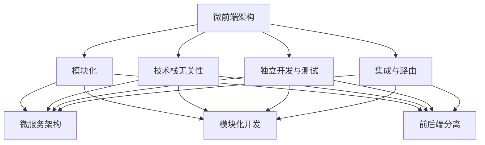

                 

## 1. 背景介绍

### 1.1 软件演化历程

软件的历史可以追溯到计算机诞生的时代，从最初的系统软件、应用软件，到后来的互联网应用、移动应用，软件的形态和架构一直在不断演变。20世纪90年代，随着互联网的兴起，前端技术开始逐渐发展，前端架构也从最初的单页面应用（SPA）模式，发展到如今的微前端架构。

微前端架构的概念起源于微服务架构。微服务架构将应用程序分解为多个独立的服务，每个服务都有自己的业务逻辑和数据库，这样可以提高系统的可维护性和可扩展性。微前端架构则是将前端应用也分解为多个小型、独立的前端模块，从而实现更高效的前端开发、部署和维护。

### 1.2 微前端架构的优势

微前端架构具有以下优势：

1. **可扩展性**：通过将前端应用分解为多个模块，可以更容易地扩展和升级系统功能。
2. **独立性**：每个模块都可以独立开发、测试和部署，从而降低不同模块之间的耦合度。
3. **协作性**：不同团队可以独立开发各自的模块，提高开发效率。
4. **灵活性**：可以自由选择技术栈，不同的模块可以使用不同的框架或库，满足不同业务需求。

### 1.3 微前端架构的应用场景

微前端架构适用于以下场景：

1. **大型项目**：项目规模庞大，涉及多个业务模块，需要高效的开发、测试和部署流程。
2. **跨团队协作**：不同团队负责不同的业务模块，需要独立开发、测试和部署。
3. **技术栈多样化**：不同的模块可以使用不同的技术栈，满足不同业务需求。
4. **快速迭代**：需要快速迭代和发布新功能，减少开发和部署的时间。

## 2. 核心概念与联系

### 2.1 微前端架构的核心概念

微前端架构的核心概念包括：

1. **模块化**：将前端应用分解为多个独立的模块，每个模块负责特定的业务功能。
2. **技术栈无关性**：不同的模块可以使用不同的技术栈，以满足不同的业务需求。
3. **独立开发与测试**：每个模块可以独立开发、测试和部署，降低不同模块之间的耦合度。
4. **集成与路由**：通过路由管理器将各个模块集成到一个统一的应用中，实现单页应用（SPA）体验。

### 2.2 微前端架构的联系

微前端架构与微服务架构、模块化开发、前后端分离等技术概念有密切的联系：

1. **微服务架构**：微前端架构的概念起源于微服务架构，二者都强调将系统分解为独立的模块或服务，以提高系统的可扩展性和可维护性。
2. **模块化开发**：微前端架构采用模块化开发方法，将前端应用分解为多个独立的模块，每个模块负责特定的业务功能。
3. **前后端分离**：微前端架构强调前后端分离，前端模块独立开发、测试和部署，降低前后端的耦合度。

### 2.3 Mermaid 流程图

以下是一个简单的 Mermaid 流程图，展示微前端架构的核心概念和联系：



## 3. 核心算法原理 & 具体操作步骤

### 3.1 算法原理概述

微前端架构的核心算法原理是模块划分和路由管理。模块划分是指将前端应用分解为多个独立的模块，每个模块负责特定的业务功能；路由管理是指通过路由管理器将各个模块集成到一个统一的应用中，实现单页应用（SPA）体验。

### 3.2 算法步骤详解

1. **模块划分**：首先，根据业务需求，将前端应用分解为多个独立的模块，每个模块负责特定的业务功能。模块划分的原则包括：

   - **功能独立性**：每个模块应具有独立的功能，降低模块之间的耦合度。
   - **职责单一**：每个模块应只负责一种业务功能，避免功能重叠。
   - **可复用性**：模块应具有较高的可复用性，方便在其他项目中使用。

2. **技术栈选择**：根据每个模块的特定业务需求，选择合适的技术栈。技术栈选择的原则包括：

   - **兼容性**：选择与现有系统兼容的技术栈，降低迁移成本。
   - **性能**：选择性能优异的技术栈，提高系统的响应速度。
   - **社区支持**：选择社区支持较好的技术栈，方便解决问题和获取资源。

3. **独立开发与测试**：每个模块可以独立开发、测试和部署，降低不同模块之间的耦合度。独立开发与测试的原则包括：

   - **自动化测试**：编写自动化测试用例，确保模块功能的正确性。
   - **持续集成**：将模块集成到一个统一的应用中，进行集成测试和部署。

4. **集成与路由**：通过路由管理器将各个模块集成到一个统一的应用中，实现单页应用（SPA）体验。集成与路由的原则包括：

   - **动态路由**：根据用户请求，动态加载对应的模块，实现单页应用（SPA）体验。
   - **路由映射**：将各个模块的路由映射到一个统一的路由表中，方便管理。
   - **路由守卫**：设置路由守卫，对用户请求进行权限验证和路由跳转。

### 3.3 算法优缺点

**优点**：

1. **可扩展性**：通过模块划分，可以方便地扩展和升级系统功能。
2. **独立性**：每个模块可以独立开发、测试和部署，降低不同模块之间的耦合度。
3. **协作性**：不同团队可以独立开发各自的模块，提高开发效率。
4. **灵活性**：可以自由选择技术栈，满足不同业务需求。

**缺点**：

1. **维护成本**：模块划分后，需要维护多个模块的代码库，增加维护成本。
2. **集成难度**：需要处理多个模块之间的集成问题，如模块之间的依赖关系、路由冲突等。

### 3.4 算法应用领域

微前端架构适用于以下领域：

1. **大型项目**：项目规模庞大，涉及多个业务模块，需要高效的开发、测试和部署流程。
2. **跨团队协作**：不同团队负责不同的业务模块，需要独立开发、测试和部署。
3. **技术栈多样化**：不同的模块可以使用不同的技术栈，满足不同业务需求。
4. **快速迭代**：需要快速迭代和发布新功能，减少开发和部署的时间。

## 4. 数学模型和公式 & 详细讲解 & 举例说明

### 4.1 数学模型构建

微前端架构的数学模型可以从以下几个方面进行构建：

1. **模块数量**：设模块数量为 $n$。
2. **模块功能复杂度**：设模块功能复杂度为 $f_i$，其中 $i=1,2,...,n$。
3. **模块耦合度**：设模块耦合度为 $c_i$，其中 $i=1,2,...,n$。
4. **系统整体复杂度**：设系统整体复杂度为 $F$。

### 4.2 公式推导过程

根据微前端架构的数学模型，可以推导出以下公式：

1. **模块数量与系统整体复杂度**：

   $$ F = \sum_{i=1}^{n} f_i + \sum_{i=1}^{n} c_i $$

   其中，第一项表示模块功能复杂度的总和，第二项表示模块耦合度的总和。

2. **模块耦合度与系统整体复杂度**：

   $$ F = \sum_{i=1}^{n} f_i + \sum_{i=1}^{n} \sum_{j=1}^{n} c_{ij} $$

   其中，$c_{ij}$ 表示模块 $i$ 与模块 $j$ 之间的耦合度。

### 4.3 案例分析与讲解

以下是一个简单的案例，说明如何使用微前端架构构建一个电子商务网站。

#### 案例背景

一个电子商务网站需要实现以下功能模块：

1. **商品展示**：展示各种商品的详细信息。
2. **购物车**：用户可以将商品加入购物车，进行购买。
3. **订单管理**：用户可以查看订单详情、取消订单等。
4. **用户中心**：用户可以查看个人信息、收货地址等。

#### 模块划分

根据功能需求，将电子商务网站划分为以下模块：

1. **商品展示模块**：负责展示商品的详细信息，如商品名称、价格、图片等。
2. **购物车模块**：负责用户将商品加入购物车，以及删除商品等功能。
3. **订单管理模块**：负责用户查看订单详情、取消订单等操作。
4. **用户中心模块**：负责用户查看个人信息、收货地址等操作。

#### 技术栈选择

根据各个模块的功能需求，选择以下技术栈：

1. **商品展示模块**：使用 React 框架，配合 Ant Design 组件库，实现良好的用户界面和交互效果。
2. **购物车模块**：使用 Vue.js 框架，实现简洁、高效的购物车功能。
3. **订单管理模块**：使用 Angular 框架，实现强大的订单管理功能。
4. **用户中心模块**：使用 Next.js 框架，实现高性能的用户中心功能。

#### 模块集成与路由

通过 Next.js 框架的 Next.js Router，实现模块的集成与路由。具体的路由配置如下：

```javascript
import { Router } from 'next/router'

const routes = [
  {
    path: '/',
    component: ProductList,
  },
  {
    path: '/cart',
    component: ShoppingCart,
  },
  {
    path: '/orders',
    component: OrderManagement,
  },
  {
    path: '/user',
    component: UserCenter,
  },
]

export default routes
```

## 5. 项目实践：代码实例和详细解释说明

### 5.1 开发环境搭建

为了搭建微前端架构的开发环境，我们需要以下工具和库：

1. **Node.js**：版本 14.x 或更高。
2. **npm**：版本 7.x 或更高。
3. **Next.js**：版本 12.x 或更高。
4. **React**：版本 18.x 或更高。
5. **Vue.js**：版本 3.x 或更高。
6. **Angular**：版本 13.x 或更高。

首先，安装 Node.js 和 npm：

```bash
curl -fsSL https://deb.nodesource.com/setup_14.x | sudo -E bash -
sudo apt-get install -y nodejs
```

接着，创建一个 Next.js 项目：

```bash
npx create-next-app my-microfrontends
cd my-microfrontends
```

然后，分别安装 React、Vue.js 和 Angular：

```bash
npm install react@18.2.0 vue@3.2.45 angular@13.2.7
```

### 5.2 源代码详细实现

在 `pages` 目录下，创建以下四个模块：

1. **ProductList**：商品展示模块。
2. **ShoppingCart**：购物车模块。
3. **OrderManagement**：订单管理模块。
4. **UserCenter**：用户中心模块。

**ProductList.js**：

```javascript
import { useEffect, useState } from 'react'
import axios from 'axios'

const ProductList = () => {
  const [products, setProducts] = useState([])

  useEffect(() => {
    const fetchProducts = async () => {
      const response = await axios.get('/api/products')
      setProducts(response.data)
    }
    fetchProducts()
  }, [])

  return (
    <div>
      <h1>商品展示</h1>
      <ul>
        {products.map((product) => (
          <li key={product.id}>
            <h2>{product.name}</h2>
            <p>{product.description}</p>
            <p>价格：{product.price} 元</p>
          </li>
        ))}
      </ul>
    </div>
  )
}

export default ProductList
```

**ShoppingCart.js**：

```javascript
import { useEffect, useState } from 'react'
import axios from 'axios'

const ShoppingCart = () => {
  const [cart, setCart] = useState([])

  useEffect(() => {
    const fetchCart = async () => {
      const response = await axios.get('/api/cart')
      setCart(response.data)
    }
    fetchCart()
  }, [])

  return (
    <div>
      <h1>购物车</h1>
      <ul>
        {cart.map((item) => (
          <li key={item.id}>
            <h2>{item.name}</h2>
            <p>数量：{item.quantity}</p>
            <p>总价：{item.price * item.quantity} 元</p>
          </li>
        ))}
      </ul>
    </div>
  )
}

export default ShoppingCart
```

**OrderManagement.js**：

```javascript
import { useEffect, useState } from 'react'
import axios from 'axios'

const OrderManagement = () => {
  const [orders, setOrders] = useState([])

  useEffect(() => {
    const fetchOrders = async () => {
      const response = await axios.get('/api/orders')
      setOrders(response.data)
    }
    fetchOrders()
  }, [])

  return (
    <div>
      <h1>订单管理</h1>
      <ul>
        {orders.map((order) => (
          <li key={order.id}>
            <h2>{order.id}</h2>
            <p>总价：{order.total} 元</p>
            <p>状态：{order.status}</p>
          </li>
        ))}
      </ul>
    </div>
  )
}

export default OrderManagement
```

**UserCenter.js**：

```javascript
import { useEffect, useState } from 'react'
import axios from 'axios'

const UserCenter = () => {
  const [user, setUser] = useState(null)

  useEffect(() => {
    const fetchUser = async () => {
      const response = await axios.get('/api/user')
      setUser(response.data)
    }
    fetchUser()
  }, [])

  return (
    <div>
      <h1>用户中心</h1>
      {user && (
        <div>
          <p>用户名：{user.username}</p>
          <p>邮箱：{user.email}</p>
          <p>收货地址：{user.address}</p>
        </div>
      )}
    </div>
  )
}

export default UserCenter
```

### 5.3 代码解读与分析

以上四个模块分别实现了商品展示、购物车、订单管理和用户中心功能。以下是每个模块的代码解读与分析：

**ProductList.js**：

该模块使用 React 框架，通过 axios 库从服务器获取商品数据，并使用 useState 钩子管理商品状态。组件首次渲染时，触发 useEffect 钩子，异步获取商品数据，并将商品数据存储在状态中。在 UI 中，使用 map 方法遍历商品数据，并使用关键

