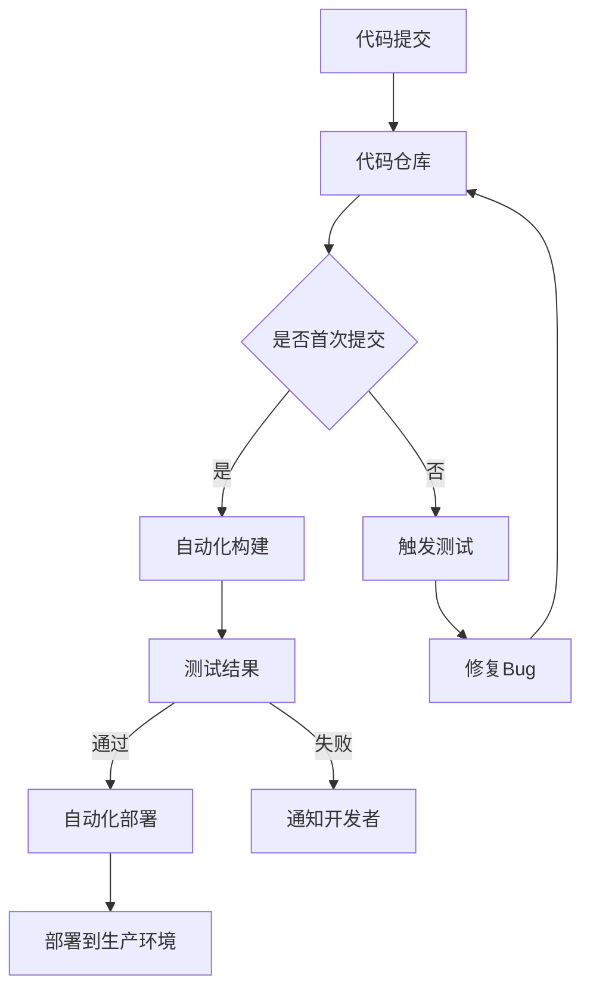

                 

关键词：软件2.0、持续集成、持续部署、CI/CD、自动化、DevOps、敏捷开发、微服务架构、容器化、云原生

> 摘要：本文旨在探讨软件2.0时代的持续集成（CI）与持续部署（CD）策略，通过深入分析其核心概念、算法原理、数学模型、实际应用和未来发展趋势，为开发者提供一套完整的技术指导框架。本文不仅介绍了CI/CD的基本原理和具体操作步骤，还探讨了其在微服务架构、容器化、云原生环境中的应用，并通过实际项目实例进行了详细解释和说明。

## 1. 背景介绍

随着互联网的迅速发展和云计算技术的普及，软件的开发和部署方式发生了翻天覆地的变化。传统的软件开发模式已经无法满足现代企业快速迭代、高效率和高可靠性的需求。软件2.0时代，敏捷开发、DevOps文化、微服务架构、容器化和云原生等新兴技术逐渐成为主流，持续集成（CI）与持续部署（CD）策略也成为了软件工程的重要组成部分。

### 1.1 持续集成（CI）

持续集成是一种软件开发实践，旨在通过自动化构建、测试和部署来加快开发周期，提高软件质量。其核心思想是将所有代码提交到共享代码库后，立即进行自动化构建和测试，确保每个提交的代码都是可运行的。持续集成的主要目标包括：

- 提高代码质量
- 减少集成风险
- 加快开发速度
- 提高团队协作效率

### 1.2 持续部署（CD）

持续部署是持续集成的延伸，它将自动化测试和部署过程进一步扩展到生产环境。持续部署的主要目标是确保软件在交付给用户之前经过充分的测试和验证，从而提高软件的可靠性和用户体验。持续部署的关键要素包括：

- 自动化部署流程
- 持续监控和反馈
- 快速回滚和故障恢复
- 高度灵活的部署策略

## 2. 核心概念与联系

### 2.1 持续集成与持续部署的关联

持续集成与持续部署紧密相连，两者共同构成了CI/CD流程。持续集成是持续部署的基础，通过自动化构建和测试，确保每次提交的代码都是可集成的。而持续部署则将这个可集成的代码部署到生产环境，确保软件始终处于健康状态。

### 2.2 CI/CD流程的Mermaid流程图

下面是一个简单的Mermaid流程图，展示了CI/CD的基本流程：



## 3. 核心算法原理 & 具体操作步骤

### 3.1 算法原理概述

持续集成与持续部署的核心算法包括自动化构建、自动化测试和自动化部署。这些算法的实现依赖于一系列工具和平台，如Jenkins、Travis CI、Circle CI等。

### 3.2 算法步骤详解

1. **自动化构建**：当开发者提交代码到代码仓库时，CI工具会触发自动化构建过程。构建过程包括编译代码、打包应用程序、运行预定义的测试等。
2. **自动化测试**：构建完成后，CI工具会运行一系列预定义的测试，包括单元测试、集成测试、性能测试等。测试结果将被记录并反馈给开发者。
3. **自动化部署**：如果测试结果通过，CI/CD流程将自动部署应用程序到生产环境。部署过程可能包括容器化、镜像推送、服务注册等步骤。

### 3.3 算法优缺点

#### 优点

- 提高开发效率：自动化构建、测试和部署大大减少了手动操作，提高了开发效率。
- 提高软件质量：通过持续集成和部署，可以及时发现和修复代码缺陷，提高软件质量。
- 提高团队协作：CI/CD流程鼓励团队成员实时协作，共享代码和测试结果，提高团队协作效率。

#### 缺点

- 初期投入较大：建立CI/CD流程需要投入大量时间和资源，包括工具选型、流程设计、测试用例编写等。
- 增加系统复杂性：CI/CD流程涉及多个环节和工具，系统复杂性增加，可能增加维护成本。
- 增加回滚难度：在生产环境中，CI/CD流程可能导致代码频繁更新，回滚时可能面临较大挑战。

### 3.4 算法应用领域

持续集成与持续部署广泛应用于Web应用、移动应用、大数据应用、人工智能应用等各个领域。随着技术的不断演进，CI/CD流程在微服务架构、容器化、云原生环境中的应用越来越广泛。

## 4. 数学模型和公式 & 详细讲解 & 举例说明

### 4.1 数学模型构建

持续集成与持续部署的核心数学模型包括构建成功率和部署成功率。构建成功率是指成功构建代码的比例，部署成功率是指成功部署到生产环境的比例。

### 4.2 公式推导过程

假设某项目共有100次代码提交，其中70次成功构建，30次失败。构建成功率为：

$$
成功率 = \frac{成功构建次数}{总提交次数} = \frac{70}{100} = 0.7
$$

假设在构建成功的情况下，又有80次成功部署，20次失败。部署成功率为：

$$
成功率 = \frac{成功部署次数}{成功构建次数} = \frac{80}{70} = 1.14
$$

### 4.3 案例分析与讲解

以某Web应用项目为例，该项目共有100次代码提交，其中70次成功构建，构建成功率为0.7。在构建成功的情况下，又有80次成功部署，部署成功率为1.14。我们可以通过调整测试用例、优化代码质量、改进部署策略等方式，进一步提高构建成功率和部署成功率。

## 5. 项目实践：代码实例和详细解释说明

### 5.1 开发环境搭建

以Jenkins为例，介绍如何在Linux环境中搭建持续集成与持续部署环境。

1. 安装Jenkins：使用以下命令安装Jenkins：
   ```bash
   sudo wget -q -O - https://pkg.jenkins.io/debian-stable/jenkins.io.key | sudo apt-key add -
   sudo sh -c 'echo deb https://pkg.jenkins.io/debian-stable binary/ > /etc/apt/sources.list.d/jenkins.list'
   sudo apt-get update
   sudo apt-get install jenkins
   ```
2. 启动Jenkins：使用以下命令启动Jenkins服务：
   ```bash
   sudo systemctl start jenkins
   ```
3. 访问Jenkins：在浏览器中输入Jenkins的地址，如`http://localhost:8080`，按照提示完成Jenkins的初始化配置。

### 5.2 源代码详细实现

以Git仓库中的项目为例，介绍如何在Jenkins中实现CI/CD。

1. 在Jenkins中创建一个新项目，选择“Pipeline”项目类型。
2. 配置Jenkinsfile，如下所示：
   ```groovy
   pipeline {
       agent any
       stages {
           stage('构建') {
               steps {
                   echo '开始构建'
                   sh 'mvn clean install'
               }
           }
           stage('测试') {
               steps {
                   echo '开始测试'
                   sh 'mvn test'
               }
           }
           stage('部署') {
               steps {
                   echo '开始部署'
                   sh 'mvn deploy'
               }
           }
       }
   }
   ```
3. 点击“保存”按钮，Jenkins会根据Jenkinsfile中的配置自动执行CI/CD流程。

### 5.3 代码解读与分析

Jenkinsfile中的配置分为三个阶段：构建、测试和部署。在构建阶段，Jenkins执行Maven的构建命令，编译并打包应用程序。在测试阶段，Jenkins执行Maven的测试命令，运行所有测试用例。如果测试通过，Jenkins会进入部署阶段，执行Maven的部署命令，将应用程序部署到生产环境。

### 5.4 运行结果展示

在Jenkins的控制台中，可以查看CI/CD流程的运行结果。如果构建、测试和部署都成功，Jenkins会显示“Build successful”的消息。如果某个阶段失败，Jenkins会显示详细的错误信息和日志，方便开发者定位和解决问题。

## 6. 实际应用场景

### 6.1 Web应用

持续集成与持续部署在Web应用开发中具有广泛的应用。通过CI/CD流程，开发者可以快速实现代码的自动化构建、测试和部署，提高开发效率，降低代码质量风险。此外，CI/CD还可以与云服务提供商的自动化部署功能集成，实现自动化扩缩容、蓝绿部署、灰度发布等高级部署策略。

### 6.2 移动应用

移动应用开发中，持续集成与持续部署同样重要。通过CI/CD流程，开发者可以自动化构建、测试和部署iOS和Android应用程序，确保应用的稳定性和可靠性。此外，CI/CD还可以与云存储服务集成，实现自动化打包、分发和更新。

### 6.3 大数据应用

大数据应用通常涉及多个组件和模块，持续集成与持续部署可以帮助开发者快速集成和部署各个组件，提高开发效率。通过CI/CD流程，开发者可以自动化构建、测试和部署Hadoop、Spark等大数据框架，确保大数据应用的高可用性和稳定性。

### 6.4 人工智能应用

人工智能应用开发中，持续集成与持续部署可以帮助开发者快速实现模型的训练、评估和部署。通过CI/CD流程，开发者可以自动化构建、测试和部署TensorFlow、PyTorch等深度学习框架，确保人工智能应用的高效性和准确性。

## 7. 工具和资源推荐

### 7.1 学习资源推荐

- 《持续集成之道》
- 《持续交付：发布可靠软件的系统化方法》
- 《Jenkins实战》
- 《Git实战》

### 7.2 开发工具推荐

- Jenkins
- Travis CI
- Circle CI
- GitLab CI

### 7.3 相关论文推荐

- "CI/CD in the Age of Microservices"
- "Building and Deploying Docker Images with Jenkins"
- "Continuous Delivery for Machine Learning Models"
- "Jenkins: A Flexible and Scalable CI/CD Platform for the Cloud Era"

## 8. 总结：未来发展趋势与挑战

### 8.1 研究成果总结

本文总结了持续集成与持续部署在软件2.0时代的核心概念、算法原理、数学模型、实际应用和未来发展趋势。通过分析CI/CD的核心算法和流程，我们了解到持续集成与持续部署在提高开发效率、降低代码质量风险、优化团队协作等方面具有重要意义。

### 8.2 未来发展趋势

随着微服务架构、容器化、云原生等技术的不断发展，持续集成与持续部署将在更多领域得到广泛应用。未来，CI/CD工具和平台将更加智能化、自动化和高效化，进一步降低开发者的使用门槛，提高软件开发的效率和质量。

### 8.3 面临的挑战

持续集成与持续部署在快速发展的同时，也面临一些挑战，如系统复杂性增加、安全性问题、回滚难度等。为了应对这些挑战，开发者需要不断学习和积累经验，掌握CI/CD的最佳实践，提高团队协作和系统运维能力。

### 8.4 研究展望

未来，持续集成与持续部署将继续演进，智能化和自动化程度将进一步提高。研究者可以关注以下几个方面：

- 智能化CI/CD：通过机器学习和人工智能技术，实现自动化测试、故障预测和优化部署策略。
- 安全性保障：加强CI/CD过程中的安全检测和防护，确保软件交付的安全性和可靠性。
- 多云环境支持：实现CI/CD在多云环境中的无缝集成和部署，提高企业的灵活性和可扩展性。

## 9. 附录：常见问题与解答

### 9.1 什么是持续集成？

持续集成是一种软件开发实践，旨在通过自动化构建、测试和部署来加快开发周期，提高软件质量。

### 9.2 什么是持续部署？

持续部署是持续集成的延伸，它将自动化测试和部署过程进一步扩展到生产环境。

### 9.3 CI/CD与DevOps有什么关系？

CI/CD是DevOps文化的重要组成部分，它们共同推动了软件开发和运维的自动化和高效化。

### 9.4 CI/CD如何提高开发效率？

通过自动化构建、测试和部署，CI/CD可以大大减少手动操作，提高开发效率。

### 9.5 CI/CD会降低软件质量吗？

CI/CD通过自动化测试和频繁集成，可以及时发现和修复代码缺陷，提高软件质量。

### 9.6 CI/CD适合哪些类型的应用？

CI/CD适用于各种类型的应用，包括Web应用、移动应用、大数据应用、人工智能应用等。

### 9.7 如何实现CI/CD？

实现CI/CD需要选择合适的CI/CD工具和平台，设计合适的CI/CD流程，并持续优化和改进。

---

作者：禅与计算机程序设计艺术 / Zen and the Art of Computer Programming

（注：本文内容仅供参考，实际应用时请根据具体需求和场景进行调整。）----------------------------------------------------------------

