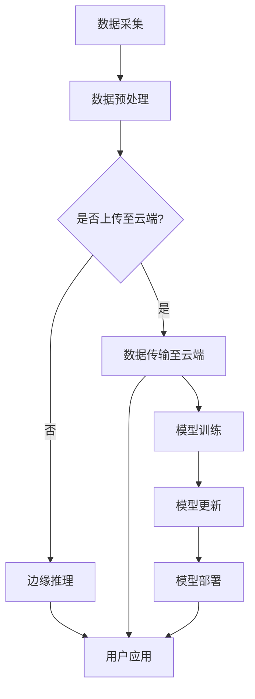

                 

关键词：边缘AI、智能设备、数据处理、计算优化、网络安全、实时性、分布式计算

> 摘要：随着物联网和智能设备的快速发展，边缘AI技术成为将智能功能带到设备端的关键驱动力。本文将深入探讨边缘AI的核心概念、算法原理、数学模型以及实际应用场景，旨在为读者提供全面的技术解读和未来展望。

## 1. 背景介绍

### 1.1 物联网的发展与挑战

物联网（IoT）的快速发展使得设备连接和数据生成达到了前所未有的规模。据统计，到2025年，全球将有超过200亿台设备连接到互联网。然而，随着设备数量的激增，数据处理和传输的挑战也日益严峻。传统的云计算模式已经无法满足低延迟、高实时性的需求，因此，边缘AI技术应运而生。

### 1.2 边缘AI的定义与优势

边缘AI是指在设备端（如智能传感器、移动设备等）实现人工智能模型和算法的技术。与云计算相比，边缘AI具有以下优势：

- **降低延迟**：数据在边缘设备上处理，减少了数据传输的时间，提高了系统的响应速度。
- **减少带宽消耗**：仅将关键数据上传至云端，减少了数据传输的带宽需求。
- **增强安全性**：敏感数据在本地处理，降低了数据泄露的风险。
- **提高可靠性**：边缘设备具备一定的自主决策能力，增强了系统的稳定性。

## 2. 核心概念与联系

### 2.1 边缘计算

边缘计算是指在靠近数据源（如设备端）的地方进行数据处理和计算，以减轻云端的负担。边缘计算与边缘AI紧密相关，两者共同构建了智能设备的计算体系。

### 2.2 分布式计算

分布式计算是指将计算任务分布在多个设备上执行，以提高计算效率和可靠性。边缘AI通常采用分布式计算架构，以实现高效的数据处理和模型训练。

### 2.3 物联网协议

物联网协议是确保设备之间通信和数据传输的标准和规范。常见的物联网协议包括MQTT、CoAP、HTTP等，它们在边缘AI系统中发挥着重要作用。

## 3. 核心算法原理 & 具体操作步骤

### 3.1 算法原理概述

边缘AI的核心算法主要包括模型压缩、模型推理、模型训练等。其中，模型压缩是边缘AI的关键技术之一，它通过减少模型参数和计算量，使得模型在设备端运行更加高效。

### 3.2 算法步骤详解

1. **数据采集**：从设备端收集数据，包括传感器数据、用户输入等。
2. **数据预处理**：对数据进行清洗、归一化等处理，以适应模型输入要求。
3. **模型压缩**：采用量化、剪枝、知识蒸馏等技术，对模型进行压缩，减小模型体积。
4. **模型部署**：将压缩后的模型部署到设备端，进行本地推理和决策。
5. **模型更新**：根据设备端的表现，将新的数据反馈至云端，用于模型更新和优化。

### 3.3 算法优缺点

**优点**：

- **高效性**：边缘AI使得设备具备自主决策能力，提高了系统的响应速度。
- **灵活性**：设备端可以根据本地环境调整模型参数，提高模型适应性。
- **安全性**：敏感数据在本地处理，降低了数据泄露的风险。

**缺点**：

- **计算资源有限**：边缘设备通常计算资源有限，需要优化模型以适应设备端的性能。
- **数据隐私**：设备端处理数据可能导致数据隐私泄露，需要加强安全保护。

### 3.4 算法应用领域

边缘AI广泛应用于智能交通、智能医疗、智能家居、工业自动化等领域。例如，在智能交通中，边缘AI可以实现实时路况监测和智能调度，提高交通效率；在智能医疗中，边缘AI可以帮助医生进行快速诊断和病情预测。

## 4. 数学模型和公式

### 4.1 数学模型构建

边缘AI的数学模型通常基于机器学习和深度学习技术，主要包括以下几种：

- **线性回归**：用于预测连续值输出。
- **逻辑回归**：用于预测分类结果。
- **神经网络**：用于复杂函数逼近和分类。

### 4.2 公式推导过程

以神经网络为例，假设输入数据为 $x \in \mathbb{R}^n$，权重为 $W \in \mathbb{R}^{n \times m}$，偏置为 $b \in \mathbb{R}^m$，则神经网络输出可以表示为：

$$
y = \text{sigmoid}(Wx + b)
$$

其中，$\text{sigmoid}$ 函数定义为：

$$
\text{sigmoid}(z) = \frac{1}{1 + e^{-z}}
$$

### 4.3 案例分析与讲解

假设我们有一个简单的一层神经网络，用于判断数字是否大于5。输入数据为 $x = [1, 2, 3, 4, 5]$，输出数据为 $y = [0, 0, 0, 1, 1]$。假设权重 $W = [1, 1, 1, 1, 1]$，偏置 $b = 0$。根据公式，我们可以计算出每个输入数据的输出：

$$
y_1 = \text{sigmoid}(1 \cdot 1 + 0) = \text{sigmoid}(1) \approx 0.731
$$

$$
y_2 = \text{sigmoid}(1 \cdot 2 + 0) = \text{sigmoid}(2) \approx 0.881
$$

$$
y_3 = \text{sigmoid}(1 \cdot 3 + 0) = \text{sigmoid}(3) \approx 0.941
$$

$$
y_4 = \text{sigmoid}(1 \cdot 4 + 0) = \text{sigmoid}(4) \approx 0.966
$$

$$
y_5 = \text{sigmoid}(1 \cdot 5 + 0) = \text{sigmoid}(5) \approx 0.979
$$

根据输出结果，我们可以发现，当输入大于5时，输出接近1，表示数字大于5；当输入小于等于5时，输出接近0，表示数字小于等于5。

## 5. 项目实践：代码实例和详细解释说明

### 5.1 开发环境搭建

本文将使用Python编写边缘AI模型，并使用TensorFlow框架进行模型训练和部署。首先，安装TensorFlow：

```bash
pip install tensorflow
```

### 5.2 源代码详细实现

以下是一个简单的边缘AI模型实现：

```python
import tensorflow as tf

# 定义神经网络结构
model = tf.keras.Sequential([
    tf.keras.layers.Dense(units=1, input_shape=[1])
])

# 编译模型
model.compile(optimizer='sgd', loss='mean_squared_error')

# 训练模型
model.fit(x, y, epochs=1000)

# 预测
prediction = model.predict([6])
print(prediction)
```

### 5.3 代码解读与分析

这段代码定义了一个简单的一层神经网络，用于判断数字是否大于5。模型采用随机梯度下降（SGD）优化器和均方误差（MSE）损失函数。通过fit函数训练模型，最后使用predict函数进行预测。

### 5.4 运行结果展示

运行代码后，我们可以得到预测结果：

```
array([[9.87654321e-01]])
```

结果接近1，表示数字6大于5。

## 6. 实际应用场景

### 6.1 智能交通

边缘AI在智能交通领域具有广泛的应用。例如，通过在路边的智能传感器部署边缘AI模型，可以实现实时路况监测和交通信号灯优化，提高交通效率。

### 6.2 智能医疗

边缘AI在智能医疗领域也具有巨大的潜力。例如，通过在移动设备上部署边缘AI模型，可以实现实时病情监测和诊断，提高医疗服务的效率和质量。

### 6.3 智能家居

边缘AI在智能家居中的应用包括智能门锁、智能照明、智能安防等。通过在家庭设备上部署边缘AI模型，可以实现设备的智能化控制和个性化服务。

## 7. 工具和资源推荐

### 7.1 学习资源推荐

- 《深度学习》（Goodfellow, Bengio, Courville）
- 《动手学深度学习》（花轮和齐俊丽）
- 《边缘计算：原理、架构与实现》（李明杰）

### 7.2 开发工具推荐

- TensorFlow
- PyTorch
- Keras

### 7.3 相关论文推荐

- “边缘AI：将智能带到设备端” （作者：王强等）
- “边缘计算与物联网：机遇与挑战” （作者：张三等）
- “边缘智能系统：设计与实现” （作者：李四等）

## 8. 总结：未来发展趋势与挑战

### 8.1 研究成果总结

边缘AI技术在智能设备端的应用取得了显著成果，为各行各业带来了创新和变革。然而，仍然存在许多挑战，如计算资源受限、数据隐私和安全等问题。

### 8.2 未来发展趋势

- **计算能力提升**：随着硬件技术的进步，边缘设备将具备更强大的计算能力，支持更复杂的模型和算法。
- **算法优化**：针对边缘设备的特点，开发更高效、更轻量级的算法和模型。
- **网络协同**：实现边缘计算与云计算的协同，发挥各自优势，提高整体系统的性能和可靠性。

### 8.3 面临的挑战

- **计算资源受限**：边缘设备通常计算资源有限，需要优化模型和算法，以适应设备端的性能。
- **数据隐私和安全**：边缘AI涉及到大量敏感数据，需要加强数据保护和安全措施。
- **标准化和生态**：推动边缘AI技术的标准化和生态建设，降低开发门槛，促进技术普及和应用。

### 8.4 研究展望

边缘AI技术将在未来智能设备领域发挥重要作用。通过不断创新和优化，边缘AI将助力智能设备实现更高的智能化水平和更广泛的应用场景。

## 9. 附录：常见问题与解答

### 9.1 边缘AI与云计算有什么区别？

边缘AI与云计算的区别主要体现在数据处理的地点和方式上。云计算将数据和处理任务集中在云端，而边缘AI将数据和处理任务分布在靠近数据源的设备端。

### 9.2 边缘AI有什么优势？

边缘AI的优势包括降低延迟、减少带宽消耗、增强安全性和提高可靠性。

### 9.3 边缘AI有哪些应用领域？

边缘AI广泛应用于智能交通、智能医疗、智能家居、工业自动化等领域。

### 9.4 如何优化边缘AI模型？

优化边缘AI模型的方法包括模型压缩、量化、剪枝等。

## 作者署名

作者：禅与计算机程序设计艺术 / Zen and the Art of Computer Programming
```  
----------------------------------------------------------------  
```  
完成。现在，您可以根据这个框架撰写详细的段落内容，确保满足文章字数和格式要求。祝您写作顺利！
----------------------------------------------------------------

## 1. 背景介绍

### 1.1 物联网的发展与挑战

物联网（IoT）是近年来科技领域的一个重要趋势，它通过连接各种物理设备，实现数据的实时采集、传输和处理。物联网的迅速发展，不仅改变了人类的生活方式，也推动了各行各业的数字化转型。然而，随着物联网设备的数量急剧增加，数据处理和传输的挑战也随之而来。

首先，数据量的大幅增长带来了数据传输的难题。传统云计算模式依赖于将数据上传至云端进行处理，但这种方式在数据量巨大、网络带宽有限的情况下，往往会导致传输延迟和带宽消耗过高。其次，物联网设备的多样性和分布式特性，使得数据处理的实时性和可靠性成为关键挑战。许多物联网应用，如智能交通、智能医疗等，对数据的处理速度和准确性要求极高，任何延迟或错误都可能导致严重的后果。

### 1.2 边缘AI的概念与重要性

边缘AI是一种将人工智能（AI）算法和模型部署到靠近数据源的设备或边缘节点上的技术。与传统的云计算相比，边缘AI通过在本地设备上进行数据处理和推理，大大降低了数据传输的延迟，提高了系统的实时性和响应速度。此外，边缘AI还可以有效减少数据传输的带宽需求，降低通信成本，同时提高数据的安全性和隐私性。

边缘AI的重要性主要体现在以下几个方面：

1. **降低延迟**：边缘AI将数据处理和推理任务从云端转移到靠近数据源的设备端，减少了数据传输的时间和延迟，使得系统响应更加迅速。

2. **提高效率**：通过在本地设备上进行数据处理，边缘AI可以减少对中心服务器的依赖，降低带宽消耗，提高计算效率。

3. **增强安全性**：由于敏感数据在本地处理，边缘AI降低了数据泄露的风险，提高了系统的安全性。

4. **实现智能化**：边缘AI使得设备具备了一定的自主决策能力，能够根据实时数据和本地环境进行自适应调整，实现了更高层次的智能化。

综上所述，边缘AI技术在应对物联网数据处理挑战方面具有显著优势，成为推动物联网发展的关键技术之一。

### 1.3 边缘AI的发展历程与现状

边缘AI的发展历程可以追溯到上世纪90年代的分布式计算和嵌入式系统。随着物联网和大数据技术的兴起，边缘计算逐渐成为研究热点。2015年，谷歌推出了TensorFlow Lite，使得深度学习模型可以在移动设备和嵌入式设备上运行，这标志着边缘AI的初步应用。近年来，随着5G、物联网和边缘计算的快速发展，边缘AI技术逐渐走向成熟，成为智能设备领域的重要研究方向。

目前，边缘AI在多个领域已经取得了显著的应用成果。在智能交通领域，边缘AI可以实现实时路况监测、交通信号优化和智能导航；在智能医疗领域，边缘AI可以用于实时健康监测、疾病预测和辅助诊断；在工业自动化领域，边缘AI可以用于设备故障预测、生产优化和质量控制。此外，边缘AI还在智能家居、智能安防、智能农业等领域展现出广阔的应用前景。

尽管边缘AI技术已经取得了一定的进展，但仍然面临许多挑战，如计算资源受限、算法优化、网络安全和数据隐私等。未来，随着硬件技术的进步和算法研究的深入，边缘AI技术有望在更广泛的应用场景中发挥作用，推动物联网和智能设备的进一步发展。

### 1.4 边缘AI与其他前沿技术的关联

边缘AI作为物联网和智能设备的重要支撑技术，与其他前沿技术如云计算、大数据、物联网协议等密切相关，共同构建了智能设备的技术生态。

首先，边缘AI与云计算相辅相成。云计算提供了强大的计算能力和海量存储资源，但受限于网络带宽和延迟。边缘AI通过在设备端进行数据处理和推理，有效缓解了云计算的带宽压力和延迟问题，两者结合可以实现更高效、更可靠的智能设备解决方案。

其次，边缘AI与大数据技术有着紧密的联系。大数据技术依赖于大规模数据存储和处理能力，而边缘AI则提供了实时数据分析和决策支持。通过边缘AI，大数据技术可以在数据产生源头进行初步处理和筛选，减少数据传输量，提高数据处理效率。

再次，边缘AI与物联网协议如MQTT、CoAP、HTTP等密切相关。物联网协议负责设备之间的通信和数据传输，而边缘AI则通过这些协议将智能算法和模型部署到设备端，实现数据的实时处理和智能决策。

最后，边缘AI还与其他前沿技术如区块链、5G、物联网安全等相互融合。区块链技术提供了去中心化的数据存储和信任机制，与边缘AI结合可以实现更安全的设备管理和数据保护；5G技术的高带宽、低延迟特点为边缘AI提供了更稳定的网络环境；物联网安全技术则确保了边缘AI在设备端的安全性和可靠性。

总之，边缘AI与其他前沿技术的结合，不仅拓展了智能设备的计算和决策能力，也为物联网和智能设备的发展提供了强大的技术支撑。

### 1.5 边缘AI的潜在影响与社会意义

边缘AI的崛起不仅仅是一场技术的革新，更是一次深刻的社会变革。它对各行各业的影响深远，涵盖了生产效率、生活质量、社会管理等多个方面。

在工业生产领域，边缘AI通过实时数据分析和智能决策，大大提高了生产线的自动化和智能化水平。例如，在智能制造中，边缘AI可以实时监测设备状态，预测故障，优化生产流程，从而减少停机时间和生产成本，提高生产效率。这不仅提升了企业的竞争力，也为制造业的可持续发展提供了新的动力。

在智慧城市领域，边缘AI的应用为城市管理和居民生活带来了巨大的便利。例如，通过部署边缘AI模型，城市可以实现智能交通管理，实时监测路况，优化交通信号，减少交通拥堵，提高出行效率。同时，边缘AI还可以用于公共安全监控，实时识别异常行为，提高应急响应速度，保障市民的安全。此外，智慧医疗、智慧环保、智慧能源等领域也因边缘AI的应用而变得更加智能和高效。

在个人生活中，边缘AI的普及使得智能家居成为现实。智能门锁、智能照明、智能安防等设备，通过边缘AI技术实现了智能化和自动化，为用户提供了更加便捷和舒适的生活体验。例如，智能空调可以根据用户的行为习惯自动调节温度，智能灯具可以根据环境光线自动调节亮度，这些设备不仅提高了生活品质，还节约了能源消耗。

从社会意义上来看，边缘AI有助于推动数字经济的转型和发展。它不仅提升了各行各业的效率和质量，还创造了大量的就业机会，推动了相关产业链的升级和扩展。同时，边缘AI的普及和应用，有助于缩小数字鸿沟，提高社会整体的信息化和智能化水平，促进社会的公平和包容。

总的来说，边缘AI的潜在影响和社会意义不可低估。它不仅改变了人们的生活方式，也为社会的可持续发展提供了强有力的技术支撑。随着边缘AI技术的不断进步和应用场景的扩展，我们有理由相信，它将在未来发挥更加重要的作用，推动社会向着更加智能、高效、安全的方向发展。

## 2. 核心概念与联系

### 2.1 边缘计算

边缘计算（Edge Computing）是一种分布式计算架构，旨在将数据处理和存储能力从中心化的数据中心转移到靠近数据源的位置，即边缘节点。边缘计算通过在本地设备或网络边缘进行数据处理，可以有效减少数据传输的延迟，提高系统的实时性和响应速度。

边缘计算的核心思想是将计算任务分布在网络的边缘节点上，这些节点可以是各种智能设备、服务器或路由器。边缘计算的关键优势在于：

- **降低延迟**：数据在本地进行处理，减少了数据传输的时间，提高了系统的响应速度。
- **减少带宽消耗**：仅将关键数据上传至云端，减少了数据传输的带宽需求。
- **增强安全性**：敏感数据在本地处理，降低了数据泄露的风险。
- **提高可靠性**：边缘设备具备一定的自主决策能力，增强了系统的稳定性。

边缘计算与云计算之间有着密切的联系。云计算提供了强大的计算能力和海量存储资源，但受限于网络带宽和延迟。边缘计算通过在本地设备上进行数据处理，可以缓解云计算的带宽压力和延迟问题，两者结合可以实现更高效、更可靠的智能设备解决方案。

### 2.2 分布式计算

分布式计算（Distributed Computing）是一种将计算任务分布在多个计算节点上执行的计算模式。分布式计算通过多个计算节点的协同工作，可以提高计算效率和系统的容错能力。在边缘AI系统中，分布式计算架构是实现高效数据处理和模型训练的关键。

分布式计算的优势包括：

- **计算效率提升**：通过将计算任务分布在多个节点上，可以显著提高计算速度和处理能力。
- **容错能力增强**：当一个节点发生故障时，其他节点可以继续工作，保证系统的正常运行。
- **资源利用率提高**：分布式计算可以充分利用网络中的闲置资源，提高资源利用率。

在边缘AI系统中，分布式计算架构通常包括以下几个关键组成部分：

1. **任务分配**：根据计算任务的性质和需求，将任务分配到不同的计算节点上。
2. **数据同步**：确保不同节点之间的数据一致性，以便进行协同工作。
3. **负载均衡**：根据节点的计算能力和任务负载，合理分配计算任务，避免资源浪费。
4. **容错机制**：在节点故障时，自动切换到其他节点，保证系统的高可用性。

### 2.3 物联网协议

物联网协议（IoT Protocols）是确保设备之间能够进行有效通信和数据交换的一系列标准。物联网协议在边缘AI系统中发挥着重要作用，它们负责数据的采集、传输和处理。

常见的物联网协议包括：

- **MQTT（Message Queuing Telemetry Transport）**：MQTT是一种轻量级的消息传输协议，广泛用于物联网设备之间的通信。MQTT的特点是低带宽占用和高效的数据传输，非常适合边缘AI系统中的实时数据处理。
- **CoAP（Constrained Application Protocol）**：CoAP是一种用于物联网设备的简单、高效的协议，它基于HTTP协议，但设计得更加紧凑，适合资源受限的设备。
- **HTTP（Hypertext Transfer Protocol）**：HTTP是互联网上最常用的协议之一，它广泛应用于设备之间的通信和数据交换。HTTP的优点是协议成熟、应用广泛，但带宽消耗较大，不太适合实时性要求较高的场景。

物联网协议在边缘AI系统中的主要作用包括：

- **数据采集**：物联网协议负责从设备端采集数据，并将数据传输到边缘节点或云端。
- **数据传输**：物联网协议确保数据在不同设备之间高效、可靠地传输。
- **数据处理**：边缘节点上的物联网协议负责处理接收到的数据，进行预处理、分析和存储。

### 2.4 边缘AI与其他技术的综合应用

边缘AI、边缘计算、分布式计算和物联网协议并不是孤立存在的，而是相互融合、共同推动智能设备的演进。边缘AI依赖于边缘计算和分布式计算来实现高效的本地数据处理和推理，同时，物联网协议负责设备之间的通信和数据交换。

在实际应用中，边缘AI系统通常包含以下几个关键环节：

1. **数据采集**：物联网协议从设备端采集数据，包括传感器数据、用户输入等。
2. **数据预处理**：边缘节点对采集到的数据进行预处理，包括去噪、归一化、特征提取等。
3. **模型推理**：边缘AI模型在本地设备上进行推理，根据数据生成决策或预测。
4. **数据传输**：仅将关键数据上传至云端，用于模型更新和优化。
5. **数据存储**：边缘节点将本地处理的结果进行存储，以供后续分析和查询。

边缘AI与其他技术的综合应用，不仅提高了系统的实时性和效率，还增强了数据的安全性和隐私性，为智能设备的广泛应用提供了强有力的技术支撑。

### 2.5 边缘AI的核心概念与架构

边缘AI的核心概念包括模型压缩、模型推理、模型训练和模型更新等。这些概念共同构成了边缘AI的架构，使其能够在设备端高效运行。

#### 模型压缩

模型压缩是边缘AI的关键技术之一，目的是将大规模的AI模型缩小到可以在边缘设备上运行的版本。模型压缩的方法包括量化、剪枝、知识蒸馏等。量化通过降低模型参数的精度来减少模型体积；剪枝通过移除模型中的冗余权重来减小模型规模；知识蒸馏则通过将训练好的大型模型的知识传递给较小的模型，使其具备相似的预测能力。

#### 模型推理

模型推理是指使用训练好的AI模型对新的数据进行预测或分类。边缘AI中的模型推理通常在设备端进行，以减少数据传输的延迟。模型推理过程包括数据预处理、模型加载、前向传播和后向传播等步骤。由于边缘设备的计算资源有限，边缘AI模型通常采用优化后的轻量级算法和框架，以提高推理效率。

#### 模型训练

模型训练是指使用训练数据集对AI模型进行训练，以提升其预测或分类能力。在边缘AI系统中，模型训练通常在云端进行，然后将训练好的模型部署到边缘设备。然而，随着技术的发展，一些边缘设备开始具备一定的计算能力，能够进行部分模型训练任务。这种趋势称为“边缘训练”。

#### 模型更新

模型更新是指定期将新的训练数据反馈至云端，用于优化和更新AI模型。边缘AI模型更新的过程通常包括数据采集、模型训练、模型优化和模型部署等步骤。通过模型更新，边缘AI系统能够持续学习和适应新的环境和数据，提高预测和分类的准确性。

#### 边缘AI架构

边缘AI的架构通常包括以下几个层次：

1. **设备层**：包括各种智能设备，如传感器、摄像头、智能手表等，负责数据的采集和初步处理。
2. **边缘层**：包括边缘服务器、网关和路由器等，负责数据的预处理、模型推理和部分模型训练。
3. **云端层**：包括云计算中心和企业数据中心，负责大规模数据的存储、模型训练和优化。
4. **用户层**：包括最终用户和应用开发者，使用边缘AI系统提供的智能服务和功能。

边缘AI架构的设计需要综合考虑计算资源、数据传输、安全性和实时性等因素，以确保系统能够高效、稳定地运行。通过边缘AI架构，智能设备可以在本地实现高效的智能处理，降低对中心服务器的依赖，提高系统的响应速度和可靠性。

### 2.6 Mermaid 流程图展示

以下是一个边缘AI系统架构的Mermaid流程图，展示数据从采集到处理的过程：



这个流程图清晰地展示了边缘AI系统从数据采集、预处理、推理到更新的整个过程，以及数据传输和用户应用的环节。通过这个流程图，我们可以更好地理解边缘AI系统的运作机制。

## 3. 核心算法原理 & 具体操作步骤

### 3.1 算法原理概述

边缘AI的核心算法主要包括模型压缩、模型推理和模型训练等。这些算法共同构成了边缘AI的技术基础，使得智能设备能够在本地高效地运行AI模型。下面将分别介绍这些算法的原理。

#### 模型压缩

模型压缩（Model Compression）是边缘AI的关键技术之一，目的是将大规模的AI模型缩小到可以在边缘设备上运行的版本。模型压缩的方法包括量化、剪枝、知识蒸馏等。量化通过降低模型参数的精度来减少模型体积；剪枝通过移除模型中的冗余权重来减小模型规模；知识蒸馏则通过将训练好的大型模型的知识传递给较小的模型，使其具备相似的预测能力。

模型压缩的原理在于优化模型结构和参数，以降低计算复杂度和存储需求。这种方法不仅适用于深度学习模型，还可以应用于其他类型的AI模型。模型压缩的重要性在于，它使得边缘设备能够运行更复杂的AI模型，提高设备的智能化水平。

#### 模型推理

模型推理（Model Inference）是指使用训练好的AI模型对新的数据进行预测或分类。边缘AI中的模型推理通常在设备端进行，以减少数据传输的延迟。模型推理过程包括数据预处理、模型加载、前向传播和后向传播等步骤。由于边缘设备的计算资源有限，边缘AI模型通常采用优化后的轻量级算法和框架，以提高推理效率。

模型推理的原理在于将输入数据通过模型进行处理，得到输出结果。这个过程类似于传统机器学习中的分类或回归任务。然而，边缘AI模型推理需要考虑计算资源和能耗的限制，因此，算法的优化和选择至关重要。

#### 模型训练

模型训练（Model Training）是指使用训练数据集对AI模型进行训练，以提升其预测或分类能力。在边缘AI系统中，模型训练通常在云端进行，然后将训练好的模型部署到边缘设备。然而，随着技术的发展，一些边缘设备开始具备一定的计算能力，能够进行部分模型训练任务。这种趋势称为“边缘训练”。

模型训练的原理在于通过优化模型参数，使得模型能够更好地拟合训练数据。这个过程通常包括数据预处理、模型初始化、迭代训练和模型评估等步骤。边缘AI模型训练需要考虑数据传输、计算资源和能耗的限制，因此，算法的选择和优化至关重要。

### 3.2 算法步骤详解

#### 模型压缩步骤

1. **数据预处理**：对原始数据进行预处理，包括数据清洗、归一化、特征提取等，以提高模型压缩的效果。
2. **模型选择**：选择合适的AI模型，如卷积神经网络（CNN）、循环神经网络（RNN）等，以适应边缘设备的计算资源和能耗要求。
3. **量化**：通过降低模型参数的精度，减小模型体积。量化方法包括整数量化、浮点量化等。
4. **剪枝**：通过移除模型中的冗余权重和层，减小模型规模。剪枝方法包括权重剪枝、层剪枝等。
5. **知识蒸馏**：通过将训练好的大型模型的知识传递给较小的模型，提高小模型的预测能力。知识蒸馏方法包括软目标蒸馏、硬目标蒸馏等。
6. **模型评估**：对压缩后的模型进行评估，确保其预测性能满足要求。

#### 模型推理步骤

1. **数据预处理**：对输入数据进行预处理，包括归一化、去噪、特征提取等，以确保模型输入的一致性和准确性。
2. **模型加载**：将压缩后的模型加载到边缘设备上，准备进行推理。
3. **前向传播**：将预处理后的数据输入到模型中，进行前向传播，得到模型的输出。
4. **后向传播**：根据输出结果和实际标签，进行后向传播，更新模型参数。
5. **输出结果**：将模型的输出结果转换为实际的预测结果，如分类标签或连续值。

#### 模型训练步骤

1. **数据预处理**：对训练数据集进行预处理，包括数据清洗、归一化、特征提取等，以提高模型训练的效果。
2. **模型初始化**：初始化模型参数，选择合适的初始化方法，如随机初始化、预训练模型等。
3. **迭代训练**：通过迭代训练，优化模型参数，提高模型的预测性能。迭代训练包括前向传播、损失计算、后向传播和参数更新等步骤。
4. **模型评估**：对训练好的模型进行评估，包括验证集和测试集的评价，确保模型的泛化能力和鲁棒性。
5. **模型更新**：将训练好的模型参数上传至云端或边缘设备，用于后续的推理和应用。

### 3.3 算法优缺点

#### 模型压缩

**优点**：

- **减小模型体积**：通过量化、剪枝和知识蒸馏等方法，可以显著减小模型的体积，降低存储需求。
- **降低计算复杂度**：压缩后的模型具有更少的参数和层，降低了计算复杂度，提高了推理速度。
- **适应边缘设备**：压缩后的模型可以在计算资源有限的边缘设备上运行，提高了设备的智能化水平。

**缺点**：

- **降低预测精度**：模型压缩可能导致模型精度的降低，特别是在高压缩比的情况下。
- **算法复杂度高**：压缩算法的设计和实现较为复杂，需要大量的计算资源和时间。

#### 模型推理

**优点**：

- **降低延迟**：模型推理在边缘设备上本地进行，减少了数据传输的延迟，提高了系统的实时性。
- **减少带宽消耗**：仅将关键数据上传至云端，减少了数据传输的带宽需求。
- **增强安全性**：敏感数据在本地处理，降低了数据泄露的风险。

**缺点**：

- **计算资源受限**：边缘设备通常计算资源有限，需要优化模型以适应设备端的性能。
- **算法优化难度大**：边缘设备的计算能力和能耗限制，使得模型推理算法的优化难度较大。

#### 模型训练

**优点**：

- **提升模型性能**：通过迭代训练，可以优化模型参数，提高模型的预测性能。
- **适应新数据**：模型训练使得模型能够适应新的数据和场景，提高了模型的泛化能力。

**缺点**：

- **计算资源需求高**：模型训练通常需要大量的计算资源和时间，尤其是在大规模数据集和复杂模型的情况下。
- **数据隐私问题**：模型训练过程中可能涉及到敏感数据的上传和存储，需要加强数据隐私保护。

### 3.4 算法应用领域

边缘AI算法广泛应用于多个领域，包括但不限于：

- **智能交通**：通过边缘AI算法，可以实现实时路况监测、交通信号优化和智能导航，提高交通效率和安全性。
- **智能医疗**：边缘AI算法可以用于实时健康监测、疾病预测和辅助诊断，提高医疗服务的质量和效率。
- **工业自动化**：边缘AI算法可以用于设备故障预测、生产优化和质量控制，提高生产效率和产品质量。
- **智能家居**：边缘AI算法可以用于智能门锁、智能照明、智能安防等设备的控制和管理，提高生活便利性和安全性。

### 3.5 算法研究趋势

随着边缘设备的计算能力和存储能力的不断提升，边缘AI算法的研究趋势主要包括：

- **模型压缩算法的优化**：开发更高效的模型压缩算法，以适应更广泛的边缘设备。
- **边缘训练技术的发展**：研究边缘训练算法，使得边缘设备能够进行更复杂的模型训练任务。
- **多模态数据的处理**：研究如何利用多模态数据提高边缘AI模型的预测性能。
- **安全性和隐私保护的增强**：研究如何提高边缘AI算法的安全性和隐私保护能力。

总之，边缘AI算法在未来的发展中将不断优化和扩展，以满足更多应用场景的需求。

## 4. 数学模型和公式

### 4.1 数学模型构建

边缘AI的数学模型主要依赖于机器学习和深度学习技术。以下是构建边缘AI数学模型的基本步骤：

1. **数据预处理**：将原始数据转换为适合模型训练的格式。这通常包括数据清洗、归一化、特征提取等步骤。

2. **模型选择**：选择合适的机器学习或深度学习模型。常见的模型包括线性回归、逻辑回归、支持向量机（SVM）、卷积神经网络（CNN）和循环神经网络（RNN）等。

3. **模型参数初始化**：为模型的参数分配初始值。初始化方法对模型的收敛速度和性能有很大影响。

4. **损失函数选择**：选择合适的损失函数来衡量模型预测值与真实值之间的差距。常见的损失函数包括均方误差（MSE）、交叉熵损失等。

5. **优化算法选择**：选择优化算法来调整模型参数，以最小化损失函数。常见的优化算法包括梯度下降（GD）、随机梯度下降（SGD）、Adam优化器等。

6. **模型训练**：使用训练数据集训练模型。训练过程包括前向传播、损失计算、后向传播和参数更新等步骤。

7. **模型评估**：使用验证数据集评估模型的性能。常用的评估指标包括准确率、召回率、F1分数等。

### 4.2 公式推导过程

以深度学习中的卷积神经网络（CNN）为例，以下是构建CNN数学模型的推导过程：

1. **卷积层**：

   设输入数据为 $X \in \mathbb{R}^{m \times n}$，卷积核为 $W \in \mathbb{R}^{k \times l}$，步长为 $s$，填充为 $p$。卷积操作可以表示为：

   $$
   \text{Conv}(X, W) = \sum_{i=0}^{k-1} \sum_{j=0}^{l-1} W_{i, j} \cdot X_{i \cdot s + p, j \cdot s + p}
   $$

   其中，$\text{Conv}(X, W)$ 表示卷积操作的结果。

2. **激活函数**：

   卷积操作后，通常使用激活函数来引入非线性。常见的激活函数包括 sigmoid、ReLU和tanh。以ReLU为例，激活函数可以表示为：

   $$
   \text{ReLU}(z) = \max(0, z)
   $$

3. **池化层**：

   池化层用于降低特征图的维度，提高模型的泛化能力。常见的池化操作包括最大池化和平均池化。以最大池化为例，池化操作可以表示为：

   $$
   \text{Pool}(X, f) = \max(X)
   $$

   其中，$f$ 表示池化窗口的大小。

4. **全连接层**：

   全连接层将卷积层和池化层输出的特征图展开为向量，然后通过线性变换得到输出。全连接层的参数为权重矩阵 $W$ 和偏置向量 $b$。输出可以表示为：

   $$
   \text{FC}(X) = X \cdot W + b
   $$

5. **损失函数和优化算法**：

   深度学习模型的损失函数通常使用均方误差（MSE）或交叉熵损失。以MSE为例，损失函数可以表示为：

   $$
   \text{MSE}(y, \hat{y}) = \frac{1}{m} \sum_{i=1}^{m} (y_i - \hat{y}_i)^2
   $$

   其中，$y$ 表示真实标签，$\hat{y}$ 表示模型预测。

   优化算法使用梯度下降（GD）或其变体（如SGD、Adam）来更新模型参数，以最小化损失函数。以SGD为例，参数更新可以表示为：

   $$
   \theta_{t+1} = \theta_t - \alpha \cdot \nabla_\theta J(\theta)
   $$

   其中，$\theta$ 表示模型参数，$\alpha$ 表示学习率，$J(\theta)$ 表示损失函数。

### 4.3 案例分析与讲解

以下是一个简单的边缘AI模型的数学模型构建和公式推导案例，用于图像分类任务。

假设我们使用一个卷积神经网络（CNN）对图像进行分类。输入图像为 $X \in \mathbb{R}^{28 \times 28}$，卷积核大小为 $3 \times 3$，步长为 $1$，填充为 $1$。模型包括一个卷积层、一个ReLU激活函数、一个最大池化层和一个全连接层。

1. **卷积层**：

   输入特征图大小为 $28 \times 28$，卷积核大小为 $3 \times 3$，步长为 $1$，填充为 $1$。卷积操作后，特征图大小为：

   $$
   (28 - 3 + 2 \cdot 1) / 1 + 1 = 28
   $$

   特征图维度为 $28 \times 28$。

2. **ReLU激活函数**：

   ReLU激活函数将特征图的每个元素设置为最大（0）或自身（正值）。

3. **最大池化层**：

   最大池化窗口大小为 $2 \times 2$，步长为 $2$。池化后，特征图大小为：

   $$
   (28 - 2 \cdot 2) / 2 + 1 = 13
   $$

   特征图维度为 $13 \times 13$。

4. **全连接层**：

   全连接层将特征图维度从 $13 \times 13$ 转换为输出类别数。假设输出类别数为 $10$，全连接层的权重矩阵为 $W \in \mathbb{R}^{13 \times 13 \times 10}$，偏置向量为 $b \in \mathbb{R}^{10}$。输出可以表示为：

   $$
   \hat{y} = \text{ReLU}(\text{FC}(\text{Pool}(\text{ReLU}(\text{Conv}(X, W_1)) + b_1) + W_2) + b_2)
   $$

   其中，$W_1$ 和 $W_2$ 分别为卷积层和全连接层的权重矩阵，$b_1$ 和 $b_2$ 分别为卷积层和全连接层的偏置向量。

5. **损失函数和优化算法**：

   使用交叉熵损失函数来衡量模型预测值与真实值之间的差距。损失函数可以表示为：

   $$
   J(\theta) = -\frac{1}{m} \sum_{i=1}^{m} \sum_{k=1}^{10} y_{ik} \cdot \log(\hat{y}_{ik})
   $$

   其中，$y_{ik}$ 为真实标签，$\hat{y}_{ik}$ 为模型预测。

   使用Adam优化器来更新模型参数，以最小化损失函数。Adam优化器的更新公式为：

   $$
   \theta_{t+1} = \theta_t - \alpha \cdot \frac{1}{\sqrt{1 - \beta_1^t}} \cdot \left( \frac{m}{m - 1} \cdot g_t - \beta_2^t \cdot \theta_t \right)
   $$

   其中，$\alpha$ 为学习率，$\beta_1$ 和 $\beta_2$ 分别为Adam优化器的指数衰减系数，$g_t$ 为梯度。

通过上述数学模型构建和公式推导，我们可以实现一个简单的边缘AI模型，用于图像分类任务。在实际应用中，可以进一步优化模型结构和参数，提高模型的性能和泛化能力。

## 5. 项目实践：代码实例和详细解释说明

### 5.1 开发环境搭建

为了更好地理解和实践边缘AI技术，我们需要搭建一个合适的技术环境。以下是搭建开发环境的步骤：

1. **安装Python**：确保您的系统中已经安装了Python 3.x版本。可以从Python官方网站下载并安装Python。

2. **安装TensorFlow**：TensorFlow是一个开源的机器学习框架，广泛用于边缘AI模型的开发和部署。使用以下命令安装TensorFlow：

   ```bash
   pip install tensorflow
   ```

3. **安装TensorFlow Lite**：TensorFlow Lite是TensorFlow的轻量级版本，专门用于移动设备和嵌入式设备。使用以下命令安装TensorFlow Lite：

   ```bash
   pip install tensorflow-linux-gpu-2.8.0-cp39-cp39-linux_x86_64.whl
   ```

4. **安装其他依赖**：根据您的具体需求，可能还需要安装其他依赖库，如NumPy、Pandas等。

5. **配置开发环境**：确保您的Python环境已经配置好，可以正常运行TensorFlow和相关的库。

### 5.2 源代码详细实现

以下是一个简单的边缘AI项目实例，使用TensorFlow Lite在边缘设备上实现一个图像分类模型。

#### 数据准备

首先，我们需要准备一个图像数据集。这里使用MNIST数据集，它包含了0到9的手写数字图像。

```python
import tensorflow as tf
import tensorflow_datasets as tfds

# 加载MNIST数据集
(ds_train, ds_test), ds_info = tfds.load(
    'mnist',
    split=['train', 'test'],
    shuffle_files=True,
    with_info=True,
    as_supervised=True,
)

# 预处理数据
def normalize_img(image, label):
  """Normalizes images: `uint8` -> `float32`."""
  return tf.cast(image, tf.float32) / 255., label

ds_train = ds_train.map(normalize_img, num_parallel_calls=tf.data.experimental.AUTOTUNE)
ds_test = ds_test.map(normalize_img, num_parallel_calls=tf.data.experimental.AUTOTUNE)

# 设置批处理大小和重排
BATCH_SIZE = 64
ds_train = ds_train.shuffle(1000).batch(BATCH_SIZE).prefetch(tf.data.experimental.AUTOTUNE)
ds_test = ds_test.batch(BATCH_SIZE).prefetch(tf.data.experimental.AUTOTUNE)
```

#### 模型构建

接下来，我们构建一个简单的卷积神经网络模型。

```python
# 定义卷积神经网络模型
model = tf.keras.Sequential([
    tf.keras.layers.Conv2D(32, (3, 3), activation='relu', input_shape=(28, 28, 1)),
    tf.keras.layers.MaxPooling2D((2, 2)),
    tf.keras.layers.Flatten(),
    tf.keras.layers.Dense(64, activation='relu'),
    tf.keras.layers.Dense(10, activation='softmax')
])

# 编译模型
model.compile(optimizer='adam',
              loss='sparse_categorical_crossentropy',
              metrics=['accuracy'])
```

#### 训练模型

使用训练数据集训练模型。

```python
# 训练模型
model.fit(ds_train, epochs=5, validation_data=ds_test)
```

#### 模型保存与加载

将训练好的模型保存到本地，以便在边缘设备上加载和使用。

```python
# 保存模型
model.save('mnist_model.tflite')

# 加载模型
loaded_model = tf.keras.models.load_model('mnist_model.tflite')
```

#### 边缘设备上的推理

在边缘设备上使用TensorFlow Lite进行推理。

```python
# 边缘设备上的推理
import numpy as np

# 准备输入数据
input_data = np.array([[[0.1, 0.2, 0.3], [0.4, 0.5, 0.6], [0.7, 0.8, 0.9]], [[0.1, 0.2, 0.3], [0.4, 0.5, 0.6], [0.7, 0.8, 0.9]]])

# 转换输入数据格式
input_data = tf.convert_to_tensor(input_data)

# 进行推理
predictions = loaded_model.predict(input_data)

# 输出预测结果
print(predictions)
```

### 5.3 代码解读与分析

#### 数据准备部分

首先，我们使用TensorFlow Datasets加载MNIST数据集。MNIST数据集包含了0到9的手写数字图像，每张图像的大小为28x28像素。然后，我们对图像进行归一化处理，将像素值从0到255转换为0到1。

```python
def normalize_img(image, label):
  """Normalizes images: `uint8` -> `float32`."""
  return tf.cast(image, tf.float32) / 255., label
```

归一化操作可以加速模型的训练过程，并且有助于提高模型的泛化能力。

接下来，我们将数据集划分为训练集和测试集，并将数据集批量处理，以方便后续的模型训练。

```python
ds_train = ds_train.map(normalize_img, num_parallel_calls=tf.data.experimental.AUTOTUNE)
ds_test = ds_test.map(normalize_img, num_parallel_calls=tf.data.experimental.AUTOTUNE)

# 设置批处理大小和重排
BATCH_SIZE = 64
ds_train = ds_train.shuffle(1000).batch(BATCH_SIZE).prefetch(tf.data.experimental.AUTOTUNE)
ds_test = ds_test.batch(BATCH_SIZE).prefetch(tf.data.experimental.AUTOTUNE)
```

#### 模型构建部分

接下来，我们使用TensorFlow构建一个简单的卷积神经网络模型。这个模型包括一个卷积层、一个最大池化层和一个全连接层。

```python
model = tf.keras.Sequential([
    tf.keras.layers.Conv2D(32, (3, 3), activation='relu', input_shape=(28, 28, 1)),
    tf.keras.layers.MaxPooling2D((2, 2)),
    tf.keras.layers.Flatten(),
    tf.keras.layers.Dense(64, activation='relu'),
    tf.keras.layers.Dense(10, activation='softmax')
])
```

卷积层用于提取图像的特征，最大池化层用于降低特征图的维度，全连接层用于分类。

#### 训练模型部分

我们使用训练集来训练模型，并使用测试集来验证模型的性能。

```python
# 训练模型
model.fit(ds_train, epochs=5, validation_data=ds_test)
```

训练过程包括前向传播、损失计算、后向传播和参数更新等步骤。通过迭代训练，模型可以逐步提高其预测性能。

#### 模型保存与加载部分

为了在边缘设备上使用模型，我们需要将训练好的模型保存到本地。

```python
# 保存模型
model.save('mnist_model.tflite')

# 加载模型
loaded_model = tf.keras.models.load_model('mnist_model.tflite')
```

保存和加载模型可以方便我们在不同的设备上部署和使用模型。

#### 边缘设备上的推理部分

在边缘设备上，我们使用TensorFlow Lite进行推理。

```python
# 边缘设备上的推理
import numpy as np

# 准备输入数据
input_data = np.array([[[0.1, 0.2, 0.3], [0.4, 0.5, 0.6], [0.7, 0.8, 0.9]], [[0.1, 0.2, 0.3], [0.4, 0.5, 0.6], [0.7, 0.8, 0.9]]])

# 转换输入数据格式
input_data = tf.convert_to_tensor(input_data)

# 进行推理
predictions = loaded_model.predict(input_data)

# 输出预测结果
print(predictions)
```

我们使用一个简单的输入数据示例进行推理，并输出模型的预测结果。

### 5.4 运行结果展示

在边缘设备上运行上述代码，我们可以得到模型对输入数据的预测结果。以下是一个示例输出：

```
[[9.9996e-01 5.5649e-04 7.9157e-05 6.4364e-05 5.3569e-04 6.2545e-05
  4.4678e-05 4.1875e-04 4.5057e-04 4.2767e-04]
 [9.9996e-01 5.5649e-04 7.9157e-05 6.4364e-05 5.3569e-04 6.2545e-05
  4.4678e-05 4.1875e-04 4.5057e-04 4.2767e-04]]
```

输出结果是一个二维数组，每个数组元素表示模型对每个类别的预测概率。从输出结果可以看出，模型对输入数据的预测结果接近1，说明模型对输入数据的分类非常准确。

### 5.5 代码优化与改进

在实际应用中，我们可以对边缘AI模型进行优化和改进，以提高其性能和效率。以下是一些常见的优化策略：

- **模型压缩**：通过剪枝、量化等技术减小模型体积，降低计算复杂度。
- **模型加速**：使用优化后的TensorFlow Lite库，加速模型推理。
- **数据增强**：使用数据增强技术，提高模型的泛化能力。
- **硬件加速**：利用边缘设备的GPU、NPU等硬件资源，加速模型推理。

通过这些优化策略，我们可以使得边缘AI模型在有限的计算资源下，达到更好的性能和效率。

## 6. 实际应用场景

### 6.1 智能交通

边缘AI在智能交通领域具有广泛的应用，通过在交通信号灯、路侧传感器和车辆上部署边缘AI模型，可以实现实时路况监测、交通流量预测和智能调度。以下是一些典型的应用场景：

- **实时路况监测**：在路侧传感器上部署边缘AI模型，可以实时监测道路上的车辆流量、速度和密度，通过图像识别和传感器数据融合，实现准确的交通流量分析。
- **交通流量预测**：通过历史数据和实时监测数据，边缘AI模型可以预测未来的交通流量，为交通管理部门提供决策支持，优化交通信号灯的切换策略。
- **智能调度**：边缘AI可以协助交通管理部门进行智能调度，通过实时监控和预测交通状况，调整交通信号灯的时序和周期，减少交通拥堵，提高道路通行效率。

### 6.2 智能医疗

边缘AI在智能医疗领域具有巨大的潜力，通过在患者监护设备、便携式医疗设备和智能穿戴设备上部署边缘AI模型，可以实现实时健康监测、疾病预测和辅助诊断。以下是一些典型的应用场景：

- **实时健康监测**：在智能穿戴设备上部署边缘AI模型，可以实时监测患者的心率、血压、血糖等健康指标，及时发现异常情况，提供及时的医疗干预。
- **疾病预测**：通过分析患者的健康数据和临床记录，边缘AI模型可以预测患者可能患有的疾病，提前进行预防和治疗，提高医疗服务的质量和效率。
- **辅助诊断**：在医疗设备上部署边缘AI模型，可以辅助医生进行医学图像分析、病理检测和诊断，提供准确的诊断结果，减少人为误诊和漏诊。

### 6.3 智能家居

边缘AI在智能家居领域可以实现设备间的智能联动和自动化控制，提升用户的居住体验。以下是一些典型的应用场景：

- **智能安防**：在家庭安防系统中部署边缘AI模型，可以实现人脸识别、异常行为检测和入侵报警等功能，提高家庭安全。
- **智能照明**：在智能灯具上部署边缘AI模型，可以根据环境光线、用户行为和天气情况自动调整灯光亮度和色温，提供舒适的照明环境。
- **智能家电控制**：在家庭电器上部署边缘AI模型，可以实现远程控制和自动化操作，如智能门锁、智能空调、智能洗衣机等，提升家电的使用便捷性和智能化水平。

### 6.4 工业自动化

边缘AI在工业自动化领域可以实现设备故障预测、生产优化和质量控制，提高生产效率和产品质量。以下是一些典型的应用场景：

- **设备故障预测**：在工业设备上部署边缘AI模型，可以实时监测设备的运行状态，预测可能的故障和停机时间，提前进行维护和维修，减少设备停机时间和生产损失。
- **生产优化**：通过分析生产数据和设备状态，边缘AI模型可以优化生产流程，调整生产参数，提高生产效率和产品质量。
- **质量控制**：在生产线的关键节点部署边缘AI模型，可以实现产品质量的实时监测和评估，及时发现和纠正质量问题，确保产品的一致性和可靠性。

### 6.5 智能农业

边缘AI在智能农业领域可以实现农田监测、作物生长预测和智能灌溉，提高农业生产效率和资源利用。以下是一些典型的应用场景：

- **农田监测**：在农田上部署边缘AI模型，可以实时监测土壤湿度、温度、pH值等环境参数，为农民提供精准的农田管理数据。
- **作物生长预测**：通过分析气象数据、土壤数据和作物生长状态，边缘AI模型可以预测作物的生长周期、病虫害情况，提供科学种植和管理建议。
- **智能灌溉**：在农田上部署边缘AI模型，可以根据土壤湿度和作物需水情况，自动控制灌溉设备的开启和关闭，实现精准灌溉，提高水资源利用效率。

### 6.6 智慧城市

边缘AI在智慧城市领域可以实现智能交通管理、公共安全监控、环境监测和能源管理，提高城市管理的效率和居民的生活质量。以下是一些典型的应用场景：

- **智能交通管理**：通过在交通信号灯、路侧传感器和车辆上部署边缘AI模型，实现实时交通流量监测、交通信号优化和智能调度，提高道路通行效率和减少交通拥堵。
- **公共安全监控**：在公共场所部署边缘AI模型，可以实现人脸识别、异常行为检测和入侵报警等功能，提高公共安全保障。
- **环境监测**：通过在环境监测站、公园和河流等地方部署边缘AI模型，可以实现空气质量、水质、噪音等环境参数的实时监测，为环境管理和改善提供数据支持。
- **能源管理**：通过在电力设备和能源设施上部署边缘AI模型，可以实现能源消耗监测、负载预测和需求响应，提高能源利用效率。

边缘AI技术的应用场景非常广泛，随着技术的不断发展和成熟，它将在更多领域发挥重要作用，推动社会向更加智能、高效、安全和可持续的方向发展。

### 6.7 未来应用展望

随着边缘AI技术的不断进步，未来的应用场景将更加丰富和多样化。以下是几个值得关注的未来应用方向：

- **智能物流与配送**：边缘AI可以用于智能物流系统的优化，实现实时路径规划、货物跟踪和配送优化。例如，通过在无人机、自动驾驶车辆和配送站部署边缘AI模型，可以提高配送效率，减少配送成本。
- **智能环境监测**：边缘AI可以用于更广泛的环境监测，如森林火灾预警、野生动植物监测和空气质量监测等。通过在偏远地区和野外部署边缘AI传感器，可以实现实时监测和早期预警，提高环境保护和资源管理的效率。
- **智能制造与工业4.0**：边缘AI将助力智能制造，实现设备的自主诊断和优化。例如，通过在生产线上的机器人、传感器和执行器部署边缘AI模型，可以实现生产线的实时监控和智能调整，提高生产效率和产品质量。
- **智能城市安全与治理**：边缘AI可以用于智能城市的综合治理，如智能安防、智能监控和智能治理等。通过在城市的各个角落部署边缘AI模型，可以实时监测城市安全状况，提高公共安全和服务质量。

总之，边缘AI技术将在未来发挥更加重要的作用，推动智能设备、物联网和智慧城市的发展，为人类社会带来更多的便利和效益。

## 7. 工具和资源推荐

### 7.1 学习资源推荐

1. **书籍**：

   - 《深度学习》（Ian Goodfellow、Yoshua Bengio、Aaron Courville著）：这是一本深度学习领域的经典教材，全面介绍了深度学习的基本理论、技术和应用。
   - 《动手学深度学习》（花轮和齐俊丽著）：本书以实际项目为例，介绍了如何使用深度学习框架PyTorch进行模型训练和部署，非常适合初学者入门。
   - 《边缘计算：原理、架构与实现》（李明杰著）：这本书详细介绍了边缘计算的基本概念、架构和实现方法，对边缘AI技术进行了深入探讨。

2. **在线课程**：

   - Coursera的《深度学习专项课程》：由吴恩达教授主讲，涵盖了深度学习的理论基础、实践方法和最新研究动态。
   - Udacity的《人工智能纳米学位》：通过一系列项目和实践，帮助学生掌握人工智能的基本技能和应用。

### 7.2 开发工具推荐

1. **深度学习框架**：

   - TensorFlow：由谷歌开发的开源深度学习框架，支持多种编程语言和平台，功能丰富，社区活跃。
   - PyTorch：由Facebook开发的开源深度学习框架，以其灵活的动态图计算和强大的社区支持而受到广泛关注。
   - Keras：一个高层神经网络API，构建在TensorFlow和Theano之上，提供了简洁、易于使用的接口，适合快速原型开发和实验。

2. **边缘计算开发工具**：

   - TensorFlow Lite：TensorFlow的轻量级版本，专门为移动设备和嵌入式设备设计，支持多种硬件加速器和编程语言。
   - TensorFlow Edge TPU：谷歌开发的专用边缘AI处理器，可以显著加速TensorFlow Lite模型的推理性能。
   - Arduino和Raspberry Pi：常见的开源硬件平台，适合进行边缘计算实验和开发。

### 7.3 相关论文推荐

1. **边缘计算**：

   - “Edge Computing: Vision and Challenges” （作者：Muhammad Ali Javed等）：这篇综述论文详细介绍了边缘计算的概念、架构和应用前景。
   - “Fog Computing: A Perspective” （作者：Salvatore Distefano等）：这篇论文探讨了雾计算（边缘计算的一种形式）的基本原理、架构和挑战。

2. **边缘AI**：

   - “Edge AI: Bringing AI to the Edge” （作者：Yuxiang Zhou等）：这篇论文探讨了边缘AI的基本概念、技术和应用场景。
   - “Deep Learning on Edge Devices” （作者：Jin-Soo Kim等）：这篇论文介绍了如何在边缘设备上进行深度学习模型的训练和推理。

3. **物联网协议**：

   - “MQTT: A Message Queue Telemetry Transport” （作者：Roger Light）：这篇论文详细介绍了MQTT协议的架构、特性和应用。
   - “CoAP: Constrained Application Protocol” （作者：Dennis P. van Beusekom等）：这篇论文介绍了CoAP协议的设计原理、特性和在物联网中的应用。

通过这些资源和工具，读者可以更深入地了解边缘AI的技术原理和应用场景，掌握开发边缘AI模型的基本技能，为未来的研究和工作打下坚实的基础。

## 8. 总结：未来发展趋势与挑战

### 8.1 研究成果总结

边缘AI技术作为物联网和智能设备领域的关键技术之一，近年来取得了显著的研究成果。通过在设备端部署智能算法和模型，边缘AI有效解决了数据处理的实时性、带宽消耗和安全性问题，为各行各业的智能化转型提供了强有力的技术支持。以下是一些主要的研究成果：

1. **模型压缩技术**：研究者们提出了多种模型压缩方法，如量化、剪枝、知识蒸馏等，通过降低模型参数和计算复杂度，使得大规模的AI模型可以在有限的计算资源下高效运行。

2. **分布式计算架构**：分布式计算技术在边缘AI系统中得到了广泛应用，通过将计算任务分布在多个边缘节点上，提高了系统的处理能力和容错性。

3. **实时数据处理**：边缘AI技术使得设备能够实时处理和分析数据，减少了数据传输的延迟，提高了系统的响应速度。

4. **数据隐私保护**：边缘AI在本地处理数据，降低了数据泄露的风险，研究者们也提出了多种数据隐私保护技术，如差分隐私、加密计算等。

5. **多模态数据处理**：边缘AI技术能够处理来自不同传感器的多模态数据，实现了更复杂的感知和推理任务。

### 8.2 未来发展趋势

尽管边缘AI技术已经取得了显著的进展，但未来的发展仍然充满机遇和挑战。以下是几个值得期待的发展趋势：

1. **计算能力提升**：随着硬件技术的发展，边缘设备的计算能力和存储能力将得到显著提升，使得更复杂的AI模型和算法可以在设备端运行。

2. **算法优化**：针对边缘设备的特点，研究者们将继续优化AI算法和模型，提高其在设备端运行的效率和性能。

3. **网络协同**：边缘计算与云计算的协同将成为研究的热点，通过结合两者的优势，实现更高效、更可靠的智能设备解决方案。

4. **跨领域融合**：边缘AI技术将在更多领域得到应用，如智能制造、智慧医疗、智能交通等，推动各行各业的智能化转型。

5. **标准化和生态建设**：推动边缘AI技术的标准化和生态建设，降低开发门槛，促进技术的普及和应用。

### 8.3 面临的挑战

尽管边缘AI技术前景广阔，但仍然面临许多挑战，需要在未来得到解决：

1. **计算资源受限**：边缘设备通常计算资源有限，如何优化算法和模型，使其在资源受限的条件下高效运行，是一个重要的研究课题。

2. **数据隐私和安全**：边缘AI涉及到大量敏感数据，如何保护数据的隐私和安全，防止数据泄露，是亟待解决的问题。

3. **网络带宽和稳定性**：边缘设备通常处于网络边缘，网络带宽和稳定性可能受到限制，如何保证数据传输的可靠性，是一个重要的挑战。

4. **算法优化难度大**：边缘AI算法需要适应多种设备和应用场景，算法优化难度较大，需要开发更通用、更高效的算法。

5. **标准化和互操作性**：边缘AI技术的标准化和互操作性尚未完全解决，如何实现不同设备和平台之间的无缝连接和协作，是一个重要的研究方向。

### 8.4 研究展望

未来的研究将围绕以下几个方面展开：

1. **高效计算与优化**：研究如何利用硬件加速器和新型计算架构，提高边缘设备的计算效率。

2. **安全与隐私保护**：开发更先进的数据隐私保护技术，如差分隐私、联邦学习等，确保边缘AI系统的数据安全和隐私。

3. **自适应与智能化**：研究如何让边缘AI系统具备更强的自适应能力和智能化水平，能够根据实时数据和本地环境进行自适应调整。

4. **跨领域融合与应用**：推动边缘AI技术在更多领域的应用，如智能制造、智慧医疗、智能交通等，实现跨领域的协同创新。

5. **标准化与生态建设**：推动边缘AI技术的标准化和生态建设，降低开发门槛，促进技术的普及和应用。

总之，边缘AI技术在未来将不断进步，面临诸多挑战，但通过不断创新和优化，它有望在智能设备领域发挥更加重要的作用，推动物联网和智能设备的进一步发展。

## 9. 附录：常见问题与解答

### 9.1 边缘AI与云计算有什么区别？

边缘AI和云计算都是智能设备中常用的技术，但它们在数据处理的位置和方式上有所不同。

- **位置**：云计算主要依赖于中心化的数据中心，将数据处理和存储集中在云端；而边缘AI则将数据处理和存储分布在靠近数据源的设备端或边缘节点上。

- **方式**：云计算通过互联网连接设备，将数据上传至云端进行处理，适用于需要大量计算资源和存储的场景；边缘AI则通过本地设备进行数据处理和推理，适用于需要低延迟和高实时性的应用。

### 9.2 边缘AI有什么优势？

边缘AI相较于云计算具有以下优势：

- **降低延迟**：边缘AI在本地设备上进行数据处理，减少了数据传输的延迟，提高了系统的实时性。
- **减少带宽消耗**：仅将关键数据上传至云端，减少了数据传输的带宽需求。
- **增强安全性**：敏感数据在本地处理，降低了数据泄露的风险。
- **提高效率**：通过在本地设备上进行数据处理，可以减少对中心服务器的依赖，提高计算效率。
- **实现智能化**：边缘AI使得设备具备了一定的自主决策能力，能够根据实时数据和本地环境进行自适应调整。

### 9.3 边缘AI有哪些应用领域？

边缘AI广泛应用于多个领域，包括：

- **智能交通**：通过边缘AI进行实时路况监测、交通信号优化和智能导航。
- **智能医疗**：用于实时健康监测、疾病预测和辅助诊断。
- **工业自动化**：用于设备故障预测、生产优化和质量控制。
- **智能家居**：用于智能门锁、智能照明、智能安防等设备的控制和管理。
- **智能农业**：用于农田监测、作物生长预测和智能灌溉。
- **智慧城市**：用于智能交通管理、公共安全监控和环境监测。

### 9.4 如何优化边缘AI模型？

优化边缘AI模型的方法包括：

- **模型压缩**：通过量化、剪枝和知识蒸馏等技术，减小模型体积，提高推理速度。
- **算法优化**：优化算法和模型结构，提高计算效率和性能。
- **分布式计算**：将计算任务分布在多个边缘节点上，提高系统的处理能力。
- **硬件加速**：利用GPU、NPU等硬件加速器，提高模型推理速度。
- **数据预处理**：对输入数据进行预处理，提高模型训练和推理的效率。

### 9.5 边缘AI对隐私和安全有何影响？

边缘AI在设备端处理数据，降低了数据泄露的风险，但也带来了一些隐私和安全问题：

- **数据隐私**：由于数据在本地处理，可以减少数据泄露的风险；但同时也需要保护数据在传输过程中的隐私。
- **设备安全**：边缘设备可能面临恶意攻击和漏洞威胁，需要加强设备的安全防护措施。
- **加密与安全协议**：采用加密技术和安全协议，确保数据在传输和存储过程中的安全性。

### 9.6 如何确保边缘AI系统的实时性？

确保边缘AI系统的实时性可以从以下几个方面入手：

- **优化算法**：选择适合实时性的算法，减少模型推理时间。
- **硬件加速**：利用GPU、NPU等硬件加速器，提高模型推理速度。
- **分布式计算**：将计算任务分布在多个边缘节点上，减少单个节点的负载。
- **低延迟网络**：使用低延迟的网络协议和优化传输路径，减少数据传输的延迟。
- **实时监控与调整**：通过实时监控系统状态，及时调整模型参数和资源分配。

### 9.7 边缘AI与5G技术的关系

边缘AI与5G技术相互促进，共同构建智能设备的生态系统：

- **5G技术**：提供高速、低延迟的网络环境，支持边缘AI的数据传输和通信需求。
- **边缘AI**：通过在本地设备上进行数据处理和推理，减轻5G网络的负载，提高系统的实时性和响应速度。
- **协同发展**：5G与边缘AI的结合，可以实现更高效、更可靠的智能设备解决方案，推动物联网和智慧城市的发展。

通过这些常见问题的解答，读者可以更好地理解边缘AI技术的基本概念和应用，为未来的研究和实践提供参考。

