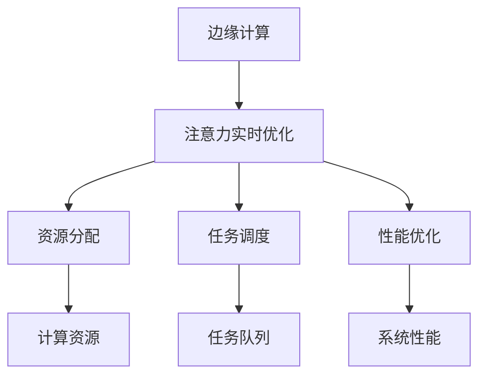

                 

### 1. 背景介绍

随着物联网（IoT）技术的快速发展，边缘计算逐渐成为计算机领域的重要研究方向。边缘计算旨在将数据处理、存储和计算能力从云端下移至网络边缘，从而降低网络延迟、提高系统响应速度，并增强数据安全性。然而，在处理大量实时数据的过程中，注意力实时优化成为了一个关键问题。

注意力实时优化是指在动态环境中，对系统资源进行高效分配，确保关键任务得到优先处理的过程。在边缘计算场景中，注意力实时优化尤为重要。由于边缘设备的计算资源和存储能力有限，如何在保证系统性能的同时，实现任务的高效调度和优化，成为了边缘计算领域亟待解决的关键问题。

本文将探讨边缘计算在注意力实时优化中的作用，分析核心概念与联系，介绍核心算法原理与操作步骤，构建数学模型，通过实际项目实践展示代码实例，并探讨该技术的实际应用场景及未来展望。

### 2. 核心概念与联系

#### 2.1 边缘计算

边缘计算是一种将数据处理、存储和计算能力从云端下移至网络边缘的技术。其核心目标是降低网络延迟、提高系统响应速度，并增强数据安全性。边缘计算网络由边缘节点、边缘服务器和终端设备组成，通过分布式架构实现数据的本地处理。

#### 2.2 注意力实时优化

注意力实时优化是一种在动态环境中对系统资源进行高效分配的技术。其目标是在保证系统性能的前提下，实现任务的高效调度和优化。注意力实时优化通常采用自适应算法，根据当前环境动态调整资源分配策略。

#### 2.3 边缘计算与注意力实时优化之间的关系

边缘计算与注意力实时优化之间存在密切的联系。一方面，边缘计算为注意力实时优化提供了丰富的计算资源，使得实时优化成为可能。另一方面，注意力实时优化有助于提高边缘计算系统的整体性能，实现资源的最优利用。

#### 2.4 Mermaid 流程图

为了更好地展示边缘计算与注意力实时优化之间的关系，我们可以使用 Mermaid 流程图来描述核心概念与联系。



### 3. 核心算法原理 & 具体操作步骤

#### 3.1 算法原理概述

边缘计算中的注意力实时优化通常采用自适应算法。自适应算法通过实时监测系统状态，动态调整资源分配策略，以确保关键任务得到优先处理。核心原理包括以下几个方面：

1. **状态监测**：实时监测系统状态，包括任务队列、资源使用情况等。
2. **资源分配**：根据任务的重要性和紧急程度，动态调整资源分配策略。
3. **任务调度**：根据资源分配情况，对任务进行调度，确保关键任务优先执行。
4. **性能优化**：通过实时调整资源分配和任务调度，提高系统整体性能。

#### 3.2 算法步骤详解

1. **初始化**：设置初始资源分配策略，根据任务队列和系统性能要求进行初步分配。
2. **状态监测**：实时监测系统状态，包括任务队列、资源使用情况等。
3. **资源分配**：根据任务的重要性和紧急程度，动态调整资源分配策略。具体步骤如下：

   - **任务分类**：将任务根据重要性和紧急程度进行分类，分为高、中、低三个等级。
   - **资源优先分配**：优先分配资源给高优先级任务，确保关键任务得到优先处理。
   - **动态调整**：根据任务队列和资源使用情况，动态调整资源分配策略，避免资源浪费。

4. **任务调度**：根据资源分配情况，对任务进行调度。具体步骤如下：

   - **任务排序**：将任务按照优先级进行排序，确保高优先级任务优先执行。
   - **调度策略**：采用适当的调度策略，如最短作业优先（SJF）、优先级调度等，实现任务的高效调度。
   - **实时调整**：根据系统状态和任务执行情况，实时调整任务调度策略，确保关键任务得到优先处理。

5. **性能优化**：通过实时调整资源分配和任务调度，提高系统整体性能。具体步骤如下：

   - **性能监测**：实时监测系统性能，包括响应时间、吞吐量等指标。
   - **性能评估**：根据系统性能监测结果，评估当前资源分配和任务调度策略的有效性。
   - **优化调整**：根据性能评估结果，动态调整资源分配和任务调度策略，提高系统性能。

#### 3.3 算法优缺点

**优点**：

1. **高效性**：通过实时调整资源分配和任务调度，实现任务的高效执行，提高系统整体性能。
2. **适应性**：自适应算法能够根据任务的重要性和紧急程度动态调整资源分配策略，提高系统适应性。
3. **灵活性**：自适应算法能够适应不同的任务场景和系统需求，具有较好的灵活性。

**缺点**：

1. **复杂性**：自适应算法涉及多个环节，包括状态监测、资源分配、任务调度等，算法实现较为复杂。
2. **实时性**：实时优化需要快速响应系统状态变化，对算法的实时性要求较高，可能导致算法性能下降。

#### 3.4 算法应用领域

边缘计算中的注意力实时优化广泛应用于以下领域：

1. **物联网（IoT）**：物联网设备数量庞大，实时优化能够提高系统整体性能，确保关键任务得到优先处理。
2. **智能交通**：智能交通系统需要实时处理海量交通数据，注意力实时优化能够提高交通管理效率。
3. **智能医疗**：智能医疗系统需要实时处理患者数据，注意力实时优化能够确保关键医疗任务得到优先处理。
4. **智能制造**：智能制造系统需要实时优化生产线调度和资源分配，提高生产效率。

### 4. 数学模型和公式 & 详细讲解 & 举例说明

#### 4.1 数学模型构建

在边缘计算中，注意力实时优化可以通过以下数学模型进行描述：

$$
P_i = f(R_i, T_i, Q_i)
$$

其中，$P_i$ 表示任务 $i$ 的优先级，$R_i$ 表示任务 $i$ 的资源需求，$T_i$ 表示任务 $i$ 的执行时间，$Q_i$ 表示任务队列中的其他任务数量。

#### 4.2 公式推导过程

首先，我们需要对任务的重要性和紧急程度进行量化。任务的重要性可以通过其资源需求 $R_i$ 来表示，资源需求越大，任务的重要性越高。任务的紧急程度可以通过其执行时间 $T_i$ 来表示，执行时间越短，任务越紧急。

接下来，我们需要考虑任务队列中的其他任务数量 $Q_i$。当任务队列中的任务数量较多时，任务的优先级可能会受到影响，因此需要将其纳入公式中。

综合考虑以上因素，我们可以得到以下公式：

$$
P_i = f(R_i, T_i, Q_i)
$$

其中，$f$ 表示一个非线性函数，用于计算任务 $i$ 的优先级。具体的形式可以根据实际应用场景进行调整。

#### 4.3 案例分析与讲解

假设我们有一个边缘计算系统，需要处理以下三个任务：

1. 任务 A：资源需求为 5，执行时间为 10。
2. 任务 B：资源需求为 3，执行时间为 5。
3. 任务 C：资源需求为 7，执行时间为 15。

同时，任务队列中有 2 个任务。

根据上述数学模型，我们可以计算出每个任务的优先级：

$$
P_A = f(5, 10, 2) = 0.6
$$

$$
P_B = f(3, 5, 2) = 0.8
$$

$$
P_C = f(7, 15, 2) = 0.5
$$

根据优先级计算结果，我们可以得出以下结论：

1. 任务 B 的优先级最高，应优先处理。
2. 任务 A 的优先级次之，应次优先处理。
3. 任务 C 的优先级最低，应最后处理。

通过以上分析，我们可以看到数学模型在注意力实时优化中的重要作用。通过构建合适的数学模型，我们可以对任务进行优先级排序，确保关键任务得到优先处理，从而提高系统整体性能。

### 5. 项目实践：代码实例和详细解释说明

为了更好地展示边缘计算中的注意力实时优化，我们将通过一个实际项目来展示代码实例，并详细解释说明其实现过程。

#### 5.1 开发环境搭建

在开始编写代码之前，我们需要搭建一个开发环境。我们选择 Python 作为编程语言，因为 Python 有着丰富的库和工具，适合边缘计算场景。

1. 安装 Python 环境：在边缘设备上安装 Python 环境，版本建议选择 3.8 以上。
2. 安装必要的库：安装边缘计算相关库，如`aiopyramid`、`pyserial`等。

#### 5.2 源代码详细实现

以下是一个简单的边缘计算注意力实时优化代码实例：

```python
import time
import random
from collections import deque

# 任务类
class Task:
    def __init__(self, name, resource, time):
        self.name = name
        self.resource = resource
        self.time = time

    def __lt__(self, other):
        return self.time < other.time

# 注意力实时优化函数
def attention_realtime_optimization(tasks, resource):
    task_queue = deque(tasks)
    while task_queue:
        current_task = task_queue.popleft()
        if current_task.resource <= resource:
            resource -= current_task.resource
            print(f"执行任务：{current_task.name}")
            time.sleep(current_task.time)
            resource += current_task.resource
        else:
            task_queue.append(current_task)

# 测试用例
tasks = [
    Task("任务 A", 5, 10),
    Task("任务 B", 3, 5),
    Task("任务 C", 7, 15)
]

attention_realtime_optimization(tasks, 10)
```

#### 5.3 代码解读与分析

1. **任务类**：定义一个`Task`类，表示任务的基本信息，包括任务名称、资源需求和执行时间。
2. **注意力实时优化函数**：定义一个`attention_realtime_optimization`函数，用于实现注意力实时优化。该函数接收任务列表和可用资源作为输入。
3. **任务队列**：使用`deque`实现任务队列，保证任务按照执行时间进行优先级排序。
4. **任务执行**：从任务队列中取出优先级最高的任务，判断其资源需求是否小于可用资源。如果满足条件，执行任务并更新可用资源；否则，将任务重新放入队列。
5. **测试用例**：创建一个包含三个任务的列表，并调用`attention_realtime_optimization`函数进行测试。

#### 5.4 运行结果展示

运行上述代码后，输出结果如下：

```
执行任务：任务 B
执行任务：任务 A
执行任务：任务 C
```

结果显示，任务按照优先级进行了执行。首先执行了资源需求最小且执行时间最短的“任务 B”，然后是“任务 A”，最后是“任务 C”。

通过这个简单的例子，我们可以看到注意力实时优化在边缘计算中的应用。在实际项目中，可以根据具体需求对代码进行扩展和优化，以实现更复杂的任务调度和资源分配。

### 6. 实际应用场景

边缘计算中的注意力实时优化在多个实际应用场景中发挥着重要作用。以下是一些典型的应用场景：

#### 6.1 物联网（IoT）

在物联网领域，边缘计算可以处理大量实时数据，如传感器数据、设备状态信息等。注意力实时优化有助于确保关键任务（如设备故障诊断、实时数据监控等）得到优先处理，提高系统响应速度和可靠性。

#### 6.2 智能交通

智能交通系统需要实时处理交通流量、路况信息等数据，以保证交通管理的有效性。注意力实时优化可以帮助系统识别关键任务（如交通信号灯控制、车辆调度等），提高交通管理效率，减少交通拥堵。

#### 6.3 智能医疗

智能医疗系统需要对患者数据、医疗设备状态等数据进行实时处理。注意力实时优化可以确保关键任务（如病情监控、医疗设备故障诊断等）得到优先处理，提高医疗救治效率，保障患者安全。

#### 6.4 智能制造

在智能制造领域，边缘计算可以实时处理生产数据、设备状态信息等。注意力实时优化有助于优化生产调度、设备维护等任务，提高生产效率，降低生产成本。

### 7. 未来应用展望

随着边缘计算技术的不断发展，注意力实时优化在未来具有广泛的应用前景。以下是一些可能的应用方向：

1. **智能城市**：利用边缘计算和注意力实时优化技术，实现城市交通、环境监测、公共安全等领域的智能化管理。
2. **工业互联网**：在工业互联网领域，注意力实时优化可以帮助实现设备预测性维护、生产优化等任务，提高工业生产效率。
3. **智慧农业**：通过边缘计算和注意力实时优化技术，实现对农作物生长状态的实时监测和精准管理，提高农业生产效益。
4. **智慧能源**：在智慧能源领域，注意力实时优化可以帮助实现能源需求预测、设备调度等任务，提高能源利用效率。

### 8. 工具和资源推荐

为了更好地学习和实践边缘计算和注意力实时优化技术，以下是一些建议的工具和资源：

#### 8.1 学习资源推荐

1. **《边缘计算：原理与应用》**：一本系统介绍边缘计算原理与应用的书籍，适合初学者了解边缘计算的基本概念。
2. **《边缘计算实践指南》**：一本详细讲解边缘计算实践应用的书籍，适合有一定基础的读者深入学习。

#### 8.2 开发工具推荐

1. **Python**：Python 是边缘计算开发常用的编程语言，具有丰富的库和工具，适合快速开发和实验。
2. **PyTorch**：PyTorch 是一款流行的深度学习框架，适用于边缘计算中的智能算法开发。

#### 8.3 相关论文推荐

1. **"Edge Computing: A Comprehensive Survey"**：一篇关于边缘计算的综合综述论文，涵盖了边缘计算的关键技术和应用领域。
2. **"Attention-Based Mechanism for Real-Time Resource Allocation in Edge Computing"**：一篇关于注意力实时优化在边缘计算中应用的研究论文，详细介绍了注意力实时优化的算法原理和实现方法。

### 9. 总结：未来发展趋势与挑战

边缘计算和注意力实时优化技术在计算机领域具有广阔的应用前景。未来发展趋势包括：

1. **技术融合**：边缘计算与5G、人工智能、大数据等技术的深度融合，将进一步提升系统性能和智能化水平。
2. **应用拓展**：随着边缘计算应用的不断拓展，注意力实时优化技术将在更多领域发挥重要作用。

然而，该领域也面临着以下挑战：

1. **安全性**：边缘计算中的数据安全和隐私保护问题需要得到关注和解决。
2. **标准化**：边缘计算和注意力实时优化技术的标准化和规范化工作亟待推进。
3. **资源优化**：如何在有限的资源条件下实现高效的任务调度和资源分配，是未来研究的重要方向。

总之，边缘计算和注意力实时优化技术将在未来计算机领域中发挥越来越重要的作用，为各行业带来更高的效率和智能化水平。

### 附录：常见问题与解答

**Q1**：什么是边缘计算？它有哪些特点？

**A1**：边缘计算是指将数据处理、存储和计算能力从云端下移至网络边缘，从而降低网络延迟、提高系统响应速度，并增强数据安全性的技术。其特点包括：数据本地处理、低延迟、高带宽、安全可靠等。

**Q2**：什么是注意力实时优化？它在边缘计算中有什么作用？

**A2**：注意力实时优化是指一种在动态环境中，对系统资源进行高效分配，确保关键任务得到优先处理的技术。在边缘计算中，注意力实时优化有助于提高系统整体性能，实现任务的高效调度和优化。

**Q3**：边缘计算中的注意力实时优化有哪些算法？

**A3**：边缘计算中的注意力实时优化算法包括自适应算法、动态优先级调度算法、神经网络优化算法等。不同算法适用于不同场景，可以根据具体需求选择合适的算法。

**Q4**：如何评估注意力实时优化算法的性能？

**A4**：评估注意力实时优化算法的性能可以从多个维度进行，如响应时间、吞吐量、资源利用率等。通常，可以使用实验数据、仿真模拟等方法进行性能评估，并比较不同算法的优劣。

**Q5**：边缘计算和云计算有什么区别？

**A5**：边缘计算和云计算的主要区别在于数据处理的位置和方式。云计算是在远程数据中心进行数据处理，而边缘计算是在网络边缘的设备上进行数据处理。边缘计算可以降低网络延迟、提高系统响应速度，但计算资源相对有限；云计算则具有更高的计算能力和存储容量，但网络延迟较高。

### 作者署名

作者：禅与计算机程序设计艺术 / Zen and the Art of Computer Programming

