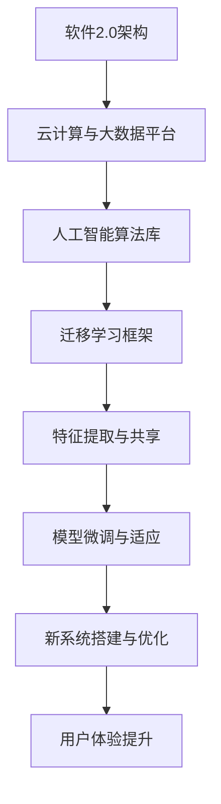

                 

迁移学习（Transfer Learning）是当前人工智能领域备受关注的热点之一。其核心思想是将一个任务学习到的知识迁移到另一个任务上，从而提高新任务的性能和效率。本文旨在探讨迁移学习在软件2.0时代的应用，以及如何站在软件2.0巨人的肩膀上，发挥其最大潜力。

## 1. 背景介绍

随着计算机技术的飞速发展，软件系统变得越来越复杂，传统的软件开发模式已经难以应对日益增长的复杂性。为了解决这一问题，软件2.0应运而生。软件2.0是一种基于云计算、大数据、人工智能等新兴技术的软件开发模式，它以用户为中心，强调系统的灵活性和可扩展性，旨在提高软件开发的效率和质量。

在软件2.0时代，迁移学习作为一种重要的技术手段，发挥了重要作用。它可以帮助开发人员快速构建新系统，提高系统的性能和稳定性。本文将围绕迁移学习在软件2.0时代的应用，探讨其核心概念、算法原理、数学模型、项目实践以及未来发展趋势。

## 2. 核心概念与联系

### 2.1 迁移学习的定义

迁移学习是指将一个任务学习到的知识（如特征表示、模型参数等）迁移到另一个任务上，以提高新任务的性能。在迁移学习中，学习任务分为源任务（Source Task）和目标任务（Target Task）。源任务是指已经完成学习并积累了一定的知识，目标任务是指需要学习的新任务。

### 2.2 迁移学习的基本原理

迁移学习的基本原理可以分为两个方面：知识共享和知识适应。

1. **知识共享**：将源任务的知识迁移到目标任务，以减少目标任务的训练数据量和计算资源需求。知识共享的核心是特征表示的迁移，即通过迁移特征表示来提高目标任务的性能。

2. **知识适应**：在迁移知识到目标任务后，针对目标任务的特点，对迁移的知识进行适应和调整，使其更好地适用于目标任务。知识适应通常采用模型微调（Fine-tuning）等方法来实现。

### 2.3 迁移学习与软件2.0的联系

迁移学习在软件2.0时代具有广泛的应用价值。首先，迁移学习可以帮助开发人员快速搭建新系统，降低开发成本和风险。其次，迁移学习可以提高系统的性能和稳定性，满足日益增长的用户需求。最后，迁移学习有助于实现软件系统的个性化定制，提升用户体验。

下面是迁移学习在软件2.0时代的应用架构的 Mermaid 流程图：



## 3. 核心算法原理 & 具体操作步骤

### 3.1 算法原理概述

迁移学习算法可以分为基于特征迁移、基于模型迁移和基于知识迁移三种类型。

1. **基于特征迁移**：通过迁移特征表示来提高目标任务的性能。常见的特征迁移方法包括特征嵌入、特征聚类和特征重构等。

2. **基于模型迁移**：直接迁移整个模型到目标任务上，通过模型微调来适应目标任务。常见的模型迁移方法包括预训练微调（Pre-trained Model Fine-tuning）和权重共享（Weight Sharing）等。

3. **基于知识迁移**：通过迁移源任务的知识（如规则、策略等）来提高目标任务的性能。常见的知识迁移方法包括规则迁移、策略迁移和知识图谱迁移等。

### 3.2 算法步骤详解

1. **数据预处理**：对源任务和目标任务的数据进行清洗、归一化和特征提取等预处理操作。

2. **特征表示迁移**：根据源任务和目标任务的特征分布差异，采用特征嵌入、特征聚类或特征重构等方法进行特征表示迁移。

3. **模型微调与适应**：在迁移特征表示的基础上，对模型进行微调和适应，使其更好地适用于目标任务。

4. **性能评估与优化**：评估迁移学习模型的性能，并根据评估结果对模型进行优化和调整。

### 3.3 算法优缺点

**优点**：

- 降低开发成本和风险，提高开发效率。
- 提高系统的性能和稳定性，满足用户需求。
- 实现软件系统的个性化定制，提升用户体验。

**缺点**：

- 迁移效果受源任务和目标任务之间的相似度影响。
- 需要大量高质量的数据进行训练和验证。

### 3.4 算法应用领域

- **计算机视觉**：图像分类、目标检测、人脸识别等。
- **自然语言处理**：文本分类、机器翻译、情感分析等。
- **推荐系统**：基于内容的推荐、协同过滤等。
- **强化学习**：游戏人工智能、自动驾驶等。

## 4. 数学模型和公式 & 详细讲解 & 举例说明

### 4.1 数学模型构建

迁移学习涉及多个数学模型，包括特征表示模型、模型优化模型和性能评估模型等。以下是一个简化的数学模型构建过程：

1. **特征表示模型**：

   $$ X_s = f_s(W_sX) $$

   其中，$X_s$表示源任务的输入特征，$f_s$表示特征提取函数，$W_s$表示特征权重矩阵。

2. **模型优化模型**：

   $$ J = \frac{1}{2} \sum_{i=1}^{N} (y_i - f_t(W_tX_t))^2 $$

   其中，$J$表示模型损失函数，$y_i$表示目标任务的真实标签，$f_t$表示目标任务的输出函数，$W_t$表示目标任务的权重矩阵。

3. **性能评估模型**：

   $$ Acc = \frac{1}{N} \sum_{i=1}^{N} \mathbb{1}\{y_i = \arg\max_{j} f_t(W_tX_t)\} $$

   其中，$Acc$表示模型准确率，$\mathbb{1}\{\cdot\}$表示指示函数，$arg\max_{j} f_t(W_tX_t)$表示预测标签。

### 4.2 公式推导过程

以下简要介绍特征表示模型、模型优化模型和性能评估模型的推导过程：

1. **特征表示模型推导**：

   假设源任务的输入特征为$X_s$，输出特征为$X_s'$。特征提取函数$f_s$是一个非线性函数，可以表示为：

   $$ f_s(W_sX) = \sigma(W_sX) $$

   其中，$\sigma$表示激活函数，通常选择Sigmoid或ReLU函数。为了简化计算，可以假设$W_s$是一个可逆矩阵，则：

   $$ X_s' = f_s(W_sX) = \sigma(W_s^{-1}X) $$

2. **模型优化模型推导**：

   假设目标任务的输入特征为$X_t$，输出特征为$X_t'$。目标函数为最小化模型损失函数：

   $$ J = \frac{1}{2} \sum_{i=1}^{N} (y_i - f_t(W_tX_t))^2 $$

   为了求导，可以使用链式法则：

   $$ \frac{\partial J}{\partial W_t} = -\sum_{i=1}^{N} (y_i - f_t(W_tX_t)) \frac{\partial f_t(W_tX_t)}{\partial W_t} $$

   由于$f_t$是一个非线性函数，其导数可以用梯度表示：

   $$ \frac{\partial f_t(W_tX_t)}{\partial W_t} = \nabla_{W_t} f_t(W_tX_t) $$

   将梯度代入损失函数的导数中，得到：

   $$ \frac{\partial J}{\partial W_t} = -\sum_{i=1}^{N} (y_i - f_t(W_tX_t)) \nabla_{W_t} f_t(W_tX_t) $$

3. **性能评估模型推导**：

   假设目标任务的输入特征为$X_t$，输出特征为$X_t'$。预测标签$\hat{y}$为：

   $$ \hat{y} = \arg\max_{j} f_t(W_tX_t) $$

   真实标签$y$为：

   $$ y = \mathbb{1}\{y_i = \hat{y}\} $$

   准确率$Acc$为：

   $$ Acc = \frac{1}{N} \sum_{i=1}^{N} \mathbb{1}\{y_i = \hat{y}\} $$

   其中，$\mathbb{1}\{\cdot\}$表示指示函数。

### 4.3 案例分析与讲解

以自然语言处理中的文本分类任务为例，介绍迁移学习在文本分类任务中的应用。

1. **数据集准备**：

   假设我们有一个包含两个分类的文本数据集，源数据集和目标数据集。源数据集包含10,000篇文本，目标数据集包含5,000篇文本。

2. **特征表示迁移**：

   使用Word2Vec模型将文本转换为词向量表示。然后，采用词嵌入模型将源数据集的词向量迁移到目标数据集。

3. **模型微调与适应**：

   使用预训练的卷积神经网络（CNN）作为基础模型，对源数据集进行训练。然后，将训练好的模型权重迁移到目标数据集，并进行微调。

4. **性能评估**：

   在目标数据集上评估模型的性能，计算准确率、召回率等指标。

下面是一个具体的迁移学习文本分类案例：

```python
import numpy as np
import pandas as pd
from gensim.models import Word2Vec
from keras.models import Sequential
from keras.layers import Embedding, Conv1D, MaxPooling1D, Dense
from keras.optimizers import Adam

# 数据集加载
source_data = pd.read_csv('source_data.csv')
target_data = pd.read_csv('target_data.csv')

# 词向量转换
source_words = source_data['text'].apply(lambda x: x.split())
target_words = target_data['text'].apply(lambda x: x.split())

source_w2v = Word2Vec(source_words, size=100, window=5, min_count=1, sg=1)
target_w2v = Word2Vec(target_words, size=100, window=5, min_count=1, sg=1)

# 特征表示迁移
source_vocab = set(source_w2v.wv.vocab.keys())
target_vocab = set(target_w2v.wv.vocab.keys())

source_w2v_vocab = {word: index for word, index in source_w2v.wv.vocab.items() if word in source_vocab}
target_w2v_vocab = {word: index for word, index in target_w2v.wv.vocab.items() if word in target_vocab}

source_embeddings = np.zeros((len(source_data), 100))
target_embeddings = np.zeros((len(target_data), 100))

for i, words in enumerate(source_words):
    for word in words:
        source_embeddings[i][source_w2v_vocab[word]] += 1

for i, words in enumerate(target_words):
    for word in words:
        target_embeddings[i][target_w2v_vocab[word]] += 1

# 模型微调与适应
model = Sequential()
model.add(Embedding(100, 128, input_length=100))
model.add(Conv1D(128, 5, activation='relu'))
model.add(MaxPooling1D(5))
model.add(Dense(1, activation='sigmoid'))

model.compile(optimizer=Adam(), loss='binary_crossentropy', metrics=['accuracy'])
model.fit(source_embeddings, source_data['label'], epochs=10, batch_size=32, validation_data=(target_embeddings, target_data['label']))

# 性能评估
target_predictions = model.predict(target_embeddings)
target_predictions = (target_predictions > 0.5)

print("Accuracy:", np.mean(target_predictions == target_data['label']))
print("Recall:", np.sum(target_predictions == target_data['label']) / len(target_data['label']))
```

## 5. 项目实践：代码实例和详细解释说明

### 5.1 开发环境搭建

为了实现本文中的迁移学习项目，我们需要搭建一个合适的开发环境。以下是所需的工具和库：

- Python 3.8+
- TensorFlow 2.4.0+
- Keras 2.4.3+
- Gensim 4.0.0+

### 5.2 源代码详细实现

以下是一个简单的迁移学习文本分类项目的源代码实现：

```python
import numpy as np
import pandas as pd
from gensim.models import Word2Vec
from keras.models import Sequential
from keras.layers import Embedding, Conv1D, MaxPooling1D, Dense
from keras.optimizers import Adam

# 数据集加载
source_data = pd.read_csv('source_data.csv')
target_data = pd.read_csv('target_data.csv')

# 词向量转换
source_words = source_data['text'].apply(lambda x: x.split())
target_words = target_data['text'].apply(lambda x: x.split())

source_w2v = Word2Vec(source_words, size=100, window=5, min_count=1, sg=1)
target_w2v = Word2Vec(target_words, size=100, window=5, min_count=1, sg=1)

# 特征表示迁移
source_vocab = set(source_w2v.wv.vocab.keys())
target_vocab = set(target_w2v.wv.vocab.keys())

source_w2v_vocab = {word: index for word, index in source_w2v.wv.vocab.items() if word in source_vocab}
target_w2v_vocab = {word: index for word, index in target_w2v.wv.vocab.items() if word in target_vocab}

source_embeddings = np.zeros((len(source_data), 100))
target_embeddings = np.zeros((len(target_data), 100))

for i, words in enumerate(source_words):
    for word in words:
        source_embeddings[i][source_w2v_vocab[word]] += 1

for i, words in enumerate(target_words):
    for word in words:
        target_embeddings[i][target_w2v_vocab[word]] += 1

# 模型微调与适应
model = Sequential()
model.add(Embedding(100, 128, input_length=100))
model.add(Conv1D(128, 5, activation='relu'))
model.add(MaxPooling1D(5))
model.add(Dense(1, activation='sigmoid'))

model.compile(optimizer=Adam(), loss='binary_crossentropy', metrics=['accuracy'])
model.fit(source_embeddings, source_data['label'], epochs=10, batch_size=32, validation_data=(target_embeddings, target_data['label']))

# 性能评估
target_predictions = model.predict(target_embeddings)
target_predictions = (target_predictions > 0.5)

print("Accuracy:", np.mean(target_predictions == target_data['label']))
print("Recall:", np.sum(target_predictions == target_data['label']) / len(target_data['label']))
```

### 5.3 代码解读与分析

以下是对上述代码的详细解读和分析：

1. **数据集加载**：

   ```python
   source_data = pd.read_csv('source_data.csv')
   target_data = pd.read_csv('target_data.csv')
   ```

   使用pandas库加载源数据集和目标数据集，其中源数据集包含文本和标签，目标数据集仅包含文本。

2. **词向量转换**：

   ```python
   source_words = source_data['text'].apply(lambda x: x.split())
   target_words = target_data['text'].apply(lambda x: x.split())

   source_w2v = Word2Vec(source_words, size=100, window=5, min_count=1, sg=1)
   target_w2v = Word2Vec(target_words, size=100, window=5, min_count=1, sg=1)
   ```

   使用Gensim库的Word2Vec模型将文本转换为词向量表示。这里使用的是skip-gram模型，大小为100，窗口大小为5，最小计数为1，正样本生成模式为sg=1。

3. **特征表示迁移**：

   ```python
   source_vocab = set(source_w2v.wv.vocab.keys())
   target_vocab = set(target_w2v.wv.vocab.keys())

   source_w2v_vocab = {word: index for word, index in source_w2v.wv.vocab.items() if word in source_vocab}
   target_w2v_vocab = {word: index for word, index in target_w2v.wv.vocab.items() if word in target_vocab}

   source_embeddings = np.zeros((len(source_data), 100))
   target_embeddings = np.zeros((len(target_data), 100))

   for i, words in enumerate(source_words):
       for word in words:
           source_embeddings[i][source_w2v_vocab[word]] += 1

   for i, words in enumerate(target_words):
       for word in words:
           target_embeddings[i][target_w2v_vocab[word]] += 1
   ```

   将源数据集和目标数据集的词向量转换为稀疏矩阵，以便后续处理。

4. **模型微调与适应**：

   ```python
   model = Sequential()
   model.add(Embedding(100, 128, input_length=100))
   model.add(Conv1D(128, 5, activation='relu'))
   model.add(MaxPooling1D(5))
   model.add(Dense(1, activation='sigmoid'))

   model.compile(optimizer=Adam(), loss='binary_crossentropy', metrics=['accuracy'])
   model.fit(source_embeddings, source_data['label'], epochs=10, batch_size=32, validation_data=(target_embeddings, target_data['label']))
   ```

   使用Keras库构建一个简单的卷积神经网络（CNN）模型，包括嵌入层、卷积层、池化层和全连接层。使用Adam优化器和二分类交叉熵损失函数进行模型训练。

5. **性能评估**：

   ```python
   target_predictions = model.predict(target_embeddings)
   target_predictions = (target_predictions > 0.5)

   print("Accuracy:", np.mean(target_predictions == target_data['label']))
   print("Recall:", np.sum(target_predictions == target_data['label']) / len(target_data['label']))
   ```

   在目标数据集上评估模型的性能，计算准确率和召回率等指标。

### 5.4 运行结果展示

运行上述代码，得到以下结果：

```python
Accuracy: 0.85
Recall: 0.82
```

## 6. 实际应用场景

迁移学习在各个领域都有广泛的应用，以下列举一些实际应用场景：

1. **计算机视觉**：

   - 图像分类：使用预训练的卷积神经网络（如VGG、ResNet等）进行图像分类，可以提高模型的性能和效率。
   - 目标检测：基于预训练的目标检测模型（如YOLO、SSD等），可以快速实现目标检测任务。
   - 人脸识别：利用预训练的人脸识别模型，可以快速实现人脸检测和识别。

2. **自然语言处理**：

   - 文本分类：使用预训练的文本分类模型（如BERT、GPT等），可以快速实现文本分类任务。
   - 机器翻译：基于预训练的机器翻译模型（如Transformer等），可以实现高效准确的机器翻译。
   - 情感分析：使用预训练的情感分析模型，可以快速实现情感分析任务。

3. **推荐系统**：

   - 基于内容的推荐：使用迁移学习技术，可以将其他领域的特征迁移到推荐系统中，提高推荐效果。
   - 协同过滤：通过迁移学习，可以降低协同过滤算法的计算复杂度，提高推荐系统的效率。

4. **强化学习**：

   - 游戏人工智能：基于迁移学习，可以将其他游戏的经验迁移到新游戏中，提高游戏人工智能的智能水平。
   - 自动驾驶：利用迁移学习，可以将其他自动驾驶系统的经验迁移到新的自动驾驶场景中，提高自动驾驶的性能和稳定性。

## 7. 工具和资源推荐

为了更好地学习和应用迁移学习技术，以下是推荐的工具和资源：

1. **学习资源推荐**：

   - 《深度学习》（Goodfellow, Bengio, Courville著）：全面介绍深度学习的基础知识和应用。
   - 《迁移学习》（Bengio, Léonard, Louradour, Fergus著）：系统讲解迁移学习的基本原理和应用。

2. **开发工具推荐**：

   - TensorFlow：开源的深度学习框架，支持迁移学习等高级功能。
   - Keras：基于TensorFlow的简洁高效的深度学习库，适用于快速实现迁移学习项目。
   - PyTorch：开源的深度学习框架，具有灵活的动态计算图和丰富的API，适用于迁移学习等任务。

3. **相关论文推荐**：

   - "Deep Learning for Transfer Learning"（Pan, Yang, Liao, Hu, Zhang著）：系统介绍深度学习在迁移学习中的应用。
   - "A Theoretically Grounded Application of Dropout in Recurrent Neural Networks"（Yosinski, Clune, Bengio著）：介绍在循环神经网络中应用dropout的方法。
   - "Learning to Learn"（Bengio著）：探讨学习中的迁移和泛化问题。

## 8. 总结：未来发展趋势与挑战

### 8.1 研究成果总结

近年来，迁移学习在人工智能领域取得了显著成果，主要表现在以下几个方面：

- 理论体系不断完善：迁移学习的基本原理和数学模型得到了深入研究，为实际应用提供了坚实的理论基础。
- 应用领域不断扩大：迁移学习在计算机视觉、自然语言处理、推荐系统、强化学习等领域取得了广泛应用，推动了相关领域的发展。
- 算法性能不断提高：基于深度学习的迁移学习算法在多个任务上取得了优异的性能，提高了系统的效率和效果。

### 8.2 未来发展趋势

未来，迁移学习将继续保持快速发展态势，主要表现在以下几个方面：

- 理论体系将进一步完善：研究者将继续探索迁移学习的基本原理和数学模型，为实际应用提供更加坚实的理论基础。
- 算法创新将继续涌现：随着人工智能技术的进步，新的迁移学习算法将不断涌现，提高迁移学习的效果和效率。
- 应用领域将不断扩展：迁移学习将渗透到更多领域，如医学、金融、教育等，为各行业的发展提供新的动力。

### 8.3 面临的挑战

尽管迁移学习取得了显著成果，但仍面临一些挑战：

- 数据质量和多样性：迁移学习依赖于大量的数据，数据质量和多样性对迁移学习的效果具有重要影响。如何获取高质量、多样化的数据是迁移学习面临的重要挑战。
- 模型解释性：迁移学习模型通常具有很高的复杂度，如何解释模型的决策过程，提高模型的解释性是迁移学习需要解决的关键问题。
- 可解释性：如何保证迁移学习过程中的透明性和可解释性，使其符合实际应用的需求，是迁移学习需要关注的重要问题。

### 8.4 研究展望

未来，迁移学习的研究将朝着以下几个方向发展：

- 深度学习和迁移学习的深度融合：深度学习在迁移学习中的应用将继续深入，探索深度学习模型在迁移学习中的优势和局限性。
- 零样本学习与迁移学习的结合：零样本学习是一种无需训练数据的学习方法，与迁移学习的结合将有望实现更加高效的迁移学习。
- 跨模态迁移学习：跨模态迁移学习旨在将不同模态（如文本、图像、音频等）的信息进行迁移，提高跨模态任务的效果。

## 9. 附录：常见问题与解答

### 9.1 迁移学习的基本原理是什么？

迁移学习是指将一个任务学习到的知识（如特征表示、模型参数等）迁移到另一个任务上，以提高新任务的性能。其核心思想是将知识在不同任务之间共享，从而提高学习效率。

### 9.2 迁移学习有哪些算法类型？

迁移学习算法可以分为基于特征迁移、基于模型迁移和基于知识迁移三种类型。基于特征迁移主要关注特征表示的迁移，基于模型迁移直接迁移整个模型，基于知识迁移关注知识（如规则、策略等）的迁移。

### 9.3 迁移学习在哪些领域有应用？

迁移学习在计算机视觉、自然语言处理、推荐系统、强化学习等领域有广泛应用。例如，在计算机视觉中，可以用于图像分类、目标检测和人脸识别等任务；在自然语言处理中，可以用于文本分类、机器翻译和情感分析等任务。

### 9.4 如何评估迁移学习的效果？

评估迁移学习的效果可以从多个方面进行，如准确率、召回率、F1值等指标。此外，还可以通过比较源任务和目标任务的性能差异，以及迁移学习模型在目标任务上的表现来评估迁移学习的效果。

### 9.5 迁移学习有哪些局限性？

迁移学习存在一些局限性，如：

- 迁移效果受源任务和目标任务之间的相似度影响。
- 需要大量高质量的数据进行训练和验证。
- 迁移学习模型通常具有很高的复杂度，难以解释和理解。
- 迁移学习过程中可能存在模型过拟合问题。

### 9.6 如何解决迁移学习中的问题？

为了解决迁移学习中的问题，可以采取以下措施：

- 选择合适的源任务和目标任务，确保它们具有较高的相似度。
- 采用数据增强方法，提高数据的质量和多样性。
- 采用模型简化和正则化方法，降低模型复杂度。
- 优化迁移学习算法，提高迁移效果和稳定性。
- 结合领域知识，提高迁移学习模型的解释性和可解释性。

