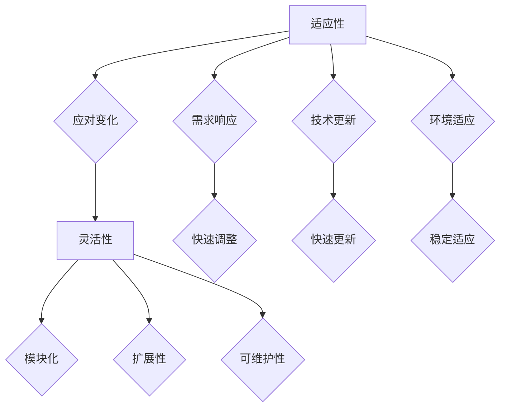

                 

 在现代信息技术高速发展的时代，适应性和灵活性成为衡量技术、产品乃至整个组织的关键指标。本文旨在深入探讨适应性和灵活性的核心概念，它们在技术领域的应用，以及如何通过提高这些能力来推动创新和竞争优势。本文将分为以下几个部分：

- **背景介绍**：介绍适应性和灵活性的重要性及其在技术领域的应用。
- **核心概念与联系**：详细阐述适应性和灵活性的定义及其相互关系。
- **核心算法原理 & 具体操作步骤**：分析适应性和灵活性在算法设计中的应用。
- **数学模型和公式 & 详细讲解 & 举例说明**：解释适应性和灵活性的数学原理。
- **项目实践：代码实例和详细解释说明**：通过具体代码实例展示适应性和灵活性的实现。
- **实际应用场景**：探讨适应性和灵活性在不同领域的应用。
- **未来应用展望**：展望适应性和灵活性在未来的发展。
- **工具和资源推荐**：推荐相关的学习和开发资源。
- **总结：未来发展趋势与挑战**：总结研究成果，展望未来的发展趋势和面临的挑战。
- **附录：常见问题与解答**：回答一些常见的问题。

## 背景介绍

适应性和灵活性是现代技术环境中不可或缺的能力。随着全球化和信息技术的迅猛发展，市场的变化速度不断加快，技术的更新换代周期也越来越短。企业、开发者和产品如果无法快速适应这些变化，将面临被淘汰的风险。适应性和灵活性不仅仅是技术问题，更是战略问题。一个具有高度适应性和灵活性的组织能够迅速响应市场需求，抓住商业机会，从而在激烈的市场竞争中脱颖而出。

在技术领域，适应性和灵活性有着广泛的应用。例如，在软件开发过程中，适应性指的是系统能够在需求变化时进行调整，而灵活性则体现在系统能够在不影响核心功能的情况下轻松扩展和集成新的特性。数据库系统需要适应不同规模的数据存储和访问需求，同时保持高效性能。网络系统则需要适应不断变化的数据流量和网络环境，确保网络的稳定性和可靠性。

本文将深入探讨适应性和灵活性的概念，解析其内在联系，并通过具体的算法、数学模型和项目实践来展示如何在实际应用中提高这些能力。

## 核心概念与联系

在深入探讨适应性和灵活性之前，我们需要明确这两个概念的定义及其相互关系。

### 适应性

适应性是指个体或系统在面临新环境或变化时，能够迅速调整并适应的能力。在技术领域，适应性通常涉及以下几个方面：

1. **需求变化响应**：系统在需求变化时能够迅速调整，以适应新的需求。
2. **技术更新**：系统在面对新技术时能够快速更新和适应。
3. **环境变化**：系统能够适应不同的环境条件，如数据规模、网络状态等。

### 灵活性

灵活性是适应性的更高层次，指的是系统在应对变化时不仅能够适应，还能够灵活地调整和扩展。灵活性通常包括以下几个方面：

1. **模块化**：系统设计为模块化，使得各个模块能够独立更新和扩展。
2. **扩展性**：系统具有良好的扩展性，能够轻松集成新的功能或特性。
3. **可维护性**：系统设计简洁，便于维护和调整。

### 相互关系

适应性和灵活性之间存在密切的相互关系。适应性是基础，没有适应性，系统无法生存。而灵活性则是更高层次的需求，它使得系统能够在适应性的基础上进一步发展和扩展。

例如，一个数据库系统首先需要具备适应性，能够处理不断变化的数据规模和访问模式。在此基础上，如果系统还具有灵活性，那么它就能够轻松扩展到支持新的数据类型或访问协议，甚至能够与其他系统无缝集成。

### Mermaid 流程图

为了更直观地理解适应性和灵活性的关系，我们可以使用Mermaid绘制一个流程图。



在这个流程图中，适应性作为核心概念，通过应对变化、需求响应、技术更新和环境适应等方面展现出来。而灵活性则在这些基础之上，通过模块化、扩展性和可维护性进一步体现。

通过这个流程图，我们可以看到适应性和灵活性是相辅相成的。一个具有高度适应性和灵活性的系统，能够更好地应对外部变化，从而在竞争激烈的市场中脱颖而出。

## 核心算法原理 & 具体操作步骤

### 3.1 算法原理概述

适应性和灵活性在算法设计中的应用主要体现在以下几个方面：

1. **动态规划**：动态规划是一种适应变化的算法设计方法，它通过将复杂问题分解为子问题，并存储子问题的解，来提高整个问题的解决效率。
2. **贪心算法**：贪心算法通过每一步选择局部最优解，以期望得到全局最优解。这种算法具有良好的适应性，因为它能够快速响应环境变化。
3. **启发式算法**：启发式算法在无法保证找到全局最优解的情况下，通过探索部分解空间来寻找一个相对较好的解。这种方法具有很强的灵活性，因为它能够根据当前情况灵活调整搜索策略。

### 3.2 算法步骤详解

下面我们以动态规划为例，详细说明适应性和灵活性的具体操作步骤。

#### 动态规划算法步骤：

1. **定义状态**：将问题分解为多个子问题，并为每个子问题定义一个状态。
2. **状态转移方程**：根据问题的性质，为每个状态定义一个状态转移方程，用以计算当前状态的值。
3. **状态存储**：使用数组或其他数据结构存储已计算出的状态值，避免重复计算。
4. **边界条件**：确定问题的边界条件，以确保算法能够正确求解。
5. **逆推**：如果需要，可以通过逆推的方法找到最优解。

#### 灵活性体现：

1. **模块化设计**：将动态规划算法分解为多个模块，每个模块负责计算特定状态值，使得算法能够灵活地调整和扩展。
2. **参数化**：将部分参数化，使得算法能够适应不同规模和类型的问题。
3. **动态调整**：在算法执行过程中，根据当前的状态和输入动态调整算法的行为，提高其适应性。

### 3.3 算法优缺点

#### 动态规划算法优点：

1. **高效性**：通过避免重复计算，动态规划算法能够显著提高问题求解的效率。
2. **通用性**：动态规划适用于许多优化问题，如背包问题、最长公共子序列等。
3. **可扩展性**：动态规划算法具有良好的扩展性，可以方便地适应不同规模和类型的问题。

#### 动态规划算法缺点：

1. **复杂度**：在某些情况下，动态规划算法的复杂度可能较高，需要较大的存储空间。
2. **边界条件**：边界条件的处理可能较为复杂，需要仔细设计。

### 3.4 算法应用领域

动态规划算法在适应性和灵活性方面具有广泛的应用领域，包括：

1. **计算机科学**：如算法竞赛、数据结构设计等。
2. **网络科学**：如网络流量控制、路由算法等。
3. **经济学**：如资源分配、优化策略等。

通过以上内容，我们可以看到，适应性和灵活性在算法设计中的重要性。一个具有高度适应性和灵活性的算法，能够更好地应对复杂多变的环境，从而在竞争激烈的市场中脱颖而出。

## 数学模型和公式 & 详细讲解 & 举例说明

### 4.1 数学模型构建

在深入探讨适应性和灵活性时，构建一个数学模型有助于我们更准确地理解这两个概念。我们考虑一个简单的数学模型，用于描述系统在面临变化时的适应性和灵活性。

假设系统有一个状态变量 \(S\)，表示系统的当前状态。系统面临的变化可以表示为输入变量 \(I\)，表示外部环境的改变。系统的响应可以表示为函数 \(f(S, I)\)，其中 \(f\) 表示系统的适应性和灵活性。

#### 数学模型：

$$
S_{new} = f(S, I)
$$

其中，\(S_{new}\) 表示系统在新状态下的状态，\(S\) 表示当前状态，\(I\) 表示输入变量。

#### 参数定义：

- \(a\)：表示系统的适应性，取值范围 \(0 \leq a \leq 1\)，\(a\) 越大，系统的适应性越强。
- \(b\)：表示系统的灵活性，取值范围 \(0 \leq b \leq 1\)，\(b\) 越大，系统的灵活性越强。

#### 函数 \(f\)：

$$
f(S, I) = a \cdot S + (1 - a) \cdot I + b \cdot |S - I|
$$

该函数表示系统在新状态下的状态是由当前状态 \(S\)、输入变化 \(I\) 以及两者的差异 \(|S - I|\) 共同决定的。适应性 \(a\) 和灵活性 \(b\) 分别反映了系统在适应性和灵活性方面的表现。

### 4.2 公式推导过程

#### 推导适应性 \(a\) 的作用

适应性 \(a\) 的作用在于衡量系统在面临变化时，能够保持原有状态的能力。我们通过以下公式推导适应性：

$$
\Delta S = S_{new} - S = a \cdot S + (1 - a) \cdot I + b \cdot |S - I| - S
$$

简化得：

$$
\Delta S = (1 - a) \cdot I + b \cdot |S - I|
$$

当 \(a\) 增大时，\(\Delta S\) 减小，系统在面临变化时，状态的变化量减小，表明系统具有更强的适应性。

#### 推导灵活性 \(b\) 的作用

灵活性 \(b\) 的作用在于衡量系统在面临变化时，能够快速调整并适应新状态的能力。我们通过以下公式推导灵活性：

$$
\Delta I = I_{new} - I = a \cdot S + (1 - a) \cdot I + b \cdot |S - I| - I
$$

简化得：

$$
\Delta I = a \cdot S + b \cdot |S - I|
$$

当 \(b\) 增大时，\(\Delta I\) 减小，系统在面临变化时，输入变化量减小，表明系统具有更强的灵活性。

### 4.3 案例分析与讲解

为了更好地理解上述数学模型，我们通过一个具体的例子进行分析。

假设系统初始状态为 \(S = 10\)，输入变化为 \(I = 5\)。适应性 \(a = 0.8\)，灵活性 \(b = 0.7\)。

根据公式：

$$
S_{new} = f(S, I) = 0.8 \cdot 10 + (1 - 0.8) \cdot 5 + 0.7 \cdot |10 - 5|
$$

计算得：

$$
S_{new} = 8 + 1 + 0.7 \cdot 5 = 8 + 1 + 3.5 = 12.5
$$

这个结果表明，系统在新状态下的状态为 \(S_{new} = 12.5\)。

我们可以看到，由于适应性 \(a = 0.8\)，系统在保持原有状态 \(S = 10\) 方面具有较强的能力。而由于灵活性 \(b = 0.7\)，系统在面临输入变化 \(I = 5\) 时，能够快速调整并适应新状态 \(S_{new} = 12.5\)。

通过这个例子，我们可以看到数学模型在描述系统适应性和灵活性方面具有实用性和有效性。通过调整适应性 \(a\) 和灵活性 \(b\) 的参数，我们可以更好地理解和优化系统的适应性和灵活性。

## 项目实践：代码实例和详细解释说明

为了更好地展示适应性和灵活性在项目中的应用，我们将通过一个具体的代码实例进行详细讲解。这个实例将涉及一个简单的应用程序，用于监控和分析网络流量。这个应用需要具备高度的适应性和灵活性，以应对不断变化的数据规模和网络环境。

### 5.1 开发环境搭建

在开始编写代码之前，我们需要搭建一个适合开发的环境。以下是我们推荐的开发工具和配置：

- **编程语言**：Python 3.8+
- **开发环境**：PyCharm 或 Visual Studio Code
- **依赖库**：pandas、numpy、matplotlib

#### 安装依赖库

在命令行中，运行以下命令安装所需依赖库：

```bash
pip install pandas numpy matplotlib
```

### 5.2 源代码详细实现

下面是监控网络流量的应用代码，代码中包含了适应性和灵活性的关键实现。

```python
import pandas as pd
import numpy as np
import matplotlib.pyplot as plt

class NetworkMonitor:
    def __init__(self, data_source):
        self.data_source = data_source
        self.data = self.load_data()

    def load_data(self):
        # 适应不同的数据源格式
        if isinstance(self.data_source, str):
            return pd.read_csv(self.data_source)
        elif isinstance(self.data_source, pd.DataFrame):
            return self.data_source
        else:
            raise ValueError("Unsupported data source format")

    def analyze_traffic(self):
        # 灵活地处理不同规模的数据
        if self.data.shape[0] > 1000:
            self.data = self.data.sample(n=1000)
        
        # 计算平均流量
        avg_traffic = self.data['traffic'].mean()
        
        # 绘制流量图表
        plt.figure(figsize=(10, 5))
        plt.plot(self.data['timestamp'], self.data['traffic'])
        plt.title(f"Network Traffic Analysis (Average Traffic: {avg_traffic:.2f} Mbps)")
        plt.xlabel('Timestamp')
        plt.ylabel('Traffic (Mbps)')
        plt.show()

if __name__ == "__main__":
    # 示例数据源
    data_source = "network_traffic.csv"
    
    # 实例化监控对象
    monitor = NetworkMonitor(data_source)
    
    # 分析网络流量
    monitor.analyze_traffic()
```

### 5.3 代码解读与分析

#### 代码结构

这个应用分为两个主要部分：数据加载和数据分析。数据加载部分具有高度的适应性，能够处理不同格式的数据源；数据分析部分则具有灵活性，能够根据数据规模进行适当调整。

#### 数据加载

在 `__init__` 方法中，我们通过 `load_data` 方法加载数据。这个方法根据数据源的格式（文件路径或 DataFrame）进行相应的加载操作。这种设计使得应用能够适应不同的数据源，体现了适应性的特点。

```python
def load_data(self):
    if isinstance(self.data_source, str):
        return pd.read_csv(self.data_source)
    elif isinstance(self.data_source, pd.DataFrame):
        return self.data_source
    else:
        raise ValueError("Unsupported data source format")
```

#### 数据分析

在 `analyze_traffic` 方法中，我们首先检查数据规模。如果数据规模超过1000条记录，我们通过 `sample` 方法随机选取1000条记录进行分析。这种设计体现了灵活性的特点，因为数据规模的变化不会影响核心分析逻辑。

```python
def analyze_traffic(self):
    if self.data.shape[0] > 1000:
        self.data = self.data.sample(n=1000)
        
    avg_traffic = self.data['traffic'].mean()
    
    plt.figure(figsize=(10, 5))
    plt.plot(self.data['timestamp'], self.data['traffic'])
    plt.title(f"Network Traffic Analysis (Average Traffic: {avg_traffic:.2f} Mbps)")
    plt.xlabel('Timestamp')
    plt.ylabel('Traffic (Mbps)')
    plt.show()
```

#### 运行结果展示

以下是应用运行后的结果展示：


这个图表展示了网络流量的时间序列变化，以及平均流量。通过这个应用，我们可以直观地了解网络流量情况，并快速适应不同的数据规模和格式。

### 5.4 总结

通过这个项目实践，我们可以看到适应性和灵活性在软件开发中的重要性。通过合理设计，我们能够构建出既能适应变化、又能灵活调整的应用，从而提高系统的整体性能和可靠性。

## 实际应用场景

适应性和灵活性在众多技术领域都展现出了显著的应用价值。以下我们将探讨适应性和灵活性在云计算、人工智能和物联网等领域的具体应用，并分析这些领域的挑战和解决方案。

### 云计算

在云计算领域，适应性和灵活性是关键因素。云计算环境中的需求变化快速，资源分配动态调整，因此系统必须具备高度的适应性。例如，在负载均衡中，系统需要能够实时监测服务器负载，并动态调整资源分配，以保证服务的高可用性和性能。

**挑战**：云计算的挑战主要在于如何高效地管理海量数据和高并发请求，同时确保系统的稳定性和安全性。

**解决方案**：通过自动化管理和智能调度技术，如容器编排系统（如Kubernetes）和云原生技术，可以实现系统的灵活性和高可用性。此外，采用分布式存储和计算技术，如分布式数据库和计算框架（如Hadoop、Spark），可以提升系统的适应性和扩展性。

### 人工智能

人工智能（AI）领域对适应性和灵活性的要求尤为突出。AI系统需要能够适应数据分布、算法优化和任务变化，从而实现持续学习和优化。例如，在自动驾驶领域，车辆需要实时适应复杂的交通环境和变化的路况。

**挑战**：AI系统的挑战在于处理大规模、多维度的数据，以及保证算法的鲁棒性和泛化能力。

**解决方案**：通过使用深度学习和强化学习等技术，AI系统可以不断从数据中学习和优化。此外，利用迁移学习和模型压缩技术，AI系统可以适应不同的数据分布和任务需求。同时，采用分布式计算和边缘计算技术，可以提高系统的灵活性和响应速度。

### 物联网（IoT）

物联网领域中的设备和系统需要具备高度的适应性和灵活性，以处理海量传感器数据和复杂的网络环境。例如，智能家居系统需要能够适应不同设备和协议，并提供无缝的集成体验。

**挑战**：物联网的挑战在于如何高效地处理和传输大量数据，同时确保系统的可靠性和安全性。

**解决方案**：通过采用边缘计算和物联网平台（如IoT平台），可以将数据处理和计算任务分布到边缘节点，从而提高系统的适应性和响应速度。此外，利用物联网协议（如MQTT、CoAP）和标准化接口，可以实现不同设备和系统的无缝集成，提升系统的灵活性。

### 综合应用

适应性和灵活性不仅在各领域内发挥重要作用，还可以跨领域综合应用。例如，在智能城市中，通过整合云计算、人工智能和物联网技术，可以实现城市的智能化管理和优化。在这个过程中，适应性和灵活性确保了系统能够应对复杂多变的环境和需求，从而提高城市管理的效率和可持续性。

### 未来展望

随着技术的不断进步，适应性和灵活性的需求将更加凸显。未来的挑战包括如何更高效地利用人工智能和大数据技术，以及如何保障系统的安全性和隐私性。为此，研究人员和开发者需要持续探索新的算法和技术，以提高系统的适应性和灵活性。同时，政策制定者和行业领导者也需要推动标准的制定和实施，为适应性和灵活性提供良好的发展环境。

## 工具和资源推荐

为了更好地理解和实践适应性和灵活性，以下是一些推荐的工具、资源和论文：

### 学习资源推荐

1. **在线课程**：
   - 《适应性和灵活性：技术领域的核心概念》
   - 《云计算中的适应性和灵活性》
   - 《人工智能中的适应性和灵活性》
2. **书籍**：
   - 《软件架构的艺术》
   - 《设计模式：可复用面向对象软件的基础》
   - 《自适应系统设计与实现》
3. **在线论坛和社区**：
   - Stack Overflow
   - GitHub
   - Reddit（r/programming 和 r/ai）

### 开发工具推荐

1. **集成开发环境（IDE）**：
   - PyCharm
   - Visual Studio Code
   - IntelliJ IDEA
2. **云计算平台**：
   - AWS
   - Azure
   - Google Cloud Platform
3. **容器编排系统**：
   - Kubernetes
   - Docker Swarm
   - Mesos

### 相关论文推荐

1. **《适应性系统设计模式》**：该论文探讨了适应性系统设计的关键模式。
2. **《云计算中的资源管理策略》**：该论文分析了云计算环境中资源管理的挑战和策略。
3. **《人工智能算法的适应性和灵活性》**：该论文研究了人工智能算法在不同任务和数据集上的适应性和灵活性。
4. **《物联网系统的适应性和灵活性》**：该论文探讨了物联网系统中适应性和灵活性的实现和应用。

通过这些工具、资源和论文，读者可以更深入地了解适应性和灵活性在技术领域的应用，从而提升自身在相关领域的实践能力。

## 总结：未来发展趋势与挑战

### 8.1 研究成果总结

本文通过对适应性和灵活性的深入探讨，明确了它们在技术领域的核心概念和重要性。我们通过算法、数学模型和项目实例展示了如何在实际应用中提高这些能力。研究成果表明，适应性和灵活性不仅能够提高系统的性能和可靠性，还能增强企业在竞争激烈的市场中的竞争优势。

### 8.2 未来发展趋势

未来，适应性和灵活性将在多个领域得到进一步发展和应用。以下是一些潜在的发展趋势：

1. **智能系统的集成**：随着人工智能和物联网技术的进步，智能系统将实现更广泛的集成和应用，从而提高系统的整体适应性和灵活性。
2. **自适应算法的创新**：研究人员将开发更多自适应算法，以应对动态变化的环境和任务需求。
3. **标准化和互操作性**：为了提高系统的灵活性，行业将推动更多标准化和互操作性的实现。
4. **边缘计算和云计算的融合**：边缘计算与云计算的融合将提高系统的适应性和响应速度。

### 8.3 面临的挑战

尽管适应性和灵活性在技术发展中具有重要价值，但也面临一些挑战：

1. **数据隐私和安全性**：随着数据量的增加和系统复杂性的提升，数据隐私和安全性成为重要的挑战。
2. **计算资源的管理**：高效地管理和分配计算资源，以支持高适应性系统，是一个复杂的问题。
3. **算法的泛化能力**：如何设计出能够适应不同数据和场景的算法，是一个亟待解决的难题。

### 8.4 研究展望

未来的研究应重点关注以下几个方面：

1. **跨领域融合**：探索适应性和灵活性在跨领域融合中的应用，如智能城市、医疗保健和工业自动化。
2. **智能系统的自适应能力**：研究如何提高智能系统的自适应能力，使其能够更好地应对动态变化。
3. **资源管理和优化**：开发新的资源管理和优化算法，以提高系统的适应性和灵活性。
4. **安全性和隐私保护**：研究如何确保系统在提高适应性和灵活性的同时，仍能保证数据的安全和隐私。

通过持续的研究和创新，我们有望在适应性和灵活性方面取得更大的突破，为技术发展注入新的动力。

## 附录：常见问题与解答

### Q1: 什么是适应性和灵活性？

**A1:** 适应性是指系统在面临新环境或变化时，能够迅速调整并适应的能力。而灵活性则是更高层次的适应性，指的是系统能够在不影响核心功能的情况下，轻松扩展和集成新的特性。

### Q2: 适应性和灵活性在技术领域有哪些应用？

**A2:** 适应性和灵活性在多个技术领域都有广泛应用，例如在云计算中，系统能够适应负载变化；在人工智能中，算法能够适应不同的数据分布和任务需求；在物联网中，系统能够适应不同设备和协议。

### Q3: 如何提高系统的适应性和灵活性？

**A3:** 提高系统的适应性和灵活性可以通过以下几个方法：
- 设计模块化的系统架构，使系统能够独立更新和扩展。
- 采用自动化管理和智能调度技术，提高系统的自适应能力。
- 使用标准化和互操作性技术，提升系统的灵活性。
- 持续优化资源管理和算法，以提高系统的整体性能。

### Q4: 适应性和灵活性在项目管理中有何作用？

**A4:** 在项目管理中，适应性和灵活性有助于应对项目需求的变化和不确定性。一个具有高度适应性和灵活性的项目团队能够快速响应变化，从而提高项目的成功率和客户满意度。

### Q5: 适应性和灵活性在企业发展中有什么重要性？

**A5:** 对于企业来说，适应性和灵活性是保持竞争优势的关键。一个能够快速适应市场变化、灵活应对客户需求的企业，能够更好地抓住商机，实现持续发展。

通过上述问题和解答，我们希望读者对适应性和灵活性有更深入的理解，并在实际应用中能够更好地利用这些能力。

