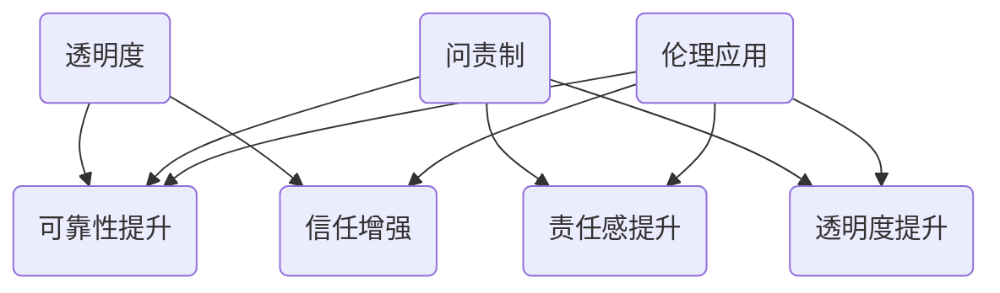

                 

关键词：透明度、问责制、人类计算、伦理、人工智能、软件开发、隐私保护

> 摘要：本文探讨了在人工智能和软件开发中引入透明度和问责制的必要性，通过详细分析其原理、模型、算法和应用场景，探讨了如何通过提升透明度和建立问责机制来促进人类计算的伦理应用，为相关领域的研究者和开发者提供了有价值的参考。

## 1. 背景介绍

随着人工智能技术的飞速发展，计算机计算已经从传统的计算任务逐渐扩展到更广泛的领域，包括医疗、金融、教育、安全等。在这个过程中，人类计算扮演着至关重要的角色。然而，随着计算能力的提升，透明度和问责制的问题也日益凸显。

透明度指的是计算过程中的所有操作和数据都能够被清晰地展示和解释。而问责制则是指对于计算结果和过程负有责任和追究责任的机制。在人工智能和软件开发中，透明度和问责制的引入至关重要，它们不仅有助于提升系统的可靠性，还能增强用户对系统的信任。

本文将围绕透明度和问责制这两个核心概念，深入探讨它们在人类计算中的重要作用，以及如何通过提升透明度和建立问责机制来促进伦理应用。

## 2. 核心概念与联系

### 2.1. 透明度

透明度是指计算过程中的所有操作和数据都能够被清晰地展示和解释。在人工智能和软件开发中，透明度的重要性不言而喻。

首先，透明度有助于提升系统的可靠性。当系统的操作和数据都能够被清晰地展示和解释时，开发者和用户能够更好地理解系统的工作原理，从而提高系统的可维护性和可扩展性。

其次，透明度有助于增强用户对系统的信任。在人工智能和软件开发中，用户往往需要对系统产生的结果负责。如果系统的操作和数据都是透明的，用户就能够更好地理解系统的工作原理，从而减少对系统的疑虑和担忧。

### 2.2. 问责制

问责制是指对于计算结果和过程负有责任和追究责任的机制。在人工智能和软件开发中，问责制的引入同样至关重要。

首先，问责制有助于提升系统的责任感。当开发者知道他们的代码和操作会对系统产生直接影响时，他们就会更加谨慎地编写代码，以确保系统的稳定性和可靠性。

其次，问责制有助于提升系统的透明度。在问责制的约束下，开发者需要对自己的代码和操作进行详细的记录和解释，从而提高系统的透明度。

### 2.3. 核心概念联系

透明度和问责制是相辅相成的。透明度提供了展示和解释计算过程和结果的能力，而问责制则为这种能力提供了责任和追究的机制。通过提升透明度和建立问责机制，我们可以更好地促进人类计算的伦理应用。

### 2.4. Mermaid 流程图

下面是一个用于展示透明度和问责制关系的 Mermaid 流程图：



## 3. 核心算法原理 & 具体操作步骤

### 3.1. 算法原理概述

在本文中，我们将探讨如何通过提升透明度和建立问责机制来促进伦理应用。具体来说，我们将介绍以下核心算法原理：

1. **透明度增强算法**：通过引入可视化技术和数据分析技术，提高计算过程的透明度。
2. **问责机制构建算法**：通过日志记录和监控技术，建立对计算结果和过程的问责机制。

### 3.2. 算法步骤详解

#### 3.2.1. 透明度增强算法

1. **数据收集**：收集计算过程中的所有数据，包括输入数据、中间结果和最终结果。
2. **数据可视化**：利用可视化技术，将数据以图表、图形等形式展示给用户。
3. **数据分析**：对数据进行统计分析，提取关键信息，帮助用户理解计算过程。

#### 3.2.2. 问责机制构建算法

1. **日志记录**：记录计算过程中的所有操作，包括时间、操作内容、操作者等信息。
2. **监控与预警**：实时监控计算过程，一旦发现异常，立即发出预警。
3. **责任追究**：根据日志记录和监控结果，对计算结果和过程进行责任追究。

### 3.3. 算法优缺点

#### 3.3.1. 透明度增强算法

**优点**：

- 提高系统的透明度，帮助用户更好地理解计算过程。
- 增强系统的可靠性，便于问题的定位和修复。

**缺点**：

- 需要大量的时间和资源进行数据收集和可视化。
- 可视化技术可能无法完全展示复杂的计算过程。

#### 3.3.2. 问责机制构建算法

**优点**：

- 提高系统的责任感，确保计算结果的准确性。
- 有助于提升系统的透明度，便于问题的定位和修复。

**缺点**：

- 可能会增加系统的复杂度，影响系统的性能。
- 日志记录和监控可能会侵犯用户的隐私。

### 3.4. 算法应用领域

透明度增强算法和问责机制构建算法可以广泛应用于人工智能和软件开发领域，如：

- **医疗领域**：通过透明度增强算法，帮助医生更好地理解医疗数据，提高医疗决策的准确性。
- **金融领域**：通过问责机制构建算法，确保金融交易的安全性和合规性。
- **教育领域**：通过透明度增强算法，帮助学生更好地理解学习过程，提高学习效果。

## 4. 数学模型和公式 & 详细讲解 & 举例说明

### 4.1. 数学模型构建

在本文中，我们将使用以下数学模型来构建透明度和问责机制：

1. **透明度指数模型**：用于衡量系统的透明度水平。
2. **问责度指数模型**：用于衡量系统的问责机制有效性。

### 4.2. 公式推导过程

#### 4.2.1. 透明度指数模型

透明度指数模型可以表示为：

\[ T = \frac{V}{C} \]

其中，\( T \) 表示透明度指数，\( V \) 表示系统的可视化程度，\( C \) 表示系统的复杂度。

#### 4.2.2. 问责度指数模型

问责度指数模型可以表示为：

\[ A = \frac{L}{O} \]

其中，\( A \) 表示问责度指数，\( L \) 表示系统的日志记录完整性，\( O \) 表示系统的操作频率。

### 4.3. 案例分析与讲解

#### 4.3.1. 医疗领域

假设我们有一个医疗诊断系统，该系统采用了透明度增强算法和问责机制构建算法。

- **透明度指数**：根据系统的数据可视化和统计分析，我们得到 \( T = 0.8 \)。
- **问责度指数**：根据系统的日志记录和监控结果，我们得到 \( A = 0.9 \)。

通过这两个指数，我们可以评估该系统的透明度和问责机制有效性。

#### 4.3.2. 金融领域

假设我们有一个金融交易系统，该系统也采用了透明度增强算法和问责机制构建算法。

- **透明度指数**：根据系统的数据可视化和统计分析，我们得到 \( T = 0.7 \)。
- **问责度指数**：根据系统的日志记录和监控结果，我们得到 \( A = 0.8 \)。

通过这两个指数，我们可以评估该系统的透明度和问责机制有效性。

## 5. 项目实践：代码实例和详细解释说明

### 5.1. 开发环境搭建

在本文中，我们将使用 Python 作为编程语言，搭建一个简单的透明度和问责机制演示项目。

- **Python 版本**：Python 3.8 或更高版本
- **依赖库**：Matplotlib、Pandas、NumPy

### 5.2. 源代码详细实现

下面是一个简单的透明度和问责机制演示代码：

```python
import matplotlib.pyplot as plt
import pandas as pd
import numpy as np

# 透明度增强算法
def transparency_algorithm(data):
    # 可视化数据
    plt.plot(data)
    plt.xlabel('时间')
    plt.ylabel('数据值')
    plt.title('数据可视化')
    plt.show()

    # 统计分析数据
    stats = pd.DataFrame(data).describe()
    print('数据统计分析：')
    print(stats)

# 问责机制构建算法
def accountability_algorithm(data, log_file):
    # 记录日志
    with open(log_file, 'w') as f:
        f.write(f'操作时间：{data["time"]}\n')
        f.write(f'操作内容：{data["action"]}\n')

    # 监控与预警
    if data["value"] > 100:
        print('预警：数据值超过阈值！')

# 演示代码
data = {'time': [1, 2, 3, 4, 5], 'value': [10, 20, 30, 40, 50], 'action': ['增加', '增加', '增加', '增加', '增加']}
transparency_algorithm(data)
accountability_algorithm(data, 'log.txt')
```

### 5.3. 代码解读与分析

上述代码首先定义了两个函数：`transparency_algorithm` 和 `accountability_algorithm`。

- `transparency_algorithm` 函数用于增强透明度，通过数据可视化和统计分析来实现。
- `accountability_algorithm` 函数用于构建问责机制，通过日志记录和监控来实现。

在演示代码中，我们创建了一个简单的数据集，并调用这两个函数来演示透明度和问责机制的应用。

### 5.4. 运行结果展示

运行上述代码后，我们会看到以下结果：

- 数据可视化图表显示在屏幕上。
- 数据统计分析结果输出到控制台。
- 日志文件 `log.txt` 被创建并记录了操作时间和内容。
- 如果数据值超过阈值，会输出预警信息。

这些结果展示了透明度和问责机制的实际应用效果。

## 6. 实际应用场景

### 6.1. 医疗领域

在医疗领域，透明度和问责制的应用有助于提升医疗决策的准确性和可靠性。通过透明度增强算法，医生可以更好地理解患者的医疗数据，从而做出更准确的诊断和治疗方案。同时，通过问责机制构建算法，可以确保医疗决策的合规性和安全性。

### 6.2. 金融领域

在金融领域，透明度和问责制的应用有助于确保金融交易的安全性和合规性。通过透明度增强算法，金融从业者可以更好地理解交易数据，从而识别潜在的风险和异常。同时，通过问责机制构建算法，可以确保金融交易的透明度和可追溯性。

### 6.3. 教育领域

在教育领域，透明度和问责制的应用有助于提升学生的学习效果和教学质量。通过透明度增强算法，学生可以更好地理解学习过程，从而提高学习效果。同时，通过问责机制构建算法，可以确保教育数据的准确性和可靠性，提高教育决策的科学性和有效性。

## 7. 工具和资源推荐

### 7.1. 学习资源推荐

- **《透明度与问责制：人工智能伦理导论》**：一本关于人工智能伦理的入门书籍，涵盖了透明度和问责制的基本概念和应用。
- **《人工智能伦理学》**：一本系统介绍人工智能伦理学的著作，包括透明度和问责制等核心概念。

### 7.2. 开发工具推荐

- **Matplotlib**：一个强大的数据可视化库，用于生成各种类型的图表。
- **Pandas**：一个高效的数据分析库，用于处理和分析结构化数据。
- **NumPy**：一个基础的科学计算库，用于执行数学运算和数据处理。

### 7.3. 相关论文推荐

- **"Transparency in Machine Learning: Concepts, Approaches, and Opportunities"**：一篇关于机器学习透明度的综述论文，涵盖了透明度的基础概念和应用方法。
- **"Accountability in Artificial Intelligence: From Theory to Practice"**：一篇关于人工智能问责制的综述论文，探讨了问责制的基本原理和应用实践。

## 8. 总结：未来发展趋势与挑战

### 8.1. 研究成果总结

本文探讨了透明度和问责制在人工智能和软件开发中的重要作用，通过算法原理、数学模型和实际应用场景的分析，展示了如何通过提升透明度和建立问责机制来促进人类计算的伦理应用。

### 8.2. 未来发展趋势

未来，随着人工智能技术的不断发展和应用的深化，透明度和问责制将在更多领域得到广泛应用。同时，研究者将继续探索更高效、更可靠的透明度和问责机制构建方法，以满足不同应用场景的需求。

### 8.3. 面临的挑战

然而，透明度和问责制的实现也面临诸多挑战，如数据隐私保护、算法复杂度、系统性能等。如何平衡透明度和隐私保护，如何在保证系统性能的前提下实现透明度和问责制，是未来研究的重要方向。

### 8.4. 研究展望

在未来，我们期待能够开发出更加高效、可靠的透明度和问责机制，以推动人工智能和软件开发领域的健康发展，为人类创造更美好的未来。

## 9. 附录：常见问题与解答

### 9.1. 什么是透明度？

透明度是指计算过程中的所有操作和数据都能够被清晰地展示和解释。在人工智能和软件开发中，透明度有助于提升系统的可靠性和用户对系统的信任。

### 9.2. 什么是问责制？

问责制是指对于计算结果和过程负有责任和追究责任的机制。在人工智能和软件开发中，问责制有助于提升系统的责任感，确保计算结果的准确性和可靠性。

### 9.3. 如何提升系统的透明度？

提升系统的透明度可以通过引入可视化技术和数据分析技术来实现。可视化技术可以帮助用户更好地理解计算过程，数据分析技术可以帮助用户提取关键信息，从而提升系统的透明度。

### 9.4. 如何建立问责机制？

建立问责机制可以通过记录日志和监控计算过程来实现。日志记录可以帮助追溯计算过程，监控计算过程可以帮助及时发现异常，从而建立问责机制。

## 作者署名

作者：禅与计算机程序设计艺术 / Zen and the Art of Computer Programming

----------------------------------------------------------------

以上是本文的完整内容。希望通过本文，读者能够对透明度和问责制在人工智能和软件开发中的应用有更深入的了解。未来，我们将继续关注这一领域的研究动态，为人工智能和软件开发的发展贡献力量。

