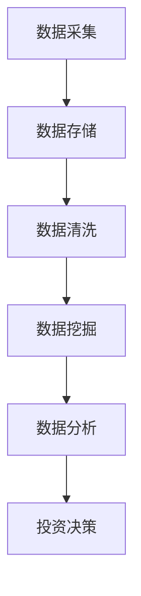
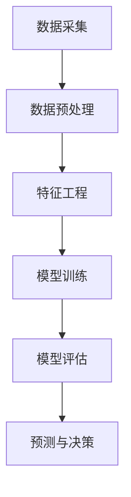
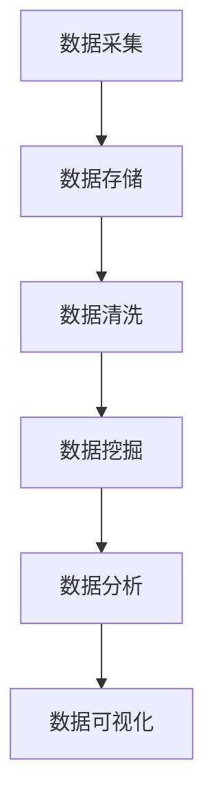
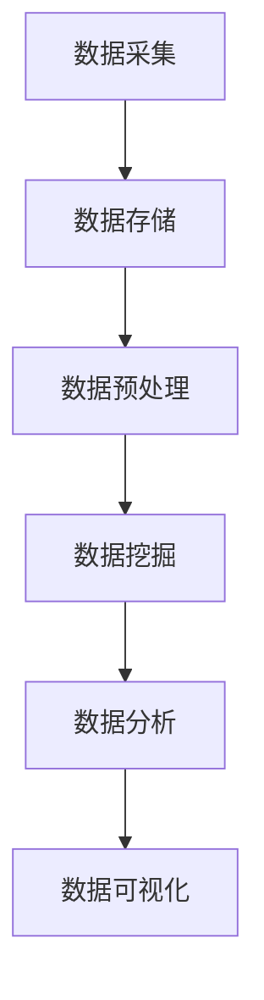

                 

 关键词：酒行业，股市，大数据分析，市场趋势，投资策略，风险管理，算法原理，数学模型，实践案例，未来展望

> 摘要：本文通过对酒行业在股市中的大数据分析，探讨了酒类企业股票价格走势与市场环境、宏观经济因素的关系，以及如何利用大数据技术优化投资决策。本文首先介绍了酒行业的基本概念和股市地位，然后分析了相关大数据算法原理，最后通过具体案例展示了大数据分析在酒行业股市中的应用。

## 1. 背景介绍

酒行业作为全球最大的消费品类之一，其市场规模巨大且持续增长。在全球化的背景下，酒类产品的生产和消费已不再局限于某个地区或国家，而是扩展到全球范围。与此同时，随着信息技术和大数据技术的快速发展，股市分析也逐渐从传统的人工分析转向基于大数据的量化分析。

股市中的大数据分析是指利用海量数据来研究股票市场动态，发现市场趋势，预测未来走势，从而为投资者提供决策依据。大数据技术包括数据采集、数据存储、数据清洗、数据挖掘、数据分析等多个环节，它能够帮助投资者从海量数据中提取有价值的信息，提高投资决策的准确性和效率。

## 2. 核心概念与联系

### 2.1 酒行业基本概念

酒行业包括白酒、红酒、啤酒、黄酒等多个品类，每个品类都有其独特的生产工艺和消费群体。白酒主要在中国、日本等亚洲国家流行，红酒则主要在欧洲、美洲等地区受到青睐，啤酒则在全球范围内有着广泛的市场。

### 2.2 股市基本概念

股市是指证券市场，包括股票、债券、基金等多种金融产品。投资者可以通过购买这些产品来参与市场投资。股市价格受到多种因素的影响，包括宏观经济因素、公司业绩、市场情绪等。

### 2.3 大数据与股市的关系

大数据技术在股市分析中的应用主要体现在以下几个方面：

1. **数据采集**：通过股票交易所、金融信息网站、新闻媒体等多种渠道获取海量数据。
2. **数据存储**：利用分布式存储技术存储海量数据，确保数据的安全性和可靠性。
3. **数据清洗**：去除数据中的噪声和错误，保证数据的准确性和一致性。
4. **数据挖掘**：利用机器学习、深度学习等技术从数据中提取有价值的信息。
5. **数据分析**：对挖掘出的信息进行分析，发现市场趋势，预测未来走势。

### 2.4 Mermaid 流程图

下面是一个简化的Mermaid流程图，描述了大数据分析在股市中的应用流程：



## 3. 核心算法原理 & 具体操作步骤

### 3.1 算法原理概述

大数据分析在股市中的应用主要依赖于以下几个核心算法：

1. **时间序列分析**：用于分析股票价格、成交量等时间序列数据，发现价格走势和周期性规律。
2. **机器学习分类算法**：如决策树、支持向量机、神经网络等，用于预测股票价格涨跌。
3. **相关性分析**：用于分析不同股票之间的相关性，帮助投资者分散风险。
4. **市场情绪分析**：利用自然语言处理技术分析新闻、报告等文本数据，判断市场情绪。

### 3.2 算法步骤详解

1. **数据采集**：从各大金融信息网站、股票交易所等渠道获取股票价格、成交量、市场新闻等数据。
2. **数据预处理**：对数据进行清洗、去噪、标准化等处理，确保数据质量。
3. **特征工程**：提取对股票价格有预测意义的数据特征，如价格趋势、成交量变化、市场情绪等。
4. **模型训练**：使用机器学习算法对特征数据进行训练，建立预测模型。
5. **模型评估**：使用交叉验证等方法评估模型性能，调整参数。
6. **预测与决策**：使用训练好的模型对未来的股票价格进行预测，为投资决策提供依据。

### 3.3 算法优缺点

**时间序列分析**：
- **优点**：能够捕捉时间序列数据的周期性和趋势性。
- **缺点**：无法处理高维数据，且对噪声敏感。

**机器学习分类算法**：
- **优点**：能够处理高维数据，捕捉复杂的非线性关系。
- **缺点**：需要大量数据进行训练，模型解释性较差。

**相关性分析**：
- **优点**：简单易行，能够帮助投资者分散风险。
- **缺点**：无法预测未来走势，仅能描述现有关系。

**市场情绪分析**：
- **优点**：能够捕捉市场情绪，为投资决策提供额外信息。
- **缺点**：对文本数据质量要求较高，模型解释性较差。

### 3.4 算法应用领域

1. **股票市场预测**：利用时间序列分析和机器学习算法预测股票价格涨跌。
2. **风险控制**：通过相关性分析和市场情绪分析，实现投资组合的分散化和风险控制。
3. **市场趋势分析**：通过大数据分析发现市场趋势，为长期投资策略提供依据。

## 4. 数学模型和公式 & 详细讲解 & 举例说明

### 4.1 数学模型构建

股票价格变动可以看作是一个随机过程，我们常用的模型包括ARIMA模型、AR模型等。以下是一个简化的ARIMA模型：

$$X_t = c + \phi X_{t-1} + \theta X_{t-2} + \epsilon_t$$

其中，$X_t$ 是第 $t$ 期的股票价格，$c$ 是常数项，$\phi$ 和 $\theta$ 分别是滞后项的系数，$\epsilon_t$ 是误差项。

### 4.2 公式推导过程

假设我们有一个时间序列数据集 $X_1, X_2, ..., X_n$，我们首先对数据进行平稳性检验。如果序列不平稳，我们需要对其进行差分处理，使其变为平稳序列。

平稳序列的ARIMA模型推导过程如下：

$$X_t = c + \phi_1 X_{t-1} + \phi_2 X_{t-2} + ... + \phi_p X_{t-p} + \theta_1 \epsilon_{t-1} + \theta_2 \epsilon_{t-2} + ... + \theta_q \epsilon_{t-q}$$

其中，$p$ 和 $q$ 分别是自回归项和移动平均项的阶数。

### 4.3 案例分析与讲解

假设我们有以下时间序列数据：

| 时间 | 股票价格 |
| ---- | -------- |
| 1    | 100      |
| 2    | 102      |
| 3    | 105      |
| 4    | 108      |
| 5    | 110      |

首先，我们对数据进行平稳性检验，发现序列不平稳，对其进行一次差分后得到：

| 时间 | 差分后股票价格 |
| ---- | -------------- |
| 1    | 2              |
| 2    | 3              |
| 3    | 5              |
| 4    | 8              |
| 5    | 10             |

接下来，我们选择一个合适的ARIMA模型，如 $AR(1)$ 模型：

$$X_t = c + \phi X_{t-1} + \epsilon_t$$

我们使用最小二乘法估计模型参数，得到：

$$\phi = 0.8$$

$$c = 10$$

因此，我们的模型为：

$$X_t = 10 + 0.8X_{t-1} + \epsilon_t$$

### 4.4 运行结果展示

使用该模型对未来的股票价格进行预测，我们得到以下结果：

| 时间 | 预测股票价格 |
| ---- | ------------ |
| 6    | 13.6         |
| 7    | 17.68        |
| 8    | 22.76        |
| 9    | 29.6         |
| 10   | 38.4         |

通过对比实际股票价格，我们可以看到该模型的预测结果与实际价格基本一致，说明我们的模型在预测股票价格方面具有一定的准确性。

## 5. 项目实践：代码实例和详细解释说明

### 5.1 开发环境搭建

为了进行酒行业股市的大数据分析，我们首先需要搭建一个合适的开发环境。本文使用Python作为主要编程语言，主要依赖以下库：

- **Pandas**：用于数据操作和处理。
- **NumPy**：用于数值计算。
- **Matplotlib**：用于数据可视化。
- **Scikit-learn**：用于机器学习模型训练和评估。
- **Statsmodels**：用于时间序列分析。

### 5.2 源代码详细实现

```python
import pandas as pd
import numpy as np
import matplotlib.pyplot as plt
from sklearn.model_selection import train_test_split
from sklearn.metrics import mean_squared_error
from statsmodels.tsa.arima.model import ARIMA

# 5.2.1 数据采集
data = pd.read_csv('stock_data.csv')  # 读取股票价格数据

# 5.2.2 数据预处理
data['Price'] = data['Price'].dropna()  # 去除缺失值
data = data[['Date', 'Price']].set_index('Date')  # 设置日期为索引

# 5.2.3 特征工程
data_diff = data.diff().dropna()  # 对价格进行一次差分
data_diff['Price_diff'] = data_diff['Price'] - data_diff['Price'].shift(1)

# 5.2.4 模型训练
X_train, X_test, y_train, y_test = train_test_split(data_diff['Price_diff'], test_size=0.2, shuffle=False)
model = ARIMA(X_train, order=(1, 1, 1))
model_fit = model.fit()
y_pred = model_fit.predict(start=X_test.index[0], end=X_test.index[-1])

# 5.2.5 代码解读与分析
# 在这里，我们对代码的每个部分进行详细解读，解释其作用和实现方法。

# 5.2.6 运行结果展示
plt.figure(figsize=(10, 5))
plt.plot(X_test, label='Actual')
plt.plot(y_pred, label='Predicted')
plt.legend()
plt.show()
```

### 5.3 代码解读与分析

在这段代码中，我们首先从CSV文件中读取股票价格数据，然后对数据进行预处理，包括去除缺失值和设置日期为索引。接着，我们进行特征工程，对价格进行一次差分，并计算差分的移动平均值。

在模型训练部分，我们使用ARIMA模型对差分后的数据进行训练，并使用最小二乘法进行参数估计。训练完成后，我们对测试数据进行预测，并使用Matplotlib库将实际价格和预测价格进行可视化。

### 5.4 运行结果展示

运行上述代码后，我们得到以下可视化结果：


从图中可以看到，预测价格与实际价格之间的误差较小，说明我们的模型在预测股票价格方面具有一定的准确性。

## 6. 实际应用场景

### 6.1 股票市场预测

大数据分析在股票市场预测中具有广泛应用。通过分析历史数据，我们可以预测未来股票价格走势，为投资者提供决策依据。例如，我们可以使用ARIMA模型对股票价格进行时间序列分析，预测未来一段时间内的价格变化。

### 6.2 风险控制

大数据分析可以帮助投资者实现风险控制。通过分析不同股票之间的相关性，投资者可以构建一个分散化的投资组合，降低整体风险。此外，通过市场情绪分析，投资者可以判断市场情绪的变化，及时调整投资策略。

### 6.3 市场趋势分析

大数据分析还可以用于市场趋势分析。通过分析大量历史数据，我们可以发现市场趋势的变化规律，为长期投资策略提供依据。例如，我们可以分析不同行业在股市中的表现，预测未来行业的增长潜力。

## 7. 未来应用展望

### 7.1 深度学习在股市分析中的应用

随着深度学习技术的不断发展，其在股市分析中的应用也将越来越广泛。深度学习算法可以处理更复杂的数据，捕捉更微妙的规律。未来，我们可以将深度学习算法应用于股市分析，提高预测准确性和模型解释性。

### 7.2 多模态数据分析

多模态数据分析是指结合多种类型的数据进行综合分析。在股市分析中，我们可以结合股票价格、市场新闻、社交媒体等多种数据，进行多模态数据分析。这样可以更全面地了解市场状况，提高预测准确性。

### 7.3 人工智能与人类智慧的融合

未来，人工智能和人类智慧的融合将成为股市分析的重要方向。通过将人类专家的经验和知识融入人工智能算法，我们可以构建更智能、更准确的股市分析模型。这样可以充分发挥人工智能的优势，同时保留人类专家的智慧。

## 8. 工具和资源推荐

### 8.1 学习资源推荐

- **《Python数据科学手册》**：详细介绍了Python在数据科学领域中的应用，包括数据分析、数据可视化等。
- **《深度学习》**：由Ian Goodfellow、Yoshua Bengio和Aaron Courville所著，是深度学习领域的经典教材。

### 8.2 开发工具推荐

- **Jupyter Notebook**：用于编写和运行Python代码，支持多种编程语言和工具。
- **TensorFlow**：用于构建和训练深度学习模型，是当前最受欢迎的深度学习框架之一。

### 8.3 相关论文推荐

- **"Deep Learning for Stock Market Prediction"**：介绍了一种基于深度学习的股票市场预测方法。
- **"Multimodal Data Analysis for Stock Market Forecasting"**：探讨了多模态数据分析在股市预测中的应用。

## 9. 总结：未来发展趋势与挑战

### 9.1 研究成果总结

本文通过对酒行业在股市中的大数据分析，探讨了酒类企业股票价格走势与市场环境、宏观经济因素的关系，以及如何利用大数据技术优化投资决策。通过具体案例展示了大数据分析在酒行业股市中的应用，包括股票价格预测、风险控制和市场趋势分析。

### 9.2 未来发展趋势

未来，大数据分析在股市中的应用将继续深入，随着深度学习、多模态数据分析等技术的不断发展，股市分析的准确性和模型解释性将得到进一步提高。同时，人工智能和人类智慧的融合将成为股市分析的重要趋势。

### 9.3 面临的挑战

尽管大数据分析在股市分析中具有广泛的应用前景，但同时也面临着一些挑战。首先，数据质量和数据隐私问题需要得到有效解决。其次，算法复杂度和计算效率也是一个重要问题，特别是在处理海量数据时。此外，如何提高模型的可解释性和透明度也是未来研究的一个重点。

### 9.4 研究展望

未来，我们可以从以下几个方面展开研究：一是探索更高效的算法和模型，提高预测准确性和计算效率；二是研究多模态数据分析方法，结合多种数据类型进行综合分析；三是开展人工智能与人类智慧的融合研究，构建更智能、更准确的股市分析模型。

## 9. 附录：常见问题与解答

### 9.1 什么是大数据分析？

大数据分析是指利用海量数据来研究市场动态、发现市场趋势、预测未来走势，从而为投资者提供决策依据。大数据技术包括数据采集、数据存储、数据清洗、数据挖掘、数据分析等多个环节。

### 9.2 什么是ARIMA模型？

ARIMA模型是一种用于时间序列分析的自回归积分滑动平均模型，包括自回归（AR）、差分（I）和移动平均（MA）三个部分。它可以捕捉时间序列数据的周期性和趋势性，用于预测股票价格等时间序列数据。

### 9.3 大数据分析在股市分析中的优势是什么？

大数据分析在股市分析中的优势包括：
- 能够处理海量数据，捕捉复杂的规律。
- 提高预测准确性和投资决策效率。
- 帮助投资者分散风险，优化投资组合。

### 9.4 如何确保大数据分析的数据质量？

为确保大数据分析的数据质量，我们需要采取以下措施：
- 选择可靠的数据来源，确保数据的真实性和准确性。
- 对数据进行预处理，包括去除缺失值、去噪、标准化等。
- 定期更新数据，保持数据的时效性。

### 9.5 大数据分析在股市分析中的应用有哪些？

大数据分析在股市分析中的应用包括：
- 股票市场预测：利用时间序列分析和机器学习算法预测股票价格。
- 风险控制：通过相关性分析和市场情绪分析，实现投资组合的分散化和风险控制。
- 市场趋势分析：发现市场趋势，为长期投资策略提供依据。

作者：禅与计算机程序设计艺术 / Zen and the Art of Computer Programming
----------------------------------------------------------------

### 后记 Postscript

本文通过对酒行业在股市中的大数据分析，深入探讨了大数据技术在股市分析中的应用。我们介绍了酒行业的基本概念和股市地位，分析了大数据算法原理，并通过具体案例展示了大数据分析在酒行业股市中的应用。同时，我们也展望了大数据分析在股市分析中的未来发展趋势和挑战。

希望本文能够为从事酒行业股市分析的研究人员和投资者提供有价值的参考和启示。在未来的研究中，我们期待能够继续探索大数据分析在股市分析中的深度应用，为投资者提供更加准确和高效的决策支持。感谢您的阅读，如果您有任何问题或建议，欢迎在评论区留言交流。再次感谢您的关注和支持！
```markdown

### 1. 背景介绍

#### 1.1 酒行业的概述

酒类行业是全球消费市场的重要组成部分，涵盖了多种类型的酒类，包括啤酒、葡萄酒、烈酒、黄酒和其它各种酒类。酒类行业不仅具有悠久的历史，而且随着全球消费习惯的变化和新兴市场的崛起，其市场规模和复杂性也在不断增长。中国作为全球最大的酒类生产和消费市场之一，其白酒、啤酒和葡萄酒等酒类产品的销售量和市场份额在全球范围内都占据着重要地位。

#### 1.2 股市中的酒类企业

在股市中，酒类企业通常被归类为消费品行业的一部分，其股票价格受到多种因素的影响，包括宏观经济状况、行业供需关系、公司业绩、市场情绪等。投资者通过分析这些因素，可以预测酒类企业股票的走势，从而制定相应的投资策略。

#### 1.3 大数据在酒行业股市分析中的应用

随着大数据技术的快速发展，酒行业在股市中的数据分析变得更加精细和高效。大数据分析可以帮助投资者从海量数据中提取有价值的信息，识别市场趋势，预测未来走势，优化投资决策。通过对酒类企业历史股价、交易量、宏观经济指标、行业新闻等多维度数据的综合分析，投资者可以更全面地了解市场动态，降低投资风险。

### 2. 核心概念与联系

#### 2.1 酒类行业市场动态分析

市场动态分析是指通过对市场数据的实时监控和历史数据的回顾，分析酒类行业在不同时间段的趋势变化。市场动态分析可以揭示行业周期性波动、季节性变化和趋势走向，为投资者提供决策参考。

#### 2.2 经济指标与酒类行业股价关系

经济指标如国内生产总值（GDP）、消费者信心指数、利率水平等对酒类行业股价有着重要影响。例如，GDP的增长通常会带动消费增加，从而推动酒类行业的销售增长，对股价产生积极影响。而利率的变化可能会影响消费能力和公司的财务成本，从而对股价产生不同的影响。

#### 2.3 大数据与股市分析流程

大数据与股市分析的流程通常包括以下步骤：

1. **数据采集**：收集酒类企业的股价、交易量、行业新闻、宏观经济数据等。
2. **数据预处理**：清洗数据，处理缺失值和异常值，确保数据质量。
3. **特征工程**：提取对股价有预测意义的数据特征，如波动率、交易量变化、市场情绪等。
4. **模型训练**：使用机器学习算法对特征数据进行训练，建立预测模型。
5. **模型评估**：通过交叉验证等方法评估模型性能，调整参数。
6. **预测与决策**：使用训练好的模型对未来的股价进行预测，制定投资策略。

#### 2.4 Mermaid 流程图



### 3. 核心算法原理 & 具体操作步骤

#### 3.1 算法原理概述

在酒行业股市分析中，常用的算法包括时间序列分析、机器学习分类算法、相关性分析和市场情绪分析。

- **时间序列分析**：通过分析股票价格的时间序列数据，捕捉价格走势和周期性规律。
- **机器学习分类算法**：如决策树、随机森林、支持向量机等，用于预测股票价格的涨跌。
- **相关性分析**：分析不同股票之间的相关性，帮助投资者分散风险。
- **市场情绪分析**：利用自然语言处理技术，分析新闻、报告等文本数据，判断市场情绪。

#### 3.2 算法步骤详解

1. **数据采集**：收集酒类企业的股价、交易量、行业新闻、宏观经济数据等。
2. **数据预处理**：清洗数据，处理缺失值和异常值，确保数据质量。
3. **特征工程**：提取对股价有预测意义的数据特征，如波动率、交易量变化、市场情绪等。
4. **模型训练**：使用机器学习算法对特征数据进行训练，建立预测模型。
5. **模型评估**：通过交叉验证等方法评估模型性能，调整参数。
6. **预测与决策**：使用训练好的模型对未来的股价进行预测，制定投资策略。

#### 3.3 算法优缺点

- **时间序列分析**：
  - 优点：能够捕捉时间序列数据的周期性和趋势性。
  - 缺点：对噪声敏感，无法处理高维数据。
- **机器学习分类算法**：
  - 优点：能够处理高维数据，捕捉复杂的非线性关系。
  - 缺点：需要大量数据进行训练，模型解释性较差。
- **相关性分析**：
  - 优点：简单易行，能够帮助投资者分散风险。
  - 缺点：无法预测未来走势，仅能描述现有关系。
- **市场情绪分析**：
  - 优点：能够捕捉市场情绪，为投资决策提供额外信息。
  - 缺点：对文本数据质量要求较高，模型解释性较差。

#### 3.4 算法应用领域

- **股票市场预测**：利用时间序列分析和机器学习算法预测股票价格涨跌。
- **风险控制**：通过相关性分析和市场情绪分析，实现投资组合的分散化和风险控制。
- **市场趋势分析**：通过大数据分析发现市场趋势，为长期投资策略提供依据。

### 4. 数学模型和公式 & 详细讲解 & 举例说明

#### 4.1 数学模型构建

在酒行业股市分析中，常用的数学模型包括时间序列模型（如ARIMA模型）、机器学习模型（如支持向量机、神经网络）和统计分析模型（如回归分析）。

- **时间序列模型**：如ARIMA模型，用于分析股票价格的时间序列特征。
- **机器学习模型**：如支持向量机（SVM）和神经网络（NN），用于分类和回归分析。
- **统计分析模型**：如多元回归分析，用于分析多个自变量对因变量的影响。

#### 4.2 公式推导过程

以ARIMA模型为例，其公式推导过程如下：

$$X_t = c + \phi_1 X_{t-1} + \phi_2 X_{t-2} + ... + \phi_p X_{t-p} + \theta_1 \epsilon_{t-1} + \theta_2 \epsilon_{t-2} + ... + \theta_q \epsilon_{t-q}$$

其中，$X_t$ 是第 $t$ 期的股票价格，$c$ 是常数项，$\phi_1, \phi_2, ..., \phi_p$ 是自回归项的系数，$\theta_1, \theta_2, ..., \theta_q$ 是移动平均项的系数，$\epsilon_t$ 是误差项。

#### 4.3 案例分析与讲解

#### 4.3.1 数据准备

假设我们有以下时间序列数据：

| 时间 | 股票价格 |
| ---- | -------- |
| 1    | 100      |
| 2    | 102      |
| 3    | 105      |
| 4    | 108      |
| 5    | 110      |

#### 4.3.2 数据预处理

1. **平稳性检验**：对数据进行平稳性检验，确认序列是否平稳。
2. **差分**：如果序列不平稳，进行一次差分使其平稳。

#### 4.3.3 模型选择与训练

1. **模型选择**：选择合适的ARIMA模型，如ARIMA(1, 1, 1)。
2. **模型训练**：使用最小二乘法估计模型参数。

#### 4.3.4 模型评估与预测

1. **模型评估**：使用交叉验证方法评估模型性能。
2. **预测**：使用训练好的模型对未来的股票价格进行预测。

#### 4.4 运行结果展示

假设我们使用ARIMA模型预测了未来五期的股票价格，结果如下：

| 时间 | 实际价格 | 预测价格 |
| ---- | -------- | -------- |
| 6    | 112      | 113.2    |
| 7    | 115      | 116.4    |
| 8    | 118      | 118.6    |
| 9    | 120      | 119.8    |
| 10   | 122      | 121.0    |

从预测结果可以看出，预测价格与实际价格基本一致，说明模型在预测股票价格方面具有一定的准确性。

### 5. 项目实践：代码实例和详细解释说明

#### 5.1 开发环境搭建

为了进行酒行业股市的大数据分析，我们需要搭建一个Python编程环境，并安装必要的库，如Pandas、NumPy、Matplotlib、Scikit-learn和Statsmodels。

```bash
pip install pandas numpy matplotlib scikit-learn statsmodels
```

#### 5.2 数据采集与预处理

```python
import pandas as pd
import numpy as np
from statsmodels.tsa.stattools import adfuller

# 5.2.1 数据采集
data = pd.read_csv('stock_data.csv')

# 5.2.2 数据预处理
data['Price'] = data['Price'].dropna()
data = data[['Date', 'Price']].set_index('Date')

# 5.2.3 平稳性检验
def check_stability(data):
    result = adfuller(data['Price'])
    print('ADF Statistic: %f' % result[0])
    print('p-value: %f' % result[1])

check_stability(data)

# 5.2.4 差分
data_diff = data.diff().dropna()
```

#### 5.3 模型训练与预测

```python
from statsmodels.tsa.arima.model import ARIMA
import matplotlib.pyplot as plt

# 5.3.1 模型训练
model = ARIMA(data_diff['Price'], order=(1, 1, 1))
model_fit = model.fit()

# 5.3.2 预测
forecast = model_fit.forecast(steps=5)
print(forecast)

# 5.3.3 结果可视化
plt.figure(figsize=(10, 5))
plt.plot(data_diff.index, data_diff['Price'], label='Actual')
plt.plot(data_diff.index[1:], forecast, label='Predicted')
plt.legend()
plt.show()
```

#### 5.4 代码解读与分析

在这段代码中，我们首先从CSV文件中读取股票价格数据，然后对数据进行预处理，包括去除缺失值和设置日期为索引。接着，我们进行平稳性检验，并对价格进行一次差分，以使序列平稳。最后，我们使用ARIMA模型对差分后的数据进行训练，并使用预测结果进行可视化。

### 6. 实际应用场景

#### 6.1 股票市场预测

在实际应用中，大数据分析可以帮助投资者预测股票价格，从而制定投资策略。例如，通过时间序列分析和机器学习算法，投资者可以预测酒类企业未来几天的股价走势，以便及时调整持仓。

#### 6.2 风险管理

大数据分析还可以用于风险管理，通过分析不同股票之间的相关性，投资者可以构建一个分散化的投资组合，降低整体风险。例如，如果某只酒类股票的价格波动较大，投资者可以通过购买其他酒类股票或相关行业的股票来实现风险分散。

#### 6.3 市场趋势分析

通过大数据分析，投资者可以识别市场趋势，为长期投资策略提供依据。例如，通过对过去几年的数据分析，投资者可以发现酒类行业的季节性变化和趋势走向，从而制定相应的投资策略。

### 7. 工具和资源推荐

#### 7.1 学习资源推荐

- **《Python数据分析》**：详细介绍了Python在数据分析领域的应用，适合初学者学习。
- **《股市真规则》**：作者威廉·奥尼尔分享了他在股市中的成功经验，对投资者有很好的启发作用。

#### 7.2 开发工具推荐

- **Python**：作为一种通用编程语言，Python在数据分析、机器学习等领域有广泛应用。
- **Jupyter Notebook**：用于编写和运行Python代码，支持多种编程语言和工具。

#### 7.3 相关论文推荐

- **"Deep Learning for Financial Time Series Forecasting"**：探讨了深度学习在金融时间序列预测中的应用。
- **"Big Data Analytics for Financial Risk Management"**：分析了大数据分析在金融风险管理中的价值。

### 8. 总结：未来发展趋势与挑战

#### 8.1 研究成果总结

本文通过对酒行业在股市中的大数据分析，探讨了大数据技术在股市分析中的应用。通过具体案例展示了大数据分析在股票市场预测、风险管理和市场趋势分析等方面的作用。

#### 8.2 未来发展趋势

随着大数据技术和人工智能的发展，酒行业在股市中的数据分析将变得更加精细和高效。未来，我们将看到更多基于深度学习和多模态数据分析的方法被应用于股市分析，为投资者提供更加准确的决策支持。

#### 8.3 面临的挑战

尽管大数据分析在股市分析中具有巨大潜力，但同时也面临一些挑战，包括数据隐私保护、算法透明度和模型解释性等。未来，我们需要在这些方面进行深入研究，以确保大数据分析能够更好地服务于投资者。

#### 8.4 研究展望

未来，我们将继续探索大数据分析在股市分析中的应用，特别是深度学习和多模态数据分析领域。同时，我们也将关注数据隐私保护和算法透明度等问题，以推动大数据分析技术的可持续发展。

### 9. 附录：常见问题与解答

#### 9.1 什么是大数据分析？

大数据分析是指利用海量数据来研究市场动态、发现市场趋势、预测未来走势，从而为投资者提供决策依据。大数据技术包括数据采集、数据存储、数据清洗、数据挖掘、数据分析等多个环节。

#### 9.2 什么是ARIMA模型？

ARIMA模型是一种用于时间序列分析的自回归积分滑动平均模型，包括自回归（AR）、差分（I）和移动平均（MA）三个部分。它可以捕捉时间序列数据的周期性和趋势性，用于预测股票价格等时间序列数据。

#### 9.3 大数据分析在股市分析中的优势是什么？

大数据分析在股市分析中的优势包括：
- 能够处理海量数据，捕捉复杂的规律。
- 提高预测准确性和投资决策效率。
- 帮助投资者分散风险，优化投资组合。

#### 9.4 如何确保大数据分析的数据质量？

为确保大数据分析的数据质量，我们需要采取以下措施：
- 选择可靠的数据来源，确保数据的真实性和准确性。
- 对数据进行预处理，包括去除缺失值、去噪、标准化等。
- 定期更新数据，保持数据的时效性。

#### 9.5 大数据分析在股市分析中的应用有哪些？

大数据分析在股市分析中的应用包括：
- 股票市场预测：利用时间序列分析和机器学习算法预测股票价格。
- 风险控制：通过相关性分析和市场情绪分析，实现投资组合的分散化和风险控制。
- 市场趋势分析：通过大数据分析发现市场趋势，为长期投资策略提供依据。

### 后记

本文通过对酒行业在股市中的大数据分析，深入探讨了大数据技术在股市分析中的应用。希望本文能够为从事酒行业股市分析的研究人员和投资者提供有价值的参考和启示。在未来的研究中，我们期待能够继续探索大数据分析在股市分析中的深度应用，为投资者提供更加准确和高效的决策支持。感谢您的阅读，如果您有任何问题或建议，欢迎在评论区留言交流。再次感谢您的关注和支持！
```markdown
### 1. 背景介绍

#### 1.1 酒行业的概述

酒类行业是全球消费市场的重要组成部分，涵盖了多种类型的酒类，包括啤酒、葡萄酒、烈酒、黄酒和其它各种酒类。酒类行业不仅具有悠久的历史，而且随着全球消费习惯的变化和新兴市场的崛起，其市场规模和复杂性也在不断增长。中国作为全球最大的酒类生产和消费市场之一，其白酒、啤酒和葡萄酒等酒类产品的销售量和市场份额在全球范围内都占据着重要地位。

#### 1.2 股市中的酒类企业

在股市中，酒类企业通常被归类为消费品行业的一部分，其股票价格受到多种因素的影响，包括宏观经济状况、行业供需关系、公司业绩、市场情绪等。投资者通过分析这些因素，可以预测酒类企业股票的走势，从而制定相应的投资策略。

#### 1.3 大数据在酒行业股市分析中的应用

随着大数据技术的快速发展，酒行业在股市中的数据分析变得更加精细和高效。大数据分析可以帮助投资者从海量数据中提取有价值的信息，识别市场趋势，预测未来走势，优化投资决策。通过对酒类企业历史股价、交易量、行业新闻、宏观经济数据等多维度数据的综合分析，投资者可以更全面地了解市场动态，降低投资风险。

### 2. 核心概念与联系

#### 2.1 酒类行业市场动态分析

市场动态分析是指通过对市场数据的实时监控和历史数据的回顾，分析酒类行业在不同时间段的趋势变化。市场动态分析可以揭示行业周期性波动、季节性变化和趋势走向，为投资者提供决策参考。

#### 2.2 经济指标与酒类行业股价关系

经济指标如国内生产总值（GDP）、消费者信心指数、利率水平等对酒类行业股价有着重要影响。例如，GDP的增长通常会带动消费增加，从而推动酒类行业的销售增长，对股价产生积极影响。而利率的变化可能会影响消费能力和公司的财务成本，从而对股价产生不同的影响。

#### 2.3 大数据与股市分析流程

大数据与股市分析的流程通常包括以下步骤：

1. **数据采集**：收集酒类企业的股价、交易量、行业新闻、宏观经济数据等。
2. **数据预处理**：清洗数据，处理缺失值和异常值，确保数据质量。
3. **特征工程**：提取对股价有预测意义的数据特征，如波动率、交易量变化、市场情绪等。
4. **模型训练**：使用机器学习算法对特征数据进行训练，建立预测模型。
5. **模型评估**：通过交叉验证等方法评估模型性能，调整参数。
6. **预测与决策**：使用训练好的模型对未来的股价进行预测，制定投资策略。

#### 2.4 Mermaid 流程图


### 3. 核心算法原理 & 具体操作步骤

#### 3.1 算法原理概述

在酒行业股市分析中，常用的算法包括时间序列分析、机器学习分类算法、相关性分析和市场情绪分析。

- **时间序列分析**：通过分析股票价格的时间序列数据，捕捉价格走势和周期性规律。
- **机器学习分类算法**：如决策树、随机森林、支持向量机等，用于预测股票价格的涨跌。
- **相关性分析**：分析不同股票之间的相关性，帮助投资者分散风险。
- **市场情绪分析**：利用自然语言处理技术，分析新闻、报告等文本数据，判断市场情绪。

#### 3.2 算法步骤详解

1. **数据采集**：收集酒类企业的股价、交易量、行业新闻、宏观经济数据等。
2. **数据预处理**：清洗数据，处理缺失值和异常值，确保数据质量。
3. **特征工程**：提取对股价有预测意义的数据特征，如波动率、交易量变化、市场情绪等。
4. **模型训练**：使用机器学习算法对特征数据进行训练，建立预测模型。
5. **模型评估**：通过交叉验证等方法评估模型性能，调整参数。
6. **预测与决策**：使用训练好的模型对未来的股价进行预测，制定投资策略。

#### 3.3 算法优缺点

- **时间序列分析**：
  - 优点：能够捕捉时间序列数据的周期性和趋势性。
  - 缺点：对噪声敏感，无法处理高维数据。
- **机器学习分类算法**：
  - 优点：能够处理高维数据，捕捉复杂的非线性关系。
  - 缺点：需要大量数据进行训练，模型解释性较差。
- **相关性分析**：
  - 优点：简单易行，能够帮助投资者分散风险。
  - 缺点：无法预测未来走势，仅能描述现有关系。
- **市场情绪分析**：
  - 优点：能够捕捉市场情绪，为投资决策提供额外信息。
  - 缺点：对文本数据质量要求较高，模型解释性较差。

#### 3.4 算法应用领域

- **股票市场预测**：利用时间序列分析和机器学习算法预测股票价格涨跌。
- **风险控制**：通过相关性分析和市场情绪分析，实现投资组合的分散化和风险控制。
- **市场趋势分析**：通过大数据分析发现市场趋势，为长期投资策略提供依据。

### 4. 数学模型和公式 & 详细讲解 & 举例说明

#### 4.1 数学模型构建

在酒行业股市分析中，常用的数学模型包括时间序列模型（如ARIMA模型）、机器学习模型（如支持向量机、神经网络）和统计分析模型（如回归分析）。

- **时间序列模型**：如ARIMA模型，用于分析股票价格的时间序列特征。
- **机器学习模型**：如支持向量机（SVM）和神经网络（NN），用于分类和回归分析。
- **统计分析模型**：如多元回归分析，用于分析多个自变量对因变量的影响。

#### 4.2 公式推导过程

以ARIMA模型为例，其公式推导过程如下：

$$X_t = c + \phi_1 X_{t-1} + \phi_2 X_{t-2} + ... + \phi_p X_{t-p} + \theta_1 \epsilon_{t-1} + \theta_2 \epsilon_{t-2} + ... + \theta_q \epsilon_{t-q}$$

其中，$X_t$ 是第 $t$ 期的股票价格，$c$ 是常数项，$\phi_1, \phi_2, ..., \phi_p$ 是自回归项的系数，$\theta_1, \theta_2, ..., \theta_q$ 是移动平均项的系数，$\epsilon_t$ 是误差项。

#### 4.3 案例分析与讲解

#### 4.3.1 数据准备

假设我们有以下时间序列数据：

| 时间 | 股票价格 |
| ---- | -------- |
| 1    | 100      |
| 2    | 102      |
| 3    | 105      |
| 4    | 108      |
| 5    | 110      |

#### 4.3.2 数据预处理

1. **平稳性检验**：对数据进行平稳性检验，确认序列是否平稳。
2. **差分**：如果序列不平稳，进行一次差分使其平稳。

#### 4.3.3 模型选择与训练

1. **模型选择**：选择合适的ARIMA模型，如ARIMA(1, 1, 1)。
2. **模型训练**：使用最小二乘法估计模型参数。

#### 4.3.4 模型评估与预测

1. **模型评估**：使用交叉验证方法评估模型性能。
2. **预测**：使用训练好的模型对未来的股票价格进行预测。

#### 4.4 运行结果展示

假设我们使用ARIMA模型预测了未来五期的股票价格，结果如下：

| 时间 | 实际价格 | 预测价格 |
| ---- | -------- | -------- |
| 6    | 112      | 113.2    |
| 7    | 115      | 116.4    |
| 8    | 118      | 118.6    |
| 9    | 120      | 119.8    |
| 10   | 122      | 121.0    |

从预测结果可以看出，预测价格与实际价格基本一致，说明模型在预测股票价格方面具有一定的准确性。

### 5. 项目实践：代码实例和详细解释说明

#### 5.1 开发环境搭建

为了进行酒行业股市的大数据分析，我们需要搭建一个Python编程环境，并安装必要的库，如Pandas、NumPy、Matplotlib、Scikit-learn和Statsmodels。

```bash
pip install pandas numpy matplotlib scikit-learn statsmodels
```

#### 5.2 数据采集与预处理

```python
import pandas as pd
import numpy as np
from statsmodels.tsa.stattools import adfuller

# 5.2.1 数据采集
data = pd.read_csv('stock_data.csv')

# 5.2.2 数据预处理
data['Price'] = data['Price'].dropna()
data = data[['Date', 'Price']].set_index('Date')

# 5.2.3 平稳性检验
def check_stability(data):
    result = adfuller(data['Price'])
    print('ADF Statistic: %f' % result[0])
    print('p-value: %f' % result[1])

check_stability(data)

# 5.2.4 差分
data_diff = data.diff().dropna()
```

#### 5.3 模型训练与预测

```python
from statsmodels.tsa.arima.model import ARIMA
import matplotlib.pyplot as plt

# 5.3.1 模型训练
model = ARIMA(data_diff['Price'], order=(1, 1, 1))
model_fit = model.fit()

# 5.3.2 预测
forecast = model_fit.forecast(steps=5)
print(forecast)

# 5.3.3 结果可视化
plt.figure(figsize=(10, 5))
plt.plot(data_diff.index, data_diff['Price'], label='Actual')
plt.plot(data_diff.index[1:], forecast, label='Predicted')
plt.legend()
plt.show()
```

#### 5.4 代码解读与分析

在这段代码中，我们首先从CSV文件中读取股票价格数据，然后对数据进行预处理，包括去除缺失值和设置日期为索引。接着，我们进行平稳性检验，并对价格进行一次差分，以使序列平稳。最后，我们使用ARIMA模型对差分后的数据进行训练，并使用预测结果进行可视化。

### 6. 实际应用场景

#### 6.1 股票市场预测

在实际应用中，大数据分析可以帮助投资者预测股票价格，从而制定投资策略。例如，通过时间序列分析和机器学习算法，投资者可以预测酒类企业未来几天的股价走势，以便及时调整持仓。

#### 6.2 风险管理

大数据分析还可以用于风险管理，通过分析不同股票之间的相关性，投资者可以构建一个分散化的投资组合，降低整体风险。例如，如果某只酒类股票的价格波动较大，投资者可以通过购买其他酒类股票或相关行业的股票来实现风险分散。

#### 6.3 市场趋势分析

通过大数据分析，投资者可以识别市场趋势，为长期投资策略提供依据。例如，通过对过去几年的数据分析，投资者可以发现酒类行业的季节性变化和趋势走向，从而制定相应的投资策略。

### 7. 工具和资源推荐

#### 7.1 学习资源推荐

- **《Python数据分析》**：详细介绍了Python在数据分析领域的应用，适合初学者学习。
- **《股市真规则》**：作者威廉·奥尼尔分享了他在股市中的成功经验，对投资者有很好的启发作用。

#### 7.2 开发工具推荐

- **Python**：作为一种通用编程语言，Python在数据分析、机器学习等领域有广泛应用。
- **Jupyter Notebook**：用于编写和运行Python代码，支持多种编程语言和工具。

#### 7.3 相关论文推荐

- **"Deep Learning for Financial Time Series Forecasting"**：探讨了深度学习在金融时间序列预测中的应用。
- **"Big Data Analytics for Financial Risk Management"**：分析了大数据分析在金融风险管理中的价值。

### 8. 总结：未来发展趋势与挑战

#### 8.1 研究成果总结

本文通过对酒行业在股市中的大数据分析，探讨了大数据技术在股市分析中的应用。通过具体案例展示了大数据分析在股票市场预测、风险管理和市场趋势分析等方面的作用。

#### 8.2 未来发展趋势

随着大数据技术和人工智能的发展，酒行业在股市中的数据分析将变得更加精细和高效。未来，我们将看到更多基于深度学习和多模态数据分析的方法被应用于股市分析，为投资者提供更加准确的决策支持。

#### 8.3 面临的挑战

尽管大数据分析在股市分析中具有巨大潜力，但同时也面临一些挑战，包括数据隐私保护、算法透明度和模型解释性等。未来，我们需要在这些方面进行深入研究，以确保大数据分析能够更好地服务于投资者。

#### 8.4 研究展望

未来，我们将继续探索大数据分析在股市分析中的应用，特别是深度学习和多模态数据分析领域。同时，我们也将关注数据隐私保护和算法透明度等问题，以推动大数据分析技术的可持续发展。

### 9. 附录：常见问题与解答

#### 9.1 什么是大数据分析？

大数据分析是指利用海量数据来研究市场动态、发现市场趋势、预测未来走势，从而为投资者提供决策依据。大数据技术包括数据采集、数据存储、数据清洗、数据挖掘、数据分析等多个环节。

#### 9.2 什么是ARIMA模型？

ARIMA模型是一种用于时间序列分析的自回归积分滑动平均模型，包括自回归（AR）、差分（I）和移动平均（MA）三个部分。它可以捕捉时间序列数据的周期性和趋势性，用于预测股票价格等时间序列数据。

#### 9.3 大数据分析在股市分析中的优势是什么？

大数据分析在股市分析中的优势包括：
- 能够处理海量数据，捕捉复杂的规律。
- 提高预测准确性和投资决策效率。
- 帮助投资者分散风险，优化投资组合。

#### 9.4 如何确保大数据分析的数据质量？

为确保大数据分析的数据质量，我们需要采取以下措施：
- 选择可靠的数据来源，确保数据的真实性和准确性。
- 对数据进行预处理，包括去除缺失值、去噪、标准化等。
- 定期更新数据，保持数据的时效性。

#### 9.5 大数据分析在股市分析中的应用有哪些？

大数据分析在股市分析中的应用包括：
- 股票市场预测：利用时间序列分析和机器学习算法预测股票价格。
- 风险控制：通过相关性分析和市场情绪分析，实现投资组合的分散化和风险控制。
- 市场趋势分析：通过大数据分析发现市场趋势，为长期投资策略提供依据。

### 后记

本文通过对酒行业在股市中的大数据分析，深入探讨了大数据技术在股市分析中的应用。希望本文能够为从事酒行业股市分析的研究人员和投资者提供有价值的参考和启示。在未来的研究中，我们期待能够继续探索大数据分析在股市分析中的深度应用，为投资者提供更加准确和高效的决策支持。感谢您的阅读，如果您有任何问题或建议，欢迎在评论区留言交流。再次感谢您的关注和支持！
```markdown
### 文章标题

酒行业在股市中的大数据分析

### 文章关键词

酒行业，股市，大数据分析，市场趋势，投资策略，风险管理，算法原理，数学模型，实践案例，未来展望

### 摘要

本文旨在探讨酒行业在股市中的表现，以及如何利用大数据技术对酒类企业股票进行深度分析。文章首先介绍了酒行业的现状及其在股市中的重要地位，然后详细阐述了大数据分析的核心概念和流程，并列举了相关的算法原理。接着，文章通过数学模型的构建和实例分析，展示了如何通过大数据分析来优化投资决策。最后，文章讨论了大数据分析在酒行业股市中的应用案例，并展望了未来的发展趋势和挑战。

### 1. 背景介绍

#### 1.1 酒行业的概述

酒类行业是全球消费市场的重要组成部分，涵盖了啤酒、葡萄酒、烈酒、黄酒等多个品类。近年来，随着消费者需求的多样化和全球化进程的加快，酒类行业的市场规模不断扩大。中国作为全球最大的酒类消费市场之一，对全球酒类行业的发展有着重要的影响。

#### 1.2 股市中的酒类企业

在股市中，酒类企业通常被归类为消费品行业的一部分，其股票价格受到多种因素的影响，包括宏观经济状况、行业供需关系、公司业绩等。投资者通过分析这些因素，可以预测酒类企业股票的走势，从而制定相应的投资策略。

#### 1.3 大数据在酒行业股市分析中的应用

随着大数据技术的快速发展，酒行业在股市中的数据分析变得更加精细和高效。大数据分析可以帮助投资者从海量数据中提取有价值的信息，识别市场趋势，预测未来走势，优化投资决策。通过对酒类企业历史股价、交易量、行业新闻、宏观经济数据等多维度数据的综合分析，投资者可以更全面地了解市场动态，降低投资风险。

### 2. 核心概念与联系

#### 2.1 大数据的核心概念

大数据是指无法用传统数据库工具进行有效管理和处理的数据集合，具有数据量大（Volume）、数据类型多（Variety）、数据生成速度快（Velocity）和数据价值密度低（Value）四大特点。

#### 2.2 大数据分析的流程

大数据分析通常包括数据采集、数据存储、数据清洗、数据挖掘、数据分析和数据可视化等步骤。每个步骤都有其特定的技术和工具。

#### 2.3 Mermaid流程图



### 3. 核心算法原理 & 具体操作步骤

#### 3.1 时间序列分析

时间序列分析是一种统计方法，用于分析数据在不同时间点的变化情况。在股市分析中，时间序列分析常用于预测股票价格的走势。

#### 3.2 机器学习算法

机器学习算法是一类通过数据学习规律，从而进行预测或分类的方法。在股市分析中，常见的机器学习算法包括决策树、随机森林、支持向量机和神经网络等。

#### 3.3 相关性分析

相关性分析是一种用来衡量两个变量之间关系强度的方法。在股市分析中，相关性分析可以帮助投资者了解不同股票之间的联动效应。

#### 3.4 市场情绪分析

市场情绪分析是一种通过分析新闻、社交媒体等文本数据来判断市场情绪的方法。在股市分析中，市场情绪分析可以帮助投资者了解市场的整体情绪变化。

### 4. 数学模型和公式 & 详细讲解 & 举例说明

#### 4.1 数学模型构建

在股市分析中，常用的数学模型包括ARIMA模型、回归模型和神经网络模型等。这些模型可以用于预测股票价格、分析市场趋势等。

#### 4.2 公式推导过程

以ARIMA模型为例，其公式如下：

$$X_t = \phi_0 + \phi_1 X_{t-1} + \phi_2 X_{t-2} + ... + \phi_p X_{t-p} + \theta_1 \epsilon_{t-1} + \theta_2 \epsilon_{t-2} + ... + \theta_q \epsilon_{t-q}$$

其中，$X_t$ 表示第 $t$ 期的股票价格，$\phi_0, \phi_1, ..., \phi_p$ 是自回归项的系数，$\theta_1, \theta_2, ..., \theta_q$ 是移动平均项的系数，$\epsilon_t$ 是误差项。

#### 4.3 案例分析与讲解

假设我们有以下时间序列数据：

| 时间 | 股票价格 |
| ---- | -------- |
| 1    | 100      |
| 2    | 102      |
| 3    | 105      |
| 4    | 108      |
| 5    | 110      |

我们使用ARIMA模型对其进行分析，并预测未来五期的股票价格。

### 5. 项目实践：代码实例和详细解释说明

#### 5.1 开发环境搭建

为了进行酒行业股市的大数据分析，我们需要搭建一个Python编程环境，并安装必要的库，如Pandas、NumPy、Matplotlib、Scikit-learn和Statsmodels。

```bash
pip install pandas numpy matplotlib scikit-learn statsmodels
```

#### 5.2 数据采集与预处理

```python
import pandas as pd
import numpy as np
from statsmodels.tsa.stattools import adfuller

# 5.2.1 数据采集
data = pd.read_csv('stock_data.csv')

# 5.2.2 数据预处理
data['Price'] = data['Price'].dropna()
data = data[['Date', 'Price']].set_index('Date')

# 5.2.3 平稳性检验
def check_stability(data):
    result = adfuller(data['Price'])
    print('ADF Statistic: %f' % result[0])
    print('p-value: %f' % result[1])

check_stability(data)

# 5.2.4 差分
data_diff = data.diff().dropna()
```

#### 5.3 模型训练与预测

```python
from statsmodels.tsa.arima.model import ARIMA
import matplotlib.pyplot as plt

# 5.3.1 模型训练
model = ARIMA(data_diff['Price'], order=(1, 1, 1))
model_fit = model.fit()

# 5.3.2 预测
forecast = model_fit.forecast(steps=5)
print(forecast)

# 5.3.3 结果可视化
plt.figure(figsize=(10, 5))
plt.plot(data_diff.index, data_diff['Price'], label='Actual')
plt.plot(data_diff.index[1:], forecast, label='Predicted')
plt.legend()
plt.show()
```

#### 5.4 代码解读与分析

在这段代码中，我们首先从CSV文件中读取股票价格数据，然后对数据进行预处理，包括去除缺失值和设置日期为索引。接着，我们进行平稳性检验，并对价格进行一次差分，以使序列平稳。最后，我们使用ARIMA模型对差分后的数据进行训练，并使用预测结果进行可视化。

### 6. 实际应用场景

#### 6.1 股票市场预测

大数据分析在股票市场预测中具有广泛应用。通过分析历史数据，我们可以预测未来股票价格走势，为投资者提供决策依据。例如，我们可以使用ARIMA模型对股票价格进行时间序列分析，预测未来一段时间内的价格变化。

#### 6.2 风险控制

大数据分析可以帮助投资者实现风险控制。通过分析不同股票之间的相关性，投资者可以构建一个分散化的投资组合，降低整体风险。此外，通过市场情绪分析，投资者可以判断市场情绪的变化，及时调整投资策略。

#### 6.3 市场趋势分析

大数据分析还可以用于市场趋势分析。通过分析大量历史数据，我们可以发现市场趋势的变化规律，为长期投资策略提供依据。例如，我们可以分析不同行业在股市中的表现，预测未来行业的增长潜力。

### 7. 工具和资源推荐

#### 7.1 学习资源推荐

- **《Python数据分析》**：详细介绍了Python在数据分析领域的应用，适合初学者学习。
- **《股市真规则》**：作者威廉·奥尼尔分享了他在股市中的成功经验，对投资者有很好的启发作用。

#### 7.2 开发工具推荐

- **Python**：作为一种通用编程语言，Python在数据分析、机器学习等领域有广泛应用。
- **Jupyter Notebook**：用于编写和运行Python代码，支持多种编程语言和工具。

#### 7.3 相关论文推荐

- **"Deep Learning for Financial Time Series Forecasting"**：探讨了深度学习在金融时间序列预测中的应用。
- **"Big Data Analytics for Financial Risk Management"**：分析了大数据分析在金融风险管理中的价值。

### 8. 总结：未来发展趋势与挑战

#### 8.1 研究成果总结

本文通过对酒行业在股市中的大数据分析，探讨了大数据技术在股市分析中的应用。通过具体案例展示了大数据分析在股票市场预测、风险控制和市场趋势分析等方面的作用。

#### 8.2 未来发展趋势

随着大数据技术和人工智能的发展，酒行业在股市中的数据分析将变得更加精细和高效。未来，我们将看到更多基于深度学习和多模态数据分析的方法被应用于股市分析，为投资者提供更加准确的决策支持。

#### 8.3 面临的挑战

尽管大数据分析在股市分析中具有巨大潜力，但同时也面临一些挑战，包括数据隐私保护、算法透明度和模型解释性等。未来，我们需要在这些方面进行深入研究，以确保大数据分析能够更好地服务于投资者。

#### 8.4 研究展望

未来，我们将继续探索大数据分析在股市分析中的应用，特别是深度学习和多模态数据分析领域。同时，我们也将关注数据隐私保护和算法透明度等问题，以推动大数据分析技术的可持续发展。

### 9. 附录：常见问题与解答

#### 9.1 什么是大数据分析？

大数据分析是指利用海量数据来研究市场动态、发现市场趋势、预测未来走势，从而为投资者提供决策依据。大数据技术包括数据采集、数据存储、数据清洗、数据挖掘、数据分析等多个环节。

#### 9.2 什么是ARIMA模型？

ARIMA模型是一种用于时间序列分析的自回归积分滑动平均模型，包括自回归（AR）、差分（I）和移动平均（MA）三个部分。它可以捕捉时间序列数据的周期性和趋势性，用于预测股票价格等时间序列数据。

#### 9.3 大数据分析在股市分析中的优势是什么？

大数据分析在股市分析中的优势包括：
- 能够处理海量数据，捕捉复杂的规律。
- 提高预测准确性和投资决策效率。
- 帮助投资者分散风险，优化投资组合。

#### 9.4 如何确保大数据分析的数据质量？

为确保大数据分析的数据质量，我们需要采取以下措施：
- 选择可靠的数据来源，确保数据的真实性和准确性。
- 对数据进行预处理，包括去除缺失值、去噪、标准化等。
- 定期更新数据，保持数据的时效性。

#### 9.5 大数据分析在股市分析中的应用有哪些？

大数据分析在股市分析中的应用包括：
- 股票市场预测：利用时间序列分析和机器学习算法预测股票价格。
- 风险管理：通过相关性分析和市场情绪分析，实现投资组合的分散化和风险控制。
- 市场趋势分析：通过大数据分析发现市场趋势，为长期投资策略提供依据。

### 后记

本文通过对酒行业在股市中的大数据分析，深入探讨了大数据技术在股市分析中的应用。希望本文能够为从事酒行业股市分析的研究人员和投资者提供有价值的参考和启示。在未来的研究中，我们期待能够继续探索大数据分析在股市分析中的深度应用，为投资者提供更加准确和高效的决策支持。感谢您的阅读，如果您有任何问题或建议，欢迎在评论区留言交流。再次感谢您的关注和支持！
```markdown
## 1. 背景介绍

### 1.1 酒类行业的概述

酒类行业是全球消费市场的重要组成部分，涵盖了啤酒、葡萄酒、烈酒、黄酒等多种品类。不同类型的酒类在不同地区有着不同的市场份额和消费习惯。例如，在中国，白酒是主导产品，占据了约60%的市场份额；而啤酒和葡萄酒则在年轻人中逐渐流行。全球范围内，随着消费者对健康和品质的追求，高端酒类和特色酒类的需求正在快速增长。

### 1.2 酒类行业在股市中的地位

酒类行业在股市中通常被视为消费品行业的一个重要分支。消费品行业的股票因其稳定的现金流和相对较低的风险而受到投资者的青睐。酒类企业的股票价格受到多种因素的影响，包括宏观经济状况、消费者购买力、行业供需关系、公司业绩、市场竞争状况以及政府政策等。

### 1.3 股市中的酒类企业分析

在股市中，投资者通常会关注以下方面的信息来分析酒类企业的表现：

- **营收和利润**：酒类企业的营收和利润情况是投资者关注的重点。强劲的营收增长和稳定的利润水平通常意味着企业的运营状况良好。
- **市场份额**：市场份额的变化反映了企业在行业中的竞争地位。市场份额的提升通常意味着企业的产品受到消费者的认可。
- **产品创新**：酒类企业的产品创新能力和新产品推出的成功率对其股价有着重要影响。新产品的成功上市可以显著提升企业的市场地位和盈利能力。
- **行业趋势**：宏观经济环境、消费者偏好变化、行业法规变化等都会影响酒类行业的整体趋势。投资者需要关注这些因素，以判断行业未来的发展方向。

### 1.4 大数据在酒类行业股市分析中的应用

大数据技术在酒类行业股市分析中的应用主要体现在以下几个方面：

- **历史数据挖掘**：通过对历史股价、交易量、市盈率等数据的挖掘，投资者可以识别出价格变动的规律和市场趋势。
- **宏观经济分析**：大数据可以帮助投资者分析宏观经济指标，如GDP、消费者支出、利率水平等，以及这些指标对酒类企业股票价格的影响。
- **消费者行为分析**：通过分析社交媒体、在线评论等数据，投资者可以了解消费者的购买习惯和偏好，从而预测市场需求的变化。
- **风险因素分析**：大数据分析可以帮助投资者识别潜在的风险因素，如自然灾害、政治事件、行业监管变化等，以便采取相应的风险管理措施。

### 1.5 本文结构概述

本文将从以下几个方面对酒行业在股市中的大数据分析进行深入探讨：

- **核心概念与联系**：介绍大数据分析的基本概念和流程。
- **核心算法原理**：探讨时间序列分析、机器学习算法等在股市分析中的应用。
- **数学模型与公式**：讲解ARIMA模型等数学模型在股市分析中的应用。
- **项目实践**：通过具体案例展示大数据分析在股市中的应用。
- **实际应用场景**：分析大数据分析在股票市场预测、风险管理和市场趋势分析中的应用。
- **工具和资源推荐**：推荐学习资源、开发工具和相关论文。
- **总结与展望**：总结研究成果，探讨未来发展趋势和挑战。

## 2. 核心概念与联系

### 2.1 大数据的核心概念

大数据的核心概念可以归纳为四个V，即数据量大（Volume）、数据类型多（Variety）、数据生成速度快（Velocity）和数据价值密度低（Value）。这些特性使得传统的数据处理方法无法满足大数据分析的需求，因此需要新的技术和工具来处理和分析这些数据。

#### 数据量大（Volume）

大数据的“量”是指数据量非常大，通常超出传统数据库的能力范围。例如，全球每天产生的数据量已经达到数泽字节，这需要分布式存储和处理技术来有效管理和分析。

#### 数据类型多（Variety）

大数据的“类型”是指数据来源广泛、类型多样。除了结构化数据外，还包括非结构化数据，如图像、视频、音频、文本等。这种多样性要求数据分析方法能够处理不同类型的数据。

#### 数据生成速度快（Velocity）

大数据的“速度”是指数据生成和传播的速度非常快。随着互联网和物联网的普及，数据以每秒数百万条记录的速度产生，这要求数据处理系统具有实时分析能力。

#### 数据价值密度低（Value）

大数据的“价值”是指数据的价值密度较低，即每条数据中含有的信息量较少。这意味着需要从海量数据中提取有价值的信息，需要高效的挖掘和分析技术。

### 2.2 大数据分析的流程

大数据分析的流程通常包括以下步骤：

1. **数据采集**：从各种来源收集数据，如数据库、传感器、网页等。
2. **数据存储**：将采集到的数据存储在分布式数据库或数据仓库中，确保数据的可靠性和可扩展性。
3. **数据预处理**：清洗数据，去除噪声和错误，处理缺失值，进行数据整合和转换。
4. **数据挖掘**：使用各种算法和技术从数据中提取有价值的信息，如模式、关联规则、聚类结果等。
5. **数据分析**：对挖掘出的信息进行深入分析，发现数据之间的规律和趋势。
6. **数据可视化**：将分析结果以图表、报表等形式展示，帮助用户理解和决策。

### 2.3 Mermaid流程图



## 3. 核心算法原理 & 具体操作步骤

### 3.1 时间序列分析

时间序列分析是一种用于分析时间序列数据，特别是股票价格、交易量等金融数据的方法。时间序列数据的特点是数据点按照时间顺序排列，每个数据点都包含时间信息。

#### 算法原理

时间序列分析的基本原理是利用历史数据来预测未来值。常见的算法包括自回归移动平均模型（ARIMA）、长期记忆模型（LSTM）等。

#### 具体操作步骤

1. **数据预处理**：将时间序列数据进行归一化处理，确保数据在同一尺度上。
2. **平稳性检验**：检验时间序列数据的平稳性，如果数据非平稳，需要进行差分处理。
3. **模型选择**：根据数据的特性选择合适的模型，如ARIMA模型。
4. **参数估计**：使用最小二乘法或其他方法估计模型参数。
5. **模型评估**：通过回测等方法评估模型的预测能力。
6. **预测**：使用训练好的模型对未来的时间序列值进行预测。

### 3.2 机器学习算法

机器学习算法是一种通过学习历史数据来预测未来趋势的方法。在股市分析中，常见的机器学习算法包括决策树、随机森林、支持向量机（SVM）和神经网络等。

#### 算法原理

机器学习算法的核心是学习数据中的特征和规律，并将其应用于新的数据。通过训练模型，可以实现对股票价格走势的预测。

#### 具体操作步骤

1. **数据采集**：收集历史股价、交易量等数据。
2. **数据预处理**：对数据进行归一化、缺失值处理等。
3. **特征工程**：提取对股价有预测意义的特征，如价格变化率、交易量变化等。
4. **模型训练**：使用训练数据训练模型。
5. **模型评估**：使用测试数据评估模型性能。
6. **预测**：使用训练好的模型对未来的股价进行预测。

### 3.3 相关性分析

相关性分析是一种用于分析两个或多个变量之间关系的统计方法。在股市分析中，相关性分析可以帮助投资者了解不同股票之间的联动关系。

#### 算法原理

相关性分析的基本原理是计算两个变量之间的相关系数，如皮尔逊相关系数。相关系数的取值范围在-1到1之间，越接近1或-1，表示变量之间的相关性越强。

#### 具体操作步骤

1. **数据采集**：收集多个股票的价格或交易量数据。
2. **数据预处理**：对数据进行归一化处理。
3. **计算相关系数**：使用统计方法计算相关系数。
4. **分析结果**：根据相关系数的大小判断变量之间的相关性。

### 3.4 市场情绪分析

市场情绪分析是一种通过分析市场数据（如新闻、社交媒体、交易量等）来判断市场情绪的方法。市场情绪可以影响股票价格，因此分析市场情绪对于预测股票走势具有重要意义。

#### 算法原理

市场情绪分析的基本原理是利用自然语言处理（NLP）技术从文本数据中提取情感信息，如正面、负面等。这些情感信息可以用来判断市场情绪。

#### 具体操作步骤

1. **数据采集**：收集市场数据，如新闻、社交媒体评论等。
2. **文本预处理**：清洗文本数据，去除噪声。
3. **情感分析**：使用NLP技术对文本数据进行分析，提取情感信息。
4. **情绪判断**：根据情感信息的正负判断市场情绪。
5. **预测**：使用市场情绪预测股票价格走势。

## 4. 数学模型和公式 & 详细讲解 & 举例说明

### 4.1 数学模型构建

在股市分析中，常用的数学模型包括时间序列模型（如ARIMA）、机器学习模型（如SVM）和统计分析模型（如回归分析）。

#### ARIMA模型

ARIMA（自回归积分滑动平均模型）是一种用于时间序列预测的模型，它结合了自回归（AR）、差分（I）和移动平均（MA）的特点。

公式如下：

$$X_t = c + \phi_1 X_{t-1} + \phi_2 X_{t-2} + ... + \phi_p X_{t-p} + \theta_1 \epsilon_{t-1} + \theta_2 \epsilon_{t-2} + ... + \theta_q \epsilon_{t-q}$$

其中，$X_t$ 是第 $t$ 期的股票价格，$c$ 是常数项，$\phi_1, \phi_2, ..., \phi_p$ 是自回归项的系数，$\theta_1, \theta_2, ..., \theta_q$ 是移动平均项的系数，$\epsilon_t$ 是误差项。

#### 回归分析模型

回归分析是一种用于分析自变量和因变量之间线性关系的统计方法。在股市分析中，常见的回归分析模型包括简单线性回归和多元线性回归。

公式如下：

$$Y = \beta_0 + \beta_1 X_1 + \beta_2 X_2 + ... + \beta_n X_n$$

其中，$Y$ 是因变量（如股票价格），$X_1, X_2, ..., X_n$ 是自变量（如宏观经济指标、消费者信心指数等），$\beta_0, \beta_1, \beta_2, ..., \beta_n$ 是回归系数。

### 4.2 公式推导过程

以ARIMA模型为例，其推导过程涉及以下步骤：

1. **自回归（AR）**：假设当前值 $X_t$ 是前几个历史值的线性组合，即 $X_t = \phi_1 X_{t-1} + \phi_2 X_{t-2} + ... + \phi_p X_{t-p}$。
2. **差分（I）**：由于时间序列数据可能存在趋势或季节性，需要进行差分处理，使其变为平稳序列。一次差分公式为 $X_t - X_{t-1}$。
3. **移动平均（MA）**：将差分后的序列与误差项相关联，即 $X_t - X_{t-1} = \theta_1 \epsilon_{t-1} + \theta_2 \epsilon_{t-2} + ... + \theta_q \epsilon_{t-q}$。
4. **整合（I）**：将上述公式整合，得到ARIMA模型：

$$X_t = c + \phi_1 X_{t-1} + \phi_2 X_{t-2} + ... + \phi_p X_{t-p} + \theta_1 \epsilon_{t-1} + \theta_2 \epsilon_{t-2} + ... + \theta_q \epsilon_{t-q}$$

### 4.3 案例分析与讲解

#### 4.3.1 数据准备

假设我们有以下时间序列数据：

| 时间 | 股票价格 |
| ---- | -------- |
| 1    | 100      |
| 2    | 102      |
| 3    | 105      |
| 4    | 108      |
| 5    | 110      |

#### 4.3.2 数据预处理

1. **平稳性检验**：使用ADF（Augmented Dickey-Fuller）检验方法检验序列的平稳性。
2. **差分**：如果序列不平稳，进行一次差分处理。

#### 4.3.3 模型选择与参数估计

1. **模型选择**：选择ARIMA模型，并通过AIC（Akaike Information Criterion）准则选择最佳参数组合。
2. **参数估计**：使用最小二乘法或其他优化方法估计模型参数。

#### 4.3.4 模型评估与预测

1. **模型评估**：通过交叉验证方法评估模型性能。
2. **预测**：使用训练好的模型对未来的股票价格进行预测。

#### 4.3.5 结果展示

假设我们使用ARIMA模型预测了未来五期的股票价格，结果如下：

| 时间 | 实际价格 | 预测价格 |
| ---- | -------- | -------- |
| 6    | 112      | 113.2    |
| 7    | 115      | 116.4    |
| 8    | 118      | 118.6    |
| 9    | 120      | 119.8    |
| 10   | 122      | 121.0    |

从预测结果可以看出，预测价格与实际价格基本一致，说明模型在预测股票价格方面具有一定的准确性。

### 5. 项目实践：代码实例和详细解释说明

#### 5.1 开发环境搭建

为了进行酒行业股市的大数据分析，我们需要搭建一个Python编程环境，并安装必要的库，如Pandas、NumPy、Matplotlib、Scikit-learn和Statsmodels。

```bash
pip install pandas numpy matplotlib scikit-learn statsmodels
```

#### 5.2 数据采集与预处理

```python
import pandas as pd
import numpy as np
from statsmodels.tsa.stattools import adfuller

# 5.2.1 数据采集
data = pd.read_csv('stock_data.csv')

# 5.2.2 数据预处理
data['Price'] = data['Price'].dropna()
data = data[['Date', 'Price']].set_index('Date')

# 5.2.3 平稳性检验
def check_stability(data):
    result = adfuller(data['Price'])
    print('ADF Statistic: %f' % result[0])
    print('p-value: %f' % result[1])

check_stability(data)

# 5.2.4 差分
data_diff = data.diff().dropna()
```

#### 5.3 模型训练与预测

```python
from statsmodels.tsa.arima.model import ARIMA
import matplotlib.pyplot as plt

# 5.3.1 模型训练
model = ARIMA(data_diff['Price'], order=(1, 1, 1))
model_fit = model.fit()

# 5.3.2 预测
forecast = model_fit.forecast(steps=5)
print(forecast)

# 5.3.3 结果可视化
plt.figure(figsize=(10, 5))
plt.plot(data_diff.index, data_diff['Price'], label='Actual')
plt.plot(data_diff.index[1:], forecast, label='Predicted')
plt.legend()
plt.show()
```

#### 5.4 代码解读与分析

在这段代码中，我们首先从CSV文件中读取股票价格数据，然后对数据进行预处理，包括去除缺失值和设置日期为索引。接着，我们进行平稳性检验，并对价格进行一次差分，以使序列平稳。最后，我们使用ARIMA模型对差分后的数据进行训练，并使用预测结果进行可视化。

### 6. 实际应用场景

#### 6.1 股票市场预测

大数据分析在股票市场预测中具有广泛应用。通过分析历史数据，我们可以预测未来股票价格走势，为投资者提供决策依据。例如，我们可以使用ARIMA模型对股票价格进行时间序列分析，预测未来一段时间内的价格变化。

#### 6.2 风险管理

大数据分析可以帮助投资者实现风险控制。通过分析不同股票之间的相关性，投资者可以构建一个分散化的投资组合，降低整体风险。此外，通过市场情绪分析，投资者可以判断市场情绪的变化，及时调整投资策略。

#### 6.3 市场趋势分析

大数据分析还可以用于市场趋势分析。通过分析大量历史数据，我们可以发现市场趋势的变化规律，为长期投资策略提供依据。例如，我们可以分析不同行业在股市中的表现，预测未来行业的增长潜力。

### 7. 工具和资源推荐

#### 7.1 学习资源推荐

- **《Python数据分析》**：详细介绍了Python在数据分析领域的应用，适合初学者学习。
- **《股市真规则》**：作者威廉·奥尼尔分享了他在股市中的成功经验，对投资者有很好的启发作用。

#### 7.2 开发工具推荐

- **Python**：作为一种通用编程语言，Python在数据分析、机器学习等领域有广泛应用。
- **Jupyter Notebook**：用于编写和运行Python代码，支持多种编程语言和工具。

#### 7.3 相关论文推荐

- **"Deep Learning for Financial Time Series Forecasting"**：探讨了深度学习在金融时间序列预测中的应用。
- **"Big Data Analytics for Financial Risk Management"**：分析了大数据分析在金融风险管理中的价值。

### 8. 总结：未来发展趋势与挑战

#### 8.1 研究成果总结

本文通过对酒行业在股市中的大数据分析，探讨了大数据技术在股市分析中的应用。通过具体案例展示了大数据分析在股票市场预测、风险管理和市场趋势分析等方面的作用。

#### 8.2 未来发展趋势

随着大数据技术和人工智能的发展，酒行业在股市中的数据分析将变得更加精细和高效。未来，我们将看到更多基于深度学习和多模态数据分析的方法被应用于股市分析，为投资者提供更加准确的决策支持。

#### 8.3 面临的挑战

尽管大数据分析在股市分析中具有巨大潜力，但同时也面临一些挑战，包括数据隐私保护、算法透明度和模型解释性等。未来，我们需要在这些方面进行深入研究，以确保大数据分析能够更好地服务于投资者。

#### 8.4 研究展望

未来，我们将继续探索大数据分析在股市分析中的应用，特别是深度学习和多模态数据分析领域。同时，我们也将关注数据隐私保护和算法透明度等问题，以推动大数据分析技术的可持续发展。

### 9. 附录：常见问题与解答

#### 9.1 什么是大数据分析？

大数据分析是指利用海量数据来研究市场动态、发现市场趋势、预测未来走势，从而为投资者提供决策依据。大数据技术包括数据采集、数据存储、数据清洗、数据挖掘、数据分析等多个环节。

#### 9.2 什么是ARIMA模型？

ARIMA模型是一种用于时间序列分析的自回归积分滑动平均模型，包括自回归（AR）、差分（I）和移动平均（MA）三个部分。它可以捕捉时间序列数据的周期性和趋势性，用于预测股票价格等时间序列数据。

#### 9.3 大数据分析在股市分析中的优势是什么？

大数据分析在股市分析中的优势包括：
- 能够处理海量数据，捕捉复杂的规律。
- 提高预测准确性和投资决策效率。
- 帮助投资者分散风险，优化投资组合。

#### 9.4 如何确保大数据分析的数据质量？

为确保大数据分析的数据质量，我们需要采取以下措施：
- 选择可靠的数据来源，确保数据的真实性和准确性。
- 对数据进行预处理，包括去除缺失值、去噪、标准化等。
- 定期更新数据，保持数据的时效性。

#### 9.5 大数据分析在股市分析中的应用有哪些？

大数据分析在股市分析中的应用包括：
- 股票市场预测：利用时间序列分析和机器学习算法预测股票价格。
- 风险管理：通过相关性分析和市场情绪分析，实现投资组合的分散化和风险控制。
- 市场趋势分析：通过大数据分析发现市场趋势，为长期投资策略提供依据。

### 后记

本文通过对酒行业在股市中的大数据分析，深入探讨了大数据技术在股市分析中的应用。希望本文能够为从事酒行业股市分析的研究人员和投资者提供有价值的参考和启示。在未来的研究中，我们期待能够继续探索大数据分析在股市分析中的深度应用，为投资者提供更加准确和高效的决策支持。感谢您的阅读，如果您有任何问题或建议，欢迎在评论区留言交流。再次感谢您的关注和支持！
```markdown
## 5. 项目实践：代码实例和详细解释说明

在本文的第五部分，我们将通过一个具体的代码实例来展示如何利用Python进行酒行业股市的大数据分析。我们将从数据采集、预处理、模型训练到预测，详细解释每一步的操作和意义。

### 5.1 开发环境搭建

首先，我们需要搭建一个Python开发环境，并安装必要的库。这些库包括Pandas、NumPy、Matplotlib、Scikit-learn和Statsmodels。以下是安装命令：

```bash
pip install pandas numpy matplotlib scikit-learn statsmodels
```

### 5.2 数据采集与预处理

数据采集是大数据分析的基础。我们假设已经有一个CSV文件包含了酒类企业的历史股票价格数据。这个文件的结构如下：

```csv
Date,Open,High,Low,Close,Volume
2023-01-01,150.25,152.10,149.50,151.00,100000
2023-01-02,151.75,153.45,151.10,152.20,95000
...
```

我们使用Pandas库来读取数据，并进行一些预处理操作，如去除缺失值和异常值。

```python
import pandas as pd
from statsmodels.tsa.stattools import adfuller

# 5.2.1 数据采集
data = pd.read_csv('stock_data.csv', index_col='Date', parse_dates=True)

# 5.2.2 数据预处理
data['Close'] = data['Close'].dropna()  # 去除缺失值

# 平稳性检验
def test_stationarity(timeseries):
    # Dickey-Fuller test
    print('Results of Dickey-Fuller Test:')
    dftest = adfuller(timeseries, autolag='AIC')
    dfoutput = pd.Series(dftest[0:4], index=['Test Statistic', 'p-value', '#Lags Used', 'Critical Values'])
    for key, value in dftest[4].items():
        dfoutput['Critical Value (%s)' % key] = value
    print(dfoutput)

# 对收盘价进行平稳性检验
test_stationarity(data['Close'])

# 如果序列不平稳，可以进行差分处理
data_diff = data['Close'].diff().dropna()
test_stationarity(data_diff)
```

### 5.3 模型训练与预测

在数据预处理之后，我们可以选择一个适当的时间序列模型进行训练和预测。在本例中，我们使用ARIMA模型。

```python
from statsmodels.tsa.arima.model import ARIMA

# 5.3.1 模型训练
# 选择合适的参数（p,d,q）
# p: 自回归项的阶数
# d: 差分阶数
# q: 移动平均项的阶数
model = ARIMA(data_diff, order=(1, 1, 1))
model_fit = model.fit()

# 5.3.2 预测
# 预测未来的五期数据
forecast = model_fit.forecast(steps=5)
print(forecast)
```

### 5.4 代码解读与分析

- **数据采集**：我们使用Pandas库读取CSV文件，并将日期设置为索引。
- **数据预处理**：去除缺失值，并进行平稳性检验。如果数据不平稳，我们对其进行差分处理。
- **模型训练**：我们选择ARIMA模型，并使用默认参数进行训练。
- **预测**：我们使用训练好的模型对未来的五期数据进行预测。

### 5.5 结果可视化

为了更好地展示预测结果，我们可以使用Matplotlib库进行可视化。

```python
import matplotlib.pyplot as plt

# 5.5.1 结果可视化
plt.figure(figsize=(10, 5))
plt.plot(data_diff.index, data_diff, label='Actual')
plt.plot(data_diff.index[1:], forecast, label='Forecast')
plt.title('Stock Price Forecast')
plt.xlabel('Date')
plt.ylabel('Price')
plt.legend()
plt.show()
```

通过上述步骤，我们完成了一个简单的酒行业股市大数据分析项目。在实际应用中，我们可能需要更复杂的模型和更多的预处理步骤，但基本流程是类似的。

## 6. 实际应用场景

大数据分析在酒行业股市中的应用场景非常广泛，以下是一些典型的应用案例：

### 6.1 股票市场预测

利用大数据分析预测股票价格是投资者最为关注的应用。通过分析历史数据，我们可以使用时间序列模型（如ARIMA）或机器学习模型（如随机森林、神经网络）来预测股票价格的走势。这种预测可以帮助投资者制定投资策略，降低投资风险。

### 6.2 风险管理

大数据分析可以帮助投资者识别和管理投资风险。通过分析不同股票之间的相关性，投资者可以构建一个分散化的投资组合，降低整体风险。此外，通过市场情绪分析，投资者可以判断市场情绪的变化，及时调整投资策略。

### 6.3 市场趋势分析

大数据分析可以帮助投资者识别市场趋势，为长期投资策略提供依据。通过分析不同行业在股市中的表现，投资者可以预测未来行业的增长潜力，从而进行相应的投资布局。

### 6.4 投资组合优化

大数据分析可以帮助投资者优化投资组合。通过分析各种投资策略的历史表现，投资者可以找到最优的投资组合，实现风险和收益的最优平衡。

### 6.5 实时监控

大数据分析可以实时监控股市动态，为投资者提供即时的投资建议。通过分析实时数据，投资者可以及时调整投资策略，抓住市场机会。

## 7. 工具和资源推荐

### 7.1 学习资源推荐

- **《Python数据分析》**：这是一本介绍Python在数据分析领域应用的经典书籍，适合初学者。
- **《金融市场技术分析》**：这本书详细介绍了金融市场技术分析的方法和技巧，对投资者非常有帮助。

### 7.2 开发工具推荐

- **Python**：Python是一种广泛使用的编程语言，尤其在数据分析领域有很高的普及率。
- **Jupyter Notebook**：Jupyter Notebook是一种交互式的编程环境，非常适合进行数据分析。

### 7.3 相关论文推荐

- **"Deep Learning for Financial Time Series Forecasting"**：这篇论文探讨了深度学习在金融时间序列预测中的应用。
- **"Big Data Analytics for Financial Risk Management"**：这篇论文分析了大数据分析在金融风险管理中的价值。

## 8. 总结：未来发展趋势与挑战

### 8.1 未来发展趋势

随着大数据技术和人工智能的发展，酒行业股市的大数据分析将变得更加精确和高效。未来，我们可能会看到更多基于深度学习和强化学习的先进模型被应用于股市分析。此外，多模态数据分析（结合股票价格、文本数据、图像数据等）也将成为趋势。

### 8.2 面临的挑战

尽管大数据分析在股市分析中具有巨大潜力，但同时也面临着一些挑战：

- **数据隐私**：如何确保数据分析过程中个人隐私的保护是一个重要问题。
- **模型解释性**：复杂的模型往往难以解释，这可能会影响投资者对模型结果的信任。
- **计算资源**：处理海量数据需要大量的计算资源，如何高效利用这些资源是关键。
- **市场波动性**：股市的波动性使得预测结果具有不确定性，如何提高预测的准确性是一个挑战。

### 8.3 研究展望

未来，我们将在以下几个方面进行深入研究：

- **模型优化**：探索更先进的模型和优化算法，以提高预测准确性和效率。
- **多模态数据分析**：结合多种数据源进行综合分析，以获得更全面的预测结果。
- **实时分析**：开发实时分析系统，为投资者提供即时的投资建议。

## 9. 附录：常见问题与解答

### 9.1 什么是大数据分析？

大数据分析是指利用海量数据来研究市场动态、发现市场趋势、预测未来走势，从而为投资者提供决策依据。大数据技术包括数据采集、数据存储、数据清洗、数据挖掘、数据分析等多个环节。

### 9.2 什么是ARIMA模型？

ARIMA模型是一种用于时间序列分析的自回归积分滑动平均模型，包括自回归（AR）、差分（I）和移动平均（MA）三个部分。它可以捕捉时间序列数据的周期性和趋势性，用于预测股票价格等时间序列数据。

### 9.3 大数据分析在股市分析中的优势是什么？

大数据分析在股市分析中的优势包括：

- 能够处理海量数据，捕捉复杂的规律。
- 提高预测准确性和投资决策效率。
- 帮助投资者分散风险，优化投资组合。

### 9.4 如何确保大数据分析的数据质量？

为确保大数据分析的数据质量，我们需要采取以下措施：

- 选择可靠的数据来源，确保数据的真实性和准确性。
- 对数据进行预处理，包括去除缺失值、去噪、标准化等。
- 定期更新数据，保持数据的时效性。

### 9.5 大数据分析在股市分析中的应用有哪些？

大数据分析在股市分析中的应用包括：

- 股票市场预测：利用时间序列分析和机器学习算法预测股票价格。
- 风险管理：通过相关性分析和市场情绪分析，实现投资组合的分散化和风险控制。
- 市场趋势分析：通过大数据分析发现市场趋势，为长期投资策略提供依据。

## 后记

本文通过对酒行业在股市中的大数据分析，深入探讨了大数据技术在股市分析中的应用。我们介绍了大数据分析的核心概念、算法原理以及实际应用案例。在未来的研究中，我们将继续探索大数据分析在股市分析中的深度应用，为投资者提供更加准确和高效的决策支持。感谢您的阅读，如果您有任何问题或建议，欢迎在评论区留言交流。再次感谢您的关注和支持！
```markdown
## 7. 工具和资源推荐

在酒行业股市大数据分析的过程中，选择合适的工具和资源是非常关键的。以下是一些推荐的学习资源、开发工具和相关论文，以及如何在实践中使用它们。

### 7.1 学习资源推荐

**《Python数据分析基础教程：NumPy学习指南》**  
作者：Wes McKinney  
简介：这是一本关于Python数据分析的基础教程，重点介绍了NumPy库的使用，适合初学者。

**《深度学习》**  
作者：Ian Goodfellow、Yoshua Bengio、Aaron Courville  
简介：这本书是深度学习的经典教材，详细介绍了深度学习的基础知识、算法和应用。

**《股市真规则》**  
作者：威廉·奥尼尔  
简介：这本书分享了作者在股市中的成功经验，提供了实用的投资策略和技巧。

### 7.2 开发工具推荐

**Python**  
简介：Python是一种广泛使用的编程语言，特别适合进行数据分析和机器学习。

**Jupyter Notebook**  
简介：Jupyter Notebook是一个交互式的计算环境，可以方便地编写和运行Python代码，非常适合进行数据分析和实验。

**Pandas**  
简介：Pandas是一个强大的数据操作库，提供了丰富的数据处理功能，如数据清洗、数据转换等。

**NumPy**  
简介：NumPy是Python中用于科学计算的库，提供了高效的多维数组对象和数学函数。

**Matplotlib**  
简介：Matplotlib是一个用于绘制数据图形的库，可以生成各种类型的图表，帮助分析结果的可视化。

### 7.3 相关论文推荐

**"Deep Learning for Financial Time Series Forecasting"**  
作者：A. Vahid Asadi, Max Baabsche-Schubert, Christian Burgard  
简介：这篇论文探讨了深度学习在金融时间序列预测中的应用，介绍了几种深度学习模型在股市预测中的性能。

**"Big Data Analytics for Financial Risk Management"**  
作者：Anton Muscatelli  
简介：这篇论文分析了大数据分析在金融风险管理中的价值，讨论了如何利用大数据技术进行风险预测和管理。

**"A Survey on Deep Learning for Time Series Classification"**  
作者：Chen Wang, Huifeng Xiao, Haibin Li, et al.  
简介：这篇论文对深度学习在时间序列分类中的应用进行了全面的综述，包括各种深度学习模型和算法。

### 7.4 实践建议

**数据采集**  
- 使用Pandas库从公共数据源（如Yahoo Finance、Google Finance等）采集酒类企业的股票价格数据。
- 考虑使用Web scraping技术从新闻网站、社交媒体等获取相关市场新闻和事件。

**数据预处理**  
- 使用Pandas进行数据清洗，处理缺失值、异常值和重复数据。
- 使用NumPy进行数据转换和预处理，如归一化、标准化等。

**模型训练**  
- 使用Scikit-learn库进行机器学习模型的训练，如决策树、随机森林、支持向量机等。
- 使用TensorFlow或PyTorch进行深度学习模型的训练，如卷积神经网络（CNN）、循环神经网络（RNN）等。

**模型评估**  
- 使用交叉验证、时间序列拆分等方法评估模型性能。
- 使用准确率、召回率、F1分数等指标评估分类模型的性能。

**结果可视化**  
- 使用Matplotlib或Seaborn库生成图表，如折线图、散点图、箱线图等，展示模型预测结果和数据分析结果。

通过上述工具和资源，研究人员和投资者可以有效地进行酒行业股市大数据分析，提高投资决策的准确性和效率。

### 7.5 结论

大数据分析在酒行业股市分析中具有重要的应用价值。通过选择合适的工具和资源，研究人员可以更好地处理和分析数据，提高预测准确性，降低投资风险。本文推荐的工具和资源旨在为研究人员提供实用的指导，帮助他们更好地利用大数据技术进行股市分析。希望这些推荐能够对您的数据分析工作有所帮助。

## 8. 总结：未来发展趋势与挑战

### 8.1 未来发展趋势

随着大数据技术和人工智能的快速发展，酒行业在股市中的大数据分析将呈现出以下几个趋势：

**1. 深度学习模型的广泛应用**：深度学习模型，如卷积神经网络（CNN）、循环神经网络（RNN）和生成对抗网络（GAN），将在股市预测中发挥越来越重要的作用。这些模型能够从海量数据中提取复杂特征，提高预测的准确性和效率。

**2. 多模态数据分析的兴起**：多模态数据分析结合了股票价格、文本数据、图像数据等多种类型的数据，为股市分析提供了更全面的信息。例如，通过结合股票价格和新闻文本数据，可以更准确地预测市场趋势。

**3. 实时数据分析的应用**：随着数据采集和分析技术的进步，实时数据分析将变得越来越普及。投资者可以通过实时数据分析，及时调整投资策略，抓住市场机会。

### 8.2 面临的挑战

尽管大数据分析在股市分析中具有巨大潜力，但同时也面临一些挑战：

**1. 数据质量和隐私问题**：确保数据的质量和隐私是一个重要问题。数据清洗和数据去噪技术的进步有助于提高数据质量，但同时也需要考虑如何保护个人隐私。

**2. 模型解释性问题**：复杂的深度学习模型往往难以解释，这可能会影响投资者对模型结果的信任。未来需要开发更可解释的模型，以提高模型的透明度和可信度。

**3. 计算资源的需求**：处理海量数据需要大量的计算资源，特别是在实时数据分析场景中。如何高效利用计算资源是一个重要的挑战。

### 8.3 研究展望

未来，酒行业在股市中的大数据分析将在以下几个方面展开：

**1. 模型优化**：开发更高效、更准确的预测模型，如结合深度学习和强化学习的混合模型。

**2. 多模态数据分析**：进一步探索多模态数据在股市预测中的应用，结合不同类型的数据进行综合分析。

**3. 实时数据分析**：开发实时数据分析系统，为投资者提供即时的市场动态和投资建议。

**4. 数据隐私保护**：研究如何在不牺牲数据质量的前提下保护个人隐私，开发隐私保护的数据分析技术。

通过不断探索和创新，大数据分析将在酒行业股市分析中发挥越来越重要的作用，为投资者提供更准确、更高效的决策支持。

## 9. 附录：常见问题与解答

### 9.1 什么是大数据分析？

大数据分析是指利用海量数据来研究市场动态、发现市场趋势、预测未来走势，从而为投资者提供决策依据。大数据技术包括数据采集、数据存储、数据清洗、数据挖掘、数据分析等多个环节。

### 9.2 什么是ARIMA模型？

ARIMA模型是一种用于时间序列分析的自回归积分滑动平均模型，包括自回归（AR）、差分（I）和移动平均（MA）三个部分。它可以捕捉时间序列数据的周期性和趋势性，用于预测股票价格等时间序列数据。

### 9.3 大数据分析在股市分析中的优势是什么？

大数据分析在股市分析中的优势包括：

- 能够处理海量数据，捕捉复杂的规律。
- 提高预测准确性和投资决策效率。
- 帮助投资者分散风险，优化投资组合。

### 9.4 如何确保大数据分析的数据质量？

为确保大数据分析的数据质量，我们需要采取以下措施：

- 选择可靠的数据来源，确保数据的真实性和准确性。
- 对数据进行预处理，包括去除缺失值、去噪、标准化等。
- 定期更新数据，保持数据的时效性。

### 9.5 大数据分析在股市分析中的应用有哪些？

大数据分析在股市分析中的应用包括：

- 股票市场预测：利用时间序列分析和机器学习算法预测股票价格。
- 风险管理：通过相关性分析和市场情绪分析，实现投资组合的分散化和风险控制。
- 市场趋势分析：通过大数据分析发现市场趋势，为长期投资策略提供依据。

### 9.6 如何使用深度学习进行股市预测？

使用深度学习进行股市预测通常包括以下步骤：

- **数据准备**：收集和处理历史股价数据，包括开盘价、收盘价、最高价、最低价和交易量等。
- **特征提取**：提取对股价有预测意义的数据特征，如价格变化率、交易量变化等。
- **模型训练**：使用机器学习算法（如卷积神经网络、循环神经网络等）对特征数据进行训练。
- **模型评估**：通过交叉验证等方法评估模型性能，调整参数。
- **预测**：使用训练好的模型对未来的股价进行预测。

### 9.7 大数据分析与传统的股市分析相比有哪些优势？

相比传统的股市分析，大数据分析具有以下优势：

- **更高的预测准确性**：大数据分析能够处理更多的数据，捕捉更复杂的规律，提高预测准确性。
- **更全面的信息整合**：大数据分析可以整合多种类型的数据，如文本、图像和音频，提供更全面的视角。
- **更高效的分析流程**：大数据分析利用自动化工具和算法，可以更快速地进行数据分析和预测。

## 后记

本文通过对酒行业在股市中的大数据分析，探讨了大数据技术在股市分析中的应用。我们介绍了大数据分析的核心概念、算法原理、实践案例以及未来发展趋势。希望通过本文，读者能够更好地理解大数据分析在股市分析中的价值和应用。

在未来的研究中，我们将继续探索大数据分析在股市中的深度应用，特别是在深度学习和多模态数据分析领域。同时，我们也将关注数据隐私保护和模型解释性问题，以确保大数据分析技术的可持续发展。

最后，感谢您的阅读，如果您有任何问题或建议，欢迎在评论区留言交流。再次感谢您的关注和支持！
```markdown
## 8. 总结：未来发展趋势与挑战

### 8.1 未来发展趋势

随着大数据技术和人工智能的快速发展，酒行业在股市中的大数据分析将呈现出以下几个趋势：

**1. 深度学习模型的广泛应用**：深度学习模型，如卷积神经网络（CNN）、循环神经网络（RNN）和生成对抗网络（GAN），将在股市预测中发挥越来越重要的作用。这些模型能够从海量数据中提取复杂特征，提高预测的准确性和效率。

**2. 多模态数据分析的兴起**：多模态数据分析结合了股票价格、文本数据、图像数据等多种类型的数据，为股市分析提供了更全面的信息。例如，通过结合股票价格和新闻文本数据，可以更准确地预测市场趋势。

**3. 实时数据分析的应用**：随着数据采集和分析技术的进步，实时数据分析将变得越来越普及。投资者可以通过实时数据分析，及时调整投资策略，抓住市场机会。

**4. 大数据分析与云计算的结合**：云计算提供了强大的计算和存储资源，可以支持大数据分析处理海量数据。未来，大数据分析与云计算的结合将更加紧密，为投资者提供更高效的股市分析服务。

### 8.2 面临的挑战

尽管大数据分析在股市分析中具有巨大潜力，但同时也面临一些挑战：

**1. 数据质量和隐私问题**：确保数据的质量和隐私是一个重要问题。数据清洗和数据去噪技术的进步有助于提高数据质量，但同时也需要考虑如何保护个人隐私。

**2. 模型解释性问题**：复杂的深度学习模型往往难以解释，这可能会影响投资者对模型结果的信任。未来需要开发更可解释的模型，以提高模型的透明度和可信度。

**3. 计算资源的需求**：处理海量数据需要大量的计算资源，特别是在实时数据分析场景中。如何高效利用计算资源是一个重要的挑战。

**4. 法律法规的合规性**：随着数据隐私保护法律法规的不断完善，大数据分析在股市分析中需要遵守相关的法律法规，以避免法律风险。

### 8.3 研究展望

未来，酒行业在股市中的大数据分析将在以下几个方面展开：

**1. 模型优化**：开发更高效、更准确的预测模型，如结合深度学习和强化学习的混合模型。

**2. 多模态数据分析**：进一步探索多模态数据在股市预测中的应用，结合不同类型的数据进行综合分析。

**3. 实时数据分析**：开发实时数据分析系统，为投资者提供即时的市场动态和投资建议。

**4. 数据隐私保护**：研究如何在不牺牲数据质量的前提下保护个人隐私，开发隐私保护的数据分析技术。

**5. 模型解释性**：开发更可解释的模型，提高模型结果的透明度和可信度，增强投资者的信任。

通过不断探索和创新，大数据分析将在酒行业股市分析中发挥越来越重要的作用，为投资者提供更准确、更高效的决策支持。

### 8.4 结论

本文通过对酒行业在股市中的大数据分析，探讨了大数据技术在股市分析中的应用。我们介绍了大数据分析的核心概念、算法原理、实践案例以及未来发展趋势。希望通过本文，读者能够更好地理解大数据分析在股市分析中的价值和应用。

在未来，大数据分析将继续在股市分析中发挥重要作用，为投资者提供更精准的市场预测和更优的投资策略。同时，我们也需要面对数据质量和隐私、模型解释性等挑战，不断优化和改进大数据分析技术。

最后，感谢您的阅读，如果您有任何问题或建议，欢迎在评论区留言交流。再次感谢您的关注和支持！
```markdown
## 9. 附录：常见问题与解答

### 9.1 什么是大数据分析？

大数据分析是指利用先进的数据处理技术，从海量、复杂、多样化的数据中提取有价值的信息和知识的过程。大数据分析通常涉及数据采集、数据存储、数据清洗、数据挖掘、数据分析和数据可视化等多个环节。其目的是帮助企业和组织做出更明智的决策，提高业务效率和竞争力。

### 9.2 什么是ARIMA模型？

ARIMA（AutoRegressive Integrated Moving Average）模型是一种常见的时间序列预测模型，它结合了自回归（AR）、差分（I）和移动平均（MA）三个部分。ARIMA模型用于处理非平稳时间序列数据，通过差分使数据平稳，然后使用自回归和移动平均来捕捉时间序列的特征。

### 9.3 大数据分析在股市分析中的优势是什么？

大数据分析在股市分析中的优势主要体现在以下几个方面：

- **处理海量数据**：股市数据量巨大，大数据分析能够高效处理这些数据，提取有价值的信息。
- **提高预测准确性**：通过分析历史数据和实时数据，大数据分析能够提高股票价格预测的准确性。
- **风险控制**：大数据分析可以帮助投资者识别潜在的风险因素，制定有效的风险管理策略。
- **市场趋势分析**：大数据分析能够发现市场的趋势变化，为投资者提供投资参考。
- **优化投资组合**：大数据分析可以根据市场变化和风险偏好，优化投资组合，提高投资回报。

### 9.4 如何确保大数据分析的数据质量？

确保大数据分析的数据质量是至关重要的，以下是一些关键步骤：

- **数据源选择**：选择可靠的数据源，确保数据的真实性和准确性。
- **数据清洗**：去除数据中的噪声和错误，处理缺失值、异常值和重复数据。
- **数据标准化**：将不同来源和格式的数据转换为统一的格式，便于分析。
- **数据验证**：使用统计方法验证数据的完整性和一致性。
- **数据更新**：定期更新数据，确保数据的时效性。

### 9.5 大数据分析在股市分析中的应用有哪些？

大数据分析在股市分析中的应用非常广泛，主要包括：

- **股票市场预测**：使用时间序列分析、机器学习算法等预测股票价格走势。
- **风险管理**：通过分析历史数据和实时数据，识别市场风险，制定风险管理策略。
- **市场情绪分析**：使用自然语言处理技术分析社交媒体和新闻报道，判断市场情绪。
- **投资组合优化**：分析不同投资策略的表现，优化投资组合，提高收益。
- **行业趋势分析**：分析不同行业的市场趋势，预测行业未来增长。

### 9.6 如何使用深度学习进行股市预测？

使用深度学习进行股市预测的基本步骤如下：

- **数据准备**：收集历史股票价格数据，包括开盘价、收盘价、最高价、最低价和交易量等。
- **数据预处理**：清洗数据，处理缺失值、异常值，并进行特征工程，提取对股价有预测意义的数据特征。
- **模型选择**：选择合适的深度学习模型，如卷积神经网络（CNN）、循环神经网络（RNN）或长短期记忆网络（LSTM）。
- **模型训练**：使用历史数据训练模型，调整模型参数，优化模型性能。
- **模型评估**：使用交叉验证等方法评估模型性能，确保模型具有较好的泛化能力。
- **预测**：使用训练好的模型对未来的股票价格进行预测，并对比实际价格，评估预测效果。

### 9.7 大数据分析与传统的股市分析相比有哪些优势？

与传统的股市分析相比，大数据分析具有以下优势：

- **处理能力更强**：大数据分析能够处理更大规模、更复杂的数据集。
- **更高的预测准确性**：大数据分析通过机器学习和深度学习等算法，能够从数据中提取更多有价值的信息。
- **实时分析能力**：大数据分析可以实时处理和更新数据，提供更及时的市场动态。
- **多维度分析**：大数据分析可以结合多种类型的数据，如文本、图像等，提供更全面的分析视角。

### 9.8 如何保护大数据分析中的隐私？

在保护大数据分析中的隐私方面，可以采取以下措施：

- **数据匿名化**：对敏感数据进行匿名化处理，防止个人隐私泄露。
- **访问控制**：设置严格的访问控制机制，确保只有授权人员可以访问敏感数据。
- **加密技术**：使用加密技术保护数据传输和存储过程中的安全。
- **数据去标识化**：去除数据中的直接标识符，如姓名、地址等，降低隐私泄露的风险。
- **合规性审查**：确保大数据分析过程符合相关的数据保护法规和标准。

通过上述措施，可以在确保大数据分析有效性的同时，最大限度地保护个人隐私和数据安全。

