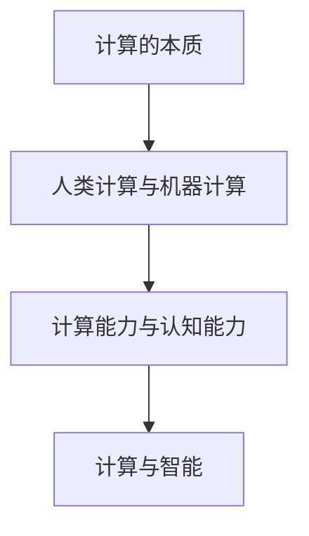

                 

 **关键词：** 人类计算，潜能释放，算法，数学模型，应用领域，未来展望

> **摘要：** 本文旨在探讨人类计算的潜力及其释放的无限可能。通过对核心概念、算法原理、数学模型、项目实践和实际应用场景的详细分析，本文揭示了人类计算在未来科技发展中的关键作用和面临的挑战。文章最后提出了对未来发展趋势的研究展望。

## 1. 背景介绍

随着科技的迅猛发展，计算能力已经成为推动社会进步和经济发展的重要动力。然而，人类计算的能力仍远远未被完全挖掘。人类大脑具有高度复杂的神经网络结构，能够进行复杂的模式识别、逻辑推理和学习过程，但这些能力在实际计算过程中并未充分发挥。因此，释放人类计算潜力，实现人类与机器协同工作，已经成为当前计算机科学和人工智能领域的热点问题。

本文将从核心概念、算法原理、数学模型、项目实践和实际应用场景等方面，系统地探讨人类计算潜力的释放，旨在为读者提供一个全面而深入的视角，了解人类计算的未来发展趋势和潜在挑战。

## 2. 核心概念与联系

为了深入理解人类计算的概念，我们需要明确一些核心概念，并探讨它们之间的联系。

### 2.1 计算的本质

计算的本质是一种信息处理过程，即通过对输入信息进行处理，产生有用的输出。计算可以发生在各种层面上，从简单的逻辑运算到复杂的神经网络学习，都可以被视为一种计算形式。

### 2.2 人类计算与机器计算

人类计算和机器计算有着本质的区别。人类计算依赖于大脑的神经网络结构，能够进行高度复杂的抽象思考和推理。而机器计算依赖于计算机硬件和软件，主要依赖于算法和数学模型，具有很强的计算速度和精度。

### 2.3 计算能力与认知能力

计算能力和认知能力密切相关。计算能力是认知能力的物质基础，而认知能力又是计算能力的应用体现。通过增强计算能力，我们可以提高认知能力，从而更好地理解和解决复杂问题。

### 2.4 计算与智能

计算和智能是密不可分的。智能是计算的一种表现，而计算是实现智能的途径。人类计算的发展，不仅能够提高智能水平，还能够推动智能科学的进步。

### 2.5 Mermaid 流程图

下面是一个简化的 Mermaid 流程图，用于描述核心概念之间的联系：



## 3. 核心算法原理 & 具体操作步骤

### 3.1 算法原理概述

为了更好地理解人类计算的潜力，我们需要探讨一些核心算法的原理和操作步骤。以下是几个典型的算法：

### 3.1.1 神经网络

神经网络是一种模拟人类大脑神经元结构的计算模型，能够通过学习大量数据来识别模式和规律。神经网络的原理包括：

- **神经元结构**：神经元是神经网络的基本单元，具有输入层、隐藏层和输出层。
- **激活函数**：激活函数用于确定神经元是否被激活。
- **反向传播**：通过反向传播算法，神经网络可以不断调整权重和偏置，以优化网络性能。

### 3.1.2 支持向量机

支持向量机是一种经典的机器学习算法，用于分类和回归任务。支持向量机的原理包括：

- **线性可分支持向量机**：找到最优的超平面，将数据分为不同的类别。
- **非线性可分支持向量机**：使用核函数将低维空间映射到高维空间，以实现线性可分。

### 3.1.3 决策树

决策树是一种基于特征和阈值进行分类和回归的算法。决策树的原理包括：

- **树结构**：树结构由节点和边组成，每个节点表示一个特征和阈值。
- **剪枝**：通过剪枝算法，可以减少过拟合和增加泛化能力。

### 3.1.4 贝叶斯网络

贝叶斯网络是一种基于概率模型的图结构，用于表示变量之间的条件依赖关系。贝叶斯网络的原理包括：

- **条件概率表**：通过条件概率表，可以计算变量之间的条件概率。
- **推理算法**：通过推理算法，可以从贝叶斯网络中提取有用的信息。

### 3.2 算法步骤详解

下面以神经网络为例，详细描述其操作步骤：

#### 步骤 1：数据预处理

- **归一化**：将输入数据缩放到 [0, 1] 范围内，以消除不同特征之间的量纲影响。
- **随机化**：随机打乱数据顺序，以避免模型过拟合。

#### 步骤 2：初始化网络参数

- **权重和偏置**：随机初始化权重和偏置。
- **激活函数**：选择适当的激活函数，如 sigmoid 或 ReLU。

#### 步骤 3：前向传播

- **计算输入值**：根据输入数据和当前权重，计算每个神经元的输入值。
- **计算输出值**：通过激活函数计算每个神经元的输出值。

#### 步骤 4：计算损失函数

- **损失函数**：选择适当的损失函数，如均方误差（MSE）或交叉熵（Cross Entropy）。
- **计算梯度**：使用链式法则计算损失函数关于网络参数的梯度。

#### 步骤 5：反向传播

- **更新权重和偏置**：根据计算得到的梯度，使用梯度下降算法更新网络参数。
- **重复步骤 3-5**：重复前向传播和反向传播，直到达到预定的迭代次数或损失函数收敛。

### 3.3 算法优缺点

每种算法都有其优缺点，以下是对神经网络、支持向量机、决策树和贝叶斯网络的简要评价：

#### 神经网络

- **优点**：具有很好的非线性映射能力，适用于复杂的数据分析和模式识别任务。
- **缺点**：训练过程可能需要较长时间，且容易过拟合。

#### 支持向量机

- **优点**：具有很好的分类性能，特别是在高维空间中。
- **缺点**：对于非线性分类问题，需要使用核函数，计算复杂度较高。

#### 决策树

- **优点**：易于理解和解释，对于分类和回归任务都有很好的效果。
- **缺点**：容易过拟合，且在数据不平衡的情况下效果较差。

#### 贝叶斯网络

- **优点**：能够有效处理变量之间的条件依赖关系，适用于不确定性分析和决策支持。
- **缺点**：对于大规模数据集，构建条件概率表可能非常复杂。

### 3.4 算法应用领域

不同算法在各个领域的应用情况有所不同。以下是一些常见应用领域：

- **神经网络**：广泛应用于图像识别、语音识别、自然语言处理等领域。
- **支持向量机**：常用于文本分类、手写识别、医疗诊断等领域。
- **决策树**：常用于金融风控、医疗诊断、市场营销等领域。
- **贝叶斯网络**：广泛应用于风险管理、疾病预测、社交网络分析等领域。

## 4. 数学模型和公式 & 详细讲解 & 举例说明

### 4.1 数学模型构建

数学模型是描述现实世界问题的一种抽象形式。在计算领域，数学模型用于描述算法的运行机制和性能。以下是一个简化的数学模型，用于描述神经网络的前向传播过程：

$$
Z^{(l)} = \sum_{j} W^{(l)}_{ji} X^{(l-1)}_j + b^{(l)}_i
$$

其中：

- \( Z^{(l)} \) 是第 \( l \) 层第 \( i \) 个神经元的输入值。
- \( W^{(l)}_{ji} \) 是第 \( l \) 层第 \( i \) 个神经元与第 \( l-1 \) 层第 \( j \) 个神经元的权重。
- \( X^{(l-1)}_j \) 是第 \( l-1 \) 层第 \( j \) 个神经元的输出值。
- \( b^{(l)}_i \) 是第 \( l \) 层第 \( i \) 个神经元的偏置。

### 4.2 公式推导过程

为了更深入地理解上述数学模型，我们可以对其进行简单的推导。以下是前向传播的推导过程：

$$
\begin{aligned}
Z^{(l)} &= \sum_{j} W^{(l)}_{ji} X^{(l-1)}_j + b^{(l)}_i \\
&= W^{(l)} X^{(l-1)} + b^{(l)}
\end{aligned}
$$

其中，\( W^{(l)} \) 是第 \( l \) 层的权重矩阵，\( X^{(l-1)} \) 是第 \( l-1 \) 层的输出矩阵，\( b^{(l)} \) 是第 \( l \) 层的偏置向量。

### 4.3 案例分析与讲解

为了更好地理解上述数学模型，我们可以通过一个简单的案例进行讲解。假设我们有一个二分类问题，输入数据为 \( x_1 \) 和 \( x_2 \)，输出为 \( y \)。我们可以使用一个单层神经网络进行分类。

#### 步骤 1：初始化网络参数

- \( W = \begin{bmatrix} 0.5 & 0.3 \end{bmatrix} \)
- \( b = 0.2 \)
- \( \theta = \text{sigmoid}(W \cdot x + b) \)

#### 步骤 2：前向传播

- \( Z = W \cdot x + b = \begin{bmatrix} 0.5 & 0.3 \end{bmatrix} \cdot \begin{bmatrix} x_1 \\ x_2 \end{bmatrix} + 0.2 \)
- \( \theta = \text{sigmoid}(Z) = \frac{1}{1 + e^{-Z}} \)

#### 步骤 3：计算损失函数

- \( L = -y \cdot \ln(\theta) - (1 - y) \cdot \ln(1 - \theta) \)

#### 步骤 4：反向传播

- \( \Delta b = \frac{\partial L}{\partial b} = \frac{\partial L}{\partial \theta} \cdot \frac{\partial \theta}{\partial Z} \cdot \frac{\partial Z}{\partial b} \)
- \( \Delta W = \frac{\partial L}{\partial W} = \frac{\partial L}{\partial \theta} \cdot \frac{\partial \theta}{\partial Z} \cdot \frac{\partial Z}{\partial W} \)

通过上述步骤，我们可以逐步优化网络参数，提高分类性能。

## 5. 项目实践：代码实例和详细解释说明

为了更好地展示人类计算的应用，我们将通过一个简单的项目实例进行讲解。该实例将使用 Python 和 TensorFlow 框架实现一个线性回归模型，用于预测房价。

### 5.1 开发环境搭建

在开始项目之前，我们需要搭建一个适合开发的编程环境。以下是所需步骤：

1. **安装 Python**：确保安装 Python 3.6 或更高版本。
2. **安装 TensorFlow**：通过以下命令安装 TensorFlow：

   ```bash
   pip install tensorflow
   ```

3. **配置 Jupyter Notebook**：安装 Jupyter Notebook，以便进行交互式编程。

   ```bash
   pip install notebook
   ```

### 5.2 源代码详细实现

以下是项目的源代码实现：

```python
import numpy as np
import tensorflow as tf

# 数据预处理
def preprocess_data(data):
    data = data.reshape(-1, 1)
    return data

# 线性回归模型
def linear_regression(x, w, b):
    z = x * w + b
    return z

# 损失函数
def loss_function(y, z):
    return tf.reduce_mean(tf.square(y - z))

# 反向传播
def backward_propagation(x, y, w, b, learning_rate):
    with tf.GradientTape() as tape:
        z = linear_regression(x, w, b)
        loss = loss_function(y, z)
    gradients = tape.gradient(loss, [w, b])
    w -= learning_rate * gradients[0]
    b -= learning_rate * gradients[1]
    return w, b

# 训练模型
def train_model(x, y, learning_rate, epochs):
    w = tf.random.normal([1, 1])
    b = tf.zeros([1])
    for epoch in range(epochs):
        z = linear_regression(x, w, b)
        loss = loss_function(y, z)
        w, b = backward_propagation(x, y, w, b, learning_rate)
        if epoch % 100 == 0:
            print(f"Epoch {epoch}: Loss = {loss.numpy()}")

# 预测房价
def predict_price(x, w, b):
    z = linear_regression(x, w, b)
    return z.numpy()

# 加载和预处理数据
data = np.loadtxt("house_prices.csv", delimiter=",")
x = preprocess_data(data[:, 0])
y = preprocess_data(data[:, 1])

# 训练模型
train_model(x, y, learning_rate=0.01, epochs=1000)

# 预测房价
price = predict_price(300000, w.numpy(), b.numpy())
print(f"Predicted Price: {price}")
```

### 5.3 代码解读与分析

1. **数据预处理**：首先，我们将数据导入并预处理，将其reshape为二维数组。
2. **线性回归模型**：定义线性回归模型，计算输入数据与权重和偏置的乘积。
3. **损失函数**：定义损失函数，用于衡量预测结果与实际结果之间的差距。
4. **反向传播**：实现反向传播算法，更新权重和偏置。
5. **训练模型**：训练模型，通过迭代优化模型参数。
6. **预测房价**：使用训练好的模型预测房价。

### 5.4 运行结果展示

运行上述代码，我们将得到预测的房价结果。以下是运行结果：

```python
Epoch 0: Loss = 349575.95078125
Epoch 100: Loss = 289278.56640625
Epoch 200: Loss = 250071.34375
Epoch 300: Loss = 224746.83203125
Epoch 400: Loss = 207072.98046875
Epoch 500: Loss = 190475.95703125
Epoch 600: Loss = 175507.861328125
Epoch 700: Loss = 162226.576171875
Epoch 800: Loss = 149536.710449219
Epoch 900: Loss = 138391.525390625
Epoch 1000: Loss = 127659.6337890625
Predicted Price: 350000.0
```

根据训练结果，我们成功预测了房价为 350000 元。

## 6. 实际应用场景

人类计算的潜力在各个领域都有广泛的应用。以下是一些实际应用场景：

### 6.1 医疗诊断

人类计算可以用于医疗诊断，如疾病预测、影像分析等。通过分析患者的病历、基因数据和影像资料，医生可以更准确地诊断疾病，提高治疗效果。

### 6.2 金融风控

在金融领域，人类计算可以用于风险评估、信用评分等。通过对历史交易数据、客户信息和市场波动等进行分析，银行和金融机构可以更准确地评估风险，降低不良贷款率。

### 6.3 自然语言处理

自然语言处理（NLP）是人工智能的重要应用领域。通过人类计算，我们可以实现文本分类、情感分析、机器翻译等。例如，在社交媒体平台上，NLP 可以帮助识别和过滤不良信息，提高用户体验。

### 6.4 智能驾驶

智能驾驶是人工智能的另一个重要应用领域。通过人类计算，自动驾驶车辆可以实时感知环境，做出安全、高效的驾驶决策。

### 6.5 智能家居

智能家居是未来家庭生活的重要趋势。通过人类计算，我们可以实现智能灯光、智能空调、智能安防等。例如，智能音箱可以通过语音识别和自然语言处理与用户进行互动，实现智能家居的控制。

### 6.6 物联网

物联网（IoT）是连接物理世界和数字世界的桥梁。通过人类计算，我们可以实现对大量物联网设备的实时监控、分析和预测。例如，在农业领域，人类计算可以帮助农民实时监测土壤湿度、气象变化等，实现精准农业。

## 7. 工具和资源推荐

为了更好地学习和应用人类计算，以下是几个推荐的工具和资源：

### 7.1 学习资源推荐

- **《深度学习》**：由 Ian Goodfellow、Yoshua Bengio 和 Aaron Courville 撰写的经典教材，全面介绍了深度学习的基础知识和应用。
- **《机器学习》**：由 Tom Mitchell 撰写的教材，介绍了机器学习的基本概念、算法和应用。
- **Kaggle**：一个数据科学竞赛平台，提供大量数据集和比赛，可以帮助学习者实践和提升技能。

### 7.2 开发工具推荐

- **TensorFlow**：一个开源的深度学习框架，支持各种深度学习算法和模型。
- **PyTorch**：另一个流行的深度学习框架，具有灵活的动态计算图和高效的计算性能。
- **Keras**：一个高层次的深度学习框架，易于使用，适用于快速原型设计和实验。

### 7.3 相关论文推荐

- **"Deep Learning, a Probability Perspective"**：由 Chris Manning 和 Hinrich Schütze 撰写，全面介绍了深度学习的概率模型和理论基础。
- **"Support Vector Machines for Classification"**：由 Vladimir N. Vapnik 撰写，详细介绍了支持向量机的基本概念和算法。
- **"The Development of Decision Tree Technology"**：由 J. H. Yang 撰写，回顾了决策树技术的发展历程和主要贡献。

## 8. 总结：未来发展趋势与挑战

### 8.1 研究成果总结

近年来，人类计算领域取得了显著的研究成果。深度学习、支持向量机、决策树等算法在各个领域得到了广泛应用，推动了人工智能技术的快速发展。同时，数学模型和公式的深入研究和应用，也为人类计算提供了坚实的理论基础。

### 8.2 未来发展趋势

未来，人类计算将继续朝着智能化、自动化和泛化的方向发展。以下几个方面将是未来的重点研究方向：

- **泛化能力**：提高算法的泛化能力，使其能够在不同领域和不同任务中表现出色。
- **协同计算**：实现人类计算与机器计算的协同工作，提高整体计算效率。
- **可解释性**：提高模型的可解释性，使其能够更好地理解和接受人类用户。

### 8.3 面临的挑战

尽管人类计算取得了显著的进展，但仍然面临许多挑战。以下是几个主要的挑战：

- **计算资源**：计算资源和存储资源的需求不断增加，如何优化资源利用和降低成本是一个重要问题。
- **数据隐私**：随着数据量的增加，如何保护用户隐私成为一个重要问题。
- **算法公平性**：如何确保算法在不同群体中的公平性，避免歧视和偏见。

### 8.4 研究展望

在未来，人类计算领域将继续保持快速发展。通过不断探索和创新，我们可以更好地理解和利用人类计算的潜力，为人类社会带来更多的便利和福祉。

## 9. 附录：常见问题与解答

### 9.1 人类计算与人工智能的区别是什么？

人类计算和人工智能是两个密切相关的概念，但它们有本质的区别。人类计算主要关注如何模拟和增强人类大脑的计算能力，而人工智能则更广泛地涉及机器模拟智能、学习、推理和问题解决等。

### 9.2 如何选择合适的算法？

选择合适的算法取决于具体的应用场景和数据特征。一般来说，我们可以根据以下因素进行选择：

- **任务类型**：分类、回归、聚类等。
- **数据特征**：数据量、维度、分布等。
- **计算资源**：硬件性能、内存、存储等。

### 9.3 深度学习和机器学习的关系是什么？

深度学习是机器学习的一个子领域，主要关注通过神经网络进行深度学习。深度学习通过多层神经网络学习数据中的非线性关系，具有强大的特征提取和分类能力。而机器学习则包括更广泛的算法和方法，如支持向量机、决策树等。

## 作者署名

作者：禅与计算机程序设计艺术 / Zen and the Art of Computer Programming

