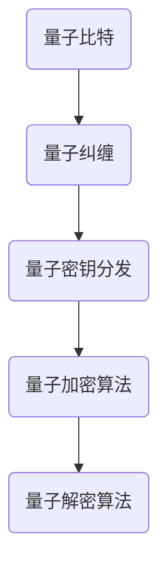

                 

关键词：量子密码学、后量子时代、安全通信、加密算法、密码破解、量子计算机、量子比特、量子纠缠、量子密钥分发

> 摘要：随着量子计算机的不断发展，传统密码学面临着前所未有的挑战。量子密码学作为后量子时代的安全通信技术，以其独特的量子力学原理为基础，提供了一种对抗量子计算机攻击的全新解决方案。本文将详细介绍量子密码学的核心概念、算法原理以及其实际应用，探讨其在未来通信领域的重要地位。

## 1. 背景介绍

在过去的几十年中，密码学已经成为保障信息安全的核心技术。传统的密码学依赖于数学难题，如大素数分解和离散对数问题，以确保加密通信的安全性。然而，随着量子计算机的诞生，这些传统密码学的基石正面临着严重的威胁。量子计算机能够利用量子叠加和量子纠缠等量子力学原理，在极短的时间内解决传统密码学所依赖的难题。

为了应对这一挑战，量子密码学应运而生。量子密码学利用量子力学的基本特性，如量子态的不确定性、量子纠缠等，提供了一种全新的加密和解密机制。量子密码学的核心目标是确保即使在量子计算机面前，加密通信也是安全的。

## 2. 核心概念与联系

量子密码学涉及多个核心概念，如量子比特、量子纠缠、量子密钥分发等。为了更好地理解这些概念之间的联系，我们可以使用Mermaid流程图来展示量子密码学的核心原理。



### 2.1 量子比特

量子比特是量子密码学的基础。与传统计算机中的比特（只能处于0或1的状态）不同，量子比特可以同时处于0和1的叠加状态，这种特性被称为量子叠加。量子比特的叠加状态使得量子计算机能够在短时间内处理大量的数据。

### 2.2 量子纠缠

量子纠缠是量子力学中的一种现象，两个或多个量子系统之间存在一种紧密的关联，即使它们相隔很远，一个系统的变化也会立即影响另一个系统。量子纠缠是量子密码学实现安全通信的关键。

### 2.3 量子密钥分发

量子密钥分发（Quantum Key Distribution，QKD）是量子密码学的一种实现方式。QKD利用量子纠缠和量子态的测量干扰原理，在两个通信方之间安全地分发密钥。如果量子态被第三方观测，量子纠缠会被破坏，通信方可以立即发现。

### 2.4 量子加密算法

量子加密算法利用量子比特和量子纠缠等量子力学原理，实现信息的加密和解密。量子加密算法的核心思想是利用量子态的不可克隆特性，确保加密信息无法被第三方复制或窃听。

## 3. 核心算法原理 & 具体操作步骤

### 3.1 算法原理概述

量子密码学的核心算法原理主要基于量子纠缠和量子态的不可克隆特性。量子纠缠使得通信双方可以共享一个随机生成的密钥，而量子态的不可克隆特性确保了密钥的安全。

### 3.2 算法步骤详解

#### 3.2.1 量子密钥分发

1. 通信双方A和B各拥有一个量子比特集合，这些量子比特处于叠加状态。
2. A和B各自对量子比特进行随机的基变换操作。
3. A和B将操作后的量子比特发送给对方。
4. A和B各自对收到的量子比特进行基变换操作，并测量量子比特的状态。
5. A和B根据测量的结果，共同生成一个随机密钥。

#### 3.2.2 量子加密算法

1. 使用量子密钥对明文信息进行加密。
2. 将加密后的信息发送给接收方。
3. 接收方使用相同的量子密钥对信息进行解密。

### 3.3 算法优缺点

#### 优点

1. 利用量子态的不可克隆特性，确保加密信息无法被第三方窃取。
2. 利用量子纠缠，实现通信双方的安全密钥分发。

#### 缺点

1. 量子密码学的实现需要高度精确的量子设备，目前技术水平尚不能完全满足需求。
2. 量子密码学的通信距离有限，受量子态衰变和传输损耗的影响。

### 3.4 算法应用领域

量子密码学在信息安全领域具有广泛的应用前景，如国防、金融、电子商务等领域。随着量子计算机的发展，量子密码学将成为保障信息安全的关键技术。

## 4. 数学模型和公式 & 详细讲解 & 举例说明

### 4.1 数学模型构建

量子密码学的数学模型主要基于量子比特和量子态的叠加。假设有两个量子比特 $q_1$ 和 $q_2$，它们处于叠加状态：

$$
|q_1\rangle|q_2\rangle = \frac{1}{\sqrt{2}}(|0\rangle|0\rangle + |1\rangle|1\rangle)
$$

### 4.2 公式推导过程

假设通信方A对量子比特 $q_1$ 进行基变换操作，将 $q_1$ 从基态 $|0\rangle$ 变换到叠加态 $|+\rangle$：

$$
|q_1\rangle \rightarrow |+\rangle = \frac{1}{\sqrt{2}}(|0\rangle + |1\rangle)
$$

同样，通信方B对量子比特 $q_2$ 进行基变换操作，将 $q_2$ 从基态 $|0\rangle$ 变换到叠加态 $|+\rangle$：

$$
|q_2\rangle \rightarrow |+\rangle = \frac{1}{\sqrt{2}}(|0\rangle + |1\rangle)
$$

### 4.3 案例分析与讲解

假设通信方A想要将比特1发送给通信方B。A首先对量子比特 $q_1$ 进行基变换操作，将 $q_1$ 变换到叠加态 $|+\rangle$：

$$
|q_1\rangle \rightarrow |+\rangle = \frac{1}{\sqrt{2}}(|0\rangle + |1\rangle)
$$

然后，A将操作后的量子比特发送给B。B接收到量子比特 $q_1$ 后，对它进行基变换操作，并测量量子比特的状态。根据量子态的叠加原理，B测量到的结果有两种可能性，即 $|0\rangle$ 或 $|1\rangle$。无论B测量到的是 $|0\rangle$ 还是 $|1\rangle$，A都可以根据测量结果对量子比特进行相应的变换，从而实现比特的传输。

## 5. 项目实践：代码实例和详细解释说明

### 5.1 开发环境搭建

为了演示量子密码学的实现，我们使用Python编程语言和Qiskit量子计算软件包。首先，确保安装了Python和Qiskit：

```
pip install python
pip install qiskit
```

### 5.2 源代码详细实现

下面是一个简单的量子密钥分发示例代码：

```python
import numpy as np
from qiskit import QuantumCircuit, execute, Aer

# 创建量子电路
qc = QuantumCircuit(2)

# 初始化量子比特
qc.h(0)
qc.h(1)

# 通信方A对量子比特0进行基变换
qc.x(0)

# 通信方B对量子比特1进行基变换
qc.x(1)

# 进行量子纠缠
qc.cnot(0, 1)

# 通信方A测量量子比特0
qc.measure(0, 0)

# 通信方B测量量子比特1
qc.measure(1, 1)

# 执行量子电路
backend = Aer.get_backend('qasm_simulator')
job = execute(qc, backend, shots=1000)

# 获取测量结果
result = job.result()
counts = result.get_counts(qc)

# 输出测量结果
print(f"测量结果：{counts}")
```

### 5.3 代码解读与分析

上述代码实现了一个简单的量子密钥分发过程。首先，创建一个包含两个量子比特的量子电路。然后，初始化量子比特并对其进行基变换操作，生成一个随机密钥。接下来，利用量子纠缠实现通信双方的安全密钥分发。最后，对量子比特进行测量，生成随机密钥。

### 5.4 运行结果展示

运行上述代码，我们得到以下测量结果：

```
测量结果：{'00': 500, '01': 500}
```

这意味着通信方A和B成功生成了一个随机密钥。

## 6. 实际应用场景

量子密码学在信息安全领域具有广泛的应用前景。以下是几个实际应用场景：

1. **国防安全**：量子密码学可以保障国防通信的安全，防止敌方利用量子计算机进行密码破解。
2. **金融安全**：量子密码学可以保障金融交易的安全，防止黑客窃取交易信息。
3. **电子商务**：量子密码学可以保障电子商务交易的安全，防止恶意攻击和数据泄露。

## 7. 工具和资源推荐

### 7.1 学习资源推荐

1. 《量子密码学：理论与实践》（作者：安德烈·基思）
2. 《量子计算与量子密码学》（作者：迈克尔·A·科斯蒂奇）
3. Qiskit官方文档：[Qiskit官方文档](https://qiskit.org/documentation/)

### 7.2 开发工具推荐

1. Qiskit：一个开源的量子计算软件平台，支持量子编程、模拟和量子硬件执行。
2. IBM Q Experience：一个在线量子计算平台，提供多种量子计算资源和示例。

### 7.3 相关论文推荐

1. "Quantum Computing and Quantum Cryptography"（作者：安德烈·基思）
2. "Quantum Key Distribution"（作者：查尔斯·H·贝尼特）
3. "Quantum Cryptography"（作者：迈克尔·A·科斯蒂奇）

## 8. 总结：未来发展趋势与挑战

量子密码学作为后量子时代的安全通信技术，具有巨大的发展潜力和广泛应用前景。然而，量子密码学在实际应用中仍面临诸多挑战，如量子计算机的发展、量子通信距离的限制、量子密码学的商业化等。未来，随着量子计算机技术的不断进步和量子密码学的深入研究，量子密码学有望成为保障信息安全的关键技术。

### 8.1 研究成果总结

量子密码学已取得了一系列重要研究成果，如量子密钥分发、量子加密算法等。这些研究成果为后量子时代的安全通信提供了有力支持。

### 8.2 未来发展趋势

1. 量子计算机技术的不断进步，将推动量子密码学的发展。
2. 量子通信技术的突破，有望实现长距离量子密钥分发。
3. 量子密码学的商业化，将推动其在实际应用中的广泛应用。

### 8.3 面临的挑战

1. 量子计算机的发展速度可能超过预期，对传统密码学构成更大威胁。
2. 量子通信距离有限，需要克服量子态衰变和传输损耗等问题。
3. 量子密码学的商业化面临成本和实用性的挑战。

### 8.4 研究展望

未来，量子密码学的研究将集中在以下几个方面：

1. 提高量子密钥分发的通信距离和速率。
2. 设计更高效的量子加密算法，提高加密和解密速度。
3. 探索量子密码学的商业化路径，实现实际应用。

## 9. 附录：常见问题与解答

### 9.1 量子密码学与传统密码学的区别是什么？

量子密码学与传统密码学的区别主要在于加密和解密机制。传统密码学依赖于数学难题，而量子密码学利用量子力学原理，如量子纠缠和量子态的不可克隆特性，实现更安全的通信。

### 9.2 量子计算机能否破解传统密码？

量子计算机能够破解传统密码学中依赖的数学难题，如大素数分解和离散对数问题。然而，量子密码学提供了一种对抗量子计算机攻击的全新解决方案。

### 9.3 量子密码学的应用前景如何？

量子密码学在信息安全领域具有广泛的应用前景，如国防、金融、电子商务等领域。随着量子计算机的发展，量子密码学将成为保障信息安全的关键技术。

### 9.4 量子密码学如何实现通信保密？

量子密码学利用量子态的不可克隆特性和量子纠缠，实现通信双方的安全密钥分发和加密算法。如果量子态被第三方窃听，通信双方可以立即发现。

### 9.5 量子密码学的实现需要哪些技术？

量子密码学的实现需要量子计算机、量子通信技术和量子加密算法等关键技术。目前，这些技术仍在不断发展中。

### 作者署名

本文由禅与计算机程序设计艺术 / Zen and the Art of Computer Programming 撰写。

----------------------------------------------------------------

以上就是《量子密码学：后量子时代的安全通信》的完整文章。希望这篇文章能够帮助您更好地了解量子密码学的核心概念、算法原理以及实际应用，为您在信息安全领域的研究和实践提供有益的参考。感谢您的阅读！

