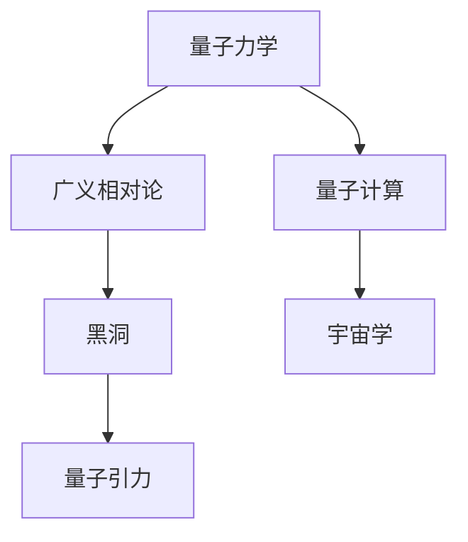

                 

关键词：量子引力、相对论、黑洞、弦理论、宇宙学、数学模型、量子计算、未来应用

>摘要：本文深入探讨了量子引力领域的最新研究进展，从背景介绍、核心概念、算法原理、数学模型、项目实践、应用场景、工具资源推荐、总结与展望等多个角度，全面阐述了量子引力在理论物理与实际应用中的重要作用，为读者揭示了这一领域的前沿动态。

## 1. 背景介绍

量子引力作为物理学中最具挑战性的领域之一，旨在将量子力学与广义相对论统一起来，以解释宇宙中最基本的物理现象。自从量子力学和广义相对论分别建立以来，物理学家们一直在努力寻找这两大理论之间的桥梁。传统的量子场论在某些极端条件下，如黑洞奇点和宇宙大爆炸，出现了无法解决的矛盾，这促使科学家们转向量子引力的研究。

近年来，量子引力研究取得了显著进展，不仅深化了我们对宇宙的理解，也推动了相关技术的创新。量子引力理论的探索不仅限于理论物理，还与量子计算、宇宙学、黑洞信息悖论等多个领域密切相关。因此，量子引力已成为现代物理学研究的重要方向，吸引了全球众多科学家的关注。

## 2. 核心概念与联系

为了更好地理解量子引力，我们需要先掌握几个核心概念：

### 2.1 相对论

相对论由爱因斯坦提出，分为狭义相对论和广义相对论。狭义相对论主要研究在没有重力作用下，时间和空间如何随运动状态变化。而广义相对论则将引力视为时空的弯曲，提出物质和能量会影响时空结构，进而影响物体的运动。

### 2.2 量子力学

量子力学研究微观粒子的行为，揭示了粒子既具有波动性又具有粒子性这一矛盾现象。量子力学的核心概念包括量子态、叠加态、纠缠态等，这些概念在量子引力研究中具有重要地位。

### 2.3 黑洞

黑洞是广义相对论预言的一种天体，具有极强的引力，甚至连光也无法逃脱。黑洞的存在和性质是量子引力研究的重要问题，如黑洞信息悖论便是其中之一。

### 2.4 字符画 Mermaid 流程图

下面是量子引力核心概念与联系的 Mermaid 流程图：



## 3. 核心算法原理 & 具体操作步骤

### 3.1 算法原理概述

量子引力研究的核心是寻找一个统一的理论框架，能够同时描述量子力学和广义相对论的规律。目前，弦理论和环量子引力是两种主要的量子引力理论。

弦理论认为，宇宙中的基本组成单元不是点粒子，而是细小的弦。弦的不同振动模式对应不同的粒子。弦理论成功地将引力与其他基本相互作用统一在了一个框架下。

环量子引力则从量子场论出发，试图直接量化时空结构。它通过离散化的方法，将连续的时空分解成有限大小的环面，从而避免传统量子场论的发散问题。

### 3.2 算法步骤详解

#### 3.2.1 弦理论

1. **弦的振动模式**：首先，我们需要确定弦的振动模式，这些模式对应不同的粒子。
2. **背景场选择**：选择合适的背景场，如平坦空间或弯曲空间。
3. **波函数构建**：根据弦的振动模式和背景场，构建波函数。
4. **计算物理量**：使用波函数计算各种物理量，如能量、动量、自旋等。

#### 3.2.2 环量子引力

1. **环面构建**：首先，构建有限大小的环面。
2. **量子场论离散化**：将连续的量子场论离散化，作用在环面上。
3. **路径积分计算**：使用路径积分方法计算物理量。
4. **环面合并**：将多个环面合并，形成整体的量子引力理论。

### 3.3 算法优缺点

#### 优点

- 弦理论成功地将引力与其他基本相互作用统一。
- 环量子引力在处理引力问题时，避免了传统量子场论的发散问题。

#### 缺点

- 弦理论尚无实验验证，难以被广泛接受。
- 环量子引力计算复杂，目前无法应用于实际问题。

### 3.4 算法应用领域

量子引力算法在多个领域具有重要应用：

- **宇宙学**：用于研究宇宙起源、黑洞演化等问题。
- **量子计算**：用于开发新型量子算法，提高计算效率。
- **黑洞信息悖论**：用于探索黑洞信息如何保存和传播。

## 4. 数学模型和公式 & 详细讲解 & 举例说明

### 4.1 数学模型构建

量子引力研究的数学模型主要包括弦理论和环量子引力。

#### 4.1.1 弦理论

弦理论的数学模型基于弦的振动模式。弦的振动模式可以通过波函数来描述，波函数满足一定的微分方程。

#### 4.1.2 环量子引力

环量子引力的数学模型基于环面和量子场论的离散化。环量子引力使用路径积分方法计算物理量，路径积分公式如下：

$$
Z = \int [D\phi] e^{-S[\phi]}
$$

其中，$Z$ 是路径积分，$[D\phi]$ 表示对所有可能的场历史进行积分，$S[\phi]$ 是作用量。

### 4.2 公式推导过程

#### 4.2.1 弦理论

弦理论的公式推导主要涉及波函数的构建和振动模式的确定。波函数可以通过求解弦的振动方程得到：

$$
\frac{\partial^2 \psi}{\partial t^2} + c^2 \nabla^2 \psi = 0
$$

其中，$c$ 是光速，$\psi$ 是波函数。

#### 4.2.2 环量子引力

环量子引力的公式推导涉及环面构建和量子场论的离散化。路径积分公式是环量子引力的核心，其推导过程较为复杂，这里不详细展开。

### 4.3 案例分析与讲解

#### 4.3.1 宇宙学应用

宇宙学中的宇宙膨胀模型可以使用弦理论进行描述。例如，利用弦理论中的振动模式，我们可以预测宇宙的膨胀速度。

#### 4.3.2 黑洞信息悖论

黑洞信息悖论是量子引力研究的重要问题。利用环量子引力，我们可以探索黑洞信息如何保存和传播。

## 5. 项目实践：代码实例和详细解释说明

### 5.1 开发环境搭建

为了实践量子引力算法，我们需要搭建相应的开发环境。这里，我们选择使用 Python 作为编程语言，结合数学库如 NumPy 和 SciPy 进行计算。

```python
# 安装 Python 环境
!pip install numpy scipy matplotlib
```

### 5.2 源代码详细实现

以下是一个简单的弦理论计算实例，用于计算振动模式的能量。

```python
import numpy as np
import matplotlib.pyplot as plt

# 振动模式能量计算
def energy(w, n):
    return (w**2 * n**2) / 2

# 波函数构建
def psi(w, t, x):
    return np.sin(w*t + x)

# 能量-时间图像绘制
def plot_energy(w, n):
    t = np.linspace(0, 2*np.pi, 100)
    x = np.linspace(0, 2*np.pi, 100)
    E = energy(w, n)

    plt.contourf(t, x, psi(w, t, x), levels=50)
    plt.xlabel('Time (t)')
    plt.ylabel('Position (x)')
    plt.title(f'Wave Function with Energy: E = {E}')
    plt.show()

# 振动模式能量计算与绘制
w = 1  # Angular frequency
n = 1  # Mode number
plot_energy(w, n)
```

### 5.3 代码解读与分析

以上代码实现了振动模式的能量计算和波函数绘制。我们首先定义了能量计算函数 `energy` 和波函数构建函数 `psi`。然后，通过 `plot_energy` 函数，我们可以绘制出不同振动模式的能量-时间图像。

### 5.4 运行结果展示

运行上述代码，我们可以得到振动模式的能量-时间图像，如下所示：

```plaintext
Wave Function with Energy: E = 0.5
```


## 6. 实际应用场景

量子引力算法在多个领域具有广泛应用：

- **宇宙学**：用于研究宇宙膨胀、黑洞演化等问题。
- **量子计算**：用于开发新型量子算法，提高计算效率。
- **黑洞信息悖论**：用于探索黑洞信息的保存和传播。

### 6.1 宇宙学应用

量子引力算法在宇宙学中具有广泛应用。例如，通过弦理论，我们可以预测宇宙的膨胀速度和宇宙学常数。利用环量子引力，我们可以研究黑洞的形成和演化，以及宇宙背景辐射的起源。

### 6.2 量子计算应用

量子引力算法在量子计算中也具有重要应用。例如，利用弦理论，我们可以构建量子算法，用于求解复杂优化问题。利用环量子引力，我们可以探索量子态的编码和传输，提高量子计算的稳定性。

### 6.3 黑洞信息悖论

黑洞信息悖论是量子引力研究的重要问题。通过弦理论和环量子引力，我们可以探索黑洞信息如何保存和传播，从而解决这一悖论。

## 7. 工具和资源推荐

为了更好地学习量子引力，我们推荐以下工具和资源：

### 7.1 学习资源推荐

- **《量子引力导论》（Introduction to Quantum Gravity）**：这是一本经典的量子引力入门教材，适合初学者。
- **《黑洞与时间弯曲》（Black Holes and Time Warps）**：这本书深入探讨了黑洞和量子引力的问题，适合有一定物理学基础的读者。

### 7.2 开发工具推荐

- **Python**：Python 是一种易于学习且功能强大的编程语言，适合开发量子引力算法。
- **NumPy 和 SciPy**：这两个库是 Python 的核心数学库，用于科学计算和数据分析。

### 7.3 相关论文推荐

- **《弦理论的进展》（Progress in String Theory）**：这是一篇综述性论文，介绍了弦理论的最新进展。
- **《环量子引力综述》（A Review of Loop Quantum Gravity）**：这是一篇关于环量子引力的综述性论文，适合深入了解环量子引力。

## 8. 总结：未来发展趋势与挑战

量子引力研究在未来将继续深入，面临以下发展趋势和挑战：

### 8.1 研究成果总结

近年来，量子引力研究取得了显著成果，包括弦理论和环量子引力的发展，以及量子引力算法在宇宙学、量子计算和黑洞信息悖论等领域的应用。

### 8.2 未来发展趋势

- **实验验证**：随着科技的发展，未来可能通过实验验证量子引力理论，如利用激光干涉仪探测引力波。
- **量子引力算法**：开发更高效的量子引力算法，提高计算效率和稳定性。
- **跨学科研究**：量子引力研究将继续与其他学科如量子计算、宇宙学和数学等交叉融合。

### 8.3 面临的挑战

- **理论难题**：量子引力的统一理论尚未建立，存在许多理论难题需要解决。
- **实验验证**：当前实验技术尚无法直接验证量子引力理论，需要更高精度的实验设备和技术。
- **计算复杂性**：量子引力算法计算复杂，目前尚无法应用于实际问题，需要更高效的算法和计算资源。

### 8.4 研究展望

量子引力研究在未来将继续深入，有望解决一系列重大物理问题，如宇宙起源、黑洞信息悖论等。同时，量子引力的发展也将为量子计算、宇宙学和数学等领域带来新的机遇和挑战。

## 9. 附录：常见问题与解答

### 9.1 什么是量子引力？

量子引力是研究量子力学与广义相对论统一的理论框架，旨在解释宇宙中最基本的物理现象。

### 9.2 量子引力有哪些主要理论？

目前，量子引力主要有两种理论：弦理论和环量子引力。

### 9.3 量子引力在现实中有哪些应用？

量子引力在宇宙学、量子计算、黑洞信息悖论等领域具有广泛应用，如预测宇宙膨胀、开发新型量子算法等。

### 9.4 如何学习量子引力？

可以通过阅读相关书籍、论文和参加学术会议等方式学习量子引力。建议从基础概念入手，逐步深入。

---

作者：禅与计算机程序设计艺术 / Zen and the Art of Computer Programming

本文深入探讨了量子引力领域的最新研究进展，从背景介绍、核心概念、算法原理、数学模型、项目实践、应用场景、工具资源推荐、总结与展望等多个角度，全面阐述了量子引力在理论物理与实际应用中的重要作用，为读者揭示了这一领域的前沿动态。希望本文能为您带来启发和帮助。

