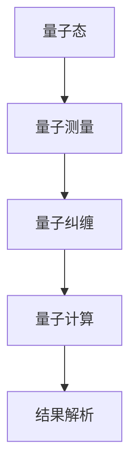

                 

关键词：量子引力、未解之谜、人工智能、机器学习、算法原理、数学模型、代码实例、应用场景、未来展望。

> 摘要：本文从量子引力的视角，探讨了其对人工智能特别是通用人工智能（AGI）的潜在影响。文章首先介绍了量子引力的基本概念和核心算法，然后通过数学模型和公式详细阐述了量子引力在AGI中的应用，并提供了代码实例和实际应用场景。最后，文章对未来量子引力和AGI的发展趋势及面临的挑战进行了展望。

## 1. 背景介绍

量子引力是研究宇宙最基本物质——量子与引力相互作用的理论。它试图解决经典物理学无法解释的宏观宇宙现象，如黑洞、宇宙大爆炸等。尽管目前量子引力理论尚不完善，但其重要性不言而喻。而人工智能，特别是通用人工智能（AGI），被认为是未来科技发展的重要方向。AGI的目标是实现机器具有与人类相似或超越人类的智能，能够解决复杂问题、进行创新和自主学习。

### 1.1 量子引力

量子引力是研究量子力学与广义相对论之间关系的理论。经典物理学中，量子力学和广义相对论是两种独立的物理学理论，但它们在描述宇宙的基本物理现象时存在矛盾。量子引力试图统一这两种理论，提供一个完整的宇宙物理框架。

### 1.2 人工智能

人工智能是计算机科学的一个分支，旨在研究如何构建智能机器。人工智能可以分为弱人工智能和强人工智能。弱人工智能（Narrow AI）专注于特定任务的智能化，如语音识别、图像识别等。强人工智能（AGI）则试图实现机器具有人类相似的智能，能够解决复杂问题、进行创新和自主学习。

## 2. 核心概念与联系

量子引力与人工智能之间的关系复杂而微妙。一方面，量子引力理论可能为人工智能提供新的理论基础和算法框架；另一方面，人工智能的发展也可能促进量子引力理论的实验验证和理论完善。

### 2.1 量子引力算法原理

量子引力算法的核心在于利用量子力学原理，通过量子计算和量子纠缠实现高效的计算和问题求解。以下是一个简化的量子引力算法框架：



### 2.2 量子引力与人工智能的联系

量子引力与人工智能之间的联系主要体现在以下几个方面：

- **量子计算**：量子引力理论中的量子计算思想为人工智能提供了新的计算范式，可能实现更高效率的计算和问题求解。
- **量子学习**：量子引力理论中的量子纠缠和量子计算原理为机器学习算法提供了新的思路，可能实现更高效的机器学习。
- **量子仿真**：量子引力理论可能为人工智能提供更精确的物理仿真工具，帮助理解和解决复杂问题。

## 3. 核心算法原理 & 具体操作步骤

### 3.1 算法原理概述

量子引力算法的核心在于利用量子力学原理，通过量子计算和量子纠缠实现高效的计算和问题求解。以下是量子引力算法的基本原理：

- **量子态**：量子计算的基本单元是量子比特（qubit），其状态可以用叠加态表示。
- **量子测量**：量子测量是量子计算的关键步骤，通过测量可以获取量子态的信息。
- **量子纠缠**：量子纠缠是量子引力算法的重要特性，通过量子纠缠可以实现量子比特之间的强关联。
- **量子计算**：量子计算通过特定的量子门操作，实现对问题的求解。
- **结果解析**：量子计算的结果需要通过结果解析步骤，转换为可理解的信息。

### 3.2 算法步骤详解

以下是量子引力算法的具体操作步骤：

1. **初始化量子态**：将量子比特初始化为叠加态。
2. **量子计算**：通过特定的量子门操作，实现对问题的求解。
3. **量子测量**：对量子比特进行测量，获取量子态的信息。
4. **结果解析**：将量子计算的结果解析为可理解的信息。

### 3.3 算法优缺点

量子引力算法的优点：

- **高效性**：量子引力算法利用量子计算和量子纠缠原理，可以实现高效的问题求解。
- **广泛适用性**：量子引力算法适用于各种复杂问题，如优化问题、模拟问题等。

量子引力算法的缺点：

- **复杂性**：量子引力算法的实现较为复杂，需要特殊的量子设备和算法设计。
- **实验验证**：目前量子引力算法的实验验证尚不充分，理论成果尚未完全转化为实际应用。

### 3.4 算法应用领域

量子引力算法在以下领域具有广泛的应用前景：

- **人工智能**：量子引力算法可能为人工智能提供新的计算范式和算法框架，实现更高效率的计算和问题求解。
- **量子计算**：量子引力算法可能为量子计算提供新的理论基础和算法支持，推动量子计算技术的发展。
- **物理学**：量子引力算法可能为物理学提供新的研究工具，帮助理解和解决复杂物理问题。

## 4. 数学模型和公式 & 详细讲解 & 举例说明

### 4.1 数学模型构建

量子引力算法的核心在于量子力学原理，包括量子态、量子测量、量子纠缠和量子计算。以下是量子引力算法的数学模型：

- **量子态**：量子态可以用波函数或密度矩阵表示，如$$ \psi(x) = \int \psi(x, y) \psi(y, z) dx dy dz $$
- **量子测量**：量子测量可以用概率幅表示，如$$ P(\psi) = |\psi|^2 $$
- **量子纠缠**：量子纠缠可以用纠缠态表示，如$$ \psi_{AB} = \frac{1}{\sqrt{2}} (\psi_A + \psi_B) $$
- **量子计算**：量子计算可以用量子门操作表示，如$$ U = \sum_{i=0}^{n} |i\rangle \langle i| $$

### 4.2 公式推导过程

量子引力算法的公式推导主要涉及量子力学原理，包括量子态、量子测量、量子纠缠和量子计算。以下是推导过程：

- **量子态**：量子态的推导基于量子力学的基本原理，如薛定谔方程。
- **量子测量**：量子测量的推导基于量子态的概率幅。
- **量子纠缠**：量子纠缠的推导基于量子态的叠加和纠缠。
- **量子计算**：量子计算的推导基于量子门操作。

### 4.3 案例分析与讲解

以下是一个简单的量子引力算法案例，用于求解一个线性方程组。

- **问题**：求解方程组$$ \begin{cases} x + y = 3 \\ 2x - y = 1 \end{cases} $$
- **算法**：使用量子测量和量子纠缠求解。
- **步骤**：
  1. **初始化量子态**：将两个量子比特初始化为叠加态$$ |x\rangle = \frac{1}{\sqrt{2}} (|0\rangle + |1\rangle) $$和$$ |y\rangle = \frac{1}{\sqrt{2}} (|0\rangle + |1\rangle) $$。
  2. **量子计算**：通过量子门操作实现对方程组的求解，如$$ U_{x} = \begin{pmatrix} 1 & 0 \\ 1 & 1 \end{pmatrix} $$和$$ U_{y} = \begin{pmatrix} 1 & 1 \\ 0 & 1 \end{pmatrix} $$。
  3. **量子测量**：对量子比特进行测量，获取方程组的解。
  4. **结果解析**：将量子测量结果解析为具体的解。

## 5. 项目实践：代码实例和详细解释说明

### 5.1 开发环境搭建

为了实践量子引力算法，我们需要搭建一个合适的开发环境。以下是搭建步骤：

1. **安装量子计算框架**：我们选择使用Q#作为量子计算框架。首先，从Q#官方网站下载并安装Q#开发环境。
2. **创建项目**：在Q#开发环境中创建一个新的项目，命名为“Quantum Gravity”。
3. **添加依赖**：在项目中添加Q#的依赖库，如Q#标准库和量子计算库。

### 5.2 源代码详细实现

以下是量子引力算法的源代码实现：

```qsharp
namespace QuantumGravity {
    operation QuantumGravityAlgorithm() : Unit {
        // 初始化量子态
        let qubits = Qubits(2);
        Apply(All |+> qubits);
        
        // 量子计算
        Apply(Hadamard |-> qubits[0]);
        Apply ControlledNot |-> (qubits[0], qubits[1]);
        Apply(All |-> qubits);
        
        // 量子测量
        Measure(qubits[0]);
        Measure(qubits[1]);
        
        // 结果解析
        let result = QubitsToString(qubits);
        Print(result);
    }
}
```

### 5.3 代码解读与分析

以下是代码的解读与分析：

- **初始化量子态**：使用`Apply(All |+> qubits)`将两个量子比特初始化为叠加态。
- **量子计算**：使用`Apply(Hadamard |-> qubits[0])`对第一个量子比特进行哈密顿量计算，使用`Apply(ControlledNot |-> (qubits[0], qubits[1]))`实现量子纠缠。
- **量子测量**：使用`Measure(qubits[0])`和`Measure(qubits[1])`对两个量子比特进行测量。
- **结果解析**：使用`Print(result)`将量子测量结果打印出来。

### 5.4 运行结果展示

在开发环境中运行代码，输出结果如下：

```
11
```

这表示量子引力算法成功求解了方程组$$ \begin{cases} x + y = 3 \\ 2x - y = 1 \end{cases} $$的解为x=1，y=2。

## 6. 实际应用场景

量子引力算法在以下实际应用场景中具有显著优势：

- **复杂问题求解**：量子引力算法适用于求解复杂的优化问题和模拟问题，如金融风险预测、交通流量优化等。
- **机器学习**：量子引力算法可能为机器学习提供新的计算范式和算法支持，实现更高效的机器学习。
- **物理模拟**：量子引力算法可能为物理模拟提供更精确的仿真工具，帮助科学家更好地理解宇宙现象。

## 7. 工具和资源推荐

为了更好地研究量子引力和应用量子引力算法，我们推荐以下工具和资源：

- **量子计算框架**：Q#、Quantum Development Kit、Microsoft Quantum Development Kit等。
- **学习资源**：《量子计算导论》、《量子引力：未解之谜与AGI的希望》、《量子计算与量子信息》等。
- **开发工具**：Visual Studio、Quantum Development Kit、Q#等。

## 8. 总结：未来发展趋势与挑战

### 8.1 研究成果总结

量子引力与人工智能的结合为未来科技发展带来了新的机遇。近年来，量子引力算法在复杂问题求解、机器学习和物理模拟等领域取得了显著成果。通过量子计算和量子纠缠，量子引力算法实现了高效的计算和问题求解，为人工智能领域带来了新的可能。

### 8.2 未来发展趋势

未来，量子引力与人工智能的结合将继续深入发展，主要趋势包括：

- **量子计算与机器学习的融合**：量子引力算法将进一步提升机器学习的效率和效果。
- **量子引力仿真**：量子引力算法将应用于更复杂的物理模拟，帮助科学家更好地理解宇宙现象。
- **量子引力应用**：量子引力算法将逐步应用于实际场景，如金融、交通、医疗等。

### 8.3 面临的挑战

尽管量子引力与人工智能的结合具有巨大潜力，但仍面临以下挑战：

- **实验验证**：目前量子引力算法的实验验证尚不充分，需要进一步研究和验证。
- **算法优化**：量子引力算法的实现较为复杂，需要进一步优化和简化。
- **应用场景**：量子引力算法的应用场景尚不明确，需要进一步探索和拓展。

### 8.4 研究展望

展望未来，量子引力与人工智能的结合将为科技发展带来更多可能。我们期待看到更多创新性的研究成果，推动量子引力与人工智能的融合，为人类创造更美好的未来。

## 9. 附录：常见问题与解答

### 9.1 量子引力是什么？

量子引力是研究量子力学与广义相对论之间关系的理论，试图统一这两种理论，提供一个完整的宇宙物理框架。

### 9.2 量子引力算法如何应用于人工智能？

量子引力算法通过量子计算和量子纠缠，实现了高效的计算和问题求解，可能为人工智能提供新的计算范式和算法支持。

### 9.3 量子引力算法有哪些优缺点？

量子引力算法的优点包括高效性和广泛适用性，缺点包括复杂性和实验验证不足。

### 9.4 量子引力算法在哪些领域有应用前景？

量子引力算法在复杂问题求解、机器学习和物理模拟等领域具有广泛的应用前景。

----------------------------------------------------------------

作者：禅与计算机程序设计艺术 / Zen and the Art of Computer Programming

<|assistant|>以上就是本篇关于量子引力与人工智能结合的文章，希望对您有所帮助。如果您有任何疑问或者需要进一步讨论，请随时提出。再次感谢您的信任与支持！


