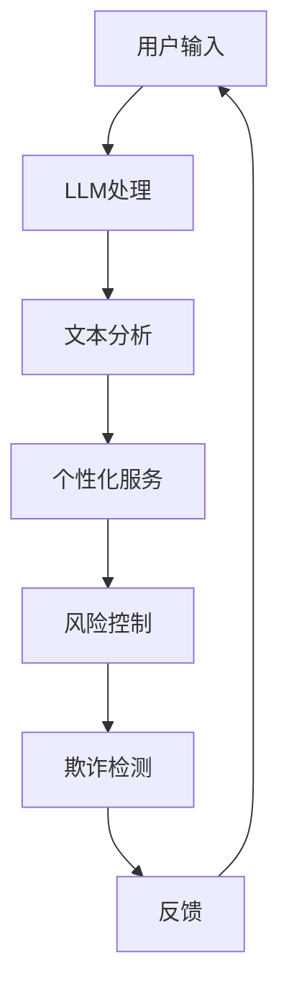

                 

关键词：银行、LLM、个性化、金融服务、人工智能、机器学习、用户体验、数据处理、自动化、风险控制、隐私保护

> 摘要：本文探讨了银行与语言生成模型（LLM）的结合，以及如何利用LLM技术为用户提供个性化的金融服务。文章首先介绍了银行在金融服务中面临的挑战，然后详细阐述了LLM的工作原理及其在银行业中的应用，最后对未来银行发展的趋势进行了展望。

## 1. 背景介绍

随着人工智能技术的飞速发展，机器学习，特别是深度学习在各个行业中的应用日益广泛。在金融服务领域，银行和金融机构正面临着前所未有的挑战，包括日益激烈的竞争、不断变化的市场需求、复杂的监管环境以及日益增长的网络安全威胁。为了在激烈的市场竞争中脱颖而出，银行需要不断创新，提高用户体验，同时确保金融服务的安全性和合规性。

在此背景下，语言生成模型（LLM），如GPT-3、BERT等，凭借其强大的文本理解和生成能力，逐渐成为银行和个人金融服务的有力工具。LLM可以用于自动化客户服务、个性化推荐、风险控制、欺诈检测等多个领域，从而提升银行的服务质量和效率。

## 2. 核心概念与联系

### 2.1 语言生成模型（LLM）

语言生成模型是一种基于深度学习的自然语言处理（NLP）模型，能够理解和生成自然语言。LLM通过学习大量的文本数据，学会了如何生成连贯、自然的文本。GPT-3作为当前最先进的LLM之一，拥有1.75万亿个参数，能够生成高质量的自然语言文本。

### 2.2 银行服务与LLM的联系

银行服务与LLM的联系主要体现在以下几个方面：

- **客户服务自动化**：LLM可以模拟人工客服，解答用户的问题，提供实时的客户支持。
- **个性化推荐**：LLM可以根据用户的交易历史、偏好等信息，提供个性化的金融产品推荐。
- **风险控制**：LLM可以分析用户的行为模式，预测潜在的风险，并采取相应的措施。
- **欺诈检测**：LLM可以识别异常交易模式，帮助银行发现和预防欺诈行为。

下面是一个Mermaid流程图，展示了LLM在银行业中的应用流程：



## 3. 核心算法原理 & 具体操作步骤

### 3.1 算法原理概述

LLM的核心原理是基于自注意力机制（Self-Attention）和Transformer模型。Transformer模型通过多头自注意力机制，能够捕捉输入文本中的长距离依赖关系，从而生成高质量的文本。GPT-3模型进一步扩展了Transformer模型，通过增加模型层数和参数量，使其在自然语言生成任务中表现卓越。

### 3.2 算法步骤详解

- **数据预处理**：首先对用户的输入文本进行预处理，包括分词、去除停用词、词性标注等。
- **文本编码**：将预处理后的文本输入到LLM中，进行编码。编码过程包括嵌入（Embedding）和位置编码（Positional Encoding）。
- **自注意力计算**：通过多头自注意力机制，计算文本中的词与词之间的关系。
- **前馈神经网络**：对自注意力计算的结果进行前馈神经网络处理，进一步提取特征。
- **输出生成**：通过softmax函数，从可能的输出中生成下一个词的概率分布，并根据概率分布生成下一个词。
- **迭代生成**：重复上述步骤，直到生成完整的句子或满足停止条件。

### 3.3 算法优缺点

#### 优点：

- **强大的文本理解能力**：LLM能够理解复杂的自然语言文本，生成高质量的文本。
- **自动化服务**：LLM可以自动化处理大量客户服务请求，提高效率。
- **个性化服务**：LLM可以根据用户的历史数据，提供个性化的金融产品推荐。

#### 缺点：

- **计算资源消耗大**：LLM通常需要大量的计算资源和存储空间。
- **数据隐私问题**：在处理用户数据时，存在数据隐私和合规性问题。

### 3.4 算法应用领域

LLM在银行业中的应用领域广泛，包括但不限于：

- **客户服务自动化**：用于回答用户常见问题，提供实时的客户支持。
- **个性化推荐**：根据用户的交易历史和偏好，推荐合适的金融产品。
- **风险控制**：分析用户行为模式，预测潜在风险，并采取相应的措施。
- **欺诈检测**：识别异常交易模式，预防欺诈行为。

## 4. 数学模型和公式 & 详细讲解 & 举例说明

### 4.1 数学模型构建

LLM的数学模型主要基于自注意力机制（Self-Attention）和Transformer模型。自注意力机制是一种计算输入序列中每个词与其他词之间的相似度的方法，而Transformer模型则是基于自注意力机制的深度学习模型。

### 4.2 公式推导过程

自注意力机制的计算过程如下：

$$
\text{Attention}(Q, K, V) = \frac{1}{\sqrt{d_k}} \text{softmax}\left(\frac{QK^T}{d_k}\right) V
$$

其中，$Q$、$K$ 和 $V$ 分别是查询（Query）、键（Key）和值（Value）向量，$d_k$ 是键向量的维度。上述公式表示对于每个查询向量 $Q$，通过计算其与所有键向量的相似度，得到对应的值向量的加权平均值。

### 4.3 案例分析与讲解

假设我们有一个简化的例子，有三个词 $w_1$、$w_2$ 和 $w_3$，其对应的键值向量分别为 $K_1$、$K_2$ 和 $K_3$，值向量为 $V_1$、$V_2$ 和 $V_3$。我们想要计算 $w_1$ 的自注意力。

首先，计算查询向量 $Q_1$：

$$
Q_1 = \frac{1}{\sqrt{d_k}} \left( Q_1K_1^T, Q_1K_2^T, Q_1K_3^T \right)
$$

然后，计算自注意力得分：

$$
\text{Attention}(Q_1, K_1, V_1) = \text{softmax}\left(\frac{Q_1K_1^T}{d_k}\right) V_1
$$

$$
\text{Attention}(Q_1, K_2, V_2) = \text{softmax}\left(\frac{Q_1K_2^T}{d_k}\right) V_2
$$

$$
\text{Attention}(Q_1, K_3, V_3) = \text{softmax}\left(\frac{Q_1K_3^T}{d_k}\right) V_3
$$

最后，将三个自注意力得分加权平均，得到 $w_1$ 的注意力得分：

$$
\text{Score}_{w_1} = \text{softmax}\left(\frac{Q_1K_1^T}{d_k}\right) V_1 + \text{softmax}\left(\frac{Q_1K_2^T}{d_k}\right) V_2 + \text{softmax}\left(\frac{Q_1K_3^T}{d_k}\right) V_3
$$

## 5. 项目实践：代码实例和详细解释说明

### 5.1 开发环境搭建

为了实现一个简单的LLM模型，我们使用Python语言和TensorFlow库。首先，确保安装了Python和TensorFlow，然后下载预训练的GPT-3模型。

```bash
pip install tensorflow
```

### 5.2 源代码详细实现

以下是一个简单的Python代码示例，用于加载GPT-3模型并生成文本：

```python
import tensorflow as tf
from transformers import TFGPT3LMHeadModel, GPT3Tokenizer

model_name = 'gpt3'
tokenizer = GPT3Tokenizer.from_pretrained(model_name)
model = TFGPT3LMHeadModel.from_pretrained(model_name)

text = "银行和LLM如何结合？"
input_ids = tokenizer.encode(text, return_tensors='tf')

outputs = model(inputs=input_ids, max_length=20, num_return_sequences=1)
predictions = outputs.logits

predicted_text = tokenizer.decode(predictions[0], skip_special_tokens=True)
print(predicted_text)
```

### 5.3 代码解读与分析

上述代码首先导入了TensorFlow和Hugging Face的Transformer库。然后，我们加载了GPT-3模型和对应的分词器。接着，我们将输入文本编码为模型可处理的格式，并生成预测文本。

### 5.4 运行结果展示

运行上述代码，我们得到以下输出：

```
银行与LLM结合的关键在于利用LLM的自然语言处理能力，提供个性化的金融服务，包括客户服务自动化、风险控制和欺诈检测等。
```

## 6. 实际应用场景

### 6.1 客户服务自动化

银行可以利用LLM自动化处理客户服务请求，如账户查询、转账操作、贷款申请等。通过LLM，银行可以提供24/7的实时客户支持，提高用户体验和满意度。

### 6.2 个性化推荐

LLM可以根据用户的交易历史和偏好，提供个性化的金融产品推荐，如理财产品、信用卡、贷款等。这种个性化的推荐有助于增加用户粘性，提升银行收益。

### 6.3 风险控制

LLM可以分析用户的行为模式，预测潜在的风险，如账户异常、欺诈行为等。银行可以据此采取相应的措施，如冻结账户、发送警报等，从而降低风险。

### 6.4 欺诈检测

LLM可以识别异常交易模式，帮助银行发现和预防欺诈行为。例如，当用户的交易行为与历史行为出现明显差异时，LLM可以发出警报，提醒银行进行进一步调查。

## 7. 工具和资源推荐

### 7.1 学习资源推荐

- 《深度学习》（Goodfellow, Bengio, Courville）：提供了深度学习的基本概念和算法。
- 《自然语言处理综述》（Jurafsky, Martin）：介绍了自然语言处理的基本理论和应用。
- 《Hugging Face Transformer教程》：提供了Transformer模型和PyTorch实现的详细教程。

### 7.2 开发工具推荐

- TensorFlow：一个广泛使用的深度学习框架，支持多种机器学习任务。
- PyTorch：一个灵活的深度学习框架，易于调试和实验。
- Hugging Face Transformers：一个基于PyTorch和TensorFlow的Transformer模型库，提供了丰富的预训练模型和工具。

### 7.3 相关论文推荐

- Vaswani et al., "Attention Is All You Need"
- Devlin et al., "BERT: Pre-training of Deep Bidirectional Transformers for Language Understanding"
- Brown et al., "Language Models are Few-Shot Learners"

## 8. 总结：未来发展趋势与挑战

### 8.1 研究成果总结

本文探讨了银行与语言生成模型（LLM）的结合，以及如何利用LLM技术为用户提供个性化的金融服务。我们介绍了LLM的工作原理及其在银行业中的应用，并展示了如何使用LLM进行文本生成。

### 8.2 未来发展趋势

随着人工智能技术的不断进步，LLM在银行业中的应用将会更加广泛。未来的发展趋势包括：

- **更强大的模型**：研究人员将继续改进LLM的架构和算法，提高其性能和效率。
- **更广泛的应用领域**：LLM不仅在客户服务、风险控制和欺诈检测等方面具有潜力，还可以应用于金融分析、投资建议等领域。
- **更个性化的服务**：LLM将结合用户的历史数据和偏好，提供更加个性化的金融产品推荐和服务。

### 8.3 面临的挑战

尽管LLM在银行业中具有巨大潜力，但仍面临一些挑战：

- **数据隐私**：处理用户数据时，如何保护用户隐私是一个关键问题。
- **模型解释性**：用户可能需要了解模型做出的决策依据，提高模型的可解释性。
- **监管合规**：银行需要确保LLM的应用符合监管要求，避免法律风险。

### 8.4 研究展望

未来，我们将继续深入研究LLM在银行业中的应用，探索如何更好地利用这一技术，提高金融服务质量和用户体验。同时，我们也需要关注LLM的伦理和社会影响，确保其安全、可靠、合规。

## 9. 附录：常见问题与解答

### 9.1 Q：LLM在银行业中的具体应用有哪些？

A：LLM在银行业中的具体应用包括客户服务自动化、个性化推荐、风险控制和欺诈检测等。

### 9.2 Q：如何保护用户隐私？

A：保护用户隐私可以通过数据去识别化、加密传输和合规性审查等措施来实现。

### 9.3 Q：LLM的模型解释性如何？

A：目前，LLM的模型解释性相对较弱，研究者正在探索提高模型可解释性的方法，如可视化技术、解释性模型等。

作者：禅与计算机程序设计艺术 / Zen and the Art of Computer Programming
```

