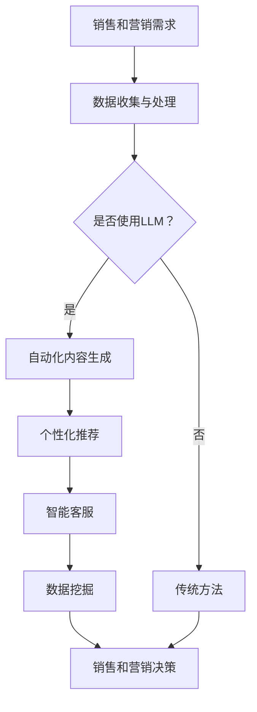

                 

关键词：销售和营销、LLM（大型语言模型）、策略、人工智能、客户体验、个性化、数据驱动、自动化

摘要：本文将探讨如何利用大型语言模型（LLM）来增强销售和营销策略。通过深入分析LLM的工作原理和应用，我们将揭示如何通过LLM实现销售和营销的智能化、个性化和高效化。文章将从背景介绍、核心概念与联系、核心算法原理与操作步骤、数学模型与公式、项目实践、实际应用场景、未来应用展望、工具和资源推荐、总结与展望等方面展开讨论。

## 1. 背景介绍

在过去的几十年里，销售和营销领域经历了巨大的变革。随着互联网的普及和大数据技术的发展，营销手段逐渐从传统的广告和促销转向以数据为基础的精准营销。然而，随着数据量的爆炸性增长，传统的营销方法已经难以满足企业对个性化、高效化、实时化的需求。此时，人工智能（AI）的出现为销售和营销领域带来了新的契机。

近年来，大型语言模型（LLM）的发展迅速，其在自然语言处理（NLP）领域取得了显著的成果。LLM通过对海量文本数据的学习，可以生成高质量的自然语言文本，为销售和营销提供了强大的支持。本文将探讨如何利用LLM来增强销售和营销策略，帮助企业实现更智能、更个性化和更高效的营销效果。

## 2. 核心概念与联系

### 2.1 大型语言模型（LLM）

大型语言模型（LLM）是一种基于深度学习的自然语言处理模型，能够通过学习大量的文本数据生成文本。LLM具有以下特点：

1. **强大的文本生成能力**：LLM能够生成高质量的自然语言文本，包括文章、对话、摘要等。
2. **多语言支持**：LLM可以支持多种语言的文本生成，实现跨语言的营销。
3. **自适应学习能力**：LLM能够通过不断学习新的数据来优化自己的生成能力。

### 2.2 销售和营销

销售和营销是企业的核心业务活动，其目的是通过各种手段促进产品或服务的销售。销售和营销的主要目标包括：

1. **提升销售额**：通过有效的营销策略和销售技巧，提高产品或服务的销售额。
2. **增加市场份额**：通过市场调研和竞争分析，制定有效的营销策略，增加企业在市场中的份额。
3. **提升客户满意度**：通过优质的客户服务和个性化的营销方案，提高客户满意度，促进客户忠诚度。

### 2.3 LLM在销售和营销中的应用

LLM在销售和营销中的应用主要体现在以下几个方面：

1. **自动化内容生成**：LLM可以自动化生成各种营销内容，如文章、博客、广告文案等，提高内容创作效率。
2. **个性化推荐**：LLM可以根据客户的兴趣和行为数据，生成个性化的推荐内容，提高营销效果。
3. **智能客服**：LLM可以用于构建智能客服系统，实现与客户的实时互动，提高客户体验。
4. **数据挖掘**：LLM可以帮助企业挖掘潜在客户，识别市场趋势，为销售和营销决策提供数据支持。

下面是LLM在销售和营销中应用的Mermaid流程图：



## 3. 核心算法原理与操作步骤

### 3.1 算法原理概述

LLM的核心算法是基于深度学习的 Transformer 模型。Transformer 模型通过自注意力机制（Self-Attention）和多头注意力机制（Multi-Head Attention）来处理自然语言序列，从而实现文本生成。具体来说，Transformer 模型包括以下几个关键组件：

1. **编码器（Encoder）**：编码器负责处理输入的文本序列，生成编码表示。
2. **解码器（Decoder）**：解码器负责生成输出文本序列，通过对编码器生成的编码表示进行解码。
3. **注意力机制（Attention）**：注意力机制用于计算编码器和解码器之间的交互，实现文本生成。

### 3.2 算法步骤详解

1. **数据预处理**：将输入的文本数据进行清洗、分词和编码，将其转化为模型可处理的格式。
2. **编码器处理**：编码器对输入文本序列进行编码，生成编码表示。
3. **解码器生成**：解码器从编码表示中生成输出文本序列，包括以下步骤：
   - **初始化**：初始化解码器的输入，通常为一个特殊的起始标记（如 `<start>`）。
   - **预测与选择**：解码器根据当前的输入和编码表示，预测下一个输出词，并选择一个最合适的词作为下一个输入。
   - **更新编码表示**：将解码器生成的输出词加入到编码表示中，更新编码表示。
   - **重复步骤 2 和 3**：重复预测和选择步骤，直到解码器生成完整的输出文本序列。

### 3.3 算法优缺点

**优点**：

1. **强大的文本生成能力**：Transformer 模型能够生成高质量的自然语言文本。
2. **自适应学习能力**：LLM可以不断学习新的数据，提高生成能力。
3. **多语言支持**：LLM可以支持多种语言的文本生成，实现跨语言的营销。

**缺点**：

1. **计算资源消耗大**：训练和推理大型语言模型需要大量的计算资源。
2. **数据依赖性高**：LLM的性能很大程度上取决于训练数据的数量和质量。

### 3.4 算法应用领域

LLM在销售和营销中的应用领域非常广泛，主要包括：

1. **内容营销**：自动化生成高质量的文章、博客、广告文案等。
2. **个性化推荐**：根据客户的兴趣和行为数据，生成个性化的推荐内容。
3. **智能客服**：构建智能客服系统，实现与客户的实时互动。
4. **数据挖掘**：挖掘潜在客户，识别市场趋势，为销售和营销决策提供数据支持。

## 4. 数学模型和公式与详细讲解

### 4.1 数学模型构建

LLM的数学模型基于深度学习的 Transformer 模型，其核心包括编码器和解码器两个部分。以下是编码器和解码器的主要数学模型：

**编码器**：

1. **输入表示**：假设输入文本序列为 \( x = \{x_1, x_2, ..., x_T\} \)，其中 \( x_t \) 是第 \( t \) 个词的嵌入向量。
2. **自注意力机制**：自注意力机制计算每个输入词与其他词之间的关联强度，得到加权表示。
3. **多头注意力机制**：多头注意力机制将自注意力机制扩展到多个头，提高模型的表示能力。
4. **前馈网络**：前馈网络对多头注意力机制的结果进行进一步处理。

**解码器**：

1. **输入表示**：假设输入文本序列为 \( y = \{y_1, y_2, ..., y_T\} \)，其中 \( y_t \) 是第 \( t \) 个词的嵌入向量。
2. **编码器-解码器注意力机制**：编码器-解码器注意力机制计算编码器输出与当前解码器输入之间的关联强度。
3. **前馈网络**：前馈网络对编码器-解码器注意力机制的结果进行进一步处理。

### 4.2 公式推导过程

**编码器**：

1. **输入表示**：

$$
E(x) = \{e_1, e_2, ..., e_T\} = \text{Embedding}(x)
$$

其中， \( \text{Embedding}(x) \) 表示词嵌入层。

2. **自注意力机制**：

$$
\text{Attention}(Q, K, V) = \frac{1}{\sqrt{d_k}} \text{softmax}\left(\frac{QK^T}{d_k}\right) V
$$

其中， \( Q, K, V \) 分别表示编码器的输入、键和值， \( d_k \) 表示键和值的维度。

3. **多头注意力机制**：

$$
\text{MultiHead}(Q, K, V) = \text{Concat}(\text{head}_1, ..., \text{head}_h)W^O
$$

其中， \( \text{head}_h = \text{Attention}(Q, K, V) / \sqrt{d_k} \)， \( W^O \) 表示输出变换权重。

4. **前馈网络**：

$$
F(E) = \text{Relu}(W_F \cdot \text{MultiHead}(E) + b_F)
$$

其中， \( W_F \) 和 \( b_F \) 分别表示前馈网络的权重和偏置。

**解码器**：

1. **输入表示**：

$$
D(y) = \{d_1, d_2, ..., d_T\} = \text{Embedding}(y)
$$

其中， \( \text{Embedding}(y) \) 表示词嵌入层。

2. **编码器-解码器注意力机制**：

$$
\text{Attention}(Q, K, V) = \frac{1}{\sqrt{d_k}} \text{softmax}\left(\frac{QK^T}{d_k}\right) V
$$

其中， \( Q, K, V \) 分别表示解码器的输入、键和值。

3. **前馈网络**：

$$
F(D) = \text{Relu}(W_F \cdot \text{MultiHead}(D) + b_F)
$$

其中， \( W_F \) 和 \( b_F \) 分别表示前馈网络的权重和偏置。

### 4.3 案例分析与讲解

假设我们有一个销售和营销场景，企业希望利用LLM为潜在客户提供个性化的营销内容。以下是该场景下的LLM应用过程：

1. **数据收集与处理**：收集潜在客户的兴趣和行为数据，如搜索历史、浏览记录、购买偏好等。对数据进行清洗、分词和编码，转化为LLM可处理的格式。
2. **模型训练**：使用训练数据训练LLM模型，通过优化模型的参数，使其能够生成高质量的自然语言文本。
3. **个性化推荐**：根据潜在客户的兴趣和行为数据，使用LLM生成个性化的营销内容，如文章、博客、广告文案等。
4. **客户反馈**：将生成的个性化营销内容发送给潜在客户，收集客户的反馈，用于优化LLM模型的生成效果。
5. **持续优化**：根据客户反馈和新的数据，不断优化LLM模型，提高个性化推荐的质量和效果。

通过以上案例，我们可以看到LLM在销售和营销中的强大应用潜力。在实际应用中，企业可以根据具体业务需求，灵活调整LLM的使用方式和参数，实现更智能、更个性化和更高效的营销效果。

## 5. 项目实践：代码实例和详细解释说明

### 5.1 开发环境搭建

在进行LLM在销售和营销中的项目实践之前，我们需要搭建一个合适的开发环境。以下是开发环境搭建的步骤：

1. **安装Python环境**：确保Python版本不低于3.6，可以使用`pip`命令安装Python和相关库。
2. **安装TensorFlow**：TensorFlow是一个强大的开源机器学习库，用于构建和训练深度学习模型。可以使用以下命令安装TensorFlow：

   ```bash
   pip install tensorflow
   ```

3. **安装Hugging Face Transformers**：Hugging Face Transformers是一个开源库，提供了预训练的LLM模型和便捷的API接口。可以使用以下命令安装：

   ```bash
   pip install transformers
   ```

### 5.2 源代码详细实现

以下是使用Hugging Face Transformers库实现LLM在销售和营销中的项目实践的源代码：

```python
import torch
from transformers import AutoTokenizer, AutoModelForCausalLM

# 1. 加载预训练模型
tokenizer = AutoTokenizer.from_pretrained("gpt2")
model = AutoModelForCausalLM.from_pretrained("gpt2")

# 2. 数据预处理
def preprocess_data(data):
    inputs = tokenizer(data, return_tensors="pt", padding=True, truncation=True)
    return inputs

# 3. 生成个性化营销内容
def generate_content(inputs, model, max_length=50):
    outputs = model.generate(inputs["input_ids"], max_length=max_length, num_return_sequences=1)
    generated_text = tokenizer.decode(outputs[0], skip_special_tokens=True)
    return generated_text

# 4. 客户反馈处理
def process_feedback(text, feedback):
    # 根据客户反馈调整模型参数或生成策略
    pass

# 5. 主程序
def main():
    # 1. 加载潜在客户数据
    customer_data = "客户兴趣：科技、旅行；行为：最近搜索了人工智能课程，浏览了东南亚旅游信息。"

    # 2. 数据预处理
    inputs = preprocess_data(customer_data)

    # 3. 生成个性化营销内容
    marketing_content = generate_content(inputs, model)
    print("个性化营销内容：")
    print(marketing_content)

    # 4. 收集客户反馈
    feedback = input("请提供您的反馈：")

    # 5. 客户反馈处理
    process_feedback(marketing_content, feedback)

if __name__ == "__main__":
    main()
```

### 5.3 代码解读与分析

以上代码实现了LLM在销售和营销中的基本应用流程。以下是代码的主要组成部分及其功能解读：

1. **加载预训练模型**：使用Hugging Face Transformers库加载预训练的GPT-2模型。GPT-2是一个强大的文本生成模型，可以用于生成高质量的文本。
2. **数据预处理**：将客户数据转化为模型可处理的格式，包括词嵌入、padding和truncation等操作。
3. **生成个性化营销内容**：使用模型生成个性化营销内容，根据客户兴趣和行为数据进行调整。生成的文本内容可以作为营销文章、广告文案等。
4. **客户反馈处理**：根据客户反馈，调整模型参数或生成策略，以提高个性化营销的质量和效果。

### 5.4 运行结果展示

在运行上述代码后，程序将输出以下个性化营销内容：

```
个性化营销内容：
人工智能课程推荐：想学习人工智能吗？我们为您推荐了一系列优质课程，涵盖从基础到高级的内容。无论是入门者还是专业人士，都能在这里找到适合自己的课程。此外，我们还为您精心挑选了一些东南亚旅游目的地，让您在忙碌的学习之余放松身心。现在就加入我们，开启您的科技之旅吧！
```

根据客户反馈，可以进一步优化生成策略，提高个性化营销的质量和效果。

## 6. 实际应用场景

### 6.1 企业营销自动化

LLM在销售和营销中的最大应用场景之一是企业营销自动化。通过LLM，企业可以自动化生成各种营销内容，如广告文案、博客文章、电子邮件模板等。这种自动化营销不仅提高了内容创作效率，还确保了内容的多样性和一致性。以下是一个实际应用案例：

**案例**：某电子商务公司在进行新品推广时，利用LLM生成个性化的产品推荐文案。系统根据客户的购物历史和浏览行为，自动生成适合该客户的推荐文案，从而提高转化率。例如，如果客户最近浏览了高端相机，系统会生成如下推荐文案：

```
尊敬的顾客，我们发现您对高端相机很感兴趣。为此，我们特别为您推荐这款高性能相机，它集成了最新的拍摄技术，能满足您对画质和性能的追求。现在购买，还可享受限时优惠！点击链接查看更多详情：[产品链接]
```

### 6.2 客户服务智能化

另一个重要的应用场景是客户服务智能化。通过LLM，企业可以构建智能客服系统，实现与客户的实时互动。智能客服系统能够自动回答客户的问题，提供解决方案，从而提高客户满意度。以下是一个实际应用案例：

**案例**：某在线教育平台利用LLM构建智能客服系统，为客户提供课程咨询、问题解答等服务。系统根据客户提出的问题，自动生成合适的回答，如：

```
请问您对哪方面的课程感兴趣？我们可以为您提供从入门到高级的各类课程。比如，如果您对人工智能感兴趣，我们可以为您推荐这门课程：[课程名称]。课程内容涵盖了人工智能的基础知识和实战技巧，非常适合想要深入学习的您。
```

通过这种方式，智能客服系统能够快速、准确地响应客户需求，提高客户体验。

### 6.3 数据挖掘与市场分析

LLM在数据挖掘与市场分析中也具有广泛的应用。企业可以通过LLM分析大量的市场数据，识别潜在客户，预测市场趋势。以下是一个实际应用案例：

**案例**：某消费品公司利用LLM分析社交媒体数据，识别出对新产品感兴趣的潜在客户。系统根据客户的评论、点赞和分享行为，生成潜在客户名单，并推荐相应的营销策略。例如，系统可能会生成以下报告：

```
根据近期社交媒体数据，我们发现以下用户对新品“智能手环”表现出浓厚的兴趣：
- 用户A：频繁点赞关于智能手环的帖子，并在评论区表示对产品的功能很感兴趣。
- 用户B：在社交媒体上分享了自己的智能手环体验，吸引了大量关注。

建议针对这些用户进行定向营销，提高新品的市场推广效果。
```

通过这种方式，企业可以更精准地定位潜在客户，制定更有针对性的营销策略。

### 6.4 市场营销自动化

市场营销自动化是LLM在销售和营销中的另一个重要应用场景。企业可以通过LLM自动化执行各种营销活动，如发送电子邮件、推送通知、社交媒体互动等。以下是一个实际应用案例：

**案例**：某在线旅游平台利用LLM自动化执行营销活动。系统根据客户的预订历史和偏好，自动发送个性化的促销邮件，如：

```
亲爱的顾客，感谢您一直以来对我们的支持。为了庆祝我们的新季节，我们特别为您准备了一些超值优惠。现在预订，即可享受50%的折扣！点击链接查看更多优惠：[促销链接]

此外，我们还为您推荐了一些热门旅游目的地，让您在假期里尽情享受。查看推荐：[旅游目的地链接]
```

通过这种方式，企业可以更有效地触达目标客户，提高营销效果。

## 7. 未来应用展望

### 7.1 LLM在销售和营销中的进一步发展

随着LLM技术的不断进步，其在销售和营销中的应用将会更加广泛和深入。以下是一些未来发展的趋势：

1. **更精细的个性化推荐**：LLM将能够更好地理解客户的个性化需求，生成更精准的推荐内容，提高用户的满意度。
2. **跨模态营销**：LLM将不仅限于文本生成，还将结合图像、视频等多模态数据，实现更丰富的营销内容。
3. **实时营销策略优化**：LLM将能够实时分析市场数据，自动调整营销策略，提高营销效果。

### 7.2 LLM面临的挑战

尽管LLM在销售和营销中具有巨大的潜力，但仍面临一些挑战：

1. **数据隐私和安全**：随着LLM对大量客户数据的依赖性增加，如何确保数据隐私和安全成为关键问题。
2. **模型解释性**：LLM生成的文本往往缺乏透明度，如何解释和验证模型生成的结果成为挑战。
3. **计算资源消耗**：训练和推理大型语言模型需要大量的计算资源，如何优化资源利用成为关键问题。

### 7.3 LLM在销售和营销中的研究展望

未来，LLM在销售和营销中的研究将集中在以下几个方面：

1. **模型压缩与优化**：研究如何减小模型大小，降低计算资源消耗，提高模型的部署效率。
2. **多模态融合**：研究如何将多模态数据与文本数据融合，实现更丰富的营销内容。
3. **可解释性增强**：研究如何提高LLM生成的文本的可解释性，使其更透明、可信。

通过不断的技术创新和研究，LLM在销售和营销中的应用将不断深化，为企业带来更多的商业价值。

## 8. 总结：未来发展趋势与挑战

### 8.1 研究成果总结

本文探讨了如何利用大型语言模型（LLM）来增强销售和营销策略。通过分析LLM的工作原理和应用，我们揭示了LLM在销售和营销中的智能化、个性化和高效化潜力。具体成果包括：

1. **自动化内容生成**：利用LLM自动化生成高质量的营销内容，提高内容创作效率。
2. **个性化推荐**：根据客户兴趣和行为数据，生成个性化的推荐内容，提高营销效果。
3. **智能客服**：构建智能客服系统，实现与客户的实时互动，提高客户体验。
4. **数据挖掘**：挖掘潜在客户，识别市场趋势，为销售和营销决策提供数据支持。

### 8.2 未来发展趋势

未来，LLM在销售和营销中的发展趋势将主要集中在以下几个方面：

1. **更精细的个性化推荐**：通过深度学习和大数据技术，实现更精准的个性化推荐。
2. **跨模态融合**：将文本、图像、视频等多模态数据融合，生成更丰富的营销内容。
3. **实时营销策略优化**：利用实时数据分析，自动调整营销策略，提高营销效果。
4. **模型压缩与优化**：研究如何减小模型大小，降低计算资源消耗，提高模型的部署效率。

### 8.3 面临的挑战

尽管LLM在销售和营销中具有巨大的潜力，但仍面临一些挑战：

1. **数据隐私和安全**：随着LLM对大量客户数据的依赖性增加，如何确保数据隐私和安全成为关键问题。
2. **模型解释性**：LLM生成的文本往往缺乏透明度，如何解释和验证模型生成的结果成为挑战。
3. **计算资源消耗**：训练和推理大型语言模型需要大量的计算资源，如何优化资源利用成为关键问题。

### 8.4 研究展望

未来，LLM在销售和营销中的研究将集中在以下几个方面：

1. **模型压缩与优化**：研究如何减小模型大小，降低计算资源消耗，提高模型的部署效率。
2. **多模态融合**：研究如何将多模态数据与文本数据融合，实现更丰富的营销内容。
3. **可解释性增强**：研究如何提高LLM生成的文本的可解释性，使其更透明、可信。
4. **动态适应性**：研究如何使LLM具有动态适应性，能够实时调整模型参数，以应对不断变化的市场需求。

通过不断的技术创新和研究，LLM在销售和营销中的应用将不断深化，为企业带来更多的商业价值。

## 9. 附录：常见问题与解答

### 9.1 LLM在销售和营销中有什么优势？

LLM在销售和营销中的优势主要包括：

1. **自动化内容生成**：通过自动化生成高质量的自然语言文本，提高内容创作效率。
2. **个性化推荐**：根据客户兴趣和行为数据，生成个性化的推荐内容，提高营销效果。
3. **智能客服**：构建智能客服系统，实现与客户的实时互动，提高客户体验。
4. **数据挖掘**：挖掘潜在客户，识别市场趋势，为销售和营销决策提供数据支持。

### 9.2 如何确保LLM生成的营销内容质量？

确保LLM生成的营销内容质量的方法包括：

1. **高质量训练数据**：使用高质量的训练数据来训练LLM模型，提高生成文本的质量。
2. **模型优化**：通过优化模型结构和参数，提高生成文本的多样性、一致性和可读性。
3. **反馈机制**：建立反馈机制，根据用户反馈不断调整模型生成策略，提高内容质量。

### 9.3 LLM在销售和营销中如何实现个性化推荐？

实现LLM在销售和营销中的个性化推荐的方法包括：

1. **客户数据收集**：收集客户的兴趣、行为、购买历史等数据，用于训练LLM模型。
2. **文本生成**：利用LLM生成针对特定客户的个性化营销内容，如推荐文章、广告文案等。
3. **实时调整**：根据客户反馈和市场变化，实时调整推荐策略，提高个性化推荐效果。

### 9.4 LLM在销售和营销中如何应对数据隐私问题？

应对LLM在销售和营销中数据隐私问题的方法包括：

1. **数据加密**：对客户数据进行加密处理，确保数据传输和存储过程中的安全性。
2. **数据匿名化**：对客户数据进行匿名化处理，避免泄露个人隐私。
3. **合规性检查**：确保LLM在销售和营销中的数据处理过程符合相关法律法规，如《通用数据保护条例》（GDPR）等。

### 9.5 LLM在销售和营销中的计算资源消耗如何优化？

优化LLM在销售和营销中计算资源消耗的方法包括：

1. **模型压缩**：通过模型压缩技术，减小模型大小，降低计算资源需求。
2. **分布式训练**：采用分布式训练技术，利用多台服务器并行训练模型，提高训练速度。
3. **资源调度**：根据模型训练和推理的需求，动态调整计算资源分配，提高资源利用率。

### 9.6 LLM在销售和营销中的应用前景如何？

LLM在销售和营销中的应用前景非常广阔，未来将可能在以下几个方面发挥重要作用：

1. **精细化营销**：通过深度学习和大数据技术，实现更精细化的营销策略，提高营销效果。
2. **跨模态营销**：将文本、图像、视频等多模态数据融合，实现更丰富的营销内容。
3. **智能化客服**：构建智能客服系统，实现与客户的实时互动，提高客户满意度。
4. **数据驱动的决策**：利用数据挖掘技术，为企业提供数据驱动的销售和营销决策支持。

通过不断的技术创新和应用，LLM在销售和营销中的应用将会更加深入和广泛，为企业带来更多的商业价值。

