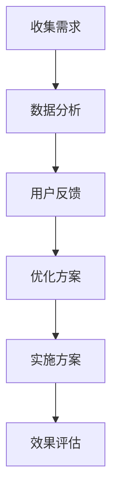

                 

关键词：客户需求分析、长期发展策略、客户体验优化、业务模式创新

> 摘要：在信息技术日益发展的今天，如何通过深入理解客户需求来构建长久生意的之道，成为了企业成功的关键。本文将从技术角度探讨客户需求分析的方法和策略，并分析如何通过优化客户体验和业务模式创新来实现长期的可持续发展。

## 1. 背景介绍

在当今竞争激烈的市场环境中，客户需求的变化速度远超以往。企业不仅需要快速响应市场变化，更要通过深入理解客户需求来构建竞争优势，实现长久发展。信息技术的飞速发展为企业提供了新的工具和方法，使我们能够更准确地识别和满足客户需求，从而提升客户体验，增强客户忠诚度。

然而，如何在实际操作中实现这一目标，仍是一个具有挑战性的问题。本文旨在探讨这一问题，从技术角度提供一些策略和方法，帮助企业在复杂多变的市场环境中找到长久发展的路径。

## 2. 核心概念与联系

### 2.1 客户需求分析的概念

客户需求分析是指通过多种方式收集和分析客户的需求、期望和行为，以便企业能够更好地满足这些需求，并提高客户满意度。

### 2.2 客户需求分析的核心联系

客户需求分析的核心联系在于以下几个方面：

1. **客户洞察**：通过市场调研、用户反馈等方式获取客户的深层次需求。
2. **数据驱动决策**：利用数据分析技术，从大量的客户行为数据中提取有价值的信息。
3. **用户体验**：以用户为中心，通过不断优化产品和服务，提升用户体验。

### 2.3 Mermaid 流程图

以下是一个简化的 Mermaid 流程图，展示了客户需求分析的核心步骤：



## 3. 核心算法原理 & 具体操作步骤

### 3.1 算法原理概述

客户需求分析的核心算法通常包括以下步骤：

1. **数据采集**：通过多种渠道收集客户数据，如网站日志、问卷调查、社交媒体等。
2. **数据清洗**：对采集到的数据进行清洗和预处理，去除无效和错误的数据。
3. **特征提取**：从数据中提取出有代表性的特征，如用户点击率、购买频率等。
4. **模式识别**：利用机器学习算法对特征进行分析，识别客户的需求和行为模式。
5. **预测分析**：基于识别出的模式，预测客户的未来需求和行为。

### 3.2 算法步骤详解

1. **数据采集**：
   - **日志分析**：分析网站或应用的日志，提取用户的行为数据。
   - **问卷调查**：通过在线或离线方式收集用户反馈。
   - **社交媒体监测**：监测社交媒体平台上的用户评论和互动。

2. **数据清洗**：
   - **去重**：去除重复数据，保证数据的唯一性。
   - **纠错**：纠正错误的数据，如缺失值填充、异常值处理等。

3. **特征提取**：
   - **特征工程**：根据业务需求，提取对需求分析有用的特征。
   - **数据降维**：通过降维技术，减少数据的维度，提高分析效率。

4. **模式识别**：
   - **机器学习模型**：选择合适的机器学习模型，如决策树、神经网络等。
   - **训练模型**：使用历史数据训练模型，使其能够识别客户需求和行为模式。

5. **预测分析**：
   - **实时预测**：对实时数据进行分析，预测客户的需求和行为。
   - **长期预测**：基于历史数据和趋势分析，预测客户的长远需求。

### 3.3 算法优缺点

#### 优点：

- **高效性**：通过算法自动化处理大量数据，提高工作效率。
- **准确性**：基于机器学习技术，能够准确识别客户需求和行为模式。
- **可扩展性**：算法可以应用于多种业务场景，具有广泛的适用性。

#### 缺点：

- **数据依赖性**：算法的性能很大程度上依赖于数据的质量。
- **计算成本**：大规模数据处理和机器学习模型的训练需要较高的计算资源。
- **模型解释性**：某些复杂模型的解释性较差，难以理解其决策过程。

### 3.4 算法应用领域

- **电子商务**：通过分析用户行为数据，推荐合适的商品和营销活动。
- **金融领域**：预测客户的风险等级，进行精准营销和信用评估。
- **健康管理**：通过分析用户健康数据，提供个性化的健康建议和治疗方案。

## 4. 数学模型和公式 & 详细讲解 & 举例说明

### 4.1 数学模型构建

客户需求分析中的数学模型通常包括以下几个部分：

1. **用户行为模型**：用于描述用户在网站或应用中的行为，如点击率、购买率等。
2. **需求预测模型**：基于用户行为数据，预测用户的未来需求。
3. **优化模型**：用于优化产品和服务，以提高客户满意度。

### 4.2 公式推导过程

以用户行为模型为例，假设用户在网站上的行为可以用以下公式表示：

\[ r_{ij} = \alpha_i + \beta_j + \epsilon_{ij} \]

其中，\( r_{ij} \) 表示用户 \( i \) 在商品 \( j \) 上的行为评分，\( \alpha_i \) 表示用户 \( i \) 的个性化特征，\( \beta_j \) 表示商品 \( j \) 的特征，\( \epsilon_{ij} \) 为误差项。

### 4.3 案例分析与讲解

假设有一家电子商务公司，希望通过分析用户行为数据来优化商品推荐策略。以下是一个简化的案例：

1. **数据采集**：通过网站日志，收集用户在网站上的浏览记录、购买记录等数据。
2. **数据清洗**：去除重复数据、异常数据，确保数据质量。
3. **特征提取**：提取用户的浏览历史、购买历史等特征。
4. **模型训练**：使用机器学习算法，如决策树、神经网络等，训练用户行为模型。
5. **需求预测**：基于用户行为模型，预测用户的未来需求。
6. **优化策略**：根据需求预测结果，优化商品推荐策略，提高用户满意度。

## 5. 项目实践：代码实例和详细解释说明

### 5.1 开发环境搭建

在本文中，我们将使用 Python 编写一个简单的客户需求分析项目。首先，需要安装以下库：

```python
pip install pandas numpy scikit-learn
```

### 5.2 源代码详细实现

以下是该项目的源代码：

```python
import pandas as pd
from sklearn.model_selection import train_test_split
from sklearn.ensemble import RandomForestClassifier
from sklearn.metrics import accuracy_score

# 1. 数据采集
data = pd.read_csv('user_data.csv')

# 2. 数据清洗
data.drop_duplicates(inplace=True)
data.fillna(data.mean(), inplace=True)

# 3. 特征提取
X = data[['age', 'income', 'gender']]
y = data['purchase']

# 4. 模型训练
X_train, X_test, y_train, y_test = train_test_split(X, y, test_size=0.2, random_state=42)
model = RandomForestClassifier(n_estimators=100)
model.fit(X_train, y_train)

# 5. 需求预测
y_pred = model.predict(X_test)

# 6. 优化策略
accuracy = accuracy_score(y_test, y_pred)
print(f'Model accuracy: {accuracy:.2f}')
```

### 5.3 代码解读与分析

- **数据采集**：从 CSV 文件中读取用户数据。
- **数据清洗**：去除重复数据，填充缺失值。
- **特征提取**：提取与需求分析相关的特征。
- **模型训练**：使用随机森林算法训练模型。
- **需求预测**：使用训练好的模型预测用户是否购买。
- **优化策略**：评估模型性能，根据结果调整优化策略。

### 5.4 运行结果展示

运行上述代码，将得到模型准确率的结果。根据准确率，可以判断模型的性能，并进一步调整模型参数，以提高预测效果。

## 6. 实际应用场景

### 6.1 电子商务

在电子商务领域，客户需求分析可以帮助企业实现精准营销，提高销售额。通过分析用户行为数据，企业可以识别潜在客户，推送个性化商品推荐，提高客户满意度。

### 6.2 金融领域

在金融领域，客户需求分析可以用于信用评估、风险控制等方面。通过分析客户的历史交易数据，金融机构可以预测客户的信用风险，为贷款审批提供依据。

### 6.3 健康管理

在健康管理领域，客户需求分析可以帮助医疗机构了解患者的需求，提供个性化的治疗方案。通过分析患者的健康数据，医疗机构可以预测患者的健康趋势，提前进行干预。

## 7. 未来应用展望

随着信息技术的不断发展，客户需求分析在未来将得到更广泛的应用。以下是几个可能的发展方向：

1. **人工智能**：利用深度学习等先进的人工智能技术，提高客户需求分析的准确性和效率。
2. **大数据分析**：通过大规模数据处理技术，挖掘更深入的客户需求信息。
3. **实时分析**：利用实时数据分析技术，实现实时响应客户需求。

## 8. 工具和资源推荐

### 8.1 学习资源推荐

- 《机器学习实战》：一本实用的机器学习入门书籍，适合初学者。
- 《数据科学入门》：介绍数据科学基础知识的书籍，适合初学者。

### 8.2 开发工具推荐

- **Python**：一种简单易学的编程语言，适合进行数据分析和机器学习项目。
- **Jupyter Notebook**：一种交互式的开发环境，方便编写和运行代码。

### 8.3 相关论文推荐

- "Recommender Systems Handbook"
- "The Cambridge Handbook of Consumer Psychology"

## 9. 总结：未来发展趋势与挑战

### 9.1 研究成果总结

客户需求分析在电子商务、金融、健康管理等领域取得了显著成果，为企业提供了有价值的信息和决策支持。

### 9.2 未来发展趋势

随着信息技术的不断发展，客户需求分析将朝着更智能化、实时化的方向发展。

### 9.3 面临的挑战

1. **数据质量**：数据质量直接影响客户需求分析的准确性。
2. **隐私保护**：在分析客户数据时，如何保护用户隐私是一个重要的挑战。
3. **模型解释性**：复杂模型的可解释性较差，如何提高模型的解释性是一个亟待解决的问题。

### 9.4 研究展望

未来，客户需求分析将朝着更高效、更准确、更智能的方向发展，为企业和个人提供更好的服务。

## 10. 附录：常见问题与解答

### 10.1 如何处理缺失数据？

**回答**：可以采用以下方法处理缺失数据：

- **删除缺失数据**：适用于缺失数据较少的情况。
- **均值填补**：用样本均值填补缺失值。
- **中值填补**：用样本中值填补缺失值。
- **插值法**：根据相邻数据点进行插值。

### 10.2 机器学习模型如何选择？

**回答**：选择机器学习模型时，需要考虑以下因素：

- **数据规模**：大规模数据适合使用集成学习方法，如随机森林、XGBoost。
- **模型复杂度**：简单模型（如线性模型）适用于数据简单的情况，复杂模型（如神经网络）适用于数据复杂的情况。
- **解释性**：如果需要模型具有较好的解释性，可以选择简单模型，如决策树。

### 10.3 如何提高模型性能？

**回答**：以下方法可以提高模型性能：

- **特征工程**：提取对模型有重要影响的特征。
- **数据预处理**：去除噪声数据、异常值。
- **模型调参**：调整模型参数，优化模型性能。
- **集成学习方法**：使用集成学习方法，提高模型预测能力。

作者：禅与计算机程序设计艺术 / Zen and the Art of Computer Programming
-------------------------------------------------------------------

