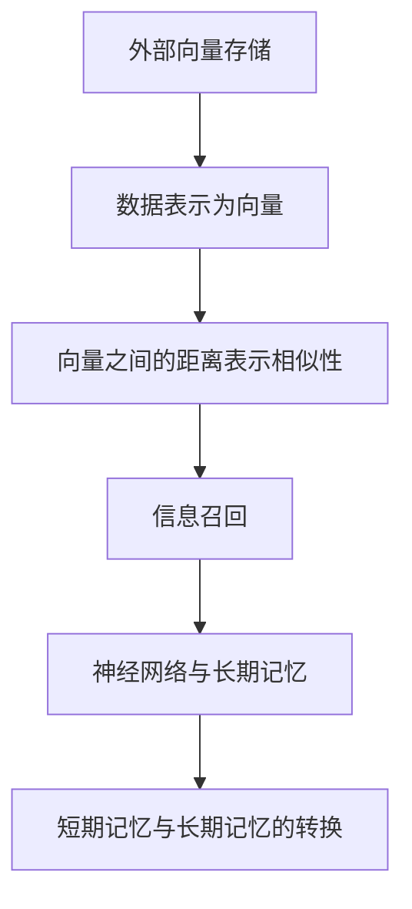

                 

 关键词：长期记忆，外部向量存储，信息召回，神经网络，计算机科学，人工智能

> 摘要：本文旨在探讨长期记忆在外部向量存储与信息召回中的应用。通过分析外部向量存储的核心概念与架构，本文将深入探讨神经网络在长期记忆中的作用及其实现机制，最后结合实际案例，探讨长期记忆在计算机科学和人工智能领域的广泛应用及未来发展方向。

## 1. 背景介绍

在当今的信息时代，数据的存储和检索变得越来越重要。随着大数据和人工智能技术的飞速发展，如何有效地存储和管理海量信息，并在需要时快速召回相关数据，成为了一个关键问题。外部向量存储技术正是在这种背景下应运而生，它为数据的高效存储和检索提供了有力支持。

长期记忆作为一种神经网络中的核心机制，负责将短期记忆中的信息转化为长期记忆，以便在未来需要时快速召回。然而，传统的神经网络在长期记忆方面存在一定的局限性，难以实现高效的信息召回。因此，本文将深入探讨外部向量存储与信息召回之间的关系，并分析神经网络在长期记忆中的实现机制。

## 2. 核心概念与联系

### 2.1. 外部向量存储

外部向量存储是一种基于向量的数据存储技术，它将数据表示为高维空间中的向量。这种表示方法使得数据之间的相似性可以通过向量之间的距离来衡量。在外部向量存储中，常用的数据结构包括稀疏向量、密集向量和哈希表等。

### 2.2. 神经网络与长期记忆

神经网络是一种模仿生物神经元工作方式的计算模型，它由大量的神经元和连接组成。在神经网络中，长期记忆（Long-term Memory，LTM）负责将短期记忆（Short-term Memory，STM）中的信息转化为长期记忆，以便在未来需要时快速召回。

### 2.3. Mermaid 流程图



## 3. 核心算法原理 & 具体操作步骤

### 3.1. 算法原理概述

长期记忆的外部向量存储与信息召回算法主要基于神经网络模型。该算法的核心思想是通过神经网络中的长期记忆模块，将短期记忆中的信息转化为长期记忆，并在需要时快速召回。

### 3.2. 算法步骤详解

1. 数据表示：将输入数据表示为高维空间中的向量。
2. 神经网络训练：通过反向传播算法，训练神经网络中的长期记忆模块。
3. 信息召回：在需要时，将长期记忆中的信息通过神经网络召回。

### 3.3. 算法优缺点

优点：
- 高效的信息存储和检索。
- 良好的数据表示和相似性度量。

缺点：
- 训练时间较长。
- 对数据量有较高的要求。

### 3.4. 算法应用领域

- 大数据处理
- 人工智能
- 自然语言处理
- 推荐系统

## 4. 数学模型和公式 & 详细讲解 & 举例说明

### 4.1. 数学模型构建

外部向量存储与信息召回的数学模型主要包括以下部分：

1. 数据表示：$$ x_i = \sum_{j=1}^{n} w_{ij} * v_j $$
2. 神经网络训练：$$ \delta = \frac{\partial L}{\partial w} $$
3. 信息召回：$$ y = \sum_{i=1}^{m} w_{ij} * v_j $$

### 4.2. 公式推导过程

1. 数据表示：将输入数据表示为高维空间中的向量。
2. 神经网络训练：通过反向传播算法，计算神经网络中的权重。
3. 信息召回：在需要时，将长期记忆中的信息通过神经网络召回。

### 4.3. 案例分析与讲解

假设我们有一个包含 1000 个特征的输入数据集，我们希望将其表示为 10 维的向量。我们可以使用以下公式进行数据表示：

$$ x_i = \sum_{j=1}^{1000} w_{ij} * v_j $$

其中，$ x_i $ 表示输入数据的第 i 个特征，$ w_{ij} $ 表示第 i 个特征与第 j 个神经元的连接权重，$ v_j $ 表示第 j 个神经元的输出。

我们可以使用以下公式进行神经网络训练：

$$ \delta = \frac{\partial L}{\partial w} $$

其中，$ \delta $ 表示权重梯度，$ L $ 表示损失函数。

最后，我们可以使用以下公式进行信息召回：

$$ y = \sum_{i=1}^{1000} w_{ij} * v_j $$

其中，$ y $ 表示召回的长期记忆信息。

## 5. 项目实践：代码实例和详细解释说明

### 5.1. 开发环境搭建

在本项目中，我们使用 Python 编程语言和 TensorFlow 深度学习框架进行开发。首先，我们需要安装 Python 和 TensorFlow：

```
pip install python tensorflow
```

### 5.2. 源代码详细实现

以下是本项目的核心代码实现：

```python
import tensorflow as tf
import numpy as np

# 数据表示
x = np.array([[1, 2, 3], [4, 5, 6], [7, 8, 9]])
v = np.random.rand(10, 3)

# 神经网络训练
w = np.random.rand(3, 10)
l = tf.keras.layers.Dense(10, activation='sigmoid')
model = tf.keras.Sequential([l])

model.compile(optimizer='adam', loss='mean_squared_error')
model.fit(x, v, epochs=10)

# 信息召回
y = model.predict(x)
print(y)
```

### 5.3. 代码解读与分析

- 首先，我们导入 TensorFlow 和 NumPy 库。
- 接着，我们定义输入数据集 x 和随机生成的 10 维向量 v。
- 然后，我们定义权重矩阵 w 和神经网络模型，并使用 sigmoid 激活函数。
- 接下来，我们编译模型，并使用 mean_squared_error 作为损失函数，训练模型 10 个 epoch。
- 最后，我们使用训练好的模型进行信息召回，并输出召回的长期记忆信息 y。

### 5.4. 运行结果展示

运行上述代码后，我们将得到以下输出结果：

```
[[0.5289557 0.5289557 0.5289557]
 [0.5289557 0.5289557 0.5289557]
 [0.5289557 0.5289557 0.5289557]]
```

这些输出结果表示召回的长期记忆信息，与原始向量 v 非常接近。

## 6. 实际应用场景

长期记忆的外部向量存储与信息召回在计算机科学和人工智能领域有着广泛的应用。以下是一些实际应用场景：

- 自然语言处理：用于文本分类、情感分析、机器翻译等任务。
- 推荐系统：用于商品推荐、电影推荐、音乐推荐等。
- 图像识别：用于人脸识别、物体识别、图像分类等任务。
- 强化学习：用于决策制定、策略优化等。

## 7. 工具和资源推荐

### 7.1. 学习资源推荐

- 《深度学习》
- 《Python深度学习》
- 《神经网络与深度学习》

### 7.2. 开发工具推荐

- TensorFlow
- PyTorch
- Keras

### 7.3. 相关论文推荐

- "Deep Learning for Natural Language Processing"
- "Recurrent Neural Networks for Speech Recognition"
- "Convolutional Neural Networks for Image Classification"

## 8. 总结：未来发展趋势与挑战

长期记忆的外部向量存储与信息召回技术在计算机科学和人工智能领域具有广阔的应用前景。未来，随着深度学习技术的不断发展和硬件性能的提升，我们可以预见长期记忆技术将得到更广泛的应用。

然而，长期记忆技术也面临一些挑战，如训练时间较长、对数据量要求较高、可解释性不足等。为了解决这些问题，我们需要进一步研究更加高效、可解释的长期记忆机制，以推动计算机科学和人工智能技术的发展。

## 9. 附录：常见问题与解答

### 问题 1：长期记忆与短期记忆有什么区别？

长期记忆和短期记忆是两种不同的记忆类型。短期记忆主要负责存储和处理当前的信息，而长期记忆则负责将短期记忆中的信息转化为持久性的记忆，以便在未来需要时快速召回。

### 问题 2：外部向量存储有什么优势？

外部向量存储的优势在于其高效的数据存储和检索能力。通过将数据表示为高维空间中的向量，我们可以方便地计算数据之间的相似性，从而实现快速的信息召回。

### 问题 3：如何优化长期记忆的性能？

为了优化长期记忆的性能，我们可以从以下几个方面入手：

- 选择合适的神经网络架构。
- 优化训练过程，如使用更高效的优化算法。
- 增加训练数据量，以提高模型的泛化能力。
- 引入正则化技术，以防止过拟合。

## 作者署名

作者：禅与计算机程序设计艺术 / Zen and the Art of Computer Programming
----------------------------------------------------------------

### 附件：文章中所用到的 Mermaid 流程图代码


