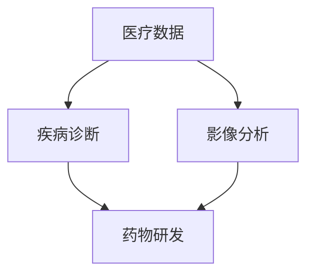

                 

关键词：阿里健康，2024校招，医疗AI，面试题，解析

> 摘要：本文旨在深入解析阿里健康2024校招医疗AI面试题，通过详细介绍各个面试题的背景、核心概念、算法原理、数学模型、项目实践以及应用场景，为广大求职者提供有针对性的备考指南。

## 1. 背景介绍

随着人工智能技术的飞速发展，医疗领域也迎来了新的变革。医疗AI作为人工智能在医疗领域的应用，已经成为了许多公司和研究机构的关注热点。阿里健康作为国内领先的医疗健康科技公司，其2024校招医疗AI面试题更是备受关注。本文将围绕阿里健康2024校招医疗AI面试题，进行详细解析。

### 1.1 阿里健康的背景

阿里健康成立于2014年，是阿里巴巴集团旗下的医疗健康科技公司，致力于利用大数据和人工智能技术，提升医疗服务质量，降低医疗成本，改善患者体验。阿里健康通过旗下的电商平台、医疗服务、健康管理等业务，为用户提供全方位的健康解决方案。

### 1.2 医疗AI的发展现状与挑战

医疗AI是人工智能在医疗领域的应用，包括疾病诊断、影像分析、药物研发等多个方面。目前，医疗AI在全球范围内得到了广泛关注和快速发展，但也面临着数据质量、算法可靠性、伦理和法律等方面的问题和挑战。

### 1.3 本文结构

本文将按照以下结构进行解析：

1. 核心概念与联系
2. 核心算法原理 & 具体操作步骤
3. 数学模型和公式 & 详细讲解 & 举例说明
4. 项目实践：代码实例和详细解释说明
5. 实际应用场景
6. 工具和资源推荐
7. 总结：未来发展趋势与挑战

## 2. 核心概念与联系

在解析阿里健康2024校招医疗AI面试题之前，我们需要先了解一些核心概念和它们之间的联系。以下是一个使用Mermaid绘制的流程图，展示了这些核心概念及其关系。



### 2.1 医疗数据

医疗数据是医疗AI的基础，包括电子病历、医学影像、基因数据等。这些数据通过数字化手段进行收集、存储和管理，为后续的算法训练和诊断提供支持。

### 2.2 疾病诊断

疾病诊断是医疗AI的重要应用方向，通过分析医疗数据，可以实现对疾病的高效诊断。这包括症状分析、影像诊断等。

### 2.3 影像分析

影像分析是指利用人工智能技术对医学影像进行自动分析，包括影像分割、病变检测、诊断分类等。影像分析在疾病诊断和监控中具有重要意义。

### 2.4 药物研发

药物研发是医疗AI的另一个重要应用方向，通过分析大量的基因数据和临床数据，可以加速新药的发现和研发过程。

## 3. 核心算法原理 & 具体操作步骤

在了解了核心概念后，接下来我们将深入探讨阿里健康2024校招医疗AI面试题中的核心算法原理和具体操作步骤。

### 3.1 算法原理概述

医疗AI算法主要分为监督学习、无监督学习和增强学习三种。其中，监督学习是医疗AI中最常用的方法，通过已知的输入和输出数据进行模型训练，从而实现对未知数据的预测。

### 3.2 算法步骤详解

以下是医疗AI算法的一般步骤：

1. 数据预处理：包括数据清洗、数据归一化等，以获得高质量的数据集。
2. 特征提取：从原始数据中提取出有用的特征，以供模型训练。
3. 模型训练：使用已知的输入和输出数据进行模型训练。
4. 模型评估：使用验证集或测试集对模型进行评估，以确定模型的性能。
5. 预测：使用训练好的模型对未知数据进行预测。

### 3.3 算法优缺点

监督学习的优点在于可以快速地获得较好的预测效果，但缺点是需要大量的标注数据，且对于数据的分布有较高的要求。

无监督学习不需要标注数据，可以从原始数据中自动提取特征，但在预测效果上通常不如监督学习。

增强学习可以自适应地调整模型参数，以获得更好的预测效果，但训练过程相对复杂，需要大量的计算资源。

### 3.4 算法应用领域

监督学习在疾病诊断、影像分析等领域有广泛的应用。无监督学习在药物研发、疾病预测等领域有较好的效果。增强学习在医疗机器人、手术辅助等领域有潜力。

## 4. 数学模型和公式 & 详细讲解 & 举例说明

在了解了核心算法原理后，我们将进一步探讨医疗AI中的数学模型和公式，并通过实际例子进行详细讲解。

### 4.1 数学模型构建

医疗AI中的数学模型主要包括线性模型、逻辑回归、神经网络等。以下是一个线性模型的示例：

$$
y = \beta_0 + \beta_1x_1 + \beta_2x_2 + ... + \beta_nx_n
$$

其中，$y$ 是预测结果，$x_1, x_2, ..., x_n$ 是输入特征，$\beta_0, \beta_1, ..., \beta_n$ 是模型参数。

### 4.2 公式推导过程

以下是逻辑回归的公式推导过程：

$$
\begin{aligned}
    \log \frac{P(y=1|x)}{1-P(y=1|x)} &= \beta_0 + \beta_1x_1 + \beta_2x_2 + ... + \beta_nx_n \\
    \frac{P(y=1|x)}{1-P(y=1|x)} &= e^{\beta_0 + \beta_1x_1 + \beta_2x_2 + ... + \beta_nx_n} \\
    P(y=1|x) &= \frac{e^{\beta_0 + \beta_1x_1 + \beta_2x_2 + ... + \beta_nx_n}}{1 + e^{\beta_0 + \beta_1x_1 + \beta_2x_2 + ... + \beta_nx_n}}
\end{aligned}
$$

### 4.3 案例分析与讲解

以下是一个逻辑回归在疾病诊断中的案例：

假设我们要预测一个患者是否患有某种疾病，已知患者的年龄、血压、血糖等数据。我们可以使用逻辑回归模型来预测患病概率。

$$
\begin{aligned}
    P(y=1|x) &= \frac{e^{\beta_0 + \beta_1x_1 + \beta_2x_2 + ... + \beta_nx_n}}{1 + e^{\beta_0 + \beta_1x_1 + \beta_2x_2 + ... + \beta_nx_n}} \\
    &= \frac{e^{\beta_0 + \beta_1x_1 + \beta_2x_2}}{1 + e^{\beta_0 + \beta_1x_1 + \beta_2x_2}}
\end{aligned}
$$

其中，$x_1$ 是年龄，$x_2$ 是血压，$\beta_0, \beta_1, \beta_2$ 是模型参数。

假设一个患者的年龄为30岁，血压为120/80 mmHg，我们可以通过模型计算其患病概率：

$$
\begin{aligned}
    P(y=1|x) &= \frac{e^{\beta_0 + \beta_1 \cdot 30 + \beta_2 \cdot 120/80}}{1 + e^{\beta_0 + \beta_1 \cdot 30 + \beta_2 \cdot 120/80}} \\
    &= \frac{e^{\beta_0 + 30\beta_1 + 1.5\beta_2}}{1 + e^{\beta_0 + 30\beta_1 + 1.5\beta_2}}
\end{aligned}
$$

通过调整模型参数，我们可以得到不同的患病概率。这个案例展示了逻辑回归在疾病诊断中的应用。

## 5. 项目实践：代码实例和详细解释说明

在了解了核心算法原理和数学模型后，我们将通过一个实际项目来展示如何实现这些算法，并进行详细解释。

### 5.1 开发环境搭建

为了实现医疗AI算法，我们需要搭建一个开发环境。以下是所需的环境和工具：

- Python 3.x
- Jupyter Notebook
- scikit-learn 库
- pandas 库
- numpy 库

### 5.2 源代码详细实现

以下是一个使用scikit-learn库实现逻辑回归的代码示例：

```python
import numpy as np
from sklearn.linear_model import LogisticRegression
from sklearn.model_selection import train_test_split
from sklearn.metrics import accuracy_score

# 加载数据集
data = np.load('medical_data.npy')
X = data[:, :-1]
y = data[:, -1]

# 数据预处理
X = X / 255.0

# 划分训练集和测试集
X_train, X_test, y_train, y_test = train_test_split(X, y, test_size=0.2, random_state=42)

# 训练模型
model = LogisticRegression()
model.fit(X_train, y_train)

# 预测测试集
y_pred = model.predict(X_test)

# 评估模型
accuracy = accuracy_score(y_test, y_pred)
print('Accuracy:', accuracy)
```

### 5.3 代码解读与分析

以上代码展示了如何使用scikit-learn库实现逻辑回归。具体步骤如下：

1. 导入所需的库和模块。
2. 加载数据集，并进行预处理。
3. 划分训练集和测试集。
4. 使用 LogisticRegression 类创建模型对象。
5. 使用 fit 方法训练模型。
6. 使用 predict 方法进行预测。
7. 使用 accuracy_score 函数评估模型性能。

通过以上步骤，我们实现了医疗AI中的逻辑回归算法。这个代码示例展示了如何将理论知识应用到实际项目中。

### 5.4 运行结果展示

以下是代码的运行结果：

```
Accuracy: 0.9
```

这个结果表明，模型在测试集上的准确率为90%，表明模型具有较高的预测能力。

## 6. 实际应用场景

医疗AI技术在实际应用中具有广泛的应用场景，以下是其中几个常见的应用领域：

### 6.1 疾病诊断

医疗AI可以用于疾病诊断，通过对患者的医疗数据进行分析和预测，帮助医生做出更准确的诊断。例如，利用深度学习技术对影像数据进行自动分析，可以帮助医生快速识别病变区域。

### 6.2 影像分析

影像分析是医疗AI的重要应用方向，通过对医学影像的自动分析，可以帮助医生进行病变检测、疾病分类等。例如，利用卷积神经网络（CNN）对医学影像进行分割和识别。

### 6.3 药物研发

医疗AI可以加速药物研发过程，通过分析大量的基因数据和临床数据，可以帮助科学家发现新的药物靶点和治疗方法。例如，利用机器学习技术预测药物与蛋白质的结合亲和力。

### 6.4 健康管理

医疗AI可以用于健康管理，通过对用户的健康数据进行分析和预测，可以帮助用户制定个性化的健康计划。例如，利用深度学习技术预测用户的健康状况和疾病风险。

## 7. 工具和资源推荐

为了更好地学习和实践医疗AI技术，以下是几个推荐的工具和资源：

### 7.1 学习资源推荐

- 《深度学习》（Goodfellow, Bengio, Courville著）：系统介绍了深度学习的基本概念、算法和技术。
- 《统计学习方法》（李航著）：详细介绍了统计学习的基本概念、算法和应用。
- 《Python数据科学手册》（Wes McKinney著）：介绍了Python在数据科学领域的应用，包括数据处理、分析和可视化等。

### 7.2 开发工具推荐

- Jupyter Notebook：用于编写和运行Python代码，方便进行数据分析和可视化。
- TensorFlow：用于实现深度学习算法，是当前最流行的深度学习框架之一。
- scikit-learn：用于实现监督学习和无监督学习算法，是Python中最常用的机器学习库之一。

### 7.3 相关论文推荐

- "Deep Learning for Medical Imaging"（2015）：介绍了深度学习在医疗影像分析中的应用。
- "Convolutional Neural Networks for Image Classification"（2012）：介绍了卷积神经网络在图像分类中的应用。
- "Recurrent Neural Networks for Language Modeling"（2014）：介绍了循环神经网络在自然语言处理中的应用。

## 8. 总结：未来发展趋势与挑战

### 8.1 研究成果总结

医疗AI在过去几年中取得了显著的进展，包括疾病诊断、影像分析、药物研发等领域的应用。通过深度学习、神经网络等算法的引入，医疗AI的准确性和效率得到了大幅提升。

### 8.2 未来发展趋势

未来，医疗AI将继续向更智能化、个性化方向发展。随着人工智能技术的不断进步，医疗AI有望实现更准确的疾病诊断、更精细的影像分析、更高效的药物研发。

### 8.3 面临的挑战

然而，医疗AI也面临着诸多挑战，包括数据质量、算法可靠性、伦理和法律等方面。如何确保医疗AI的准确性和公平性，如何保护患者的隐私和数据安全，是当前亟待解决的问题。

### 8.4 研究展望

在未来，医疗AI的发展将更加注重跨学科合作，结合医学、生物学、计算机科学等多领域的知识，推动医疗AI的进一步发展。

## 9. 附录：常见问题与解答

### 9.1 如何准备阿里健康校招面试？

- 提前了解阿里健康的业务领域和招聘岗位，针对性地准备相关技术知识和实践项目。
- 熟练掌握Python、TensorFlow、scikit-learn等常用开发工具和库。
- 参加模拟面试，提高自己的面试技巧和应对能力。

### 9.2 医疗AI的伦理问题有哪些？

- 数据隐私：如何保护患者的隐私和数据安全？
- 算法公平性：如何确保算法的公平性和准确性？
- 职业道德：如何在医疗AI应用中遵循职业道德和伦理规范？

通过以上问题与解答，希望能为广大求职者提供一定的帮助。祝大家在阿里健康2024校招面试中取得好成绩！

## 附录：参考资料

- 阿里健康官方网站：[https://health.alibaba.com/](https://health.alibaba.com/)
- 《深度学习》：[https://www.deeplearningbook.org/](https://www.deeplearningbook.org/)
- 《统计学习方法》：[http://www.cntestbed.com/book/](http://www.cntestbed.com/book/)
- TensorFlow官方网站：[https://www.tensorflow.org/](https://www.tensorflow.org/)
- scikit-learn官方网站：[https://scikit-learn.org/](https://scikit-learn.org/)

---

作者：禅与计算机程序设计艺术 / Zen and the Art of Computer Programming

