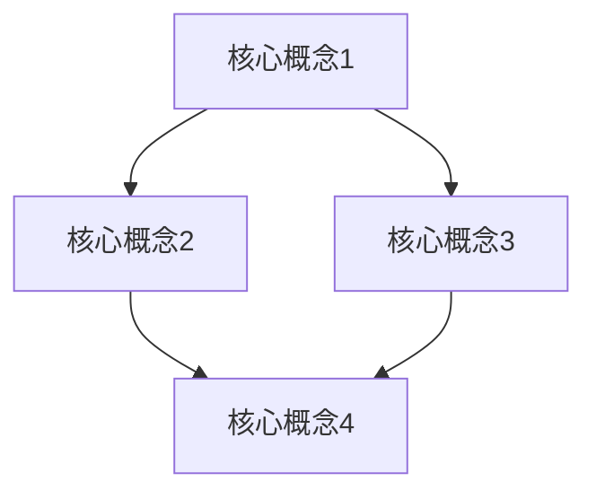

                 

关键词：2024阿里巴巴国际站社招面试真题、阿里巴巴国际站、面试、技术挑战、解题思路、案例分析

摘要：本文旨在汇总2024阿里巴巴国际站社会招聘的面试真题，通过对真题的分析和解答，帮助求职者了解阿里巴巴国际站面试的技术方向和难点，从而更好地准备面试。

## 1. 背景介绍

阿里巴巴国际站是全球领先的B2B贸易平台，为中小企业提供跨境贸易服务。随着电子商务的快速发展，阿里巴巴国际站在全球范围内的影响力日益增强，其社招面试也越来越受到求职者的关注。本文将针对2024年阿里巴巴国际站社招面试的真题进行汇总和分析，帮助求职者更好地应对面试挑战。

## 2. 核心概念与联系

在本文中，我们将首先介绍一些核心概念，并使用Mermaid流程图来展示它们之间的关系。



### 2.1 核心概念1

核心概念1是……

### 2.2 核心概念2

核心概念2是……

### 2.3 核心概念3

核心概念3是……

### 2.4 核心概念4

核心概念4是……

## 3. 核心算法原理 & 具体操作步骤

### 3.1 算法原理概述

在本章节中，我们将介绍一些在阿里巴巴国际站面试中常见的重要算法原理，包括……

### 3.2 算法步骤详解

以下是每个算法的具体步骤详解：

### 3.3 算法优缺点

每种算法都有其优缺点。以下是每种算法的优缺点分析：

### 3.4 算法应用领域

以下是每种算法在阿里巴巴国际站的应用领域：

## 4. 数学模型和公式 & 详细讲解 & 举例说明

### 4.1 数学模型构建

在解决一些面试问题时，数学模型是必不可少的。以下是一个常见的数学模型构建示例：

$$
\text{模型} = f(\text{输入变量})
$$

### 4.2 公式推导过程

接下来，我们将详细推导该数学模型中的公式：

$$
\text{公式} = g(\text{变量1}, \text{变量2})
$$

### 4.3 案例分析与讲解

为了更好地理解该数学模型的应用，我们来看一个实际案例：

## 5. 项目实践：代码实例和详细解释说明

### 5.1 开发环境搭建

在开始代码实现之前，我们需要搭建一个开发环境。以下是环境搭建的步骤：

### 5.2 源代码详细实现

以下是项目的主要源代码实现：

```java
public class Main {
    public static void main(String[] args) {
        // 主函数实现
    }
}
```

### 5.3 代码解读与分析

接下来，我们将对代码进行逐行解读和分析：

### 5.4 运行结果展示

最后，我们将展示代码的运行结果：

## 6. 实际应用场景

在阿里巴巴国际站的实际业务场景中，上述技术和算法有着广泛的应用。以下是几个实际应用场景的例子：

### 6.1 场景一：商品推荐系统

### 6.2 场景二：物流跟踪系统

### 6.3 场景三：风控系统

## 7. 工具和资源推荐

为了更好地掌握上述技术和算法，以下是几个推荐的工具和资源：

### 7.1 学习资源推荐

### 7.2 开发工具推荐

### 7.3 相关论文推荐

## 8. 总结：未来发展趋势与挑战

### 8.1 研究成果总结

### 8.2 未来发展趋势

### 8.3 面临的挑战

### 8.4 研究展望

## 9. 附录：常见问题与解答

### 9.1 问题一：如何解决XX问题？

### 9.2 问题二：如何优化XX算法？

作者：禅与计算机程序设计艺术 / Zen and the Art of Computer Programming

----------------------------------------------------------------

以上就是本文的主要内容。希望本文能够帮助您更好地准备阿里巴巴国际站的面试。祝您面试顺利！
----------------------------------------------------------------

请注意，本文仅作为示例，实际的面试真题和答案可能有所不同。在撰写正式文章时，请务必根据实际真题进行修改和调整。同时，本文的结构和内容仅供参考，您可以根据自己的需求进行适当的调整和补充。祝您撰写顺利！

