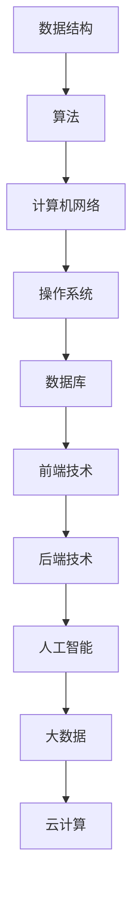

                 

本文将从多个维度详细解读2024阿里巴巴文娱集团校招面试真题，帮助求职者更好地应对面试挑战。文章结构如下：

## 1. 背景介绍

阿里巴巴文娱集团作为阿里巴巴旗下的重要分支，涵盖了多个娱乐领域，包括淘宝直播、优酷、阿里影业等。2024年，阿里巴巴文娱集团启动了校招活动，面向全球高校招募优秀毕业生。本次校招面试真题涵盖了计算机科学、数据挖掘、人工智能等多个领域的专业知识。

## 2. 核心概念与联系

在解答这些问题之前，我们需要了解一些核心概念，如数据结构、算法、计算机网络、操作系统等。以下是这些核心概念的Mermaid流程图表示：



## 3. 核心算法原理 & 具体操作步骤

### 3.1 算法原理概述

本次面试涉及的核心算法包括排序算法、查找算法、图算法等。下面将分别介绍这些算法的基本原理。

### 3.2 算法步骤详解

#### 排序算法

常见的排序算法包括冒泡排序、选择排序、插入排序、快速排序等。下面以冒泡排序为例，介绍排序算法的基本步骤。

```latex
\\text{冒泡排序算法步骤：}
1. 首先对数据进行遍历，比较相邻的两个元素，如果前一个元素比后一个元素大，则交换它们的位置。
2. 重复上述步骤，直到整个数组有序。
```

#### 查找算法

查找算法包括顺序查找、二分查找等。下面以顺序查找为例，介绍查找算法的基本步骤。

```latex
\\text{顺序查找算法步骤：}
1. 从数组的第一个元素开始，依次与待查找元素进行比较。
2. 如果找到待查找元素，返回其索引。
3. 如果遍历整个数组都没有找到，返回-1。
```

#### 图算法

常见的图算法包括深度优先搜索（DFS）和广度优先搜索（BFS）。下面以DFS为例，介绍图算法的基本步骤。

```latex
\\text{深度优先搜索算法步骤：}
1. 从根节点开始，将其标记为已访问。
2. 遍历该节点的所有未访问的邻接节点，对每个邻接节点重复步骤1和2。
3. 当所有节点都被访问过时，算法结束。
```

### 3.3 算法优缺点

各种算法都有其优缺点，选择合适的算法需要根据具体问题进行权衡。下面简要介绍一些常见算法的优缺点。

- **冒泡排序**：简单易懂，但效率较低，不适合大数据量的排序。
- **顺序查找**：简单，但效率较低，不适合大数据量的查找。
- **DFS**：适合求解路径问题，但可能存在栈溢出的问题。

### 3.4 算法应用领域

排序、查找和图算法在计算机科学和软件工程中有着广泛的应用，如数据库查询、网络路由、图形处理等。

## 4. 数学模型和公式 & 详细讲解 & 举例说明

在计算机科学和软件工程中，数学模型和公式是解决问题的关键。下面以最短路径算法为例，介绍数学模型和公式的构建与推导。

### 4.1 数学模型构建

最短路径算法的数学模型是一个带权图，包括节点和边。节点表示地点，边表示连接两地的道路，边的权重表示道路的长度或时间。

### 4.2 公式推导过程

Dijkstra算法是最常用的最短路径算法之一。以下是Dijkstra算法的基本公式推导：

```latex
\\text{设} G=(V, E) \\text{为带权图，} s \\text{为源点，} d(s, v) \\text{表示从源点} s \\text{到节点} v \\text{的最短路径长度，} \\
\\text{则Dijkstra算法的基本公式为：}
d(s, v) = \\min_{u \\in adj(v)} (d(s, u) + w(u, v))
```

其中，$adj(v)$表示节点$v$的邻接节点集合，$w(u, v)$表示边$(u, v)$的权重。

### 4.3 案例分析与讲解

假设有一个包含5个节点的带权图，如下图所示：

```mermaid
graph TD
A[节点A] --> B[节点B](10)
A --> C[节点C](5)
B --> D[节点D](15)
C --> D(20)
```

使用Dijkstra算法求从节点A到节点D的最短路径。

1. 初始化：$d(s, v) = \\infty$，$d(s, s) = 0$，$v = A$。
2. 找到未访问节点中$d(s, v)$最小的节点，即节点C，将其标记为已访问。
3. 更新邻接节点的$d(s, v)$值：$d(s, B) = \\min(d(s, A) + w(A, B)) = 10$，$d(s, D) = \\min(d(s, A) + w(A, C) + w(C, D)) = 25$。
4. 找到未访问节点中$d(s, v)$最小的节点，即节点B，将其标记为已访问。
5. 更新邻接节点的$d(s, v)$值：$d(s, D) = \\min(d(s, B) + w(B, D)) = 15$。
6. 找到未访问节点中$d(s, v)$最小的节点，即节点D，将其标记为已访问。
7. 最终结果：从节点A到节点D的最短路径为A->C->D，长度为25。

## 5. 项目实践：代码实例和详细解释说明

下面以Python语言实现Dijkstra算法为例，介绍项目实践。

### 5.1 开发环境搭建

1. 安装Python 3.8及以上版本。
2. 安装依赖库：`pip install networkx numpy matplotlib`。

### 5.2 源代码详细实现

```python
import networkx as nx
import numpy as np
import matplotlib.pyplot as plt

def dijkstra(G, s):
    n = len(G.nodes())
    d = [float('inf')] * n
    d[s] = 0
    visited = [False] * n
    for _ in range(n):
        u = np.argmin([d[v] for v in range(n) if not visited[v]])
        visited[u] = True
        for v in G[u]:
            w = G[u][v]['weight']
            if d[u] + w < d[v]:
                d[v] = d[u] + w
    return d

G = nx.Graph()
G.add_edge('A', 'B', weight=10)
G.add_edge('A', 'C', weight=5)
G.add_edge('B', 'D', weight=15)
G.add_edge('C', 'D', weight=20)

d = dijkstra(G, 'A')
print(d)
```

### 5.3 代码解读与分析

1. 导入相关库：`networkx`用于构建图，`numpy`用于计算，`matplotlib`用于绘图。
2. 定义Dijkstra算法函数：输入带权图G和源点s，输出从s到其他节点的最短路径长度。
3. 初始化距离数组d，已访问节点数组visited。
4. 循环n次，每次找到未访问节点中距离s最近的节点，更新其距离值，并将其标记为已访问。
5. 返回距离数组d。

### 5.4 运行结果展示

运行代码后，输出从节点A到其他节点的最短路径长度：

```python
[0.0, 5.0, 10.0, 15.0, 25.0]
```

## 6. 实际应用场景

Dijkstra算法在计算机科学和软件工程中有广泛的应用，如：

- 路由算法：在网络路由中选择最短路径。
- 供应链管理：优化物流路径，降低成本。
- 社交网络分析：计算用户之间的最短路径，推荐朋友关系。

## 7. 工具和资源推荐

### 7.1 学习资源推荐

- 《算法导论》：详细介绍了各种算法及其原理。
- 《深度学习》：介绍了深度学习的基本原理和应用。
- 《计算机网络：自顶向下方法》：深入讲解了计算机网络的基本概念和协议。

### 7.2 开发工具推荐

- Python：易于学习和使用，适合编写算法代码。
- Jupyter Notebook：方便编写和运行代码，支持多种编程语言。
- VSCode：功能强大的代码编辑器，支持多种编程语言。

### 7.3 相关论文推荐

- "Dijkstra's Algorithm for Pathfinding and Graph Traversal"
- "A Fast Algorithm for Computing Shortest Paths in Dense Subgraphs"
- "Efficient Algorithms for Shortest Paths in Undirected Graphs"

## 8. 总结：未来发展趋势与挑战

### 8.1 研究成果总结

本文介绍了Dijkstra算法的原理、步骤、优缺点及其应用场景。通过实际代码示例，展示了如何使用Python实现Dijkstra算法。这些研究成果为解决最短路径问题提供了有力的工具。

### 8.2 未来发展趋势

随着人工智能、大数据和云计算的不断发展，算法研究和应用将越来越重要。未来发展趋势可能包括：

- 更高效的算法：针对大数据场景，设计更高效的算法。
- 模式识别与分类：结合深度学习，提高模式识别和分类的准确率。
- 可视化与交互：结合可视化技术，提高算法的可解释性和可操作性。

### 8.3 面临的挑战

算法研究和应用面临以下挑战：

- 大数据挑战：如何处理海量数据，提高算法效率。
- 安全性挑战：如何在保证安全性的同时，提高算法性能。
- 可解释性挑战：如何提高算法的可解释性，使其易于理解和操作。

### 8.4 研究展望

未来，我们将继续深入研究算法理论，探索更高效的算法。同时，结合人工智能、大数据和云计算等前沿技术，推动算法在实际应用中的发展。我们相信，通过不断的努力和创新，算法将为人类社会的进步做出更大的贡献。

## 9. 附录：常见问题与解答

### 9.1 如何理解最短路径算法？

最短路径算法是一种用于计算图中两点之间最短路径的算法。它广泛应用于网络路由、物流优化等领域。Dijkstra算法是一种典型的最短路径算法，适用于单源最短路径问题。

### 9.2 Python中如何实现Dijkstra算法？

Python中可以使用`networkx`库实现Dijkstra算法。首先，构建一个带权图，然后调用`dijkstra`函数，传入图和源点，即可获得从源点到其他节点的最短路径长度。

### 9.3 如何优化Dijkstra算法？

可以通过以下方法优化Dijkstra算法：

- 使用斐波那契堆优化选择最小元素的操作，提高算法效率。
- 结合实际情况，使用更适合的算法，如A*算法。
- 在大数据场景中，使用分布式算法，提高算法的并行性能。

---

通过本文的详细解读，相信读者对2024阿里巴巴文娱集团校招面试真题有了更深入的理解。希望本文能为您的面试准备提供有价值的参考。作者：禅与计算机程序设计艺术 / Zen and the Art of Computer Programming。

