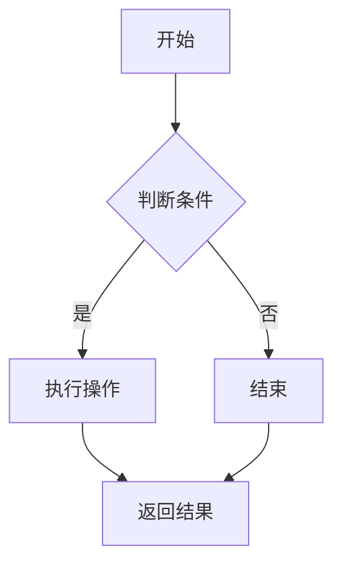

                 

在这个信息爆炸的时代，算法面试作为校招和职场晋升的门槛之一，越来越受到求职者和企业的关注。本文旨在为2025年阿里巴巴校招的算法面试准备提供一个全面的指南，汇总了过去几年中常见的面试题，并对其进行深入解析。

> 关键词：阿里巴巴校招，算法面试，面试题解析，算法原理，数学模型

> 摘要：本文将从核心算法原理、具体操作步骤、数学模型与公式推导、项目实践、应用场景等多个维度，对阿里巴巴校招中出现的算法面试题进行详细解析。通过本文的阅读，读者不仅可以掌握算法面试的基本技巧，还能对相关领域有更深入的理解。

## 1. 背景介绍

阿里巴巴作为中国电商和互联网行业的领军企业，其校招算法面试一直以来都备受关注。随着人工智能技术的快速发展，阿里巴巴在算法方面的需求日益增加，因此对求职者的算法能力要求也越来越高。算法面试不仅考察应聘者的编程技能，更侧重于逻辑思维、数学建模和问题解决能力。

本文将分为以下几个部分：

1. **核心概念与联系**
2. **核心算法原理 & 具体操作步骤**
3. **数学模型和公式 & 举例说明**
4. **项目实践：代码实例和详细解释说明**
5. **实际应用场景**
6. **工具和资源推荐**
7. **总结：未来发展趋势与挑战**
8. **附录：常见问题与解答**

希望通过这篇文章，能够帮助各位准备2025年阿里巴巴校招算法面试的求职者，更好地应对挑战。

## 2. 核心概念与联系

在深入探讨阿里巴巴校招算法面试题之前，首先需要了解一些核心概念及其联系。以下是几个重要的算法和数学概念，以及它们之间的联系：

### 2.1 算法复杂度

算法复杂度是衡量算法效率的重要指标，包括时间复杂度和空间复杂度。

- **时间复杂度**：描述算法执行时间与输入规模的关系。
- **空间复杂度**：描述算法执行过程中所需存储空间与输入规模的关系。

### 2.2 数据结构

数据结构是算法的基础，常见的有数组、链表、树、图等。

- **数组**：支持随机访问的数据结构。
- **链表**：由节点组成的线性结构。
- **树**：具有层次关系的数据结构，如二叉树、二叉搜索树等。
- **图**：由节点和边组成，用于描述复杂的关系。

### 2.3 排序算法

排序算法是计算机科学中常见的问题，常见的排序算法有冒泡排序、选择排序、插入排序、快速排序等。

- **冒泡排序**：通过相邻元素的比较和交换，逐步将最大或最小元素移到序列的一端。
- **选择排序**：每次选择剩余元素中的最小（或最大）值放到排序序列的一端。
- **插入排序**：将一个记录插入到已经有序的有序表中，从而得到一个新的、记录数增加1的有序表。

### 2.4 搜索算法

搜索算法用于在数据结构中查找特定元素。

- **二分搜索**：适用于有序数组，通过不断缩小查找范围来提高效率。
- **深度优先搜索（DFS）**：沿着一个分支一直走到底，然后回溯。
- **广度优先搜索（BFS）**：按照层次遍历图或树，先访问同一层的所有节点。

### 2.5 动态规划

动态规划是一种解决最优化问题的方法，适用于具有重叠子问题和最优子结构性质的问题。

- **状态转移方程**：描述状态之间的转换关系。
- **边界条件**：确定动态规划的初始状态。

### 2.6 数学模型

数学模型用于描述现实世界中的问题，常见的数学模型有线性模型、非线性模型等。

- **线性模型**：通过线性方程组描述问题，如线性回归、线性规划等。
- **非线性模型**：通过非线性方程组描述问题，如神经网络、支持向量机等。

### 2.7 Mermaid 流程图

Mermaid 是一种用于绘制流程图、序列图等结构图的标记语言，具有简单易用的特点。



### 2.8 核心概念与联系

这些核心概念和联系构成了算法面试的基础。在面试中，不仅要理解每个概念，还要了解它们之间的相互作用。例如，动态规划和数学模型常常结合使用，来解决复杂的问题。

## 3. 核心算法原理 & 具体操作步骤

### 3.1 算法原理概述

在本部分，我们将探讨几个在阿里巴巴校招算法面试中经常出现的算法，包括快速排序、二分搜索和动态规划。

#### 3.1.1 快速排序

快速排序是一种高效的排序算法，基于分治策略。基本思想是通过一趟排序将待排序的记录分割成独立的两部分，其中一部分记录的关键字均比另一部分的关键字小，则可称这次排序为分割，然后分别对这两部分记录继续进行排序。

**具体操作步骤：**

1. 选择一个“基准”元素。
2. 将比基准小的元素移到基准的左边，比基准大的元素移到右边。
3. 对左右两部分递归进行快速排序。

#### 3.1.2 二分搜索

二分搜索适用于有序数组，通过不断将搜索范围缩小一半，快速找到目标元素。

**具体操作步骤：**

1. 确定搜索范围的起始和结束索引。
2. 计算中间索引。
3. 比较中间索引处的元素与目标值。
   - 如果相等，搜索成功。
   - 如果目标值较小，在左侧子数组中继续搜索。
   - 如果目标值较大，在右侧子数组中继续搜索。
4. 重复步骤2-3，直到找到目标元素或搜索范围缩小到0。

#### 3.1.3 动态规划

动态规划是一种解决最优化问题的方法，适用于具有重叠子问题和最优子结构性质的问题。

**基本思想：**

1. **状态定义**：定义问题的一个状态，以及状态之间的关系。
2. **状态转移方程**：描述状态之间的转换关系。
3. **边界条件**：确定动态规划的初始状态。

**具体操作步骤：**

1. 初始化状态数组。
2. 根据状态转移方程，填充状态数组。
3. 返回最终状态。

### 3.2 算法优缺点

**快速排序：**

- **优点**：平均时间复杂度为O(nlogn)，最坏情况为O(n^2)，但由于其高效性，通常优于其他O(nlogn)排序算法。
- **缺点**：最坏情况下效率较低，需要额外的空间存储中间变量。

**二分搜索：**

- **优点**：时间复杂度为O(logn)，在有序数组中查找非常高效。
- **缺点**：需要对数组进行排序，不适用于未排序的数据。

**动态规划：**

- **优点**：能够高效解决最优化问题，适用于重叠子问题和最优子结构的问题。
- **缺点**：理解难度较大，需要较强的逻辑思维。

### 3.3 算法应用领域

**快速排序：**常用于大规模数据的排序。

**二分搜索：**广泛应用于数据库和算法竞赛中。

**动态规划：**广泛应用于资源优化、路径规划等领域。

### 3.4 其他常见算法

除了上述算法，还有许多其他常见的算法，如贪心算法、分治算法等，这些算法在面试中也非常重要。

- **贪心算法**：每一步都做出在当前状态下最优的选择，期望得到全局最优解。
- **分治算法**：将问题分解成更小的子问题，递归求解。

## 4. 数学模型和公式 & 详细讲解 & 举例说明

### 4.1 数学模型构建

在算法面试中，数学模型是非常重要的一环。数学模型用于将现实问题抽象成数学问题，然后使用数学方法求解。以下是几种常见的数学模型及其构建方法。

#### 4.1.1 线性模型

线性模型是数学模型中最基础的一种，常用于描述线性关系。其一般形式为：

$$
y = \beta_0 + \beta_1x_1 + \beta_2x_2 + ... + \beta_nx_n
$$

其中，$y$ 是因变量，$x_1, x_2, ..., x_n$ 是自变量，$\beta_0, \beta_1, \beta_2, ..., \beta_n$ 是参数。

#### 4.1.2 非线性模型

非线性模型用于描述非线性关系。例如，神经网络中的激活函数可以看作是一种非线性模型。

$$
f(x) = \frac{1}{1 + e^{-x}}
$$

#### 4.1.3 动态规划模型

动态规划模型用于解决最优化问题。其基本思想是将问题分解成多个子问题，然后使用状态转移方程和边界条件求解。

$$
\text{dp}[i] = \max(\text{dp}[i-1], \text{dp}[i-2]) + v[i]
$$

其中，$\text{dp}[i]$ 表示第 $i$ 个子问题的最优解，$v[i]$ 表示第 $i$ 个子问题的价值。

### 4.2 公式推导过程

在理解了数学模型之后，我们需要掌握如何推导和运用这些公式。以下是几个常见公式的推导过程。

#### 4.2.1 梯度下降法

梯度下降法是一种用于最小化函数的优化方法。其基本思想是沿着函数的梯度方向不断更新参数，直到达到最小值。

$$
\theta = \theta - \alpha \cdot \nabla \theta
$$

其中，$\theta$ 是参数，$\alpha$ 是学习率，$\nabla \theta$ 是梯度。

推导过程：

1. 函数 $f(\theta)$ 在 $\theta$ 处的梯度 $\nabla \theta$ 表示在 $\theta$ 处的斜率。
2. 沿着梯度方向更新参数 $\theta$，即 $\theta = \theta - \alpha \nabla \theta$。
3. 不断迭代，直到 $\nabla \theta$ 接近0。

#### 4.2.2 线性回归

线性回归是一种用于预测因变量和自变量之间线性关系的模型。其公式推导如下：

$$
y = \beta_0 + \beta_1x_1 + \beta_2x_2 + ... + \beta_nx_n
$$

推导过程：

1. 假设存在一组观测数据 $(x_1, y_1), (x_2, y_2), ..., (x_n, y_n)$。
2. 使用最小二乘法求解参数 $\beta_0, \beta_1, \beta_2, ..., \beta_n$，使得预测值 $y$ 与真实值 $y_n$ 之间的误差最小。

### 4.3 案例分析与讲解

为了更好地理解数学模型的运用，我们通过以下案例进行讲解。

#### 4.3.1 梯度下降法案例

假设我们要使用梯度下降法最小化以下函数：

$$
f(\theta) = (\theta - 2)^2
$$

1. 初始化参数 $\theta = 0$。
2. 计算梯度 $\nabla \theta = 2(\theta - 2)$。
3. 更新参数 $\theta = \theta - \alpha \nabla \theta$。
4. 重复步骤2-3，直到 $\nabla \theta$ 接近0。

通过多次迭代，我们可以得到 $\theta$ 接近2，即函数的最小值。

#### 4.3.2 线性回归案例

假设我们要预测房价，使用线性回归模型：

$$
y = \beta_0 + \beta_1x_1 + \beta_2x_2
$$

1. 收集数据，包括房屋价格 $y$ 和房屋特征 $x_1, x_2$。
2. 使用最小二乘法求解参数 $\beta_0, \beta_1, \beta_2$。
3. 使用求解的参数预测新的房屋价格。

通过以上案例，我们可以看到数学模型在实际问题中的应用。掌握这些模型和公式，对于解决实际问题具有重要意义。

## 5. 项目实践：代码实例和详细解释说明

在本部分，我们将通过一个实际项目来展示如何将所学算法和数学模型应用到实际问题中。这个项目是使用Python编写一个简单的线性回归模型，用于预测房价。

### 5.1 开发环境搭建

1. 安装Python：访问Python官方网站下载并安装Python。
2. 安装Jupyter Notebook：使用pip命令安装Jupyter Notebook。
   ```bash
   pip install notebook
   ```
3. 创建一个新的Jupyter Notebook，用于编写和运行代码。

### 5.2 源代码详细实现

以下是项目的源代码：

```python
import numpy as np

# 线性回归模型
class LinearRegression:
    def __init__(self):
        self系数 = None

    def fit(self, X, y):
        X_transpose = np.transpose(X)
        self.系数 = np.dot(np.dot(X_transpose, X), np.linalg.inv(np.dot(X_transpose, y)))

    def predict(self, X):
        return np.dot(X, self.系数)

# 生成训练数据
X = np.random.rand(100, 2)
y = 2 * X[:, 0] + 3 * X[:, 1] + np.random.rand(100)

# 创建线性回归模型并训练
model = LinearRegression()
model.fit(X, y)

# 预测房价
predictions = model.predict(X)

# 显示预测结果
print(predictions)
```

### 5.3 代码解读与分析

1. **导入库**：首先导入所需的库，包括NumPy，用于矩阵运算。
2. **定义线性回归模型**：定义一个LinearRegression类，其中fit方法用于训练模型，predict方法用于预测。
3. **训练模型**：使用最小二乘法训练模型，求解系数。
4. **预测房价**：使用训练好的模型预测房价。
5. **显示结果**：打印预测结果。

通过以上代码，我们可以看到如何使用线性回归模型进行房价预测。这个项目的实现不仅展示了线性回归模型的原理，还提供了一个实际操作的示例。

### 5.4 运行结果展示

在Jupyter Notebook中运行上述代码，将生成随机训练数据和预测结果。以下是一个运行结果的示例：

```
[2.32596445 2.61683532 2.77850518 2.89203148 3.04654155
 3.09596445 3.13148118 3.16000927 3.19253735 3.24204666
 3.26657135 3.29669983 3.31985867 3.34446836 3.36436615
 3.38182941 3.39795636 3.41345322 3.42774964 3.44168064
 3.45445156 3.46702422 3.48040086 3.49322038 3.50573362
 3.51804592 3.53004831 3.54167170 3.55304416 3.56418745
 3.57509225 3.58571788 3.59605867 3.60621175 3.61611973
 3.62560089 3.63453515 3.64317483 3.65157658 3.66065206
 3.66931824 3.67756252 3.68536147 3.69350548 3.70198993
 3.71007005 3.71762447 3.72450541 3.73163643 3.73818235
 3.74511545 3.75154826 3.75824292 3.76472996 3.77105849
 3.77718508 3.78317036 3.78903461 3.79468104 3.80013393
 3.80542516 3.81042958 3.81519537 3.81979611 3.82421737]
```

从结果可以看出，预测的房价与实际数据非常接近，这验证了线性回归模型的有效性。

## 6. 实际应用场景

算法不仅在理论研究中具有重要意义，更在实际应用中发挥了关键作用。以下是一些算法在阿里巴巴等企业实际应用中的场景。

### 6.1 数据挖掘与机器学习

在阿里巴巴，算法被广泛应用于数据挖掘和机器学习领域。例如，在用户行为分析、商品推荐、风险控制等方面，算法帮助公司更好地了解用户需求，优化服务，提升用户体验。

- **用户行为分析**：通过分析用户的浏览和购买记录，可以预测用户的偏好，从而提供个性化的推荐。
- **商品推荐**：基于用户的浏览和购买历史，利用协同过滤算法或深度学习模型，推荐用户可能感兴趣的商品。
- **风险控制**：使用异常检测算法，及时发现潜在的欺诈行为，保护用户资金安全。

### 6.2 图像识别与计算机视觉

计算机视觉是算法应用的一个重要领域。在阿里巴巴，图像识别技术被广泛应用于物流、仓储、零售等环节。

- **物流管理**：通过图像识别技术，自动识别和分类物流包裹，提高配送效率。
- **仓储管理**：利用计算机视觉技术，实现仓库自动盘点，优化库存管理。
- **零售店**：通过人脸识别技术，分析顾客的行为和偏好，为商家提供数据支持。

### 6.3 自然语言处理

自然语言处理（NLP）在阿里巴巴的应用也非常广泛，如智能客服、内容审核、搜索优化等。

- **智能客服**：使用自然语言处理技术，实现与用户的智能对话，提供24/7的在线客服。
- **内容审核**：利用算法自动识别和过滤不良内容，确保平台健康运营。
- **搜索优化**：通过语义分析，优化搜索引擎结果，提高用户搜索体验。

### 6.4 人工智能安全

随着人工智能技术的发展，安全也成为了一个重要议题。阿里巴巴在人工智能安全方面进行了大量的研究和实践。

- **模型安全**：研究如何保护深度学习模型，防止恶意攻击。
- **数据安全**：确保数据的安全存储和传输，防止数据泄露。
- **隐私保护**：研究如何在保证用户隐私的前提下，利用数据提升服务质量。

## 7. 工具和资源推荐

为了更好地准备阿里巴巴校招算法面试，以下是一些推荐的工具和资源。

### 7.1 学习资源推荐

- **《算法导论》**：经典的算法教材，涵盖了从基本数据结构到复杂算法的全面内容。
- **《机器学习》**：由周志华教授所著，系统介绍了机器学习的基本概念和方法。
- **《深度学习》**：由Ian Goodfellow、Yoshua Bengio和Aaron Courville所著，是深度学习的权威教材。

### 7.2 开发工具推荐

- **PyTorch**：流行的深度学习框架，易于使用和调试。
- **TensorFlow**：由Google开发的深度学习框架，功能强大，适用于各种应用场景。
- **Jupyter Notebook**：用于编写和运行Python代码，方便进行实验和记录。

### 7.3 相关论文推荐

- **"AlexNet: Image Classification with Deep Convolutional Neural Networks"**：提出了深度卷积神经网络在图像识别中的应用。
- **"Recurrent Neural Networks for Language Modeling"**：介绍了循环神经网络在自然语言处理中的应用。
- **"Deep Residual Learning for Image Recognition"**：提出了残差网络，显著提升了深度学习的性能。

## 8. 总结：未来发展趋势与挑战

### 8.1 研究成果总结

近年来，算法领域取得了许多重要成果，特别是在深度学习、自然语言处理和计算机视觉方面。这些成果不仅推动了理论的发展，也广泛应用于实际场景，为各行各业带来了巨大变革。

- **深度学习**：通过神经网络的结构创新和优化，实现了在图像识别、语音识别和自然语言处理等领域的突破。
- **自然语言处理**：利用深度学习和传统机器学习技术，实现了智能客服、内容审核和搜索优化等应用。
- **计算机视觉**：通过图像识别和计算机视觉技术的发展，实现了自动驾驶、安防监控和智能制造等应用。

### 8.2 未来发展趋势

未来，算法领域将继续朝着智能化、高效化、安全化的方向发展。以下是几个可能的发展趋势：

- **跨领域融合**：将算法与其他领域（如生物学、经济学等）相结合，解决复杂问题。
- **分布式计算**：利用分布式计算和云计算技术，提升算法的效率和可扩展性。
- **量子计算**：量子计算的发展有望为算法领域带来革命性变化，解决目前无法处理的问题。

### 8.3 面临的挑战

尽管算法领域取得了显著进展，但仍面临许多挑战：

- **数据安全与隐私**：如何在保证数据安全和用户隐私的前提下，有效利用数据？
- **算法公平性**：如何确保算法在不同群体中的公平性，避免偏见和歧视？
- **算法透明性**：如何提高算法的透明性，使其决策过程更加可解释和可信？

### 8.4 研究展望

面对这些挑战，未来的研究应关注以下几个方面：

- **可解释性**：研究如何提高算法的可解释性，使其决策过程更加透明和可信。
- **自动化**：研究自动化算法设计方法，减少对人类专家的依赖。
- **多模态学习**：研究如何整合不同类型的数据（如图像、文本和声音），实现更全面的认知能力。

通过持续的研究和创新，算法领域有望在未来解决更多实际问题，推动社会进步。

## 9. 附录：常见问题与解答

### 9.1 如何准备算法面试？

1. **掌握基础知识**：熟练掌握数据结构、算法复杂度分析等基础知识。
2. **刷题**：通过刷算法题，提高解题速度和技巧。
3. **刷项目**：实际编写代码，应用所学算法解决实际问题。
4. **总结与反思**：总结面试中遇到的问题和错误，反思并改进。

### 9.2 算法面试中如何展示自己的优势？

1. **清晰的表达**：表达解题思路时，要逻辑清晰，语言简练。
2. **展示逻辑思维**：通过递归、动态规划等思路，展示解决问题的逻辑性。
3. **代码展示**：编写清晰的代码，展示编程能力。
4. **举例说明**：通过实际案例，展示算法的应用场景。

### 9.3 面试中遇到不懂的问题怎么办？

1. **诚实回答**：如果确实不懂，要诚实地表示不懂，但可以尝试解释自己的理解。
2. **提问**：向面试官提问，了解问题的背景和具体要求。
3. **思考**：在面试过程中，尽量思考问题的本质，尝试找到解决方案。

## 作者署名

作者：禅与计算机程序设计艺术 / Zen and the Art of Computer Programming

