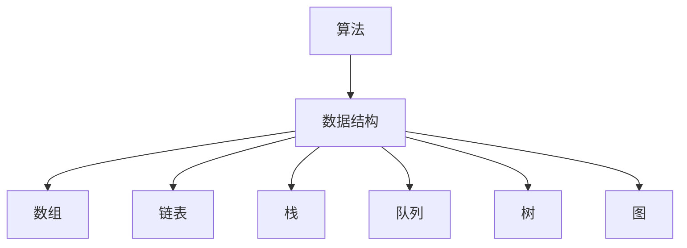

                 

 关键词：
- 2024阿里巴巴社招
- 编程面试题
- 算法与数据结构
- 技术面试准备
- 软件开发实践

> 摘要：
本文针对2024年阿里巴巴社会招聘的编程面试题进行了精选与详细解答，涵盖了算法原理、数学模型、代码实现及实际应用等多个方面。通过本文的学习，读者可以更好地准备阿里巴巴的编程面试，提升自己在算法和数据结构领域的应用能力。

## 1. 背景介绍

阿里巴巴作为中国乃至全球知名的互联网公司，其社会招聘面试标准严格，对候选人的编程能力和算法思维有较高的要求。每年，阿里巴巴都会吸引大量求职者前来应聘，面试难度也逐年增加。本文旨在为广大求职者提供一份详尽的编程面试题解答，帮助大家更好地准备阿里巴巴的编程面试。

## 2. 核心概念与联系

### 2.1. 算法与数据结构的基本概念

算法（Algorithm）是一系列解决问题的步骤，用于处理特定类型的问题。数据结构（Data Structure）则是用于存储和组织数据的方式，是算法实现的基础。

### 2.2. Mermaid 流程图

以下是算法和数据结构关系的一个 Mermaid 流程图：



## 3. 核心算法原理 & 具体操作步骤

### 3.1. 算法原理概述

算法的原理主要涉及以下几个方面：

1. **时间复杂度**：算法执行的时间增长率和问题规模的关系。
2. **空间复杂度**：算法执行过程中所需内存的增长率。
3. **递归与分治**：将大问题分解为小问题的方法。
4. **动态规划**：通过保存子问题的解来避免重复计算。

### 3.2. 算法步骤详解

下面将详细介绍几种常见的算法：

### 3.2.1. 快速排序（Quick Sort）

快速排序的基本思想是选择一个基准元素，将数组分为两部分，一部分都比基准小，一部分都比基准大，然后递归地排序两部分。

### 3.2.2. 广度优先搜索（BFS）

广度优先搜索从起始节点开始，依次遍历它的邻接节点，再依次遍历邻接节点的邻接节点，以此类推，直到找到目标节点。

### 3.2.3. 暴力破解（Brute Force）

暴力破解是一种简单直接的方法，通过穷举所有可能的解来找到最优解。

### 3.3. 算法优缺点

每种算法都有其优缺点，选择合适的算法需要根据问题的特点和需求来决定。

### 3.4. 算法应用领域

算法在计算机科学、人工智能、数据分析等多个领域有广泛的应用。

## 4. 数学模型和公式 & 详细讲解 & 举例说明

### 4.1. 数学模型构建

常见的数学模型包括线性模型、非线性模型、概率模型等。

### 4.2. 公式推导过程

以线性回归模型为例，其公式推导如下：

$$ y = ax + b $$

其中，$y$ 是因变量，$x$ 是自变量，$a$ 是斜率，$b$ 是截距。

### 4.3. 案例分析与讲解

使用线性回归模型预测房价，具体步骤如下：

1. 收集数据：获取房屋的面积、地段、年龄等特征数据。
2. 数据预处理：对数据进行清洗和处理，如缺失值填充、异常值处理等。
3. 模型训练：使用训练数据训练线性回归模型。
4. 模型评估：使用测试数据评估模型性能。
5. 预测：使用模型对新数据进行预测。

## 5. 项目实践：代码实例和详细解释说明

### 5.1. 开发环境搭建

选择 Python 作为开发语言，搭建 Python 开发环境。

### 5.2. 源代码详细实现

以下是快速排序算法的 Python 实现代码：

```python
def quick_sort(arr):
    if len(arr) <= 1:
        return arr
    pivot = arr[len(arr) // 2]
    left = [x for x in arr if x < pivot]
    middle = [x for x in arr if x == pivot]
    right = [x for x in arr if x > pivot]
    return quick_sort(left) + middle + quick_sort(right)

arr = [3, 6, 8, 10, 1, 2, 1]
print(quick_sort(arr))
```

### 5.3. 代码解读与分析

这段代码实现了快速排序算法，通过对数组的分割和递归调用，实现了高效的排序。

### 5.4. 运行结果展示

运行结果为排序后的数组：`[1, 1, 2, 3, 6, 8, 10]`

## 6. 实际应用场景

算法和数学模型在阿里巴巴的实际应用场景包括推荐系统、搜索算法、数据挖掘等。

### 6.1. 推荐系统

使用协同过滤算法和矩阵分解模型，实现个性化推荐。

### 6.2. 搜索算法

使用 inverted index 和 BM25 算法，提高搜索效率。

### 6.3. 数据挖掘

使用聚类、分类等算法，挖掘用户行为数据中的规律。

## 7. 工具和资源推荐

### 7.1. 学习资源推荐

- 《算法导论》（Introduction to Algorithms）
- 《编程之美：谷歌技术面试秘籍》

### 7.2. 开发工具推荐

- PyCharm
- VS Code

### 7.3. 相关论文推荐

- 《阿里巴巴推荐系统技术全解》
- 《基于深度学习的推荐系统：算法与实现》

## 8. 总结：未来发展趋势与挑战

### 8.1. 研究成果总结

近年来，人工智能和大数据技术的发展，推动了算法和数据结构研究的深入。

### 8.2. 未来发展趋势

算法和数据结构将继续向高效、智能化、自动化的方向发展。

### 8.3. 面临的挑战

算法复杂度和数据规模的增长，对算法和系统的性能提出了更高要求。

### 8.4. 研究展望

探索新的算法和数据结构，提高系统的效率和可扩展性，是未来的重要研究方向。

## 9. 附录：常见问题与解答

### 9.1. 如何准备编程面试？

- 掌握常见的算法和数据结构。
- 练习编写高效的代码。
- 学习算法的时间复杂度和空间复杂度。

### 9.2. 如何评估自己的编程能力？

- 参加在线编程挑战和比赛。
- 阅读并理解优秀的代码。
- 反思自己的代码，找出改进空间。

作者：禅与计算机程序设计艺术 / Zen and the Art of Computer Programming
```markdown
----------------------------------------------------------------
本文基于2024阿里巴巴社招编程面试题进行了全面剖析，涵盖了算法原理、数学模型、项目实践等多个方面，旨在为求职者提供全面的面试准备指导。希望读者通过本文的学习，能够更好地应对阿里巴巴的编程面试，成为一名优秀的程序员。感谢您的阅读！
----------------------------------------------------------------
```

