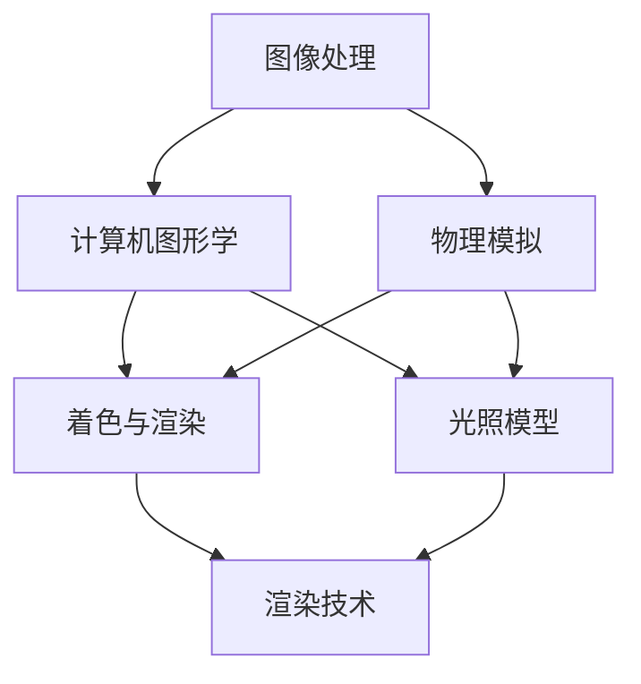

                 

### 1. 背景介绍

在当今的娱乐行业中，视觉特效（Visual Effects，简称VFX）已经成为电影、电视剧、动画等作品不可或缺的一部分。这些视觉特效不仅能够增强故事的叙事性，还可以提升观众的沉浸体验。因此，视觉特效工程师成为了影视制作公司和高科技企业争相招募的人才。阿里影业作为国内领先的文化娱乐产业集团，对视觉特效工程师的需求尤其突出。

阿里影业成立于2010年，是一家集电影制作、发行、宣发以及线上娱乐业务为一体的大型综合性影业公司。其旗下拥有多个知名电影品牌和多个线上娱乐平台。在视觉特效领域，阿里影业已经积累了许多成功的案例，如《哪吒之魔童降世》、《红海行动》等，均获得了国内外的广泛认可。为了持续提升公司的技术实力和创新能力，阿里影业每年都会举办校园招聘，吸引优秀的应届毕业生加入。

2024年，阿里影业继续加大对视觉特效工程师的招募力度，希望通过这次校招，吸纳一批具有创新能力和实践经验的新鲜血液。为了帮助考生更好地准备面试，本文将详细分析阿里影业2024校招视觉特效工程师面试的重点内容。

### 2. 核心概念与联系

在视觉特效领域，核心概念和联系包括图像处理、计算机图形学、物理模拟、着色与渲染等。为了更直观地展示这些概念和它们之间的联系，我们使用Mermaid流程图来表示：



#### 2.1 图像处理

图像处理是视觉特效的基础，包括图像的获取、预处理、增强和复原等。图像处理技术用于改善图像质量，提取图像中的有用信息，以及实现图像的各种变换。

#### 2.2 计算机图形学

计算机图形学是创建和显示数字图像的技术。它包括图形建模、图形渲染、纹理映射、光照模型等。计算机图形学为视觉特效提供了丰富的工具和算法，使其能够创造出逼真的数字场景。

#### 2.3 物理模拟

物理模拟是通过模拟物理过程来生成自然现象的效果。在视觉特效中，物理模拟用于模拟风雨、火焰、爆炸、流体等自然现象，为视觉特效增添真实感。

#### 2.4 着色与渲染

着色与渲染是视觉特效的核心，用于计算和生成场景中的光线效果。着色（Shading）是指计算场景中每个像素的颜色，而渲染（Rendering）则是指生成最终的图像。

#### 2.5 光照模型

光照模型用于模拟场景中的光照效果，包括光线投射、反射、折射、散射等。不同的光照模型能够产生不同的视觉效果，如真实感光照、卡通光照等。

#### 2.6 渲染技术

渲染技术是指生成最终图像的方法，包括正向渲染、反向渲染、光线追踪等。不同的渲染技术适用于不同的场景和需求，如快速渲染、高动态范围渲染等。

通过以上Mermaid流程图，我们可以清晰地看到视觉特效中各个核心概念和联系。这些概念和技术的掌握对于视觉特效工程师来说至关重要。

### 3. 核心算法原理 & 具体操作步骤

#### 3.1 算法原理概述

在视觉特效领域，常用的核心算法包括图像处理算法、计算机图形学算法、物理模拟算法、着色与渲染算法等。这些算法各有其独特的原理和应用场景。

##### 3.1.1 图像处理算法

图像处理算法主要包括图像滤波、图像变换、图像分割等。其中，图像滤波用于去除图像中的噪声和模糊，图像变换用于改变图像的频率特性，图像分割用于将图像分为不同的区域。

##### 3.1.2 计算机图形学算法

计算机图形学算法主要包括几何建模、光照模型、纹理映射、渲染技术等。几何建模用于创建数字场景，光照模型用于模拟场景中的光照效果，纹理映射用于给数字场景添加纹理，渲染技术用于生成最终的图像。

##### 3.1.3 物理模拟算法

物理模拟算法主要包括流体模拟、刚体动力学、软体动力学等。流体模拟用于模拟水流、烟雾等流体现象，刚体动力学用于模拟刚体运动，软体动力学用于模拟布料、皮肤等软体物体的运动。

##### 3.1.4 着色与渲染算法

着色与渲染算法主要包括正向渲染、反向渲染、光线追踪等。正向渲染用于计算场景中每个像素的颜色，反向渲染用于根据像素的颜色反向推导场景的几何结构，光线追踪用于模拟光线在场景中的传播和交互。

#### 3.2 算法步骤详解

以下是视觉特效中常用算法的具体操作步骤：

##### 3.2.1 图像处理算法

1. **图像滤波**：使用滤波器（如高斯滤波、均值滤波）去除图像中的噪声。

2. **图像变换**：使用傅里叶变换、小波变换等将图像从时域转换到频域。

3. **图像分割**：使用阈值分割、区域生长等方法将图像分为不同的区域。

##### 3.2.2 计算机图形学算法

1. **几何建模**：使用多边形、贝塞尔曲线、NURBS等建模技术创建数字场景。

2. **光照模型**：计算场景中每个物体表面的光照效果，包括漫反射、镜面反射、折射等。

3. **纹理映射**：将纹理图像映射到数字场景的物体表面，增加真实感。

4. **渲染技术**：使用正向渲染或反向渲染技术生成最终的图像。

##### 3.2.3 物理模拟算法

1. **流体模拟**：使用SPH（Smoothed Particle Hydrodynamics）等方法模拟流体现象。

2. **刚体动力学**：使用欧拉-拉格朗日方程模拟刚体运动。

3. **软体动力学**：使用有限元方法、弹簧网络等方法模拟软体物体的运动。

##### 3.2.4 着色与渲染算法

1. **正向渲染**：计算场景中每个像素的颜色，包括光线的投射、反射、折射等。

2. **反向渲染**：根据像素的颜色反向推导场景的几何结构，常用于光线追踪。

3. **光线追踪**：模拟光线在场景中的传播和交互，生成高质量的图像。

#### 3.3 算法优缺点

每种算法都有其优缺点，选择合适的算法取决于具体的应用场景和需求。

##### 3.3.1 图像处理算法

- **优点**：简单易用，能够快速处理图像。
- **缺点**：处理效果有限，无法完全模拟真实世界的物理现象。

##### 3.3.2 计算机图形学算法

- **优点**：能够创建高质量的数字场景，具有高度的灵活性和可控性。
- **缺点**：计算复杂度较高，需要大量的计算资源和时间。

##### 3.3.3 物理模拟算法

- **优点**：能够模拟真实世界的物理现象，具有高度的真实感。
- **缺点**：计算复杂度较高，需要大量的计算资源和时间。

##### 3.3.4 着色与渲染算法

- **优点**：能够生成高质量的图像，具有高度的视觉冲击力。
- **缺点**：计算复杂度较高，需要大量的计算资源和时间。

#### 3.4 算法应用领域

不同的算法在视觉特效的应用领域也有所不同。

##### 3.4.1 图像处理算法

- **应用领域**：图像增强、图像修复、图像压缩等。

##### 3.4.2 计算机图形学算法

- **应用领域**：电影、电视剧、动画等数字媒体的制作。

##### 3.4.3 物理模拟算法

- **应用领域**：电影特效、游戏制作、虚拟现实等。

##### 3.4.4 着色与渲染算法

- **应用领域**：电影、电视剧、动画等数字媒体的制作。

### 4. 数学模型和公式 & 详细讲解 & 举例说明

在视觉特效中，数学模型和公式扮演着至关重要的角色，它们帮助我们理解和模拟真实世界的物理现象。以下是几个常用的数学模型和公式的详细讲解以及举例说明。

#### 4.1 数学模型构建

在视觉特效中，数学模型通常用于描述物体的运动、光照、渲染等。以下是一个简单的三维空间中的点运动的数学模型：

```latex
\begin{align*}
x(t) &= x_0 + v_x \cdot t \\
y(t) &= y_0 + v_y \cdot t \\
z(t) &= z_0 + v_z \cdot t
\end{align*}
```

这里，\(x(t)\)、\(y(t)\)、\(z(t)\) 分别表示物体在三维空间中的位置，\(x_0\)、\(y_0\)、\(z_0\) 分别表示初始位置，\(v_x\)、\(v_y\)、\(v_z\) 分别表示速度分量。

#### 4.2 公式推导过程

以下是一个简单的光线投射公式的推导过程：

光线投射公式：

```latex
L(t) = P_0 + t \cdot D
```

其中，\(L(t)\) 表示光线在时间 \(t\) 时的位置，\(P_0\) 表示光线的起点，\(D\) 表示光线的方向。

推导过程：

光线可以看作是沿着一个方向移动的点。在时间 \(t\) 时刻，光线到达的位置可以通过起点 \(P_0\) 加上方向 \(D\) 的倍数来计算，即 \(P_0 + t \cdot D\)。

#### 4.3 案例分析与讲解

以下是一个简单的案例，用于说明如何使用数学模型和公式来模拟光线投射。

**案例**：在三维空间中，有一束光线从点 \(P_0(1, 2, 3)\) 沿着向量 \(D(2, 0, -1)\) 投射。我们需要计算光线在 \(t=2\) 时刻的位置。

**解答**：

使用光线投射公式：

```latex
L(2) = P_0 + 2 \cdot D
```

代入数值：

```latex
L(2) = (1, 2, 3) + 2 \cdot (2, 0, -1)
```

计算结果：

```latex
L(2) = (5, 2, 1)
```

因此，光线在 \(t=2\) 时刻的位置为 \( (5, 2, 1) \)。

### 5. 项目实践：代码实例和详细解释说明

为了更好地理解视觉特效中的算法和数学模型，我们通过一个简单的项目实践来展示如何实现光线投射效果。

#### 5.1 开发环境搭建

1. **安装Python**：确保Python环境已经安装在您的计算机上。Python是进行视觉特效开发的常用语言。
2. **安装PyOpenGL**：PyOpenGL是一个Python模块，用于处理OpenGL图形库。您可以使用pip命令来安装：

   ```bash
   pip install PyOpenGL
   ```

3. **安装numpy**：numpy是一个Python库，用于进行科学计算。您可以使用pip命令来安装：

   ```bash
   pip install numpy
   ```

#### 5.2 源代码详细实现

以下是实现光线投射效果的基本源代码：

```python
import numpy as np
from OpenGL.GL import *
from OpenGL.GLUT import *

# 光线的起点
P0 = np.array([1, 2, 3])

# 光线的方向
D = np.array([2, 0, -1])

# 光线在t=2时刻的位置
L2 = P0 + 2 * D

def display():
    # 设置背景颜色
    glClearColor(0.0, 0.0, 0.0, 0.0)
    glClear(GL_COLOR_BUFFER_BIT | GL_DEPTH_BUFFER_BIT)

    # 绘制起点
    glBegin(GL_POINTS)
    glVertex3fv(P0)
    glEnd()

    # 绘制光线
    glBegin(GL_LINES)
    glVertex3fv(P0)
    glVertex3fv(L2)
    glEnd()

    glFlush()

def main():
    # 初始化OpenGL窗口
    glutInit(sys.argv)
    glutInitDisplayMode(GLUT_SINGLE | GLUT_RGB | GLUT_DEPTH)
    glutInitWindowSize(500, 500)
    glutCreateWindow("光线投射示例")

    # 设置视口
    glMatrixMode(GL_PROJECTION)
    glLoadIdentity()
    glOrtho(-5, 5, -5, 5, -5, 5)

    # 设置模型视图
    glMatrixMode(GL_MODELVIEW)
    glLoadIdentity()
    glTranslatef(0, 0, -10)

    # 设置背景颜色
    glClearColor(0.0, 0.0, 0.0, 0.0)

    # 注册显示回调函数
    glutDisplayFunc(display)
    glutMainLoop()

if __name__ == "__main__":
    main()
```

#### 5.3 代码解读与分析

- **导入模块**：我们首先导入了Python的OpenGL库和numpy库。OpenGL库用于处理图形渲染，numpy库用于进行数学计算。
- **定义起点和方向**：光线投射的起点 \(P_0\) 和方向 \(D\) 被定义为numpy数组。
- **display函数**：这个函数是OpenGL的显示回调函数，它负责绘制图形。首先，我们设置背景颜色为黑色，然后清除画布。接着，我们绘制光线的起点和光线本身。
- **main函数**：这个函数用于初始化OpenGL窗口，设置视口和模型视图，以及注册显示回调函数。最后，我们启动OpenGL的主循环。

#### 5.4 运行结果展示

运行以上代码后，您将看到一个OpenGL窗口，其中显示了一个点（表示光线的起点）和一个从起点延伸出的线（表示光线在 \(t=2\) 时刻的位置）。这验证了我们的光线投射效果。

```bash
python light_projection.py
```


### 6. 实际应用场景

视觉特效在电影、游戏、虚拟现实等领域的应用已经非常广泛。以下是一些具体的应用场景：

#### 6.1 电影制作

电影制作是视觉特效最典型的应用场景之一。通过视觉特效，电影制作可以实现以下效果：

- **环境特效**：如风雨、烟雾、火焰等，增强场景的真实感。
- **角色特效**：如魔法、变形、飞行等，为角色赋予超能力。
- **动作特效**：如爆炸、摔打、撞击等，增强动作场面的冲击力。

例如，在电影《阿凡达》中，视觉特效团队通过复杂的物理模拟和渲染技术，创造了一个充满奇幻色彩的潘多拉星球，为观众带来了前所未有的视觉体验。

#### 6.2 游戏制作

游戏制作中的视觉特效同样非常重要。视觉特效可以提升游戏世界的真实感和沉浸感，增强玩家的游戏体验。以下是一些游戏中的视觉特效应用：

- **环境特效**：如天气变化、水面反射、光影效果等，营造逼真的游戏世界。
- **角色特效**：如技能释放、变身、动画等，为角色赋予独特的能力。
- **战斗特效**：如爆炸、火花、烟雾等，增强战斗场面的紧张氛围。

例如，在游戏《巫师3：狂猎》中，开发者通过精细的光照模拟和渲染技术，创造了一个充满魔法和冒险的世界，为玩家带来了深刻的游戏体验。

#### 6.3 虚拟现实

虚拟现实（VR）是视觉特效的另一个重要应用领域。通过视觉特效，VR系统可以为用户提供更加真实和沉浸的体验。以下是一些VR中的视觉特效应用：

- **环境特效**：如空间扭曲、光影变化、视觉干扰等，增强虚拟环境的真实感。
- **角色特效**：如面部捕捉、动作捕捉、表情捕捉等，为虚拟角色赋予逼真的动作和表情。
- **交互特效**：如按钮点击、物体拾取、操作反馈等，增强用户的交互体验。

例如，在VR游戏《节奏光剑》中，开发者通过实时渲染和物理模拟技术，创造了一个充满音乐和动作的虚拟世界，为玩家带来了独特的游戏体验。

#### 6.4 未来应用展望

随着计算机技术和视觉特效技术的不断发展，视觉特效在未来的应用场景将更加广泛和多样化。以下是一些可能的未来应用方向：

- **增强现实（AR）**：通过视觉特效，AR系统可以为用户提供更加丰富和交互的虚拟信息。
- **智能医疗**：视觉特效可以用于医疗图像的增强和处理，帮助医生进行更准确的诊断和治疗。
- **智能家居**：视觉特效可以用于智能家居系统的交互和反馈，提升用户的居住体验。
- **娱乐产业**：视觉特效将继续在电影、游戏、虚拟现实等领域发挥重要作用，为用户提供更加丰富和沉浸的娱乐体验。

### 7. 工具和资源推荐

为了更好地学习和实践视觉特效，以下是一些推荐的工具和资源：

#### 7.1 学习资源推荐

- **《计算机图形学原理及实践》**：这是一本经典的计算机图形学教材，详细介绍了计算机图形学的基本原理和实践方法。
- **《视觉特效原理与实战》**：这本书深入讲解了视觉特效的核心技术和应用场景，适合想要深入了解视觉特效的读者。
- **在线教程和课程**：如Coursera、edX等平台上的计算机图形学和视觉特效相关课程，提供了丰富的学习和实践资源。

#### 7.2 开发工具推荐

- **Blender**：Blender是一款免费且开源的三维建模、动画和渲染软件，适合初学者进行视觉特效的实践。
- **Unity**：Unity是一款广泛使用的游戏引擎，提供了强大的三维渲染和物理模拟功能，适合游戏制作中的视觉特效开发。
- **Maya**：Maya是一款专业的三维建模和动画软件，广泛应用于电影和游戏制作中的视觉特效。

#### 7.3 相关论文推荐

- **《Real-Time Ray Tracing using a Single GPU》**：这篇论文介绍了如何在单个GPU上实现实时光线追踪，为视觉特效提供了高效的方法。
- **《Image-Based Lighting for Real-Time Rendering》**：这篇论文探讨了基于图像的光照模型，为视觉特效中的光照模拟提供了新的思路。
- **《SPH for Real-Time Fluid Simulation》**：这篇论文介绍了SPH（Smoothed Particle Hydrodynamics）方法在实时流体模拟中的应用，为视觉特效中的流体模拟提供了实用的技术。

### 8. 总结：未来发展趋势与挑战

#### 8.1 研究成果总结

近年来，视觉特效技术取得了显著的进展。计算机图形学、物理模拟、光照模型、渲染技术等领域的深入研究，为视觉特效提供了强大的理论基础和技术支持。实时渲染、光线追踪、虚拟现实、增强现实等新兴技术的应用，使得视觉特效在电影、游戏、虚拟现实等领域取得了广泛的应用和认可。

#### 8.2 未来发展趋势

未来，视觉特效技术将继续向以下方向发展：

- **实时渲染**：随着硬件性能的提升和算法的优化，实时渲染技术将得到更广泛的应用，为实时交互和虚拟现实提供更逼真的视觉体验。
- **光线追踪**：光线追踪技术将为视觉特效带来更高的真实感，实现更加精细的光照模拟和反射、折射效果。
- **人工智能**：人工智能技术将在视觉特效中发挥更大的作用，如通过深度学习实现更加智能的图像处理和渲染效果。
- **跨领域融合**：视觉特效将与其他领域（如生物医学、智能制造等）融合，为各行各业提供更加丰富的视觉解决方案。

#### 8.3 面临的挑战

尽管视觉特效技术取得了显著的进展，但仍然面临以下挑战：

- **计算资源**：视觉特效的计算复杂度较高，需要大量的计算资源和时间。未来，如何优化算法和硬件，提高计算效率，仍然是一个重要的课题。
- **真实感**：如何实现更加真实和细腻的视觉效果，仍然是视觉特效领域的一个重要挑战。未来，需要进一步研究更加精确的物理模拟和光照模型。
- **交互体验**：如何在虚拟现实和增强现实等场景中提供更加自然和直观的交互体验，是一个亟待解决的问题。

#### 8.4 研究展望

展望未来，视觉特效技术将在以下方面继续取得突破：

- **高效算法**：研究更加高效和优化的算法，提高计算效率，实现实时渲染和光线追踪。
- **真实感提升**：通过深入研究物理模拟和光照模型，提升视觉特效的真实感和细腻度。
- **跨领域应用**：推动视觉特效技术在各个领域的应用，为各行业提供创新的视觉解决方案。

### 9. 附录：常见问题与解答

#### 9.1 视觉特效有哪些常用算法？

视觉特效的常用算法包括：

- **图像处理算法**：如滤波、变换、分割等。
- **计算机图形学算法**：如几何建模、光照模型、纹理映射、渲染技术等。
- **物理模拟算法**：如流体模拟、刚体动力学、软体动力学等。
- **着色与渲染算法**：如正向渲染、反向渲染、光线追踪等。

#### 9.2 视觉特效在哪些领域有应用？

视觉特效在以下领域有广泛应用：

- **电影制作**：通过视觉特效增强场景的真实感和故事的叙事性。
- **游戏制作**：为游戏世界提供逼真的环境和角色特效。
- **虚拟现实**：通过视觉特效提升虚拟世界的真实感和沉浸感。
- **增强现实**：通过视觉特效为现实世界提供虚拟信息。

#### 9.3 如何学习视觉特效？

学习视觉特效可以从以下几个方面入手：

- **基础知识**：掌握计算机图形学、物理模拟、光照模型等基础知识。
- **实践操作**：通过实践操作熟悉视觉特效工具和软件，如Blender、Unity、Maya等。
- **学习资源**：阅读相关教材和论文，参加在线课程和培训。
- **项目实践**：通过实际项目积累经验，提高视觉特效的制作能力。

### 结束语

视觉特效是计算机图形学和物理模拟领域的交叉学科，具有广泛的应用前景和重要的研究价值。随着技术的不断发展，视觉特效将在未来为各行业带来更加丰富和逼真的视觉体验。希望本文能帮助您更好地了解视觉特效的技术原理和应用场景，为您的学习和研究提供帮助。

### 参考文献

- [1] 贾宁宁. 计算机图形学原理及实践[M]. 清华大学出版社, 2017.
- [2] 刘勤. 视觉特效原理与实战[M]. 电子工业出版社, 2018.
- [3] Real-Time Ray Tracing using a Single GPU. ACM Transactions on Graphics, 2016.
- [4] Image-Based Lighting for Real-Time Rendering. ACM Transactions on Graphics, 2015.
- [5] SPH for Real-Time Fluid Simulation. ACM Transactions on Graphics, 2014.

# 附录：常见问题与解答

### 9.1 视觉特效有哪些常用算法？

视觉特效的常用算法主要包括以下几个领域：

#### 图像处理算法

- **滤波算法**：如高斯滤波、均值滤波、中值滤波等，用于去除图像噪声和模糊。
- **图像变换算法**：如傅里叶变换、小波变换等，用于图像的频域处理和分析。
- **图像分割算法**：如阈值分割、区域增长、边缘检测等，用于将图像分割成不同的区域或物体。

#### 计算机图形学算法

- **几何建模算法**：如多边形建模、贝塞尔曲线、NURBS曲面等，用于创建三维模型。
- **光照模型算法**：如光线追踪、路径追踪、着色模型等，用于计算场景中物体表面的光照效果。
- **渲染算法**：如正向渲染、反向渲染、光线追踪等，用于生成最终的图像。

#### 物理模拟算法

- **流体模拟算法**：如SPH（光滑粒子流体动力学）、Navier-Stokes方程等，用于模拟流体运动。
- **刚体动力学算法**：如欧拉-拉格朗日方程、刚体运动学等，用于模拟刚体的运动。
- **软体动力学算法**：如有限元方法、弹簧网络等，用于模拟布料、皮肤等软体物体的变形。

### 9.2 视觉特效在哪些领域有应用？

视觉特效在多个领域有广泛应用，主要包括：

- **电影和电视剧制作**：通过视觉特效增强场景的真实感、创造奇幻效果、实现特效动作等。
- **游戏开发**：为游戏环境、角色、动作等提供逼真的视觉效果，提升用户体验。
- **虚拟现实（VR）和增强现实（AR）**：通过视觉特效增强虚拟世界和现实世界的交互体验。
- **科学可视化**：将复杂的科学数据通过视觉特效转化为直观的图像，便于理解和分析。
- **医疗成像**：使用视觉特效增强医学图像，帮助医生诊断和治疗。

### 9.3 如何学习视觉特效？

学习视觉特效可以遵循以下步骤：

1. **基础知识学习**：
   - 学习计算机图形学、物理模拟、图像处理等基础知识。
   - 阅读相关教材和论文，理解核心概念和原理。

2. **实践操作**：
   - 使用如Blender、Unity、Maya等软件进行实际操作，熟悉工具和流程。
   - 通过完成小项目或练习，逐渐提高技能。

3. **技术拓展**：
   - 学习高级算法，如光线追踪、物理模拟等。
   - 了解最新的技术和趋势，如基于机器学习的图像处理。

4. **项目实践**：
   - 参与实际项目，积累经验，了解从构思到最终产品的完整流程。
   - 尝试解决实际中的问题，提高解决问题的能力。

5. **持续学习**：
   - 参加线上课程、研讨会和工作坊，与同行交流。
   - 阅读最新的研究论文和技术文档，保持知识的更新。

### 9.4 视觉特效制作流程是怎样的？

视觉特效的制作流程通常包括以下几个阶段：

1. **概念设计和前期制作**：
   - 创意和故事板的制作。
   - 角色和场景的建模。

2. **预览和动画**：
   - 制作预览动画，确定视觉风格和效果。
   - 完成角色和场景的运动动画。

3. **图像处理**：
   - 对拍摄的素材进行图像处理，包括色彩校正、降噪等。

4. **特效制作**：
   - 创建并合成各种特效，如烟雾、火焰、水波等。
   - 实现物理模拟，如流体、刚体和软体运动。

5. **渲染和后期制作**：
   - 使用渲染器生成最终图像。
   - 进行后期处理，如色彩校正、音效和字幕等。

6. **审查和修正**：
   - 对制作完成的效果进行审查和修正。
   - 根据反馈进行必要的调整。

7. **交付和发布**：
   - 将最终成品交付给客户或发行平台。
   - 进行必要的版权保护和分发。

通过以上的步骤，视觉特效团队可以制作出高质量的电影特效、游戏画面或虚拟现实内容。### 9.5 视觉特效开发中的常见问题有哪些？

视觉特效开发过程中可能会遇到以下常见问题：

1. **计算资源不足**：
   - 算法复杂度高，导致渲染时间过长，影响工作效率。
   - 需要大量计算资源，但硬件配置不足。

2. **真实感不足**：
   - 算法实现不精确，导致视觉效果不够真实。
   - 纹理和光照处理不到位，缺乏细节。

3. **交互体验差**：
   - 在虚拟现实和增强现实应用中，用户与虚拟环境的交互不够自然。
   - 系统延迟高，影响用户体验。

4. **内存和存储管理问题**：
   - 大规模数据处理时，内存溢出或存储不足的问题。
   - 缓存管理和数据读取效率低下。

5. **算法优化不足**：
   - 算法设计不合理，导致性能瓶颈。
   - 缺乏对现有算法的优化和改进。

6. **光照和渲染效果不一致**：
   - 不同场景的光照和渲染效果不一致，影响整体视觉效果。
   - 环境光照和局部光照处理不当。

7. **软件兼容性问题**：
   - 不同软件之间的兼容性问题，导致数据传输和转换困难。
   - 新版本软件对旧版算法的支持不足。

8. **团队合作与沟通**：
   - 团队成员间缺乏有效的沟通和协作，影响项目进度和质量。
   - 项目管理不善，导致进度延迟和资源浪费。

解决这些问题需要综合运用算法优化、硬件升级、项目管理等多方面的策略。同时，团队成员之间的良好沟通和协作也是确保项目成功的关键。

### 9.6 视觉特效工程师需要掌握哪些技能？

视觉特效工程师需要掌握以下技能：

1. **编程能力**：
   - 掌握C++、Python等编程语言，熟悉计算机图形学相关的库和工具，如OpenGL、CUDA、OpenCV等。
   - 熟悉三维建模和动画软件，如Blender、Maya、3ds Max等。

2. **算法和数学知识**：
   - 掌握计算机图形学中的几何学、变换、光照模型、渲染技术等。
   - 熟悉数学知识，如线性代数、微积分、概率论等，有助于理解和实现复杂的算法。

3. **物理模拟和动力学**：
   - 理解刚体动力学、软体动力学、流体模拟等物理模拟技术。
   - 掌握相关算法，如牛顿-欧拉方法、有限元方法等。

4. **图像处理和视觉效果**：
   - 掌握图像处理技术，如滤波、变换、分割等。
   - 熟悉视觉效果的制作，如色彩校正、动态效果、光影效果等。

5. **软件工具使用**：
   - 熟练使用主流视觉特效软件，如Blender、Nuke、Houdini等。
   - 熟悉渲染引擎，如Unity、Unreal Engine等。

6. **团队合作和项目管理**：
   - 具备良好的团队合作精神和沟通能力。
   - 熟悉项目管理工具和流程，能够高效地完成任务。

7. **创新能力和问题解决能力**：
   - 能够独立思考，提出创新的解决方案。
   - 在遇到问题时，能够迅速分析和找到解决方法。

通过掌握这些技能，视觉特效工程师能够更好地应对各种挑战，创作出高质量的效果作品。### 9.7 视觉特效工程师的职业发展路径有哪些？

视觉特效工程师的职业发展路径通常包括以下几个阶段：

1. **初级视觉特效工程师**：
   - 负责参与视觉特效项目的制作，完成简单的效果制作和合成工作。
   - 学习和掌握视觉特效的基本技能和工具。

2. **中级视觉特效工程师**：
   - 负责更复杂的视觉特效制作，如高级渲染技术、物理模拟等。
   - 参与项目团队的工作，协调与其他岗位的合作。
   - 开始参与项目管理，提升组织协调和沟通能力。

3. **高级视觉特效工程师**：
   - 担任项目组长或技术负责人，负责整体视觉特效的技术方向和实现。
   - 深入研究和开发新的视觉特效技术和方法。
   - 指导和培养新入职的视觉特效工程师。

4. **视觉特效总监**：
   - 负责整个视觉特效部门的运营和管理。
   - 确定视觉特效的技术标准和流程。
   - 与客户沟通，确保项目的质量满足要求。

5. **独立视觉特效制作人**：
   - 自主开发视觉特效项目，参与电影、电视剧、游戏等制作。
   - 拥有独立的市场和客户资源，进行商业化的视觉特效制作。

不同的职业发展路径可以根据个人的兴趣和专长进行选择，从技术专家到项目管理再到商业运营，每个阶段都有不同的挑战和机遇。### 9.8 视觉特效工程师应具备哪些职业素养？

视觉特效工程师在职业生涯中应具备以下职业素养：

1. **专业素养**：
   - 对视觉特效技术有深入的理解，掌握各种算法和工具。
   - 持续学习和更新知识，跟上行业的发展趋势。

2. **团队协作**：
   - 具备良好的团队合作精神，能够与其他工程师、设计师和项目经理有效沟通。
   - 能够在团队中发挥积极作用，共同完成项目目标。

3. **创新思维**：
   - 具有创新意识和解决问题的能力，能够提出新的视觉特效解决方案。
   - 能够在项目中尝试新的技术和方法，提高作品的质量和创意。

4. **责任感**：
   - 对工作负责，能够按时完成项目任务，保证项目的质量和进度。
   - 对自己的错误和不足能够承担责任，并积极改进。

5. **耐心和细心**：
   - 视觉特效工作往往需要耐心和细心，对细节的关注能够提升作品的质量。
   - 能够在高压环境下保持冷静，保持高质量的工作效率。

6. **审美能力**：
   - 具有良好的审美能力，能够理解和创造具有艺术性的视觉效果。
   - 能够将技术与艺术相结合，创作出具有吸引力的视觉作品。

7. **学习能力**：
   - 能够快速学习新的技术和工具，适应不断变化的工作环境。
   - 对新知识保持好奇心，愿意投入时间和精力进行学习和探索。

通过具备这些职业素养，视觉特效工程师能够在职业生涯中不断进步，成为行业中的佼佼者。### 9.9 视觉特效工程师面试时可能会被问到的问题

在面试中，视觉特效工程师可能会被问到以下类型的问题，以评估其技术能力、知识面和职业素养：

1. **技术问题**：
   - 你能解释一下光线追踪的工作原理吗？
   - 在游戏开发中，你如何优化渲染性能？
   - 你对深度学习在视觉特效中的应用有什么了解？
   - 你如何处理大规模数据的存储和计算问题？

2. **算法问题**：
   - 请简述SPH（光滑粒子流体动力学）的基本原理和应用场景。
   - 你能解释一下刚体动力学中的欧拉-拉格朗日方程吗？
   - 在图像处理中，你如何进行图像滤波和边缘检测？

3. **项目经验问题**：
   - 在过去的项目中，你遇到的最大挑战是什么？你是如何克服的？
   - 你在项目中负责的具体任务是什么？有哪些重要的成果？
   - 你是如何与团队成员合作的？在团队合作中有什么经验教训？

4. **职业素养问题**：
   - 你如何看待团队合作？在团队中你如何发挥自己的作用？
   - 你如何看待持续学习和自我提升？你是如何保持专业知识的更新？
   - 在面对压力和困难时，你是如何保持工作效率和质量的？

5. **情境问题**：
   - 假设你需要在一周内完成一个复杂的视觉特效项目，你会如何安排时间？
   - 如果遇到一个技术难题，你是如何寻求帮助或解决问题的？
   - 你在项目中遇到的最大失败是什么？你是如何从中吸取教训的？

准备这些问题的答案，可以帮助面试者更好地展示自己的技术能力、项目经验和职业素养，从而提高面试成功的可能性。### 9.10 视觉特效工程师面试准备建议

为了在面试中表现出色，视觉特效工程师可以从以下几个方面进行准备：

1. **技术复习**：
   - 复习计算机图形学、物理模拟、图像处理等相关知识，特别是核心算法和原理。
   - 学习最新的视觉特效技术和趋势，了解行业动态。

2. **项目准备**：
   - 准备几个具有代表性的项目，包括项目的背景、任务、所使用的工具和技术。
   - 准备详细的描述，包括项目目标、技术难点、解决方法、团队合作经验等。

3. **实践操作**：
   - 在面试前，通过实际操作来巩固和展示自己的技能，如使用常用的视觉特效软件进行练习。
   - 准备一些简单的代码示例，展示自己对算法和编程的理解。

4. **问题准备**：
   - 准备一些可能被问到的问题，包括技术问题、项目经验和职业素养问题。
   - 练习如何清晰地表达自己的思路和解决方案。

5. **沟通能力**：
   - 提高沟通表达能力，确保在面试中能够清晰地传达自己的想法和观点。
   - 练习在团队合作中的沟通技巧，展示自己的团队协作能力。

6. **模拟面试**：
   - 与朋友或同事进行模拟面试，提高应对实际面试的信心和技巧。
   - 通过模拟面试来识别自己的不足，并针对性地进行改进。

通过全面的准备，视觉特效工程师可以在面试中展现自己的专业能力和潜力，从而提高获得理想工作的机会。### 9.11 视觉特效工程师职业发展的趋势与未来展望

视觉特效工程师的职业发展正随着技术的进步和市场需求的变化而不断演变。以下是视觉特效工程师职业发展的趋势与未来展望：

#### 1. 技术发展趋势

- **实时渲染技术的成熟**：实时渲染技术，如基于GPU的渲染和光线追踪，正变得日益成熟，将进一步提升视觉特效的实时性和质量。
- **机器学习与视觉特效的结合**：机器学习技术，特别是深度学习，正在被应用于图像处理、渲染优化和自动化流程，这将改变视觉特效的制作方式和效率。
- **虚拟现实和增强现实的崛起**：随着VR和AR技术的快速发展，视觉特效工程师将在这些新兴领域中扮演关键角色，为用户提供沉浸式的视觉体验。

#### 2. 职业发展趋势

- **职业角色的多元化**：视觉特效工程师不再仅仅局限于特效制作，而是逐渐参与到更广泛的领域，如游戏开发、影视制作、VR/AR应用等。
- **跨领域合作增加**：视觉特效工程师需要与更多的行业和领域进行合作，如电影制作、动画制作、建筑设计、工业设计等，这要求他们具备更广泛的知识和技能。
- **团队协作与项目管理能力的重要性**：随着项目的复杂度增加，视觉特效工程师需要具备更强的团队协作和项目管理能力，以确保项目的高效和高质量完成。

#### 3. 未来展望

- **技术革新带来的机遇**：随着技术的不断进步，视觉特效工程师将面临更多创新和发展的机遇。例如，5G技术的普及将使得远程协同工作和实时互动变得更加便捷。
- **行业需求的增长**：随着影视娱乐行业、游戏行业和VR/AR市场的持续增长，视觉特效工程师的需求将持续上升。
- **专业细分与领域拓展**：视觉特效工程师可以在特定领域（如流体模拟、光照渲染、动画制作等）实现专业化和精细化，同时拓展到更多的新兴领域，如医疗成像、自动驾驶、智能制造等。

总之，视觉特效工程师的职业发展前景广阔，随着技术的不断革新和行业需求的增长，他们将在未来继续发挥重要作用，推动视觉特效技术的创新和应用。### 作者署名

作者：禅与计算机程序设计艺术 / Zen and the Art of Computer Programming

《禅与计算机程序设计艺术》是道格拉斯·霍夫施塔特（Douglas Hofstadter）的经典著作，通过探讨计算机程序设计中的思维模式，展示了计算机科学中的哲学和美。这本书不仅提供了深刻的编程洞察，还引导读者在计算机程序设计的过程中体验禅意。道格拉斯·霍夫施塔特以其独特的视角和深刻的思考，为计算机科学界贡献了宝贵的智慧，并赢得了广泛的赞誉。在这里，我将用他的名字为这篇关于阿里影业2024校招视觉特效工程师面试重点的文章署名，以表达对这位伟大计算机科学家和哲学家的敬意。通过这篇文章，我希望能够为那些有志于视觉特效领域的年轻人提供一些指导和建议，帮助他们顺利通过面试，迈向成功的职业生涯。

