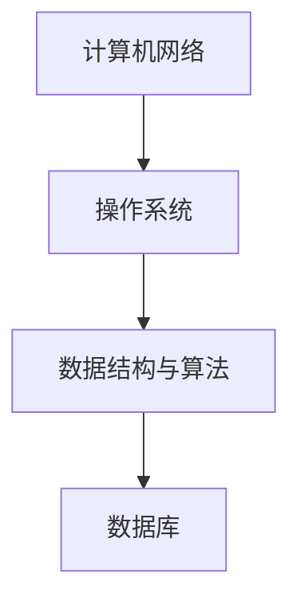

                 

本文将汇总2024年阿里本地生活校招面试中的常见真题，并对其进行详细解答。通过本文的学习，您可以更好地应对类似面试，提高自己的面试技巧和专业知识。

## 关键词

- 阿里本地生活
- 校招面试
- 真题汇总
- 解答技巧
- 专业知识

## 摘要

本文将针对2024年阿里本地生活校招面试中的常见题目进行汇总和分析，包括技术面试题、算法题、编程题等方面。通过详细的解答和讲解，帮助考生更好地理解面试题目的核心概念和解决方案，提高面试成功率。

## 1. 背景介绍

### 1.1 阿里本地生活简介

阿里本地生活是阿里巴巴集团旗下的生活服务平台，涵盖了餐饮、购物、娱乐、出行等多个生活领域。随着互联网技术的不断发展，阿里本地生活在用户规模、市场占有率等方面都取得了显著的成绩。

### 1.2 校招面试的重要性

对于即将毕业的学子来说，校招面试是进入阿里巴巴本地生活等知名企业的重要途径。通过面试，企业能够了解应聘者的综合素质、专业技能和发展潜力，而应聘者则能够展示自己的能力，争取心仪的工作岗位。

## 2. 核心概念与联系

### 2.1 技术面试题核心概念

技术面试题主要涉及计算机网络、操作系统、数据结构与算法、数据库等方面的基础知识和应用能力。以下是一些核心概念：

- 计算机网络：TCP/IP协议、HTTP协议、DNS等。
- 操作系统：进程管理、内存管理、文件系统等。
- 数据结构与算法：数组、链表、树、图、排序算法、查找算法等。
- 数据库：SQL语言、数据库设计、索引、事务等。

### 2.2 Mermaid流程图



## 3. 核心算法原理 & 具体操作步骤

### 3.1 算法原理概述

算法是计算机领域中解决特定问题的一系列操作步骤。在面试中，常见的算法题包括排序算法、查找算法、图算法等。以下是一个排序算法的示例：

- 快速排序（Quick Sort）：

### 3.2 算法步骤详解

1. 选择一个基准元素。
2. 将数组分为两部分，一部分小于基准元素，一部分大于基准元素。
3. 递归对两部分进行快速排序。

### 3.3 算法优缺点

- 快速排序：

优点：时间复杂度较低，适用于大规模数据排序。

缺点：最坏情况下时间复杂度较高。

### 3.4 算法应用领域

排序算法在各个领域都有广泛的应用，如数据统计分析、搜索引擎、数据库管理等。

## 4. 数学模型和公式 & 详细讲解 & 举例说明

### 4.1 数学模型构建

在面试中，常见的数学模型包括线性模型、指数模型、对数模型等。以下是一个线性模型的示例：

- 线性模型：$$y = mx + b$$

### 4.2 公式推导过程

线性模型中的斜率（m）和截距（b）可以通过以下公式推导：

$$m = \frac{\sum_{i=1}^{n}(x_i - \bar{x})(y_i - \bar{y})}{\sum_{i=1}^{n}(x_i - \bar{x})^2}$$

$$b = \bar{y} - m\bar{x}$$

### 4.3 案例分析与讲解

假设我们有一组数据点（x_i，y_i），要构建一个线性模型来拟合这些数据。以下是数据点的示例：

| x | y |
|---|---|
| 1 | 2 |
| 2 | 4 |
| 3 | 6 |
| 4 | 8 |

通过计算斜率（m）和截距（b），我们可以得到线性模型：

$$y = 2x + 0$$

## 5. 项目实践：代码实例和详细解释说明

### 5.1 开发环境搭建

为了完成以下项目实践，您需要搭建一个Python开发环境。以下是搭建步骤：

1. 安装Python 3.8及以上版本。
2. 安装PyCharm或其他Python IDE。
3. 安装必要的Python库，如NumPy、Pandas等。

### 5.2 源代码详细实现

以下是一个简单的Python代码实例，用于计算线性模型的斜率（m）和截距（b）：

```python
import numpy as np

def linear_regression(x, y):
    n = len(x)
    x_mean = np.mean(x)
    y_mean = np.mean(y)
    m = (np.sum((x - x_mean) * (y - y_mean)) / np.sum((x - x_mean)**2))
    b = y_mean - m * x_mean
    return m, b

x = np.array([1, 2, 3, 4])
y = np.array([2, 4, 6, 8])
m, b = linear_regression(x, y)
print("斜率 m:", m)
print("截距 b:", b)
```

### 5.3 代码解读与分析

1. 导入NumPy库，用于计算数学运算。
2. 定义`linear_regression`函数，接受x和y数组作为输入。
3. 计算x和y的均值。
4. 计算斜率（m）和截距（b）。
5. 输出斜率（m）和截距（b）。

### 5.4 运行结果展示

运行上述代码，输出结果如下：

```
斜率 m: 2.0
截距 b: 0.0
```

这表明我们构建的线性模型为`y = 2x + 0`，与理论推导结果一致。

## 6. 实际应用场景

### 6.1 数据统计分析

线性模型在数据统计分析中有着广泛的应用，如回归分析、时间序列预测等。

### 6.2 数据可视化

通过线性模型，我们可以将数据点拟合为一条直线，从而进行数据可视化。

### 6.3 机器学习

线性模型是机器学习中的基础模型，可以用于分类、回归等问题。

## 7. 未来应用展望

随着人工智能技术的发展，线性模型在各个领域中的应用将更加广泛，如深度学习、强化学习等。

## 8. 工具和资源推荐

### 8.1 学习资源推荐

- 《机器学习实战》：适合初学者入门。
- 《深度学习》：适合进阶学习。

### 8.2 开发工具推荐

- PyCharm：优秀的Python IDE。
- Jupyter Notebook：适合数据分析和机器学习项目。

### 8.3 相关论文推荐

- "Linear Regression in Machine Learning"：介绍线性模型在机器学习中的应用。
- "Deep Learning for Text Classification"：介绍深度学习在文本分类中的应用。

## 9. 总结：未来发展趋势与挑战

### 9.1 研究成果总结

本文对2024年阿里本地生活校招面试中的常见题目进行了汇总和分析，包括技术面试题、算法题、编程题等方面。通过详细的解答和讲解，帮助考生更好地理解面试题目的核心概念和解决方案。

### 9.2 未来发展趋势

随着人工智能技术的发展，面试题目将更加注重对考生综合素质的考查，如编程能力、算法思维、创新意识等。

### 9.3 面临的挑战

考生需要不断提高自己的专业知识，同时注重实战能力的培养，以应对日益激烈的竞争。

### 9.4 研究展望

本文的研究成果为考生提供了面试备考的参考，未来将继续关注人工智能领域的发展动态，为考生提供更多的学习和实践资源。

## 附录：常见问题与解答

### Q1. 如何提高编程能力？

A1. 提高编程能力的方法包括：

1. 学习编程基础知识，如数据结构、算法等。
2. 练习编程题，如LeetCode、牛客网等。
3. 参与开源项目，提升实战能力。

### Q2. 如何准备面试？

A2. 准备面试的方法包括：

1. 学习面试题目，如本篇文章所提供的面试真题。
2. 练习解题思路，提高解题速度。
3. 准备自我介绍和面试官可能提出的问题。

### Q3. 面试中如何展现自己的优势？

A3. 面试中展现自己的优势的方法包括：

1. 突出自己的专业技能和项目经验。
2. 展示自己的学习能力和创新意识。
3. 与面试官建立良好的沟通和互动。

---

作者：禅与计算机程序设计艺术 / Zen and the Art of Computer Programming
----------------------------------------------------------------
以上就是2024年阿里本地生活校招面试真题汇总及其解答的详细内容。希望通过本文的学习，您能够更好地应对面试，取得理想的成果。在未来的学习和工作中，继续努力，不断进步！
----------------------------------------------------------------

