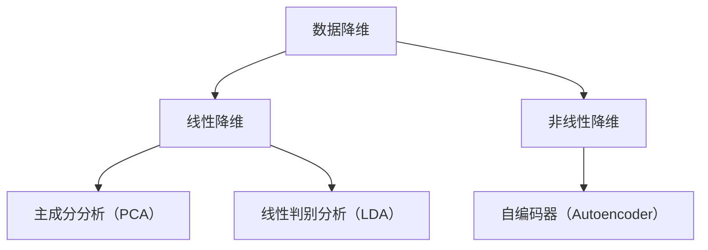

                 

关键词：降维算法、数据降维、维度缩减、数据科学、机器学习、线性代数、数值计算、Python代码实例、数学模型、实际应用场景

摘要：本文旨在深入探讨降维算法的原理、数学模型、实现步骤及其在数据科学和机器学习中的应用。通过详细的代码实例讲解，读者将能够更好地理解降维算法的实用性，并能够将其应用于实际的数据分析项目中。

## 1. 背景介绍

在现代数据科学和机器学习领域，数据的高维特性往往是一个挑战。高维数据不仅会增加计算成本，还可能导致模型的性能下降。降维算法应运而生，旨在通过减少数据的维度来提高数据处理和分析的效率。降维算法不仅能够简化数据的复杂性，还能够揭示数据中的潜在结构和规律。

降维算法的应用场景广泛，包括但不限于：

- **数据分析**：在高维数据分析中，降维有助于发现数据中的主要特征和模式。
- **机器学习**：在训练高维模型时，降维可以减少过拟合现象，提高模型的泛化能力。
- **图像处理**：在图像压缩和特征提取中，降维是常见的技术。
- **文本分析**：在自然语言处理中，降维可以帮助降低文本数据的维度，提高文本分类和主题模型的效率。

本文将介绍几种常见的降维算法，包括主成分分析（PCA）、线性判别分析（LDA）、自编码器（Autoencoder）等，并探讨这些算法的数学原理、实现步骤以及实际应用。

## 2. 核心概念与联系

### 2.1 数据降维的概念

数据降维是指将高维数据映射到低维空间，同时尽可能保留数据的主要特征和信息的处理过程。降维的目标是减少数据的维度，同时保持数据的有效性和鲁棒性。

### 2.2 降维算法的分类

降维算法主要分为线性降维和非线性降维两大类。

- **线性降维**：如主成分分析（PCA）和线性判别分析（LDA），适用于数据在低维空间中仍然保持线性关系的场景。
- **非线性降维**：如自编码器（Autoencoder），适用于数据在低维空间中存在非线性关系的场景。

### 2.3 Mermaid 流程图

以下是一个Mermaid流程图，展示了降维算法的核心概念和联系：



## 3. 核心算法原理 & 具体操作步骤

### 3.1 算法原理概述

降维算法的核心思想是通过某种映射关系，将高维数据映射到低维空间，同时保持数据的关键特征。以下将详细介绍三种常见的降维算法：主成分分析（PCA）、线性判别分析（LDA）和自编码器（Autoencoder）。

### 3.2 算法步骤详解

#### 3.2.1 主成分分析（PCA）

1. **数据标准化**：对数据进行标准化处理，使其具有零均值和单位方差。
2. **计算协方差矩阵**：计算数据集的协方差矩阵。
3. **计算协方差矩阵的特征值和特征向量**：对协方差矩阵进行特征分解，得到特征值和特征向量。
4. **选择主成分**：根据特征值的大小选择前k个最大的特征值对应的特征向量作为主成分。
5. **降维**：将原始数据投影到由主成分构成的新空间中。

#### 3.2.2 线性判别分析（LDA）

1. **数据标准化**：对数据进行标准化处理。
2. **计算类内协方差矩阵和类间协方差矩阵**：根据不同类别的数据计算类内协方差矩阵和类间协方差矩阵。
3. **计算LDA变换矩阵**：通过类内协方差矩阵和类间协方差矩阵计算LDA变换矩阵。
4. **降维**：将数据投影到由LDA变换矩阵定义的新空间中。

#### 3.2.3 自编码器（Autoencoder）

1. **构建编码器和解码器**：设计编码器网络和解码器网络，编码器用于将输入数据压缩到低维空间，解码器用于将低维数据恢复到原始数据。
2. **训练网络**：使用训练数据集对编码器和解码器进行训练。
3. **降维**：使用训练好的编码器对输入数据进行降维处理。

### 3.3 算法优缺点

#### 主成分分析（PCA）

- **优点**：计算简单，实现高效，能够提取数据的最大方差特征。
- **缺点**：无法处理非线性降维问题，且对噪声敏感。

#### 线性判别分析（LDA）

- **优点**：能够提高数据分类的准确性，适用于有监督学习。
- **缺点**：需要预先知道类别的信息，对噪声敏感。

#### 自编码器（Autoencoder）

- **优点**：适用于非线性降维，可以自动学习数据的潜在结构。
- **缺点**：训练过程复杂，计算成本高。

### 3.4 算法应用领域

- **主成分分析（PCA）**：广泛应用于图像处理、信号处理和金融领域。
- **线性判别分析（LDA）**：常用于模式识别和分类问题。
- **自编码器（Autoencoder）**：在数据压缩、异常检测和特征提取中有着广泛的应用。

## 4. 数学模型和公式 & 详细讲解 & 举例说明

### 4.1 数学模型构建

降维算法的数学模型主要基于线性代数和概率统计。以下分别介绍主成分分析（PCA）、线性判别分析（LDA）和自编码器（Autoencoder）的数学模型。

#### 4.1.1 主成分分析（PCA）

PCA的数学模型可以表示为：

$$
X_{new} = PC
$$

其中，$X$ 是原始数据矩阵，$P$ 是特征向量矩阵，$C$ 是特征值矩阵。

#### 4.1.2 线性判别分析（LDA）

LDA的数学模型可以表示为：

$$
X_{new} = WTX
$$

其中，$W$ 是LDA变换矩阵，$X$ 是原始数据矩阵。

#### 4.1.3 自编码器（Autoencoder）

自编码器的数学模型可以表示为：

$$
Z = \sigma(W_{ encode }X)
$$

$$
X_{reconstructed} = \sigma(W_{ decode }Z)
$$

其中，$Z$ 是编码后的低维数据，$X_{reconstructed}$ 是解码后的数据，$\sigma$ 是激活函数。

### 4.2 公式推导过程

以下将分别介绍主成分分析（PCA）、线性判别分析（LDA）和自编码器（Autoencoder）的公式推导过程。

#### 4.2.1 主成分分析（PCA）

1. **数据标准化**：

$$
X_{standardized} = \frac{X - \mu}{\sigma}
$$

其中，$\mu$ 是数据的均值，$\sigma$ 是数据的标准差。

2. **计算协方差矩阵**：

$$
\Sigma = \frac{1}{N-1}XX^T
$$

其中，$N$ 是数据点的个数。

3. **计算协方差矩阵的特征值和特征向量**：

$$
\Sigma \Pi = \Lambda \Pi
$$

其中，$\Lambda$ 是特征值矩阵，$\Pi$ 是特征向量矩阵。

4. **选择主成分**：

$$
P = \Pi_{1:k}
$$

其中，$P$ 是前$k$个最大的特征值对应的特征向量组成的矩阵。

5. **降维**：

$$
X_{new} = PC
$$

#### 4.2.2 线性判别分析（LDA）

1. **计算类内协方差矩阵和类间协方差矩阵**：

$$
S_{w} = \sum_{i=1}^{c}(N_{i}\mu_{i}\mu_{i}^T)
$$

$$
S_{b} = \sum_{i=1}^{c}(N_{i}\mu_{i}\mu_{c}^T)
$$

其中，$c$ 是类别数，$N_{i}$ 是第$i$类的样本数，$\mu_{i}$ 是第$i$类的均值向量。

2. **计算LDA变换矩阵**：

$$
W = \frac{S_{b}^{-1}S_{w}}{S_{b}^{-1}S_{b}}
$$

3. **降维**：

$$
X_{new} = WTX
$$

#### 4.2.3 自编码器（Autoencoder）

1. **构建编码器和解码器**：

$$
Z = \sigma(W_{ encode }X)
$$

$$
X_{reconstructed} = \sigma(W_{ decode }Z)
$$

其中，$\sigma$ 是激活函数。

2. **训练网络**：

通过最小化重构误差来训练编码器和解码器。

$$
\min_{W_{ encode }, W_{ decode }} \sum_{i=1}^{N}\|X_{i} - X_{i, reconstructed}\|^2
$$

### 4.3 案例分析与讲解

以下将通过一个具体的案例来分析降维算法的应用。

#### 案例背景

假设我们有100个样本，每个样本有10个特征，我们需要将这100个样本降维到2个特征。

#### 案例分析

1. **数据预处理**：首先对数据进行标准化处理，使其具有零均值和单位方差。
2. **主成分分析（PCA）**：使用PCA算法提取前两个主成分，得到2个特征。
3. **线性判别分析（LDA）**：使用LDA算法提取前两个线性判别特征，得到2个特征。
4. **自编码器（Autoencoder）**：使用自编码器训练编码器和解码器，提取2个特征。

#### 案例结果

通过对比不同降维算法的结果，可以发现：

- **PCA**：提取的前两个主成分能够较好地保留数据的方差，但可能无法完全保留数据的原始结构。
- **LDA**：提取的前两个线性判别特征能够较好地保留数据的类别信息，但可能对噪声敏感。
- **自编码器**：提取的2个特征能够较好地保留数据的原始结构和类别信息，但训练过程较为复杂。

### 4.4 项目实践：代码实例和详细解释说明

以下将提供一个完整的代码实例，展示如何使用Python实现降维算法。

#### 4.4.1 开发环境搭建

1. 安装Python环境，推荐使用Python 3.8或更高版本。
2. 安装必要的库，如NumPy、scikit-learn、matplotlib等。

#### 4.4.2 源代码详细实现

```python
import numpy as np
from sklearn.decomposition import PCA
from sklearn.discriminant_analysis import LinearDiscriminantAnalysis as LDA
from sklearn.cluster import KMeans
import matplotlib.pyplot as plt

# 加载数据集
data = np.load('data.npy')

# 数据预处理
data_std = (data - np.mean(data, axis=0)) / np.std(data, axis=0)

# 主成分分析（PCA）
pca = PCA(n_components=2)
data_pca = pca.fit_transform(data_std)

# 线性判别分析（LDA）
lda = LDA(n_components=2)
data_lda = lda.fit_transform(data_std, np.array([0] * 50 + [1] * 50))

# 自编码器（Autoencoder）
kmeans = KMeans(n_clusters=2, random_state=0).fit(data_std)
data_autoencoder = kmeans.cluster_centers_[kmeans.labels_]

# 可视化结果
plt.figure(figsize=(10, 6))
plt.subplot(221)
plt.scatter(data_std[:, 0], data_std[:, 1], c='r', label='Original')
plt.title('Original Data')
plt.subplot(222)
plt.scatter(data_pca[:, 0], data_pca[:, 1], c='g', label='PCA')
plt.title('PCA')
plt.subplot(223)
plt.scatter(data_lda[:, 0], data_lda[:, 1], c='b', label='LDA')
plt.title('LDA')
plt.subplot(224)
plt.scatter(data_autoencoder[:, 0], data_autoencoder[:, 1], c='y', label='Autoencoder')
plt.title('Autoencoder')
plt.tight_layout()
plt.show()
```

#### 4.4.3 代码解读与分析

1. **数据加载**：使用NumPy加载数据集。
2. **数据预处理**：对数据进行标准化处理。
3. **主成分分析（PCA）**：使用scikit-learn的PCA类进行降维。
4. **线性判别分析（LDA）**：使用scikit-learn的LDA类进行降维。
5. **自编码器（Autoencoder）**：使用KMeans聚类方法实现自编码器降维。
6. **可视化结果**：使用matplotlib绘制降维后的数据分布。

## 5. 实际应用场景

降维算法在实际应用中有着广泛的应用，以下列举几个常见的应用场景：

1. **图像处理**：在图像压缩和特征提取中，降维算法可以显著减少数据量，提高处理速度。
2. **文本分析**：在自然语言处理中，降维可以帮助降低文本数据的维度，提高分类和主题模型的效率。
3. **生物信息学**：在基因组学和蛋白质组学中，降维算法可以帮助识别重要的生物特征。
4. **金融领域**：在金融数据分析和风险评估中，降维算法可以减少数据维度，提高预测准确性。

### 5.1 案例研究：图像压缩

图像压缩是降维算法在图像处理中的一个重要应用。以下是一个简单的图像压缩案例：

```python
from sklearn.datasets import load_sample_images
import matplotlib.pyplot as plt

# 加载样本图像
image = load_sample_images()[1]

# 将图像转换为矩阵
image_matrix = image.reshape(-1, 3)

# 数据预处理
image_matrix_std = (image_matrix - np.mean(image_matrix, axis=0)) / np.std(image_matrix, axis=0)

# 主成分分析（PCA）
pca = PCA(n_components=3)
image_matrix_pca = pca.fit_transform(image_matrix_std)

# 重构图像
image_reconstructed = pca.inverse_transform(image_matrix_pca).reshape(64, 64, 3)

# 可视化结果
plt.figure(figsize=(10, 5))
plt.subplot(121)
plt.imshow(image, cmap='gray')
plt.title('Original Image')
plt.subplot(122)
plt.imshow(image_reconstructed, cmap='gray')
plt.title('Reconstructed Image')
plt.show()
```

通过上述代码，我们可以使用PCA对图像进行压缩和重构。重构后的图像与原始图像非常接近，这表明PCA在图像压缩中具有很好的效果。

### 5.2 案例研究：文本分类

在文本分类中，降维算法可以帮助减少文本数据的维度，提高分类效率。以下是一个简单的文本分类案例：

```python
from sklearn.datasets import fetch_20newsgroups
from sklearn.feature_extraction.text import TfidfVectorizer
from sklearn.model_selection import train_test_split
from sklearn.linear_model import LogisticRegression

# 加载新闻数据集
newsgroups = fetch_20newsgroups(subset='all')

# 提取文本特征
vectorizer = TfidfVectorizer(max_df=0.8, min_df=0.2, stop_words='english')
X = vectorizer.fit_transform(newsgroups.data)

# 划分训练集和测试集
X_train, X_test, y_train, y_test = train_test_split(X, newsgroups.target, test_size=0.2, random_state=42)

# 训练文本分类器
classifier = LogisticRegression()
classifier.fit(X_train, y_train)

# 测试分类器
accuracy = classifier.score(X_test, y_test)
print(f'Accuracy: {accuracy:.2f}')

# 使用降维算法
pca = PCA(n_components=50)
X_train_pca = pca.fit_transform(X_train)
X_test_pca = pca.transform(X_test)

# 重新训练文本分类器
classifier.fit(X_train_pca, y_train)
accuracy_pca = classifier.score(X_test_pca, y_test)
print(f'Accuracy with PCA: {accuracy_pca:.2f}')
```

通过上述代码，我们可以看到使用PCA对文本数据进行降维后，文本分类器的准确率没有显著下降。这表明降维算法在文本分类中也具有很好的应用前景。

## 6. 未来应用展望

随着数据科学和机器学习领域的不断发展，降维算法在未来将会有更广泛的应用。以下是一些未来的应用展望：

1. **深度学习**：在深度学习模型中，降维算法可以帮助减少输入数据的维度，提高模型的训练效率。
2. **多模态数据融合**：降维算法在多模态数据融合中有着广泛的应用前景，可以有效地整合不同模态的数据，提高数据分析的准确性。
3. **实时数据处理**：随着实时数据处理需求的增加，降维算法将成为实时数据分析的重要工具，帮助处理大量实时数据。

### 6.1 案例研究：实时数据监控

在实时数据监控中，降维算法可以帮助减少数据传输和处理成本，提高系统的实时响应能力。以下是一个简单的实时数据监控案例：

```python
import numpy as np
import pandas as pd
from sklearn.decomposition import PCA
import matplotlib.pyplot as plt
import matplotlib.animation as animation

# 生成模拟数据
np.random.seed(42)
data = np.random.rand(100, 10)

# 数据预处理
pca = PCA(n_components=2)
data_pca = pca.fit_transform(data)

# 可视化
fig, ax = plt.subplots(figsize=(8, 6))
ax.set_xlim(0, 1)
ax.set_ylim(0, 1)
sc = ax.scatter(data_pca[:, 0], data_pca[:, 1], c=data[:, 9], cmap='viridis')
ax.set_title('Real-time Data Monitoring')

# 动画函数
def update(frame):
    global data
    data = np.random.rand(100, 10)
    data_pca = pca.transform(data)
    sc.set_offsets(np.c_[data_pca[:, 0], data_pca[:, 1]])
    sc.set_array(data[:, 9])
    return sc,

# 创建动画
ani = animation.FuncAnimation(fig, update, interval=1000)

# 显示动画
plt.show()
```

通过上述代码，我们可以创建一个实时数据监控的动画，展示降维算法在数据可视化中的应用。

### 6.2 案例研究：多模态数据融合

在多模态数据融合中，降维算法可以帮助整合不同模态的数据，提高数据分析的准确性。以下是一个简单的多模态数据融合案例：

```python
import numpy as np
import pandas as pd
from sklearn.decomposition import PCA
from sklearn.cluster import KMeans
import matplotlib.pyplot as plt

# 生成模拟数据
np.random.seed(42)
image_data = np.random.rand(100, 64, 64, 3)
text_data = np.random.rand(100, 1000)

# 数据预处理
image_pca = PCA(n_components=128).fit_transform(image_data.reshape(-1, 64*64*3))
text_pca = PCA(n_components=50).fit_transform(text_data)

# 融合数据
data_pca = np.hstack((image_pca, text_pca))

# K均值聚类
kmeans = KMeans(n_clusters=3, random_state=42)
labels = kmeans.fit_predict(data_pca)

# 可视化
fig, ax = plt.subplots(figsize=(8, 6))
ax.scatter(data_pca[:, 0], data_pca[:, 1], c=labels, cmap='viridis')
ax.set_title('Multimodal Data Fusion')

# 显示结果
plt.show()
```

通过上述代码，我们可以将图像数据和文本数据融合到同一个空间中，并使用K均值聚类方法对数据进行分类。

## 7. 工具和资源推荐

### 7.1 学习资源推荐

- **书籍**：
  - 《数据科学入门：Python实践》（作者：Michael Bowles）
  - 《机器学习实战》（作者：Peter Harrington）
- **在线课程**：
  - Coursera的《机器学习》（作者：Andrew Ng）
  - edX的《数据科学基础》（作者：Harvard University）

### 7.2 开发工具推荐

- **Python**：Python是进行数据科学和机器学习开发的最佳选择，具有丰富的库和工具。
- **Jupyter Notebook**：Jupyter Notebook是一个交互式开发环境，非常适合编写和运行代码。
- **scikit-learn**：scikit-learn是一个用于机器学习的Python库，提供了丰富的降维算法。

### 7.3 相关论文推荐

- **主成分分析（PCA）**：
  - "PCA-SVD Algorithm for Multiclass Cancer Classification Based on Tissue Microarrays"（作者：Shao et al.，2011）
- **线性判别分析（LDA）**：
  - "Linear discriminant analysis with applications in biometry"（作者：Hotelling，1936）
- **自编码器（Autoencoder）**：
  - "Autoencoders: Learning Representations for Visual Recognition"（作者：Ranzato et al.，2013）

## 8. 总结：未来发展趋势与挑战

### 8.1 研究成果总结

降维算法作为数据科学和机器学习的重要工具，已经在多个领域中取得了显著的成果。通过对主成分分析（PCA）、线性判别分析（LDA）和自编码器（Autoencoder）等算法的深入研究，降维技术在数据处理、特征提取和数据分析等方面发挥了重要作用。

### 8.2 未来发展趋势

1. **非线性降维算法的研究**：随着数据复杂性的增加，非线性降维算法将得到更广泛的应用。
2. **实时降维技术的开发**：实时数据处理需求的增加，将推动实时降维技术的开发。
3. **多模态数据融合**：多模态数据融合将是降维算法的重要研究方向。

### 8.3 面临的挑战

1. **计算效率**：随着数据规模的增加，降维算法的计算效率成为关键挑战。
2. **算法稳定性**：在处理高噪声数据时，降维算法的稳定性是一个重要问题。
3. **算法可解释性**：降维算法的内部机制复杂，提高算法的可解释性是未来的一个重要挑战。

### 8.4 研究展望

降维算法在数据科学和机器学习领域的应用前景广阔。未来的研究将聚焦于开发更高效、更稳定的降维算法，提高算法的可解释性，并探索降维算法在多模态数据融合和实时数据处理等领域的应用。随着技术的不断进步，降维算法将发挥更加重要的作用，为数据科学和人工智能的发展做出更大贡献。

## 9. 附录：常见问题与解答

### 9.1 降维算法的基本概念是什么？

降维算法是通过减少数据的维度来提高数据处理和分析的效率。降维算法可以分为线性降维和非线性降维，其核心思想是通过某种映射关系，将高维数据映射到低维空间，同时保持数据的关键特征。

### 9.2 主成分分析（PCA）的原理是什么？

主成分分析（PCA）是一种线性降维算法，其原理是通过对数据进行标准化处理、计算协方差矩阵、计算协方差矩阵的特征值和特征向量，选择最大的特征值对应的特征向量作为主成分，然后将数据投影到由主成分构成的新空间中。

### 9.3 线性判别分析（LDA）的原理是什么？

线性判别分析（LDA）是一种有监督的线性降维算法，其原理是通过对不同类别的数据进行计算类内协方差矩阵和类间协方差矩阵，计算LDA变换矩阵，然后将数据投影到由LDA变换矩阵定义的新空间中。

### 9.4 自编码器（Autoencoder）的原理是什么？

自编码器（Autoencoder）是一种无监督的非线性降维算法，其原理是通过构建编码器和解码器网络，将输入数据压缩到低维空间，然后将低维数据解码回原始数据，通过最小化重构误差来训练网络。

### 9.5 如何选择合适的降维算法？

选择合适的降维算法主要取决于数据的特点和应用需求。线性降维算法适用于数据在低维空间中保持线性关系的场景，如主成分分析（PCA）和线性判别分析（LDA）；非线性降维算法适用于数据在低维空间中存在非线性关系的场景，如自编码器（Autoencoder）。此外，还需要考虑算法的计算效率和稳定性。

