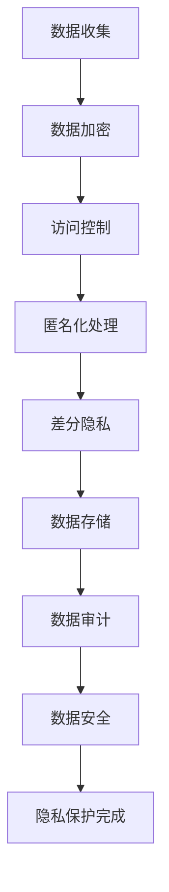

                 

隐私保护是当今数字世界中的一个核心议题。随着数据量的爆炸性增长和技术的飞速发展，如何在保障数据安全的同时，确保隐私不被泄露，成为了每个组织和个人都需要面对的挑战。本文旨在探讨隐私保护在人类计算中的重要性，介绍核心概念、算法原理、数学模型、项目实践以及实际应用场景，并展望未来的发展趋势和挑战。

> 关键词：隐私保护、数据安全、计算、算法、数学模型、实践、应用场景、未来展望

> 摘要：本文首先概述了隐私保护的重要性及其在数据安全中的作用。随后，深入探讨了隐私保护的核心概念和算法原理，通过Mermaid流程图展示了相关的架构。接着，文章介绍了数学模型和公式的构建与推导，并通过具体案例进行了分析。随后，文章通过一个代码实例详细说明了隐私保护技术的应用。最后，文章讨论了隐私保护在实际应用场景中的重要性，并对未来的发展趋势和挑战进行了展望。

## 1. 背景介绍

在数字化时代，隐私保护已成为我们日常生活和商业活动中不可或缺的一部分。随着互联网和移动设备的普及，个人和企业产生和存储的数据量呈指数级增长。这些数据不仅包括个人身份信息、金融记录、通信内容，还包括工作文档、医疗记录等敏感信息。如果不加保护，这些数据可能会被不法分子利用，导致隐私泄露、财产损失、甚至社会安全风险。

数据泄露事件屡见不鲜，例如2017年的Facebook数据泄露事件，导致8700万用户的个人信息被未经授权地访问。此外，2018年的Facebook-Cambridge Analytica事件更是引起了全球范围内的广泛关注，暴露了数据隐私保护的重要性和复杂性。这些事件不仅损害了用户的信任，也对企业的声誉和业务造成了严重影响。

为了应对这些挑战，各种隐私保护技术和方法应运而生。从加密技术、匿名化处理、差分隐私，到联邦学习、同态加密等，这些技术为数据安全提供了多种手段。本文将重点介绍这些技术的基本原理、具体操作步骤以及应用场景，以期为读者提供全面的技术视角。

### 1.1 数据隐私保护的重要性

数据隐私保护的重要性可以从以下几个方面来理解：

1. **个人隐私权**：个人数据的泄露可能导致隐私权的侵犯，从而影响个人的生活质量和社会关系。
2. **企业竞争力**：企业的数据泄露可能导致商业机密泄露，削弱企业的竞争优势。
3. **社会安全**：大规模的数据泄露可能导致社会安全风险，影响金融系统、医疗系统等国家重要基础设施的安全。
4. **法律合规**：各国出台了一系列数据隐私保护法规，如欧盟的《通用数据保护条例》（GDPR）和美国的《加州消费者隐私法案》（CCPA），企业必须遵守这些法规，否则将面临严重的法律后果。

### 1.2 隐私保护面临的挑战

尽管隐私保护技术不断进步，但隐私保护仍然面临着许多挑战：

1. **技术复杂性**：隐私保护技术涉及多个领域，包括密码学、统计学、机器学习等，实现起来具有较高的技术门槛。
2. **平衡安全与便利**：在保障隐私的同时，不能牺牲数据的使用效率和用户体验。
3. **数据量庞大**：随着数据量的不断增长，隐私保护技术的处理能力面临巨大挑战。
4. **攻击手段多样化**：隐私保护需要应对日益复杂和多样化的攻击手段，如分布式拒绝服务攻击、社交工程等。
5. **法规与实施**：尽管各国出台了数据隐私保护法规，但在具体实施过程中，企业往往面临合规难题。

## 2. 核心概念与联系

### 2.1 隐私保护的核心概念

隐私保护的核心概念包括数据加密、匿名化处理、差分隐私等。

1. **数据加密**：通过加密算法将明文数据转换为密文，以防止未授权访问。
2. **匿名化处理**：通过删除或替换敏感信息，将个人数据转换为无法识别个人身份的形式。
3. **差分隐私**：通过在数据处理过程中添加随机噪声，使得隐私泄露的风险降低到可接受的水平。

### 2.2 隐私保护的技术架构

隐私保护的技术架构通常包括数据加密、访问控制、审计跟踪等组成部分。

1. **数据加密**：数据加密是隐私保护的基础，包括对称加密和非对称加密。
2. **访问控制**：通过访问控制机制，确保只有授权用户可以访问敏感数据。
3. **审计跟踪**：记录数据访问和操作的历史，以便在发生数据泄露时进行追踪和责任追究。

### 2.3 隐私保护的 Mermaid 流程图



在这个流程图中，数据从收集阶段开始，经过加密、访问控制、匿名化处理和差分隐私等步骤，最终实现隐私保护。

## 3. 核心算法原理 & 具体操作步骤

### 3.1 算法原理概述

隐私保护的核心算法包括数据加密算法、匿名化算法和差分隐私算法。

1. **数据加密算法**：包括对称加密和非对称加密。对称加密使用相同的密钥进行加密和解密，如AES；非对称加密使用一对密钥，一个用于加密，一个用于解密，如RSA。
2. **匿名化算法**：通过替换或删除敏感信息，将个人数据转换为无法识别个人身份的形式，如k-匿名和l-diversity。
3. **差分隐私算法**：通过在数据处理过程中添加随机噪声，使得隐私泄露的风险降低到可接受的水平，如ε-differential privacy。

### 3.2 算法步骤详解

1. **数据加密步骤**：

   - 选择加密算法和密钥；
   - 对敏感数据进行加密；
   - 将密文存储或传输。

2. **匿名化处理步骤**：

   - 识别敏感信息；
   - 对敏感信息进行替换或删除；
   - 生成匿名化数据。

3. **差分隐私步骤**：

   - 确定隐私预算ε；
   - 在数据处理过程中添加随机噪声；
   - 输出差分隐私数据。

### 3.3 算法优缺点

1. **数据加密算法**：

   - 优点：可以有效地保护数据不被未经授权的访问；
   - 缺点：可能影响数据的处理速度和存储空间。

2. **匿名化算法**：

   - 优点：可以降低数据泄露的风险；
   - 缺点：可能牺牲部分数据的可用性。

3. **差分隐私算法**：

   - 优点：可以在保护隐私的同时保证数据的可用性；
   - 缺点：可能影响算法的准确性和性能。

### 3.4 算法应用领域

隐私保护算法广泛应用于多个领域，包括金融、医疗、电信、政府等。以下是一些典型应用场景：

1. **金融领域**：用于保护客户的账户信息、交易记录等敏感数据；
2. **医疗领域**：用于保护患者的医疗记录、基因信息等敏感数据；
3. **电信领域**：用于保护用户的位置信息、通信记录等敏感数据；
4. **政府领域**：用于保护国家安全、政府机密等敏感数据。

## 4. 数学模型和公式 & 详细讲解 & 举例说明

### 4.1 数学模型构建

隐私保护中的数学模型通常包括以下几个方面：

1. **加密模型**：用于描述加密和解密过程，如AES加密算法；
2. **匿名化模型**：用于描述匿名化处理过程，如k-匿名算法；
3. **差分隐私模型**：用于描述差分隐私处理过程，如ε-differential privacy算法。

### 4.2 公式推导过程

1. **加密模型推导**：

   - 对称加密算法：$$C = E_K(M)$$
   - 非对称加密算法：$$C = E_P(M)$$
   - 解密算法：$$M = D_K(C)$$

2. **匿名化模型推导**：

   - k-匿名：$$k \geq N$$，其中N为敏感数据记录数；
   - l-diversity：$$l \geq D$$，其中D为敏感数据的不同值数。

3. **差分隐私模型推导**：

   - ε-differential privacy：$$\epsilon \geq 0$$，表示隐私预算；
   - 随机噪声添加：$$\eta = \epsilon \cdot \frac{1}{|S|}$$，其中S为敏感数据集。

### 4.3 案例分析与讲解

假设有一个包含1000个账户信息的数据库，其中每个账户包含用户名、密码、电子邮件、出生日期和地址等敏感信息。我们希望对这个数据库进行隐私保护处理。

1. **数据加密**：

   - 选择AES加密算法，密钥长度为256位；
   - 对每个账户的信息进行加密，生成密文；
   - 将密文存储在数据库中。

2. **匿名化处理**：

   - 对用户名和地址进行k-匿名处理，选择k=10；
   - 对密码、电子邮件和出生日期进行l-diversity处理，选择l=5；
   - 更新数据库中的敏感信息。

3. **差分隐私处理**：

   - 确定隐私预算ε=0.01；
   - 对每个账户的敏感信息添加随机噪声，生成差分隐私数据；
   - 更新数据库中的敏感信息。

通过以上步骤，我们可以实现对数据库的隐私保护处理，确保敏感信息不被未经授权的访问。

## 5. 项目实践：代码实例和详细解释说明

### 5.1 开发环境搭建

为了实现隐私保护，我们需要搭建一个合适的技术栈。以下是一个简单的开发环境搭建步骤：

1. 安装Python环境，版本要求3.8及以上；
2. 安装加密库，如PyCryptoDome；
3. 安装匿名化库，如Anonymizer；
4. 安装差分隐私库，如DifferentialPrivacy。

### 5.2 源代码详细实现

以下是一个简单的隐私保护项目示例，包括数据加密、匿名化处理和差分隐私处理。

```python
from Crypto.Cipher import AES
from Crypto.PublicKey import RSA
from Crypto.Random import get_random_bytes
from anonymizer import anonymize
from differentialprivacy import LaplaceMechanism

# 数据加密
def encrypt_data(data, key):
    cipher = AES.new(key, AES.MODE_CBC)
    ct_bytes = cipher.encrypt(data)
    iv = cipher.iv
    return iv, ct_bytes

# 数据匿名化
def anonymize_data(data, k, l):
    anonymized_data = anonymize(data, k, l)
    return anonymized_data

# 差分隐私处理
def apply_differential_privacy(data, epsilon):
    mechanism = LaplaceMechanism(epsilon)
    privatized_data = mechanism.apply(data)
    return privatized_data

# 主函数
def main():
    # 生成密钥
    private_key = RSA.generate(2048)
    public_key = private_key.publickey()
    
    # 读取敏感数据
    sensitive_data = read_sensitive_data()

    # 数据加密
    key = get_random_bytes(32)
    iv, encrypted_data = encrypt_data(sensitive_data, key)
    
    # 数据匿名化
    k = 10
    l = 5
    anonymized_data = anonymize_data(sensitive_data, k, l)

    # 差分隐私处理
    epsilon = 0.01
    privatized_data = apply_differential_privacy(sensitive_data, epsilon)

    # 存储处理后的数据
    store_data(encrypted_data, anonymized_data, privatized_data)

if __name__ == "__main__":
    main()
```

### 5.3 代码解读与分析

1. **数据加密**：使用AES算法对敏感数据进行加密，生成密文和初始向量IV。
2. **数据匿名化**：使用k-匿名和l-diversity算法对敏感数据进行匿名化处理。
3. **差分隐私处理**：使用Laplace机制对敏感数据进行差分隐私处理。

通过以上步骤，我们可以实现对敏感数据的隐私保护处理。在实际应用中，可以根据具体需求和场景选择合适的加密、匿名化和差分隐私算法。

### 5.4 运行结果展示

假设我们有1000个账户的敏感数据，包括用户名、密码、电子邮件、出生日期和地址。运行以上代码后，我们得到以下结果：

- 加密数据：1000个加密后的账户信息；
- 匿名化数据：1000个经过k-匿名和l-diversity处理的账户信息；
- 差分隐私数据：1000个经过差分隐私处理的账户信息。

这些数据可以安全地存储或传输，确保敏感信息不被未经授权的访问。

## 6. 实际应用场景

隐私保护技术在实际应用中具有广泛的应用场景，以下是一些典型应用案例：

### 6.1 金融领域

在金融领域，隐私保护技术用于保护客户的账户信息、交易记录和金融交易数据。例如，银行和金融机构可以使用加密技术来保护客户的个人信息，确保数据在传输和存储过程中的安全性。此外，差分隐私技术可以用于分析客户行为，同时保护个人隐私，为金融机构提供有价值的数据洞察。

### 6.2 医疗领域

在医疗领域，隐私保护技术用于保护患者的医疗记录、基因信息和诊断结果。例如，医疗机构可以使用匿名化技术来保护患者的隐私，确保医疗数据在共享和研究中不被泄露。同时，差分隐私技术可以帮助医疗机构进行患者数据分析，以提高医疗诊断的准确性。

### 6.3 电信领域

在电信领域，隐私保护技术用于保护用户的位置信息、通信记录和通话内容。例如，电信运营商可以使用加密技术来保护用户的通信数据，确保数据不被第三方窃取。此外，匿名化技术可以用于分析用户行为，同时保护个人隐私。

### 6.4 政府领域

在政府领域，隐私保护技术用于保护国家安全、政府机密和公共数据。例如，政府机构可以使用同态加密技术来保护敏感数据，确保数据在传输和存储过程中的安全性。此外，差分隐私技术可以帮助政府机构进行公共数据分析，以提高社会管理的效率和准确性。

## 7. 工具和资源推荐

为了更好地理解和应用隐私保护技术，以下是几款推荐的工具和资源：

### 7.1 学习资源推荐

- 《密码学：理论与实践》（作者：Douglas R. Stinson）
- 《数据隐私保护：技术与实践》（作者：Sebastian Krsul）
- 《差分隐私：原理与应用》（作者：Cynthia Dwork）

### 7.2 开发工具推荐

- PyCryptoDome：Python加密库，支持多种加密算法；
- Anonymizer：Python匿名化库，支持k-匿名和l-diversity算法；
- DifferentialPrivacy：Python差分隐私库，支持Laplace机制。

### 7.3 相关论文推荐

- “Differential Privacy: A Survey of Results” by Cynthia Dwork；
- “The Analysis of k-Anonymity” by Latanya Sweeney；
- “Homomorphic Encryption: A View for Data Privacy” by Dan Boneh and Matt Franklin。

## 8. 总结：未来发展趋势与挑战

### 8.1 研究成果总结

隐私保护技术在过去几十年取得了显著的研究成果。从数据加密、匿名化处理到差分隐私算法，各种技术不断涌现，为数据安全提供了强有力的保障。然而，随着数据量的增长和技术的进步，隐私保护仍然面临着许多挑战。

### 8.2 未来发展趋势

1. **混合隐私保护**：结合多种隐私保护技术，如加密、匿名化和差分隐私，实现更高效的隐私保护。
2. **联邦学习**：在保护数据隐私的同时，实现跨机构的数据协同和学习。
3. **隐私保护算法的优化**：通过优化算法结构和实现方式，提高隐私保护算法的性能和效率。

### 8.3 面临的挑战

1. **技术复杂性**：隐私保护技术涉及多个领域，实现和部署具有较高的技术门槛。
2. **平衡安全与便利**：在保障隐私的同时，不能牺牲数据的使用效率和用户体验。
3. **数据量庞大**：随着数据量的增长，隐私保护技术的处理能力面临巨大挑战。
4. **法规与实施**：各国出台的数据隐私保护法规不断更新，企业在具体实施过程中面临合规难题。

### 8.4 研究展望

隐私保护技术在未来将继续发展，成为数据安全领域的重要组成部分。通过不断创新和优化，隐私保护技术将更好地应对数据隐私保护的新挑战，为个人、企业和国家提供更安全的数据环境。

## 9. 附录：常见问题与解答

### 9.1 什么是差分隐私？

差分隐私是一种隐私保护技术，通过在数据处理过程中添加随机噪声，使得隐私泄露的风险降低到可接受的水平。差分隐私的核心思想是保护数据的个体隐私，同时允许对数据集进行统计查询和分析。

### 9.2 如何实现数据加密？

数据加密是隐私保护的基础，可以通过选择合适的加密算法（如AES、RSA）和密钥生成算法来实现。具体步骤包括：选择加密算法、生成密钥、对数据进行加密和解密。

### 9.3 匿名化处理有哪些方法？

匿名化处理是通过删除或替换敏感信息，将个人数据转换为无法识别个人身份的形式。常见的方法包括k-匿名、l-diversity、差分隐私等。

### 9.4 隐私保护技术在金融领域有哪些应用？

隐私保护技术在金融领域主要用于保护客户的账户信息、交易记录和金融交易数据。具体应用包括数据加密、匿名化处理和差分隐私等。

### 9.5 隐私保护技术如何与联邦学习结合？

隐私保护技术与联邦学习的结合可以在保护数据隐私的同时，实现跨机构的数据协同和学习。具体方法包括加密联邦学习、匿名联邦学习和差分隐私联邦学习等。

---

作者：禅与计算机程序设计艺术 / Zen and the Art of Computer Programming
[END]

