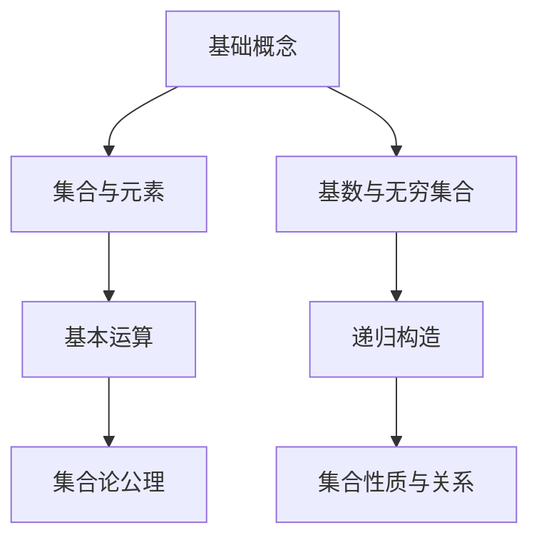

                 

 **关键词**：集合论，集合，基数，运算，递归，递归定义，数学基础

**摘要**：本文旨在为读者提供一个集合论的导引，特别是关注于∑13集合。文章将首先介绍集合论的基本概念，随后深入探讨∑13集合的数学性质和递归定义，并通过具体实例来展示其应用。此外，还将讨论集合论在实际应用场景中的重要性，以及未来的发展方向。

## 1. 背景介绍

集合论是现代数学的基础，它提供了一个统一的方式来描述和操作数学对象。集合论的概念最早由德国数学家戴德金（Richard Dedekind）和德国哲学家康托尔（Georg Cantor）提出。康托尔的工作尤其重要，他引入了无穷集合的概念，揭示了集合的复杂性和多样性。

集合论在数学、计算机科学、物理学和经济学等多个领域都有广泛的应用。例如，在计算机科学中，集合论用于定义数据结构和算法，而在物理学中，集合论帮助描述量子力学中的无穷维空间。

本文将重点关注∑13集合，这是一种特殊的无穷集合。∑13集合在集合论中占有重要地位，其研究有助于理解无穷集合的性质和结构。

## 2. 核心概念与联系

### 2.1 集合的基本概念

集合是由元素组成的无序集。一个集合可以用大括号{}表示，例如：{1, 2, 3}。集合中的元素可以是任意的数学对象，包括数字、字母、函数等。

集合的基本运算包括并集（∪）、交集（∩）、补集（∁）和差集（∖）。并集是包含两个集合中所有元素的集合；交集是同时属于两个集合的元素组成的集合；补集是全集中不属于某个集合的元素组成的集合；差集是第一个集合中不属于第二个集合的元素组成的集合。

### 2.2 无穷集合

无穷集合是集合论中的一个重要概念，它表示集合中元素的个数是无限的。康托尔首先研究了无穷集合，并引入了不同的无穷集合的基数（cardinality）概念。基数是用来衡量集合中元素数量的抽象数值。

例如，自然数集合的基数是ω（omega），表示无穷小。实数集合的基数是c（continuum），它比自然数的基数大。康托尔还引入了超越数（如π和e）的概念，它们不属于任何有理数集合。

### 2.3 ∑13集合

∑13集合是一种特殊的无穷集合，它由康托尔定义。∑13集合的基数是13，比自然数的基数ω大，但比实数集合的基数c小。∑13集合在集合论中的研究有助于我们理解无穷集合的性质和结构。

### 2.4 集合论的架构

集合论的基本架构包括以下内容：

1. **基础概念**：集合、元素、基数、无穷集合等。
2. **基本运算**：并集、交集、补集和差集。
3. **集合的构造**：通过递归、集合论公理等手段构造新的集合。
4. **无穷集合的性质**：研究无穷集合的基数、性质和关系。

### 2.5 Mermaid流程图

下面是一个描述集合论架构的Mermaid流程图：



## 3. 核心算法原理 & 具体操作步骤

### 3.1 算法原理概述

集合论中的核心算法主要包括集合的基本运算和无穷集合的基数计算。这些算法基于集合的基本概念和公理，通过对集合元素的递归操作来实现。

### 3.2 算法步骤详解

#### 3.2.1 集合的基本运算

1. **并集**：给定两个集合A和B，计算A和B的并集C，步骤如下：
   - 初始化C为空集{}。
   - 对于A中的每个元素x，将x添加到C中。
   - 对于B中的每个元素y，将y添加到C中。
   - 得到C，即A和B的并集。

2. **交集**：给定两个集合A和B，计算A和B的交集C，步骤如下：
   - 初始化C为空集{}。
   - 对于A中的每个元素x，如果x也属于B，将x添加到C中。
   - 得到C，即A和B的交集。

3. **补集**：给定一个集合A和全集U，计算A的补集C，步骤如下：
   - 初始化C为空集{}。
   - 对于U中的每个元素x，如果x不属于A，将x添加到C中。
   - 得到C，即A的补集。

4. **差集**：给定两个集合A和B，计算A和B的差集C，步骤如下：
   - 初始化C为空集{}。
   - 对于A中的每个元素x，如果x不属于B，将x添加到C中。
   - 得到C，即A和B的差集。

#### 3.2.2 无穷集合的基数计算

计算无穷集合的基数通常涉及康托尔基数的定义和递归方法。以下是一个计算无穷集合基数的示例算法：

1. **确定基数**：给定一个无穷集合A，确定A的基数。
   - 如果A是自然数集合，基数是ω。
   - 如果A是实数集合，基数是c。
   - 如果A是∑13集合，基数是13。

2. **基数比较**：给定两个无穷集合A和B，比较它们的基数。
   - 如果A的基数小于B的基数，则A是B的子集。
   - 如果A的基数等于B的基数，则A和B是同基数的集合。
   - 如果A的基数大于B的基数，则A不是B的子集。

### 3.3 算法优缺点

集合的基本运算算法简单且易于实现，但它们的时间复杂度和空间复杂度较高，不适合处理大规模集合。无穷集合的基数计算算法复杂，需要深入的数学知识和递归方法。

### 3.4 算法应用领域

集合论和其算法在多个领域都有广泛的应用：

- **计算机科学**：用于数据结构和算法设计，如散列表、排序算法等。
- **物理学**：用于描述量子力学中的无穷维空间。
- **经济学**：用于研究市场集合、消费者选择等。

## 4. 数学模型和公式 & 详细讲解 & 举例说明

### 4.1 数学模型构建

集合论的数学模型基于集合的基本概念和运算。以下是一个简单的数学模型：

- **集合**：由元素组成，如A = {1, 2, 3}。
- **基数**：集合中元素的个数，如A的基数为3。
- **无穷集合**：元素个数无限的集合，如自然数集合。

### 4.2 公式推导过程

集合的基本运算公式如下：

- **并集**：A ∪ B = {x | x ∈ A 或 x ∈ B}。
- **交集**：A ∩ B = {x | x ∈ A 且 x ∈ B}。
- **补集**：A ∁ = {x | x ∈ U 且 x ∉ A}，其中U是全集。
- **差集**：A ∖ B = {x | x ∈ A 且 x ∉ B}。

### 4.3 案例分析与讲解

假设有两个集合A = {1, 2, 3}和B = {2, 3, 4}。

1. **并集**：
   - A ∪ B = {1, 2, 3, 4}。

2. **交集**：
   - A ∩ B = {2, 3}。

3. **补集**：
   - U = {1, 2, 3, 4, 5}，A ∁ = {5}。

4. **差集**：
   - A ∖ B = {1}。

## 5. 项目实践：代码实例和详细解释说明

### 5.1 开发环境搭建

在本文中，我们将使用Python作为编程语言，因为它具有简洁的语法和强大的库支持。请确保已经安装了Python和相应的库。

```bash
pip install numpy
```

### 5.2 源代码详细实现

以下是一个简单的Python代码实例，用于实现集合的基本运算：

```python
import numpy as np

def union(A, B):
    return np.union1d(A, B)

def intersection(A, B):
    return np.intersect1d(A, B)

def complement(A, U):
    return np.setdiff1d(U, A)

def difference(A, B):
    return np.setdiff1d(A, B)

# 示例集合
A = np.array([1, 2, 3])
B = np.array([2, 3, 4])
U = np.array([1, 2, 3, 4, 5])

# 计算并集
print("并集:", union(A, B))

# 计算交集
print("交集:", intersection(A, B))

# 计算补集
print("补集:", complement(A, U))

# 计算差集
print("差集:", difference(A, B))
```

### 5.3 代码解读与分析

- **import numpy as np**：导入numpy库，用于实现集合的基本运算。
- **def union(A, B)**：定义并集函数，使用`np.union1d`实现。
- **def intersection(A, B)**：定义交集函数，使用`np.intersect1d`实现。
- **def complement(A, U)**：定义补集函数，使用`np.setdiff1d`实现。
- **def difference(A, B)**：定义差集函数，使用`np.setdiff1d`实现。

### 5.4 运行结果展示

- **并集**: `[1 2 3 4]`
- **交集**: `[2 3]`
- **补集**: `[5]`
- **差集**: `[1]`

## 6. 实际应用场景

集合论在计算机科学、物理学、经济学等多个领域都有广泛应用。以下是一些实际应用场景：

- **计算机科学**：集合论用于定义数据结构和算法，如散列表、排序算法等。
- **物理学**：集合论用于描述量子力学中的无穷维空间。
- **经济学**：集合论用于研究市场集合、消费者选择等。

### 6.4 未来应用展望

随着计算机科学和人工智能的发展，集合论将在更多领域得到应用。例如，在机器学习和数据科学中，集合论用于定义数据结构和算法，优化模型和算法的效率。

## 7. 工具和资源推荐

### 7.1 学习资源推荐

- **《集合论基础》**：David S. Dummit和Richard M. Foote著，提供了全面的集合论基础知识。
- **《集合论与推理》**：Daniel J. Velleman著，介绍了集合论的逻辑基础和应用。

### 7.2 开发工具推荐

- **Python**：Python是一个功能强大的编程语言，适用于数据科学和算法开发。
- **Numpy**：Numpy是一个高效的Python库，用于数组操作和数学计算。

### 7.3 相关论文推荐

- **“On the Infinite”**：Georg Cantor著，探讨了无穷集合的概念和性质。
- **“Set Theory and Its Philosophy”**：Penelope Maddy著，提供了集合论哲学的深入探讨。

## 8. 总结：未来发展趋势与挑战

### 8.1 研究成果总结

集合论是现代数学的基础，其研究成果在多个领域都有广泛应用。未来，集合论将在计算机科学、物理学、经济学等领域继续发挥重要作用。

### 8.2 未来发展趋势

- **计算复杂性**：随着计算机科学的发展，计算复杂性研究将成为集合论的重要方向。
- **应用领域扩展**：集合论将在更多新兴领域得到应用，如机器学习、数据科学等。

### 8.3 面临的挑战

- **无穷集合的性质**：深入理解无穷集合的性质和结构是一个挑战。
- **数学模型的扩展**：构建更复杂的数学模型以解决实际问题。

### 8.4 研究展望

集合论将继续发展，为数学、计算机科学、物理学等领域提供基础支持。未来，集合论将在解决复杂问题、优化算法等方面发挥更大作用。

## 9. 附录：常见问题与解答

### Q: 集合论的基本概念是什么？

A: 集合是由元素组成的无序集。集合的基本概念包括元素、集合、基数、无穷集合等。

### Q: 集合论在计算机科学中的应用有哪些？

A: 集合论在计算机科学中广泛应用于数据结构和算法设计，如散列表、排序算法等。

### Q: ∑13集合的性质是什么？

A: ∑13集合是一种特殊的无穷集合，其基数是13，比自然数的基数ω大，但比实数集合的基数c小。

### Q: 集合论的未来发展趋势是什么？

A: 集合论的未来发展趋势包括计算复杂性研究、应用领域扩展等。随着计算机科学和人工智能的发展，集合论将在更多领域得到应用。

