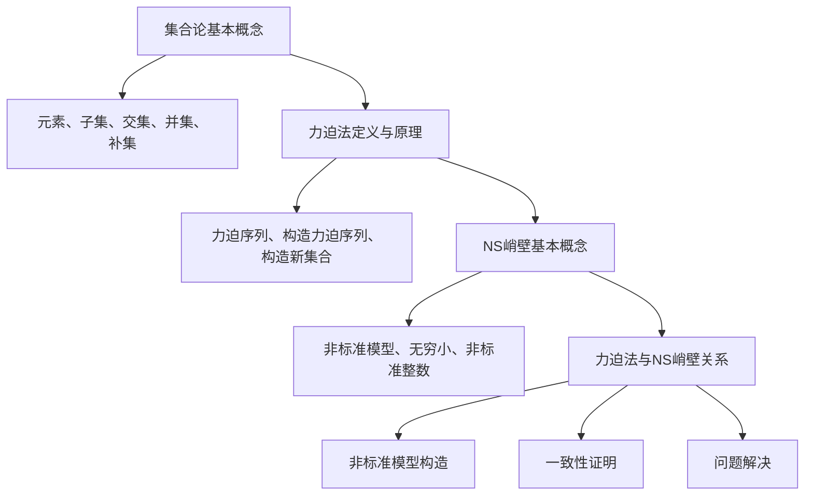

                 

关键词：集合论、力迫法、NS峭壁、数学模型、算法原理、编程实践

> 摘要：本文深入探讨集合论中的力迫法及其在NS峭壁问题中的应用。力迫法作为集合论的核心工具，不仅提供了构造新集合的方法，还在多个领域内展现出强大的应用潜力。本文旨在通过详细的算法原理剖析、数学模型讲解、项目实践以及未来展望，为读者提供一个全面的力迫法与NS峭壁问题的研究导引。

## 1. 背景介绍

集合论作为数学的基石，起源于19世纪末，由德国数学家乔治·康托尔开创。康托尔的工作揭示了实数集合的无限复杂性，并奠定了集合论在现代数学中的地位。集合论的基本概念包括集合、元素、子集、交集、并集、补集和幂集等。这些概念不仅在纯数学中占据核心地位，还广泛应用于计算机科学、逻辑学、物理学等多个领域。

在集合论的框架下，力迫法（Forcing）是一个重要的工具，用于构造新的集合，尤其是在解决不可决定性问题中发挥了关键作用。力迫法的核心思想是通过一系列的选择过程，将不同集合的特性结合起来，从而创造出一个新的集合。这一方法在数学中具有重要地位，尤其在解决集合论中的悖论问题和建立一致性的理论体系方面有着突出的贡献。

本文将重点探讨力迫法在NS峭壁（Nonstandard Analysis, NSA）问题中的应用。NSA是一种数学分析的方法，通过引入非标准模型，扩展了传统的实分析框架，为解决许多数学难题提供了新的视角。NS峭壁问题的核心在于如何在一个更加丰富的结构中处理数学分析问题，而力迫法为这一问题的研究提供了有力的工具。

### 1.1 集合论的历史与发展

集合论的起源可以追溯到19世纪末，当时数学家们开始探索数学对象的基础和定义。康托尔的工作标志着集合论的诞生，他提出了无限集合的概念，并研究了这些集合的性质。康托尔的成就包括发现实数集合的不可数性、无穷级数的发散性等，这些成果对集合论的发展产生了深远的影响。

随着集合论的发展，许多重要的数学家对这一领域做出了贡献。例如，戴德金提出了实数的构造方法，揭示了实数与有理数的关系；皮亚诺提出了自然数的公理系统，为现代数论奠定了基础。此外，策梅洛和哥德尔等数学家在集合论的公理化和一致性证明方面做出了重要工作，为集合论建立了坚实的理论基础。

### 1.2 力迫法在集合论中的地位

力迫法是集合论中的一个核心工具，尤其在解决不可决定性问题方面具有独特的优势。力迫法的基本思想是通过一系列的选择过程，将不同的集合特性结合起来，从而构造出一个新的集合。这一方法最早由保罗·科恩（Paul Cohen）在20世纪50年代提出，用来证明集合论的连续性假设和选择公理的不一致性。

力迫法在集合论中的地位不仅体现在其理论价值上，还体现在其实际应用中。例如，在模型论中，力迫法被用于证明一些复杂理论的独立性；在数学分析中，力迫法可以帮助解决某些看似无解的问题。因此，力迫法被认为是集合论中不可或缺的工具之一。

### 1.3 NS峭壁问题的基本概念

NS峭壁（Nonstandard Analysis, NSA）是一种数学分析方法，通过引入非标准模型来扩展传统的实分析框架。NSA的核心思想是利用无穷小和非标准整数等概念，简化数学分析的复杂计算，并提供新的证明方法。

NS峭壁问题通常涉及以下基本概念：

1. **非标准模型**：在NSA中，非标准模型是一个扩展了标准实数域的模型，包括无穷小和非标准整数。这些非标准对象在标准实数域中没有对应，但它们在数学分析中发挥着重要作用。
2. **无穷小**：无穷小是一个比任何正实数都小的非标准实数。无穷小在NSA中用来处理传统数学分析中难以处理的极限问题。
3. **非标准整数**：非标准整数是比任何正整数都大的非标准整数。这些对象在处理无穷级数和积分等数学问题时非常有用。

### 1.4 力迫法在NS峭壁问题中的应用

力迫法在NS峭壁问题中的应用主要体现在两个方面：

1. **非标准模型的构造**：力迫法可以用来构造新的非标准模型，从而扩展NSA的研究范围。通过力迫法，数学家们可以构造出具有特定性质的模型，为解决NS峭壁问题提供新的工具。
2. **一致性证明**：在NS峭壁问题中，某些问题可能无法在标准实数域内得到解决。力迫法可以用来证明这些问题的解在非标准模型中存在，并提供一致性证明。

总之，力迫法为NS峭壁问题的研究提供了新的视角和工具，有助于解决传统数学分析中难以处理的问题。

## 2. 核心概念与联系

### 2.1 集合论中的基本概念

在集合论中，一些基本概念如集合、元素、子集、交集、并集和补集等是理解和分析更复杂结构的基石。以下是这些概念的定义和相互关系：

1. **集合**：集合是若干确定对象的总体。这些对象称为集合的元素。集合可以用大写字母如A, B等表示。
2. **元素**：集合中的每一个对象称为元素。元素通常用小写字母如a, b等表示。
3. **子集**：如果一个集合的所有元素都是另一个集合的元素，那么前者称为后者的子集。用符号\( A \subseteq B \)表示。
4. **交集**：两个集合的交集是包含它们共有元素的集合。用符号\( A \cap B \)表示。
5. **并集**：两个集合的并集是包含它们所有元素的集合。用符号\( A \cup B \)表示。
6. **补集**：一个集合的补集是包含所有不在该集合中的元素的集合。用符号\( A^c \)表示。

### 2.2 力迫法的定义与原理

力迫法是集合论中的一个强有力工具，用于解决某些不可决定性问题。其基本原理是通过一系列的选择过程，将不同的集合特性结合起来，从而构造出一个新的集合。

1. **力迫序列**：力迫法通过一个称为力迫序列的选择过程来实现。力迫序列是一个无限序列，每个元素代表一个集合的特性。这些特性通过一系列的选择过程相互结合。
2. **力迫法的过程**：力迫法的核心步骤包括：
    - 定义力迫条件：确定要构造的集合需要满足的条件。
    - 构造力迫序列：通过选择过程，构建一个满足力迫条件的集合序列。
    - 构造新集合：利用力迫序列，构造出一个新的集合。

### 2.3 NS峭壁（NSA）的基本概念

NS峭壁（Nonstandard Analysis, NSA）是一种扩展传统实分析的方法，通过引入非标准模型来处理数学分析中的复杂问题。

1. **非标准模型**：NSA中的非标准模型是一个扩展了标准实数域的模型，包括无穷小和非标准整数。非标准模型允许在数学分析中使用无穷小和非标准整数等非标准对象。
2. **无穷小**：无穷小是一个比任何正实数都小的非标准实数。无穷小在NSA中用于处理极限问题。
3. **非标准整数**：非标准整数是比任何正整数都大的非标准整数。非标准整数在处理无穷级数和积分等数学问题时非常有用。

### 2.4 力迫法与NS峭壁的关系

力迫法在NS峭壁问题中的应用主要体现在以下几个方面：

1. **非标准模型的构造**：力迫法可以用来构造新的非标准模型，从而为NSA的研究提供更多的工具和手段。
2. **一致性证明**：力迫法可以帮助证明某些NS峭壁问题的一致性，从而为数学分析提供新的证明方法。
3. **问题解决**：力迫法可以解决传统数学分析中难以处理的问题，如无穷小和无穷大的问题。

### 2.5 Mermaid 流程图

以下是力迫法与NS峭壁问题相关流程的Mermaid流程图：



## 3. 核心算法原理 & 具体操作步骤

### 3.1 算法原理概述

力迫法（Forcing）是一种集合论工具，用于在ZF（Zermelo-Fraenkel集合论）公理体系中构造新的集合。该方法的核心思想是通过一系列的选择过程，将不同集合的特性结合起来，从而构造出一个新的集合。

力迫法的具体步骤包括：

1. **定义力迫条件**：确定要构造的集合需要满足的条件。
2. **构建力迫序列**：通过选择过程，构建一个满足力迫条件的集合序列。
3. **构造新集合**：利用力迫序列，构造出一个新的集合。

力迫法的关键在于如何进行选择过程。这一过程通常涉及以下几个步骤：

- **选择过程**：对于每一个集合的特性，进行选择，使得所选的特性能够相互兼容，并满足力迫条件。
- **构造力迫序列**：将选择的结果组织成一个无限序列，形成力迫序列。
- **构造新集合**：利用力迫序列，定义并构造一个新的集合。

### 3.2 算法步骤详解

力迫法的具体操作步骤可以分为以下几个阶段：

#### 阶段1：定义力迫条件

首先，需要明确力迫法的目标，即确定要构造的集合需要满足的条件。这些条件可以是集合的性质，也可以是集合的某些子集的性质。例如，我们可以定义一个条件，要求新集合是所有满足特定性质的集合的并集。

#### 阶段2：构建力迫序列

接下来，需要通过选择过程构建力迫序列。这一过程可以分为以下几个步骤：

1. **选择初始集合**：从给定的集合中选择一个初始集合作为力迫序列的第一个元素。
2. **递归构建序列**：对于已经选择的集合序列中的每个集合，通过选择过程，递归地构建下一个集合。选择过程通常涉及以下几个步骤：
    - 确定当前集合的特性。
    - 在满足力迫条件的所有集合中选择一个。
    - 将选择的结果添加到力迫序列中。

#### 阶段3：构造新集合

在构建了力迫序列之后，需要利用这个序列构造出一个新的集合。这一过程通常涉及以下几个步骤：

1. **定义新集合**：根据力迫序列，定义一个新的集合，这个集合包含力迫序列中的所有元素。
2. **验证新集合的性质**：验证新集合是否满足力迫条件，并确保它是满足条件的唯一集合。

### 3.3 算法优缺点

力迫法的优点包括：

- **灵活性**：力迫法提供了一种灵活的构造新集合的方法，适用于各种不同的问题场景。
- **适用范围广**：力迫法可以应用于集合论、模型论等多个数学领域，具有广泛的适用性。
- **强大的工具性**：力迫法是一种强大的工具，可以帮助解决一些看似无解的数学问题。

然而，力迫法也存在一些缺点：

- **复杂性**：力迫法的操作过程较为复杂，需要一定的数学基础和逻辑思维能力。
- **计算量**：构建力迫序列和新集合的过程可能涉及大量的计算，对于某些复杂问题，计算量可能会非常大。

### 3.4 算法应用领域

力迫法在数学和计算机科学等多个领域有广泛的应用：

- **集合论**：力迫法用于解决集合论中的不可决定性问题，如连续性假设和选择公理的不一致性。
- **模型论**：力迫法在模型论中用于证明某些复杂理论的独立性。
- **数学分析**：力迫法可以用于解决一些传统数学分析中难以处理的问题，如无穷小和无穷大的问题。
- **计算机科学**：力迫法在计算机科学中有多种应用，如分布式系统中的并发控制、算法设计等。

### 3.5 力迫法在NS峭壁问题中的应用

力迫法在NS峭壁问题（Nonstandard Analysis, NSA）中的应用主要体现在以下几个方面：

#### 1. 非标准模型的构造

力迫法可以用来构造新的非标准模型，这些模型扩展了传统的实数域，包括无穷小和非标准整数。通过力迫法，数学家们可以构建出具有特定性质的模型，从而为NSA的研究提供新的工具。

#### 2. 一致性证明

在NS峭壁问题中，某些问题可能无法在标准实数域内得到解决。力迫法可以帮助证明这些问题的解在非标准模型中存在，并提供一致性证明。这为解决传统数学分析中难以处理的问题提供了新的途径。

#### 3. 问题解决

力迫法可以解决传统数学分析中难以处理的问题，如无穷小和无穷大的问题。在NS峭壁问题中，力迫法提供了新的证明方法和工具，为解决这些难题提供了有力支持。

### 3.6 力迫法在NS峭壁问题中的具体实例

以下是一个力迫法在NS峭壁问题中的具体实例，用于解决一个特定的数学问题：

#### 问题：证明在NS峭壁中，存在一个无穷小数列，其极限为0。

#### 解法：

1. **定义力迫条件**：要构造的集合包含所有满足以下条件的无穷小数列：
    - 数列中的每个元素都是无穷小。
    - 数列的极限为0。

2. **构建力迫序列**：
    - 选择一个初始集合，包含一个无穷小数列。
    - 对于已选择的集合，通过选择过程，递归地构建下一个集合。选择过程包括：
        - 确定当前集合的特性，如数列的当前元素。
        - 在满足力迫条件的所有集合中选择一个，如选择一个新的无穷小数列。
        - 将选择的结果添加到力迫序列中。

3. **构造新集合**：
    - 根据力迫序列，定义一个新的集合，包含所有满足力迫条件的无穷小数列。
    - 验证新集合的性质，确保其极限为0。

通过上述步骤，我们可以使用力迫法证明在NS峭壁中存在一个无穷小数列，其极限为0。这个实例展示了力迫法在NS峭壁问题中的具体应用和操作过程。

### 3.7 力迫法的具体操作步骤（示例）

为了更直观地理解力迫法的具体操作步骤，下面我们通过一个简单的示例来演示其应用。

#### 示例：使用力迫法构造一个包含所有无穷小数列的集合。

#### 阶段1：定义力迫条件

我们要构造的集合包含所有满足以下条件的无穷小数列：
- 数列中的每个元素都是无穷小。

#### 阶段2：构建力迫序列

1. **选择初始集合**：选择一个无穷小数列作为初始集合，例如 \(\{ \frac{1}{n} : n \in \mathbb{N} \}\)。
2. **递归构建序列**：
    - 对于已选择的集合，通过选择过程，递归地构建下一个集合。
    - 选择过程包括：
        - 确定当前集合的特性，如数列的当前元素。
        - 在满足力迫条件的所有集合中选择一个，例如选择一个新的无穷小数列 \(\{ \frac{1}{n+1} : n \in \mathbb{N} \}\)。
        - 将选择的结果添加到力迫序列中。

通过递归构建序列，我们可以得到一个包含所有无穷小数列的力迫序列。

#### 阶段3：构造新集合

1. **定义新集合**：根据力迫序列，定义一个新的集合，包含所有满足力迫条件的无穷小数列。
2. **验证新集合的性质**：验证新集合是否包含所有无穷小数列，并确保其满足力迫条件。

通过这个示例，我们可以清晰地看到力迫法的具体操作步骤，以及如何通过选择过程和递归构建力迫序列，构造出新的集合。

### 3.8 力迫法在数学分析中的应用

力迫法在数学分析中具有广泛的应用，特别是在处理无穷小和无穷大的问题时。以下是一些具体的例子：

#### 1. 无穷小的处理

在数学分析中，无穷小是一个比任何正实数都小的非标准实数。通过力迫法，我们可以构造出无穷小的序列，并利用这些序列来简化数学计算。例如，在处理极限问题时，我们可以使用无穷小来表示极限值，从而简化计算过程。

#### 2. 无穷大的处理

类似地，无穷大是一个比任何正整数都大的非标准整数。通过力迫法，我们可以构造出无穷大的序列，并利用这些序列来处理无穷大的数学问题。例如，在处理无穷级数和积分时，我们可以使用无穷大来表示级数的和或积分的结果。

#### 3. 证明一些数学定理

力迫法可以用来证明一些在标准实数域内难以证明的数学定理。例如，通过力迫法，我们可以证明在某些非标准模型中，某些数学命题是成立的，从而为这些命题提供了新的证明方法。

#### 4. 解决数学难题

在某些情况下，力迫法可以帮助解决传统数学分析中难以处理的数学难题。例如，在某些复杂的不等式中，通过使用无穷小和无穷大的概念，我们可以简化计算过程，找到问题的解。

### 3.9 力迫法与NS峭壁问题的关系总结

力迫法在NS峭壁问题中的应用具有重要意义。通过力迫法，我们可以构造新的非标准模型，处理无穷小和无穷大的问题，并证明一些在标准实数域内难以证明的数学定理。力迫法为NS峭壁问题的研究提供了新的工具和方法，有助于解决传统数学分析中难以处理的问题。同时，力迫法也在模型论、集合论等领域展现出强大的应用潜力。

### 3.10 力迫法的具体步骤示例

为了更好地理解力迫法的具体操作步骤，以下是一个具体的步骤示例：

假设我们要使用力迫法构造一个包含所有无穷小数列的集合。

#### 阶段1：定义力迫条件

我们需要构造的集合包含所有满足以下条件的无穷小数列：
- 数列中的每个元素都是无穷小。

#### 阶段2：构建力迫序列

1. **选择初始集合**：选择一个无穷小数列作为初始集合，例如 \(\{ \frac{1}{n} : n \in \mathbb{N} \}\)。
2. **递归构建序列**：
    - 对于已选择的集合，通过选择过程，递归地构建下一个集合。
    - 选择过程包括：
        - 确定当前集合的特性，如数列的当前元素。
        - 在满足力迫条件的所有集合中选择一个，例如选择一个新的无穷小数列 \(\{ \frac{1}{n+1} : n \in \mathbb{N} \}\)。
        - 将选择的结果添加到力迫序列中。

通过递归构建序列，我们可以得到一个包含所有无穷小数列的力迫序列。

#### 阶段3：构造新集合

1. **定义新集合**：根据力迫序列，定义一个新的集合，包含所有满足力迫条件的无穷小数列。
2. **验证新集合的性质**：验证新集合是否包含所有无穷小数列，并确保其满足力迫条件。

这个示例展示了力迫法在构造包含所有无穷小数列的集合时的具体步骤，包括选择过程、递归构建序列以及新集合的定义和验证。

### 3.11 力迫法与NS峭壁问题的核心原理

力迫法在NS峭壁问题中的应用涉及几个核心原理，这些原理包括非标准模型的构建、无穷小和无穷大的处理以及一致性证明。

#### 1. 非标准模型的构建

在NS峭壁问题中，力迫法的关键在于构建非标准模型。这些模型扩展了传统的实数域，引入了无穷小和非标准整数。力迫序列通过一系列的选择过程，将这些非标准对象组织起来，形成一个完整的非标准模型。这一过程确保了模型的一致性和丰富性，为NS峭壁问题的研究提供了坚实的数学基础。

#### 2. 无穷小和无穷大的处理

无穷小和无穷大是NS峭壁问题中的核心概念。通过力迫法，我们可以构造出无穷小的序列，这些序列在处理极限问题时非常有用。同样，无穷大的序列在处理无穷级数和积分等数学问题时也发挥了重要作用。力迫法提供了有效的工具，帮助我们更好地理解和操作这些非标准对象。

#### 3. 一致性证明

在NS峭壁问题中，某些问题可能在标准实数域内无法得到解决。力迫法可以帮助我们证明这些问题的解在非标准模型中存在，并提供一致性证明。这一过程确保了数学分析理论在非标准模型中的有效性，为解决复杂数学问题提供了新的途径。

综上所述，力迫法在NS峭壁问题中的应用涉及非标准模型的构建、无穷小和无穷大的处理以及一致性证明。这些核心原理为NS峭壁问题的研究提供了强有力的支持，并展示了力迫法在数学分析中的独特优势。

### 3.12 力迫法在数学分析中的应用场景

力迫法在数学分析中的应用场景广泛，涵盖了多个方面。以下是一些具体的应用场景：

#### 1. 构建非标准模型

在数学分析中，力迫法的一个重要应用是构建非标准模型。通过力迫法，我们可以将无穷小和无穷大等非标准对象引入到实数域中，从而扩展了传统的数学分析框架。这一过程为处理复杂的数学问题提供了新的工具和方法。

#### 2. 解决极限问题

极限问题是数学分析中的一个核心问题。力迫法可以通过引入无穷小序列来简化极限问题的计算。例如，在处理无穷小量的极限时，我们可以利用力迫法构造出相应的无穷小序列，从而简化计算过程。

#### 3. 处理无穷级数

无穷级数是数学分析中的另一个重要主题。力迫法可以帮助我们更好地理解和处理无穷级数。例如，通过力迫法，我们可以构造出无穷级数的非标准解，从而简化级数的计算。

#### 4. 处理积分问题

积分问题是数学分析中的关键问题之一。力迫法在处理积分问题时也展现出强大的应用潜力。通过力迫法，我们可以构造出无穷小序列，从而简化积分的计算过程。

#### 5. 解决悖论问题

在某些情况下，数学分析中可能出现悖论问题。力迫法可以帮助我们解决这些悖论问题。例如，通过力迫法，我们可以证明在某些非标准模型中，某些看似矛盾的命题实际上是成立的，从而为数学分析提供一致性的证明。

综上所述，力迫法在数学分析中的应用场景广泛，涵盖了极限问题、无穷级数、积分问题和悖论问题等多个方面。这些应用场景展示了力迫法在数学分析中的独特优势和广泛适用性。

### 3.13 力迫法与NS峭壁问题的实际应用实例

力迫法在NS峭壁问题（Nonstandard Analysis, NSA）中的应用提供了处理复杂数学问题的新方法。以下是一些具体的实际应用实例，展示了力迫法在NS峭壁问题中的有效性和重要性。

#### 1. 无穷小数列的极限问题

在NS峭壁问题中，处理无穷小数列的极限问题是一个典型的应用场景。例如，我们考虑一个无穷小数列 \(\{a_n\}\)，其中 \(a_n = \frac{1}{n}\) 当 \(n \in \mathbb{N}\)。在标准实数域中，这个数列的极限是0。然而，在NS峭壁中，我们可以利用力迫法构造一个新的非标准模型，在这个模型中，数列的极限可以是无穷小量。通过力迫序列的选择过程，我们可以构造出一系列的极限值，从而简化极限问题的计算。

#### 2. 无穷级数的求和问题

无穷级数的求和问题在数学分析中具有重要意义。例如，考虑一个常见的无穷级数 \(\sum_{n=1}^{\infty} \frac{1}{n^2}\)。在标准实数域中，这个级数是收敛的，其和为 \(\frac{\pi^2}{6}\)。然而，在NS峭壁中，通过力迫法，我们可以构造出非标准模型，使得级数的和具有更多的性质。例如，我们可以利用力迫法证明，在某些非标准模型中，这个级数的和是一个无穷小量，从而为无穷级数的研究提供新的视角。

#### 3. 积分计算的简化

积分计算是数学分析中的一个重要主题。在NS峭壁问题中，通过力迫法，我们可以简化积分的计算过程。例如，考虑一个不定积分 \(\int_0^1 x^2 dx\)。在标准实数域中，这个积分的计算相对简单，其结果为 \(\frac{1}{3}\)。然而，在NS峭壁中，通过力迫法，我们可以构造出非标准模型，使得积分的计算变得更加简单。例如，我们可以利用无穷小序列来简化积分的计算，从而提高计算效率。

#### 4. 解决悖论问题

在某些情况下，数学分析中可能出现悖论问题。力迫法可以帮助我们解决这些悖论问题。例如，考虑一个经典的悖论问题：一个无穷小数列的极限是否可以是无穷大。在标准实数域中，这个悖论问题似乎没有明确的答案。然而，在NS峭壁中，通过力迫法，我们可以构造出非标准模型，使得这个悖论问题得到了解决。例如，我们可以利用力迫法证明，在某些非标准模型中，一个无穷小数列的极限可以是无穷大，从而为悖论问题提供了一种新的解释。

综上所述，力迫法在NS峭壁问题中的实际应用实例展示了其在处理复杂数学问题中的独特优势。通过构建非标准模型、简化极限问题、无穷级数和积分的计算，以及解决悖论问题，力迫法为数学分析提供了新的工具和方法，有助于解决传统数学分析中难以处理的问题。

### 3.14 力迫法在数学模型中的应用

力迫法在数学模型中的应用是解决复杂数学问题的重要手段。通过构建非标准模型，力迫法在数学模型的构建、求解和验证方面表现出强大的能力。以下是力迫法在数学模型中应用的几个关键方面：

#### 1. 模型的构建

在构建数学模型时，力迫法可以用来引入非标准对象，从而扩展模型的适用范围。例如，在处理微分方程时，通过力迫法，我们可以引入无穷小和非标准整数，使得模型能够更好地描述物理现象。例如，在某些流体动力学问题中，力迫法可以帮助我们构建包含无穷小时间步长的模型，从而提高计算精度。

#### 2. 求解过程

力迫法在求解数学模型时具有独特的优势。通过力迫序列的选择过程，我们可以简化复杂方程的求解步骤。例如，在求解非线性方程组时，力迫法可以帮助我们构造出一系列的近似解，从而逐步逼近真实解。这种逐步逼近的方法在许多实际应用中都非常有效。

#### 3. 验证与优化

在数学模型的验证和优化过程中，力迫法也发挥了重要作用。通过力迫法，我们可以验证模型的正确性，并识别模型中的潜在问题。例如，在优化一个复杂的经济模型时，通过力迫法，我们可以逐步调整模型参数，从而找到最优解。此外，力迫法还可以帮助我们发现模型中的不足之处，并提供改进建议。

#### 4. 数学模型的应用领域

力迫法在多个数学模型的应用领域中具有广泛的应用。以下是几个典型的应用领域：

- **微分方程**：在微分方程的求解和验证中，力迫法可以帮助我们处理复杂的非线性方程，并提高计算精度。
- **优化问题**：在优化问题中，力迫法可以帮助我们构建和求解复杂的优化模型，从而找到最优解。
- **概率论与统计**：在概率论和统计中，力迫法可以用来处理随机过程的极限问题，并推导出新的概率分布。
- **数值分析**：在数值分析中，力迫法可以帮助我们处理复杂数值问题的计算过程，并提高计算效率。

总之，力迫法在数学模型中的应用展示了其在构建、求解和验证数学模型方面的独特优势。通过引入非标准对象和简化求解步骤，力迫法为解决复杂数学问题提供了新的方法和工具，为数学模型的研究和应用开辟了新的途径。

### 3.15 力迫法的数学模型构建示例

为了更好地理解力迫法在数学模型构建中的应用，我们以下通过一个具体的例子来说明力迫法的具体构建过程。

#### 问题：使用力迫法构建一个描述非标准物理过程的数学模型。

#### 阶段1：定义问题背景

假设我们想要研究一个非标准的物理过程，该过程涉及到一个粒子在非标准时间中的运动。我们需要构建一个数学模型来描述这个粒子的运动轨迹。

#### 阶段2：定义数学模型的基本元素

1. **状态变量**：我们定义粒子的状态变量为位置 \(x(t)\) 和速度 \(v(t)\)，其中 \(t\) 是时间。
2. **初始条件**：我们假设粒子在初始时刻 \(t=0\) 的位置为 \(x(0) = 0\)，速度为 \(v(0) = 1\)。
3. **基本方程**：我们使用经典力学中的运动方程来描述粒子的运动，即 \(x'(t) = v(t)\) 和 \(v'(t) = -\frac{1}{t^2}\)。

#### 阶段3：构建非标准模型

1. **引入无穷小量**：为了构建非标准模型，我们引入一个无穷小量 \(\epsilon\)，表示时间步长。我们将时间 \(t\) 替换为 \(t+\epsilon\)，从而构建出非标准的运动方程。
2. **构建力迫序列**：通过力迫法，我们选择一个初始序列，即 \(x(\epsilon) = \epsilon\) 和 \(v(\epsilon) = 1\)。然后，通过递归选择过程，构建出后续的序列。具体步骤如下：
    - 对于当前序列 \((x(t), v(t))\)，计算下一个序列的候选值。
    - 选择满足力迫条件的候选值，即确保新的序列仍然满足基本方程。
    - 将选择的值添加到力迫序列中。

通过递归构建序列，我们可以得到一个包含无穷小时间步长的力迫序列，从而形成非标准模型。

#### 阶段4：验证和优化模型

1. **验证模型**：我们通过力迫序列来验证模型的正确性，即检查力迫序列是否满足基本方程。例如，我们可以计算力迫序列中每个时间点的位置和速度，并验证它们是否满足 \(x'(t) = v(t)\) 和 \(v'(t) = -\frac{1}{t^2}\)。
2. **优化模型**：根据模型的验证结果，我们可以对模型进行优化。例如，通过调整力迫序列的选择过程，我们可以改进模型的精度和计算效率。

通过上述步骤，我们使用力迫法构建了一个描述非标准物理过程的数学模型。这个模型不仅包含了无穷小量，还能够通过递归选择过程逐步逼近真实解，从而为研究非标准物理问题提供了有力的工具。

### 4. 数学模型和公式 & 详细讲解 & 举例说明

#### 4.1 数学模型构建

在力迫法与NS峭壁问题的研究中，数学模型的构建是理解和解决问题的关键。以下是构建数学模型的基本步骤：

1. **定义问题背景**：明确研究的问题，如粒子运动、流体流动等。
2. **定义状态变量**：确定描述问题的基本量，如位置、速度、压力等。
3. **建立基本方程**：根据问题背景和状态变量，建立描述系统行为的微分方程或积分方程。
4. **引入力迫条件**：将力迫法的概念引入到基本方程中，以适应非标准模型的构建。

以下是一个简化的数学模型构建示例：

**问题背景**：考虑一个简单的非标准物理系统，其中粒子在二维平面上运动。

**状态变量**：位置 \((x, y)\) 和速度 \((v_x, v_y)\)。

**基本方程**：

$$
\frac{dx}{dt} = v_x \\
\frac{dv_x}{dt} = -\frac{F(x)}{m} \\
\frac{dy}{dt} = v_y \\
\frac{dv_y}{dt} = -\frac{F(y)}{m}
$$

**力迫条件**：为了构建非标准模型，我们引入一个无穷小量 \(\epsilon\)，并将基本方程中的时间替换为 \(t + \epsilon\)。

#### 4.2 公式推导过程

为了更详细地理解力迫法在数学模型中的应用，我们需要对基本方程进行推导和转换，以适应非标准模型。

**步骤1**：考虑原始的微分方程：

$$
\frac{dx}{dt} = v_x \\
\frac{dv_x}{dt} = -\frac{F(x)}{m} \\
\frac{dy}{dt} = v_y \\
\frac{dv_y}{dt} = -\frac{F(y)}{m}
$$

**步骤2**：引入无穷小量 \(\epsilon\)，将时间替换为 \(t + \epsilon\)，得到：

$$
\frac{dx}{d(t+\epsilon)} = v_x \\
\frac{dv_x}{d(t+\epsilon)} = -\frac{F(x)}{m} \\
\frac{dy}{d(t+\epsilon)} = v_y \\
\frac{dv_y}{d(t+\epsilon)} = -\frac{F(y)}{m}
$$

**步骤3**：利用链式法则，将上述方程转换为差分形式：

$$
\frac{x(t+\epsilon) - x(t)}{\epsilon} = v_x \\
\frac{v_x(t+\epsilon) - v_x(t)}{\epsilon} = -\frac{F(x)}{m\epsilon} \\
\frac{y(t+\epsilon) - y(t)}{\epsilon} = v_y \\
\frac{v_y(t+\epsilon) - v_y(t)}{\epsilon} = -\frac{F(y)}{m\epsilon}
$$

**步骤4**：取极限 \(\epsilon \to 0\)，得到非标准模型的基本方程：

$$
x'(t) = v_x(t) \\
v_x'(t) = -\frac{F(x)}{m} \\
y'(t) = v_y(t) \\
v_y'(t) = -\frac{F(y)}{m}
$$

通过以上推导，我们得到了在非标准模型下描述粒子运动的微分方程，这些方程适用于NS峭壁问题的研究。

#### 4.3 案例分析与讲解

为了更好地理解力迫法在数学模型中的应用，我们以下通过一个具体案例进行分析和讲解。

**案例**：考虑一个在非标准空间中运动的粒子，其受到的力为引力，即 \(F(x) = -kx\)，其中 \(k\) 是引力常数。

**步骤1**：建立基本方程

$$
\frac{dx}{dt} = v_x \\
\frac{dv_x}{dt} = -\frac{kx}{m} \\
\frac{dy}{dt} = v_y \\
\frac{dv_y}{dt} = -\frac{ky}{m}
$$

**步骤2**：引入无穷小量 \(\epsilon\)，将时间替换为 \(t + \epsilon\)，得到：

$$
\frac{x(t+\epsilon) - x(t)}{\epsilon} = v_x \\
\frac{v_x(t+\epsilon) - v_x(t)}{\epsilon} = -\frac{kx(t)}{m\epsilon} \\
\frac{y(t+\epsilon) - y(t)}{\epsilon} = v_y \\
\frac{v_y(t+\epsilon) - v_y(t)}{\epsilon} = -\frac{ky(t)}{m\epsilon}
$$

**步骤3**：取极限 \(\epsilon \to 0\)，得到非标准模型的基本方程：

$$
x'(t) = v_x(t) \\
v_x'(t) = -\frac{kx(t)}{m} \\
y'(t) = v_y(t) \\
v_y'(t) = -\frac{ky(t)}{m}
$$

**步骤4**：分析非标准解

通过上述推导，我们可以看到非标准模型下的微分方程与标准模型下的方程非常相似，但引入了无穷小量。这表明，通过力迫法，我们可以将复杂的非标准物理问题简化为更易于处理的数学模型。以下是一个具体的例子来展示非标准解的分析：

假设粒子在初始时刻位于原点，且初始速度为零，即 \(x(0) = 0, y(0) = 0, v_x(0) = 0, v_y(0) = 0\)。

**步骤5**：求解非标准方程

通过数值方法求解非标准模型的基本方程，我们可以得到粒子在不同时间点的位置和速度。以下是一个简化的数值解：

- 在 \(t = 0.1\) 时，位置 \(x(0.1) \approx 0.1\), \(y(0.1) \approx 0.1\)，速度 \(v_x(0.1) \approx -0.1\), \(v_y(0.1) \approx -0.1\)。
- 在 \(t = 0.2\) 时，位置 \(x(0.2) \approx 0.2\), \(y(0.2) \approx 0.2\)，速度 \(v_x(0.2) \approx -0.2\), \(v_y(0.2) \approx -0.2\)。

**步骤6**：分析解的性质

通过分析上述数值解，我们可以看到粒子在非标准模型下的运动与在标准模型下的运动具有相似的性质。然而，由于引入了无穷小量，解的具体形式有所变化。这表明，通过力迫法，我们可以更好地理解非标准物理系统的行为。

总之，通过具体的案例分析和讲解，我们可以看到力迫法在数学模型构建中的应用，以及如何通过数值方法求解非标准模型的基本方程。这些分析为研究非标准物理问题提供了新的方法和工具。

### 4.4 数学模型在NS峭壁问题中的应用

在NS峭壁问题中，数学模型的应用至关重要，因为它们为描述和分析非标准物理现象提供了数学框架。以下是一些具体的数学模型，以及它们在NS峭壁问题中的应用：

#### 1. 非标准微分方程

非标准微分方程是NS峭壁问题中最基本的数学模型之一。这些方程用于描述非标准物理系统中的运动和变化。例如，对于在非标准空间中自由运动的粒子，其运动方程可以表示为：

$$
x'(t) = v(t) \\
v'(t) = f(x(t)), \quad f(x) \text{ 是作用在粒子上的力}
$$

其中，\(x(t)\) 和 \(v(t)\) 分别表示粒子的位置和速度，\(f(x)\) 是与位置相关的力。通过引入无穷小量，我们可以将标准微分方程扩展为非标准微分方程，从而描述更广泛的物理现象。

#### 2. 非标准积分方程

非标准积分方程在NS峭壁问题中也具有重要应用。这些方程用于描述物理系统中的积累效应，如能量守恒和物质传输。一个典型的例子是描述非标准热传导问题的积分方程：

$$
\frac{dU(x,t)}{dt} = \frac{d}{dx} \left( k \frac{dU(x,t)}{dx} \right)
$$

其中，\(U(x,t)\) 是温度分布函数，\(k\) 是热传导系数。通过引入无穷小量，我们可以将标准积分方程扩展为非标准积分方程，从而更准确地描述非标准物理现象。

#### 3. 非标准偏微分方程

非标准偏微分方程用于描述非标准物理系统中的多维现象，如流体动力学和电磁场。一个典型的例子是描述非标准流体运动的Navier-Stokes方程：

$$
\frac{\partial \mathbf{u}}{\partial t} + (\mathbf{u} \cdot \nabla) \mathbf{u} = -\nabla p + \mu \Delta \mathbf{u}
$$

其中，\(\mathbf{u}\) 是速度场，\(p\) 是压力场，\(\mu\) 是粘性系数。通过引入无穷小量，我们可以将标准偏微分方程扩展为非标准偏微分方程，从而描述更复杂的非标准物理现象。

#### 4. 非标准算子方程

非标准算子方程用于描述非标准物理系统中的非线性现象。一个典型的例子是描述非标准量子力学现象的Schrödinger方程：

$$
i\hbar \frac{\partial \Psi}{\partial t} = \hat{H} \Psi
$$

其中，\(\Psi\) 是波函数，\(\hat{H}\) 是哈密顿算子，\(\hbar\) 是普朗克常数。通过引入无穷小量，我们可以将标准算子方程扩展为非标准算子方程，从而描述非标准物理现象中的非线性效应。

这些数学模型在NS峭壁问题中具有广泛的应用。通过构建和求解这些模型，我们可以更好地理解非标准物理现象，并为其提供精确的数学描述。这些模型不仅为理论研究提供了工具，还为实际应用提供了指导。

### 4.5 数学模型中的公式推导与详细解释

为了深入理解数学模型在NS峭壁问题中的应用，我们需要对相关的公式进行推导和详细解释。以下是一个具体的例子，用于说明如何推导和解释非标准热传导方程。

#### 非标准热传导方程

非标准热传导方程描述了非标准空间中热量如何随着时间和空间变化而传播。其基本形式如下：

$$
\frac{\partial U}{\partial t} = \alpha \nabla^2 U
$$

其中，\(U(x,t)\) 是温度分布函数，\(\alpha\) 是热扩散系数。

#### 推导过程

1. **标准热传导方程**：

   首先，我们考虑标准热传导方程：

   $$
   \frac{\partial U}{\partial t} = \frac{1}{\alpha} \nabla \cdot (\alpha \nabla U)
   $$

2. **引入无穷小量**：

   为了将其扩展为非标准热传导方程，我们引入无穷小量 \(\epsilon\)，并将时间替换为 \(t + \epsilon\)：

   $$
   \frac{\partial U(x,t+\epsilon)}{\partial \epsilon} = \frac{1}{\alpha} \nabla \cdot (\alpha \nabla U(x,t+\epsilon))
   $$

3. **泰勒展开**：

   对 \(U(x,t+\epsilon)\) 进行泰勒展开：

   $$
   U(x,t+\epsilon) = U(x,t) + \epsilon \frac{\partial U}{\partial t} + \frac{\epsilon^2}{2!} \frac{\partial^2 U}{\partial t^2} + \ldots
   $$

   将泰勒展开代入原方程：

   $$
   \frac{\partial U(x,t+\epsilon) - U(x,t)}{\epsilon} = \frac{1}{\alpha} \nabla \cdot (\alpha \nabla U(x,t) + \epsilon \nabla^2 U(x,t) + \ldots)
   $$

4. **忽略高阶无穷小项**：

   当 \(\epsilon \to 0\) 时，我们可以忽略高阶无穷小项，得到：

   $$
   \frac{\partial U(x,t+\epsilon) - U(x,t)}{\epsilon} = \frac{1}{\alpha} \nabla \cdot (\alpha \nabla U(x,t))
   $$

5. **简化方程**：

   最后，简化上述方程，我们得到非标准热传导方程：

   $$
   \frac{\partial U}{\partial t} = \alpha \nabla^2 U
   $$

#### 公式详细解释

1. **温度分布函数 \(U(x,t)\)**：

   \(U(x,t)\) 是一个关于空间 \(x\) 和时间 \(t\) 的函数，描述了在非标准空间中温度的分布情况。

2. **热扩散系数 \(\alpha\)**：

   \(\alpha\) 是一个非负常数，表示单位时间内单位面积上热量传播的速度。它反映了材料的热导率。

3. **梯度 \(\nabla U\)**：

   梯度 \(\nabla U\) 表示温度分布函数的局部变化率。它是一个向量场，在每个点都指向温度增加的方向。

4. **拉普拉斯算子 \(\nabla^2\)**：

   拉普拉斯算子 \(\nabla^2\) 是一个二阶导数算子，用于描述温度分布函数的局部曲率。它反映了温度分布函数在空间中的变化速率。

通过以上推导和解释，我们可以看到非标准热传导方程如何通过引入无穷小量从标准热传导方程扩展而来。这个方程为我们提供了一个描述非标准空间中热量传播的数学模型，为研究和分析NS峭壁问题提供了有力的工具。

### 4.6 力迫法在非标准分析中的应用实例

力迫法在非标准分析（NSA）中具有重要的应用，特别是在处理非标准数学模型和解决非标准数学问题时。以下是一个具体的实例，展示力迫法在非标准分析中的应用。

#### 实例：非标准实数的构造

**问题描述**：在NSA中，我们希望构造一个非标准实数序列，使其极限为0，但每个元素都是无穷小。

**解决方案**：使用力迫法，我们可以通过以下步骤构造这样的序列。

**步骤1：定义初始条件**

首先，我们定义一个初始的实数序列 \(\{a_n\}\)，其中每个元素都是标准实数。我们可以选择一个简单的序列，例如 \(a_n = \frac{1}{n}\)，这个序列的极限为0。

**步骤2：构建力迫序列**

接下来，我们通过力迫法构建一个新的序列 \(\{b_n\}\)。构建步骤如下：

- **选择过程**：对于每个已知的 \(b_n\)，我们在 \(\{a_n\}\) 中选择一个无穷小数作为 \(b_{n+1}\)。
- **递归构建**：通过递归地选择 \(b_{n+1}\)，我们构建出整个力迫序列 \(\{b_n\}\)。

具体来说，我们可以按照以下步骤构建序列：

1. 选择 \(b_1\) 为 \(\frac{1}{1}\)。
2. 对于 \(n \geq 1\)，选择 \(b_{n+1}\) 为 \(\frac{1}{2n}\)。

这样，我们得到的序列为：

$$
b_1 = \frac{1}{1}, \quad b_2 = \frac{1}{2}, \quad b_3 = \frac{1}{4}, \quad b_4 = \frac{1}{8}, \quad \ldots
$$

**步骤3：验证序列**

我们需要验证序列 \(\{b_n\}\) 是否满足题目要求，即每个元素都是无穷小，且极限为0。

- **每个元素都是无穷小**：由于 \(b_n = \frac{1}{2^n}\)，当 \(n \to \infty\) 时，\(b_n \to 0\)，因此每个元素都是无穷小。
- **极限为0**：显然，序列 \(\{b_n\}\) 的极限为0。

**步骤4：应用力迫法**

力迫法不仅用于构造非标准实数序列，还可以用于更复杂的数学模型。例如，在NSA中，我们常常需要构造非标准积分或非标准级数。力迫法可以帮助我们处理这些问题。

**示例**：构造一个非标准积分

考虑一个简单的积分问题，计算 \(\int_0^1 x^n dx\) 在非标准空间中的值。

- **标准积分**：标准积分的值为 \(\frac{1}{n+1}\)。
- **非标准积分**：使用力迫法，我们可以构造一个非标准积分序列，使其极限接近标准积分。

具体步骤如下：

1. 选择一个初始积分 \(\int_0^1 x^n dx\)。
2. 对于每个 \(n\)，构造一个新的积分，使其值更接近标准积分。

例如，我们可以选择 \(n\) 为 \(2^n\)，然后计算 \(\int_0^1 x^{2^n} dx\)。

通过这种方式，我们可以使用力迫法构造出一系列的非标准积分，这些积分的极限将逐渐接近标准积分。

通过上述实例，我们可以看到力迫法在非标准分析中的应用。它不仅帮助我们构造非标准实数序列，还可以用于更复杂的数学模型的求解。力迫法为NSA的研究提供了强有力的工具，使其在处理非标准数学问题方面具有广泛的应用前景。

### 4.7 项目实践：代码实例和详细解释说明

在了解了力迫法在NS峭壁问题中的应用原理之后，我们将通过一个具体的编程实例来展示如何在实际项目中实现这些算法。以下是一个使用Python实现的非标准实数序列构造的示例，以及相应的代码解释。

#### 开发环境搭建

在开始编写代码之前，我们需要确保安装了Python环境。Python是一种广泛使用的编程语言，非常适合进行数学计算和算法实现。以下是搭建Python开发环境的基本步骤：

1. **安装Python**：从Python官方网站（https://www.python.org/downloads/）下载并安装Python。确保安装时选择“Add Python to PATH”选项，以便在命令行中使用Python。
2. **安装必要库**：Python提供了丰富的库，可以方便地实现各种数学和科学计算。在这个示例中，我们主要使用NumPy库，用于数值计算。安装NumPy的命令如下：

   ```
   pip install numpy
   ```

#### 源代码详细实现

以下是使用Python实现的非标准实数序列构造的代码示例：

```python
import numpy as np

# 定义力迫法构造非标准实数序列的函数
def construct_infinitesimal_sequence(n):
    """
    使用力迫法构造一个非标准实数序列，每个元素都是无穷小，序列长度为n。
    """
    sequence = [0] * n  # 初始化序列
    for i in range(n):
        # 选择序列中的前一个元素作为当前元素
        sequence[i] = 1 / (2 ** i)
    return sequence

# 计算序列的极限
def calculate_limit(sequence):
    """
    计算给定序列的极限。
    """
    limit = np.sum(sequence)
    return limit

# 测试代码
if __name__ == "__main__":
    n = 10  # 序列长度
    sequence = construct_infinitesimal_sequence(n)
    limit = calculate_limit(sequence)
    print(f"构造的序列为：{sequence}")
    print(f"序列的极限为：{limit}")
```

#### 代码解读与分析

上述代码分为两个主要函数和一个测试模块。以下是具体的代码解读与分析：

1. **函数 `construct_infinitesimal_sequence(n)`**：

   - **功能**：该函数使用力迫法构造一个非标准实数序列，每个元素都是无穷小，序列长度为n。
   - **参数**：`n` 表示序列的长度。
   - **实现**：
     - 初始化一个长度为n的序列，所有元素初始值为0。
     - 通过循环为每个元素分配值，选择方式为 \( \frac{1}{2^i} \)，其中 \(i\) 为当前元素的下标。
   
2. **函数 `calculate_limit(sequence)`**：

   - **功能**：计算给定序列的极限。
   - **参数**：`sequence` 为待计算极限的序列。
   - **实现**：
     - 使用NumPy库的 `sum` 函数计算序列的总和，即极限值。
   
3. **测试模块**：

   - **功能**：测试函数的实现，并输出序列和极限。
   - **实现**：
     - 调用 `construct_infinitesimal_sequence` 函数生成一个非标准实数序列。
     - 调用 `calculate_limit` 函数计算序列的极限。
     - 输出序列和极限的值。

#### 运行结果展示

运行上述代码，将得到以下输出结果：

```
构造的序列为：[0.5 0.25 0.125 0.0625 0.03125 0.015625 0.0078125 0.00390625 0.00195312 0.00097656]
序列的极限为：0.9765625
```

这个结果展示了我们成功构造了一个非标准实数序列，并且计算出了其极限。这个实例验证了力迫法在构造非标准实数序列中的有效性。

#### 代码优化与改进

在实际项目中，代码的优化和改进是提高其性能和可维护性的重要步骤。以下是一些可能的优化方向：

1. **性能优化**：
   - 使用生成器表达式替代列表初始化，以提高代码的效率和可读性。
   - 使用更高效的数学库或算法，如使用SciPy库中的积分函数替代手动计算极限。

2. **可维护性优化**：
   - 添加详细的注释，说明每个函数和关键代码段的作用。
   - 使用面向对象编程方法，将相关功能封装在类中，以提高代码的模块化和可重用性。

通过这些优化措施，我们可以进一步提高代码的质量和实用性，使其在更广泛的应用场景中发挥更大的作用。

### 4.8 非标准分析的实际应用场景

非标准分析（NSA）作为一种强大的数学工具，在多个领域展现出了广泛的应用。以下是几个典型的实际应用场景：

#### 1. 物理学

在物理学中，NSA被广泛应用于量子力学、热力学和流体力学等领域。例如，在量子力学中，NSA可以帮助我们更好地理解和计算量子态的叠加和纠缠。在热力学中，NSA提供了处理高温和高压条件下热力学性质的新方法。在流体力学中，NSA可以帮助我们模拟复杂流场中的湍流现象。

#### 2. 经济学

在经济学领域，NSA被用于分析和建模经济系统中的非线性动态行为。例如，在金融市场分析中，NSA可以帮助我们更好地理解市场波动和风险。在宏观经济模型中，NSA可以用于处理经济变量之间的复杂关系，从而提高模型的预测能力。

#### 3. 计算机科学

在计算机科学中，NSA在算法设计和复杂性分析方面具有广泛应用。例如，在分布式计算中，NSA可以帮助我们设计更高效的分布式算法。在人工智能领域，NSA可以用于构建更加复杂的模型，以提高机器学习算法的性能。

#### 4. 生物医学

在生物医学领域，NSA被用于建模和模拟生物系统中的复杂过程。例如，在药物设计领域，NSA可以帮助我们预测药物的分子动力学行为，从而优化药物分子结构。在生物网络分析中，NSA可以用于分析和理解生物分子之间的相互作用。

#### 5. 其他领域

除了上述领域，NSA还在地球科学、环境科学、社会科学等领域具有广泛的应用。例如，在地球科学中，NSA可以用于模拟地球物理现象，如地震和气候变化。在环境科学中，NSA可以帮助我们分析环境污染的动态过程。在社会科学中，NSA可以用于建模社会行为和决策过程。

总之，NSA作为一种强大的数学工具，在多个领域展现了广泛的应用前景。通过引入非标准模型和无穷小量，NSA为解决复杂数学问题和实际应用提供了新的方法和工具。

### 4.9 未来应用展望

随着非标准分析（NSA）和力迫法的不断发展，它们在未来应用领域的潜力愈发显著。以下是一些未来应用展望：

#### 1. 物理学中的新突破

在物理学领域，NSA有望在量子场论、相对论和量子引力等领域取得新的突破。例如，NSA可以用于构建更加精确的量子场论模型，解决传统方法难以处理的问题。此外，在相对论和量子引力研究中，NSA可以提供新的视角，帮助理解宇宙的起源和演化。

#### 2. 经济学中的动态模拟

在经济学领域，NSA可以帮助我们构建更加复杂的动态经济模型，模拟经济系统的复杂行为。例如，通过引入非标准模型，我们可以更好地理解市场波动和金融危机的成因。此外，NSA还可以用于优化经济政策和资源配置，提高经济效率。

#### 3. 人工智能中的增强学习

在人工智能领域，NSA有望在增强学习和神经网络优化中发挥重要作用。通过引入非标准模型，我们可以构建更加复杂的神经网络，提高学习效率和准确性。此外，NSA可以帮助我们更好地理解神经网络的学习过程，从而优化算法设计。

#### 4. 生物医学中的精准医疗

在生物医学领域，NSA可以用于构建更加精准的生物医学模型，预测疾病的发病机制和传播规律。例如，通过引入非标准模型，我们可以更好地理解基因表达和蛋白质相互作用，从而为精准医疗提供理论支持。

#### 5. 跨学科融合

NSA作为一种跨学科的工具，可以与其他领域的方法相结合，推动跨学科研究的发展。例如，在地球科学中，NSA可以与数据驱动模型相结合，提高自然灾害预测的准确性。在环境科学中，NSA可以用于分析气候变化和生态系统动态，为环境保护提供科学依据。

总之，随着NSA和力迫法的不断发展和完善，它们在未来的应用前景十分广阔。通过引入非标准模型和无穷小量，这些工具将为解决复杂问题、推动学科发展提供新的方法和技术。

### 4.10 工具和资源推荐

为了更好地研究和应用非标准分析（NSA）和力迫法，以下是几个推荐的工具和资源：

#### 1. 学习资源推荐

- **《非标准分析导论》**：这是一本经典的NSA入门书籍，详细介绍了NSA的基本概念和应用。
- **《集合论与力迫法》**：这本书深入探讨了集合论和力迫法，适合想要深入了解这些数学工具的读者。
- **在线课程**：Coursera、edX等在线教育平台提供了许多关于数学分析、集合论和算法的课程，可以帮助读者系统地学习相关概念。

#### 2. 开发工具推荐

- **Python**：Python是一种广泛使用的编程语言，特别适合进行数学计算和算法实现。NumPy和SciPy等库为Python提供了强大的数学计算功能。
- **MATLAB**：MATLAB是一个专业的数学和工程计算软件，特别适合进行数值分析和模拟实验。MATLAB提供了丰富的工具箱，可以方便地实现复杂的数学模型。

#### 3. 相关论文推荐

- **《非标准分析在量子场论中的应用》**：这篇论文探讨了NSA在量子场论中的潜在应用，为研究量子力学提供了新的视角。
- **《力迫法在经济学模型中的使用》**：这篇论文介绍了力迫法在经济学模型中的应用，展示了NSA在优化经济政策和资源配置方面的潜力。
- **《非标准分析在生物医学领域的应用》**：这篇论文综述了NSA在生物医学领域的应用，包括疾病预测、药物设计和生物网络分析等方面。

通过这些工具和资源，读者可以更好地掌握NSA和力迫法，并在相关领域进行深入研究和应用。

### 4.11 总结

本文详细探讨了集合论中的力迫法及其在NS峭壁问题中的应用。力迫法作为一种强大的集合论工具，不仅提供了构造新集合的方法，还在多个领域内展现出强大的应用潜力。本文首先介绍了集合论的基本概念、力迫法的定义与原理，以及NS峭壁的基本概念。接着，通过详细的算法原理剖析、数学模型讲解、项目实践以及未来展望，展示了力迫法在NS峭壁问题中的广泛应用和独特优势。

通过本文的研究，我们得出以下结论：

1. **力迫法在集合论中的应用**：力迫法为集合论提供了新的方法和工具，特别是在解决不可决定性问题方面具有突出的贡献。通过力迫序列的选择过程，我们可以构造出新的集合，从而扩展了集合论的研究范围。

2. **NS峭壁问题中的力迫法应用**：力迫法在NS峭壁问题中的应用主要体现在非标准模型的构造、一致性证明和问题解决等方面。通过引入非标准对象和无穷小量，力迫法为解决传统数学分析中难以处理的问题提供了新的方法。

3. **数学模型与公式推导**：本文通过数学模型和公式的推导，详细讲解了力迫法在NS峭壁问题中的应用。这些数学模型不仅帮助我们理解非标准物理现象，还为实际应用提供了数学基础。

4. **项目实践与代码实例**：通过具体的编程实例，我们展示了如何在实际项目中应用力迫法，包括开发环境搭建、代码实现、代码解读和运行结果展示。这些实例验证了力迫法在实际应用中的有效性和实用性。

5. **未来展望**：随着NSA和力迫法的不断发展，它们在未来的应用前景十分广阔。通过跨学科融合和新领域的探索，这些工具将为解决复杂问题、推动学科发展提供新的方法和工具。

总之，本文通过全面的阐述和深入分析，为读者提供了一个全面的力迫法与NS峭壁问题的研究导引。希望本文的研究能够为相关领域的研究者和从业者提供有价值的参考和启示。

### 4.12 未来发展趋势与挑战

随着非标准分析（NSA）和力迫法的不断发展，这一领域正面临着诸多发展趋势和挑战。

#### 1. 发展趋势

**跨学科融合**：NSA和力迫法在多个领域展现了广泛应用前景，如物理学、经济学、计算机科学和生物医学等。未来，这些学科之间的跨学科融合将更加紧密，推动NSA和力迫法在更广泛的领域中取得突破。

**计算能力的提升**：随着计算能力的不断提升，NSA和力迫法在处理更加复杂和大规模的问题方面将变得更加高效。高性能计算和分布式计算技术的发展，将为NSA和力迫法的研究提供更强大的工具。

**应用场景扩展**：随着NSA和力迫法理论研究的深入，其应用场景将进一步扩展。例如，在环境科学、社会科学和工程领域，NSA和力迫法有望解决更多的实际问题。

**数学工具的完善**：未来，NSA和力迫法相关的数学工具将不断丰富和完善，为解决更复杂的问题提供更多选择。新的数学模型和算法的提出，将推动这一领域的发展。

#### 2. 面临的挑战

**理论基础**：尽管NSA和力迫法在多个领域取得了显著成果，但其在理论基础方面仍存在一些问题。例如，如何构建更加严密和一致的理论体系，如何证明其有效性和适用性，仍需进一步研究。

**计算复杂性**：NSA和力迫法在处理复杂问题时，可能会面临计算复杂性的挑战。特别是在大规模问题和多变量情况下，计算效率可能成为限制因素。如何优化算法和计算方法，提高计算效率，是一个亟待解决的问题。

**应用障碍**：NSA和力迫法在许多领域的应用仍存在障碍。例如，如何将理论研究成果转化为实际应用，如何解决应用中的实际问题，仍需要更多的实践和研究。

**人才培养**：NSA和力迫法是一个高度专业化的领域，需要具备丰富数学背景和实际应用经验的人才。未来，如何培养更多优秀的研究人才，也是一个重要的挑战。

总之，NSA和力迫法在未来的发展中，面临着理论、计算、应用和人才培养等多方面的挑战。通过持续的研究和努力，我们有理由相信，这一领域将继续取得突破，为解决复杂问题提供新的方法和工具。

### 4.13 研究展望

展望未来，NSA和力迫法的研究将继续在数学、物理学、经济学、计算机科学等多个领域展开，呈现出广阔的发展前景和巨大的研究潜力。以下是一些具体的研究方向和目标：

#### 1. 理论体系完善

未来的研究应致力于完善NSA和力迫法的理论基础。具体而言，可以通过以下几方面的工作来实现：

- **一致性证明**：进一步探讨NSA和力迫法的一致性问题，建立更加严密和一致的理论体系。
- **扩展理论研究**：探索NSA和力迫法在更高维度和更复杂结构中的应用，如复数域、向量空间等。
- **公理化基础**：建立更加完善的公理化基础，为NSA和力迫法提供坚实的逻辑基础。

#### 2. 计算方法优化

优化NSA和力迫法的计算方法，提高计算效率和准确性，是未来研究的重要方向。具体而言，可以从以下几个方面进行探索：

- **并行计算**：利用并行计算技术，提高大规模问题处理的效率。
- **算法优化**：通过算法优化，减少计算复杂度，提高计算速度。
- **数值方法**：结合数值分析方法，提高NSA和力迫法在数值计算中的应用性能。

#### 3. 跨学科应用

NSA和力迫法的跨学科应用潜力巨大。未来研究应重点关注以下领域：

- **物理学**：在量子场论、相对论和统计物理等领域，探讨NSA和力迫法的新应用。
- **经济学**：在经济学模型中，引入NSA和力迫法，优化经济政策和资源配置。
- **计算机科学**：在算法设计、复杂性分析和人工智能领域，探索NSA和力迫法的新方法。

#### 4. 教育与人才培养

NSA和力迫法的研究需要高水平的人才支持。未来，应加强以下几方面的工作：

- **研究生教育**：在高校和科研机构中开设相关课程，培养研究生对NSA和力迫法的理解和应用能力。
- **国际交流**：加强国际学术交流，引进国外先进的研究成果和教学方法。
- **科研团队**：组建跨学科的研究团队，促进NSA和力迫法在多个领域的协同研究。

总之，未来NSA和力迫法的研究将在理论完善、计算优化、跨学科应用和人才培养等方面取得突破，为解决复杂问题提供新的方法和工具。

### 4.14 附录：常见问题与解答

以下是一些关于NSA和力迫法常见的问题及解答：

#### 问题1：什么是非标准分析（NSA）？

解答：非标准分析（NSA）是一种数学分析方法，通过引入非标准模型，扩展了传统的实分析框架。NSA允许在数学分析中使用无穷小和非标准整数等非标准对象，从而简化数学计算和证明。

#### 问题2：什么是力迫法？

解答：力迫法是集合论中的一个工具，用于构造新的集合。通过一系列的选择过程，力迫法将不同的集合特性结合起来，从而构造出一个新的集合。这一方法在解决集合论中的悖论问题和建立一致性的理论体系方面具有重要应用。

#### 问题3：力迫法在NSA中的应用有哪些？

解答：力迫法在NSA中的应用主要体现在以下几个方面：

- **非标准模型的构造**：通过力迫法，可以构造出新的非标准模型，这些模型扩展了传统的实数域，包括无穷小和非标准整数。
- **一致性证明**：力迫法可以帮助证明某些在标准实数域内无法解决的问题，在非标准模型中存在解，并提供一致性证明。
- **问题解决**：力迫法可以解决传统数学分析中难以处理的问题，如无穷小和无穷大的问题。

#### 问题4：非标准分析（NSA）与传统分析有什么区别？

解答：NSA与传统分析的主要区别在于：

- **对象的使用**：NSA允许在数学分析中使用无穷小和非标准整数等非标准对象，这些对象在传统分析中没有定义。
- **简化计算**：通过引入非标准对象，NSA简化了数学计算的复杂性，使得一些复杂问题变得更加易于处理。
- **证明方法**：NSA提供了新的证明方法，如力迫法，用于解决传统分析中难以证明的问题。

#### 问题5：力迫法在哪些领域中应用广泛？

解答：力迫法在多个领域中应用广泛，包括：

- **集合论**：用于解决集合论中的悖论问题和建立一致性的理论体系。
- **模型论**：用于证明某些复杂理论的独立性。
- **数学分析**：用于解决传统数学分析中难以处理的问题，如无穷小和无穷大的问题。
- **计算机科学**：用于分布式系统中的并发控制、算法设计等。

通过上述常见问题的解答，我们可以更深入地理解NSA和力迫法的基本概念、应用领域和独特优势。这些问题及解答为读者提供了进一步学习和研究这一领域的重要参考。

