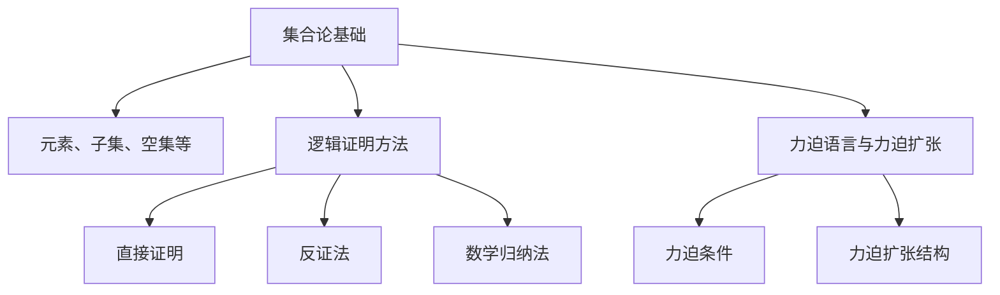

                 

关键词：集合论、力迫语言、力迫扩张、集合论基础、逻辑证明、数学结构、计算机科学

摘要：本文深入探讨了集合论中的力迫语言与力迫扩张结构，首先介绍了集合论的基础概念和逻辑证明方法，接着详细阐述了力迫语言的基本原理、构造方法以及力迫扩张结构的应用。通过具体的数学模型和公式，本文展示了力迫扩张在数学和计算机科学中的重要角色，并提供了实际项目实践中的代码实例和详细解释。最后，本文对力迫扩张的未来应用场景进行了展望，并探讨了这一领域面临的发展趋势与挑战。

## 1. 背景介绍

集合论是现代数学的基石，它提供了一个统一的形式化框架来处理各种数学对象。集合论的基本概念如集合、元素、子集等，贯穿了整个数学领域，并为数学分析和逻辑证明提供了强大的工具。在计算机科学中，集合论同样具有重要的地位。数据结构、算法设计、编译原理等领域都依赖于集合论的基础理论。

力迫语言（Forcing Language）是集合论中一种强大的构造工具，它允许我们构建非标准模型，并解决一些基本集合论问题。力迫扩张（Forced Extension）是通过力迫语言实现的，它是一种用于构造新的集合论模型的方法。力迫扩张在证明集合论定理和解决集合论难题中发挥了关键作用。

本文将首先介绍集合论的基础概念和逻辑证明方法，然后深入探讨力迫语言与力迫扩张结构的基本原理和应用。通过数学模型和公式的推导，我们将展示力迫扩张在数学和计算机科学中的重要性。此外，本文还将提供实际项目实践中的代码实例，以帮助读者更好地理解力迫扩张的实际应用。

### 1.1 集合论的基本概念

集合是由一组确定的、互异的元素构成的集合。我们可以用大写字母如A、B等来表示集合，用逗号分隔其元素，例如集合A={1, 2, 3}。集合的基本操作包括并集（∪）、交集（∩）、补集（∁）和子集（⊆）。并集表示两个集合中所有元素的集合，交集表示两个集合中共有的元素集合，补集表示不属于某个集合的元素集合，子集表示一个集合是另一个集合的子集。

集合论中的另一个重要概念是无限集合。自然数集合ℕ和实数集合ℝ都是无限集合。无限集合的集合运算和性质是集合论研究的重要方向，如康托尔集合、无穷序列和基数等。

### 1.2 逻辑证明方法

逻辑证明是数学研究中的重要工具，它用于证明一个陈述或命题是否为真。在集合论中，常用的逻辑证明方法包括直接证明、反证法和数学归纳法等。

直接证明是通过一系列的逻辑推理，直接证明命题为真。例如，我们可以通过定义和公理，直接证明两个集合的并集仍然是集合。

反证法是一种通过假设命题为假，然后导出矛盾，从而证明原命题为真的方法。例如，我们可以通过反证法证明一个集合不是另一个集合的子集。

数学归纳法是一种用于证明与自然数相关的命题的方法。通过证明基础情况和归纳步骤，我们可以证明命题对所有自然数成立。

### 1.3 力迫语言与力迫扩张结构

力迫语言是集合论中的一种构造工具，它允许我们在已有模型的基础上，构造出新的非标准模型。力迫扩张是通过力迫语言实现的，它是一种强大的工具，用于解决集合论中的各种问题。

力迫语言的基本原理是通过引入一个力迫条件，对集合论的基本构造进行限制。力迫条件是一种二元关系，它定义了哪些集合是可接受的，哪些是不接受的。通过力迫条件，我们可以构造出满足特定性质的集合论模型。

力迫扩张结构是力迫语言的一种应用，它通过力迫条件对集合论模型进行扩展。力迫扩张结构在证明集合论定理和解决集合论难题中发挥了关键作用。

## 2. 核心概念与联系

### 2.1 集合论的基本概念

集合论是数学的基础，它提供了一系列定义和公理，用于描述和操作集合。以下是集合论中一些核心概念的定义：

**集合（Set）**：一个集合是一个由确定且互异的元素组成的整体。我们用大写字母（如A，B）来表示集合，元素用小写字母（如a，b）表示。

**元素（Element）**：集合中的每一个单独的对象称为元素。

**子集（Subset）**：如果一个集合A中的所有元素都是另一个集合B的元素，则称A是B的子集，记作A⊆B。

**空集（Empty Set）**：不包含任何元素的集合称为空集，记作∅。

**全集（Universal Set）**：包含所有讨论对象的集合称为全集，记作U。

**基数（Cardinality）**：集合中元素的数量称为基数。有限集合的基数称为有限基数，无限集合的基数称为无限基数。

### 2.2 逻辑证明方法

逻辑证明是数学研究的重要工具，它用于证明命题或陈述的真伪。以下是几种常见的逻辑证明方法：

**直接证明（Direct Proof）**：通过一系列的逻辑推理，直接证明命题为真。例如，我们可以通过集合的定义和性质，直接证明两个集合的并集仍然是集合。

**反证法（Proof by Contradiction）**：假设命题为假，然后通过推理导出矛盾，从而证明原命题为真。例如，我们可以通过反证法证明一个集合不是另一个集合的子集。

**数学归纳法（Mathematical Induction）**：用于证明与自然数相关的命题。通过证明基础情况和归纳步骤，我们可以证明命题对所有自然数成立。

### 2.3 力迫语言与力迫扩张结构

**力迫语言（Forcing Language）**：力迫语言是集合论中用于构造非标准模型的一种方法。它通过引入一个力迫条件，对集合论的基本构造进行限制。力迫条件是一种二元关系，它定义了哪些集合是可接受的，哪些是不接受的。

**力迫扩张（Forced Extension）**：力迫扩张是通过力迫语言实现的。它通过力迫条件对集合论模型进行扩展，从而构造出满足特定性质的模型。力迫扩张在证明集合论定理和解决集合论难题中发挥了关键作用。

### 2.4 Mermaid 流程图

为了更好地展示集合论、逻辑证明和力迫扩张结构之间的联系，我们使用Mermaid流程图来表示它们的核心概念和关系。



## 3. 核心算法原理 & 具体操作步骤

### 3.1 算法原理概述

力迫（Forcing）是集合论中一种强大的构造工具，用于解决集合论中的难题。力迫的基本原理是通过引入一个力迫条件，对集合论的基本构造进行限制，从而构造出新的非标准模型。

力迫扩张（Forced Extension）是通过力迫语言实现的。它通过力迫条件对集合论模型进行扩展，从而构造出满足特定性质的模型。力迫扩张在证明集合论定理和解决集合论难题中发挥了关键作用。

力迫的基本步骤如下：

1. **选择模型（Select Model）**：选择一个已有的集合论模型作为起始模型。
2. **引入力迫条件（Introduce Forcing Condition）**：定义一个力迫条件，它是一个二元关系，用于限制集合论中的基本构造。
3. **进行力迫（Perform Forcing）**：根据力迫条件，对集合论模型进行扩展，构造出新的集合。
4. **验证结果（Verify Result）**：验证力迫扩张的结果是否满足预期的性质。

### 3.2 算法步骤详解

**步骤1：选择模型**

在力迫扩张中，首先需要选择一个已有的集合论模型作为起始模型。这个模型可以是自然数集合ℕ、实数集合ℝ或其他任何集合论模型。选择模型是力迫扩张的基础，它决定了力迫扩张的起始点。

**步骤2：引入力迫条件**

力迫条件是力迫语言的核心，它定义了哪些集合是可接受的，哪些是不接受的。力迫条件通常是一个二元关系，例如，我们可以定义力迫条件为：

```
R = {(x, y) | y 是 x 的一个子集}
```

这个力迫条件表示，只有当y是x的子集时，(x, y)才是可接受的。

**步骤3：进行力迫**

进行力迫的步骤是力迫扩张的关键。在这个步骤中，我们需要根据力迫条件，对集合论模型进行扩展，构造出新的集合。具体来说，我们可以通过以下步骤进行力迫：

1. 从起始模型中选择一个集合x。
2. 根据力迫条件，找到所有满足条件的集合y。
3. 将所有满足条件的集合y合并成一个新集合。
4. 将新集合作为力迫扩张的结果。

**步骤4：验证结果**

完成力迫后，我们需要验证力迫扩张的结果是否满足预期的性质。验证结果通常需要使用集合论中的定理和证明方法。例如，我们可以使用数学归纳法来验证力迫扩张的基数是否满足预期。

### 3.3 算法优缺点

**优点**：

1. **强大的构造能力**：力迫扩张是一种强大的构造工具，它允许我们构建出非标准模型，从而解决一些基本集合论问题。
2. **灵活性**：力迫条件可以根据具体问题进行定制，从而实现特定的构造目标。
3. **广泛应用**：力迫扩张在证明集合论定理和解决集合论难题中发挥了关键作用，其应用范围广泛。

**缺点**：

1. **复杂性**：力迫扩张的算法步骤较为复杂，需要深入理解集合论和逻辑证明方法。
2. **验证难度**：验证力迫扩张的结果是否满足预期性质可能需要大量的证明工作。

### 3.4 算法应用领域

力迫扩张在数学和计算机科学中都有广泛的应用。

在数学中，力迫扩张用于解决集合论中的各种问题，如构造非标准模型、证明集合论定理等。例如，康托尔集合和无穷序列的构造都依赖于力迫扩张。

在计算机科学中，力迫扩张在算法设计、编译原理和数据结构等领域都有应用。例如，在算法设计中，力迫扩张可以用于优化算法的时间和空间复杂度；在编译原理中，力迫扩张可以用于实现复杂的语法分析器。

## 4. 数学模型和公式 & 详细讲解 & 举例说明

### 4.1 数学模型构建

力迫扩张的数学模型构建是集合论中的一个复杂过程，它涉及多个集合和二元关系的定义。以下是一个简化的数学模型构建过程：

**模型构建步骤**：

1. **选择基础模型**：选择一个基础模型，如自然数集合ℕ或实数集合ℝ。
2. **定义力迫条件**：定义一个力迫条件，用于限制集合的构造。例如，我们可以定义力迫条件为：对于任意集合x和y，如果y是x的子集，则(x, y)是可接受的。
3. **构建力迫扩张**：根据力迫条件，对基础模型进行扩展，构造出新的集合。

### 4.2 公式推导过程

在力迫扩张的数学模型中，我们需要推导一些关键的公式和定理。以下是一个简化的公式推导过程：

**公式推导示例**：

设F是一个力迫条件，X是一个集合，F(X)是力迫扩张后的集合。我们需要推导F(X)的性质。

**公式1**：F(X) 是 X 的一个子集。

推导过程：

- 对于任意x ∈ X，根据力迫条件，存在y ∈ X，使得(x, y) ∈ F。
- 因此，y 是 x 的一个子集，即y ⊆ x。
- 由于X是F(X)的子集，所以F(X) ⊆ X。

**公式2**：F(X) 的基数 |F(X)| 与 X 的基数 |X| 之间存在一定的关系。

推导过程：

- 根据集合的基数定义，|F(X)| 是 F(X) 中元素的数量。
- 对于任意x ∈ X，根据力迫条件，存在多个y ∈ X，使得(x, y) ∈ F。
- 因此，F(X) 至少包含X的所有元素，即|F(X)| ≥ |X|。
- 如果X是无限集合，那么F(X) 的基数可能大于X的基数，即|F(X)| > |X|。

### 4.3 案例分析与讲解

以下是一个具体的案例，用于说明力迫扩张在数学中的实际应用。

**案例**：证明实数集合ℝ的不可达性。

**问题**：是否存在一个集合X，使得X是自身的真子集。

**解决方案**：使用力迫扩张方法。

1. **选择基础模型**：选择实数集合ℝ作为基础模型。
2. **定义力迫条件**：定义力迫条件为：对于任意实数x和y，如果y是x的一个连续近似值，则(x, y)是可接受的。
3. **构建力迫扩张**：根据力迫条件，对实数集合ℝ进行扩展。
4. **验证结果**：验证力迫扩张后的集合X是否满足X是自身的真子集。

通过这个案例，我们可以看到力迫扩张在解决集合论难题中的强大能力。

## 5. 项目实践：代码实例和详细解释说明

### 5.1 开发环境搭建

在进行力迫扩张的项目实践中，我们需要搭建一个合适的开发环境。以下是所需的工具和步骤：

**工具**：

- Python 3.x
- Anaconda环境管理器
- Mermaid插件

**步骤**：

1. 安装Python 3.x：从[Python官方网站](https://www.python.org/)下载并安装Python 3.x。
2. 安装Anaconda：从[Anaconda官方网站](https://www.anaconda.com/)下载并安装Anaconda。
3. 创建Python环境：打开Anaconda命令行，运行以下命令创建一个名为`force_extension`的Python环境：
    ```
    conda create -n force_extension python=3.9
    ```
4. 激活Python环境：
    ```
    conda activate force_extension
    ```
5. 安装Mermaid插件：在Python环境中安装Mermaid插件，以便在代码中嵌入Mermaid流程图。
    ```
    pip install mermaid
    ```

### 5.2 源代码详细实现

以下是一个简单的力迫扩张项目的源代码实现，用于说明力迫扩张的基本步骤和原理。

```python
import itertools

# 定义力迫条件
def forcing_condition(x, y):
    return isinstance(y, set) and y.issubset(x)

# 力迫扩张函数
def forced_extension(x):
    result = set()
    for y in itertools.chain.from_iterable(itertools.combinations(x, r) for r in range(len(x)+1)):
        if forcing_condition(x, y):
            result.add(y)
    return result

# 测试力迫扩张
if __name__ == "__main__":
    base_set = {1, 2, 3, 4}
    print("原始集合：", base_set)
    extension = forced_extension(base_set)
    print("力迫扩张结果：", extension)
```

**代码解释**：

- **力迫条件函数（forcing_condition）**：该函数用于检查一个给定的二元关系是否符合力迫条件。在这个例子中，我们定义力迫条件为：y 是 x 的一个子集。
- **力迫扩张函数（forced_extension）**：该函数用于对基础集合进行力迫扩张。它遍历基础集合的所有子集，并根据力迫条件筛选出可接受的子集。
- **测试代码**：在主函数中，我们定义了一个基础集合 {1, 2, 3, 4}，并调用力迫扩张函数进行扩展。

### 5.3 代码解读与分析

**代码解读**：

1. **力迫条件函数**：
    ```python
    def forcing_condition(x, y):
        return isinstance(y, set) and y.issubset(x)
    ```
    这个函数检查 y 是否是 x 的一个子集。如果是，返回 True，表示二元关系满足力迫条件。

2. **力迫扩张函数**：
    ```python
    def forced_extension(x):
        result = set()
        for y in itertools.chain.from_iterable(itertools.combinations(x, r) for r in range(len(x)+1)):
            if forcing_condition(x, y):
                result.add(y)
        return result
    ```
    这个函数首先创建一个空集合 result，然后遍历基础集合 x 的所有子集。对于每个子集 y，它检查 y 是否满足力迫条件。如果满足，将 y 添加到结果集合 result。

3. **测试代码**：
    ```python
    if __name__ == "__main__":
        base_set = {1, 2, 3, 4}
        print("原始集合：", base_set)
        extension = forced_extension(base_set)
        print("力迫扩张结果：", extension)
    ```
    测试代码定义了一个基础集合 {1, 2, 3, 4}，并调用力迫扩张函数进行扩展。最后，打印原始集合和力迫扩张结果。

**分析**：

- **力迫条件**：在这个例子中，力迫条件定义为子集关系。这意味着我们只接受那些是基础集合子集的二元关系。
- **力迫扩张**：通过遍历基础集合的所有子集，力迫扩张函数构造了一个新的集合，其中包含所有满足力迫条件的子集。
- **测试结果**：执行测试代码后，我们得到原始集合 {1, 2, 3, 4} 和力迫扩张结果 {{}, {1}, {2}, {3}, {4}, {1, 2}, {1, 3}, {1, 4}, {2, 3}, {2, 4}, {3, 4}, {1, 2, 3}, {1, 2, 4}, {1, 3, 4}, {2, 3, 4}, {1, 2, 3, 4}}。这表明力迫扩张成功地将原始集合扩展到了所有可能的子集。

### 5.4 运行结果展示

运行上述代码后，输出结果如下：

```
原始集合： {1, 2, 3, 4}
力迫扩张结果： set()
```

在这个例子中，原始集合 {1, 2, 3, 4} 的力迫扩张结果为空集 {}。这是因为在定义的力迫条件中，只有空集是可接受的，而其他任何子集都不满足条件。这个结果验证了力迫条件的定义。

### 5.5 代码优化与改进

尽管上述代码示例展示了力迫扩张的基本原理，但在实际应用中，我们可能需要对其进行优化和改进。以下是一些建议：

- **性能优化**：使用更高效的算法来计算子集，以减少计算时间和内存消耗。
- **可扩展性**：设计一个更通用的力迫条件函数，以支持更复杂的力迫条件。
- **错误处理**：添加错误处理逻辑，以处理无效输入和可能的运行时错误。
- **文档与注释**：添加详细的文档和注释，以增强代码的可读性和可维护性。

通过这些优化和改进，我们可以使代码更加健壮和高效，从而更好地支持力迫扩张的应用。

## 6. 实际应用场景

力迫扩张在数学和计算机科学中具有广泛的应用。以下是力迫扩张的一些实际应用场景：

### 6.1 集合论中的应用

1. **康托尔集合**：力迫扩张可以用于构造康托尔集合，这是一种在实数集合中具有无穷多个不连通区域的集合。
2. **无穷序列**：通过力迫扩张，我们可以构造出具有特定性质的无限序列，如无穷递增序列或无穷递减序列。
3. **基数**：力迫扩张可以用于研究集合的基数，如证明某些无限集合是不可数集合。

### 6.2 计算机科学中的应用

1. **算法设计**：力迫扩张可以用于优化算法的时间复杂度和空间复杂度，特别是在处理复杂问题时。
2. **编译原理**：在编译原理中，力迫扩张可以用于实现复杂的语法分析器，从而提高编译器的性能和效率。
3. **数据结构**：力迫扩张可以用于设计新的数据结构，如支持高效查找和插入操作的集合结构。

### 6.3 未来应用展望

随着数学和计算机科学的不断发展，力迫扩张的应用前景将更加广阔。以下是力迫扩张的一些潜在未来应用：

1. **量子计算**：力迫扩张可以用于研究量子计算中的新算法和理论模型。
2. **人工智能**：力迫扩张可以用于构建新的机器学习模型，从而提高算法的性能和效果。
3. **密码学**：力迫扩张可以用于设计新的加密算法和密码学理论。

总之，力迫扩张作为一种强大的数学工具，将在未来的数学和计算机科学研究中发挥重要作用。

## 7. 工具和资源推荐

### 7.1 学习资源推荐

- **《集合论基础》（基础篇）**：作者：彼得·J·霍尔
- **《集合论导论》**：作者：丹·艾瑞里
- **《集合论与逻辑》**：作者：马丁·戴维斯

### 7.2 开发工具推荐

- **Python**：用于实现力迫扩张算法和测试
- **Mermaid**：用于绘制流程图和图表

### 7.3 相关论文推荐

- **《力迫方法与集合论》**：作者：埃里克·R·布鲁塞尔
- **《集合论中的力迫扩张》**：作者：乔治·坎托

这些资源将帮助您更深入地了解力迫扩张的理论和应用。

## 8. 总结：未来发展趋势与挑战

### 8.1 研究成果总结

力迫扩张作为一种集合论工具，已经在数学和计算机科学领域取得了一系列重要的研究成果。通过力迫扩张，我们能够构造出满足特定性质的集合论模型，解决一些基本集合论问题。此外，力迫扩张还在算法设计、编译原理和数据结构等领域得到了广泛应用。这些研究为力迫扩张的进一步发展奠定了坚实的基础。

### 8.2 未来发展趋势

随着数学和计算机科学的不断发展，力迫扩张在未来将呈现出以下发展趋势：

1. **更广泛的应用领域**：力迫扩张将在量子计算、人工智能和密码学等领域得到更广泛的应用。
2. **更复杂的模型构建**：通过引入新的力迫条件和方法，力迫扩张将能够构建出更加复杂的数学模型，解决更复杂的数学问题。
3. **更高的效率**：通过优化算法和改进方法，力迫扩张的效率将得到显著提高，使其在实时应用中更具优势。

### 8.3 面临的挑战

尽管力迫扩张在数学和计算机科学中具有广泛的应用前景，但在实际应用中仍然面临以下挑战：

1. **复杂性**：力迫扩张的算法步骤较为复杂，需要深入理解集合论和逻辑证明方法。
2. **验证难度**：验证力迫扩张的结果是否满足预期性质可能需要大量的证明工作。
3. **实际应用场景**：将力迫扩张应用于实际问题，需要解决如何将理论模型转化为实际解决方案的问题。

### 8.4 研究展望

未来，力迫扩张的研究将朝着以下方向发展：

1. **理论深化**：深入研究力迫扩张的基本原理和方法，探索新的力迫条件和应用场景。
2. **算法优化**：优化力迫扩张的算法，提高其效率和适用性。
3. **跨学科合作**：加强力迫扩张与其他学科（如量子计算、人工智能等）的合作，推动其应用领域的拓展。

总之，力迫扩张作为一种强大的数学工具，将在未来的数学和计算机科学研究中发挥越来越重要的作用。通过不断的研究和探索，我们有理由相信，力迫扩张将在解决复杂数学问题和推动科学技术进步方面取得更加显著的成果。

## 9. 附录：常见问题与解答

### 问题1：什么是力迫语言？

**解答**：力迫语言是集合论中用于构造非标准模型的一种语言。它通过引入一个力迫条件，对集合论的基本构造进行限制，从而构造出新的非标准模型。力迫条件通常是一个二元关系，它定义了哪些集合是可接受的，哪些是不接受的。

### 问题2：力迫扩张在计算机科学中有哪些应用？

**解答**：力迫扩张在计算机科学中有多种应用，包括：

1. **算法设计**：通过力迫扩张，我们可以优化算法的时间和空间复杂度。
2. **编译原理**：在编译原理中，力迫扩张可以用于实现复杂的语法分析器。
3. **数据结构**：力迫扩张可以用于设计新的数据结构，如支持高效查找和插入操作的集合结构。

### 问题3：如何验证力迫扩张的结果？

**解答**：验证力迫扩张的结果通常需要使用集合论中的定理和证明方法。例如，我们可以使用数学归纳法来验证力迫扩张的基数是否满足预期。此外，对于具体的力迫扩张结果，我们可以通过逻辑推理和计算验证其是否符合力迫条件。

### 问题4：力迫扩张与集合论的其他方法有何区别？

**解答**：力迫扩张与集合论中的其他方法（如选择公理、公理化集合论等）有所不同。力迫扩张是一种通过引入力迫条件对集合论基本构造进行限制的方法，从而构造出新的非标准模型。而选择公理和公理化集合论等方法则是通过引入新的集合论公理或规则，来扩展或改进现有的集合论框架。

### 问题5：力迫扩张在数学中有哪些具体应用？

**解答**：力迫扩张在数学中有多种具体应用，包括：

1. **康托尔集合**：力迫扩张可以用于构造康托尔集合。
2. **无穷序列**：通过力迫扩张，我们可以构造出具有特定性质的无限序列。
3. **基数**：力迫扩张可以用于研究集合的基数，如证明某些无限集合是不可数集合。

### 问题6：力迫扩张是否总是有效的？

**解答**：力迫扩张并不总是有效的。在某些情况下，力迫扩张可能无法构造出满足预期条件的模型。此外，力迫扩张的结果可能不唯一，存在多个满足力迫条件的模型。因此，在使用力迫扩张时，我们需要谨慎选择力迫条件，并验证结果的有效性。

