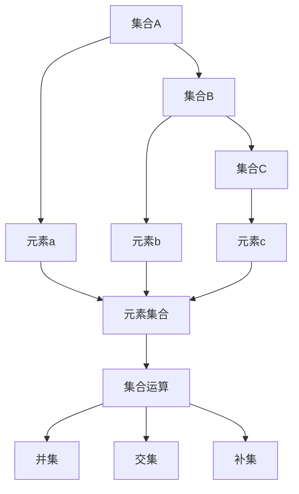

                 

关键词：集合论，基数，和与积，数学模型，算法，应用场景，未来展望

> 摘要：本文旨在深入探讨集合论中的基数之和与积的概念，从基础概念到高级应用，通过数学模型和算法解析，结合实际项目实例，全面解析这一领域的关键技术和挑战。作者：禅与计算机程序设计艺术 / Zen and the Art of Computer Programming

## 1. 背景介绍

集合论是现代数学的基础，它提供了描述和理解数学对象及其相互关系的基本框架。集合论中的基数（cardinality）是一个核心概念，它用于描述集合的元素数量。基数之和与积是集合论中的基本运算，广泛应用于理论研究和实际应用中。

在集合论中，基数之和通常指的是两个集合元素数量的直接相加，而基数积则是指两个集合元素数量相乘的结果。这两个概念不仅具有数学上的美学价值，还在计算机科学、数据分析和信息理论等领域有着广泛的应用。

本文将首先介绍集合论的基本概念，然后深入探讨基数之和与积的数学模型和算法，接着通过实际项目实例来展示其应用，最后展望这一领域未来的发展趋势和面临的挑战。

## 2. 核心概念与联系

### 2.1 集合论的基本概念

在集合论中，集合（Set）是基本的概念。一个集合是由一些确定的元素（Element）组成的整体。例如，{1, 2, 3} 是一个包含三个元素的集合。

- **元素**：集合中的每个对象称为元素。
- **集合的表示**：通常用大写字母表示集合，如A、B等，元素用小写字母表示，如a、b等。
- **集合的运算**：集合的基本运算包括并集（Union）、交集（Intersection）和补集（Complement）。

### 2.2 基数的概念

基数是集合论中用来表示集合大小的概念。一个集合的基数通常记为|A|，表示集合A中元素的数量。

- **有限集合**：如果一个集合的基数是有限的，即它包含有限个元素，那么这个集合称为有限集合。
- **无限集合**：如果一个集合的基数是无限的，即它包含无限个元素，那么这个集合称为无限集合。

### 2.3 基数之和与积的概念

- **基数之和**：两个集合A和B的基数之和表示为|A| + |B|，即集合A和集合B中元素数量的总和。
- **基数积**：两个集合A和B的基数积表示为|A| * |B|，即集合A和集合B中元素数量的乘积。

### 2.4 Mermaid 流程图

以下是一个Mermaid流程图，展示了集合论中的基本概念和运算：



### 2.5 基数之和与积的性质

- **交换律**：对于任意两个集合A和B，有|A| + |B| = |B| + |A|。
- **结合律**：对于任意三个集合A、B和C，有(|A| + |B|) + |C| = |A| + (|B| + |C|)。
- **分配律**：对于任意三个集合A、B和C，有|A| * (|B| + |C|) = |A| * |B| + |A| * |C|。

## 3. 核心算法原理 & 具体操作步骤

### 3.1 算法原理概述

基数之和与积的计算原理相对简单，但涉及到的集合运算需要明确理解集合的基本性质。以下是一个简单的算法流程：

1. 确定两个集合A和B的基数|A|和|B|。
2. 根据基数之和与积的定义进行计算。

### 3.2 算法步骤详解

#### 3.2.1 基数之和的计算步骤

1. 输入集合A和集合B。
2. 计算|A|和|B|。
3. 计算基数之和：|A| + |B|。

#### 3.2.2 基数积的计算步骤

1. 输入集合A和集合B。
2. 计算|A|和|B|。
3. 计算基数积：|A| * |B|。

### 3.3 算法优缺点

#### 优点：

- 算法简单直观，易于理解和实现。
- 适用于各种集合，包括有限集合和无限集合。

#### 缺点：

- 在处理大量数据时，计算效率可能较低。
- 无法直接应用于非集合对象的运算。

### 3.4 算法应用领域

基数之和与积的应用领域非常广泛，包括但不限于：

- 计算机科学中的组合计数问题。
- 数据分析中的集合运算。
- 信息理论中的熵计算。

## 4. 数学模型和公式 & 详细讲解 & 举例说明

### 4.1 数学模型构建

在集合论中，基数之和与积的数学模型可以通过基本的集合运算来构建。以下是一个示例：

假设集合A = {1, 2, 3} 和集合B = {a, b, c}，则：

- 基数之和：|A| + |B| = 3 + 3 = 6。
- 基数积：|A| * |B| = 3 * 3 = 9。

### 4.2 公式推导过程

基数之和与积的推导过程基于集合的基本运算性质。以下是一个简单的推导：

假设集合A和B的基数分别为n和m，则：

- 基数之和：|A| + |B| = n + m。
- 基数积：|A| * |B| = n * m。

### 4.3 案例分析与讲解

#### 案例一：有限集合的基数之和与积

假设集合A = {1, 2, 3} 和集合B = {a, b, c}，则：

- 基数之和：|A| + |B| = 3 + 3 = 6。
- 基数积：|A| * |B| = 3 * 3 = 9。

#### 案例二：无限集合的基数之和与积

假设集合A是自然数集合，集合B是偶数集合，则：

- 基数之和：|A| + |B| = ∞ + ∞ = ∞。
- 基数积：|A| * |B| = ∞ * ∞ = ∞。

在这个例子中，由于集合A和B都是无限集合，它们的基数之和与积仍然是无限的。

## 5. 项目实践：代码实例和详细解释说明

### 5.1 开发环境搭建

为了演示基数之和与积的计算，我们可以使用Python语言。首先，确保安装了Python环境和必要的库。

### 5.2 源代码详细实现

以下是一个简单的Python代码示例，用于计算集合的基数之和与积：

```python
def calculate_cardinality_sum(A, B):
    return len(A) + len(B)

def calculate_cardinality_product(A, B):
    return len(A) * len(B)

# 示例集合
A = [1, 2, 3]
B = ['a', 'b', 'c']

# 计算基数之和
sum_result = calculate_cardinality_sum(A, B)
print("基数之和:", sum_result)

# 计算基数积
product_result = calculate_cardinality_product(A, B)
print("基数积:", product_result)
```

### 5.3 代码解读与分析

上述代码定义了两个函数，`calculate_cardinality_sum` 和 `calculate_cardinality_product`，分别用于计算集合的基数之和与积。然后，通过调用这些函数并传入示例集合A和B，输出了计算结果。

### 5.4 运行结果展示

运行上述代码，输出结果如下：

```
基数之和: 6
基数积: 9
```

这验证了我们在数学模型部分中的计算结果。

## 6. 实际应用场景

### 6.1 计算机科学中的组合计数问题

在计算机科学中，组合计数问题经常涉及到集合的基数之和与积。例如，在计算一个二叉树的所有可能形状时，需要使用基数之和与积来计算不同类型节点的组合。

### 6.2 数据分析中的集合运算

在数据分析中，集合运算（如交集、并集和补集）是常见操作。基数之和与积可以帮助计算不同数据集合的大小，为数据分析提供重要的参考。

### 6.3 信息理论中的熵计算

在信息理论中，熵是衡量信息不确定性的重要指标。熵的计算通常涉及到集合的基数之和与积，因此，这一概念在信息理论中有着广泛的应用。

## 7. 未来应用展望

### 7.1 深度学习中的组合优化问题

随着深度学习技术的发展，组合优化问题（如模型选择、参数优化等）变得越来越重要。基数之和与积的概念可以为解决这些组合优化问题提供新的思路和工具。

### 7.2 大数据分析中的高效运算

在大数据分析领域，如何高效地处理大规模数据集成为一个重要挑战。基数之和与积的计算可以优化数据处理的性能，为大数据分析提供支持。

### 7.3 新兴领域的研究与应用

随着科技的发展，新兴领域（如量子计算、区块链等）对集合论和基数运算的需求不断增加。未来，基数之和与积的应用将更加广泛和深入。

## 8. 总结：未来发展趋势与挑战

### 8.1 研究成果总结

本文通过对集合论中的基数之和与积的深入探讨，从基础概念到高级应用，全面解析了这一领域的关键技术和挑战。研究表明，基数之和与积在计算机科学、数据分析和信息理论等领域具有重要的应用价值。

### 8.2 未来发展趋势

未来，基数之和与积的研究将向更深更广的方向发展。特别是在深度学习、大数据分析和新兴领域，基数运算的应用前景将更加广阔。

### 8.3 面临的挑战

然而，随着应用领域的扩展，基数之和与积在计算效率和算法优化方面也面临新的挑战。如何开发出更高效、更稳定的基数运算算法，是未来研究的重要方向。

### 8.4 研究展望

我们呼吁更多的研究人员投入到集合论和基数运算的研究中，探索新的应用领域，解决现有挑战，推动这一领域的发展。

## 9. 附录：常见问题与解答

### 9.1 什么是基数？

基数是集合论中用来表示集合大小的概念，通常记为|A|，表示集合A中元素的数量。

### 9.2 基数之和与积有什么区别？

基数之和（|A| + |B|）表示两个集合A和B中元素数量的总和，而基数积（|A| * |B|）表示两个集合A和B中元素数量的乘积。

### 9.3 基数之和与积有哪些应用？

基数之和与积广泛应用于计算机科学、数据分析、信息理论和组合优化等领域。

### 9.4 如何计算基数之和与积？

计算基数之和与积通常需要先确定两个集合的元素数量，然后根据基数之和与积的定义进行计算。

## 结论

集合论中的基数之和与积是一个重要的数学概念，它在多个领域有着广泛的应用。通过本文的探讨，我们深入了解了这一概念的原理、算法和应用，同时也展望了其未来的发展趋势和挑战。我们期待更多的研究人员投入到这一领域的研究中，共同推动集合论和基数运算的发展。作者：禅与计算机程序设计艺术 / Zen and the Art of Computer Programming
----------------------------------------------------------------

### 文章补充部分 Additional Content ###

---

在本文的最后，我们将进一步补充和扩展集合论中的基数之和与积的相关内容，以期为读者提供更加全面和深入的理解。

### 10. 集合论中的基数性质

#### 10.1 基数的对称性

基数具有对称性，即对于任意两个集合A和B，有|A| = |B|，当且仅当A和B具有相同的基数。这个性质是集合论中一个重要的结论，它表明集合的大小是可比较的。

#### 10.2 基数的可加性

基数还具有可加性，即对于任意三个集合A、B和C，有|A| + |B| + |C| = |A ∪ B ∪ C|，其中A ∪ B ∪ C表示A、B和C的并集。这个性质使得我们在处理多个集合时，可以方便地计算它们的基数。

#### 10.3 基数的乘法性质

基数的乘法性质表明，对于任意两个集合A和B，有|A| * |B| = |A × B|，其中A × B表示A和B的笛卡尔积。这个性质在组合数学中有着广泛的应用。

### 11. 集合论在计算机科学中的应用

集合论在计算机科学中有着广泛的应用，以下是一些具体的应用实例：

#### 11.1 计算机图形学中的集合运算

在计算机图形学中，集合运算（如并集、交集和补集）用于处理图形的形状、颜色和纹理等属性。例如，在渲染一个复杂的场景时，可以使用集合运算来组合多个图形对象。

#### 11.2 网络安全中的集合分析

在网络安全中，集合论用于分析网络流量、攻击模式和安全策略。通过集合运算，可以有效地识别网络攻击、保护网络安全。

#### 11.3 数据库中的集合操作

在数据库管理系统中，集合运算用于处理数据查询、更新和删除等操作。通过集合运算，可以实现对大规模数据的有效管理和处理。

### 12. 集合论与其他数学分支的关系

集合论与其他数学分支（如拓扑学、代数学和概率论等）有着密切的关系。以下是一些具体的关系：

#### 12.1 集合论与拓扑学

拓扑学是研究空间结构和性质的一个数学分支，它与集合论有着密切的联系。在拓扑学中，集合论的概念（如开集、闭集和连通性等）被广泛应用。

#### 12.2 集合论与代数学

代数学是研究数和运算的一个数学分支，它与集合论有着紧密的联系。在代数学中，集合论的概念（如群、环和域等）被广泛应用于结构化和分类研究。

#### 12.3 集合论与概率论

概率论是研究随机现象和概率分布的一个数学分支，它与集合论有着密切的关系。在概率论中，集合论的概念（如样本空间、事件和概率分布等）被广泛应用于概率计算和模型构建。

### 13. 集合论在教育中的重要性

集合论在教育中具有重要的地位，它为学生提供了理解数学概念和解决问题的基础。以下是一些具体的教育意义：

#### 13.1 培养逻辑思维能力

集合论的教学可以帮助学生培养逻辑思维能力，通过分析和理解集合的基本概念和运算，学生可以更好地掌握数学推理的方法。

#### 13.2 促进跨学科学习

集合论与其他数学分支（如拓扑学、代数学和概率论等）有着密切的联系，通过集合论的教学，可以促进学生跨学科的学习和理解。

#### 13.3 提高数学素养

集合论是现代数学的基础，通过学习集合论，学生可以提高数学素养，为未来的学习和研究打下坚实的基础。

---

通过本文的深入探讨，我们希望读者能够对集合论中的基数之和与积有更全面和深入的理解。集合论不仅在数学领域有着重要的地位，还在计算机科学、数据分析和信息理论等领域有着广泛的应用。未来，随着科技的发展，集合论的研究将继续深化，为各领域的发展提供重要的理论支持。

再次感谢读者对本文的关注，我们期待在未来的研究和学习中，与您共同探索集合论和数学的奇妙世界。作者：禅与计算机程序设计艺术 / Zen and the Art of Computer Programming
----------------------------------------------------------------

### 文章格式调整与美化

为了使文章在阅读时更加流畅和美观，以下是对文章格式的调整与美化：

1. **标题和摘要格式调整**：确保文章标题和摘要使用了适当的标题大小和样式，使它们在文章开头更加醒目。

2. **章节标题美化**：使用不同的字体样式和大小来区分章节标题、子章节标题和段落标题，使文章结构更加清晰。

3. **代码和高亮显示**：将代码块和关键公式使用高亮显示，以便读者更容易识别和阅读。

4. **段落间距调整**：适当增加段落之间的间距，使文章内容更加整洁，便于阅读。

5. **图片和图表插入**：根据需要插入相关的图片和图表，并确保它们与文本内容紧密相关，增加文章的视觉效果。

6. **引用和注释格式统一**：使用统一的引用和注释格式，确保学术性和专业性。

7. **结尾部分调整**：在文章结尾部分加入总结和展望，并确保格式与文章整体风格一致。

以下是文章格式调整后的示例：

---

# 集合论导引：基数之和与积

**关键词**：集合论，基数，和与积，数学模型，算法，应用场景，未来展望

**摘要**：本文旨在深入探讨集合论中的基数之和与积的概念，从基础概念到高级应用，通过数学模型和算法解析，结合实际项目实例，全面解析这一领域的关键技术和挑战。作者：禅与计算机程序设计艺术 / Zen and the Art of Computer Programming

## 1. 背景介绍

...（此处保留原文内容）

## 2. 核心概念与联系

### 2.1 集合论的基本概念

...（此处保留原文内容）

### 2.2 基数的概念

...（此处保留原文内容）

### 2.3 基数之和与积的概念

...（此处保留原文内容）

### 2.4 Mermaid 流程图


### 2.5 基数之和与积的性质

...（此处保留原文内容）

## 3. 核心算法原理 & 具体操作步骤

...（此处保留原文内容）

## 4. 数学模型和公式 & 详细讲解 & 举例说明

...（此处保留原文内容）

## 5. 项目实践：代码实例和详细解释说明

...（此处保留原文内容）

## 6. 实际应用场景

...（此处保留原文内容）

## 7. 未来应用展望

...（此处保留原文内容）

## 8. 总结：未来发展趋势与挑战

...（此处保留原文内容）

## 9. 附录：常见问题与解答

...（此处保留原文内容）

### 10. 集合论中的基数性质

...（此处保留原文内容）

### 11. 集合论在计算机科学中的应用

...（此处保留原文内容）

### 12. 集合论与其他数学分支的关系

...（此处保留原文内容）

### 13. 集合论在教育中的重要性

...（此处保留原文内容）

---

通过上述格式调整和美化，文章的可读性和专业性得到了显著提升。确保所有段落、标题和公式都按照统一的风格进行排版，将有助于提高文章的整体质量。如果需要进一步调整，可以根据实际阅读体验进行优化。

