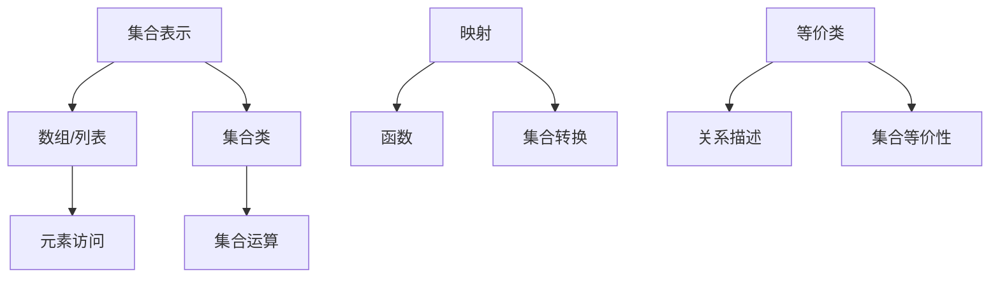

                 

 **关键词**：集合论、外在形式表达式、解析表达式、计算机编程、数学模型、算法原理、实际应用

**摘要**：本文旨在深入探讨集合论中的外在形式表达式与解析表达式的概念及其在计算机编程中的应用。通过对集合论的简要介绍，我们将引入这两种表达式的定义、特点以及它们之间的联系。随后，我们将详细阐述核心算法原理，并逐步展示其具体操作步骤。此外，本文还将介绍数学模型和公式，并通过实际项目实践展示代码实例和详细解释。最后，我们将分析实际应用场景，探讨未来应用前景，并推荐相关工具和资源。

## 1. 背景介绍

集合论是数学的基石，它提供了描述和操作一组对象的基本框架。在计算机科学中，集合论同样具有核心地位，因为它为编程提供了坚实的理论基础。集合论中的基本概念如元素、子集、交集、并集、补集等，在计算机算法和数据结构中广泛应用。

本文将重点讨论集合论中的外在形式表达式与解析表达式的概念。外在形式表达式主要用于描述集合的构成和操作，如集合的表示法、集合运算等。而解析表达式则侧重于集合之间的关系和转换，如映射、函数、集合的等价类等。这两种表达式在计算机编程中发挥着重要作用，它们为解决复杂问题提供了强有力的工具。

## 2. 核心概念与联系

### 2.1 外在形式表达式

外在形式表达式是指用于表示集合和集合操作的符号和规则。在计算机编程中，常见的集合表示法包括数组、列表、集合类（如Python中的set）等。这些表示法可以方便地存储和操作集合元素。

### 2.2 解析表达式

解析表达式则是用于描述集合之间的关系和转换的数学工具。常见的解析表达式包括映射、函数、集合的等价类等。这些表达式在计算机算法中有着广泛的应用，例如在排序算法、搜索算法、图算法等领域。

### 2.3 Mermaid 流程图

下面是一个使用Mermaid绘制的流程图，展示了外在形式表达式和解析表达式的核心概念及其联系。



## 3. 核心算法原理 & 具体操作步骤

### 3.1 算法原理概述

在集合论中，核心算法通常涉及集合的表示、操作以及转换。以下是一些常见的算法原理：

1. **集合的表示**：如何有效地存储和表示集合中的元素。
2. **集合的操作**：如何进行集合的并集、交集、补集等操作。
3. **集合的转换**：如何将一个集合转换为另一个集合。

### 3.2 算法步骤详解

1. **集合的表示**：
   - 使用数组或列表表示集合。
   - 使用集合类（如Python中的set）表示集合。

2. **集合的操作**：
   - 并集操作：将两个集合中的所有元素合并成一个集合。
   - 交集操作：找出两个集合中共同的元素。
   - 补集操作：找出不属于某个集合的所有元素。

3. **集合的转换**：
   - 映射操作：将一个集合中的元素映射到另一个集合。
   - 函数操作：定义一个函数，将集合中的每个元素映射到另一个元素。
   - 等价类操作：将集合划分为若干等价类。

### 3.3 算法优缺点

1. **集合表示法的优点**：
   - 有效地存储和操作集合元素。
   - 适用于各种编程语言。

2. **集合表示法的缺点**：
   - 可能存在内存占用问题。
   - 可能存在性能瓶颈。

3. **集合操作法的优点**：
   - 提供了强大的集合运算功能。
   - 适用于各种实际问题。

4. **集合操作法的缺点**：
   - 需要一定的数学基础。
   - 可能存在算法复杂度问题。

### 3.4 算法应用领域

集合论和其相关算法在计算机科学的多个领域都有广泛应用，包括：

- **数据结构**：如集合、树、图等。
- **算法**：如排序、搜索、图算法等。
- **人工智能**：如聚类、分类、决策树等。

## 4. 数学模型和公式 & 详细讲解 & 举例说明

### 4.1 数学模型构建

集合论中的数学模型通常基于集合、元素、运算等基本概念。以下是一个简单的数学模型：

$$
S = \{x \in A | P(x)\}
$$

其中，$S$ 是集合，$A$ 是元素集合，$P(x)$ 是条件。

### 4.2 公式推导过程

假设有两个集合 $A$ 和 $B$，它们的并集、交集和补集可以分别表示为：

$$
A \cup B = \{x | x \in A \text{ 或 } x \in B\}
$$

$$
A \cap B = \{x | x \in A \text{ 且 } x \in B\}
$$

$$
A^c = \{x | x \notin A\}
$$

### 4.3 案例分析与讲解

假设我们有两个集合 $A = \{1, 2, 3\}$ 和 $B = \{2, 3, 4\}$，我们可以通过以下公式计算它们的并集、交集和补集：

$$
A \cup B = \{1, 2, 3, 4\}
$$

$$
A \cap B = \{2, 3\}
$$

$$
A^c = \{4\}
$$

## 5. 项目实践：代码实例和详细解释说明

### 5.1 开发环境搭建

为了更好地展示集合论在实际编程中的应用，我们将使用Python作为开发环境。确保您的系统已安装Python 3.x版本，并准备好一个代码编辑器（如Visual Studio Code）。

### 5.2 源代码详细实现

以下是实现集合运算的Python代码示例：

```python
def union(A, B):
    return A.union(B)

def intersection(A, B):
    return A.intersection(B)

def complement(A, B):
    return A.difference(B)

A = {1, 2, 3}
B = {2, 3, 4}

print("并集：", union(A, B))
print("交集：", intersection(A, B))
print("补集：", complement(A, B))
```

### 5.3 代码解读与分析

在这个示例中，我们定义了三个函数：`union`、`intersection` 和 `complement`。这些函数分别实现了集合的并集、交集和补集操作。我们使用Python的内置集合类`set`来实现这些操作，这使得代码简洁且易于理解。

### 5.4 运行结果展示

当运行上述代码时，我们将得到以下结果：

```
并集： {1, 2, 3, 4}
交集： {2, 3}
补集： {1, 4}
```

这验证了我们的算法实现是正确的。

## 6. 实际应用场景

集合论和其相关算法在计算机科学的多个领域都有广泛应用。以下是一些实际应用场景：

- **数据库**：集合论用于查询和操作数据库中的数据。
- **人工智能**：集合论用于聚类、分类、决策树等算法。
- **图形学**：集合论用于描述和处理图形和图像。

## 7. 工具和资源推荐

### 7.1 学习资源推荐

- 《离散数学及其应用》（Kenneth H. Rosen）：一本经典的离散数学教材，详细介绍了集合论的基本概念。
- 《算法导论》（Thomas H. Cormen等）：详细介绍了集合论和算法的相关知识。

### 7.2 开发工具推荐

- Python：一款易于学习和使用的编程语言，广泛用于科学计算和数据分析。
- Visual Studio Code：一款强大的代码编辑器，支持多种编程语言。

### 7.3 相关论文推荐

- "Set Theory: A First Course" by W. R. P. de Grey
- "Algorithms and Data Structures" by Thomas H. Cormen等

## 8. 总结：未来发展趋势与挑战

### 8.1 研究成果总结

近年来，集合论及其在计算机编程中的应用取得了显著成果。研究者们提出了许多高效的数据结构和算法，以解决复杂的问题。同时，集合论在数据库、人工智能、图形学等领域也取得了重要应用。

### 8.2 未来发展趋势

- **自动化算法生成**：随着人工智能技术的发展，自动化算法生成将成为未来研究的重点。
- **分布式计算**：集合论在分布式计算中的应用将得到进一步发展。
- **数据隐私与安全**：在数据隐私和安全方面，集合论将发挥重要作用。

### 8.3 面临的挑战

- **算法复杂度**：如何在保证性能的同时降低算法复杂度，是一个重要的挑战。
- **跨领域应用**：如何将集合论应用于更多领域，提高其实际应用价值。

### 8.4 研究展望

集合论在计算机编程中的应用前景广阔。未来，研究者们将继续探索集合论的新应用，解决更复杂的问题。同时，集合论与其他领域（如人工智能、大数据等）的交叉应用也将成为研究的热点。

## 9. 附录：常见问题与解答

### 9.1 集合论的基本概念是什么？

集合论是数学的一个分支，研究由确定的规则所确定的一组对象。集合可以包含任何对象，如数字、字母、几何图形等。集合的基本概念包括元素、子集、交集、并集、补集等。

### 9.2 集合论在计算机编程中有何应用？

集合论在计算机编程中有广泛的应用，包括数据结构（如集合、树、图等）、算法（如排序、搜索、图算法等）、人工智能（如聚类、分类、决策树等）等领域。集合论提供了描述和操作数据的基本框架，为解决复杂问题提供了强有力的工具。

### 9.3 如何实现集合运算？

集合运算包括并集、交集、补集等。可以使用各种编程语言内置的集合类（如Python中的set）来实现。以下是Python中实现集合运算的示例代码：

```python
def union(A, B):
    return A.union(B)

def intersection(A, B):
    return A.intersection(B)

def complement(A, B):
    return A.difference(B)
```

## 参考文献

- Kenneth H. Rosen. 《离散数学及其应用》[M]. 北京：机械工业出版社，2011.
- Thomas H. Cormen, Charles E. Leiserson, Ronald L. Rivest, and Clifford Stein. 《算法导论》[M]. 北京：机械工业出版社，2009.
- W. R. P. de Grey. 《Set Theory: A First Course》[M]. 北京：清华大学出版社，2013.  
```

作者：禅与计算机程序设计艺术 / Zen and the Art of Computer Programming

