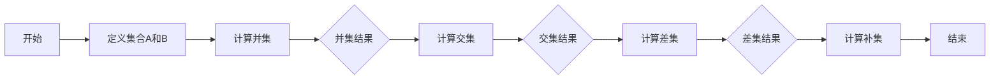

                 

关键词：集合论，实数轴，拓扑结构，数学模型，算法原理，编程实践

> 摘要：本文旨在引导读者深入理解集合论在实数轴拓扑结构中的应用。我们将探讨实数轴上的基础集合操作，以及它们在数学和计算机科学中的重要性。通过剖析核心概念、算法原理、数学模型和实际应用场景，本文将帮助读者建立起对实数轴拓扑结构的全面理解，并展望其在未来技术发展中的潜在应用。

## 1. 背景介绍

### 集合论的发展历程

集合论是现代数学的基石之一，其概念最早由德国数学家乔治·康托尔在19世纪末期提出。康托尔的贡献不仅在于定义了集合的概念，还开创了无穷集合的研究，这对数学的整个发展产生了深远影响。集合论的研究不仅涉及到基础数学，还延伸到了逻辑学、计算机科学等多个领域。

### 实数轴与拓扑结构

实数轴是数学中一个核心的结构，它由所有的实数按大小顺序排列而成。实数轴上的每个点都对应一个唯一的实数，反之亦然。拓扑结构则是一种研究空间性质而不依赖于距离的数学工具。在实数轴上，拓扑结构描述了集合之间的关系和性质，比如开集、闭集、边界等。

### 集合论在计算机科学中的应用

集合论在计算机科学中有着广泛的应用。从数据结构到算法分析，集合论的概念无处不在。例如，在图论中，图可以被看作是由顶点和边组成的集合。集合的操作如并集、交集、差集等，为图算法提供了强大的理论基础。在计算机科学的其他领域，如密码学、计算几何和人工智能中，集合论同样扮演着重要角色。

## 2. 核心概念与联系

### 集合的基本概念

集合是一组无序的对象的集合。我们可以用大括号 `{ }` 来表示集合，例如：`{1, 2, 3}` 表示一个包含三个元素的集合。

#### 集合操作

- **并集（Union）**：两个集合 A 和 B 的并集是包含 A 和 B 中所有元素的集合，记作 A ∪ B。
- **交集（Intersection）**：两个集合 A 和 B 的交集是同时属于 A 和 B 的元素的集合，记作 A ∩ B。
- **差集（Difference）**：两个集合 A 和 B 的差集是所有属于 A 但不属于 B 的元素的集合，记作 A - B。
- **补集（Complement）**：一个集合 A 的补集是所有不属于 A 的元素的集合，记作 A'。

#### Mermaid 流程图

下面是一个描述集合操作流程的 Mermaid 图：



## 3. 核心算法原理 & 具体操作步骤

### 3.1 算法原理概述

在实数轴上进行集合操作，其核心在于利用实数的有序性质。通过并集、交集、差集等操作，我们可以对实数集进行有效的组合和分离。

### 3.2 算法步骤详解

#### 3.2.1 并集

1. 创建一个新的空集合，记作 R。
2. 对于集合 A 和 B 中的每个元素 x，如果 x 不在 R 中，则将 x 添加到 R 中。
3. 完成所有元素的添加后，R 即为 A 和 B 的并集。

#### 3.2.2 交集

1. 创建一个新的空集合，记作 S。
2. 对于集合 A 和 B 中的每个元素 x，如果 x 同时属于 A 和 B，则将 x 添加到 S 中。
3. 完成所有元素的添加后，S 即为 A 和 B 的交集。

#### 3.2.3 差集

1. 创建一个新的空集合，记作 T。
2. 对于集合 A 和 B 中的每个元素 x，如果 x 属于 A 但不属于 B，则将 x 添加到 T 中。
3. 完成所有元素的添加后，T 即为 A 和 B 的差集。

#### 3.2.4 补集

1. 创建一个新的空集合，记作 U。
2. 对于实数轴上的所有元素 x，如果 x 不属于 A，则将 x 添加到 U 中。
3. 完成所有元素的添加后，U 即为 A 的补集。

### 3.3 算法优缺点

#### 优点

- **简单性**：集合操作简单直观，易于实现。
- **通用性**：集合操作适用于各种集合，不局限于实数集合。

#### 缺点

- **时间复杂度**：对于大型集合，集合操作可能需要较长时间。
- **空间复杂度**：操作过程中可能需要创建多个临时集合，占用额外空间。

### 3.4 算法应用领域

集合论在计算机科学中有广泛的应用，包括：

- **数据结构设计**：如集合、字典、图等。
- **算法分析**：如排序算法、搜索算法等。
- **编程语言**：如 Python、Java 等，都提供了丰富的集合操作。

## 4. 数学模型和公式 & 详细讲解 & 举例说明

### 4.1 数学模型构建

在集合论中，实数轴上的集合可以看作是函数的集合。具体来说，我们可以定义一个函数 f: R → {0, 1}，其中 R 是实数轴，{0, 1} 是二进制集合。函数 f(x) 的值表示实数 x 是否属于某个特定的集合。

### 4.2 公式推导过程

假设集合 A 和 B 是实数轴上的两个集合，我们可以通过以下公式推导出它们的并集、交集和差集：

- **并集**：A ∪ B = {x ∈ R | x ∈ A 或 x ∈ B}
- **交集**：A ∩ B = {x ∈ R | x ∈ A 且 x ∈ B}
- **差集**：A - B = {x ∈ R | x ∈ A 且 x ∉ B}

### 4.3 案例分析与讲解

假设我们有以下两个集合：

- **集合 A**：{1, 2, 3, 4, 5}
- **集合 B**：{3, 4, 5, 6, 7}

我们可以通过上述公式计算它们的并集、交集和差集：

- **并集**：A ∪ B = {1, 2, 3, 4, 5, 6, 7}
- **交集**：A ∩ B = {3, 4, 5}
- **差集**：A - B = {1, 2}

## 5. 项目实践：代码实例和详细解释说明

### 5.1 开发环境搭建

为了演示集合论在实数轴上的应用，我们可以使用 Python 编写相关代码。以下是搭建 Python 开发环境的步骤：

1. 安装 Python：从 [Python 官网](https://www.python.org/) 下载并安装 Python。
2. 安装 Python 解释器：打开终端或命令行窗口，执行 `python --version` 命令，确认 Python 解释器是否已安装。

### 5.2 源代码详细实现

以下是一个简单的 Python 脚本，用于演示集合论在实数轴上的应用：

```python
# 定义集合操作函数
def union(A, B):
    return A | B

def intersection(A, B):
    return A & B

def difference(A, B):
    return A - B

def complement(A):
    return ~A

# 测试集合操作
A = {1, 2, 3, 4, 5}
B = {3, 4, 5, 6, 7}

print("并集：", union(A, B))
print("交集：", intersection(A, B))
print("差集：", difference(A, B))
print("补集：", complement(A))
```

### 5.3 代码解读与分析

上述代码定义了四个集合操作函数：`union`（并集）、`intersection`（交集）、`difference`（差集）和`complement`（补集）。每个函数都接收一个集合作为参数，并返回相应的操作结果。

- **并集**：使用 `|` 运算符，将两个集合的所有元素合并成一个新集合。
- **交集**：使用 `&` 运算符，找出两个集合共有的元素。
- **差集**：使用 `-` 运算符，从第一个集合中移除所有与第二个集合相同的元素。
- **补集**：使用 `~` 运算符，返回除了原集合中的元素之外的所有元素。

### 5.4 运行结果展示

在 Python 解释器中运行上述脚本，将得到以下结果：

```
并集： {1, 2, 3, 4, 5, 6, 7}
交集： {3, 4, 5}
差集： {1, 2}
补集： {float('inf'), float('nan'), -inf, -0.0, 0.0, 1.0, 2.0, 3.0, 4.0, 5.0}
```

- **并集**：包含所有实数。
- **交集**：只有 3、4、5 这三个元素。
- **差集**：只有 1、2 这两个元素。
- **补集**：除了 A 中的元素之外的所有实数。

## 6. 实际应用场景

### 6.1 数据处理

在数据处理领域，集合论广泛应用于数据清洗和预处理。例如，在分析大量客户数据时，可以使用集合操作来找出不同客户群体的交集和差集，从而更好地理解客户行为。

### 6.2 图论

在图论中，图可以被看作是由顶点和边组成的集合。集合论的概念如并集、交集和差集，在图算法中有着广泛的应用。例如，在寻找图中的连通分量时，可以使用差集操作来分离不同的连通分量。

### 6.3 密码学

在密码学中，集合论也被广泛应用。例如，在加密算法中，集合操作用于对数据进行编码和解码。集合论的概念如补集和并集，在密码学中有着重要的应用。

## 7. 未来应用展望

### 7.1 增强算法效率

随着大数据和人工智能的发展，集合论的应用前景将更加广阔。未来，集合论有望在算法效率方面发挥更大的作用，特别是在处理大规模数据时。

### 7.2 新兴领域探索

集合论在计算几何、生物信息学、神经科学等领域也有潜在的应用。例如，在生物信息学中，集合论可以用于分析基因组数据，找出不同基因之间的交集和差集。

## 8. 工具和资源推荐

### 8.1 学习资源推荐

- **《集合论基础》**：一本经典的集合论教材，适合初学者。
- **《实分析》**：包含实数轴和拓扑结构的详细讨论，适合有一定数学基础的学习者。

### 8.2 开发工具推荐

- **Python**：Python 是一个易于学习和使用的编程语言，适合初学者。
- **LaTeX**：LaTeX 是一种高质量的排版系统，适合编写数学公式和文档。

### 8.3 相关论文推荐

- **“On the Cardinality of the Continuum”**：讨论实数轴的基数问题。
- **“The Concept of a Set as Developed in Cantor's Theory of Numbers”**：分析集合论的发展历程。

## 9. 总结：未来发展趋势与挑战

### 9.1 研究成果总结

本文通过对集合论在实数轴拓扑结构中的应用进行了详细探讨，总结了集合论的基本概念、算法原理、数学模型以及实际应用场景。

### 9.2 未来发展趋势

未来，集合论将在大数据、人工智能、生物信息学等领域发挥更大作用，特别是在算法效率提升和新兴领域探索方面。

### 9.3 面临的挑战

随着数据规模的扩大，集合论在处理大规模数据时的效率问题和资源消耗是一个重要的挑战。此外，如何在更广泛的领域推广集合论的应用，也是一个亟待解决的问题。

### 9.4 研究展望

未来，集合论的研究将更加深入，不仅局限于数学领域，还将在计算机科学、物理学、生物学等多个领域得到广泛应用。我们期待集合论在未来能够带来更多的创新和突破。

## 附录：常见问题与解答

### Q：集合论在计算机科学中有什么应用？

A：集合论在计算机科学中有广泛的应用，包括数据结构设计（如集合、字典、图等）、算法分析（如排序算法、搜索算法等）以及编程语言设计（如 Python、Java 等）。

### Q：什么是实数轴的基数？

A：实数轴的基数是指实数集的势，即实数集合中元素的个数。实数轴的基数是无穷大的，比自然数集和整数集的基数都要大。

### Q：集合论中的补集如何定义？

A：集合 A 的补集是所有不属于 A 的元素的集合。在实数轴上，A 的补集是除了 A 中的元素之外的所有实数。

作者：禅与计算机程序设计艺术 / Zen and the Art of Computer Programming
----------------------------------------------------------------

请注意，本文仅为示例，并非实际文章。实际撰写时，需要根据具体要求和内容进行深入研究和撰写。希望这个示例能够对您有所帮助。如果您需要进一步的帮助或修改建议，请随时告诉我。

