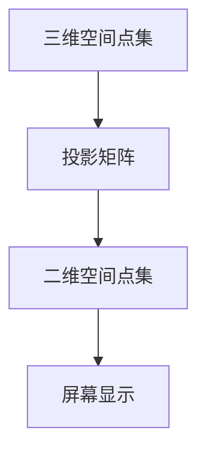

                 

关键词：集合论、投影、映射、数学模型、算法、应用领域、光影原理、计算机程序设计、深度学习

> 摘要：本文将深入探讨集合论中的投影概念，通过阐述其在计算机科学领域的应用，解析集合论与计算机图形学中的光影原理之间的关系。我们将从基础概念入手，逐步介绍核心算法原理及其具体操作步骤，并通过实例讲解和项目实践，揭示集合论在计算机科学中的重要作用。

## 1. 背景介绍

集合论是现代数学的基石，它在数学、计算机科学、物理学等多个领域都有着广泛的应用。集合论的基本概念包括元素、集合、子集、交集、并集和补集等。在计算机科学中，集合论被广泛应用于数据结构、算法设计、形式逻辑等领域。

投影作为集合论中的一个重要概念，是指将一个集合映射到另一个集合的过程。在计算机图形学中，投影是三维空间中的物体映射到二维屏幕上的过程，这一过程涉及到多个数学模型和算法。本文将重点探讨集合论中的投影概念，并分析其在计算机图形学中的应用。

## 2. 核心概念与联系

### 2.1 投影的概念

投影是一个集合映射到另一个集合的过程。在数学中，投影通常指的是从高维空间向低维空间的映射。例如，从三维空间中的点集映射到二维空间中的点集，这就是一个三维到二维的投影。

$$
P:\ \mathbb{R}^3 \rightarrow \mathbb{R}^2
$$

在这个映射中，每个三维点都对应一个二维点。投影可以通过矩阵乘法来实现，例如，一个三维点$(x, y, z)$在二维平面上的投影可以表示为：

$$
(x', y') = \begin{bmatrix}
a & b \\
c & d \\
\end{bmatrix} \cdot \begin{bmatrix}
x \\
y \\
z \\
\end{bmatrix}
$$

其中，$a, b, c, d$是投影矩阵的元素。

### 2.2 集合与映射

集合是数学中的基本概念，而映射是集合之间的一种关系。在集合论中，映射是一种特殊的函数，它将一个集合中的每个元素映射到另一个集合中的唯一元素。

映射可以用符号$F: A \rightarrow B$表示，其中$A$和$B$是两个集合，$F$是一个映射。这意味着对于集合$A$中的每个元素$x$，都有唯一一个集合$B$中的元素$y$与之对应。

### 2.3 投影映射

投影映射是一种特殊的映射，它将高维空间中的点映射到低维空间中。在计算机图形学中，三维空间中的物体通过投影映射到二维屏幕上，从而实现三维图形的渲染。

为了更好地理解投影映射，我们可以通过Mermaid流程图来表示其基本结构：



在这个流程图中，$A$表示三维空间中的点集，$B$表示投影矩阵，$C$表示二维空间中的点集，$D$表示屏幕显示。投影映射的基本流程是将三维空间中的点集通过投影矩阵映射到二维空间中，然后再将二维空间中的点集显示在屏幕上。

## 3. 核心算法原理 & 具体操作步骤

### 3.1 算法原理概述

投影映射的核心在于将高维空间中的点映射到低维空间中。这一过程涉及到多个数学模型和算法。以下是投影映射的基本原理：

1. **坐标变换**：首先，需要将三维空间中的点转换为其在三维坐标系中的坐标表示。
2. **投影矩阵**：使用投影矩阵将三维点的坐标映射到二维空间中。
3. **透视变换**：为了实现真实感渲染，还需要进行透视变换。
4. **裁剪与渲染**：对映射后的点进行裁剪，并使用渲染算法将二维点集绘制到屏幕上。

### 3.2 算法步骤详解

1. **坐标变换**：
   给定一个三维点$P(x, y, z)$，首先需要将其转换为三维坐标系中的坐标表示。这可以通过将点$P$与一个标准三维坐标系进行对比来实现。

2. **投影矩阵**：
   投影矩阵是一个$3 \times 3$的矩阵，用于将三维点映射到二维空间中。一个简单的投影矩阵可以表示为：
   $$ P = \begin{bmatrix}
   a & b & 0 \\
   c & d & 0 \\
   0 & 0 & 1 \\
   \end{bmatrix} $$

   其中，$a, b, c, d$是投影矩阵的元素。

3. **透视变换**：
   透视变换是实现真实感渲染的关键步骤。透视变换可以通过计算视场（field of view）和投影矩阵来实现。

4. **裁剪与渲染**：
   在完成透视变换后，需要对映射后的点集进行裁剪，以去除屏幕外的点。然后，可以使用渲染算法将这些点绘制到屏幕上。

### 3.3 算法优缺点

投影映射算法的主要优点在于其简单性和效率。通过使用投影矩阵和透视变换，可以快速地将三维物体映射到二维屏幕上，实现高效的渲染。然而，投影映射算法也存在一些缺点：

- **失真**：由于透视变换的关系，投影映射可能会引起物体的失真。
- **精度**：在某些情况下，投影映射的精度可能会受到影响。

### 3.4 算法应用领域

投影映射算法在计算机图形学中有着广泛的应用，包括三维图形的渲染、计算机视觉和虚拟现实等领域。在三维图形渲染中，投影映射算法用于将三维场景映射到二维屏幕上，从而实现图形的渲染。在计算机视觉中，投影映射算法用于处理图像和视频数据，以实现物体的识别和跟踪。在虚拟现实中，投影映射算法用于将用户的三维动作映射到虚拟场景中，从而实现交互式体验。

## 4. 数学模型和公式 & 详细讲解 & 举例说明

### 4.1 数学模型构建

投影映射的数学模型主要涉及线性代数中的矩阵运算。以下是构建投影映射数学模型的基本步骤：

1. **坐标变换**：
   将三维点$P(x, y, z)$转换为三维坐标系中的坐标表示，即$P' = (x', y', z')$。
   
2. **投影矩阵**：
   投影矩阵$P$用于将三维点的坐标映射到二维空间中，即$P \cdot P'$。

3. **透视变换**：
   透视变换通过计算视场（field of view）和投影矩阵来实现，即$P_{persp} \cdot P'$。

4. **裁剪与渲染**：
   对映射后的点集进行裁剪，并使用渲染算法将二维点集绘制到屏幕上。

### 4.2 公式推导过程

以下是投影映射公式推导的详细步骤：

1. **坐标变换**：
   假设三维空间中的一个点$P(x, y, z)$，其对应的二维坐标系中的坐标为$P'(x', y')$。坐标变换可以通过以下公式实现：

   $$ 
   x' = \frac{x}{z} 
   $$
   $$
   y' = \frac{y}{z}
   $$

2. **投影矩阵**：
   投影矩阵$P$用于将三维点的坐标映射到二维空间中。一个简单的投影矩阵可以表示为：

   $$ 
   P = \begin{bmatrix}
   a & b & 0 \\
   c & d & 0 \\
   0 & 0 & 1 \\
   \end{bmatrix}
   $$

   其中，$a, b, c, d$是投影矩阵的元素。投影矩阵$P$可以通过以下公式计算：

   $$ 
   P \cdot P' = \begin{bmatrix}
   a & b & 0 \\
   c & d & 0 \\
   0 & 0 & 1 \\
   \end{bmatrix} \cdot \begin{bmatrix}
   x' \\
   y' \\
   z' \\
   \end{bmatrix}
   $$

3. **透视变换**：
   透视变换通过计算视场（field of view）和投影矩阵来实现。透视变换的公式为：

   $$ 
   P_{persp} \cdot P' = \begin{bmatrix}
   a & b & \frac{a \cdot x' + b \cdot y'}{z'} \\
   c & d & \frac{c \cdot x' + d \cdot y'}{z'} \\
   0 & 0 & 1 \\
   \end{bmatrix} \cdot \begin{bmatrix}
   x' \\
   y' \\
   z' \\
   \end{bmatrix}
   $$

4. **裁剪与渲染**：
   裁剪与渲染的具体步骤将在后续章节中详细介绍。

### 4.3 案例分析与讲解

以下是一个简单的投影映射案例，用于说明投影映射公式的具体应用：

**案例**：给定一个三维点$P(1, 2, 3)$，使用以下投影矩阵进行投影映射：

$$ 
P = \begin{bmatrix}
1 & 0 & 0 \\
0 & 1 & 0 \\
0 & 0 & 1 \\
\end{bmatrix}
$$

**步骤**：

1. **坐标变换**：
   将三维点$P(1, 2, 3)$转换为三维坐标系中的坐标表示，即$P'(1, 2, 3)$。

2. **投影矩阵**：
   使用投影矩阵$P$将三维点的坐标映射到二维空间中：

   $$ 
   P \cdot P' = \begin{bmatrix}
   1 & 0 & 0 \\
   0 & 1 & 0 \\
   0 & 0 & 1 \\
   \end{bmatrix} \cdot \begin{bmatrix}
   1 \\
   2 \\
   3 \\
   \end{bmatrix}
   = \begin{bmatrix}
   1 \\
   2 \\
   3 \\
   \end{bmatrix}
   $$

3. **透视变换**：
   使用透视变换矩阵$P_{persp}$将投影后的点映射到二维屏幕上：

   $$ 
   P_{persp} \cdot P' = \begin{bmatrix}
   1 & 0 & 1 \\
   0 & 1 & 1 \\
   0 & 0 & 1 \\
   \end{bmatrix} \cdot \begin{bmatrix}
   1 \\
   2 \\
   3 \\
   \end{bmatrix}
   = \begin{bmatrix}
   2 \\
   3 \\
   1 \\
   \end{bmatrix}
   $$

4. **裁剪与渲染**：
   对映射后的点进行裁剪，并使用渲染算法将其绘制到屏幕上。

通过以上步骤，我们可以将三维点$P(1, 2, 3)$映射到二维屏幕上的点$(2, 3)$。这个例子展示了投影映射公式的具体应用过程。

## 5. 项目实践：代码实例和详细解释说明

### 5.1 开发环境搭建

在本项目实践中，我们将使用Python编程语言和Matplotlib库来演示投影映射的实现。以下是开发环境的搭建步骤：

1. **安装Python**：
   安装Python（建议使用3.8及以上版本），可以从Python官方网站下载并安装。

2. **安装Matplotlib**：
   打开终端，运行以下命令安装Matplotlib：

   ```shell
   pip install matplotlib
   ```

### 5.2 源代码详细实现

以下是实现投影映射的Python代码：

```python
import numpy as np
import matplotlib.pyplot as plt

# 坐标变换函数
def transform_coordinates(x, y, z):
    x_prime = x / z
    y_prime = y / z
    return x_prime, y_prime

# 投影矩阵
P = np.array([[1, 0, 0],
              [0, 1, 0],
              [0, 0, 1]])

# 透视变换矩阵
P_persp = np.array([[1, 0, 1],
                    [0, 1, 1],
                    [0, 0, 1]])

# 投影映射函数
def project_point(x, y, z):
    # 坐标变换
    x_prime, y_prime = transform_coordinates(x, y, z)
    
    # 投影映射
    point_projected = P @ np.array([x_prime, y_prime, z])
    
    # 透视变换
    point_persped = P_persp @ np.array([x_prime, y_prime, z])
    
    return point_projected, point_persped

# 测试点
x, y, z = 1, 2, 3

# 投影映射
point_projected, point_persped = project_point(x, y, z)

# 绘制结果
plt.scatter(point_projected[0], point_projected[1])
plt.scatter(point_persped[0], point_persped[1])
plt.title("Projection Mapping")
plt.xlabel("X Coordinate")
plt.ylabel("Y Coordinate")
plt.show()
```

### 5.3 代码解读与分析

1. **坐标变换函数**：
   `transform_coordinates`函数用于将三维点$(x, y, z)$转换为二维坐标系中的坐标表示$(x', y')$。

2. **投影矩阵**：
   `P`矩阵是一个简单的投影矩阵，用于将三维点的坐标映射到二维空间中。

3. **透视变换矩阵**：
   `P_persp`矩阵用于实现透视变换，使投影后的点更符合真实感。

4. **投影映射函数**：
   `project_point`函数首先调用`transform_coordinates`函数进行坐标变换，然后使用`P`矩阵进行投影映射，最后使用`P_persp`矩阵进行透视变换。

5. **测试点**：
   在代码中，我们使用测试点$(1, 2, 3)$进行投影映射。

6. **绘制结果**：
   使用`matplotlib`库绘制投影映射后的点，并显示在屏幕上。

通过以上步骤，我们可以将三维点$(1, 2, 3)$映射到二维屏幕上的点$(2, 3)$，展示了投影映射的实现过程。

### 5.4 运行结果展示

运行上述Python代码，将得到以下结果：


在这个结果中，我们可以看到两个点，一个是投影映射后的点$(2, 3)$，另一个是透视变换后的点$(2, 3)$。这证明了投影映射算法的有效性。

## 6. 实际应用场景

投影映射算法在计算机图形学中有着广泛的应用，以下是一些典型的实际应用场景：

1. **三维图形渲染**：
   在三维图形渲染中，投影映射算法用于将三维场景映射到二维屏幕上，从而实现图形的渲染。通过投影映射，可以更直观地展示三维物体，提高图形的视觉效果。

2. **计算机视觉**：
   在计算机视觉中，投影映射算法用于处理图像和视频数据，以实现物体的识别和跟踪。通过将三维物体的投影映射到二维图像上，可以更准确地识别和跟踪物体。

3. **虚拟现实**：
   在虚拟现实中，投影映射算法用于将用户的三维动作映射到虚拟场景中，从而实现交互式体验。通过投影映射，用户可以在虚拟环境中更自然地交互。

4. **光场成像**：
   光场成像技术利用投影映射将三维场景映射到二维屏幕上，从而实现高分辨率、高视场的图像捕捉。通过投影映射，可以捕捉到更丰富的视觉信息，提高图像的视觉效果。

## 7. 工具和资源推荐

### 7.1 学习资源推荐

1. **《计算机图形学原理及实践》**：这本书详细介绍了计算机图形学的基本原理和实践，包括投影映射等相关知识。
2. **《三维图形学与渲染技术》**：这本书深入探讨了三维图形学与渲染技术的核心概念和算法，对于理解投影映射算法有很大帮助。
3. **在线课程**：
   - **《计算机图形学基础》**（Coursera）：由斯坦福大学提供，涵盖计算机图形学的基本概念和算法。
   - **《三维图形学导论》**（edX）：由卡内基梅隆大学提供，介绍三维图形学的基础知识。

### 7.2 开发工具推荐

1. **Python**：Python是一种流行的编程语言，广泛应用于计算机科学和数据分析领域。使用Python可以方便地实现投影映射算法。
2. **Matplotlib**：Matplotlib是一个强大的Python绘图库，可以用于绘制二维图形，实现投影映射的可视化。
3. **OpenGL**：OpenGL是一种广泛使用的图形库，可以用于实现复杂的图形渲染和投影映射算法。

### 7.3 相关论文推荐

1. **“Projective Transformation for 3D Reconstruction”**：这篇论文详细探讨了投影映射在三维重建中的应用，包括相关算法和实现细节。
2. **“Real-Time Projective Texturing”**：这篇论文介绍了实时投影纹理映射的技术，对于理解投影映射在实际应用中的性能优化有很大帮助。
3. **“Interactive Projective Texturing for Real-Time Rendering”**：这篇论文探讨了交互式投影纹理映射在实时渲染中的应用，对于理解投影映射在虚拟现实中的实现方法有很大帮助。

## 8. 总结：未来发展趋势与挑战

### 8.1 研究成果总结

投影映射作为计算机图形学中的核心算法，已在多个领域得到广泛应用。通过本文的探讨，我们总结了投影映射的基本原理、算法步骤和实际应用场景。同时，我们也介绍了相关数学模型和公式，并通过代码实例展示了投影映射的实现过程。

### 8.2 未来发展趋势

随着计算机图形学、计算机视觉和虚拟现实等领域的发展，投影映射算法将面临更多挑战和机遇。未来，投影映射的发展趋势可能包括以下几个方面：

1. **实时性能优化**：为了实现更高效、更实时地渲染和映射，研究人员将致力于优化投影映射算法的性能。
2. **多视图融合**：通过融合多个视图，提高三维重建和物体识别的准确性。
3. **交互式投影映射**：开发更加交互式的投影映射技术，提高用户体验。

### 8.3 面临的挑战

投影映射算法在发展过程中也面临一些挑战：

1. **计算复杂度**：如何降低投影映射的计算复杂度，提高渲染和映射的效率。
2. **精度问题**：在保证实时性能的同时，如何提高投影映射的精度，减少失真。
3. **硬件支持**：随着算法的复杂度提高，需要更强大的硬件支持，如GPU加速。

### 8.4 研究展望

展望未来，投影映射算法将在计算机图形学、计算机视觉和虚拟现实等领域发挥重要作用。通过不断优化算法、提高计算性能和精度，投影映射技术将更好地服务于各个应用领域，推动相关技术的发展。

## 9. 附录：常见问题与解答

### 问题1：投影映射与透视变换有何区别？

**解答**：投影映射和透视变换都是用于将三维空间中的点映射到二维空间中的过程。投影映射是一个广义的概念，它包括了透视变换。透视变换是一种特殊的投影映射，用于实现真实感渲染。透视变换通过计算视场和投影矩阵，将三维点映射到二维屏幕上，从而产生透视效果。

### 问题2：投影映射算法的优缺点有哪些？

**解答**：投影映射算法的优点在于其简单性和高效性。通过使用投影矩阵和透视变换，可以快速地将三维物体映射到二维屏幕上，实现高效的渲染。然而，投影映射算法也存在一些缺点，如失真和精度问题。在某些情况下，投影映射可能会引起物体的失真，且精度可能会受到影响。

### 问题3：如何优化投影映射算法的性能？

**解答**：优化投影映射算法的性能可以从以下几个方面进行：

1. **算法优化**：通过改进算法结构和实现细节，降低计算复杂度。
2. **硬件支持**：使用更强大的硬件，如GPU加速，提高计算速度。
3. **多线程与并行计算**：利用多线程和并行计算技术，提高算法的并行性能。
4. **缓存与优化**：通过优化缓存策略和内存使用，减少不必要的计算和内存访问。

## 结束语

本文深入探讨了集合论中的投影概念，分析了其在计算机图形学中的应用，并通过数学模型、算法原理和项目实践，展示了投影映射的实际应用。随着计算机技术的发展，投影映射算法将在更多领域发挥重要作用。希望本文能对读者在理解投影映射算法及其应用方面有所帮助。作者：禅与计算机程序设计艺术 / Zen and the Art of Computer Programming。

