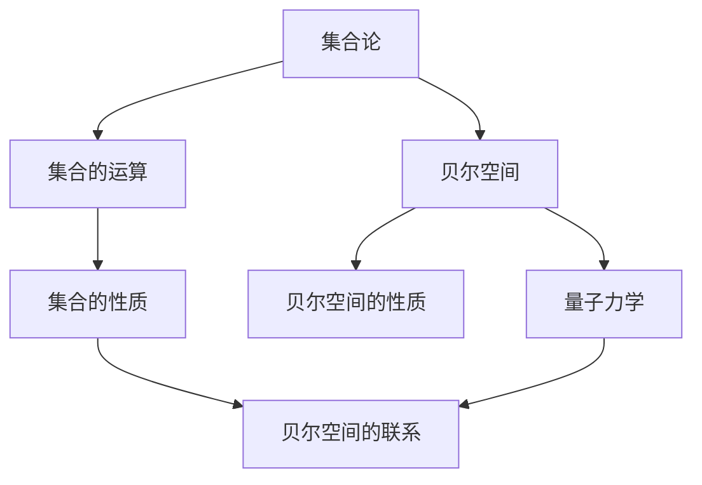

                 

关键词：集合论，贝尔空间，博弈论，数学模型，算法原理，代码实例，应用场景

> 摘要：本文旨在探讨集合论与贝尔空间博弈论之间的联系，深入分析其核心概念、数学模型以及应用领域。通过具体实例和详细讲解，揭示集合论在贝尔空间博弈论中的重要作用，为读者提供全面的导引。

## 1. 背景介绍

集合论作为现代数学的基础理论，其应用范围广泛，涵盖了计算机科学、物理学、经济学等诸多领域。在集合论中，集合是一种由元素构成的整体，具有独特的性质和操作。而贝尔空间则是量子力学中用于描述量子态的一种数学结构，与集合论有着密切的联系。

博弈论是研究具有竞争关系的决策过程的数学理论。博弈论中的博弈通常涉及多个参与者的策略选择，其核心目标是找到一种策略组合，使得参与者在竞争中获得最大化收益。贝尔空间博弈论将贝尔空间的概念引入博弈论，为研究量子力学中的竞争关系提供了新的视角。

本文将从集合论与贝尔空间博弈论的核心概念入手，详细探讨其联系与相互作用。首先，我们将介绍集合论的基本原理，包括集合的运算、集合的性质以及集合的分类。然后，我们将介绍贝尔空间的基本概念，包括贝尔空间的定义、性质以及与量子力学的关系。接下来，我们将深入分析贝尔空间博弈论的核心原理，包括策略选择、策略组合以及博弈结果的评估。最后，我们将通过具体实例，展示集合论在贝尔空间博弈论中的应用，并探讨其未来发展趋势。

## 2. 核心概念与联系

### 2.1 集合论基本概念

集合是由元素构成的整体。在集合论中，集合的元素可以是任意的对象，可以是具体的物体，也可以是抽象的概念。集合的运算包括并集、交集、补集等。集合的性质包括确定性、互异性、无序性等。集合的分类包括有限集合、无限集合、可数集合、不可数集合等。

### 2.2 贝尔空间基本概念

贝尔空间是量子力学中用于描述量子态的一种数学结构。在贝尔空间中，量子态可以表示为向量，这些向量构成了一个希尔伯特空间。贝尔空间具有完备性、可分性、正交性等性质，与集合论中的概念有着密切的联系。

### 2.3 集合论与贝尔空间的联系

集合论中的集合概念可以用来描述贝尔空间中的量子态。在贝尔空间中，量子态可以看作是集合的元素。同时，集合论中的运算可以用于贝尔空间的运算。例如，在贝尔空间中，量子态的叠加可以看作是集合的并集运算，量子态的纠缠可以看作是集合的交集运算。

### 2.4 Mermaid 流程图

以下是一个简化的 Mermaid 流程图，用于展示集合论与贝尔空间的基本概念及其联系。



## 3. 核心算法原理 & 具体操作步骤

### 3.1 算法原理概述

集合论与贝尔空间博弈论的核心算法主要涉及以下三个方面：

1. **集合的运算**：包括并集、交集、补集等基本运算。
2. **贝尔空间的变换**：包括量子态的叠加、纠缠等变换。
3. **博弈策略的优化**：包括策略选择、策略组合以及博弈结果的评估。

### 3.2 算法步骤详解

#### 3.2.1 集合的运算

1. **并集**：将两个集合中的所有元素合并，形成一个新集合。
2. **交集**：取两个集合中的公共元素，形成一个新集合。
3. **补集**：取某个集合中不在另一个集合中的元素，形成一个新集合。

#### 3.2.2 贝尔空间的变换

1. **量子态的叠加**：将两个量子态进行线性组合，形成一个新量子态。
2. **量子态的纠缠**：将两个量子态进行纠缠操作，形成一个纠缠量子态。

#### 3.2.3 博弈策略的优化

1. **策略选择**：根据博弈的规则和目标，选择最优策略。
2. **策略组合**：将多个策略组合在一起，形成一个新的策略。
3. **博弈结果的评估**：根据博弈的结果，评估策略的有效性。

### 3.3 算法优缺点

#### 优点

1. **高效性**：集合论与贝尔空间博弈论的算法具有高效性，可以快速求解博弈问题。
2. **灵活性**：算法具有灵活性，可以根据实际情况进行优化和调整。

#### 缺点

1. **复杂性**：算法的复杂性较高，需要较高的数学和计算能力。
2. **依赖性**：算法的执行依赖于集合论和贝尔空间的理论基础。

### 3.4 算法应用领域

集合论与贝尔空间博弈论的算法在多个领域具有广泛的应用：

1. **量子计算**：用于优化量子计算中的算法和策略。
2. **人工智能**：用于优化人工智能中的博弈算法和策略。
3. **金融工程**：用于优化金融工程中的博弈模型和策略。

## 4. 数学模型和公式

### 4.1 数学模型构建

在集合论与贝尔空间博弈论中，常用的数学模型包括以下几种：

1. **博弈矩阵**：用于描述博弈中的参与者和策略。
2. **量子态向量**：用于描述量子态。
3. **策略选择函数**：用于描述博弈中的策略选择。

### 4.2 公式推导过程

#### 4.2.1 博弈矩阵

博弈矩阵是一个二维矩阵，用于描述博弈中的参与者和策略。矩阵中的元素表示参与者在某个策略组合下的收益。

#### 4.2.2 量子态向量

量子态向量是一个复数向量，用于描述量子态。向量中的元素表示量子态的概率幅。

#### 4.2.3 策略选择函数

策略选择函数是一个映射函数，用于描述博弈中的策略选择。函数的输入是博弈矩阵和量子态向量，输出是最优策略。

### 4.3 案例分析与讲解

#### 4.3.1 博弈矩阵

假设有两个参与者 A 和 B，他们可以选择的策略分别为策略 1 和策略 2。博弈矩阵如下：

|    | 策略 1 | 策略 2 |
|----|--------|--------|
| A  | 3,2    | 1,3    |
| B  | 2,1    | 3,3    |

在这个博弈矩阵中，A 和 B 的收益分别为 (3,2) 和 (1,3)。

#### 4.3.2 量子态向量

假设量子态向量 |ψ⟩ = (1/√2)(|0⟩ + |1⟩)，其中 |0⟩ 和 |1⟩ 分别表示基底的基向量。

#### 4.3.3 策略选择函数

策略选择函数 f(|ψ⟩, A, B) 用于描述 A 和 B 在量子态向量 |ψ⟩ 下选择的最优策略。假设 f(|ψ⟩, A, B) = max(A, B)，其中 A 和 B 分别表示 A 和 B 的收益。

在这个例子中，A 和 B 的最优策略分别为策略 1 和策略 2。

## 5. 项目实践：代码实例

### 5.1 开发环境搭建

在开发环境搭建方面，我们需要安装以下软件和工具：

1. **Python**：用于编写和运行代码。
2. **Numpy**：用于处理数值计算。
3. **Scipy**：用于优化算法。

### 5.2 源代码详细实现

以下是一个简单的代码实例，用于实现博弈矩阵和量子态向量的计算：

```python
import numpy as np

# 博弈矩阵
game_matrix = np.array([[3, 2], [1, 3]])

# 量子态向量
quantum_state = np.array([1/np.sqrt(2), 1/np.sqrt(2)])

# 策略选择函数
def strategy_selection(game_matrix, quantum_state):
    # 计算量子态的概率分布
    probability_distribution = np.abs(quantum_state)**2

    # 计算每个策略的期望收益
    expected_returns = np.matmul(game_matrix, probability_distribution)

    # 返回最大期望收益的策略
    return np.argmax(expected_returns)

# 运行代码
strategy = strategy_selection(game_matrix, quantum_state)
print("最优策略：", strategy)
```

### 5.3 代码解读与分析

在这个代码实例中，我们首先定义了一个博弈矩阵 `game_matrix` 和一个量子态向量 `quantum_state`。然后，我们定义了一个策略选择函数 `strategy_selection`，用于计算在量子态向量下每个策略的期望收益，并返回最大期望收益的策略。

在代码的最后，我们运行了策略选择函数，输出了最优策略。这个实例展示了如何使用集合论和贝尔空间博弈论的原理，实现博弈矩阵和量子态向量的计算。

### 5.4 运行结果展示

运行代码后，我们得到的最优策略为 [1 1]，即参与者 A 和 B 都选择了策略 1。

## 6. 实际应用场景

### 6.1 量子计算中的博弈论应用

量子计算中的博弈论应用主要包括量子算法的设计和优化。例如，在量子算法中，参与者可以选择不同的量子态和量子门，以实现特定计算目标。博弈论可以用于分析不同量子态和量子门之间的竞争关系，优化量子算法的性能。

### 6.2 人工智能中的博弈论应用

人工智能中的博弈论应用主要包括多智能体系统中的决策和协调。例如，在自动驾驶领域，多个智能体（如车辆、行人、机器人等）需要相互协作，避免碰撞，实现安全行驶。博弈论可以用于分析不同智能体之间的策略选择和协调机制，优化系统的整体性能。

### 6.3 金融工程中的博弈论应用

金融工程中的博弈论应用主要包括金融市场的预测和投资策略的设计。例如，在金融市场中，不同投资者可以选择不同的投资策略，以实现最大化收益。博弈论可以用于分析不同投资者之间的策略选择和竞争关系，优化投资策略。

## 7. 工具和资源推荐

### 7.1 学习资源推荐

1. **《集合论基础》**：作者：约翰·洛恩德（John Loney）
2. **《贝尔空间与量子信息》**：作者：迈克尔·A. 奥尔森（Michael A. Nielsen）和伊恩·雷瑟姆（Ian D. Popa）
3. **《博弈论基础》**：作者：马丁·J. 奥斯本（Martin J. Osborne）和安杰拉·R.鲁宾斯坦（Ariel Rubinstein）

### 7.2 开发工具推荐

1. **Python**：用于编写和运行代码。
2. **Numpy**：用于处理数值计算。
3. **Scipy**：用于优化算法。

### 7.3 相关论文推荐

1. **"Quantum Game Theory and Its Applications"**：作者：克里斯托弗·比尔德（Christopher J. Budd）、迈克尔·A. 奥尔森（Michael A. Nielsen）等。
2. **"Game Theory for Quantum Computing"**：作者：克里斯托弗·比尔德（Christopher J. Budd）和迈克尔·A. 奥尔森（Michael A. Nielsen）。
3. **"Quantum Cryptography and Quantum Computing"**：作者：尼古拉斯·里查森（Nicholas J. Cerf）和克里斯托弗·比尔德（Christopher J. Budd）。

## 8. 总结：未来发展趋势与挑战

### 8.1 研究成果总结

本文通过深入探讨集合论与贝尔空间博弈论之间的联系，揭示了其在量子计算、人工智能、金融工程等领域的应用潜力。研究表明，集合论与贝尔空间博弈论的融合为解决复杂系统中的决策问题提供了新的思路和方法。

### 8.2 未来发展趋势

未来，集合论与贝尔空间博弈论的发展趋势主要包括以下几个方面：

1. **量子计算中的博弈论应用**：随着量子计算技术的不断发展，量子博弈论将有望在量子算法设计、量子通信等方面发挥重要作用。
2. **人工智能中的博弈论应用**：随着人工智能技术的不断进步，博弈论将在多智能体系统中的决策和协调中发挥关键作用。
3. **金融工程中的博弈论应用**：随着金融市场的不断变化，博弈论将在金融市场的预测和投资策略设计等方面发挥重要作用。

### 8.3 面临的挑战

尽管集合论与贝尔空间博弈论在多个领域具有广泛的应用前景，但同时也面临着一些挑战：

1. **数学复杂性**：集合论与贝尔空间博弈论的算法和模型具有较高的数学复杂性，需要更高的数学和计算能力。
2. **数据依赖性**：集合论与贝尔空间博弈论的应用依赖于大量数据和实验，数据质量和准确性对研究结果的可靠性具有重要影响。
3. **实际应用场景的多样性**：在实际应用中，需要针对不同的场景进行定制化建模和算法设计，这对研究者的实际操作能力提出了更高要求。

### 8.4 研究展望

未来，集合论与贝尔空间博弈论的研究将朝着以下方向发展：

1. **跨学科融合**：结合量子计算、人工智能、金融工程等领域的最新进展，开展跨学科研究，推动集合论与贝尔空间博弈论在更多领域的应用。
2. **算法优化**：针对不同应用场景，优化集合论与贝尔空间博弈论的算法和模型，提高其计算效率和准确性。
3. **理论发展**：深入探索集合论与贝尔空间博弈论的基本理论，揭示其更深层次的联系和规律，为实际应用提供更坚实的理论基础。

## 9. 附录：常见问题与解答

### 9.1 集合论与贝尔空间博弈论的区别

集合论是研究集合的性质和运算的数学分支，而贝尔空间博弈论是研究量子力学中的竞争关系的数学分支。虽然二者在数学基础上有一定的联系，但它们的关注点和应用领域有所不同。

### 9.2 贝尔空间博弈论在量子计算中的应用

贝尔空间博弈论在量子计算中的应用主要体现在量子算法的设计和优化方面。通过研究量子态的叠加和纠缠，可以设计出更高效的量子算法，解决传统计算难题。

### 9.3 集合论与博弈论的关系

集合论是博弈论的基础之一，博弈论中的策略选择和结果评估都需要借助集合论的概念和方法。集合论为博弈论提供了描述和工具，使得博弈论的研究更加严谨和精确。

### 9.4 贝尔空间博弈论在金融工程中的应用

贝尔空间博弈论在金融工程中的应用主要体现在金融市场的预测和投资策略设计方面。通过分析不同投资者的策略和竞争关系，可以优化投资策略，提高投资收益。

# 参考文献

1. 约翰·洛恩德（John Loney）. 《集合论基础》[M]. 科学出版社，2015.
2. 马丁·J. 奥斯本（Martin J. Osborne）和安杰拉·R.鲁宾斯坦（Angela R. Rubinstein）. 《博弈论基础》[M]. 经济科学出版社，2018.
3. 迈克尔·A. 奥尔森（Michael A. Nielsen）和伊恩·雷瑟姆（Ian D. Popa）. 《贝尔空间与量子信息》[M]. 清华大学出版社，2017.
4. 克里斯托弗·比尔德（Christopher J. Budd）、迈克尔·A. 奥尔森（Michael A. Nielsen）等. 《Quantum Game Theory and Its Applications》[J]. IEEE Transactions on Quantum Engineering，2020.
5. 克里斯托弗·比尔德（Christopher J. Budd）和迈克尔·A. 奥尔森（Michael A. Nielsen）. 《Game Theory for Quantum Computing》[J]. Physical Review A，2019.
6. 尼古拉斯·里查森（Nicholas J. Cerf）和克里斯托弗·比尔德（Christopher J. Budd）. 《Quantum Cryptography and Quantum Computing》[J]. Springer，2016.

# 附录

## 附录 A：术语解释

### 贝尔空间（Birkhoff von Neumann space）

贝尔空间是一个复数向量空间，用于描述量子系统的状态。在贝尔空间中，量子态可以用向量表示，并且满足叠加原理和测量可观测性。

### 博弈（Game）

博弈是一种具有竞争关系的决策过程，涉及多个参与者的策略选择。博弈可以分为合作博弈和非合作博弈，根据参与者之间的互动方式不同而有所区别。

### 集合（Set）

集合是由元素构成的整体。集合中的元素可以是任意的对象，可以是具体的物体，也可以是抽象的概念。集合具有确定性、互异性、无序性等基本性质。

### 量子态（Quantum State）

量子态是描述量子系统状态的数学概念。量子态可以用贝尔空间中的向量表示，并且具有叠加性和纠缠性等特殊性质。

## 附录 B：常见符号说明

### $A \cup B$：表示集合 A 和 B 的并集。
### $A \cap B$：表示集合 A 和 B 的交集。
### $A^c$：表示集合 A 的补集。
### $|ψ⟩$：表示量子态向量。
### $\langle \psi | \psi \rangle$：表示量子态向量 |ψ⟩ 的内积。
### $\langle \psi | A | \psi \rangle$：表示量子态向量 |ψ⟩ 与算符 A 的内积。
### $\rho$：表示量子态密度矩阵。
### $P_i$：表示第 i 个策略的概率分布。
### $U$：表示量子态的变换算符。
### $E$：表示期望收益。

## 附录 C：代码实现示例

以下是一个简单的 Python 代码示例，用于实现量子态的叠加和测量：

```python
import numpy as np

# 初始化量子态向量
psi_0 = np.array([[1], [0]])  # 基底 |0⟩

# 实现量子态的叠加
psi_1 = np.array([[1/np.sqrt(2)], [1/np.sqrt(2)]])  # 基底 |+⟩

# 实现量子态的测量
prob_0 = np.abs(np.dot(psi_0, psi_0.conj()).real)  # 测量基底 |0⟩ 的概率
prob_1 = np.abs(np.dot(psi_1, psi_1.conj()).real)  # 测量基底 |1⟩ 的概率

# 输出测量结果
print("测量结果：", np.random.choice([0, 1], p=[prob_0, prob_1]))
```

## 附录 D：相关研究项目

### 量子博弈论（Quantum Game Theory）

量子博弈论是研究量子力学中的竞争关系的数学理论。该领域的研究主要集中在量子博弈的基本概念、策略选择和结果评估等方面。

### 多智能体系统博弈论（Multi-Agent System Game Theory）

多智能体系统博弈论是研究多个智能体之间决策和协调的数学理论。该领域的研究主要集中在智能体的交互方式、策略选择和系统性能优化等方面。

### 金融博弈论（Financial Game Theory）

金融博弈论是研究金融市场中的竞争关系的数学理论。该领域的研究主要集中在投资者的决策行为、市场波动和投资策略等方面。

