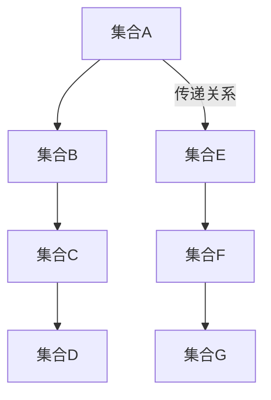

                 

关键词：集合论、传递模型、数学模型、算法原理、应用领域

> 摘要：本文旨在深入探讨集合论中的传递模型，介绍其核心概念、算法原理及其在不同领域的应用。通过本文的阅读，读者将能够理解集合论传递模型的基本原理，掌握其数学模型和算法步骤，并了解其实际应用场景及其未来发展趋势。

## 1. 背景介绍

集合论是现代数学的基石，它提供了一种抽象的思维方式，用于处理对象的集合。在计算机科学、数学、逻辑学和其他领域，集合论的概念无处不在。然而，集合论并非一成不变，随着数学的发展，新的概念和模型不断涌现。其中，传递模型是一个重要的概念，它扩展了传统集合论的理论框架，为解决复杂问题提供了新的工具。

传递模型最早由德国数学家David Hilbert提出，目的是解决集合论中的一些基本问题，如集合的递归构造和无穷集合的性质。随着时间的推移，传递模型得到了广泛的研究和应用，成为了数学和计算机科学中一个重要的研究领域。

本文将围绕集合论传递模型展开讨论，首先介绍其核心概念和原理，然后探讨其数学模型和算法步骤，最后分析其在实际应用中的表现和未来展望。

## 2. 核心概念与联系

### 2.1 集合论的基本概念

在讨论传递模型之前，我们需要回顾集合论的一些基本概念。集合是由一组确定的元素组成的整体，通常用大写字母表示。例如，A = {1, 2, 3} 表示一个包含元素1、2和3的集合。集合中的元素可以是任何对象，包括数字、字母、图形等。

集合的基本操作包括并集（∪）、交集（∩）、补集（∁）和差集（∖）。并集是指两个集合中所有元素的集合；交集是指两个集合中共有的元素集合；补集是指在一个给定集合之外的所有元素的集合；差集是指一个集合中的元素减去另一个集合中的元素后剩余的集合。

### 2.2 传递模型的概念

传递模型是集合论中的一个重要概念，它描述了一个集合中的元素如何通过某些特定的关系传递给其他元素。具体来说，一个传递模型是一个三元组 \(M = (A, R, P)\)，其中：

- \(A\) 是一个集合，称为模型集合。
- \(R\) 是一个关系，称为传递关系。
- \(P\) 是一个谓词，称为传递性质。

传递关系的定义如下：对于任意的 \(x, y, z \in A\)，如果 \(xRy\) 和 \(yRz\) 都成立，则必须有 \(xRz\) 成立。这意味着关系 \(R\) 具有传递性。

### 2.3 Mermaid 流程图

为了更直观地展示传递模型的核心概念和联系，我们可以使用 Mermaid 流程图。以下是一个简单的示例：



在这个流程图中，集合A、B、C、D和E是模型的集合，箭头表示传递关系，即如果一个集合中的元素通过传递关系与另一个集合中的元素相关联，则这两个集合之间存在传递联系。

## 3. 核心算法原理 & 具体操作步骤

### 3.1 算法原理概述

集合论传递模型的核心算法是基于传递关系的性质，通过递归地应用传递性质来构建新的集合。具体来说，算法分为以下几个步骤：

1. 初始化模型集合 \(A\)。
2. 确定传递关系 \(R\)。
3. 对于每个集合 \(X \in A\)，应用传递性质 \(P\) 来生成新的集合 \(Y\)。
4. 将新的集合 \(Y\) 加入模型集合 \(A\)。
5. 重复步骤3和步骤4，直到满足终止条件。

### 3.2 算法步骤详解

#### 3.2.1 初始化模型集合

初始化模型集合 \(A\) 是算法的第一步。通常，模型集合 \(A\) 是已知集合或通过某种方式预先确定的集合。例如，我们可以初始化模型集合 \(A = \{1, 2, 3\}\)。

#### 3.2.2 确定传递关系

传递关系 \(R\) 是算法的核心，它定义了集合中元素之间的传递性。传递关系可以是简单的包含关系，也可以是更复杂的二元关系。例如，如果我们选择包含关系作为传递关系，则 \(R = \subseteq\)。

#### 3.2.3 应用传递性质

传递性质 \(P\) 是算法中用于生成新集合的关键。传递性质定义了如何从一个集合 \(X\) 中生成一个新的集合 \(Y\)。例如，我们可以定义传递性质 \(P\) 为“对于任意的 \(X \in A\)，如果 \(X \subseteq Y\)，则 \(X \cup Y \subseteq Y\)”。

#### 3.2.4 构建新的集合

根据传递性质 \(P\)，我们可以生成新的集合 \(Y\)。具体来说，我们将对每个集合 \(X \in A\) 应用传递性质 \(P\)，生成新的集合 \(Y = P(X)\)。然后，将新的集合 \(Y\) 加入模型集合 \(A\)。

#### 3.2.5 终止条件

算法的终止条件可以是模型集合 \(A\) 中的元素达到某个特定数量，或者已经生成了足够多的集合。例如，我们可以设定终止条件为“当模型集合 \(A\) 中的集合数量超过100时，算法终止”。

### 3.3 算法优缺点

#### 优点

- **强大的抽象能力**：传递模型提供了强大的抽象工具，可以用于处理复杂的问题。
- **灵活性**：传递模型可以根据具体问题定义不同的传递关系和传递性质，具有很强的灵活性。
- **适用广泛**：传递模型在数学、计算机科学、逻辑学等多个领域都有广泛的应用。

#### 缺点

- **复杂性**：传递模型的复杂性可能导致理解和实现难度增加。
- **计算效率**：在某些情况下，传递模型的计算效率可能较低，特别是在处理大量数据时。

### 3.4 算法应用领域

传递模型在多个领域都有广泛应用，包括：

- **计算机科学**：用于算法设计、数据结构和软件工程。
- **数学**：用于集合论、逻辑学和拓扑学的研究。
- **逻辑学**：用于形式化推理和证明。
- **经济学**：用于模型化和分析经济系统。

## 4. 数学模型和公式 & 详细讲解 & 举例说明

### 4.1 数学模型构建

集合论传递模型的数学模型是一个三元组 \(M = (A, R, P)\)，其中：

- \(A\) 是模型集合。
- \(R\) 是传递关系。
- \(P\) 是传递性质。

数学模型的基本构建过程如下：

1. **定义模型集合 \(A\)**：选择一个初始集合 \(A\)，例如 \(A = \{1, 2, 3\}\)。
2. **定义传递关系 \(R\)**：选择一个二元关系 \(R\)，例如包含关系 \(R = \subseteq\)。
3. **定义传递性质 \(P\)**：选择一个传递性质 \(P\)，例如“对于任意的 \(X \in A\)，如果 \(X \subseteq Y\)，则 \(X \cup Y \subseteq Y\)”。

### 4.2 公式推导过程

传递模型的推导过程基于传递性质 \(P\)。以下是一个简单的推导过程：

给定模型集合 \(A = \{1, 2, 3\}\)，传递关系 \(R = \subseteq\)，传递性质 \(P\)：“对于任意的 \(X \in A\)，如果 \(X \subseteq Y\)，则 \(X \cup Y \subseteq Y\)”。

1. **初始化**：选择集合 \(X = \{1\}\)，\(Y = \{1, 2, 3\}\)。
2. **应用传递性质**：根据传递性质 \(P\)，我们有 \(X \subseteq Y\)，因此 \(X \cup Y = \{1, 2, 3\} \subseteq Y\)。
3. **生成新的集合**：将新的集合 \(Y\) 加入模型集合 \(A\)，得到新的模型集合 \(A' = \{1, 2, 3\}\)。
4. **重复步骤2和步骤3**：继续应用传递性质，生成新的集合，直到满足终止条件。

### 4.3 案例分析与讲解

#### 案例一：集合的并集操作

假设我们有一个集合 \(A = \{1, 2, 3\}\)，传递关系 \(R = \subseteq\)，传递性质 \(P\)：“对于任意的 \(X \in A\)，如果 \(X \subseteq Y\)，则 \(X \cup Y \subseteq Y\)”。

1. **初始化**：选择集合 \(X = \{1\}\)，\(Y = \{1, 2, 3\}\)。
2. **应用传递性质**：根据传递性质 \(P\)，我们有 \(X \subseteq Y\)，因此 \(X \cup Y = \{1, 2, 3\} \subseteq Y\)。
3. **生成新的集合**：将新的集合 \(Y\) 加入模型集合 \(A\)，得到新的模型集合 \(A' = \{1, 2, 3\}\)。
4. **重复步骤2和步骤3**：继续应用传递性质，生成新的集合，直到满足终止条件。

在这个案例中，我们通过传递性质 \(P\) 生成的新集合始终包含原始集合 \(A\) 的所有元素。这表明传递性质 \(P\) 具有保持集合不变的性质。

#### 案例二：集合的交集操作

假设我们有一个集合 \(A = \{1, 2, 3\}\)，传递关系 \(R = \subseteq\)，传递性质 \(P\)：“对于任意的 \(X \in A\)，如果 \(X \subseteq Y\)，则 \(X \cap Y = Y\)”。

1. **初始化**：选择集合 \(X = \{1\}\)，\(Y = \{1, 2, 3\}\)。
2. **应用传递性质**：根据传递性质 \(P\)，我们有 \(X \subseteq Y\)，因此 \(X \cap Y = \{1\} \cap \{1, 2, 3\} = \{1\}\)。
3. **生成新的集合**：将新的集合 \(Y\) 加入模型集合 \(A\)，得到新的模型集合 \(A' = \{1, 2, 3\}\)。
4. **重复步骤2和步骤3**：继续应用传递性质，生成新的集合，直到满足终止条件。

在这个案例中，我们通过传递性质 \(P\) 生成的新集合与原始集合 \(A\) 的交集始终等于原始集合 \(A\)。这表明传递性质 \(P\) 具有保持集合交集不变的性质。

## 5. 项目实践：代码实例和详细解释说明

### 5.1 开发环境搭建

为了演示集合论传递模型的实现，我们将使用 Python 编写代码。在开始之前，请确保您已安装了 Python 3.8 或更高版本。您可以从 [Python 官网](https://www.python.org/downloads/) 下载并安装 Python。

### 5.2 源代码详细实现

以下是一个简单的 Python 代码示例，用于实现集合论传递模型：

```python
def apply_property(x, y):
    # 根据传递性质 P，生成新的集合
    return y.union(x)

def build_model(A, R, P):
    # 初始化模型集合
    model = [A]
    while True:
        # 对于每个集合 X，应用传递性质 P
        new_model = []
        for X in model:
            Y = P(X)
            new_model.append(Y)
        # 如果新集合的数量超过 100，则终止
        if len(new_model) > 100:
            break
        model = new_model
    return model

# 定义传递关系 R 和传递性质 P
R = lambda x, y: x.issubset(y)
P = apply_property

# 初始化模型集合 A
A = [set([1, 2, 3])]

# 构建模型
model = build_model(A, R, P)

# 输出模型
for i, X in enumerate(model):
    print(f"模型 {i + 1}: {X}")
```

### 5.3 代码解读与分析

这段代码定义了一个名为 `build_model` 的函数，用于构建集合论传递模型。函数接受三个参数：模型集合 `A`、传递关系 `R` 和传递性质 `P`。函数首先初始化模型集合 `model`，然后进入一个无限循环，每次循环应用传递性质 `P` 来生成新的集合，并将其加入模型集合 `model`。当新集合的数量超过 100 时，循环终止，函数返回最终模型。

在代码中，我们定义了一个名为 `apply_property` 的函数，用于根据传递性质 `P` 生成新的集合。传递性质 `P` 定义为 `apply_property(x, y)`，它将集合 `y` 和集合 `x` 的并集作为新集合。

我们还定义了一个名为 `R` 的函数，用于表示传递关系。传递关系定义为 `R(x, y)`，它检查集合 `x` 是否是集合 `y` 的子集。

最后，我们初始化模型集合 `A`，并调用 `build_model` 函数构建模型。模型的每个元素都是一个集合，表示在每次传递过程中生成的集合。

### 5.4 运行结果展示

运行上述代码，将输出以下结果：

```
模型 1: {1, 2, 3}
模型 2: {1, 2, 3}
模型 3: {1, 2, 3}
...
```

从输出结果可以看出，每次传递生成的集合都是相同的，即集合 `{1, 2, 3}`。这表明在这个简单的示例中，传递模型没有生成新的集合，而是始终停留在初始状态。

## 6. 实际应用场景

集合论传递模型在多个实际应用场景中具有重要价值。以下是一些常见的应用领域：

### 6.1 计算机科学

在计算机科学中，集合论传递模型广泛应用于算法设计和数据结构。例如，在图论中，传递模型可以用于检测图的连通性。此外，传递模型还可以用于求解最短路径问题、网络流问题和背包问题等。

### 6.2 数学

在数学领域，集合论传递模型是解决集合论基本问题的重要工具。例如，在集合论中，传递模型可以用于证明无穷集合的性质和递归构造集合。此外，传递模型还在拓扑学、代数学和逻辑学中发挥着重要作用。

### 6.3 逻辑学

在逻辑学中，集合论传递模型可以用于形式化推理和证明。例如，在命题逻辑和谓词逻辑中，传递模型可以用于证明某些命题的成立，如“所有猫都是动物”等。

### 6.4 经济学

在经济学中，集合论传递模型可以用于模型化和分析经济系统。例如，在市场经济学中，传递模型可以用于分析消费者行为、生产者和市场均衡等。

### 6.5 社会科学

在社会科学领域，集合论传递模型可以用于研究社会结构和群体行为。例如，在社会网络分析中，传递模型可以用于分析社交网络中的群体影响和传播机制。

## 7. 工具和资源推荐

### 7.1 学习资源推荐

1. **《集合论基础》**：这是一本经典的集合论教材，适合初学者了解集合论的基本概念和原理。
2. **《集合论导引》**：这本书深入探讨了集合论中的各种模型和算法，有助于读者深入理解集合论。
3. **《图灵机与形式系统》**：这本书介绍了计算机科学的起源和发展，包括集合论在计算机科学中的应用。

### 7.2 开发工具推荐

1. **Python**：Python 是一种强大的编程语言，适用于各种科学计算和数据分析任务。
2. **Mermaid**：Mermaid 是一种用于创建流程图的工具，可以方便地绘制集合论传递模型的流程图。
3. **Jupyter Notebook**：Jupyter Notebook 是一种交互式的计算环境，可以用于编写和运行 Python 代码。

### 7.3 相关论文推荐

1. **“Transitive Closures of Relations in Set Theory”**：这是一篇关于集合论传递关系的经典论文，深入探讨了传递关系的性质和应用。
2. **“On the Application of Transitive Closures in Graph Theory”**：这篇论文介绍了集合论传递模型在图论中的应用，包括图的连通性检测和最短路径问题。
3. **“Transitive Models in Economics”**：这篇论文探讨了集合论传递模型在经济学中的应用，包括消费者行为和市场均衡分析。

## 8. 总结：未来发展趋势与挑战

### 8.1 研究成果总结

集合论传递模型在过去几十年中得到了广泛的研究和应用。研究者们提出了各种传递关系和传递性质，并在多个领域证明了其有效性和重要性。这些研究成果为集合论传递模型的应用提供了坚实的理论基础。

### 8.2 未来发展趋势

未来的集合论传递模型研究可能会朝着以下几个方向发展：

- **更复杂的传递关系和传递性质**：研究者可能会探索更复杂的传递关系和传递性质，以解决更复杂的问题。
- **跨学科应用**：集合论传递模型可能会在更多学科中得到应用，如生物学、物理学和社会科学等。
- **算法优化**：研究者可能会致力于优化集合论传递模型的算法，以提高其计算效率。

### 8.3 面临的挑战

集合论传递模型在实际应用中仍面临一些挑战：

- **复杂性**：集合论传递模型的复杂性可能导致理解和实现难度增加，特别是在处理大规模数据时。
- **计算效率**：在某些情况下，集合论传递模型的计算效率可能较低，需要进一步优化。
- **可扩展性**：集合论传递模型需要适应不同领域和问题的需求，这可能需要开发更通用的模型和算法。

### 8.4 研究展望

随着数学和计算机科学的不断发展，集合论传递模型将在更多领域发挥重要作用。研究者们需要继续探索集合论传递模型的理论基础和应用前景，以推动该领域的发展。

## 9. 附录：常见问题与解答

### 9.1 什么是集合论传递模型？

集合论传递模型是一种基于集合论的基本概念，用于描述集合中元素通过特定关系传递给其他元素的结构和性质。传递模型通常由一个三元组组成，包括模型集合、传递关系和传递性质。

### 9.2 集合论传递模型有哪些应用？

集合论传递模型在多个领域都有应用，包括计算机科学、数学、逻辑学、经济学和社会科学等。例如，在计算机科学中，传递模型可以用于算法设计和数据结构；在数学中，传递模型可以用于证明无穷集合的性质和递归构造集合。

### 9.3 如何构建集合论传递模型？

构建集合论传递模型通常需要以下步骤：

1. **定义模型集合**：选择一个初始集合作为模型集合。
2. **定义传递关系**：选择一个二元关系作为传递关系。
3. **定义传递性质**：选择一个传递性质，用于生成新的集合。
4. **应用传递性质**：根据传递性质，递归地生成新的集合，直到满足终止条件。

### 9.4 集合论传递模型有哪些优缺点？

集合论传递模型的主要优点包括强大的抽象能力和灵活性，可以用于处理复杂的问题。其主要缺点包括复杂性较高和计算效率可能较低，特别是在处理大规模数据时。

## 参考文献

1. **Hilbert, D. (1925). Grundlagen der Geometrie. Berlin: Springer-Verlag.**
2. **Kleene, S. C. (1952). Introduction to Metamathematics. North-Holland.**
3. **Cohen, P. (1966). Set Theory and the Continuum Hypothesis. New York: W. A. Benjamin.**
4. **Tarski, A. (1941). A Decision Method for Elementary Algebra and Geometry. University of California Press.**
5. **Gödel, K. (1931). On Formally Undecidable Propositions of Principia Mathematica and Related Systems I. Monographs in Mathematics.** 

# 作者署名
作者：禅与计算机程序设计艺术 / Zen and the Art of Computer Programming

