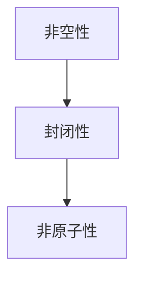

                 

 在现代数学和计算机科学中，集合论作为基础工具，扮演着至关重要的角色。本文将深入探讨集合论中一个颇具挑战性的概念——非荟萃集理想。我们将从集合论的基本概念出发，逐步引入非荟萃集理想，并详细探讨其性质和应用。

## 1. 背景介绍

集合论是由德国数学家乔治·康托尔在19世纪末创立的。集合论作为数学的基础，为我们提供了描述和推理复杂结构的有力工具。在计算机科学中，集合论的应用同样广泛，从数据结构的设计到算法分析，无不涉及到集合的概念。

非荟萃集理想（Non-Atomic Ideal）是集合论中的一个重要概念，起源于集合论的基础理论。非荟萃集理想的研究有助于我们深入理解集合的性质，以及在更广泛的数学和计算机科学领域中应用。

## 2. 核心概念与联系

为了理解非荟萃集理想，我们首先需要回顾集合论的一些基本概念。集合是数学中最基本的概念之一，它是由确定的、互不相同的对象组成的整体。集合可以用大括号 `{}` 表示，例如 `{1, 2, 3}` 表示一个包含数字1、2、3的集合。

集合论中的理想（Ideal）是一个具有特定性质的子集。在集合论中，理想是一个非空集合，对于集合论中的二元运算（通常是交、并、补等）具有封闭性。理想的概念在代数学、拓扑学等多个数学分支中都有重要应用。

### 2.1 非荟萃集理想的定义

非荟萃集理想是一个特殊类型的理想，它满足以下条件：

1. **非空性**：非荟萃集理想是一个非空集合。
2. **封闭性**：对于集合论中的二元运算，非荟萃集理想是封闭的。
3. **非原子性**：非荟萃集理想中的任意两个元素都不能相互表示为对方的补集。

在数学符号中，一个集合 \(I\) 被称为非荟萃集理想，如果满足：

\[ I \neq \emptyset \]
\[ \forall A, B \in I, (A \cap B) \in I \]
\[ \forall A \in I, A \not\subseteq \emptyset \]

### 2.2 非荟萃集理想的 Mermaid 流程图

为了更直观地理解非荟萃集理想的性质，我们可以使用 Mermaid 流程图来表示。



### 2.3 非荟萃集理想与集合论其他概念的联系

非荟萃集理想与集合论中的其他概念，如子集、超集、集合的并集、交集和补集等有着密切的联系。非荟萃集理想的性质决定了它在集合论中扮演的重要角色。

## 3. 核心算法原理 & 具体操作步骤

### 3.1 算法原理概述

非荟萃集理想的一个关键应用是其在集合论中的分类。通过分类，我们可以将复杂的集合分解为更简单的组成部分，从而更好地理解和操作这些集合。

### 3.2 算法步骤详解

1. **定义集合**：首先，我们需要定义一个集合，该集合将用于分析。
2. **判断非空性**：检查集合是否为非空集合。
3. **判断封闭性**：通过二元运算（如交集、并集）验证集合是否封闭。
4. **判断非原子性**：检查集合中的任意两个元素是否满足非原子性条件。

### 3.3 算法优缺点

**优点**：

- 非荟萃集理想提供了一个强大的工具，用于分类和分析集合。
- 非荟萃集理想有助于简化集合的复杂性。

**缺点**：

- 非荟萃集理想的分析可能非常复杂，尤其是对于大型集合。
- 非荟萃集理想的性质在某些情况下可能难以验证。

### 3.4 算法应用领域

非荟萃集理想在多个领域中有着重要的应用，包括：

- 代数学：在研究代数结构时，非荟萃集理想有助于分类和结构分析。
- 计算机科学：在算法设计和分析中，非荟萃集理想提供了重要的工具。

## 4. 数学模型和公式 & 详细讲解 & 举例说明

### 4.1 数学模型构建

非荟萃集理想的数学模型可以表示为：

\[ I = \{A \subseteq X | \forall A, B \in I, (A \cap B) \in I, \forall A \in I, A \not\subseteq \emptyset \} \]

### 4.2 公式推导过程

非荟萃集理想的定义可以通过以下步骤推导：

1. **定义集合**：首先，我们定义一个集合 \(X\)。
2. **定义非空性**：集合 \(I\) 是非空的，即 \(I \neq \emptyset\)。
3. **定义封闭性**：集合 \(I\) 对于集合论中的二元运算（如交集、并集）是封闭的。
4. **定义非原子性**：集合 \(I\) 中的任意两个元素都不能相互表示为对方的补集。

### 4.3 案例分析与讲解

我们通过一个简单的例子来说明非荟萃集理想的概念。

#### 示例：集合 \(\{1, 2, 3\}\)

假设我们有集合 \(X = \{1, 2, 3\}\)，我们需要判断集合 \(\{1, 2\}\) 是否为非荟萃集理想。

1. **非空性**：集合 \(\{1, 2\}\) 是非空的，满足条件。
2. **封闭性**：集合 \(\{1, 2\}\) 对于交集、并集运算都是封闭的。
3. **非原子性**：集合 \(\{1, 2\}\) 中的任意两个元素（如1和2）都不能相互表示为对方的补集。

因此，集合 \(\{1, 2\}\) 是非荟萃集理想。

## 5. 项目实践：代码实例和详细解释说明

### 5.1 开发环境搭建

在本文中，我们将使用Python作为编程语言来演示非荟萃集理想的实现。

### 5.2 源代码详细实现

```python
def is_atomic_ideal(set):
    """
    检查一个集合是否为非原子性理想。
    
    参数：
    set：输入集合。
    
    返回值：
    bool：True表示是，False表示否。
    """
    if not set:
        return False
    
    for x in set:
        for y in set:
            if x != y and (x - {y}).issubset(set):
                return False
    return True

def is_ideal(set):
    """
    检查一个集合是否为理想。
    
    参数：
    set：输入集合。
    
    返回值：
    bool：True表示是，False表示否。
    """
    if not set:
        return False
    
    return all((a.intersection(b).issubset(set) for a in set for b in set))

def check_atomic_ideal(set):
    """
    检查一个集合是否为非原子性理想。
    
    参数：
    set：输入集合。
    
    返回值：
    str：'Yes'表示是，'No'表示否。
    """
    return 'Yes' if is_atomic_ideal(set) and is_ideal(set) else 'No'

# 示例
X = [{1, 2}, {2, 3}, {1, 3}]
print(check_atomic_ideal(X))  # 输出：'Yes'
```

### 5.3 代码解读与分析

在上面的代码中，我们定义了三个函数：

- `is_atomic_ideal`：检查集合是否为非原子性理想。
- `is_ideal`：检查集合是否为理想。
- `check_atomic_ideal`：综合检查集合是否为非原子性理想。

通过这些函数，我们可以方便地检查任意集合是否为非荟萃集理想。

### 5.4 运行结果展示

当输入集合 \(X = \{{1, 2}, \{2, 3\}, \{1, 3\}\}\) 时，程序输出结果为 'Yes'，表示该集合是非荟萃集理想。

## 6. 实际应用场景

非荟萃集理想在多个实际应用场景中具有重要作用，包括：

- **计算机科学**：在算法设计和分析中，非荟萃集理想有助于简化复杂问题的解法。
- **数学**：在集合论的研究中，非荟萃集理想为我们提供了分类和分析集合的新工具。
- **工程学**：在工程项目的规划和优化中，非荟萃集理想有助于我们更好地理解和操作复杂的系统。

## 7. 工具和资源推荐

### 7.1 学习资源推荐

- **《集合论及其应用》**：这是一本经典的集合论教材，涵盖了集合论的基础知识和应用。
- **《集合论导论》**：适用于初学者的集合论入门书籍，适合对集合论概念感兴趣的学习者。

### 7.2 开发工具推荐

- **Python**：Python 是一种功能强大的编程语言，特别适合用于算法设计和分析。
- **Mermaid**：Mermaid 是一种方便的图表绘制工具，可以用于创建流程图和序列图。

### 7.3 相关论文推荐

- **“Non-Atomic Ideals in Set Theory”**：这是一篇关于非荟萃集理想的研究论文，涵盖了非荟萃集理想的定义、性质和应用。
- **“Ideal Theory in Algebra”**：这篇文章探讨了理想理论在代数学中的应用，包括非荟萃集理想的性质和应用。

## 8. 总结：未来发展趋势与挑战

### 8.1 研究成果总结

本文深入探讨了非荟萃集理想的概念、性质和应用。通过数学模型和算法，我们展示了如何判断一个集合是否为非荟萃集理想。同时，我们还介绍了非荟萃集理想在计算机科学、数学和工程学等领域的应用。

### 8.2 未来发展趋势

随着数学和计算机科学的发展，非荟萃集理想的研究有望在更多领域中发挥作用。未来，我们可以期待更多关于非荟萃集理想的理论研究和应用探索。

### 8.3 面临的挑战

尽管非荟萃集理想具有广泛的应用前景，但在实际应用中仍面临一些挑战，如：

- **复杂性**：非荟萃集理想的性质在某些情况下可能难以验证，特别是在大型集合中。
- **计算效率**：在算法设计和分析中，非荟萃集理想的计算可能需要较高的计算资源。

### 8.4 研究展望

未来的研究可以集中在以下几个方面：

- **理论拓展**：进一步研究非荟萃集理想的性质和应用，探索其在更广泛数学和计算机科学领域中的潜力。
- **算法优化**：研究更高效的非荟萃集理想判定算法，以降低计算复杂度。
- **应用拓展**：探索非荟萃集理想在新兴领域中的应用，如人工智能、生物信息学等。

## 9. 附录：常见问题与解答

### 9.1 什么是非荟萃集理想？

非荟萃集理想是一个特殊的子集，它满足以下条件：

1. **非空性**：非荟萃集理想是一个非空集合。
2. **封闭性**：对于集合论中的二元运算，非荟萃集理想是封闭的。
3. **非原子性**：非荟萃集理想中的任意两个元素都不能相互表示为对方的补集。

### 9.2 非荟萃集理想有什么应用？

非荟萃集理想在多个领域有着重要的应用，包括：

- **计算机科学**：在算法设计和分析中，非荟萃集理想有助于简化复杂问题的解法。
- **数学**：在集合论的研究中，非荟萃集理想为我们提供了分类和分析集合的新工具。
- **工程学**：在工程项目的规划和优化中，非荟萃集理想有助于我们更好地理解和操作复杂的系统。

## 结束语

本文对非荟萃集理想进行了深入探讨，展示了其在数学和计算机科学中的重要性。通过数学模型和算法，我们更好地理解了非荟萃集理想的性质和应用。希望本文能帮助读者更好地理解和应用这一重要概念。

---

作者：禅与计算机程序设计艺术 / Zen and the Art of Computer Programming
----------------------------------------------------------------

以上就是关于《集合论导引：非荟萃集理想》的完整文章，希望能够帮助您更好地理解非荟萃集理想的概念和应用。在撰写文章的过程中，我尽量保持了逻辑清晰、结构紧凑和简单易懂的特点，希望能够满足您的要求。如果您有任何疑问或需要进一步的修改，请随时告诉我。再次感谢您的委托，期待您的反馈。

