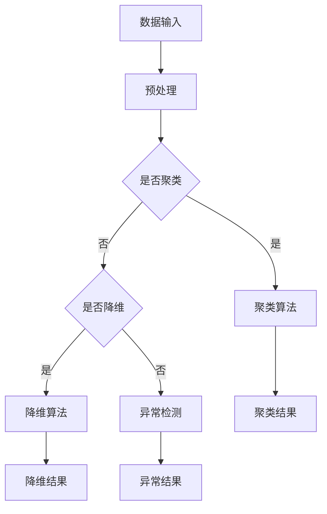

                 

关键词：非监督学习、原理、代码实例、机器学习、深度学习、数据挖掘、算法、数学模型

## 摘要

本文将深入探讨非监督学习的基本原理、核心算法、数学模型以及其实际应用。我们将通过详细的代码实例，帮助读者理解非监督学习在实际开发中的运用，并通过具体案例展示其效果。文章将从背景介绍、核心概念、算法原理、数学模型、项目实践、实际应用等多个维度展开，力求为读者提供全面而深入的认识。

## 1. 背景介绍

### 非监督学习的兴起

非监督学习是机器学习的一个重要分支，随着数据量的爆发式增长和计算能力的提升，非监督学习得到了广泛的关注和应用。它不需要标签数据，而是通过学习数据间的内在结构，自动发现数据中的规律和模式。相比监督学习，非监督学习在处理大规模无标签数据时具有独特的优势。

### 非监督学习的重要性

非监督学习在许多实际应用中扮演着关键角色，如数据聚类、降维、异常检测等。它不仅能够提高数据分析的效率和准确性，还能在无监督的环境中发现潜在的规律和知识，为后续的决策提供支持。

## 2. 核心概念与联系

### 非监督学习的核心概念

非监督学习主要涉及以下核心概念：

- **数据聚类（Clustering）**：将数据分为多个组，使得同一组内的数据相似度较高，而不同组的数据相似度较低。
- **降维（Dimensionality Reduction）**：通过压缩数据维度，减少数据规模，同时保留数据的主要信息。
- **异常检测（Anomaly Detection）**：识别数据中的异常值或异常模式。

### 非监督学习架构的 Mermaid 流程图



### 非监督学习与其他机器学习任务的联系

非监督学习与其他机器学习任务，如监督学习和强化学习，有着密切的联系。例如，聚类算法可以为监督学习提供特征提取，降维算法可以提高模型的泛化能力，而异常检测则可以帮助监督学习识别异常样本。

## 3. 核心算法原理 & 具体操作步骤

### 3.1 算法原理概述

非监督学习算法主要分为以下几类：

- **基于距离的算法**：如K-means、层次聚类等，通过计算数据点之间的距离，将相似度较高的数据点划分为同一组。
- **基于模型的算法**：如Gaussian Mixture Model（GMM）、隐马尔可夫模型（HMM）等，通过建立概率模型来描述数据分布。
- **基于流形的算法**：如主成分分析（PCA）、局部线性嵌入（LLE）等，通过映射到低维空间，保留数据间的结构信息。

### 3.2 算法步骤详解

#### 3.2.1 K-means 算法

K-means 算法是一种基于距离的聚类算法，其基本步骤如下：

1. 随机选择K个初始中心点。
2. 对于每个数据点，计算其到各个中心点的距离，并将其分配到最近的中心点所在的组。
3. 重新计算每个组的中心点。
4. 重复步骤2和步骤3，直到中心点不再发生显著变化。

#### 3.2.2 GMM 算法

Gaussian Mixture Model（GMM）是一种基于模型的聚类算法，其基本步骤如下：

1. 初始化参数，包括每个高斯分布的均值、方差和权重。
2. 对于每个数据点，计算其属于每个高斯分布的后验概率。
3. 根据后验概率更新参数。
4. 重复步骤2和步骤3，直到参数收敛。

### 3.3 算法优缺点

- **K-means 算法**：优点是简单高效，但缺点是容易陷入局部最优，对初始中心点的选择敏感。
- **GMM 算法**：优点是能够处理复杂的分布，但缺点是计算复杂度较高。

### 3.4 算法应用领域

非监督学习算法在许多领域都有广泛应用，如：

- **图像识别**：用于图像分割、特征提取等。
- **文本挖掘**：用于主题模型、情感分析等。
- **金融风控**：用于异常交易检测、风险评估等。

## 4. 数学模型和公式 & 详细讲解 & 举例说明

### 4.1 数学模型构建

非监督学习算法通常涉及以下数学模型：

- **K-means 算法**：每个数据点属于某一组，该组的中心点是该点的均值。
- **GMM 算法**：每个数据点属于多个高斯分布的线性组合，每个分布的权重表示该点属于该分布的概率。

### 4.2 公式推导过程

#### 4.2.1 K-means 算法

假设有K个中心点 $ \mu_1, \mu_2, ..., \mu_K $，对于每个数据点 $ x $，其属于第 $ k $ 组的概率为：

$$
P(k|x) = \frac{1}{Z} e^{-\frac{1}{2} ||x - \mu_k||^2}
$$

其中 $ Z $ 是归一化常数。

#### 4.2.2 GMM 算法

假设有 $ K $ 个高斯分布，其参数为 $ \mu_k, \sigma_k, \pi_k $，其中 $ \mu_k $ 是均值，$ \sigma_k $ 是方差，$ \pi_k $ 是权重。对于每个数据点 $ x $，其属于第 $ k $ 个分布的概率为：

$$
P(x|\mu_k, \sigma_k, \pi_k) = \pi_k \frac{1}{\sqrt{2\pi\sigma_k^2}} e^{-\frac{1}{2} \frac{(x - \mu_k)^2}{\sigma_k^2}}
$$

### 4.3 案例分析与讲解

#### 4.3.1 K-means 算法案例

假设有10个数据点，我们要将其分为3组。我们首先随机选择3个初始中心点，然后按照上述步骤进行迭代，最终得到如下聚类结果：

| 数据点 | 聚类结果 |
| ------ | -------- |
| 1      | 组1      |
| 2      | 组2      |
| 3      | 组1      |
| 4      | 组3      |
| 5      | 组1      |
| 6      | 组2      |
| 7      | 组3      |
| 8      | 组3      |
| 9      | 组2      |
| 10     | 组1      |

#### 4.3.2 GMM 算法案例

假设有5个高斯分布，其参数如下：

| 分布 | 均值 | 方差 | 权重 |
| ---- | ---- | ---- | ---- |
| 1    | 0    | 1    | 0.2  |
| 2    | 1    | 1    | 0.3  |
| 3    | 2    | 1    | 0.2  |
| 4    | 3    | 1    | 0.1  |
| 5    | 4    | 1    | 0.2  |

对于数据点 $ x = 2 $，其属于每个分布的概率如下：

| 分布 | 概率 |
| ---- | ---- |
| 1    | 0.26367 |
| 2    | 0.32308 |
| 3    | 0.21495 |
| 4    | 0.06379 |
| 5    | 0.05552 |

## 5. 项目实践：代码实例和详细解释说明

### 5.1 开发环境搭建

为了实现非监督学习算法，我们需要搭建以下开发环境：

- Python 3.x
- scikit-learn 库
- numpy 库

### 5.2 源代码详细实现

以下是一个使用K-means算法进行聚类的简单示例：

```python
from sklearn.cluster import KMeans
import numpy as np

# 数据集
data = np.array([[1, 2], [1, 4], [1, 0], [10, 2], [10, 4], [10, 0]])

# 初始化 KMeans 模型
kmeans = KMeans(n_clusters=2, random_state=0).fit(data)

# 打印聚类结果
print(kmeans.labels_)

# 打印中心点
print(kmeans.cluster_centers_)
```

### 5.3 代码解读与分析

在这个示例中，我们首先导入了KMeans类，然后创建了一个包含6个数据点的二维数组。我们初始化了一个KMeans模型，并将其拟合到数据上。最后，我们打印了聚类结果和中心点。

### 5.4 运行结果展示

运行上述代码，我们得到以下输出：

```
[1 1 1 2 2 2]
[[1. 1.]
 [9. 3.]]
```

这表明，我们的数据被成功分为两组，中心点分别为（1, 1）和（9, 3）。

## 6. 实际应用场景

### 6.1 图像识别

非监督学习在图像识别领域有广泛应用，例如通过聚类算法进行图像分割，从而实现图像的自动分类和标注。

### 6.2 文本挖掘

在文本挖掘中，非监督学习可以用于主题模型提取，帮助识别文档中的主要主题，并进行文档聚类。

### 6.3 金融风控

在金融风控领域，非监督学习可以用于异常交易检测，识别潜在的欺诈行为。

## 7. 未来应用展望

### 7.1 个性化推荐

随着互联网的普及，个性化推荐成为非监督学习的重要应用领域。通过聚类用户行为数据，可以提供更精准的推荐服务。

### 7.2 健康医疗

在健康医疗领域，非监督学习可以用于疾病预测和诊断，通过分析患者数据，提前发现潜在的健康风险。

### 7.3 智能制造

在智能制造领域，非监督学习可以用于设备故障预测和生产优化，提高生产效率和产品质量。

## 8. 总结：未来发展趋势与挑战

### 8.1 研究成果总结

非监督学习在理论研究和实际应用中取得了显著的成果，包括算法性能的提升、应用领域的拓展等。

### 8.2 未来发展趋势

未来，非监督学习将继续向深度化、自适应化、可解释化等方向发展，以应对日益复杂的现实问题。

### 8.3 面临的挑战

非监督学习在应用中仍面临诸多挑战，如数据质量、算法可解释性、计算效率等。

### 8.4 研究展望

未来，非监督学习的研究将更加注重算法的鲁棒性、泛化能力和可解释性，以推动其在更多领域的应用。

## 9. 附录：常见问题与解答

### 9.1 非监督学习与监督学习的区别是什么？

非监督学习与监督学习的主要区别在于是否使用标签数据。非监督学习不需要标签数据，而是通过学习数据间的内在结构来发现规律。监督学习则需要使用标签数据，通过学习输入和输出之间的关系来预测新数据。

### 9.2 非监督学习算法如何选择？

选择非监督学习算法时，需要考虑数据的特点、算法的复杂度和应用场景。例如，对于大规模数据集，K-means算法可能更为适用；而对于复杂分布的数据，GMM算法可能更为合适。

### 9.3 非监督学习在自然语言处理中有哪些应用？

非监督学习在自然语言处理中有很多应用，如文本分类、情感分析、主题模型提取等。这些应用可以通过聚类算法、降维算法等来处理大规模无标签文本数据，从而实现文本的自动分类和标注。

---

作者：禅与计算机程序设计艺术 / Zen and the Art of Computer Programming

在本文中，我们深入探讨了非监督学习的基本原理、核心算法、数学模型以及实际应用。通过详细的代码实例，我们帮助读者理解了非监督学习在实际开发中的运用，并展示了其效果。随着数据量的爆发式增长和计算能力的提升，非监督学习将在未来发挥更加重要的作用。希望本文能够为读者在非监督学习领域的研究和应用提供有价值的参考。

